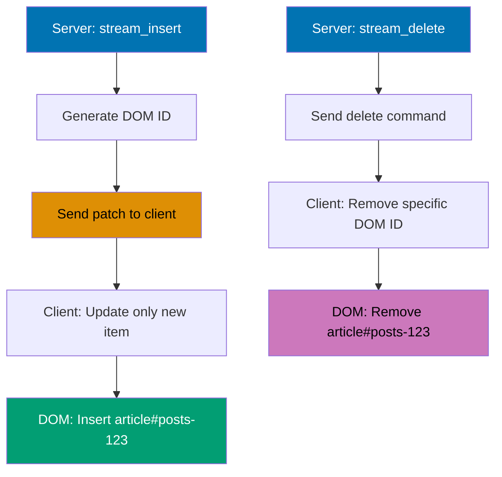
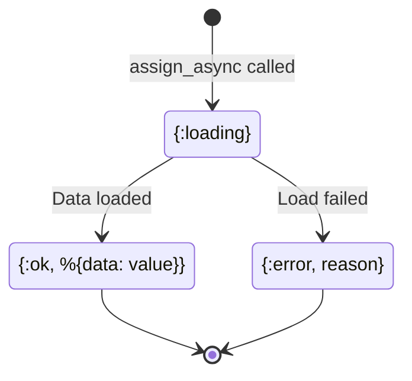
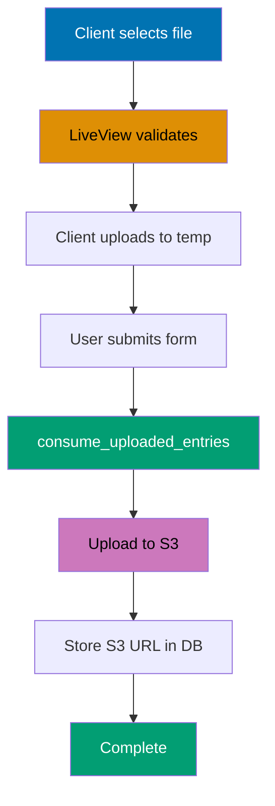
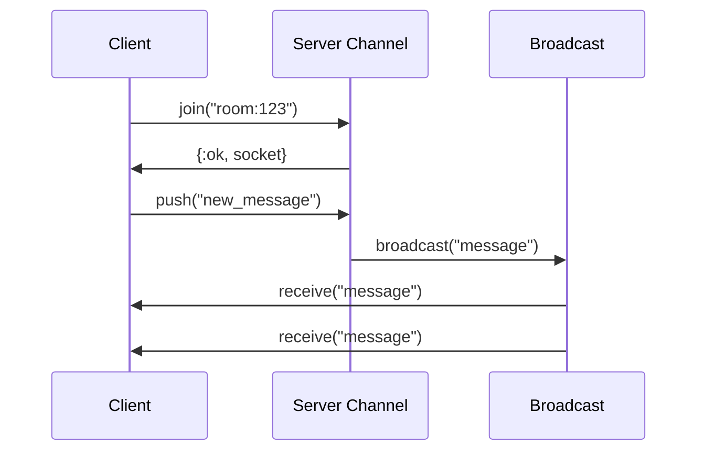
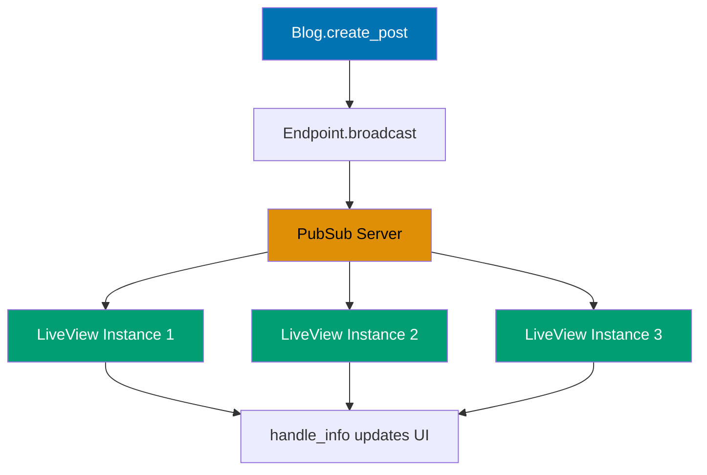
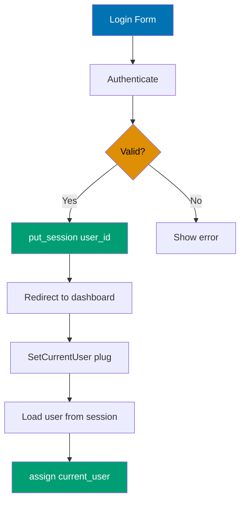
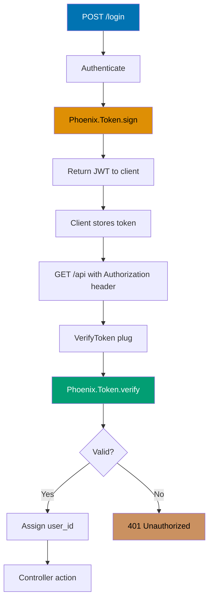
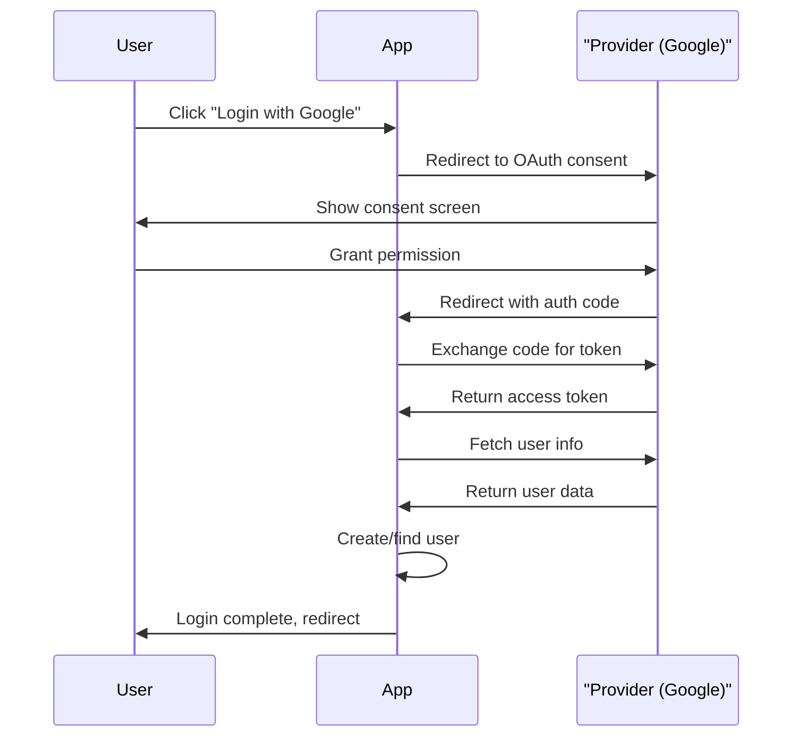
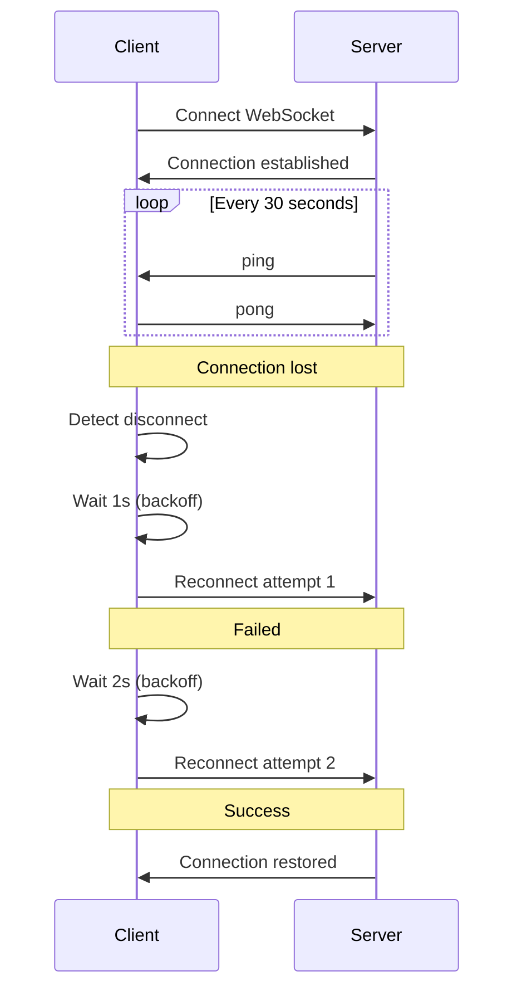

## Group 5: Advanced LiveView

### Example 26: LiveView Streams

Streams efficiently update lists without re-rendering the entire collection. Each stream item gets a unique ID for targeted updates.



```elixir
defmodule MyAppWeb.PostsLive.Index do   # => LiveView for post listing with streams
  use Phoenix.LiveView                   # => Imports LiveView behavior

  def mount(_params, _session, socket) do
                                          # => Called when LiveView connects
    {:ok,
     socket
     |> assign(:posts, [])               # => Legacy assign (not used with streams)
     |> stream(:posts, MyApp.Blog.list_posts())}
                                          # => Initializes stream with post list
                                          # => stream/3 sets up @streams.posts
                                          # => Each item gets unique DOM ID
                                          # => Fetches all posts from database
  end

  def render(assigns) do                 # => Renders post list with stream
    ~H"""
    <div id="posts" phx-update="stream">
                                          # => phx-update="stream" enables stream mode
                                          # => LiveView only updates changed items
                                          # => Not full list re-render
      <!-- Streams each item with unique ID -->
      <%= for {dom_id, post} <- @streams.posts do %>
                                          # => Iterates stream tuples
                                          # => dom_id is "posts-123" (auto-generated)
                                          # => post is %Post{} struct
        <article id={dom_id}>            # => DOM ID must match stream ID
                                          # => Enables targeted updates
          <h2><%= post.title %></h2>     # => Displays post title
        </article>
      <% end %>
    </div>
    """
  end

  def handle_info({:post_created, post}, socket) do
                                          # => Receives broadcast message
                                          # => Triggered when new post created
    {:noreply, stream_insert(socket, :posts, post)}
                                          # => Adds post to stream
                                          # => Only sends new post to client
                                          # => Client inserts <article> DOM node
                                          # => Doesn't re-render entire list
  end

  def handle_info({:post_deleted, post_id}, socket) do
                                          # => Receives delete broadcast
    {:noreply, stream_delete_by_dom_id(socket, :posts, "posts-#{post_id}")}
                                          # => Removes post from stream
                                          # => stream_delete_by_dom_id/3 targets specific DOM ID
                                          # => "posts-123" matches <article id="posts-123">
                                          # => Client removes DOM node
  end
end

# Subscribe to real-time updates
def mount(_params, _session, socket) do  # => Alternative mount with PubSub
  MyAppWeb.Endpoint.subscribe("posts")   # => Subscribes to "posts" topic
                                          # => Receives broadcasts from this topic
                                          # => handle_info/2 handles messages
  {:ok, stream(socket, :posts, MyApp.Blog.list_posts())}
                                          # => Initializes stream
                                          # => Returns socket with stream configured
end
```

**Key Takeaway**: Streams use phx-update="stream" for efficient list rendering. stream_insert/3 adds items. stream_delete_by_dom_id/3 removes items. Only modified items are updated on the page.

**Why It Matters**: Streams provide efficient handling of large collections in LiveView. This pattern prevents memory issues when displaying many items.

### Example 27: Async Operations with Loading States

Load data asynchronously without blocking the page. Show loading states while waiting.



```elixir
defmodule MyAppWeb.DataLive do           # => LiveView with async data loading
  use Phoenix.LiveView                   # => Imports LiveView behavior

  def mount(_params, _session, socket) do
                                          # => Called when LiveView connects
    {:ok,
     socket
     |> assign(:result, nil, :loading)   # => Sets initial loading state
                                          # => :loading is placeholder value
     |> assign_async(:data, fn -> {:ok, %{data: fetch_expensive_data()}} end)}
                                          # => Starts async task immediately
                                          # => fn -> ... end runs in separate process
                                          # => fetch_expensive_data() executes async
                                          # => Returns {:ok, %{data: ...}} on success
  end                                    # => Returns {:ok, socket} immediately
                                          # => Doesn't block page render

  def render(assigns) do                 # => Renders with async state handling
    ~H"""
    <div>
      <%= case @data do %>               # => Pattern matches async state
                                          # => @data changes as async progresses
        <% {:loading} -> %>              # => While async task running
                                          # => Initial state from assign_async
          <p>Loading...</p>              # => Shows loading indicator

        <% {:ok, %{data: data}} -> %>    # => Async task completed successfully
                                          # => Extracts data from result map
          <p><%= data %></p>             # => Displays loaded data

        <% {:error, reason} -> %>        # => Async task failed
                                          # => Catches exceptions/errors
          <p>Error: <%= reason %></p>    # => Shows error message
      <% end %>
    </div>
    """
  end

  defp fetch_expensive_data do           # => Simulates slow operation
    Process.sleep(2000)                  # => Blocks for 2 seconds
                                          # => Simulates API call, DB query
    "Data loaded!"                       # => Returns result string
  end                                    # => Runs in separate process
                                          # => Doesn't block UI rendering

end

# Or using start_async for event-triggered async work
def handle_event("search", %{"query" => query}, socket) do
                                          # => Handles search button click
                                          # => query is user input string
  {:noreply,
   start_async(socket, :search, fn ->    # => Starts named async task
                                          # => :search is task identifier
                                          # => fn -> ... end runs async
     results = MyApp.Search.query(query) # => Executes search operation
                                          # => Potentially slow operation
     {:ok, results}                      # => Returns success tuple
   end)}                                 # => Task runs in background
end                                      # => Returns immediately, no blocking

def handle_async(:search, {:ok, results}, socket) do
                                          # => Called when :search task completes
                                          # => {:ok, results} is task return value
  {:noreply, assign(socket, :results, results)}
                                          # => Updates socket with search results
                                          # => Triggers re-render with results
end
```

**Key Takeaway**: assign_async/3 loads data when component mounts. start_async/3 performs async work on demand. Render different content based on async state (:loading, :ok, :error).

**Why It Matters**: Form handling provides data binding and validation. Phoenix forms streamline user input handling with automatic CSRF protection.

### Example 28: LiveView File Uploads with External Storage

Upload files to external services like Amazon S3 instead of storing locally.



```elixir
defmodule MyAppWeb.ProfileLive.Edit do   # => LiveView for profile photo uploads
  use Phoenix.LiveView                   # => Imports LiveView behavior

  def mount(_params, _session, socket) do
                                          # => Called when LiveView connects
    {:ok,
     socket
     |> assign(:uploaded_files, [])      # => Initializes empty upload list
                                          # => Tracks completed uploads
     |> allow_upload(:photo,             # => Registers :photo upload configuration
                                          # => Creates @uploads.photo in assigns
       accept: ~w(.jpg .jpeg .png),      # => Restricts to image types
                                          # => Client-side validation
                                          # => ~w sigil creates string list
       max_entries: 5,                   # => Allows up to 5 files
                                          # => User can select multiple
       max_file_size: 10_000_000)}       # => 10MB = 10,000,000 bytes
                                          # => Validates file size client-side
  end

  def render(assigns) do                 # => Renders upload form
    ~H"""
    <form phx-submit="save">             # => Triggers "save" event on submit
      <.live_file_input upload={@uploads.photo} />
                                          # => Renders file input for :photo
                                          # => Bound to upload configuration

      <%= for entry <- @uploads.photo.entries do %>
                                          # => Iterates selected files
                                          # => entry contains file metadata
        <div>
          <.live_img_preview entry={entry} />
                                          # => Shows image preview
                                          # => Client-side preview (no upload yet)
          <button phx-click="cancel_upload" phx-value-ref={entry.ref}>Cancel</button>
                                          # => phx-click triggers event
                                          # => phx-value-ref passes entry reference
          <progress value={entry.progress} max="100" />
                                          # => HTML5 progress bar
                                          # => entry.progress is 0-100
                                          # => Updates during upload
        </div>
      <% end %>

      <button type="submit">Save</button>
                                          # => Triggers phx-submit="save"
    </form>
    """
  end

  def handle_event("cancel_upload", %{"ref" => ref}, socket) do
                                          # => Handles cancel button click
                                          # => ref identifies specific entry
    {:noreply, cancel_upload(socket, :photo, ref)}
                                          # => Removes entry from upload queue
                                          # => Deletes temporary file
  end

  def handle_event("save", _params, socket) do
                                          # => Handles form submission
    uploaded_files =
      consume_uploaded_entries(socket, :photo, fn %{path: path}, entry ->
                                          # => Processes each uploaded file
                                          # => path is temp file location
                                          # => entry contains metadata
        # Generate S3 pre-signed URL for client upload
        key = "uploads/#{entry.client_name}"
                                          # => S3 object key (path in bucket)
                                          # => entry.client_name is original filename
        url = MyApp.S3.get_presigned_url(key)
                                          # => Generates pre-signed URL
                                          # => Allows temporary upload access
                                          # => URL expires after timeout

        # Upload file directly from client to S3
        {:ok, _} = MyApp.S3.put_object(key, File.read!(path))
                                          # => Reads temp file contents
                                          # => Uploads to S3 bucket
                                          # => File.read! raises on error

        {:ok, %{name: entry.client_name, url: url}}
                                          # => Returns success tuple
                                          # => Map contains filename and URL
      end)                               # => Collects all upload results
                                          # => uploaded_files is list of maps

    {:noreply, assign(socket, :uploaded_files, uploaded_files)}
                                          # => Stores upload results
                                          # => uploaded_files available in template
  end
end
```

**Key Takeaway**: allow_upload/2 restricts file types and sizes client-side. consume_uploaded_entries/3 processes files after submission. Upload to S3 or other external storage instead of local filesystem.

**Why It Matters**: Process-based architecture enables horizontal scaling and fault isolation. Understanding OTP processes is key to building highly available systems.

### Example 29: Stateful Live Components

Live components manage isolated state. Events target only that component, not the parent.

```elixir
defmodule MyAppWeb.ShoppingCart do      # => Stateful live component
  use Phoenix.LiveComponent             # => Imports LiveComponent behavior
                                          # => Different from LiveView

  @impl true                             # => Marks callback implementation
  def mount(socket) do                   # => Called once per component instance
                                          # => socket is component's own socket
    {:ok, assign(socket, items: [], total: 0)}
                                          # => Initializes component state
                                          # => items is empty list
                                          # => total starts at 0
  end                                    # => Each instance has separate state
                                          # => Multiple components don't share state

  @impl true
  def handle_event("add_item", %{"product_id" => id}, socket) do
                                          # => Handles add button click
                                          # => id from phx-value-product_id
    product = MyApp.Catalog.get_product!(id)
                                          # => Fetches product from database
                                          # => Raises if not found
    items = [product | socket.assigns.items]
                                          # => Prepends product to items list
                                          # => [new_item | old_items]
    total = socket.assigns.total + product.price
                                          # => Adds price to running total
                                          # => Decimal/Money math

    {:noreply, assign(socket, items: items, total: total)}
                                          # => Updates component state only
                                          # => Triggers component re-render
  end                                    # => Parent LiveView NOT affected
                                          # => Isolated state change

  @impl true
  def handle_event("remove_item", %{"product_id" => id}, socket) do
                                          # => Handles remove button click
    product = MyApp.Catalog.get_product!(id)
                                          # => Re-fetches for price info
    items = Enum.reject(socket.assigns.items, &(&1.id == id))
                                          # => Filters out matching product
                                          # => &(&1.id == id) is anonymous function
                                          # => Returns new list without item
    total = socket.assigns.total - product.price
                                          # => Subtracts price from total

    {:noreply, assign(socket, items: items, total: total)}
                                          # => Updates component state
  end

  @impl true
  def render(assigns) do                 # => Renders component template
    ~H"""
    <div id="cart">                      # => Container for component
      <h2>Cart (<%= length(@items) %> items)</h2>
                                          # => Shows item count
                                          # => length/1 counts list elements
      <ul>
        <%= for item <- @items do %>     # => Iterates cart items
          <li>
            <%= item.name %> - $<%= item.price %>
                                          # => Displays item details
            <button phx-click="remove_item" phx-value-product_id={item.id} phx-target={@myself}>
                                          # => phx-click triggers event
                                          # => phx-value- passes data
                                          # => phx-target={@myself} routes to THIS component
                                          # => Without @myself, goes to parent LiveView
              Remove
            </button>
          </li>
        <% end %>
      </ul>
      <p>Total: $<%= @total %></p>       # => Shows running total
    </div>
    """
  end
end

# Parent uses live_component to render
def parent_render(assigns) do            # => Parent LiveView template
  ~H"""
  <%= live_component(MyAppWeb.ShoppingCart, id: "cart") %>
                                          # => Renders LiveComponent
                                          # => id: "cart" identifies instance
                                          # => Required for stateful components
                                          # => Each id creates separate state
  """
end
```

**Key Takeaway**: Live components have their own state via assign/2. Events target component using phx-target={@myself}. Each component instance maintains separate state.

**Why It Matters**: Function components enable reusable UI building blocks with clear interfaces. This pattern improves maintainability and consistency across your application.

### Example 30: LiveView JS Interop with Phoenix.LiveView.JS

Trigger JavaScript from LiveView without custom JS. Use Phoenix.LiveView.JS for common patterns.

```elixir
defmodule MyAppWeb.ModalLive do          # => LiveView with JS commands
  use Phoenix.LiveView                   # => Imports LiveView behavior

  def render(assigns) do                 # => Renders modal with JS
    ~H"""
    <div>
      <button phx-click={JS.show(to: "#modal")}>Open Modal</button>
                                          # => phx-click accepts JS command
                                          # => JS.show/1 makes element visible
                                          # => to: "#modal" targets DOM selector
                                          # => No server roundtrip needed

      <div id="modal" class="modal" style="display: none;">
                                          # => Initially hidden modal
                                          # => style="display: none;" hides element
        <h2>Modal Title</h2>

        <button phx-click={
          JS.hide(to: "#modal")          # => First: hide modal
                                          # => JS.hide/1 sets display: none
          |> JS.push("close_modal")      # => Then: send server event
                                          # => Chains JS commands with |>
                                          # => JS.push/1 triggers server handler
        }>
          Close
        </button>
      </div>
    </div>
    """
  end

  def handle_event("close_modal", _params, socket) do
                                          # => Handles server-side close event
                                          # => Triggered after JS.hide completes
    {:noreply, socket}                   # => No state changes needed
                                          # => DOM already hidden by JS
  end
end

# Chaining multiple JS commands
action = JS.push("validate")             # => Starts chain with server event
                                          # => Sends "validate" to handle_event
  |> JS.show(to: "#spinner")             # => Shows loading spinner
                                          # => DOM manipulation
  |> JS.add_class("error", to: "#field") # => Adds CSS class to field
                                          # => to: "#field" targets input
  |> JS.transition({"fade-in", "duration-500"}, time: 500)
                                          # => Applies CSS transition
                                          # => "fade-in" is CSS class
                                          # => time: 500 is animation duration (ms)

<button phx-click={action}>Submit</button>
                                          # => Executes all chained commands
                                          # => Commands run sequentially
```

**Key Takeaway**: JS.show/2, JS.hide/2, JS.add_class/2, JS.remove_class/2 manipulate DOM. Chain multiple commands together. Use JS.push/1 to send server event alongside DOM changes.

**Why It Matters**: Event-driven patterns decouple components and enable scalable architectures. Understanding events is key to building maintainable Phoenix applications.

### Example 31: Optimistic UI Updates with Rollback

Update the UI immediately (optimistic), then rollback if the server operation fails.

```elixir
defmodule MyAppWeb.PostLive do           # => LiveView with optimistic updates
  use Phoenix.LiveView                   # => Imports LiveView behavior

  def render(assigns) do                 # => Renders post with like button
    ~H"""
    <article>
      <h2><%= @post.title %></h2>        # => Post title
      <p>Likes: <%= @post.likes %></p>   # => Shows current like count
                                          # => Updates immediately on click

      <!-- Optimistically increment, rollback on error -->
      <button phx-click="like" phx-value-post_id={@post.id}>
                                          # => phx-click triggers event
                                          # => phx-value- passes post ID
        Like
      </button>
    </article>
    """
  end

  def handle_event("like", %{"post_id" => id}, socket) do
                                          # => Handles like button click
    post = socket.assigns.post           # => Gets current post from assigns

    # Update UI immediately (optimistic)
    updated_post = %{post | likes: post.likes + 1}
                                          # => Map update syntax
                                          # => Increments likes immediately
                                          # => User sees instant feedback
    socket = assign(socket, :post, updated_post)
                                          # => Updates socket with new post
                                          # => Triggers re-render immediately

    case MyApp.Blog.increment_likes(post) do
                                          # => Attempts database update
                                          # => Happens AFTER UI update
      {:ok, _} ->                        # => Server confirmed success
        # Server confirmed - keep the change
        {:noreply, socket}               # => UI already updated
                                          # => No rollback needed

      {:error, _reason} ->               # => Server operation failed
        # Server failed - rollback to original
        {:noreply, assign(socket, :post, post)}
                                          # => Restores original post
                                          # => Reverts likes count
                                          # => User sees rollback
    end
  end
end
```

**Key Takeaway**: Update assigns immediately for fast UI response. If server operation fails, restore original values. Users see instant feedback without waiting for server confirmation.

**Why It Matters**: This Phoenix pattern is fundamental for building production web applications. Understanding this concept enables you to create robust, maintainable, and scalable applications.

## Group 6: Real-Time Features

### Example 32: Phoenix Channels - Basic Communication

Channels provide real-time bidirectional WebSocket communication for features like chat and notifications.



```elixir
# lib/my_app_web/channels/room_channel.ex
defmodule MyAppWeb.RoomChannel do        # => Channel for chat rooms
  use Phoenix.Channel                    # => Imports Channel behavior
                                          # => Provides join, handle_in callbacks

  @impl true                             # => Marks callback implementation
  def join("room:" <> room_id, _message, socket) do
                                          # => Handles channel join request
                                          # => "room:" <> room_id pattern matches topic
                                          # => room_id extracted from "room:123"
    {:ok, assign(socket, :room_id, room_id)}
                                          # => Returns success tuple
                                          # => Stores room_id in socket assigns
                                          # => User now subscribed to room
  end                                    # => Client receives {:ok, ...} response

  @impl true
  def handle_in("new_message", %{"body" => body}, socket) do
                                          # => Handles incoming message event
                                          # => "new_message" is event name
                                          # => %{"body" => ...} from client
    # Broadcast to all users in the room
    broadcast(socket, "message", %{body: body, user_id: socket.assigns.user_id})
                                          # => Sends to ALL users in same topic
                                          # => "message" is event name
                                          # => Includes sender's user_id
                                          # => Sender also receives own message
    {:noreply, socket}                   # => No individual reply to sender
                                          # => Broadcast already sent message
  end

  @impl true
  def handle_in("typing", _params, socket) do
                                          # => Handles typing indicator event
    broadcast_from(socket, "user_typing", %{user_id: socket.assigns.user_id})
                                          # => Sends to all EXCEPT sender
                                          # => broadcast_from excludes sender socket
                                          # => Prevents echo to typing user
                                          # => "user_typing" event with user_id
    {:noreply, socket}                   # => No reply to sender
  end
end

# Client-side subscription (in JavaScript or LiveView)
<script>
let channel = socket.channel("room:123", {})

channel.join()
  .receive("ok", resp => console.log("Joined", resp))

channel.on("message", payload => {
  console.log("Message:", payload.body)
})

document.getElementById("send").addEventListener("click", () => {
  channel.push("new_message", {body: input.value})
})
</script>
```

**Key Takeaway**: Channels are named "topic:subtopic". join/3 handles subscription. broadcast/3 sends to all users. handle_in/3 processes incoming messages. Perfect for real-time collaboration.

**Why It Matters**: Channels provide WebSocket-based rooms for grouped real-time communication. This is the foundation for multi-user interactive features.

### Example 33: PubSub for LiveView Updates

PubSub delivers messages across the system. LiveView components subscribe to topics and update when messages arrive.



```elixir
defmodule MyAppWeb.PostsLive.List do     # => LiveView subscribing to PubSub
  use Phoenix.LiveView                   # => Imports LiveView behavior

  def mount(_params, _session, socket) do
                                          # => Called when LiveView connects
    # Subscribe to "posts" topic
    MyAppWeb.Endpoint.subscribe("posts") # => Subscribes to PubSub topic
                                          # => "posts" is topic name
                                          # => Receives all broadcasts to this topic

    posts = MyApp.Blog.list_posts()      # => Fetches initial post list
                                          # => Returns [%Post{}, %Post{}, ...]
    {:ok, stream(socket, :posts, posts)} # => Initializes stream
                                          # => Sets up @streams.posts
  end                                    # => handle_info will receive broadcasts

  def render(assigns) do                 # => Renders post list
    ~H"""
    <div id="posts" phx-update="stream">
                                          # => phx-update="stream" for efficient updates
      <%= for {dom_id, post} <- @streams.posts do %>
                                          # => Iterates stream tuples
        <article id={dom_id}>            # => DOM ID for targeted updates
          <h2><%= post.title %></h2>     # => Post title
        </article>
      <% end %>
    </div>
    """
  end

  @impl true
  def handle_info({:post_created, post}, socket) do
                                          # => Receives broadcast message
                                          # => {:post_created, post} tuple from broadcast
    {:noreply, stream_insert(socket, :posts, post, at: 0)}
                                          # => Adds post to stream
                                          # => at: 0 inserts at beginning
                                          # => Updates UI without full re-render
  end                                    # => All subscribed LiveViews update

  @impl true
  def handle_info({:post_updated, post}, socket) do
                                          # => Receives post update broadcast
    {:noreply, stream_insert(socket, :posts, post)}
                                          # => Updates existing post
                                          # => Stream finds by post.id and replaces
  end                                    # => UI shows updated content

  @impl true
  def handle_info({:post_deleted, post_id}, socket) do
                                          # => Receives delete broadcast
    {:noreply, stream_delete_by_dom_id(socket, :posts, "posts-#{post_id}")}
                                          # => Removes from stream by DOM ID
                                          # => "posts-123" matches article id
                                          # => UI removes element
  end                                    # => All users see deletion instantly
end

# When a post is created (in your context)
defmodule MyApp.Blog do                  # => Context module for blog domain
  def create_post(attrs) do              # => Creates new post
    case Repo.insert(changeset) do       # => Attempts database insert
      {:ok, post} ->                     # => Insert succeeded
        MyAppWeb.Endpoint.broadcast("posts", "post_created", post)
                                          # => Broadcasts to all subscribers
                                          # => "posts" topic
                                          # => "post_created" event type
                                          # => post is payload
        {:ok, post}                      # => Returns success tuple

      {:error, changeset} ->             # => Insert failed
        {:error, changeset}              # => Returns error
                                          # => No broadcast on error
    end
  end
end
```

**Key Takeaway**: Endpoint.subscribe/1 listens to topic. Endpoint.broadcast/3 publishes messages. handle_info/2 receives broadcasts. Multiple LiveView instances stay synchronized.

**Why It Matters**: LiveView enables real-time interactivity without JavaScript complexity. Server-rendered updates reduce client-side bugs and simplify state management.

### Example 34: Presence Tracking

Track which users are online and what they're doing. Presence automatically cleans up when users disconnect.

```elixir
defmodule MyAppWeb.Presence do           # => Presence module for user tracking
  use Phoenix.Presence,                  # => Uses Phoenix.Presence behavior
    otp_app: :my_app,                    # => Links to application
    pubsub_server: MyApp.PubSub          # => Uses app's PubSub server
                                          # => Broadcasts presence updates
end

# Track user presence
defmodule MyAppWeb.RoomChannel do        # => Channel with presence tracking
  use Phoenix.Channel                    # => Imports Channel behavior
  alias MyAppWeb.Presence                # => Shortcuts Presence module

  def join("room:" <> room_id, _params, socket) do
                                          # => Handles room join
    send(self(), :after_join)            # => Sends message to self
                                          # => Defers presence tracking
                                          # => Ensures join completes first
    {:ok, assign(socket, :room_id, room_id)}
                                          # => Returns success
                                          # => Stores room_id
  end

  def handle_info(:after_join, socket) do
                                          # => Receives :after_join message
                                          # => Called after successful join
    {:ok, _} =
      Presence.track(socket, "user:#{socket.assigns.user_id}", %{
                                          # => Tracks user in this socket's topic
                                          # => "user:1" is presence key
        user_id: socket.assigns.user_id, # => User identifier (database ID)
        username: socket.assigns.username, # => Display name for UI
        status: "online"                 # => Current status string
      })                                 # => Meta map with user data
                                          # => Registers presence in topic

    push(socket, "presence_state", Presence.list(socket))
                                          # => Sends current presence list to client
                                          # => "presence_state" event
                                          # => Client gets all online users
    {:noreply, socket}                   # => Returns socket
  end                                    # => Presence auto-removed on disconnect

end

# Get list of online users
onlineUsers = Presence.list("room:123")  # => Lists all users in topic
                                          # => "room:123" is PubSub topic
# => Returns map of presences:
# => %{
#   "user:1" => %{metas: [%{user_id: 1, username: "Alice", status: "online"}]},
                                          # => metas is list (supports multiple connections)
#   "user:2" => %{metas: [%{user_id: 2, username: "Bob", status: "online"}]}
# }
```

**Key Takeaway**: Presence.track/3 records user state. Presence.list/1 gets all users in topic. Automatically removes user when connection closes. Great for "who's online" features.

**Why It Matters**: Presence tracking enables user status and activity monitoring. This is essential for showing online users, typing indicators, and collaborative features.

### Example 35: Channel Authentication

Secure channels with authentication tokens. Only authenticated users can join sensitive channels.

```elixir
defmodule MyAppWeb.UserSocket do         # => Socket module for WebSocket connections
  use Phoenix.Socket                     # => Imports Socket behavior

  channel "room:*", MyAppWeb.RoomChannel # => Routes "room:*" topics to RoomChannel
                                          # => * wildcard matches any room ID
  channel "private:*", MyAppWeb.PrivateChannel
                                          # => Routes "private:*" to PrivateChannel

  @impl true
  def connect(%{"token" => token}, socket) do
                                          # => Called when client connects
                                          # => %{"token" => ...} from client params
    case verify_token(token) do          # => Verifies authentication token
                                          # => Checks signature and expiry
      {:ok, user_id} ->                  # => Token valid
        {:ok, assign(socket, user_id: user_id)}
                                          # => Returns success
                                          # => Stores user_id in socket assigns
                                          # => Connection allowed

      {:error, _reason} ->               # => Token invalid or expired
        :error                           # => Rejects connection
                                          # => Client cannot connect
    end
  end

  @impl true
  def id(socket), do: "user_socket:#{socket.assigns.user_id}"
                                          # => Generates unique socket ID
                                          # => Used for tracking connections
                                          # => Enables disconnect on logout

  defp verify_token(token) do            # => Private token verification
    Phoenix.Token.verify(socket, "user socket", token, max_age: 86400)
                                          # => Verifies token signature
                                          # => "user socket" is salt
                                          # => max_age: 86400 (24 hours in seconds)
                                          # => Returns {:ok, user_id} or {:error, reason}
  end
end

# Generate token in your controller
def login(conn, %{"email" => email, "password" => password}) do
                                          # => Handles login form submission
  case MyApp.Accounts.authenticate(email, password) do
                                          # => Validates credentials
    {:ok, user} ->                       # => Authentication successful
      token = Phoenix.Token.sign(conn, "user socket", user.id)
                                          # => Generates signed token
                                          # => Embeds user.id in token
                                          # => "user socket" is salt (must match verify)

      conn
      |> put_session(:user_token, token) # => Stores token in session
      |> render("login_success.html", user_token: token)
                                          # => Renders success page with token
                                          # => Client uses token for socket connection

    {:error, _} ->                       # => Authentication failed
      render(conn, "login_error.html")   # => Shows error page
  end
end
```

**Key Takeaway**: connect/2 authenticates socket connection using tokens. assign/2 stores user info. id/1 generates socket ID for tracking. Return :error to reject connection.

**Why It Matters**: Phoenix sockets enable efficient bidirectional communication for real-time features. This is essential for chat, notifications, and collaborative editing applications.

### Example 36: Channel Testing

Test channel behavior with ChannelCase. Assert messages, errors, and state changes.

```elixir
defmodule MyAppWeb.RoomChannelTest do    # => Test module for RoomChannel
  use MyAppWeb.ChannelCase              # => Imports channel testing helpers
                                          # => Provides subscribe_and_join, push, assert_*

  setup do                               # => Runs before each test
                                          # => Sets up test socket
    {:ok, _, socket} = subscribe_and_join(MyAppWeb.UserSocket, "room:123", %{})
                                          # => Connects to test socket
                                          # => Joins "room:123" channel
                                          # => Returns {:ok, reply, socket}
    {:ok, socket: socket}                # => Returns socket for tests
                                          # => Available as %{socket: socket} in tests
  end

  test "broadcast new_message", %{socket: socket} do
                                          # => Tests message broadcasting
                                          # => socket from setup/0
    push(socket, "new_message", %{"body" => "Hello"})
                                          # => Sends message to channel
                                          # => Triggers handle_in/3
    assert_broadcast("message", %{body: "Hello"})
                                          # => Asserts broadcast happened
                                          # => Verifies event name and payload
                                          # => Test passes if broadcast sent
  end

  test "handles join message", %{socket: socket} do
                                          # => Tests join behavior
    assert_push("presence_state", _)     # => Asserts server pushed message
                                          # => "presence_state" event expected
                                          # => _ matches any payload
                                          # => Verifies presence list sent
  end

  test "rejects unauthorized join" do    # => Tests authentication
                                          # => No socket from setup (independent test)
    assert {:error, _} = subscribe_and_join(MyAppWeb.UserSocket, "private:secret", %{})
                                          # => Attempts to join private channel
                                          # => Should return {:error, reason}
                                          # => Asserts join rejected
                                          # => Tests authorization logic
  end

  test "handle_in updates state", %{socket: socket} do
                                          # => Tests event handling
    push(socket, "typing", %{})          # => Sends typing event
                                          # => Empty payload map
    assert_broadcast("user_typing", _)   # => Asserts typing broadcast
                                          # => Verifies broadcast_from called
  end
end
```

**Key Takeaway**: ChannelCase provides testing utilities. subscribe_and_join/3 joins a channel. push/2 sends messages. assert_broadcast/2 verifies messages sent. assert_push/2 verifies server pushes.

**Why It Matters**: This Phoenix pattern is fundamental for building production web applications. Understanding this concept enables you to create robust, maintainable, and scalable applications.

## Group 7: Authentication & Authorization

### Example 37: Session-Based Authentication

Store user info in encrypted session after login. Session persists across requests.



```elixir
defmodule MyAppWeb.SessionController do  # => Controller for login/logout
  use MyAppWeb, :controller              # => Imports controller behavior
  alias MyApp.Accounts                   # => Shortcuts Accounts context

  def new(conn, _params) do              # => Renders login form
                                          # => GET /login route
    render(conn, "new.html")             # => Shows login page
  end

  def create(conn, %{"session" => %{"email" => email, "password" => password}}) do
                                          # => Handles login form submission
                                          # => POST /login route
    case Accounts.authenticate(email, password) do
                                          # => Verifies credentials
                                          # => Checks email + hashed password
      {:ok, user} ->                     # => Login successful
        conn
        |> put_session(:user_id, user.id)
                                          # => Stores user ID in encrypted cookie
                                          # => Session survives across requests
        |> put_flash(:info, "Welcome back!")
                                          # => Sets flash message
        |> redirect(to: ~p"/dashboard")  # => Redirects to dashboard
                                          # => Flash shown on dashboard page

      {:error, _} ->                     # => Login failed
        conn
        |> put_flash(:error, "Invalid credentials")
                                          # => Shows error message
        |> render("new.html")            # => Re-renders login form
                                          # => Error flash displayed
    end
  end                                    # => Session stored in signed cookie
                                          # => Client cannot tamper with session

  def delete(conn, _params) do           # => Handles logout
                                          # => DELETE /logout route
    conn
    |> delete_session(:user_id)          # => Removes user_id from session
                                          # => Clears authentication
    |> put_flash(:info, "Logged out")    # => Shows logout message
    |> redirect(to: ~p"/")               # => Redirects to homepage
  end
end

# Get current user from session
defmodule MyAppWeb.Plugs.SetCurrentUser do
                                          # => Plug to load current user
  def init(opts), do: opts               # => Initializes plug options
                                          # => Runs at compile time

  def call(conn, _opts) do               # => Called on each request
                                          # => Runs in plug pipeline
    user_id = get_session(conn, :user_id)
                                          # => Retrieves user_id from session
                                          # => Returns nil if not logged in
    user = if user_id, do: MyApp.Accounts.get_user!(user_id)
                                          # => Loads user if user_id exists
                                          # => nil if not logged in
    assign(conn, :current_user, user)    # => Makes @current_user available
                                          # => Templates can use @current_user
                                          # => Controllers can access conn.assigns.current_user
  end
end
```

**Key Takeaway**: put_session/3 stores data encrypted. get_session/2 retrieves data. delete_session/2 clears it. Sessions survive across requests but are specific to each browser.

**Why It Matters**: Session management enables stateful interactions in a stateless protocol. Understanding sessions is critical for authentication and user-specific features.

### Example 38: Password Hashing and Reset

Securely hash passwords before storing. Implement password reset with time-limited tokens.

```elixir
defmodule MyApp.Accounts.User do          # => User schema with security fields
  schema "users" do
    field :email, :string                  # => User's email address
    field :password, :string, virtual: true  # => Not stored in DB (virtual)
                                            # => Only exists in changeset
    field :password_hash, :string          # => Bcrypt hashed password (stored)
    field :password_reset_token, :string   # => Random token for reset link
    field :password_reset_at, :utc_datetime # => Token creation time
    timestamps()                            # => inserted_at, updated_at
  end

  def registration_changeset(user, attrs) do  # => Validates new user
    user
    |> cast(attrs, [:email, :password])     # => Extract email, password
    |> validate_required([:email, :password])  # => Both required
    |> unique_constraint(:email)            # => Email must be unique
    |> put_password_hash()                  # => Hash password before save
  end

  defp put_password_hash(changeset) do      # => Hashes password if valid
    case changeset do
      %Ecto.Changeset{valid?: true, changes: %{password: password}} ->
                                            # => Only hash if changeset valid
                                            # => Extract password from changes
        put_change(changeset, :password_hash, Bcrypt.hash_pwd_salt(password))
                                            # => Bcrypt.hash_pwd_salt generates hash
                                            # => Adds :password_hash to changeset

      changeset ->                          # => Invalid changeset
        changeset                           # => Return unchanged
    end
  end

  def password_reset_changeset(user) do     # => Creates reset token
    token = :crypto.strong_rand_bytes(32) |> Base.encode64()
                                            # => Generates 32 random bytes
                                            # => Encodes to base64 string
                                            # => token is "abc123..." (44 chars)

    user
    |> change(%{password_reset_token: token, password_reset_at: DateTime.utc_now()})
                                            # => Sets token and timestamp
                                            # => Returns changeset
  end
end

# Password reset flow
def reset_password_request(conn, %{"email" => email}) do
                                            # => User requests password reset
  case MyApp.Accounts.get_user_by_email(email) do
                                            # => Look up user by email
    user ->                                 # => User exists
      {:ok, user} = MyApp.Accounts.generate_password_reset_token(user)
                                            # => Create reset token
      send_reset_email(user)                # => Send email with token link
                                            # => Email contains reset URL
      {:ok, conn}                           # => Always return success

    nil ->                                  # => User not found
      {:ok, conn}                           # => Return success anyway
                                            # => Don't reveal if email exists (security)
  end
end

def reset_password(conn, %{"token" => token, "password" => password}) do
                                            # => User submits new password
  case MyApp.Accounts.get_user_by_reset_token(token) do
                                            # => Verify token valid
    {:ok, user} ->                          # => Token valid, user found
      MyApp.Accounts.update_password(user, %{password: password})
                                            # => Hash and save new password
      {:ok, conn}                           # => Password updated

    {:error, :expired} ->                   # => Token expired (>24 hours old)
      {:error, "Reset token expired"}       # => Return error message
  end
end
```

**Key Takeaway**: Hash passwords with Bcrypt before storing. Use random tokens for password reset. Store token expiration time. Don't reveal if email exists in system.

**Why It Matters**: This Phoenix pattern is fundamental for building production web applications. Understanding this concept enables you to create robust, maintainable, and scalable applications that leverage the full power of Elixir and OTP.

### Example 39: Role-Based Access Control

Restrict actions based on user roles. Use plugs for authorization checks.

```elixir
defmodule MyAppWeb.Plugs.RequireRole do  # => Authorization plug
  def init(opts) do                      # => Compile-time initialization
    Keyword.fetch!(opts, :role)          # => Extract required role
                                         # => role is :admin, :moderator, etc.
  end

  def call(conn, role) do                # => Runtime authorization check
    if has_role?(conn.assigns.current_user, role) do
                                         # => Check user has required role
      conn                               # => User authorized, continue
    else
      conn
      |> put_flash(:error, "Not authorized")  # => Set error message
      |> redirect(to: ~p"/")             # => Redirect to home
      |> halt()                          # => Stop pipeline execution
                                         # => Prevents controller action
    end
  end

  defp has_role?(%{role: user_role}, required_role) do
                                         # => Compare user role with requirement
    user_role == required_role or user_role == :admin
                                         # => Exact match OR admin (admin has all access)
  end
end

# In router
scope "/admin", MyAppWeb.Admin do       # => Admin-only routes
  pipe_through :browser                  # => Standard browser pipeline
  pipe_through :require_login            # => Must be logged in

  pipe MyAppWeb.Plugs.RequireRole, role: :admin  # => Only admins allowed
                                         # => Checks user.role == :admin

  resources "/users", UserController     # => User management routes
  resources "/settings", SettingController  # => Settings routes
end

# Or check in controller
def delete(conn, %{"id" => id}) do       # => Delete action with auth
  if can_delete?(conn.assigns.current_user, id) do
                                         # => Check user can delete this resource
    # Delete logic                       # => Perform deletion
  else
    conn
    |> put_flash(:error, "Not authorized")  # => Set error message
    |> redirect(to: ~p"/")               # => Redirect home
  end
end
```

**Key Takeaway**: Store user role in database (:admin, :moderator, :user). Use plugs to enforce role requirements at route level. Check permissions in controller actions.

**Why It Matters**: Compile-time route verification catches URL typos and missing handlers before deployment. This prevents 404 errors in production and enables safe route refactoring with compiler assistance.

### Example 40: JWT Token Authentication for APIs

Use JWT tokens for stateless API authentication. Tokens are signed and verified without server storage.



```elixir
defmodule MyAppWeb.AuthToken do
  @salt "user auth"

  def sign(%{id: user_id, email: email}) do
    Phoenix.Token.sign(MyAppWeb.Endpoint, @salt, %{user_id: user_id, email: email})
    # => Returns signed JWT token string
  end  # => Token contains user_id and email as claims

  def verify(token) do
    Phoenix.Token.verify(MyAppWeb.Endpoint, @salt, token, max_age: 86400)
    # => Returns {:ok, claims} or {:error, :expired/:invalid}
  end  # => max_age: 86400 seconds (24 hours)
end

# Generate token on login
def create(conn, %{"email" => email, "password" => password}) do
  case MyApp.Accounts.authenticate(email, password) do
    {:ok, user} ->
      token = MyAppWeb.AuthToken.sign(user)
      json(conn, %{access_token: token, user: user})

    {:error, _} ->
      conn
      |> put_status(:unauthorized)
      |> json(%{error: "Invalid credentials"})
  end
end

# Plug to verify token in API requests
defmodule MyAppWeb.Plugs.VerifyToken do
  def init(opts), do: opts

  def call(conn, _opts) do
    case get_auth_header(conn) do
      "Bearer " <> token ->                          # => Extract token from header
        case MyAppWeb.AuthToken.verify(token) do      # => Verify signature
          {:ok, claims} ->                            # => Token valid
            assign(conn, :current_user_id, claims.user_id)  # => Store user ID

          {:error, _} ->                              # => Token invalid/expired
            conn
            |> put_status(:unauthorized)             # => 401 status
            |> json(%{error: "Invalid token"})
            |> halt()                                # => Stop pipeline
        end

      nil ->
        conn
        |> put_status(:unauthorized)
        |> json(%{error: "Missing token"})
        |> halt()
    end
  end

  defp get_auth_header(conn) do
    case get_req_header(conn, "authorization") do
      [header] -> header
      _ -> nil
    end
  end
end
```

**Key Takeaway**: Phoenix.Token.sign/3 creates signed tokens. verify/2 validates tokens. Tokens are stateless (no server storage needed). Include token in "Authorization: Bearer TOKEN" header.

**Why It Matters**: Authentication protects resources and identifies users. Phoenix provides patterns for session management, API tokens, and OAuth integration.

### Example 41: OAuth2 Social Login

Allow users to sign in with Google, GitHub, etc. using Ueberauth library.



```elixir
# config/config.exs
config :ueberauth, Ueberauth,           # => Ueberauth configuration
  providers: [                           # => OAuth providers list
    google: {Ueberauth.Strategy.Google, [default_scope: "email profile"]},
                                         # => Google OAuth with email, profile scopes
    github: {Ueberauth.Strategy.Github, [default_scope: "user email"]}
                                         # => GitHub OAuth with user, email scopes
  ]

config :ueberauth, Ueberauth.Strategy.Google.OAuth,
                                         # => Google OAuth credentials
  client_id: System.get_env("GOOGLE_CLIENT_ID"),
                                         # => From environment variable
  client_secret: System.get_env("GOOGLE_CLIENT_SECRET")
                                         # => Secret key from Google Console

# Router
scope "/auth", MyAppWeb do              # => OAuth routes
  pipe_through :browser                  # => Browser pipeline

  get "/:provider", AuthController, :request
                                         # => Start OAuth flow (e.g., /auth/google)
  get "/:provider/callback", AuthController, :callback
                                         # => OAuth callback endpoint
end

# Controller
defmodule MyAppWeb.AuthController do    # => Handles OAuth flow
  use MyAppWeb, :controller              # => Phoenix controller
  alias MyApp.Accounts                   # => User accounts context

  def request(conn, _params) do          # => OAuth initiation
    render(conn, "request.html", callback_url: Routes.auth_url(conn, :callback, :google))
                                         # => Renders OAuth consent redirect
  end

  def callback(%{assigns: %{ueberauth_auth: auth}} = conn, _params) do
                                         # => OAuth provider callback
                                         # => auth contains user info from provider
    case Accounts.find_or_create_user(auth) do
                                         # => Find existing or create new user
      {:ok, user} ->                     # => User created/found
        conn
        |> put_session(:user_id, user.id)  # => Log user in
        |> redirect(to: ~p"/dashboard")  # => Redirect to dashboard

      {:error, _} ->                     # => User creation failed
        conn
        |> put_flash(:error, "OAuth login failed")  # => Error message
        |> redirect(to: ~p"/")           # => Redirect home
    end
  end

  def callback(conn, _params) do         # => OAuth failure callback
    conn
    |> put_flash(:error, "OAuth failed")  # => Generic error
    |> redirect(to: ~p"/")               # => Redirect home
  end
end

# Find or create user from OAuth info
def find_or_create_user(auth) do        # => Handles OAuth user
                                         # => auth.provider is "google" or "github"
                                         # => auth.uid is provider's user ID
  case get_user_by_provider(auth.provider, auth.uid) do
                                         # => Look up by provider + UID
    user = %User{} ->                    # => User already exists
      {:ok, user}                        # => Return existing user

    nil ->                               # => New user
      %User{}
      |> User.oauth_changeset(auth)      # => Create changeset from OAuth data
                                         # => Extracts email, name, avatar
      |> Repo.insert()                   # => Insert into database
                                         # => Returns {:ok, user} or {:error, changeset}
  end
end
```

**Key Takeaway**: Ueberauth handles OAuth flow. Redirect to "/auth/google" to start login. Callback returns user info. Store provider and UID to link OAuth account.

**Why It Matters**: This Phoenix pattern is fundamental for building production web applications. Understanding this concept enables you to create robust, maintainable, and scalable applications.

## Group 8: Testing & Quality

### Example 42: Controller Testing with ConnCase

Test controller actions, responses, status codes, and flash messages.

```elixir
defmodule MyAppWeb.PostControllerTest do  # => Controller test module
  use MyAppWeb.ConnCase                   # => Imports test helpers
                                          # => Provides conn fixture
                                          # => Sets up test database

  describe "GET /posts" do                # => Group tests for index action
    test "lists all posts", %{conn: conn} do  # => Test index page
      post = insert(:post)                # => Create test post in DB
                                          # => Uses factory or fixture

      response = get(conn, ~p"/posts") |> html_response(200)
                                          # => GET /posts
                                          # => Expects 200 OK status
                                          # => response is HTML string
      assert response =~ post.title       # => Verify post title in HTML
    end
  end

  describe "POST /posts" do               # => Group tests for create action
    test "creates post and redirects", %{conn: conn} do
                                          # => Test successful creation
      post_params = %{title: "Hello", body: "World"}
                                          # => Valid post parameters

      conn = post(conn, ~p"/posts", post: post_params)
                                          # => POST /posts with params
                                          # => conn now has response

      assert redirected_to(conn) == ~p"/posts/1"
                                          # => Expects redirect to show page
      assert has_flash?(conn, :info, "Post created!")
                                          # => Expects success flash message
    end

    test "renders errors on invalid params", %{conn: conn} do
                                          # => Test validation errors
      conn = post(conn, ~p"/posts", post: %{title: ""})
                                          # => POST with empty title (invalid)

      assert html_response(conn, 200) =~ "can't be blank"
                                          # => Expects 200 with form re-render
                                          # => Expects validation error message
    end
  end

  describe "authenticated routes" do      # => Group tests requiring auth
    setup %{conn: conn} do                # => Runs before each test
      user = insert(:user)                # => Create test user
      conn = conn |> assign(:current_user, user)
                                          # => Add user to conn.assigns
      {:ok, conn: conn}                   # => Return updated conn
    end

    test "requires authentication", %{conn: conn} do
                                          # => Test auth requirement
                                          # => conn.assigns.current_user is set
      conn = delete(conn, ~p"/logout")    # => DELETE /logout
      assert redirected_to(conn) == ~p"/"  # => Expects redirect to home
    end
  end
end
```

**Key Takeaway**: Use get/3, post/3, put/3, delete/3 to make requests. html_response/2 checks status and returns HTML. assert redirected_to/1 verifies redirects. Use fixtures or factories for test data.

**Why It Matters**: Testing ensures code reliability and enables confident refactoring. Phoenix provides excellent testing tools for controllers, channels, and LiveViews.

### Example 43: LiveView Component Testing

Test LiveView mount, render, and event handling.

```elixir
defmodule MyAppWeb.CounterLiveTest do   # => LiveView test module
  use MyAppWeb.ConnCase                  # => Imports test helpers
  import Phoenix.LiveViewTest            # => LiveView testing functions

  test "mount and render counter", %{conn: conn} do
                                         # => Test initial mount
    {:ok, _live, html} = live(conn, "/counter")
                                         # => Mounts LiveView at /counter
                                         # => Returns {:ok, live_view, initial_html}
    assert html =~ "Count: 0"            # => Initial count is 0
  end

  test "increment event", %{conn: conn} do  # => Test click event
    {:ok, live, _html} = live(conn, "/counter")
                                         # => Mount counter LiveView

    assert live                          # => Start assertion chain
           |> element("button", "+")     # => Find button with "+" text
           |> render_click() =~ "Count: 1"
                                         # => Click button
                                         # => Returns updated HTML
                                         # => Verify count incremented to 1
  end

  test "decrement multiple times", %{conn: conn} do
                                         # => Test multiple events
    {:ok, live, _html} = live(conn, "/counter")
                                         # => Mount counter

    assert live
           |> element("button", "-")     # => Find decrement button
           |> render_click()             # => Click (count: -1)
           |> render() =~ "Count: -1"    # => Render after click
                                         # => Verify count is -1
  end

  test "form submission", %{conn: conn} do  # => Test form handling
    {:ok, live, _html} = live(conn, "/posts/new")
                                         # => Mount new post form

    assert live
           |> form("form", post: %{title: "Test", body: "Content"})
                                         # => Find form element
                                         # => Fill with post data
           |> render_submit()            # => Submit form
                                         # => Triggers phx-submit event

    assert has_element?(live, "h1", "Test")
                                         # => Verify h1 with "Test" exists
                                         # => Confirms post created
  end
end
```

**Key Takeaway**: live/2 mounts LiveView component. render_click/1 triggers events. render/1 returns rendered HTML. form/3 submits form. has_element?/3 asserts DOM content exists.

**Why It Matters**: LiveView enables real-time interactivity without JavaScript complexity. Server-rendered updates reduce client-side bugs and simplify state management.

### Example 44: Test Fixtures with ExMachina

Use factories to generate consistent test data without repetition.

```elixir
# test/support/factory.ex
defmodule MyApp.Factory do              # => Test data factory
  use ExMachina.Ecto, repo: MyApp.Repo  # => Enables Ecto factories
                                        # => Provides insert, build functions

  def user_factory do                   # => User factory definition
    %MyApp.Accounts.User{
      email: sequence(:email, &"user#{&1}@example.com"),
                                        # => Unique email per user
                                        # => "user1@...", "user2@...", etc.
      password: "password123",          # => Virtual password field
      password_hash: Bcrypt.hash_pwd_salt("password123")
                                        # => Pre-hashed password
    }
  end

  def post_factory do                   # => Post factory definition
    %MyApp.Blog.Post{
      title: "Test Post",               # => Default title
      body: "Test body",                # => Default body
      user: build(:user)                # => Associated user (not inserted)
                                        # => Creates user struct in memory
    }
  end

  def comment_factory do                # => Comment factory definition
    %MyApp.Blog.Comment{
      body: "Great post!",              # => Default comment text
      post: build(:post),               # => Associated post
      user: build(:user)                # => Associated user
    }
  end
end

# In test
defmodule MyAppWeb.PostControllerTest do
  use MyAppWeb.ConnCase                 # => Test case setup

  setup do                              # => Runs before each test
    user = insert(:user)                # => Create user in DB
                                        # => Uses user_factory
    post = insert(:post, user: user)    # => Create post in DB
                                        # => Override user association
    {:ok, post: post, user: user}       # => Return to test context
  end

  test "shows post", %{conn: conn, post: post} do
                                        # => Test show action
                                        # => post from setup
    conn = get(conn, ~p"/posts/#{post.id}")
                                        # => GET /posts/1
    assert html_response(conn, 200) =~ post.title
                                        # => Verify post title in response
  end

  test "creates multiple posts", %{conn: conn} do
                                        # => Test bulk creation
    insert_list(5, :post)               # => Create 5 posts in DB
                                        # => Each uses post_factory
    posts = MyApp.Repo.all(Post)        # => Fetch all posts
    assert length(posts) == 5           # => Verify 5 posts created
  end
end
```

**Key Takeaway**: Define factories using ExMachina. insert/1 creates in database. insert/2 with attributes overrides defaults. insert_list/2 creates multiple records. Factories reduce boilerplate.

**Why It Matters**: This Phoenix pattern is fundamental for building production web applications. Understanding this concept enables you to create robust, maintainable, and scalable applications that leverage the full power of Elixir and OTP.

### Example 45: Mocking External Services with Mox

Mock external API calls in tests using Mox library.

```elixir
# lib/my_app/payment_api.ex
defmodule MyApp.PaymentAPI do           # => Payment API behavior
  @callback charge(amount: integer, customer_id: string) :: {:ok, map} | {:error, term}
                                        # => Defines charge function contract
end

defmodule MyApp.PaymentAPI.Stripe do    # => Real Stripe implementation
  @behaviour MyApp.PaymentAPI           # => Implements PaymentAPI behavior

  def charge(amount: amount, customer_id: customer_id) do
                                        # => Real Stripe API call
    # Real Stripe API call              # => Makes HTTP request to Stripe
    {:ok, %{id: "ch_123", amount: amount}}
                                        # => Returns charge result
  end
end

# config/test.exs
config :my_app, payment_api: MyApp.PaymentAPI.Mock
                                        # => Use mock in test environment
                                        # => Real implementation in production

# test/support/mocks.ex
Mox.defmock(MyApp.PaymentAPI.Mock, for: MyApp.PaymentAPI)
                                        # => Creates mock module
                                        # => Implements PaymentAPI behavior
                                        # => Used for testing

# In test
defmodule MyAppWeb.OrderControllerTest do
  use MyAppWeb.ConnCase                 # => Test setup
  import Mox                             # => Import Mox functions

  setup :verify_on_exit!                # => Verify expectations after each test
                                        # => Fails if expected calls didn't happen

  test "processes payment on order", %{conn: conn} do
                                        # => Test successful payment
    expect(MyApp.PaymentAPI.Mock, :charge, fn %{amount: 1000} ->
                                        # => Expect charge called with amount: 1000
      {:ok, %{id: "ch_123"}}            # => Return success response
    end)                                # => Test fails if not called

    conn = post(conn, ~p"/orders", order: %{amount: 1000})
                                        # => POST order (triggers charge call)
    assert html_response(conn, 302)     # => Redirect on success
  end

  test "handles payment failure", %{conn: conn} do
                                        # => Test payment failure
    stub(MyApp.PaymentAPI.Mock, :charge, fn _ ->
                                        # => Stub allows any number of calls
      {:error, "Card declined"}         # => Return error response
    end)

    conn = post(conn, ~p"/orders", order: %{amount: 1000})
                                        # => POST order (payment fails)
    assert html_response(conn, 200) =~ "Payment failed"
                                        # => Renders error message
  end
end
```

**Key Takeaway**: Mox.defmock/2 creates a mock. expect/3 verifies function was called. stub/2 returns values without verification. Use verify_on_exit!/1 to assert expected calls happened.

**Why It Matters**: This Phoenix pattern is fundamental for building production web applications. Understanding this concept enables you to create robust, maintainable, and scalable applications that leverage the full power of Elixir and OTP.

### Example 46: API Pagination with Scrivener

Paginate API responses efficiently. Return page metadata along with results.

```elixir
# mix.exs
defp deps do
  [
    {:scrivener_ecto, "~> 2.7"}                       # => Pagination library
  ]
end

# config/config.exs
config :my_app, MyApp.Repo,
  page_size: 20                                       # => Default page size

# In your context
defmodule MyApp.Blog do
  import Ecto.Query
  alias MyApp.Repo

  def list_posts(params \\ %{}) do
    Post
    |> where([p], p.published == true)                # => Only published
    |> order_by([p], desc: p.inserted_at)             # => Newest first
    |> Repo.paginate(params)                          # => Apply pagination
    # => Returns %Scrivener.Page{entries: [...], page_number: 1, page_size: 20, total_entries: 100, total_pages: 5}
  end
end

# Controller
defmodule MyAppWeb.API.PostController do
  use MyAppWeb, :controller

  def index(conn, params) do
    page = MyApp.Blog.list_posts(params)              # => Get paginated results

    json(conn, %{
      data: Enum.map(page.entries, &post_json/1),    # => Posts array
      metadata: %{
        page_number: page.page_number,                # => Current page
        page_size: page.page_size,                    # => Items per page
        total_entries: page.total_entries,            # => Total count
        total_pages: page.total_pages                 # => Total pages
      }
    })
  end

  defp post_json(post) do
    %{id: post.id, title: post.title, body: post.body}
  end
end

# Client usage:
# GET /api/posts?page=1&page_size=10
# GET /api/posts?page=2
```

**Key Takeaway**: Scrivener adds paginate/2 to Repo for easy pagination. Returns page metadata (total entries, pages). Clients use page and page_size query params.

**Why It Matters**: Query composition enables complex database operations. Understanding Ecto queries is essential for application performance.

### Example 47: API Versioning Strategies

Version your API to support multiple client versions. Use URL versioning or header versioning.

```mermaid
%% API versioning strategies
graph TD
    A[Client Request] --> B{Version Strategy}
    B -->|URL| C[/api/v1/posts]
    B -->|Header| D[Accept: application/vnd.api.v1+json]
    B -->|Content Type| E[application/vnd.myapp.v1+json]
    C --> F[Route to V1 Controller]
    D --> F
    E --> F

    style A fill:#0173B2,color:#fff
    style B fill:#DE8F05,color:#000
    style F fill:#029E73,color:#fff
```

```elixir
# URL versioning (recommended for simplicity)
defmodule MyAppWeb.Router do            # => Router with versioned scopes
  scope "/api/v1", MyAppWeb.API.V1, as: :v1_api do
                                        # => V1 routes under /api/v1
                                        # => Uses MyAppWeb.API.V1 controllers
    pipe_through :api                   # => API pipeline
    resources "/posts", PostController  # => V1 endpoints
                                        # => GET /api/v1/posts/:id routes here
  end

  scope "/api/v2", MyAppWeb.API.V2, as: :v2_api do
                                        # => V2 routes under /api/v2
    pipe_through :api                   # => API pipeline
    resources "/posts", PostController  # => V2 endpoints
                                        # => GET /api/v2/posts/:id routes here
  end
end

# V1 Controller
defmodule MyAppWeb.API.V1.PostController do
                                        # => V1 controller implementation
  use MyAppWeb, :controller             # => Phoenix controller

  def show(conn, %{"id" => id}) do      # => GET /api/v1/posts/:id
    post = MyApp.Blog.get_post!(id)     # => Fetch post from DB
    json(conn, %{
      id: post.id,                      # => V1 response format (flat)
      title: post.title,                # => Direct field mapping
      body: post.body                   # => Complete body
    })
  end
end

# V2 Controller - different response shape
defmodule MyAppWeb.API.V2.PostController do
                                        # => V2 controller with new format
  use MyAppWeb, :controller             # => Phoenix controller

  def show(conn, %{"id" => id}) do      # => GET /api/v2/posts/:id
    post = MyApp.Blog.get_post!(id)     # => Fetch post from DB
    json(conn, %{
      data: %{                          # => V2 wraps in data envelope
        type: "post",                   # => JSON:API style resource type
        id: to_string(post.id),         # => String ID (V1 used integer)
        attributes: %{                  # => Attributes nested
          title: post.title,            # => Title field
          body: post.body,              # => Body field
          created_at: post.inserted_at  # => Different field name (was inserted_at)
        }
      }
    })
  end
end

# Header-based versioning (alternative)
defmodule MyAppWeb.Plugs.APIVersion do  # => Plug for header versioning
  def init(opts), do: opts              # => Compile-time init

  def call(conn, _opts) do              # => Runtime version detection
    version = case get_req_header(conn, "accept") do
                                        # => Check Accept header
      ["application/vnd.myapp.v2+json"] -> :v2
                                        # => Client requests V2
      _ -> :v1                          # => Default to V1 if not specified
    end

    assign(conn, :api_version, version) # => Store version in conn.assigns
  end
end

# Use version in controller
def show(conn, %{"id" => id}) do        # => Single controller handling both
  post = MyApp.Blog.get_post!(id)       # => Fetch post

  case conn.assigns.api_version do      # => Check detected version
    :v1 -> render_v1(conn, post)        # => Render V1 format
    :v2 -> render_v2(conn, post)        # => Render V2 format
  end
end
```

**Key Takeaway**: URL versioning (/api/v1, /api/v2) is simple and explicit. Create separate controller modules per version. Keep old versions running while clients migrate.

**Why It Matters**: Controllers implement the request-response pattern that forms the backbone of web applications. Understanding Phoenix controllers enables proper separation of concerns and clean HTTP interface design.

### Example 48: Rate Limiting per API Key

Implement per-user rate limiting for API endpoints. Track usage by API key.

```elixir
# Generate API keys for users
defmodule MyApp.Accounts.User do        # => User schema with API fields
  schema "users" do
    field :email, :string                # => User email
    field :api_key, :string              # => Unique API key
    field :api_requests_count, :integer, default: 0
                                         # => Request counter (resets hourly)
    field :api_reset_at, :utc_datetime   # => When counter resets
    timestamps()                         # => inserted_at, updated_at
  end

  def generate_api_key do                # => Creates random API key
    :crypto.strong_rand_bytes(32) |> Base.encode64()
                                         # => 32-byte random key
                                         # => Base64 encoded (44 chars)
  end
end

# Plug to check API key and rate limit
defmodule MyAppWeb.Plugs.APIAuth do     # => API authentication plug
  import Plug.Conn                       # => Conn functions
  alias MyApp.Accounts                   # => User context

  def init(opts), do: opts               # => Compile-time init

  def call(conn, _opts) do               # => Runtime auth check
    case get_req_header(conn, "x-api-key") do
                                         # => Check for X-API-Key header
      [api_key] ->                       # => Header present
        case Accounts.verify_api_key(api_key) do
                                         # => Verify key in database
          {:ok, user} ->                 # => Valid key
            conn
            |> assign(:current_user, user)  # => Store user in conn
            |> check_rate_limit(user)    # => Check rate limit

          {:error, :invalid} ->          # => Invalid key
            conn
            |> put_status(:unauthorized) # => 401 Unauthorized
            |> Phoenix.Controller.json(%{error: "Invalid API key"})
            |> halt()                    # => Stop pipeline

        end

      _ ->                               # => Missing header
        conn
        |> put_status(:unauthorized)     # => 401 Unauthorized
        |> Phoenix.Controller.json(%{error: "Missing API key"})
        |> halt()                        # => Stop pipeline
    end
  end

  defp check_rate_limit(conn, user) do   # => Check usage limit
    now = DateTime.utc_now()             # => Current time

    cond do
      DateTime.compare(now, user.api_reset_at) == :gt ->
                                         # => Past reset time
        Accounts.reset_rate_limit(user)  # => Reset counter to 0
        conn                             # => Allow request

      user.api_requests_count >= 1000 -> # => Limit: 1000 requests/hour
        conn
        |> put_status(:too_many_requests)  # => 429 status
        |> put_resp_header("x-rate-limit-reset", to_string(DateTime.to_unix(user.api_reset_at)))
                                         # => Tell client when limit resets
        |> Phoenix.Controller.json(%{error: "Rate limit exceeded"})
        |> halt()                        # => Stop pipeline

      true ->                            # => Under limit
        Accounts.increment_api_usage(user)  # => Count this request
        conn
        |> put_resp_header("x-rate-limit-remaining", to_string(1000 - user.api_requests_count - 1))
                                         # => Tell client remaining requests
    end
  end
end

# Context functions
defmodule MyApp.Accounts do             # => User context
  def reset_rate_limit(user) do         # => Reset request counter
    user
    |> Ecto.Changeset.change(%{
      api_requests_count: 0,             # => Reset to 0
      api_reset_at: DateTime.add(DateTime.utc_now(), 3600)
                                         # => +1 hour (3600 seconds)
    })
    |> Repo.update()                     # => Save to DB
  end

  def increment_api_usage(user) do      # => Increment counter
    from(u in User, where: u.id == ^user.id, update: [inc: [api_requests_count: 1]])
                                         # => Atomic increment query
                                         # => Prevents race conditions
    |> Repo.update_all([])               # => Execute update
  end
end

# In router
scope "/api", MyAppWeb.API do           # => API routes
  pipe_through :api                      # => API pipeline
  plug MyAppWeb.Plugs.APIAuth            # => Require API key (all routes)

  resources "/posts", PostController     # => Protected endpoints
end
```

**Key Takeaway**: Store API keys in users table. Track request count and reset time. Return 429 with X-Rate-Limit-Reset header when exceeded. Use atomic updates for concurrency safety.

**Why It Matters**: API design patterns enable consistent, well-documented interfaces. Following REST conventions makes your API predictable for consumers.

### Example 49: WebSocket Heartbeat and Reconnection

Implement heartbeat to detect disconnections. Handle automatic reconnection with exponential backoff.



```elixir
# Server-side heartbeat (Channel)
defmodule MyAppWeb.UserSocket do
  use Phoenix.Socket

  # Configure heartbeat interval (30 seconds)
  @heartbeat_interval 30_000                          # => 30 seconds

  channel "room:*", MyAppWeb.RoomChannel

  @impl true
  def connect(_params, socket, _connect_info) do
    # Start heartbeat timer
    send(self(), :heartbeat)                          # => Send first heartbeat
    {:ok, socket}
  end

  @impl true
  def id(_socket), do: nil

  # Handle heartbeat
  @impl true
  def handle_info(:heartbeat, socket) do
    Process.send_after(self(), :heartbeat, @heartbeat_interval)  # => Schedule next
    {:noreply, socket}                                # => Keep connection alive
  end
end

# Client-side (JavaScript)
defmodule MyAppWeb.Presence do
  # app.js - Client heartbeat and reconnection
  """
  const socket = new Socket("/socket", {
    params: {token: window.userToken},
    heartbeatIntervalMs: 30000,                       // => Send ping every 30s
    reconnectAfterMs: (tries) => {
      const delays = [1000, 2000, 5000, 10000]        // => Exponential backoff
      return delays[tries - 1] || 10000               // => Cap at 10s
    }                                                 // => Backoff: 1s, 2s, 5s, 10s, 10s...
  })

  socket.onError(() => console.log("Socket error"))   // => Log errors
  socket.onClose(() => console.log("Socket closed"))  // => Connection lost

  socket.connect()                                    // => Initial connection

  // Join channel with rejoin logic
  const channel = socket.channel("room:lobby", {})

  channel.on("disconnect", () => {
    console.log("Disconnected, will auto-reconnect")  // => Phoenix handles this
  })

  channel.join()
    .receive("ok", resp => console.log("Joined", resp))
    .receive("error", resp => console.log("Join failed", resp))
    .receive("timeout", () => console.log("Join timeout"))

  export default socket
  """
end

# LiveView auto-reconnection (built-in)
defmodule MyAppWeb.PostsLive do
  use Phoenix.LiveView

  def mount(_params, _session, socket) do
    if connected?(socket) do                          # => Only on WebSocket connection
      # Subscribe to real-time updates
      MyAppWeb.Endpoint.subscribe("posts")
      {:ok, load_posts(socket)}
    else
      {:ok, assign(socket, :posts, [])}              # => Initial HTTP render
    end
  end

  def handle_info({:phoenix_reconnect, _}, socket) do
    {:noreply, load_posts(socket)}                    # => Reload after reconnect
  end

  defp load_posts(socket) do
    posts = MyApp.Blog.list_posts()
    assign(socket, :posts, posts)
  end
end
```

**Key Takeaway**: Phoenix handles heartbeat automatically (30s default). Client reconnects with exponential backoff. LiveView re-renders after reconnection. Use connected?/1 to detect WebSocket vs HTTP.

**Why It Matters**: LiveView enables real-time interactivity without JavaScript complexity. Server-rendered updates reduce client-side bugs and simplify state management.

### Example 50: Compression and Response Optimization

Optimize API responses with gzip compression and efficient serialization.

```elixir
# Enable compression in endpoint
defmodule MyAppWeb.Endpoint do
  use Phoenix.Endpoint, otp_app: :my_app

  plug Plug.Static,
    at: "/",
    from: :my_app,
    gzip: true                                        # => Serve pre-compressed assets
    # => Looks for .gz files alongside originals

  plug Plug.Parsers,
    parsers: [:urlencoded, :multipart, :json],
    pass: ["*/*"],
    json_decoder: Jason                               # => Fast JSON parser

  plug Plug.Head                                      # => Handle HEAD requests

  # Compress responses
  plug Plug.Deflate,
    threshold: 1024                                   # => Only compress >= 1KB
    # => Uses gzip compression for responses

  plug MyAppWeb.Router
end

# Efficient JSON serialization
defmodule MyAppWeb.PostView do
  use MyAppWeb, :view

  def render("index.json", %{posts: posts}) do
    # Use stream for large datasets
    %{
      data: Stream.map(posts, &post_json/1)           # => Lazy evaluation
            |> Enum.to_list()
    }
  end

  defp post_json(post) do
    # Only include necessary fields
    %{
      id: post.id,                                    # => Essential fields only
      title: post.title,
      excerpt: String.slice(post.body, 0, 100)        # => Truncate body to excerpt
      # => Don't send full body in list endpoint
    }
  end
end

# Response caching with ETags
defmodule MyAppWeb.API.PostController do
  use MyAppWeb, :controller

  def show(conn, %{"id" => id}) do
    post = MyApp.Blog.get_post!(id)

    # Generate ETag from content
    etag = :erlang.phash2(post) |> to_string()        # => Hash of post data

    case get_req_header(conn, "if-none-match") do
      [^etag] ->
        # Client has current version
        send_resp(conn, :not_modified, "")            # => 304 Not Modified
        # => Client uses cached response

      _ ->
        # Send fresh response with ETag
        conn
        |> put_resp_header("etag", etag)              # => Set ETag header
        |> put_resp_header("cache-control", "max-age=300")  # => Cache 5 minutes
        |> json(%{data: post})
    end
  end
end

# Pagination with cursor-based approach (efficient for large datasets)
defmodule MyApp.Blog do
  def list_posts_cursor(cursor \\ nil, limit \\ 20) do
    query = from p in Post,
      order_by: [desc: p.id],                         # => Consistent ordering
      limit: ^limit

    query = if cursor do
      where(query, [p], p.id < ^cursor)               # => Start after cursor
    else
      query
    end

    posts = Repo.all(query)                           # => Fetch posts

    next_cursor = if length(posts) == limit do
      List.last(posts).id                             # => ID of last item
    else
      nil                                             # => No more results
    end

    %{posts: posts, next_cursor: next_cursor}
  end
end

# Usage: GET /api/posts?cursor=12345&limit=20
```

**Key Takeaway**: Enable Plug.Deflate for gzip compression (threshold: 1KB). Use ETags for conditional requests (304 Not Modified). Cursor-based pagination is more efficient than offset for large datasets.

**Why It Matters**: This Phoenix pattern is fundamental for building production web applications. Understanding this concept enables you to create robust, maintainable, and scalable applications.
