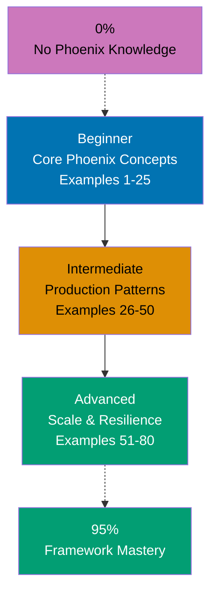

## Want to Master Phoenix Through Working Code?

This guide teaches you Elixir Phoenix through **80+ production-ready code examples** rather than lengthy explanations. If you're an experienced developer switching to Phoenix, or want to deepen your framework mastery, you'll build intuition through actual working patterns.

## What Is By-Example Learning?

By-example learning is a **code-first approach** where you learn concepts through annotated, working examples rather than narrative explanations. Each example shows:

1. **What the code does** - Brief explanation of the Phoenix concept
2. **How it works** - A focused, heavily commented code example
3. **Why it matters** - A pattern summary highlighting the key takeaway

This approach works best when you already understand programming fundamentals. You learn Phoenix's idioms, patterns, and best practices by studying real code rather than theoretical descriptions.

## What Is Elixir Phoenix?

Phoenix is a **web framework for Elixir** that prioritizes developer productivity and application reliability. Key distinctions:

- **Not Rails**: Phoenix is more explicit and performant than Rails, designed for Erlang's BEAM VM
- **Real-time first**: Built-in support for WebSockets, channels, and live updates (LiveView)
- **Functional**: Leverages Elixir's functional paradigm for safer, more maintainable code
- **Fault-tolerant**: Supervision trees and process isolation provide resilience by default
- **Modern**: Phoenix 1.7+ includes verified routes, function components, and unified HEEx templates

## Learning Path



## Coverage Philosophy: 95% Through 80+ Examples

The **95% coverage** means you'll understand Phoenix deeply enough to build production systems with confidence. It doesn't mean you'll know every edge case or advanced feature—those come with experience.

The 80 examples are organized progressively:

- **Beginner (Examples 1-25)**: Foundation concepts (routing, controllers, LiveView basics, Ecto fundamentals, forms, components)
- **Intermediate (Examples 26-50)**: Production patterns (advanced LiveView, real-time features, authentication, testing, APIs)
- **Advanced (Examples 51-80)**: Scale and resilience (database optimization, performance, deployment, monitoring, distributed systems)

Together, these examples cover **95% of what you'll use** in production Phoenix applications.

## What's Covered

### Core Web Framework Concepts

- **Routing & HTTP**: Router pipelines, verified routes (~p sigil), REST resource definitions, controller actions
- **Templates & Views**: HEEx syntax, function components, slots, layout inheritance
- **Request/Response**: Conn manipulation, params handling, content negotiation, status codes
- **Plugs & Middleware**: Custom plugs, pipeline composition, authorization middleware

### Real-Time & LiveView

- **LiveView Lifecycle**: Mount, render, handle_event, handle_params, socket assigns
- **LiveView Components**: Stateful vs function components, slots, event handling
- **LiveView Features**: Streams for efficient list updates, async operations, uploads, JS interop
- **Phoenix Channels**: Real-time bidirectional communication, presence tracking, PubSub

### Data & Persistence

- **Ecto Basics**: Schemas, migrations, changesets, validation, CRUD operations
- **Query Language**: Pipe-based queries, associations, preloading, aggregations
- **Advanced Patterns**: Transactions, multi-tenancy, polymorphic associations, custom types
- **Database**: PostgreSQL features, query optimization, connection pooling

### Security & Authentication

- **Session-Based Auth**: Login flows, password hashing, session management
- **Token-Based Auth**: JWT tokens, API authentication, token refresh
- **Authorization**: Role-based access control, permission checks, policy modules
- **Third-Party Auth**: OAuth2 integration, social login (Google, GitHub)

### Testing & Quality

- **Unit & Integration Tests**: ConnCase, LiveView testing, mocking external services
- **Test Fixtures**: ExMachina factories, database seeds, test data
- **Code Quality**: Testing patterns, assertion helpers, debugging techniques

### Production & Operations

- **Deployment**: Mix releases, Docker containerization, environment configuration
- **Observability**: Health checks, metrics collection (Telemetry), error tracking, structured logging
- **Performance**: Query optimization, caching strategies, background jobs (Oban), LiveDashboard
- **Resilience**: Rate limiting, circuit breakers, graceful shutdown, distributed Phoenix

## What's NOT Covered

We exclude topics that belong in specialized tutorials:

- **Detailed Elixir syntax**: Master Elixir first through language tutorials
- **Advanced DevOps**: Kubernetes, infrastructure-as-code, complex deployments
- **Database-specific features**: Deep PostgreSQL internals, advanced SQL optimization
- **Language internals**: BEAM scheduler details, memory management, Erlang distribution protocols
- **Framework internals**: How Phoenix processes requests internally, supervision tree architecture

For these topics, see dedicated tutorials and framework documentation.

## How to Use This Guide

### 1. **Choose Your Starting Point**

- **New to Phoenix?** Start with Beginner (Example 1)
- **Framework experience** (Rails, Django, Spring)? Start with Intermediate (Example 21)
- **Building specific feature?** Search for relevant example topic

### 2. **Read the Example**

Each example has three parts:

- **Explanation** (2-3 sentences): What Phoenix concept, why it exists, when to use it
- **Code** (with heavy comments): Working Elixir code showing the pattern
- **Key Takeaway** (1-2 sentences): Distilled essence of the pattern

### 3. **Run the Code**

Create a test project and run each example:

```bash
mix phx.new my_app --no-ecto
cd my_app
# Paste example code
iex -S mix phx.server
```

### 4. **Modify and Experiment**

Change variable names, add features, break things on purpose. Experiment builds intuition faster than reading.

### 5. **Reference as Needed**

Use this guide as a reference when building features. Search for relevant examples and adapt patterns to your code.

## Relationship to Other Tutorial Types

| Tutorial Type               | Approach                       | Coverage                   | Best For                       | Why Different                       |
| --------------------------- | ------------------------------ | -------------------------- | ------------------------------ | ----------------------------------- |
| **By Example** (this guide) | Code-first, 60+ examples       | 90% breadth                | Learning framework idioms      | Emphasizes patterns through code    |
| **Quick Start**             | Project-based, hands-on        | 5-30% touchpoints          | Getting something working fast | Linear project flow, minimal theory |
| **Beginner Tutorial**       | Narrative, explanation-first   | 0-60% comprehensive        | Understanding concepts deeply  | Detailed explanations, slower pace  |
| **Intermediate Tutorial**   | Problem-solving, practical     | 60-85% production patterns | Building real features         | Focus on common problems            |
| **Advanced Tutorial**       | Specialized topics, deep dives | 85-95% expert mastery      | Optimizing, scaling, internals | Advanced edge cases                 |
| **Cookbook**                | Recipe-based, problem-solution | Problem-specific           | Solving specific problems      | Quick solutions, minimal context    |

## Prerequisites

### Required

- **Elixir fundamentals**: Basic syntax, pipe operator, pattern matching, functional concepts
- **Web development**: HTTP basics, HTML, CSS, JavaScript fundamentals
- **Programming experience**: You've built applications before in another language

### Recommended

- **Erlang/OTP knowledge**: Processes, message passing, supervision basics
- **Relational databases**: SQL basics, schema design, join concepts
- **Git**: Version control for managing code

### Not Required

- **Phoenix experience**: This guide assumes you're new to the framework
- **Elixir expertise**: We assume beginner-to-intermediate Elixir knowledge
- **Web framework experience**: Not necessary, but helpful

## Learning Strategies

Different developer backgrounds benefit from customized learning paths through Phoenix. Choose the strategy matching your experience:

### For Elixir Developers New to Phoenix

You know Elixir but haven't used Phoenix. Focus on understanding Phoenix conventions and web patterns:

- **Start with routing and controllers** (Examples 1-5) - Understand request-response cycle before diving into LiveView
- **Master LiveView early** (Examples 10-15) - Phoenix's LiveView is unique; grasp its stateful nature and socket assigns
- **Focus on contexts** (Examples 8-12) - Phoenix contexts define boundaries; understand context design for clean architecture
- **Leverage Ecto knowledge** - If you know Ecto, Examples 16-20 reinforce query patterns and changesets in Phoenix context
- **Recommended path**: Examples 1-25 (Beginner) → 30-35 (Authentication) → 40-45 (Real-time patterns)

### For Ruby/Rails Developers Switching to Phoenix

Phoenix borrows concepts from Rails but differs in fundamental ways. Focus on understanding functional paradigm shifts:

- **Map MVC to Phoenix** - Controllers similar but functional; views are function components (not classes); models are Ecto schemas (not ActiveRecord)
- **Understand contexts vs Rails models** - Phoenix contexts explicitly define boundaries; Rails uses implicit model associations
- **Learn pattern matching** - Replaces conditional logic common in Rails controllers; see Examples 3-7 for Phoenix patterns
- **Grasp LiveView vs Hotwire** - LiveView is server-rendered interactivity (similar to Hotwire) but more powerful; see Examples 10-15
- **Focus on immutability** - Elixir's immutable data structures require different mental model than Rails' mutable ActiveRecord objects
- **Recommended path**: Examples 1-10 (Phoenix fundamentals) → Examples 20-25 (Ecto vs ActiveRecord) → Examples 30-40 (LiveView patterns)

### For Python/Django Developers Switching to Phoenix

Phoenix's architecture resembles Django but with functional programming at its core:

- **Map Django concepts** - Phoenix contexts similar to Django apps; Ecto schemas similar to Django models; templates use similar syntax
- **Understand functional programming** - Immutable data and pattern matching replace Python's imperative style
- **Learn process-based concurrency** - BEAM's lightweight processes different from Django's threading/async views; see Examples 50-55
- **Compare Ecto to Django ORM** - Ecto uses changesets for validation (separate from schemas); Django combines them in models
- **Focus on LiveView** - Server-rendered interactivity without JavaScript complexity; see Examples 10-20
- **Recommended path**: Examples 1-15 (Core Phoenix) → Examples 20-30 (Ecto patterns) → Examples 35-45 (LiveView vs Django templates)

### For Node.js Developers Switching to Phoenix

Phoenix's concurrency model and functional approach differ significantly from Node.js:

- **Understand process concurrency** - BEAM's lightweight processes replace Node.js event loop; see Examples 50-60 for GenServer patterns
- **Learn LiveView vs React/Vue** - Server-rendered interactivity eliminates need for client-side frameworks; see Examples 10-25
- **Grasp functional patterns** - Elixir's immutability and pattern matching replace JavaScript's imperative/functional hybrid
- **Compare Ecto to Sequelize/Prisma** - Different query building approach; Ecto more composable via pipe operator
- **Focus on Channels** - Similar to Socket.io but integrated into Phoenix; see Examples 45-50
- **Recommended path**: Examples 1-10 (Phoenix basics) → Examples 10-20 (LiveView) → Examples 45-55 (Channels and real-time)

### For Complete Framework Beginners

You're new to Elixir, Phoenix, and web frameworks. Take a methodical, sequential approach:

- **Master Elixir first** - Complete Elixir fundamentals (pattern matching, pipe operator, functions, modules) before starting Phoenix
- **Learn OTP basics** - Understand GenServer, Supervisor, process communication for Phoenix's fault tolerance (Examples 55-60 show this)
- **Follow sequential order** - Read Examples 1-80 in order; each builds on previous concepts and Phoenix conventions
- **Run every example** - Don't just read; run Phoenix generators (`mix phx.gen.html`, `mix phx.gen.live`) to see idiomatic code
- **Build small projects** - After Beginner examples, build a simple CRUD app with LiveView to consolidate learning
- **Recommended path**: Elixir fundamentals → OTP basics → Examples 1-25 (Beginner) → Build simple LiveView app → Examples 26-50 (Intermediate) → Build real-time feature → Examples 51-80 (Advanced)

## Structure of Each Example

All examples follow a consistent 4-part format:

````
### Example N: Descriptive Title

2-3 sentence explanation of the concept.

```elixir
# Heavily annotated code example
# showing the Phoenix pattern in action
````

**Key Takeaway**: 1-2 sentence summary.

```

**Code annotations**:

- `# =>` shows expected output or result
- Inline comments explain what each line does
- Variable names are self-documenting

**Mermaid diagrams** appear when visualizing flow or architecture improves understanding. We use a color-blind friendly palette:

- Blue #0173B2 - Primary
- Orange #DE8F05 - Secondary
- Teal #029E73 - Accent
- Purple #CC78BC - Alternative
- Brown #CA9161 - Neutral

## Ready to Start?

Choose your learning path:

- **[Beginner](/en/learn/software-engineering/platform-web/tools/elixir-phoenix/by-example/beginner)** - Start here if new to Phoenix. Build foundation understanding through 20 core examples.
- **[Intermediate](/en/learn/software-engineering/platform-web/tools/elixir-phoenix/by-example/intermediate)** - Jump here if you know Phoenix basics. Master production patterns through 20 examples.
- **[Advanced](/en/learn/software-engineering/platform-web/tools/elixir-phoenix/by-example/advanced)** - Expert mastery through 20 advanced examples covering scale, performance, and resilience.

Or jump to specific topics by searching for relevant example keywords (routing, authentication, LiveView, testing, deployment, etc.).
```
