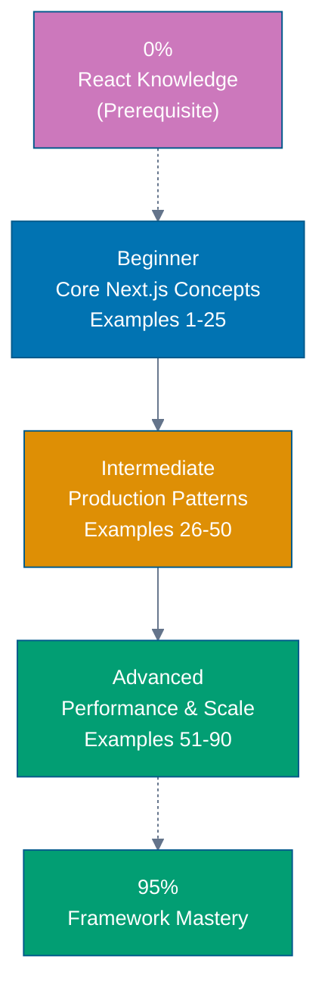

**Want to learn Next.js through code?** This by-example tutorial provides 75-90 heavily annotated examples covering 95% of Next.js + TypeScript. Master Next.js patterns, Server Components, Server Actions, and best practices through working code rather than lengthy explanations.

**Critical prerequisite**: Next.js is built on React. This guide assumes you understand [React fundamentals](/en/learn/software-engineering/platform-web/tools/fe-react). If you're new to React, complete the [React by-example tutorial](/en/learn/software-engineering/platform-web/tools/fe-react/by-example) first.

## What Is By-Example Learning?

By-example learning is a **code-first approach** where you learn concepts through annotated, working examples rather than narrative explanations. Each example shows:

1. **What the code does** - Brief explanation of the Next.js concept
2. **How it works** - A focused, heavily commented code example
3. **Why it matters** - A pattern summary highlighting the key takeaway
4. **Expected output** - What you'll see when running the code
5. **Common pitfalls** - Mistakes to avoid with this pattern

This approach works best when you already understand React fundamentals and basic web development concepts. You learn Next.js's App Router, Server Components, Server Actions, and TypeScript integration by studying real code rather than theoretical descriptions.

## What Is Next.js?

Next.js is a **React framework for building production applications** that adds server-side rendering, static generation, and full-stack capabilities. Key distinctions:

- **Framework, not library**: Next.js provides complete application structure including routing, rendering, and data fetching
- **React-based**: All React concepts apply; Next.js extends React with production features
- **Server-first**: Server Components by default, Client Components opt-in
- **Full-stack**: Server Actions enable backend logic without API routes
- **TypeScript integration**: End-to-end type safety from frontend to backend
- **Modern architecture**: App Router with Server Components, streaming, and progressive enhancement

## Learning Path



**Color Legend**: Blue (beginner), Orange (intermediate), Green (advanced/mastery), Purple (prerequisite)

## Coverage Philosophy: 95% Through 75-90 Examples

The **95% coverage** means you'll understand Next.js deeply enough to build production applications with confidence. It doesn't mean you'll know every edge case or advanced optimization—those come with experience.

The 75-90 examples are organized progressively:

- **Beginner (Examples 1-25)**: Foundation concepts (Server Components, Client Components, Server Actions, routing, layouts, data fetching, basic optimization)
- **Intermediate (Examples 26-50)**: Production patterns (authentication, database integration, forms, image optimization, metadata, error handling, loading states, API routes)
- **Advanced (Examples 51-90)**: Scale and optimization (advanced patterns, caching strategies, streaming, parallel routes, intercepting routes, middleware, deployment patterns, performance optimization)

Together, these examples cover **95% of what you'll use** in production Next.js applications.

## Annotation Density: 1-2.25 Comments Per Code Line

**CRITICAL**: All examples maintain **1-2.25 comment lines per code line PER EXAMPLE** to ensure deep understanding.

**What this means**:

- Simple lines get 1 annotation explaining purpose or result
- Complex lines get 2+ annotations explaining behavior, state changes, and side effects
- Use `// =>` notation to show expected values, outputs, or state changes

**Example**:

```typescript
// app/posts/page.tsx
async function PostsPage() {
  // => Server Component (default, no 'use client')
  // => Runs on server, has access to database
  const posts = await db.posts.findMany({
    // => Fetch all posts from database
    orderBy: { createdAt: 'desc' },
    // => Order by newest first
  });
  // => posts is Post[] array

  return (
    <ul>
      {/* => Map posts to list items */}
      {posts.map((post) => (
        // => post.id is unique identifier
        // => Used as React key for list rendering
        <li key={post.id}>
          {/* => Display post title */}
          {post.title}
          {/* => Renders: "My First Post" */}
        </li>
      ))}
    </ul>
  );
}
```

This density ensures each example is self-contained and fully comprehensible without external documentation.

## Structure of Each Example

All examples follow a consistent five-part format:

````markdown
### Example N: Descriptive Title

2-3 sentence explanation of the concept.

```typescript
// Heavily annotated code example
// showing the Next.js pattern in action
```
````

**Key Takeaway**: 1-2 sentence summary.

**Expected Output**: What you'll see when running this code.

**Common Pitfalls**: 1-2 mistakes developers often make with this pattern.

````markdown
**Code annotations**:

- `// =>` shows expected output, state changes, or results
- Inline comments explain what each line does
- Variable names are self-documenting
- Type annotations make data flow explicit

## What's Covered

### Core Next.js Concepts

- **App Router**: File-based routing, route groups, dynamic routes, catch-all routes
- **Server Components**: Default rendering, data fetching, database access
- **Client Components**: 'use client' directive, React hooks, event handlers
- **Server Actions**: Backend logic, form handling, mutations, progressive enhancement
- **Layouts**: Root layout, nested layouts, template vs layout

### Data Fetching & Rendering

- **Static Rendering (SSG)**: Build-time rendering, generateStaticParams, static export
- **Dynamic Rendering (SSR)**: Request-time rendering, dynamic data, cookies/headers
- **Incremental Static Regeneration (ISR)**: Time-based revalidation, on-demand revalidation
- **Streaming**: Loading UI, Suspense, progressive rendering
- **Caching**: Fetch caching, data cache, request memoization

### Routing Patterns

- **Pages & Layouts**: page.tsx, layout.tsx, template.tsx
- **Dynamic Routes**: [id], [...slug], [[...slug]] patterns
- **Route Handlers**: API routes in app/api/
- **Parallel Routes**: @folder convention, multiple routes same level
- **Intercepting Routes**: (.)folder, (..)folder, modal patterns

### Forms & Mutations

- **Server Actions**: Form actions, useFormStatus, useFormState
- **Validation**: Server-side validation, zod integration
- **Progressive Enhancement**: Works without JavaScript
- **Optimistic Updates**: Client-side optimism, error recovery

### TypeScript Integration

- **Type Safety**: Component props, Server Action types, API routes
- **Generic Components**: Generic Server/Client Components
- **Type Guards**: Runtime type checking, validation
- **Utility Types**: Next.js specific types (PageProps, LayoutProps, Metadata)

### Optimization

- **Image Optimization**: next/image, responsive images, lazy loading
- **Font Optimization**: next/font, Google Fonts, local fonts
- **Script Optimization**: next/script, loading strategies
- **Metadata**: SEO, OpenGraph, Twitter Cards, dynamic metadata

### Production Patterns

- **Authentication**: Auth.js/NextAuth, Clerk integration, protected routes
- **Database**: Prisma, Drizzle, direct SQL queries
- **Error Handling**: error.tsx, global-error.tsx, not-found.tsx
- **Loading States**: loading.tsx, Suspense boundaries, skeleton UI
- **Middleware**: Authentication, redirects, rewrites, A/B testing
- **Deployment**: Vercel, Docker, self-hosting, environment variables

## What's NOT Covered

We exclude topics that belong in specialized tutorials:

- **React Fundamentals**: JSX, components, props, state, hooks (see [React tutorial](/en/learn/software-engineering/platform-web/tools/fe-react))
- **Advanced TypeScript**: Deep TypeScript features unrelated to Next.js
- **State Management Libraries**: Redux, Zustand (use React Context or Server State)
- **Testing Deep Dives**: Advanced testing strategies (separate testing tutorial)
- **Pages Router**: Legacy routing system (App Router only)
- **Webpack Configuration**: Build tool details (Next.js abstracts this)
- **React Native**: Mobile development (separate tutorial)

For these topics, see dedicated tutorials and framework documentation.

## Prerequisites

### Required

- **React fundamentals**: Components, props, state, hooks, JSX ([React tutorial](/en/learn/software-engineering/platform-web/tools/fe-react))
- **JavaScript fundamentals**: ES6+ syntax, async/await, destructuring
- **TypeScript basics**: Basic types, interfaces, generics
- **HTML/CSS**: Basic web fundamentals, DOM concepts
- **Programming experience**: You've built applications before

### Recommended

- **Web APIs**: Fetch API, localStorage, FormData
- **Asynchronous JavaScript**: Promises, async/await patterns
- **Modern tooling**: npm/yarn, command-line basics
- **HTTP basics**: Request methods, status codes, headers

### Not Required

- **Next.js experience**: This guide assumes you're new to Next.js
- **Server-side development**: We teach server concepts as needed
- **Database knowledge**: Examples show patterns, not database administration
- **DevOps expertise**: Deployment patterns are simplified

## Getting Started

Before starting the examples, ensure you have basic environment setup:

1. **Master React**: [React by Example](/en/learn/software-engineering/platform-web/tools/fe-react/by-example) - Learn React fundamentals first (critical prerequisite)
2. **Review Initial Setup**: [Initial Setup](/en/learn/software-engineering/platform-web/tools/fe-nextjs/initial-setup) - Install Node.js, create Next.js project
3. **Try Quick Start**: [Quick Start](/en/learn/software-engineering/platform-web/tools/fe-nextjs/quick-start) - Build Zakat Calculator to understand Server Components and Server Actions

These tutorials provide hands-on foundation before diving into by-example learning.

## How to Use This Guide

### 1. Choose Your Starting Point

- **New to Next.js?** Start with Beginner (Example 1)
- **React experience** but new to Next.js? Start with Beginner (Example 1) - Server Components are different from plain React
- **Building specific feature?** Search for relevant example topic

**Important**: Even experienced React developers should start with Beginner examples. Next.js Server Components represent a paradigm shift from traditional React.

### 2. Read the Example

Each example has five parts:

- **Explanation** (2-3 sentences): What Next.js concept, why it exists, when to use it
- **Code** (heavily commented): Working TypeScript code showing the pattern
- **Key Takeaway** (1-2 sentences): Distilled essence of the pattern
- **Expected Output**: What you'll see when running the code
- **Common Pitfalls**: Mistakes to avoid

### 3. Run the Code

Create a test project and run each example:

```bash
npx create-next-app@latest nextjs-examples
cd nextjs-examples
# Choose: TypeScript, ESLint, Tailwind CSS, App Router
# Paste example code into app/page.tsx or create new route
npm run dev
```
````

### 4. Modify and Experiment

Change props, add Server Actions, break things on purpose. Experimentation builds intuition faster than reading.

### 5. Reference as Needed

Use this guide as a reference when building features. Search for relevant examples and adapt patterns to your code.

## Placeholder Notice

**This section is under development.** Examples are being created to meet the annotation density standard (1-2.25 comments per code line per example) and five-part structure requirement.

While we prepare this content, you can:

- **Master React first**: [React by Example](/en/learn/software-engineering/platform-web/tools/fe-react/by-example) - Essential prerequisite
- **Start with Initial Setup**: [Initial Setup](/en/learn/software-engineering/platform-web/tools/fe-nextjs/initial-setup) - Set up your Next.js development environment
- **Try Quick Start**: [Quick Start](/en/learn/software-engineering/platform-web/tools/fe-nextjs/quick-start) - Build your first Next.js application
- **Check back soon**: Examples will be added progressively, starting with Beginner section

## Ready to Start?

Once examples are available, choose your learning path:

- **Beginner** - Start here if new to Next.js. Build foundation understanding through 25 core examples covering Server Components, Client Components, and Server Actions.
- **Intermediate** - Master production patterns through 25 examples covering authentication, database integration, forms, and optimization.
- **Advanced** - Expert mastery through 40 advanced examples covering caching strategies, streaming, advanced routing, and performance optimization.

Or jump to specific topics by searching for relevant example keywords (server components, server actions, authentication, database, forms, caching, streaming, etc.).
