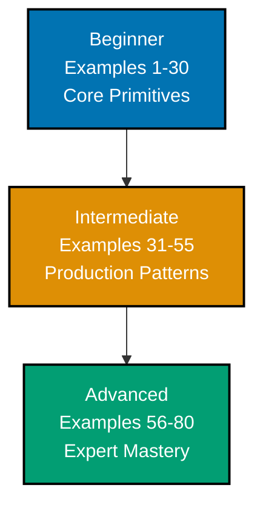

**Want to quickly master Radix UI through working examples?** This by-example guide teaches 95% of Radix UI through 80 annotated code examples organized by complexity level.

## What Is By-Example Learning?

By-example learning is an **example-first approach** where you learn through annotated, runnable code rather than narrative explanations. Each example is self-contained, immediately usable in a React project, and heavily commented to show:

- **What each line does** - Inline comments explain the purpose and mechanism
- **Expected behaviors** - Using `// =>` notation to show rendered output and state changes
- **Component relationships** - How Radix primitives compose together
- **Key takeaways** - 1-2 sentence summaries of core concepts

This approach is **ideal for experienced React developers** who understand component composition, hooks, and JSX, and want to quickly understand Radix UI's primitives, accessibility patterns, and composition model through working code.

Unlike narrative tutorials that build understanding through explanation and storytelling, by-example learning lets you **see the code first, render it second, and understand it through direct interaction**. You learn by doing, not by reading about doing.

## Learning Path



Progress from core primitives through production patterns to expert mastery. Each level builds on the previous, increasing in sophistication and introducing more advanced composition and accessibility techniques.

## Prerequisites

Before starting this guide, you should be comfortable with:

- **React fundamentals** - Components, props, state, hooks, JSX
- **TypeScript basics** - Interfaces, generics, type narrowing
- **CSS fundamentals** - Selectors, specificity, CSS custom properties
- **npm/yarn** - Package installation, dependency management

You do **not** need prior experience with Radix UI, headless UI libraries, or WAI-ARIA specifications. The examples teach these concepts incrementally.

## Coverage Philosophy

This by-example guide provides **95% coverage of Radix UI** through practical, annotated examples. The 95% figure represents the depth and breadth of concepts covered, not a time estimate -- focus is on **outcomes and understanding**, not duration.

### What's Covered

- **Core primitives** - Dialog, Popover, Tooltip, DropdownMenu, Accordion, Tabs
- **Form components** - Switch, Checkbox, RadioGroup, Slider, Select, Toggle, ToggleGroup
- **Layout primitives** - Separator, ScrollArea, AspectRatio, Collapsible, VisuallyHidden
- **Overlay components** - Portal, AlertDialog, ContextMenu, HoverCard, Toast
- **Navigation** - NavigationMenu, Toolbar, Menubar
- **Composition patterns** - asChild, compound components, custom triggers, polymorphic rendering
- **Styling integration** - data-state attributes, CSS animations, Tailwind CSS patterns
- **Accessibility** - Keyboard navigation, focus management, screen reader support, ARIA roles
- **Production patterns** - Form builders, design system integration, testing, SSR, performance
- **Advanced techniques** - Virtualized lists, complex modal flows, custom primitive building

### What's NOT Covered

This guide focuses on **learning-oriented examples**, not problem-solving recipes or production deployment. For additional topics:

- **Specific CSS-in-JS libraries** - Emotion, Stitches, or styled-components integration details (beyond general patterns)
- **Radix Themes** - The pre-styled component library built on Radix Primitives (this guide covers primitives only)
- **Server Components** - React Server Component patterns (Radix components are client-side by nature)

The 95% coverage goal maintains humility -- no tutorial can cover everything. This guide teaches the **core concepts that unlock the remaining 5%** through your own exploration and project work.

## How to Use This Guide

1. **Sequential or selective** - Read examples in order for progressive learning, or jump to specific components when you need a particular primitive
2. **Render everything** - Paste examples into a React project to see results yourself. Experimentation solidifies understanding.
3. **Modify and explore** - Change props, add styling, break components intentionally. Learn through experimentation.
4. **Use as reference** - Bookmark examples for quick lookups when you forget a component's API or composition pattern
5. **Complement with narrative tutorials** - By-example learning is code-first; pair with Radix UI documentation for deeper API reference

**Best workflow**: Open your editor in one window, this guide in another, and a browser with your dev server in a third. Render each example as you read it. When you encounter something unfamiliar, render the example, modify it, see what changes.

## Relationship to Other Tutorials

Understanding where by-example fits in the tutorial ecosystem helps you choose the right learning path:

| Tutorial Type   | Focus           | Best For                                       |
| --------------- | --------------- | ---------------------------------------------- |
| **By Example**  | Code-first      | Experienced React developers, quick reference  |
| **By Concept**  | Theory-first    | Understanding WAI-ARIA, design system patterns |
| **Quick Start** | Getting started | First 30 minutes with Radix UI                 |

**By-example is your fastest path** if you already know React and want to learn Radix UI's primitives through working code. Choose concept-based tutorials if you need deeper understanding of accessibility specifications or design system architecture.

## Project Setup

All examples assume a React project with Radix UI packages installed. Use this setup:

```bash
npx create-next-app@latest my-radix-app --typescript
cd my-radix-app
```

Install Radix packages as needed per example:

```bash
npm install @radix-ui/react-dialog
npm install @radix-ui/react-popover
npm install @radix-ui/react-tooltip
# ... install per component as introduced
```

Each example specifies which `@radix-ui/react-*` package it uses, so you can install incrementally as you progress through the guide.

## Examples by Level

### Beginner (Examples 1–30)

- [Example 1: Installing and Importing Your First Radix Component](/en/learn/software-engineering/platform-web/tools/fe-radix-ui/by-example/beginner#example-1-installing-and-importing-your-first-radix-component)
- [Example 2: Understanding the asChild Pattern](/en/learn/software-engineering/platform-web/tools/fe-radix-ui/by-example/beginner#example-2-understanding-the-aschild-pattern)
- [Example 3: Controlled vs Uncontrolled State](/en/learn/software-engineering/platform-web/tools/fe-radix-ui/by-example/beginner#example-3-controlled-vs-uncontrolled-state)
- [Example 4: Data-State Attributes for CSS Styling](/en/learn/software-engineering/platform-web/tools/fe-radix-ui/by-example/beginner#example-4-data-state-attributes-for-css-styling)
- [Example 5: VisuallyHidden for Screen Reader Content](/en/learn/software-engineering/platform-web/tools/fe-radix-ui/by-example/beginner#example-5-visuallyhidden-for-screen-reader-content)
- [Example 6: Popover with Arrow and Positioning](/en/learn/software-engineering/platform-web/tools/fe-radix-ui/by-example/beginner#example-6-popover-with-arrow-and-positioning)
- [Example 7: Tooltip with Delayed Appearance](/en/learn/software-engineering/platform-web/tools/fe-radix-ui/by-example/beginner#example-7-tooltip-with-delayed-appearance)
- [Example 8: DropdownMenu with Keyboard Navigation](/en/learn/software-engineering/platform-web/tools/fe-radix-ui/by-example/beginner#example-8-dropdownmenu-with-keyboard-navigation)
- [Example 9: AlertDialog for Destructive Confirmations](/en/learn/software-engineering/platform-web/tools/fe-radix-ui/by-example/beginner#example-9-alertdialog-for-destructive-confirmations)
- [Example 10: HoverCard for Preview Content](/en/learn/software-engineering/platform-web/tools/fe-radix-ui/by-example/beginner#example-10-hovercard-for-preview-content)
- [Example 11: Accordion for Expandable Sections](/en/learn/software-engineering/platform-web/tools/fe-radix-ui/by-example/beginner#example-11-accordion-for-expandable-sections)
- [Example 12: Tabs for Content Switching](/en/learn/software-engineering/platform-web/tools/fe-radix-ui/by-example/beginner#example-12-tabs-for-content-switching)
- [Example 13: Switch Toggle](/en/learn/software-engineering/platform-web/tools/fe-radix-ui/by-example/beginner#example-13-switch-toggle)
- [Example 14: Checkbox with Indeterminate State](/en/learn/software-engineering/platform-web/tools/fe-radix-ui/by-example/beginner#example-14-checkbox-with-indeterminate-state)
- [Example 15: RadioGroup for Exclusive Selection](/en/learn/software-engineering/platform-web/tools/fe-radix-ui/by-example/beginner#example-15-radiogroup-for-exclusive-selection)
- [Example 16: Slider for Range Selection](/en/learn/software-engineering/platform-web/tools/fe-radix-ui/by-example/beginner#example-16-slider-for-range-selection)
- [Example 17: Toggle Button](/en/learn/software-engineering/platform-web/tools/fe-radix-ui/by-example/beginner#example-17-toggle-button)
- [Example 18: Label Component](/en/learn/software-engineering/platform-web/tools/fe-radix-ui/by-example/beginner#example-18-label-component)
- [Example 19: Separator for Visual Division](/en/learn/software-engineering/platform-web/tools/fe-radix-ui/by-example/beginner#example-19-separator-for-visual-division)
- [Example 20: AspectRatio for Responsive Media](/en/learn/software-engineering/platform-web/tools/fe-radix-ui/by-example/beginner#example-20-aspectratio-for-responsive-media)
- [Example 21: ScrollArea for Custom Scrollbars](/en/learn/software-engineering/platform-web/tools/fe-radix-ui/by-example/beginner#example-21-scrollarea-for-custom-scrollbars)
- [Example 22: Collapsible for Show/Hide Sections](/en/learn/software-engineering/platform-web/tools/fe-radix-ui/by-example/beginner#example-22-collapsible-for-showhide-sections)
- [Example 23: Composing Multiple Radix Components](/en/learn/software-engineering/platform-web/tools/fe-radix-ui/by-example/beginner#example-23-composing-multiple-radix-components)
- [Example 24: Popover Inside a Dialog](/en/learn/software-engineering/platform-web/tools/fe-radix-ui/by-example/beginner#example-24-popover-inside-a-dialog)
- [Example 25: Tooltip on a Disabled Button](/en/learn/software-engineering/platform-web/tools/fe-radix-ui/by-example/beginner#example-25-tooltip-on-a-disabled-button)
- [Example 26: Avatar with Fallback Chain](/en/learn/software-engineering/platform-web/tools/fe-radix-ui/by-example/beginner#example-26-avatar-with-fallback-chain)
- [Example 27: Select Menu for Option Selection](/en/learn/software-engineering/platform-web/tools/fe-radix-ui/by-example/beginner#example-27-select-menu-for-option-selection)
- [Example 28: ToggleGroup for Exclusive Button Set](/en/learn/software-engineering/platform-web/tools/fe-radix-ui/by-example/beginner#example-28-togglegroup-for-exclusive-button-set)
- [Example 29: Form Integration with Native HTML Forms](/en/learn/software-engineering/platform-web/tools/fe-radix-ui/by-example/beginner#example-29-form-integration-with-native-html-forms)
- [Example 30: Prop Forwarding and Event Composition](/en/learn/software-engineering/platform-web/tools/fe-radix-ui/by-example/beginner#example-30-prop-forwarding-and-event-composition)

### Intermediate (Examples 31–55)

- [Example 31: Understanding Portal Rendering](/en/learn/software-engineering/platform-web/tools/fe-radix-ui/by-example/intermediate#example-31-understanding-portal-rendering)
- [Example 32: Custom Portal Container](/en/learn/software-engineering/platform-web/tools/fe-radix-ui/by-example/intermediate#example-32-custom-portal-container)
- [Example 33: Preventing Overlay Scroll](/en/learn/software-engineering/platform-web/tools/fe-radix-ui/by-example/intermediate#example-33-preventing-overlay-scroll)
- [Example 34: Overlay Stacking Order](/en/learn/software-engineering/platform-web/tools/fe-radix-ui/by-example/intermediate#example-34-overlay-stacking-order)
- [Example 35: CSS Keyframe Animations with data-state](/en/learn/software-engineering/platform-web/tools/fe-radix-ui/by-example/intermediate#example-35-css-keyframe-animations-with-data-state)
- [Example 36: CSS Transitions with data-state](/en/learn/software-engineering/platform-web/tools/fe-radix-ui/by-example/intermediate#example-36-css-transitions-with-data-state)
- [Example 37: Accordion Content Height Animation](/en/learn/software-engineering/platform-web/tools/fe-radix-ui/by-example/intermediate#example-37-accordion-content-height-animation)
- [Example 38: Radix with Tailwind CSS data-state Selectors](/en/learn/software-engineering/platform-web/tools/fe-radix-ui/by-example/intermediate#example-38-radix-with-tailwind-css-data-state-selectors)
- [Example 39: Animation with forceMount for Exit Transitions](/en/learn/software-engineering/platform-web/tools/fe-radix-ui/by-example/intermediate#example-39-animation-with-forcemount-for-exit-transitions)
- [Example 40: Animating Select Content](/en/learn/software-engineering/platform-web/tools/fe-radix-ui/by-example/intermediate#example-40-animating-select-content)
- [Example 41: React Hook Form Integration](/en/learn/software-engineering/platform-web/tools/fe-radix-ui/by-example/intermediate#example-41-react-hook-form-integration)
- [Example 42: Form Validation Error Display](/en/learn/software-engineering/platform-web/tools/fe-radix-ui/by-example/intermediate#example-42-form-validation-error-display)
- [Example 43: Slider Range (Two Thumbs)](/en/learn/software-engineering/platform-web/tools/fe-radix-ui/by-example/intermediate#example-43-slider-range-two-thumbs)
- [Example 44: Context Menu (Right-Click)](/en/learn/software-engineering/platform-web/tools/fe-radix-ui/by-example/intermediate#example-44-context-menu-right-click)
- [Example 45: NavigationMenu for Site Navigation](/en/learn/software-engineering/platform-web/tools/fe-radix-ui/by-example/intermediate#example-45-navigationmenu-for-site-navigation)
- [Example 46: Custom Focus Management in Dialog](/en/learn/software-engineering/platform-web/tools/fe-radix-ui/by-example/intermediate#example-46-custom-focus-management-in-dialog)
- [Example 47: Toolbar with Roving Tabindex](/en/learn/software-engineering/platform-web/tools/fe-radix-ui/by-example/intermediate#example-47-toolbar-with-roving-tabindex)
- [Example 48: Menubar for Application Menus](/en/learn/software-engineering/platform-web/tools/fe-radix-ui/by-example/intermediate#example-48-menubar-for-application-menus)
- [Example 49: Focus Trap Behavior in Nested Components](/en/learn/software-engineering/platform-web/tools/fe-radix-ui/by-example/intermediate#example-49-focus-trap-behavior-in-nested-components)
- [Example 50: Keyboard Shortcuts in Menu Items](/en/learn/software-engineering/platform-web/tools/fe-radix-ui/by-example/intermediate#example-50-keyboard-shortcuts-in-menu-items)
- [Example 51: Toast Notification System](/en/learn/software-engineering/platform-web/tools/fe-radix-ui/by-example/intermediate#example-51-toast-notification-system)
- [Example 52: Dialog Form with Multi-Step Wizard](/en/learn/software-engineering/platform-web/tools/fe-radix-ui/by-example/intermediate#example-52-dialog-form-with-multi-step-wizard)
- [Example 53: Dropdown with Checkbox and Radio Items](/en/learn/software-engineering/platform-web/tools/fe-radix-ui/by-example/intermediate#example-53-dropdown-with-checkbox-and-radio-items)
- [Example 54: Popover-Based Color Picker Pattern](/en/learn/software-engineering/platform-web/tools/fe-radix-ui/by-example/intermediate#example-54-popover-based-color-picker-pattern)
- [Example 55: Alert Dialog with Async Action](/en/learn/software-engineering/platform-web/tools/fe-radix-ui/by-example/intermediate#example-55-alert-dialog-with-async-action)

### Advanced (Examples 56–80)

- [Example 56: Wrapping Radix Primitives in Design System Components](/en/learn/software-engineering/platform-web/tools/fe-radix-ui/by-example/advanced#example-56-wrapping-radix-primitives-in-design-system-components)
- [Example 57: Polymorphic Button with asChild](/en/learn/software-engineering/platform-web/tools/fe-radix-ui/by-example/advanced#example-57-polymorphic-button-with-aschild)
- [Example 58: Compound Component Pattern for Custom Widgets](/en/learn/software-engineering/platform-web/tools/fe-radix-ui/by-example/advanced#example-58-compound-component-pattern-for-custom-widgets)
- [Example 59: Accessible Combobox with Popover and Command Pattern](/en/learn/software-engineering/platform-web/tools/fe-radix-ui/by-example/advanced#example-59-accessible-combobox-with-popover-and-command-pattern)
- [Example 60: Virtualized List Inside ScrollArea](/en/learn/software-engineering/platform-web/tools/fe-radix-ui/by-example/advanced#example-60-virtualized-list-inside-scrollarea)
- [Example 61: Responsive Dialog-to-Drawer Pattern](/en/learn/software-engineering/platform-web/tools/fe-radix-ui/by-example/advanced#example-61-responsive-dialog-to-drawer-pattern)
- [Example 62: Custom Trigger with Forwarded Ref](/en/learn/software-engineering/platform-web/tools/fe-radix-ui/by-example/advanced#example-62-custom-trigger-with-forwarded-ref)
- [Example 63: Unit Testing Dialog Open/Close](/en/learn/software-engineering/platform-web/tools/fe-radix-ui/by-example/advanced#example-63-unit-testing-dialog-openclose)
- [Example 64: Testing DropdownMenu Keyboard Navigation](/en/learn/software-engineering/platform-web/tools/fe-radix-ui/by-example/advanced#example-64-testing-dropdownmenu-keyboard-navigation)
- [Example 65: Testing Toast Notifications](/en/learn/software-engineering/platform-web/tools/fe-radix-ui/by-example/advanced#example-65-testing-toast-notifications)
- [Example 66: Testing Controlled Components](/en/learn/software-engineering/platform-web/tools/fe-radix-ui/by-example/advanced#example-66-testing-controlled-components)
- [Example 67: Snapshot Testing Radix Rendered Output](/en/learn/software-engineering/platform-web/tools/fe-radix-ui/by-example/advanced#example-67-snapshot-testing-radix-rendered-output)
- [Example 68: Server-Side Rendering Considerations](/en/learn/software-engineering/platform-web/tools/fe-radix-ui/by-example/advanced#example-68-server-side-rendering-considerations)
- [Example 69: Lazy Loading Radix Components](/en/learn/software-engineering/platform-web/tools/fe-radix-ui/by-example/advanced#example-69-lazy-loading-radix-components)
- [Example 70: Preventing Unnecessary Re-renders](/en/learn/software-engineering/platform-web/tools/fe-radix-ui/by-example/advanced#example-70-preventing-unnecessary-re-renders)
- [Example 71: Compound Component Performance with Context](/en/learn/software-engineering/platform-web/tools/fe-radix-ui/by-example/advanced#example-71-compound-component-performance-with-context)
- [Example 72: Radix with React.startTransition](/en/learn/software-engineering/platform-web/tools/fe-radix-ui/by-example/advanced#example-72-radix-with-reactstarttransition)
- [Example 73: Theme Context with Radix Components](/en/learn/software-engineering/platform-web/tools/fe-radix-ui/by-example/advanced#example-73-theme-context-with-radix-components)
- [Example 74: CSS Variables for Radix Theming](/en/learn/software-engineering/platform-web/tools/fe-radix-ui/by-example/advanced#example-74-css-variables-for-radix-theming)
- [Example 75: Building a Reusable Form Field Component](/en/learn/software-engineering/platform-web/tools/fe-radix-ui/by-example/advanced#example-75-building-a-reusable-form-field-component)
- [Example 76: Composing Radix with React Hook Form and Zod](/en/learn/software-engineering/platform-web/tools/fe-radix-ui/by-example/advanced#example-76-composing-radix-with-react-hook-form-and-zod)
- [Example 77: Design Token System with Radix Primitives](/en/learn/software-engineering/platform-web/tools/fe-radix-ui/by-example/advanced#example-77-design-token-system-with-radix-primitives)
- [Example 78: Command Palette with Search and Keyboard Navigation](/en/learn/software-engineering/platform-web/tools/fe-radix-ui/by-example/advanced#example-78-command-palette-with-search-and-keyboard-navigation)
- [Example 79: Multi-Modal Flow with Shared State](/en/learn/software-engineering/platform-web/tools/fe-radix-ui/by-example/advanced#example-79-multi-modal-flow-with-shared-state)
- [Example 80: Accessible Drag and Drop Reorder with Radix](/en/learn/software-engineering/platform-web/tools/fe-radix-ui/by-example/advanced#example-80-accessible-drag-and-drop-reorder-with-radix)
