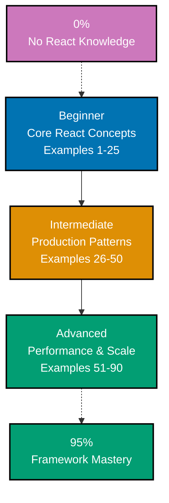

**Want to learn React through code?** This by-example tutorial provides 75 heavily annotated examples covering 95% of React + TypeScript. Master React idioms, patterns, and best practices through working code rather than lengthy explanations.

## What Is By-Example Learning?

By-example learning is a **code-first approach** where you learn concepts through annotated, working examples rather than narrative explanations. Each example shows:

1. **What the code does** - Brief explanation of the React concept
2. **How it works** - A focused, heavily commented code example
3. **Key Takeaway** - A pattern summary highlighting the key takeaway
4. **Why It Matters** - Production context, when to use, deeper significance

This approach works best when you already understand programming fundamentals and basic web development concepts. You learn React's component model, hooks system, and TypeScript integration by studying real code rather than theoretical descriptions.

## What Is React?

React is a **JavaScript library for building user interfaces** that prioritizes component composition and declarative rendering. Key distinctions:

- **Not a framework**: React focuses on the view layer; routing, state management, and other concerns require additional libraries
- **Component-based**: UI built from reusable, composable components with clear boundaries
- **Declarative**: Describe what UI should look like for any state; React handles DOM updates efficiently
- **TypeScript integration**: Strong typing provides better developer experience and catches errors early
- **Modern patterns**: Hooks, Context API, Suspense enable powerful composition without class components

## Learning Path



## Coverage Philosophy: 95% Through 75 Examples

The **95% coverage** means you'll understand React deeply enough to build production applications with confidence. It doesn't mean you'll know every edge case or advanced optimization—those come with experience.

The 75 examples are organized progressively:

- **Beginner (Examples 1-25)**: Foundation concepts (JSX, components, props, state, basic hooks, event handling, conditional rendering)
- **Intermediate (Examples 26-50)**: Production patterns (custom hooks, context, forms, data fetching, routing, error boundaries, performance basics)
- **Advanced (Examples 51-75)**: Scale and optimization (advanced patterns, performance optimization, testing strategies, accessibility, deployment patterns)

Together, these examples cover **95% of what you'll use** in production React applications.

## Annotation Density: 1-2.25 Comments Per Code Line

**CRITICAL**: All examples maintain **1-2.25 comment lines per code line PER EXAMPLE** to ensure deep understanding.

**What this means**:

- Simple lines get 1 annotation explaining purpose or result
- Complex lines get 2+ annotations explaining behavior, state changes, and side effects
- Use `// =>` notation to show expected values, outputs, or state changes

**Example**:

```typescript
const [count, setCount] = useState(0);     // => count is 0 initially (type: number)
                                           // => setCount updates count and triggers re-render

const handleClick = () => {                // => Event handler for button clicks
  setCount(count + 1);                     // => Increments count by 1
                                           // => Component re-renders with new count
};

return <button onClick={handleClick}>     {/* => Button displays current count */}
  Count: {count}                          {/* => Shows "Count: 0" initially */}
</button>;                                 {/* => Updates to "Count: 1" after click */}
```

This density ensures each example is self-contained and fully comprehensible without external documentation.

## Structure of Each Example

All examples follow a consistent five-part format:

````
### Example N: Descriptive Title

2-3 sentence explanation of the concept.

```typescript
// Heavily annotated code example
// showing the React pattern in action
````

**Key Takeaway**: 1-2 sentence summary.

**Why It Matters**: 50-100 words explaining significance in production applications.

````

**Code annotations**:

- `// =>` shows expected output, state changes, or results
- Inline comments explain what each line does
- Variable names are self-documenting
- Type annotations make data flow explicit

## What's Covered

### Core React Concepts

- **JSX & Elements**: JSX syntax, element creation, rendering, fragments
- **Components**: Function components, composition patterns, component lifecycle
- **Props**: Prop passing, children, prop drilling, type safety with TypeScript
- **State**: useState hook, state updates, state lifting, derived state

### Hooks System

- **Basic Hooks**: useState, useEffect, useContext
- **Advanced Hooks**: useReducer, useCallback, useMemo, useRef
- **Custom Hooks**: Creating reusable hooks, hooks composition, testing hooks
- **Hook Rules**: Rules of hooks, dependency arrays, stale closures

### Event Handling & Forms

- **Event System**: Event handling, synthetic events, event delegation
- **Forms**: Controlled components, form validation, form libraries (React Hook Form)
- **Input Patterns**: Text inputs, checkboxes, radio buttons, file uploads

### Component Patterns

- **Composition**: Component composition, render props, higher-order components
- **State Management**: Context API, reducers, state machines
- **Error Handling**: Error boundaries, error recovery patterns
- **Code Splitting**: Lazy loading, Suspense, dynamic imports

### TypeScript Integration

- **Type Safety**: Component props typing, event typing, children typing
- **Generic Components**: Generic props, type inference, constraint types
- **Type Guards**: Discriminated unions, type narrowing, type predicates
- **Utility Types**: Partial, Pick, Omit, Record for React patterns

### Performance & Optimization

- **React.memo**: Component memoization, comparison functions
- **useCallback & useMemo**: Hook memoization, dependency optimization
- **Virtualization**: List virtualization, windowing techniques
- **Profiling**: React DevTools profiler, performance measurement

### Production Patterns

- **Data Fetching**: Fetch patterns, loading states, error handling, caching
- **Routing**: React Router patterns, nested routes, protected routes
- **Authentication**: Auth patterns, token management, protected components
- **Testing**: Jest, React Testing Library, integration tests
- **Accessibility**: ARIA attributes, keyboard navigation, screen reader support

## What's NOT Covered

We exclude topics that belong in specialized tutorials:

- **Advanced TypeScript**: Deep TypeScript features unrelated to React
- **State Management Libraries**: Redux, MobX, Zustand (covered in separate tutorials)
- **Testing Deep Dives**: Advanced testing strategies (separate testing tutorial)
- **Build Tools**: Webpack, Vite, bundler configuration details
- **Server-Side Rendering**: Next.js, Remix (covered in framework-specific tutorials)
- **React Native**: Mobile development (separate tutorial)

For these topics, see dedicated tutorials and framework documentation.

## Prerequisites

### Required

- **JavaScript fundamentals**: ES6+ syntax, arrow functions, destructuring, spread/rest operators
- **TypeScript basics**: Basic types, interfaces, generics, type inference
- **HTML/CSS**: Basic web fundamentals, DOM concepts
- **Programming experience**: You've built applications before

### Recommended

- **Web APIs**: Fetch API, local storage, event handling
- **Asynchronous JavaScript**: Promises, async/await patterns
- **Modern tooling**: npm/yarn, command-line basics

### Not Required

- **React experience**: This guide assumes you're new to React
- **Framework experience**: Not necessary, but helpful
- **Advanced TypeScript**: We teach TypeScript patterns as needed

## Getting Started

Before starting the examples, ensure you have basic environment setup:

1. **Review Initial Setup**: [Initial Setup](/en/learn/software-engineering/platform-web/tools/fe-react/initial-setup) - Install Node.js, npm, and create React + TypeScript project
2. **Try Quick Start**: [Quick Start](/en/learn/software-engineering/platform-web/tools/fe-react/quick-start) - Build a simple todo app to understand React basics

These tutorials provide hands-on foundation before diving into by-example learning.

## How to Use This Guide

### 1. Choose Your Starting Point

- **New to React?** Start with Beginner (Example 1)
- **Framework experience** (Angular, Vue)? Start with Intermediate (Example 21)
- **Building specific feature?** Search for relevant example topic

### 2. Read the Example

Each example has five parts:

- **Explanation** (2-3 sentences): What React concept, why it exists, when to use it
- **Code** (heavily commented): Working TypeScript code showing the pattern
- **Key Takeaway** (1-2 sentences): Distilled essence of the pattern
- **Why It Matters** (50-100 words): Production context and deeper significance

### 3. Run the Code

Create a test project and run each example:

```bash
npm create vite@latest react-examples -- --template react-ts
cd react-examples
npm install
# Paste example code into src/App.tsx
npm run dev
````

### 4. Modify and Experiment

Change props, add state, break things on purpose. Experimentation builds intuition faster than reading.

### 5. Reference as Needed

Use this guide as a reference when building features. Search for relevant examples and adapt patterns to your code.

## Ready to Start?

Choose your learning path:

- **Beginner** - Start here if new to React. Build foundation understanding through 25 core examples.
- **Intermediate** - Jump here if you know React basics. Master production patterns through 25 examples.
- **Advanced** - Expert mastery through 25 advanced examples covering performance, scale, and optimization.

Or jump to specific topics by searching for relevant example keywords (hooks, context, forms, testing, performance, etc.).

## Examples by Level

### Beginner (Examples 1–25)

- [Example 1: First React Component with TypeScript](/en/learn/software-engineering/platform-web/tools/fe-react/by-example/beginner#example-1-first-react-component-with-typescript)
- [Example 2: JSX and TSX Syntax](/en/learn/software-engineering/platform-web/tools/fe-react/by-example/beginner#example-2-jsx-and-tsx-syntax)
- [Example 3: Component Props with Interfaces](/en/learn/software-engineering/platform-web/tools/fe-react/by-example/beginner#example-3-component-props-with-interfaces)
- [Example 4: Children Props Pattern](/en/learn/software-engineering/platform-web/tools/fe-react/by-example/beginner#example-4-children-props-pattern)
- [Example 5: Default Props with TypeScript](/en/learn/software-engineering/platform-web/tools/fe-react/by-example/beginner#example-5-default-props-with-typescript)
- [Example 6: useState Hook with TypeScript](/en/learn/software-engineering/platform-web/tools/fe-react/by-example/beginner#example-6-usestate-hook-with-typescript)
- [Example 7: Multiple State Variables](/en/learn/software-engineering/platform-web/tools/fe-react/by-example/beginner#example-7-multiple-state-variables)
- [Example 8: State with Objects](/en/learn/software-engineering/platform-web/tools/fe-react/by-example/beginner#example-8-state-with-objects)
- [Example 9: State with Arrays](/en/learn/software-engineering/platform-web/tools/fe-react/by-example/beginner#example-9-state-with-arrays)
- [Example 10: Functional State Updates](/en/learn/software-engineering/platform-web/tools/fe-react/by-example/beginner#example-10-functional-state-updates)
- [Example 11: useEffect Basics](/en/learn/software-engineering/platform-web/tools/fe-react/by-example/beginner#example-11-useeffect-basics)
- [Example 12: useEffect with Dependencies](/en/learn/software-engineering/platform-web/tools/fe-react/by-example/beginner#example-12-useeffect-with-dependencies)
- [Example 13: useEffect Cleanup](/en/learn/software-engineering/platform-web/tools/fe-react/by-example/beginner#example-13-useeffect-cleanup)
- [Example 14: Fetching Data with useEffect](/en/learn/software-engineering/platform-web/tools/fe-react/by-example/beginner#example-14-fetching-data-with-useeffect)
- [Example 15: useEffect with Async/Await](/en/learn/software-engineering/platform-web/tools/fe-react/by-example/beginner#example-15-useeffect-with-asyncawait)
- [Example 16: Click Event Handlers](/en/learn/software-engineering/platform-web/tools/fe-react/by-example/beginner#example-16-click-event-handlers)
- [Example 17: Form Input Events](/en/learn/software-engineering/platform-web/tools/fe-react/by-example/beginner#example-17-form-input-events)
- [Example 18: Controlled Components](/en/learn/software-engineering/platform-web/tools/fe-react/by-example/beginner#example-18-controlled-components)
- [Example 19: Form Submission](/en/learn/software-engineering/platform-web/tools/fe-react/by-example/beginner#example-19-form-submission)
- [Example 20: Form Validation Basics](/en/learn/software-engineering/platform-web/tools/fe-react/by-example/beginner#example-20-form-validation-basics)
- [Example 21: Conditional Rendering](/en/learn/software-engineering/platform-web/tools/fe-react/by-example/beginner#example-21-conditional-rendering)
- [Example 22: Lists and Keys](/en/learn/software-engineering/platform-web/tools/fe-react/by-example/beginner#example-22-lists-and-keys)
- [Example 23: Lifting State Up](/en/learn/software-engineering/platform-web/tools/fe-react/by-example/beginner#example-23-lifting-state-up)
- [Example 24: Component Composition](/en/learn/software-engineering/platform-web/tools/fe-react/by-example/beginner#example-24-component-composition)
- [Example 25: Simple Zakat Calculator (Financial Domain Example)](/en/learn/software-engineering/platform-web/tools/fe-react/by-example/beginner#example-25-simple-zakat-calculator-financial-domain-example)

### Intermediate (Examples 1–25)

- [Example 1: useReducer for Complex State](/en/learn/software-engineering/platform-web/tools/fe-react/by-example/intermediate#example-1-usereducer-for-complex-state)
- [Example 2: useCallback for Function Memoization](/en/learn/software-engineering/platform-web/tools/fe-react/by-example/intermediate#example-2-usecallback-for-function-memoization)
- [Example 3: useMemo for Value Memoization](/en/learn/software-engineering/platform-web/tools/fe-react/by-example/intermediate#example-3-usememo-for-value-memoization)
- [Example 4: useRef for DOM Access and Mutable Values](/en/learn/software-engineering/platform-web/tools/fe-react/by-example/intermediate#example-4-useref-for-dom-access-and-mutable-values)
- [Example 5: useImperativeHandle for Custom Refs](/en/learn/software-engineering/platform-web/tools/fe-react/by-example/intermediate#example-5-useimperativehandle-for-custom-refs)
- [Example 6: Creating Custom Hooks](/en/learn/software-engineering/platform-web/tools/fe-react/by-example/intermediate#example-6-creating-custom-hooks)
- [Example 7: useLocalStorage Hook (Detailed Implementation)](/en/learn/software-engineering/platform-web/tools/fe-react/by-example/intermediate#example-7-uselocalstorage-hook-detailed-implementation)
- [Example 8: useDebounce Hook](/en/learn/software-engineering/platform-web/tools/fe-react/by-example/intermediate#example-8-usedebounce-hook)
- [Example 9: useFetch Hook](/en/learn/software-engineering/platform-web/tools/fe-react/by-example/intermediate#example-9-usefetch-hook)
- [Example 10: useForm Hook for Form Management](/en/learn/software-engineering/platform-web/tools/fe-react/by-example/intermediate#example-10-useform-hook-for-form-management)
- [Example 11: Creating and Using Context](/en/learn/software-engineering/platform-web/tools/fe-react/by-example/intermediate#example-11-creating-and-using-context)
- [Example 12: Context with TypeScript](/en/learn/software-engineering/platform-web/tools/fe-react/by-example/intermediate#example-12-context-with-typescript)
- [Example 13: Multiple Contexts Pattern](/en/learn/software-engineering/platform-web/tools/fe-react/by-example/intermediate#example-13-multiple-contexts-pattern)
- [Example 14: Context with useReducer](/en/learn/software-engineering/platform-web/tools/fe-react/by-example/intermediate#example-14-context-with-usereducer)
- [Example 15: Authentication Context Example](/en/learn/software-engineering/platform-web/tools/fe-react/by-example/intermediate#example-15-authentication-context-example)
- [Example 16: React Query Basics](/en/learn/software-engineering/platform-web/tools/fe-react/by-example/intermediate#example-16-react-query-basics)
- [Example 17: React Query Mutations](/en/learn/software-engineering/platform-web/tools/fe-react/by-example/intermediate#example-17-react-query-mutations)
- [Example 18: Optimistic Updates with React Query](/en/learn/software-engineering/platform-web/tools/fe-react/by-example/intermediate#example-18-optimistic-updates-with-react-query)
- [Example 19: Infinite Scrolling with React Query](/en/learn/software-engineering/platform-web/tools/fe-react/by-example/intermediate#example-19-infinite-scrolling-with-react-query)
- [Example 20: Error Handling with React Query](/en/learn/software-engineering/platform-web/tools/fe-react/by-example/intermediate#example-20-error-handling-with-react-query)
- [Example 21: React Router Setup](/en/learn/software-engineering/platform-web/tools/fe-react/by-example/intermediate#example-21-react-router-setup)
- [Example 22: Dynamic Routes with Params](/en/learn/software-engineering/platform-web/tools/fe-react/by-example/intermediate#example-22-dynamic-routes-with-params)
- [Example 23: Protected Routes Pattern](/en/learn/software-engineering/platform-web/tools/fe-react/by-example/intermediate#example-23-protected-routes-pattern)
- [Example 24: Error Boundaries](/en/learn/software-engineering/platform-web/tools/fe-react/by-example/intermediate#example-24-error-boundaries)
- [Example 25: Murabaha Contract Dashboard (Complete Financial Application)](/en/learn/software-engineering/platform-web/tools/fe-react/by-example/intermediate#example-25-murabaha-contract-dashboard-complete-financial-application)

### Advanced (Examples 1–25)

- [Example 1: Generic Components with TypeScript](/en/learn/software-engineering/platform-web/tools/fe-react/by-example/advanced#example-1-generic-components-with-typescript)
- [Example 2: Utility Types in React (Partial, Pick, Omit, Record)](/en/learn/software-engineering/platform-web/tools/fe-react/by-example/advanced#example-2-utility-types-in-react-partial-pick-omit-record)
- [Example 3: Discriminated Unions for State](/en/learn/software-engineering/platform-web/tools/fe-react/by-example/advanced#example-3-discriminated-unions-for-state)
- [Example 4: Advanced Type Guards](/en/learn/software-engineering/platform-web/tools/fe-react/by-example/advanced#example-4-advanced-type-guards)
- [Example 5: Template Literal Types for Props](/en/learn/software-engineering/platform-web/tools/fe-react/by-example/advanced#example-5-template-literal-types-for-props)
- [Example 6: Zustand Store Setup](/en/learn/software-engineering/platform-web/tools/fe-react/by-example/advanced#example-6-zustand-store-setup)
- [Example 7: Zustand with TypeScript and Slices](/en/learn/software-engineering/platform-web/tools/fe-react/by-example/advanced#example-7-zustand-with-typescript-and-slices)
- [Example 8: Zustand Middleware (Persist, Devtools)](/en/learn/software-engineering/platform-web/tools/fe-react/by-example/advanced#example-8-zustand-middleware-persist-devtools)
- [Example 9: Server State vs Client State Separation](/en/learn/software-engineering/platform-web/tools/fe-react/by-example/advanced#example-9-server-state-vs-client-state-separation)
- [Example 10: State Machine Pattern with XState](/en/learn/software-engineering/platform-web/tools/fe-react/by-example/advanced#example-10-state-machine-pattern-with-xstate)
- [Example 11: Code Splitting with React.lazy and Suspense](/en/learn/software-engineering/platform-web/tools/fe-react/by-example/advanced#example-11-code-splitting-with-reactlazy-and-suspense)
- [Example 12: Route-Based Code Splitting](/en/learn/software-engineering/platform-web/tools/fe-react/by-example/advanced#example-12-route-based-code-splitting)
- [Example 13: React.memo and Memoization Strategies](/en/learn/software-engineering/platform-web/tools/fe-react/by-example/advanced#example-13-reactmemo-and-memoization-strategies)
- [Example 14: Virtual Scrolling for Large Lists](/en/learn/software-engineering/platform-web/tools/fe-react/by-example/advanced#example-14-virtual-scrolling-for-large-lists)
- [Example 15: Web Workers for Heavy Computations](/en/learn/software-engineering/platform-web/tools/fe-react/by-example/advanced#example-15-web-workers-for-heavy-computations)
- [Example 16: Suspense for Data Fetching](/en/learn/software-engineering/platform-web/tools/fe-react/by-example/advanced#example-16-suspense-for-data-fetching)
- [Example 17: startTransition for Non-Urgent Updates](/en/learn/software-engineering/platform-web/tools/fe-react/by-example/advanced#example-17-starttransition-for-non-urgent-updates)
- [Example 18: useDeferredValue for Expensive Renders](/en/learn/software-engineering/platform-web/tools/fe-react/by-example/advanced#example-18-usedeferredvalue-for-expensive-renders)
- [Example 19: Error Boundaries with Retry Logic](/en/learn/software-engineering/platform-web/tools/fe-react/by-example/advanced#example-19-error-boundaries-with-retry-logic)
- [Example 20: Render-as-You-Fetch Pattern](/en/learn/software-engineering/platform-web/tools/fe-react/by-example/advanced#example-20-render-as-you-fetch-pattern)
- [Example 21: Vitest with React Testing Library](/en/learn/software-engineering/platform-web/tools/fe-react/by-example/advanced#example-21-vitest-with-react-testing-library)
- [Example 22: Testing Custom Hooks](/en/learn/software-engineering/platform-web/tools/fe-react/by-example/advanced#example-22-testing-custom-hooks)
- [Example 23: XSS Prevention and Input Sanitization](/en/learn/software-engineering/platform-web/tools/fe-react/by-example/advanced#example-23-xss-prevention-and-input-sanitization)
- [Example 24: CSRF Protection Patterns](/en/learn/software-engineering/platform-web/tools/fe-react/by-example/advanced#example-24-csrf-protection-patterns)
- [Example 25: Complete Zakat Management System (Financial Domain Example)](/en/learn/software-engineering/platform-web/tools/fe-react/by-example/advanced#example-25-complete-zakat-management-system-financial-domain-example)
