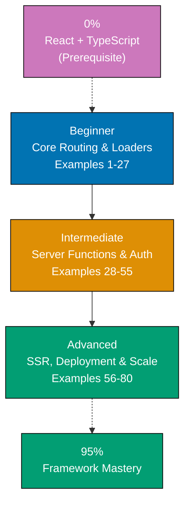

**Want to learn TanStack Start through code?** This by-example tutorial provides 80 heavily annotated examples covering 95% of TanStack Start + TypeScript. Master file-based routing, server functions, full-stack data patterns, and production deployment through working code rather than lengthy explanations.

**Critical prerequisite**: TanStack Start is built on TanStack Router and React. This guide assumes you understand React fundamentals and basic TypeScript. If you are new to React, complete a React fundamentals tutorial first.

## What Is By-Example Learning?

By-example learning is a **code-first approach** where you learn concepts through annotated, working examples rather than narrative explanations. Each example shows:

1. **Brief explanation** - What the TanStack Start concept is and when to use it
2. **Mermaid diagram** (when appropriate) - Visual representation of complex flows
3. **Heavily annotated code** - Working TypeScript code with 1-2.25 comment lines per code line
4. **Key Takeaway** - 1-2 sentence distillation of the pattern
5. **Why It Matters** - 50-100 words connecting the pattern to production relevance

This approach works best when you already understand React fundamentals and basic web development concepts. You learn TanStack Start's routing, server functions, loaders, and full-stack patterns by studying real code rather than theoretical descriptions.

## What Is TanStack Start?

TanStack Start is a **full-stack React framework built on TanStack Router and Vinxi**. It provides file-based routing, server functions, SSR, and a streaming-first architecture. Key distinctions:

- **Framework, not library**: TanStack Start provides complete application structure including routing, rendering, and server-side data patterns
- **React-based**: All React concepts apply; TanStack Start extends React with production full-stack features
- **Type-safe by design**: End-to-end type safety from route params to server functions
- **Built on TanStack Router**: The most type-safe router in the React ecosystem, now with full-stack capabilities
- **Vinxi-powered**: Uses Vinxi as the underlying build and server toolkit, enabling flexible deployment targets
- **Server Functions**: `createServerFn` enables type-safe server-side logic without manual API routes
- **Streaming-first**: Built-in support for React Suspense and streaming SSR out of the box

## Learning Path



**Color Legend**: Blue (beginner), Orange (intermediate), Green (advanced/mastery), Purple (prerequisite)

## Coverage Philosophy: 95% Through 80 Examples

The **95% coverage** means you will understand TanStack Start deeply enough to build production applications with confidence. It does not mean you will know every edge case or advanced optimization - those come with experience.

The 80 examples are organized progressively:

- **Beginner (Examples 1-27)**: Foundation concepts - project setup, file-based routing, `createFileRoute`, route params, search params, layout routes, Link component, navigation, loaders (`beforeLoad`/`loader`), pending states, error boundaries, not-found handling, head/meta management, static assets, and CSS/styling
- **Intermediate (Examples 28-55)**: Production patterns - server functions (`createServerFn`), mutations, form handling, authentication, sessions, middleware, data caching via TanStack Query, optimistic updates, parallel data loading, route context, guards/redirects, API routes, WebSocket, testing, and streaming/Suspense
- **Advanced (Examples 56-80)**: Scale and optimization - SSR streaming patterns, deployment targets (Vercel, Node, Bun), custom server, middleware composition, advanced caching, prefetching strategies, code splitting, environment variables, error management, SEO, ISR/SSG-like patterns, production patterns, performance optimization, and monitoring

Together, these examples cover **95% of what you will use** in production TanStack Start applications.

## Annotation Density: 1-2.25 Comments Per Code Line

**Critical**: All examples maintain **1-2.25 comment lines per code line per example** to ensure deep understanding.

**What this means**:

- Simple lines get 1 annotation explaining purpose or result
- Complex lines get 2+ annotations explaining behavior, state changes, and side effects
- Use `// =>` notation to show expected values, outputs, or state changes

**Example**:

```typescript
// app/routes/index.tsx
import { createFileRoute } from '@tanstack/react-router'
// => Import createFileRoute factory from TanStack Router
// => This function creates type-safe route definitions

export const Route = createFileRoute('/')({
  // => Defines the root route '/'
  // => Route object exported as named 'Route' (convention required)

  loader: async () => {
    // => loader runs on server before component renders
    // => Can be async, can fetch data, access DB

    const greeting = 'Marhaba, world!'
    // => greeting is "Marhaba, world!" (type: string)

    return { greeting }
    // => Returns plain object to component as loaderData
  },

  component: function IndexPage() {
    // => Component receives loader data via useLoaderData

    const { greeting } = Route.useLoaderData()
    // => Destructures greeting from loader return value
    // => greeting is "Marhaba, world!" (type: string)
    // => Fully type-safe: TypeScript infers from loader return type

    return <h1>{greeting}</h1>
    // => Renders: <h1>Marhaba, world!</h1>
  },
})
```

This density ensures each example is self-contained and fully comprehensible without external documentation.

## Structure of Each Example

All examples follow a consistent five-part format:

```markdown
### Example N: Descriptive Title

2-3 sentence explanation of the TanStack Start concept.

(Optional Mermaid diagram for complex flows)

(Heavily annotated code with 1-2.25 comment lines per code line)

**Key Takeaway**: 1-2 sentence summary.

**Why It Matters**: 50-100 words connecting the pattern to production applications.
```

**Code annotations**:

- `// =>` shows expected output, state changes, or results
- Inline comments explain what each line does
- Variable names are self-documenting
- Type annotations make data flow explicit

## What Is Covered

### Core Routing Concepts

- **File-based routing**: Route files map to URL paths, `createFileRoute` factory
- **Route params**: Dynamic segments `$param`, typed param access
- **Search params**: URL query parameters with validation
- **Layout routes**: Nested layouts with `Outlet`, route grouping
- **Link component**: Type-safe navigation, preloading, active styles
- **Programmatic navigation**: `useNavigate`, `router.navigate`

### Data Loading

- **`loader` function**: Route-level data fetching before render
- **`beforeLoad` function**: Pre-loader guard/redirect logic
- **`useLoaderData`**: Type-safe access to loader return data
- **Pending states**: `pendingComponent`, `pendingMs`, loading UI
- **Error boundaries**: `errorComponent`, error retry, error types
- **Not-found handling**: `notFoundComponent`, `notFound()` throw

### Server Functions

- **`createServerFn`**: Type-safe RPC to server without API routes
- **HTTP methods**: `.validator()`, `.handler()` chaining
- **Mutations**: Server functions with side effects
- **Form handling**: Form submission with server functions
- **Middleware**: `createMiddleware` for cross-cutting server logic

### Full-Stack Patterns

- **Authentication**: Session management, protected routes
- **TanStack Query integration**: Caching, invalidation, optimistic updates
- **Parallel loading**: Multiple loaders composing data
- **Route context**: Shared data/services via `context` option
- **API routes**: HTTP endpoints alongside UI routes

### TypeScript Integration

- **Route type safety**: Inferred param types, loader return types
- **Server function types**: Input/output types flow end-to-end
- **`useParams`**: Typed dynamic param access
- **`useSearch`**: Typed search param access
- **`ValidateSearch`**: Search param validation schemas

### Production & Deployment

- **SSR streaming**: Server-rendered HTML with streaming Suspense
- **Deployment targets**: Vercel, Node.js, Bun, Deno via Vinxi adapters
- **Environment variables**: `process.env` on server, Vite env on client
- **Code splitting**: Automatic route-level splitting
- **Prefetching**: Link hover prefetch, `router.preloadRoute`
- **SEO**: `useHead`, meta tags, canonical links

## What Is NOT Covered

We exclude topics that belong in specialized tutorials:

- **React Fundamentals**: JSX, components, props, state, hooks (see React tutorial)
- **Advanced TypeScript**: Deep TypeScript features unrelated to TanStack Start
- **State Management Libraries**: Redux, Zustand (TanStack Query covers server state)
- **Testing Deep Dives**: Advanced testing strategies (separate testing tutorial)
- **Vinxi Internals**: Build tool details (TanStack Start abstracts this)
- **React Native**: Mobile development (separate tutorial)

## Prerequisites

### Required

- **React fundamentals**: Components, props, state, hooks, JSX
- **JavaScript fundamentals**: ES6+ syntax, async/await, destructuring
- **TypeScript basics**: Basic types, interfaces, generics
- **HTML/CSS**: Basic web fundamentals, DOM concepts
- **Programming experience**: You have built applications before

### Recommended

- **Web APIs**: Fetch API, FormData, browser storage
- **Asynchronous JavaScript**: Promises, async/await patterns
- **Modern tooling**: npm/yarn, command-line basics
- **HTTP basics**: Request methods, status codes, headers

### Not Required

- **TanStack Start experience**: This guide assumes you are new to TanStack Start
- **TanStack Router experience**: We explain router concepts as needed
- **Server-side development**: We teach server concepts as needed

## Getting Started

Before starting the examples, ensure you have basic environment setup:

```bash
npm create tanstack@latest
# Choose: Start, TypeScript, file-based routing
cd my-app
npm install
npm run dev
```

## Ready to Start?

Choose your learning path:

- [Beginner](/en/learn/software-engineering/platform-web/tools/fe-tanstack-start/by-example/beginner) - Start here if new to TanStack Start. Build foundation understanding through core examples covering file-based routing, loaders, error handling, and navigation.
- [Intermediate](/en/learn/software-engineering/platform-web/tools/fe-tanstack-start/by-example/intermediate) - Master production patterns through examples covering server functions, authentication, TanStack Query integration, forms, and middleware.
- [Advanced](/en/learn/software-engineering/platform-web/tools/fe-tanstack-start/by-example/advanced) - Expert mastery through examples covering SSR streaming, deployment targets, performance optimization, and production patterns.

Or jump to specific topics by searching for relevant example keywords (server functions, loaders, authentication, TanStack Query, forms, middleware, streaming, deployment, etc.).

## Examples by Level

### Beginner (Examples 1–27)

- [Example 1: Creating a TanStack Start Project](/en/learn/software-engineering/platform-web/tools/fe-tanstack-start/by-example/beginner#example-1-creating-a-tanstack-start-project)
- [Example 2: Project File Structure](/en/learn/software-engineering/platform-web/tools/fe-tanstack-start/by-example/beginner#example-2-project-file-structure)
- [Example 3: Root Layout Route](/en/learn/software-engineering/platform-web/tools/fe-tanstack-start/by-example/beginner#example-3-root-layout-route)
- [Example 4: Defining a Route with `createFileRoute`](/en/learn/software-engineering/platform-web/tools/fe-tanstack-start/by-example/beginner#example-4-defining-a-route-with-createfileroute)
- [Example 5: Route with a Loader](/en/learn/software-engineering/platform-web/tools/fe-tanstack-start/by-example/beginner#example-5-route-with-a-loader)
- [Example 6: Dynamic Route Params](/en/learn/software-engineering/platform-web/tools/fe-tanstack-start/by-example/beginner#example-6-dynamic-route-params)
- [Example 7: Search Parameters](/en/learn/software-engineering/platform-web/tools/fe-tanstack-start/by-example/beginner#example-7-search-parameters)
- [Example 8: Nested Layout with Outlet](/en/learn/software-engineering/platform-web/tools/fe-tanstack-start/by-example/beginner#example-8-nested-layout-with-outlet)
- [Example 9: Pathless Layout Groups](/en/learn/software-engineering/platform-web/tools/fe-tanstack-start/by-example/beginner#example-9-pathless-layout-groups)
- [Example 10: The Link Component](/en/learn/software-engineering/platform-web/tools/fe-tanstack-start/by-example/beginner#example-10-the-link-component)
- [Example 11: Programmatic Navigation with `useNavigate`](/en/learn/software-engineering/platform-web/tools/fe-tanstack-start/by-example/beginner#example-11-programmatic-navigation-with-usenavigate)
- [Example 12: Active Link Styling](/en/learn/software-engineering/platform-web/tools/fe-tanstack-start/by-example/beginner#example-12-active-link-styling)
- [Example 13: `beforeLoad` for Redirects and Context](/en/learn/software-engineering/platform-web/tools/fe-tanstack-start/by-example/beginner#example-13-beforeload-for-redirects-and-context)
- [Example 14: Parallel Data Loading](/en/learn/software-engineering/platform-web/tools/fe-tanstack-start/by-example/beginner#example-14-parallel-data-loading)
- [Example 15: Pending State with `pendingComponent`](/en/learn/software-engineering/platform-web/tools/fe-tanstack-start/by-example/beginner#example-15-pending-state-with-pendingcomponent)
- [Example 16: Route Error Boundary](/en/learn/software-engineering/platform-web/tools/fe-tanstack-start/by-example/beginner#example-16-route-error-boundary)
- [Example 17: Not-Found Handling with `notFoundComponent`](/en/learn/software-engineering/platform-web/tools/fe-tanstack-start/by-example/beginner#example-17-not-found-handling-with-notfoundcomponent)
- [Example 18: Error Reset and Retry](/en/learn/software-engineering/platform-web/tools/fe-tanstack-start/by-example/beginner#example-18-error-reset-and-retry)
- [Example 19: Managing the `<head>` with `useHead`](/en/learn/software-engineering/platform-web/tools/fe-tanstack-start/by-example/beginner#example-19-managing-the-head-with-usehead)
- [Example 20: Static `head` Option in Route Definition](/en/learn/software-engineering/platform-web/tools/fe-tanstack-start/by-example/beginner#example-20-static-head-option-in-route-definition)
- [Example 21: Importing CSS Modules](/en/learn/software-engineering/platform-web/tools/fe-tanstack-start/by-example/beginner#example-21-importing-css-modules)
- [Example 22: Global CSS and CSS Variables](/en/learn/software-engineering/platform-web/tools/fe-tanstack-start/by-example/beginner#example-22-global-css-and-css-variables)
- [Example 23: Static Asset Imports](/en/learn/software-engineering/platform-web/tools/fe-tanstack-start/by-example/beginner#example-23-static-asset-imports)
- [Example 24: Route Groups for Organization](/en/learn/software-engineering/platform-web/tools/fe-tanstack-start/by-example/beginner#example-24-route-groups-for-organization)
- [Example 25: Catch-All Routes](/en/learn/software-engineering/platform-web/tools/fe-tanstack-start/by-example/beginner#example-25-catch-all-routes)
- [Example 26: Scroll Restoration](/en/learn/software-engineering/platform-web/tools/fe-tanstack-start/by-example/beginner#example-26-scroll-restoration)
- [Example 27: Route Params in the `<Link>` Component](/en/learn/software-engineering/platform-web/tools/fe-tanstack-start/by-example/beginner#example-27-route-params-in-the-link-component)

### Intermediate (Examples 28–50)

- [Example 28: Basic `createServerFn`](/en/learn/software-engineering/platform-web/tools/fe-tanstack-start/by-example/intermediate#example-28-basic-createserverfn)
- [Example 29: Server Function with Input Validation](/en/learn/software-engineering/platform-web/tools/fe-tanstack-start/by-example/intermediate#example-29-server-function-with-input-validation)
- [Example 30: Calling Server Functions from Loaders](/en/learn/software-engineering/platform-web/tools/fe-tanstack-start/by-example/intermediate#example-30-calling-server-functions-from-loaders)
- [Example 31: Mutations with Server Functions](/en/learn/software-engineering/platform-web/tools/fe-tanstack-start/by-example/intermediate#example-31-mutations-with-server-functions)
- [Example 32: Form Submission with Server Functions](/en/learn/software-engineering/platform-web/tools/fe-tanstack-start/by-example/intermediate#example-32-form-submission-with-server-functions)
- [Example 33: Form State with `useActionState`](/en/learn/software-engineering/platform-web/tools/fe-tanstack-start/by-example/intermediate#example-33-form-state-with-useactionstate)
- [Example 34: Session-Based Authentication](/en/learn/software-engineering/platform-web/tools/fe-tanstack-start/by-example/intermediate#example-34-session-based-authentication)
- [Example 35: Route-Level Auth Guard](/en/learn/software-engineering/platform-web/tools/fe-tanstack-start/by-example/intermediate#example-35-route-level-auth-guard)
- [Example 36: Role-Based Access Control](/en/learn/software-engineering/platform-web/tools/fe-tanstack-start/by-example/intermediate#example-36-role-based-access-control)
- [Example 37: Creating Middleware with `createMiddleware`](/en/learn/software-engineering/platform-web/tools/fe-tanstack-start/by-example/intermediate#example-37-creating-middleware-with-createmiddleware)
- [Example 38: Auth Middleware for Server Functions](/en/learn/software-engineering/platform-web/tools/fe-tanstack-start/by-example/intermediate#example-38-auth-middleware-for-server-functions)
- [Example 39: Setting Up TanStack Query](/en/learn/software-engineering/platform-web/tools/fe-tanstack-start/by-example/intermediate#example-39-setting-up-tanstack-query)
- [Example 40: `useQuery` with Prefetching in Loaders](/en/learn/software-engineering/platform-web/tools/fe-tanstack-start/by-example/intermediate#example-40-usequery-with-prefetching-in-loaders)
- [Example 41: Optimistic Updates](/en/learn/software-engineering/platform-web/tools/fe-tanstack-start/by-example/intermediate#example-41-optimistic-updates)
- [Example 42: Route Context for Shared Services](/en/learn/software-engineering/platform-web/tools/fe-tanstack-start/by-example/intermediate#example-42-route-context-for-shared-services)
- [Example 43: Redirects in Loaders](/en/learn/software-engineering/platform-web/tools/fe-tanstack-start/by-example/intermediate#example-43-redirects-in-loaders)
- [Example 44: HTTP API Routes](/en/learn/software-engineering/platform-web/tools/fe-tanstack-start/by-example/intermediate#example-44-http-api-routes)
- [Example 45: Testing Loaders with Mocked Server Functions](/en/learn/software-engineering/platform-web/tools/fe-tanstack-start/by-example/intermediate#example-45-testing-loaders-with-mocked-server-functions)
- [Example 46: Testing Components with Router](/en/learn/software-engineering/platform-web/tools/fe-tanstack-start/by-example/intermediate#example-46-testing-components-with-router)
- [Example 47: Streaming with React Suspense](/en/learn/software-engineering/platform-web/tools/fe-tanstack-start/by-example/intermediate#example-47-streaming-with-react-suspense)
- [Example 48: Deferred Loading with Streaming](/en/learn/software-engineering/platform-web/tools/fe-tanstack-start/by-example/intermediate#example-48-deferred-loading-with-streaming)
- [Example 49: WebSocket Integration](/en/learn/software-engineering/platform-web/tools/fe-tanstack-start/by-example/intermediate#example-49-websocket-integration)
- [Example 50: Search Params for Pagination](/en/learn/software-engineering/platform-web/tools/fe-tanstack-start/by-example/intermediate#example-50-search-params-for-pagination)

### Advanced (Examples 56–80)

- [Example 56: Full SSR with Hydration](/en/learn/software-engineering/platform-web/tools/fe-tanstack-start/by-example/advanced#example-56-full-ssr-with-hydration)
- [Example 57: SSR Streaming with Progressive Enhancement](/en/learn/software-engineering/platform-web/tools/fe-tanstack-start/by-example/advanced#example-57-ssr-streaming-with-progressive-enhancement)
- [Example 58: Request Deduplication](/en/learn/software-engineering/platform-web/tools/fe-tanstack-start/by-example/advanced#example-58-request-deduplication)
- [Example 59: Vercel Deployment Configuration](/en/learn/software-engineering/platform-web/tools/fe-tanstack-start/by-example/advanced#example-59-vercel-deployment-configuration)
- [Example 60: Node.js Server Deployment](/en/learn/software-engineering/platform-web/tools/fe-tanstack-start/by-example/advanced#example-60-nodejs-server-deployment)
- [Example 61: Bun Runtime Deployment](/en/learn/software-engineering/platform-web/tools/fe-tanstack-start/by-example/advanced#example-61-bun-runtime-deployment)
- [Example 62: Stale-While-Revalidate Caching Strategy](/en/learn/software-engineering/platform-web/tools/fe-tanstack-start/by-example/advanced#example-62-stale-while-revalidate-caching-strategy)
- [Example 63: Link Hover Prefetching](/en/learn/software-engineering/platform-web/tools/fe-tanstack-start/by-example/advanced#example-63-link-hover-prefetching)
- [Example 64: Manual Query Invalidation](/en/learn/software-engineering/platform-web/tools/fe-tanstack-start/by-example/advanced#example-64-manual-query-invalidation)
- [Example 65: Automatic Route-Based Code Splitting](/en/learn/software-engineering/platform-web/tools/fe-tanstack-start/by-example/advanced#example-65-automatic-route-based-code-splitting)
- [Example 66: Lazy Component Loading](/en/learn/software-engineering/platform-web/tools/fe-tanstack-start/by-example/advanced#example-66-lazy-component-loading)
- [Example 67: Server vs Client Environment Variables](/en/learn/software-engineering/platform-web/tools/fe-tanstack-start/by-example/advanced#example-67-server-vs-client-environment-variables)
- [Example 68: Runtime Configuration with `getHeaders`](/en/learn/software-engineering/platform-web/tools/fe-tanstack-start/by-example/advanced#example-68-runtime-configuration-with-getheaders)
- [Example 69: Global Error Boundary](/en/learn/software-engineering/platform-web/tools/fe-tanstack-start/by-example/advanced#example-69-global-error-boundary)
- [Example 70: Structured Error Types](/en/learn/software-engineering/platform-web/tools/fe-tanstack-start/by-example/advanced#example-70-structured-error-types)
- [Example 71: Structured Data for SEO](/en/learn/software-engineering/platform-web/tools/fe-tanstack-start/by-example/advanced#example-71-structured-data-for-seo)
- [Example 72: Canonical URLs and Sitemap](/en/learn/software-engineering/platform-web/tools/fe-tanstack-start/by-example/advanced#example-72-canonical-urls-and-sitemap)
- [Example 73: ISR-Like Pattern with Cache Revalidation](/en/learn/software-engineering/platform-web/tools/fe-tanstack-start/by-example/advanced#example-73-isr-like-pattern-with-cache-revalidation)
- [Example 74: Performance Monitoring with Web Vitals](/en/learn/software-engineering/platform-web/tools/fe-tanstack-start/by-example/advanced#example-74-performance-monitoring-with-web-vitals)
- [Example 75: Bundle Analysis for Production Optimization](/en/learn/software-engineering/platform-web/tools/fe-tanstack-start/by-example/advanced#example-75-bundle-analysis-for-production-optimization)
- [Example 76: Request Deduplication with Loader Guards](/en/learn/software-engineering/platform-web/tools/fe-tanstack-start/by-example/advanced#example-76-request-deduplication-with-loader-guards)
- [Example 77: Middleware Composition](/en/learn/software-engineering/platform-web/tools/fe-tanstack-start/by-example/advanced#example-77-middleware-composition)
- [Example 78: Server Function Error Serialization](/en/learn/software-engineering/platform-web/tools/fe-tanstack-start/by-example/advanced#example-78-server-function-error-serialization)
- [Example 79: Custom Server Configuration](/en/learn/software-engineering/platform-web/tools/fe-tanstack-start/by-example/advanced#example-79-custom-server-configuration)
- [Example 80: Production Logging and Observability](/en/learn/software-engineering/platform-web/tools/fe-tanstack-start/by-example/advanced#example-80-production-logging-and-observability)
