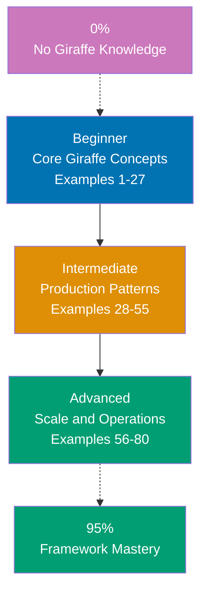

## Want to Master Giraffe Through Working Code?

This guide teaches you F# Giraffe through **80 production-ready code examples** rather than lengthy explanations. If you're an experienced developer adopting F# for web development, or a .NET developer moving from C# ASP.NET to functional F#, you'll build intuition through actual working patterns.

## What Is By-Example Learning?

By-example learning is a **code-first approach** where you learn concepts through annotated, working examples rather than narrative explanations. Each example shows:

1. **What the code does** - Brief explanation of the Giraffe concept
2. **How it works** - A focused, heavily commented code example
3. **Why it matters** - A pattern summary highlighting the key takeaway

This approach works best when you already understand programming fundamentals. You learn Giraffe's idioms, patterns, and best practices by studying real code rather than theoretical descriptions.

## What Is F# Giraffe?

Giraffe is a **functional ASP.NET Core web framework for F#** that embraces functional programming as a first-class design principle. Key distinctions:

- **Not MVC**: Giraffe composes HTTP handlers as pure functions rather than controller classes
- **Functional first**: The `HttpHandler` type (`HttpFunc -> HttpContext -> Task<HttpContext option>`) enables composable pipelines
- **ASP.NET Core native**: Runs on Kestrel, uses all ASP.NET Core middleware, DI, and hosting APIs
- **Type-safe routing**: Pattern matching on routes eliminates runtime errors from URL mismatches
- **F# idiomatic**: Discriminated unions, computation expressions, and immutable records feel natural

## Learning Path



## Coverage Philosophy: 95% Through 80 Examples

The **95% coverage** means you'll understand Giraffe deeply enough to build production systems with confidence. It does not mean you'll know every edge case or advanced feature - those come with experience.

The 80 examples are organized progressively:

- **Beginner (Examples 1-27)**: Foundation concepts (HttpHandler, routing, responses, model binding, ViewEngine, error handling, logging, configuration)
- **Intermediate (Examples 28-55)**: Production patterns (composition operators, authentication, authorization, DI, database, file upload, WebSocket, testing, streaming, CORS)
- **Advanced (Examples 56-80)**: Scale and operations (custom computation expressions, middleware deep dive, SignalR, health checks, metrics, OpenTelemetry, caching, API versioning, Docker, Kestrel tuning, rate limiting)

Together, these examples cover **95% of what you'll use** in production Giraffe applications.

## What's Covered

### Core Framework Concepts

- **HttpHandler type**: The fundamental `HttpFunc -> HttpContext -> Task<HttpContext option>` composition unit
- **Routing**: `choose`, `route`, `routef`, `routeStartsWith`, `subRoute`, path/query parameter extraction
- **Responses**: `text`, `json`, `htmlView`, `setStatusCode`, `redirectTo`, `setHttpHeader`, content negotiation
- **Request model binding**: `bindJson`, `bindForm`, `bindQueryString`, `tryBindJson`, `tryBindForm`
- **Giraffe ViewEngine**: Strongly-typed HTML DSL using F# discriminated unions and computation expressions

### Middleware and Composition

- **Composition operators**: `>=>` (fish operator) for sequential handler chaining
- **`choose` combinator**: Short-circuit routing with ordered handler selection
- **`warbler`**: Deferred handler construction for per-request logic
- **Custom HttpHandlers**: Building reusable middleware as composable functions
- **ASP.NET Core middleware**: Using `UseMiddleware`, `Use`, and `Run` alongside Giraffe

### Authentication and Authorization

- **JWT Bearer authentication**: Token validation, claims extraction, protected routes
- **Cookie authentication**: Session-based login, sign-in/sign-out, persistent sessions
- **`requiresAuthentication`**: Built-in Giraffe authorization handler
- **`requiresRole` and `requiresClaim`**: Fine-grained authorization handlers
- **Custom authorization**: Policy-based access control via ASP.NET Core authorization

### Data and Persistence

- **Dapper integration**: Lightweight SQL mapping with F# records and option types
- **Entity Framework Core**: Code-first with F# types, migrations, async queries
- **Repository pattern**: F# interfaces and DI for testable data access
- **Async workflows**: `task {}` computation expressions for non-blocking I/O

### Testing

- **Microsoft.AspNetCore.TestHost**: In-process integration testing
- **xUnit with F#**: Test organization, fixtures, and assertions
- **Handler unit testing**: Testing pure `HttpHandler` functions directly
- **Property-based testing**: FsCheck for invariant verification

### Production and Operations

- **Deployment**: .NET publish, Docker containerization, environment configuration
- **Observability**: Health checks, metrics (EventCounters), OpenTelemetry tracing
- **Performance**: Response caching, output caching, streaming responses
- **Resilience**: Rate limiting, Polly for retry/circuit breaker, graceful shutdown

## What's NOT Covered

We exclude topics that belong in specialized tutorials:

- **F# language fundamentals**: Master F# basics (pattern matching, computation expressions, type system) first through language tutorials
- **ASP.NET Core internals**: Kestrel internals, hosting model internals, request pipeline implementation details
- **Database-specific features**: Deep SQL optimization, PostgreSQL internals, complex schema design
- **Infrastructure**: Kubernetes, Terraform, cloud provider-specific deployment
- **Framework internals**: How Giraffe's HttpHandler machinery works under the hood

For these topics, see dedicated tutorials and official documentation.

## How to Use This Guide

### 1. Choose Your Starting Point

- **New to Giraffe?** Start with Beginner (Example 1)
- **Framework experience** (Express, Gin, Phoenix)? Start with Intermediate (Example 28)
- **Building a specific feature?** Search for the relevant example topic

### 2. Read the Example

Each example has five parts:

- **Explanation** (2-3 sentences): What Giraffe concept, why it exists, when to use it
- **Diagram** (optional): Mermaid diagram when visualizing flow improves understanding
- **Code** (with heavy annotations): Working F# code showing the pattern with `// =>` annotations
- **Key Takeaway** (1-2 sentences): Distilled essence of the pattern
- **Why It Matters** (50-100 words): Production context and impact

### 3. Run the Code

Create a minimal Giraffe project and run each example:

```bash
dotnet new web -lang F# -n GiraffeExamples
cd GiraffeExamples
dotnet add package Giraffe
# Paste example code, then:
dotnet run
```

### 4. Modify and Experiment

Change handler logic, add routes, break things on purpose. Experiment builds intuition faster than reading.

### 5. Reference as Needed

Use this guide as a reference when building features. Search for relevant examples and adapt patterns to your code.

## Relationship to Other Tutorial Types

| Tutorial Type               | Approach                     | Coverage          | Best For                      |
| --------------------------- | ---------------------------- | ----------------- | ----------------------------- |
| **By Example** (this guide) | Code-first, 80 examples      | 95% breadth       | Learning framework idioms     |
| **Quick Start**             | Project-based, hands-on      | 5-30% touchpoints | Getting something working     |
| **By Concept**              | Narrative, explanation-first | 0-95% depth       | Understanding concepts deeply |

## Prerequisites

### Required

- **F# fundamentals**: Functions, pattern matching, discriminated unions, records, computation expressions
- **Web development basics**: HTTP request/response cycle, JSON, REST conventions
- **.NET runtime**: Understanding of .NET Core hosting, `Program.fs` entry point

### Recommended

- **ASP.NET Core familiarity**: Middleware, DI container, configuration system
- **Async programming**: `Task<T>`, `async/await` patterns, or F# `async {}` workflows
- **SQL basics**: For database examples (Dapper/EF Core)

### Not Required

- **Giraffe experience**: This guide assumes you're new to the framework
- **C# ASP.NET experience**: Helpful but not necessary
- **Previous web framework experience**: Not required, but accelerates understanding

## Learning Strategies

### For F# Developers New to Giraffe

You know F# but haven't used Giraffe for web. Focus on understanding how HttpHandlers compose:

- **Master HttpHandler first** (Examples 1-5) - Understand the type signature before everything else
- **Routing and composition** (Examples 6-15) - The `>=>` operator and `choose` combinator define Giraffe's style
- **Recommended path**: Examples 1-27 (Beginner) → Examples 32-40 (Auth) → Examples 45-55 (Testing)

### For C# ASP.NET Core Developers Switching to F#

You know the hosting model but need the functional shift:

- **Understand HttpHandler vs Controller** (Examples 1-5) - Functions replace class methods
- **Composition over inheritance** (Examples 6-10) - `>=>` replaces middleware registration order
- **Immutable models** (Examples 16-20) - F# records replace mutable C# POCOs
- **Recommended path**: Examples 1-15 (Giraffe fundamentals) → Examples 28-35 (F# patterns in production)

### For Node.js/Express Developers

Express middleware conceptually maps to Giraffe's HttpHandler chain:

- **HttpHandler maps to Express middleware** - Both are `(req, res, next) -> unit` style but type-safe
- **`choose` maps to `app.use`** - Route selection in the same ordered-matching fashion
- **`>=>` maps to `next()`** - Chaining handlers explicitly instead of implicitly
- **Recommended path**: Examples 1-10 → Examples 28-35

### For Go/Gin Developers

Gin's handler-based routing closely mirrors Giraffe:

- **HttpHandler maps to `gin.HandlerFunc`** - Both are pure functions, Giraffe adds type safety via `option`
- **`choose` maps to router groups** - Ordered matching with early exit
- **`routef` maps to path parameters** - Type-safe extraction versus `c.Param()`
- **Recommended path**: Examples 1-27 (entire Beginner section) to learn F#-specific idioms

## Structure of Each Example

All examples follow a consistent 5-part format:

````
### Example N: Descriptive Title

2-3 sentence explanation of the concept and when to use it.

[Optional Mermaid diagram for complex flows]

```fsharp
// Heavily annotated code example
// showing the Giraffe pattern in action
// => annotations show values, types, and side effects
````

**Key Takeaway**: 1-2 sentence summary.

**Why It Matters**: 50-100 word production context.

```

**Code annotations**:

- `// =>` shows expected output, values, or inferred types
- Inline comments explain what each line does and why
- Variable names are self-documenting

**Mermaid diagrams** appear when visualizing flow or architecture improves understanding. We use a color-blind friendly palette:

- Blue #0173B2 - Primary
- Orange #DE8F05 - Secondary
- Teal #029E73 - Accent
- Purple #CC78BC - Alternative
- Brown #CA9161 - Neutral

## Ready to Start?

Choose your learning path:

- **[Beginner](/en/learn/software-engineering/platform-web/tools/fsharp-giraffe/by-example/beginner)** - Start here if new to Giraffe. Build foundation understanding through 27 core examples.
- **[Intermediate](/en/learn/software-engineering/platform-web/tools/fsharp-giraffe/by-example/intermediate)** - Jump here if you know Giraffe basics. Master production patterns through 28 examples.
- **[Advanced](/en/learn/software-engineering/platform-web/tools/fsharp-giraffe/by-example/advanced)** - Expert mastery through 25 advanced examples covering scale, performance, and operations.

Or jump to specific topics by searching for relevant example keywords (routing, authentication, testing, deployment, etc.).
```

## Examples by Level

### Beginner (Examples 1–27)

- [Example 1: The HttpHandler Type](/en/learn/software-engineering/platform-web/tools/fsharp-giraffe/by-example/beginner#example-1-the-httphandler-type)
- [Example 2: Returning Text and Status Codes](/en/learn/software-engineering/platform-web/tools/fsharp-giraffe/by-example/beginner#example-2-returning-text-and-status-codes)
- [Example 3: Returning JSON](/en/learn/software-engineering/platform-web/tools/fsharp-giraffe/by-example/beginner#example-3-returning-json)
- [Example 4: The choose Combinator and Basic Routing](/en/learn/software-engineering/platform-web/tools/fsharp-giraffe/by-example/beginner#example-4-the-choose-combinator-and-basic-routing)
- [Example 5: HTTP Method Routing with GET, POST, PUT, DELETE](/en/learn/software-engineering/platform-web/tools/fsharp-giraffe/by-example/beginner#example-5-http-method-routing-with-get-post-put-delete)
- [Example 6: Path Parameters with routef](/en/learn/software-engineering/platform-web/tools/fsharp-giraffe/by-example/beginner#example-6-path-parameters-with-routef)
- [Example 7: Query String Parameters](/en/learn/software-engineering/platform-web/tools/fsharp-giraffe/by-example/beginner#example-7-query-string-parameters)
- [Example 8: HTML Responses with htmlView and Giraffe ViewEngine](/en/learn/software-engineering/platform-web/tools/fsharp-giraffe/by-example/beginner#example-8-html-responses-with-htmlview-and-giraffe-viewengine)
- [Example 9: Redirects and Header Manipulation](/en/learn/software-engineering/platform-web/tools/fsharp-giraffe/by-example/beginner#example-9-redirects-and-header-manipulation)
- [Example 10: Content Negotiation](/en/learn/software-engineering/platform-web/tools/fsharp-giraffe/by-example/beginner#example-10-content-negotiation)
- [Example 11: Binding JSON Request Bodies](/en/learn/software-engineering/platform-web/tools/fsharp-giraffe/by-example/beginner#example-11-binding-json-request-bodies)
- [Example 12: Binding Form Data](/en/learn/software-engineering/platform-web/tools/fsharp-giraffe/by-example/beginner#example-12-binding-form-data)
- [Example 13: ViewEngine Attributes and Styling](/en/learn/software-engineering/platform-web/tools/fsharp-giraffe/by-example/beginner#example-13-viewengine-attributes-and-styling)
- [Example 14: ViewEngine Lists and Conditional Rendering](/en/learn/software-engineering/platform-web/tools/fsharp-giraffe/by-example/beginner#example-14-viewengine-lists-and-conditional-rendering)
- [Example 15: Serving Static Files](/en/learn/software-engineering/platform-web/tools/fsharp-giraffe/by-example/beginner#example-15-serving-static-files)
- [Example 16: Error Handling with handleContext and setStatusCode](/en/learn/software-engineering/platform-web/tools/fsharp-giraffe/by-example/beginner#example-16-error-handling-with-handlecontext-and-setstatuscode)
- [Example 17: Structured Logging with ILogger](/en/learn/software-engineering/platform-web/tools/fsharp-giraffe/by-example/beginner#example-17-structured-logging-with-ilogger)
- [Example 18: warbler for Deferred Handler Construction](/en/learn/software-engineering/platform-web/tools/fsharp-giraffe/by-example/beginner#example-18-warbler-for-deferred-handler-construction)
- [Example 19: Reading Configuration](/en/learn/software-engineering/platform-web/tools/fsharp-giraffe/by-example/beginner#example-19-reading-configuration)
- [Example 20: Environment-Based Configuration](/en/learn/software-engineering/platform-web/tools/fsharp-giraffe/by-example/beginner#example-20-environment-based-configuration)
- [Example 21: routeStartsWith and subRoute](/en/learn/software-engineering/platform-web/tools/fsharp-giraffe/by-example/beginner#example-21-routestartswith-and-subroute)
- [Example 22: routeCiStartsWith and Case-Insensitive Routing](/en/learn/software-engineering/platform-web/tools/fsharp-giraffe/by-example/beginner#example-22-routecistartswith-and-case-insensitive-routing)
- [Example 23: Handling Multiple Content Types in Responses](/en/learn/software-engineering/platform-web/tools/fsharp-giraffe/by-example/beginner#example-23-handling-multiple-content-types-in-responses)
- [Example 24: Accessing Request Headers and Body Metadata](/en/learn/software-engineering/platform-web/tools/fsharp-giraffe/by-example/beginner#example-24-accessing-request-headers-and-body-metadata)
- [Example 25: Composing Handlers as Values](/en/learn/software-engineering/platform-web/tools/fsharp-giraffe/by-example/beginner#example-25-composing-handlers-as-values)
- [Example 26: Returning 404 and Custom Not-Found Responses](/en/learn/software-engineering/platform-web/tools/fsharp-giraffe/by-example/beginner#example-26-returning-404-and-custom-not-found-responses)
- [Example 27: Request Pipeline Order and Middleware Integration](/en/learn/software-engineering/platform-web/tools/fsharp-giraffe/by-example/beginner#example-27-request-pipeline-order-and-middleware-integration)

### Intermediate (Examples 28–55)

- [Example 28: The Fish Operator >=> in Depth](/en/learn/software-engineering/platform-web/tools/fsharp-giraffe/by-example/intermediate#example-28-the-fish-operator--in-depth)
- [Example 29: Building Reusable Middleware as HttpHandlers](/en/learn/software-engineering/platform-web/tools/fsharp-giraffe/by-example/intermediate#example-29-building-reusable-middleware-as-httphandlers)
- [Example 30: JWT Bearer Authentication](/en/learn/software-engineering/platform-web/tools/fsharp-giraffe/by-example/intermediate#example-30-jwt-bearer-authentication)
- [Example 31: Cookie Authentication and Session Management](/en/learn/software-engineering/platform-web/tools/fsharp-giraffe/by-example/intermediate#example-31-cookie-authentication-and-session-management)
- [Example 32: Role-Based Authorization](/en/learn/software-engineering/platform-web/tools/fsharp-giraffe/by-example/intermediate#example-32-role-based-authorization)
- [Example 33: Injecting Services into Handlers](/en/learn/software-engineering/platform-web/tools/fsharp-giraffe/by-example/intermediate#example-33-injecting-services-into-handlers)
- [Example 34: Using IHttpContextAccessor and Scoped Services](/en/learn/software-engineering/platform-web/tools/fsharp-giraffe/by-example/intermediate#example-34-using-ihttpcontextaccessor-and-scoped-services)
- [Example 35: Dapper with F# Records](/en/learn/software-engineering/platform-web/tools/fsharp-giraffe/by-example/intermediate#example-35-dapper-with-f-records)
- [Example 36: Entity Framework Core with F# Types](/en/learn/software-engineering/platform-web/tools/fsharp-giraffe/by-example/intermediate#example-36-entity-framework-core-with-f-types)
- [Example 37: File Upload Handling](/en/learn/software-engineering/platform-web/tools/fsharp-giraffe/by-example/intermediate#example-37-file-upload-handling)
- [Example 38: WebSocket Connections](/en/learn/software-engineering/platform-web/tools/fsharp-giraffe/by-example/intermediate#example-38-websocket-connections)
- [Example 39: Integration Testing with TestHost](/en/learn/software-engineering/platform-web/tools/fsharp-giraffe/by-example/intermediate#example-39-integration-testing-with-testhost)
- [Example 40: Unit Testing Pure HttpHandlers](/en/learn/software-engineering/platform-web/tools/fsharp-giraffe/by-example/intermediate#example-40-unit-testing-pure-httphandlers)
- [Example 41: Streaming Responses](/en/learn/software-engineering/platform-web/tools/fsharp-giraffe/by-example/intermediate#example-41-streaming-responses)
- [Example 42: Configuring CORS](/en/learn/software-engineering/platform-web/tools/fsharp-giraffe/by-example/intermediate#example-42-configuring-cors)
- [Example 43: Configuring System.Text.Json Options](/en/learn/software-engineering/platform-web/tools/fsharp-giraffe/by-example/intermediate#example-43-configuring-systemtextjson-options)
- [Example 44: task {} and Async Patterns](/en/learn/software-engineering/platform-web/tools/fsharp-giraffe/by-example/intermediate#example-44-task--and-async-patterns)
- [Example 45: Error Handling with Result and Option in Handlers](/en/learn/software-engineering/platform-web/tools/fsharp-giraffe/by-example/intermediate#example-45-error-handling-with-result-and-option-in-handlers)
- [Example 46: Multipart Form with Metadata and File](/en/learn/software-engineering/platform-web/tools/fsharp-giraffe/by-example/intermediate#example-46-multipart-form-with-metadata-and-file)
- [Example 47: Request Validation Middleware](/en/learn/software-engineering/platform-web/tools/fsharp-giraffe/by-example/intermediate#example-47-request-validation-middleware)
- [Example 48: Response Caching Headers](/en/learn/software-engineering/platform-web/tools/fsharp-giraffe/by-example/intermediate#example-48-response-caching-headers)
- [Example 49: Reading and Setting Cookies (Non-Auth)](/en/learn/software-engineering/platform-web/tools/fsharp-giraffe/by-example/intermediate#example-49-reading-and-setting-cookies-non-auth)
- [Example 50: Middleware for Request/Response Logging](/en/learn/software-engineering/platform-web/tools/fsharp-giraffe/by-example/intermediate#example-50-middleware-for-requestresponse-logging)
- [Example 51: Rate Limiting with IMemoryCache](/en/learn/software-engineering/platform-web/tools/fsharp-giraffe/by-example/intermediate#example-51-rate-limiting-with-imemorycache)
- [Example 52: Custom Error Handler Registration](/en/learn/software-engineering/platform-web/tools/fsharp-giraffe/by-example/intermediate#example-52-custom-error-handler-registration)
- [Example 53: Multipart Response and File Download with Range Support](/en/learn/software-engineering/platform-web/tools/fsharp-giraffe/by-example/intermediate#example-53-multipart-response-and-file-download-with-range-support)
- [Example 54: Custom Response Writers](/en/learn/software-engineering/platform-web/tools/fsharp-giraffe/by-example/intermediate#example-54-custom-response-writers)
- [Example 55: Health Check Integration](/en/learn/software-engineering/platform-web/tools/fsharp-giraffe/by-example/intermediate#example-55-health-check-integration)

### Advanced (Examples 56–80)

- [Example 56: Building a Validation Computation Expression](/en/learn/software-engineering/platform-web/tools/fsharp-giraffe/by-example/advanced#example-56-building-a-validation-computation-expression)
- [Example 57: Async Workflow with Cancellation and Timeout](/en/learn/software-engineering/platform-web/tools/fsharp-giraffe/by-example/advanced#example-57-async-workflow-with-cancellation-and-timeout)
- [Example 58: Request Enrichment Middleware](/en/learn/software-engineering/platform-web/tools/fsharp-giraffe/by-example/advanced#example-58-request-enrichment-middleware)
- [Example 59: Conditional Middleware Application](/en/learn/software-engineering/platform-web/tools/fsharp-giraffe/by-example/advanced#example-59-conditional-middleware-application)
- [Example 60: Real-Time Notifications with SignalR](/en/learn/software-engineering/platform-web/tools/fsharp-giraffe/by-example/advanced#example-60-real-time-notifications-with-signalr)
- [Example 61: OpenTelemetry Distributed Tracing](/en/learn/software-engineering/platform-web/tools/fsharp-giraffe/by-example/advanced#example-61-opentelemetry-distributed-tracing)
- [Example 62: Custom Metrics with EventCounters](/en/learn/software-engineering/platform-web/tools/fsharp-giraffe/by-example/advanced#example-62-custom-metrics-with-eventcounters)
- [Example 63: Output Caching for Expensive Endpoints](/en/learn/software-engineering/platform-web/tools/fsharp-giraffe/by-example/advanced#example-63-output-caching-for-expensive-endpoints)
- [Example 64: URL-Based API Versioning](/en/learn/software-engineering/platform-web/tools/fsharp-giraffe/by-example/advanced#example-64-url-based-api-versioning)
- [Example 65: ViewEngine Component Library](/en/learn/software-engineering/platform-web/tools/fsharp-giraffe/by-example/advanced#example-65-viewengine-component-library)
- [Example 66: Dockerfile for Giraffe Applications](/en/learn/software-engineering/platform-web/tools/fsharp-giraffe/by-example/advanced#example-66-dockerfile-for-giraffe-applications)
- [Example 67: Environment Variables and Secrets Management](/en/learn/software-engineering/platform-web/tools/fsharp-giraffe/by-example/advanced#example-67-environment-variables-and-secrets-management)
- [Example 68: Kestrel Configuration for Production](/en/learn/software-engineering/platform-web/tools/fsharp-giraffe/by-example/advanced#example-68-kestrel-configuration-for-production)
- [Example 69: Thread Pool and GC Tuning](/en/learn/software-engineering/platform-web/tools/fsharp-giraffe/by-example/advanced#example-69-thread-pool-and-gc-tuning)
- [Example 70: ASP.NET Core 7+ Rate Limiting Middleware](/en/learn/software-engineering/platform-web/tools/fsharp-giraffe/by-example/advanced#example-70-aspnet-core-7-rate-limiting-middleware)
- [Example 71: Graceful Shutdown](/en/learn/software-engineering/platform-web/tools/fsharp-giraffe/by-example/advanced#example-71-graceful-shutdown)
- [Example 72: Background Services with IHostedService](/en/learn/software-engineering/platform-web/tools/fsharp-giraffe/by-example/advanced#example-72-background-services-with-ihostedservice)
- [Example 73: Polly for Resilience (Retry and Circuit Breaker)](/en/learn/software-engineering/platform-web/tools/fsharp-giraffe/by-example/advanced#example-73-polly-for-resilience-retry-and-circuit-breaker)
- [Example 74: Distributed Caching with IDistributedCache](/en/learn/software-engineering/platform-web/tools/fsharp-giraffe/by-example/advanced#example-74-distributed-caching-with-idistributedcache)
- [Example 75: Structured Logging with Serilog](/en/learn/software-engineering/platform-web/tools/fsharp-giraffe/by-example/advanced#example-75-structured-logging-with-serilog)
- [Example 76: API Documentation with Swagger/OpenAPI](/en/learn/software-engineering/platform-web/tools/fsharp-giraffe/by-example/advanced#example-76-api-documentation-with-swaggeropenapi)
- [Example 77: Security Headers Middleware](/en/learn/software-engineering/platform-web/tools/fsharp-giraffe/by-example/advanced#example-77-security-headers-middleware)
- [Example 78: Connection Multiplexing with HTTP/2](/en/learn/software-engineering/platform-web/tools/fsharp-giraffe/by-example/advanced#example-78-connection-multiplexing-with-http2)
- [Example 79: Minimal API and Giraffe Hybrid](/en/learn/software-engineering/platform-web/tools/fsharp-giraffe/by-example/advanced#example-79-minimal-api-and-giraffe-hybrid)
- [Example 80: Production Checklist Implementation](/en/learn/software-engineering/platform-web/tools/fsharp-giraffe/by-example/advanced#example-80-production-checklist-implementation)
