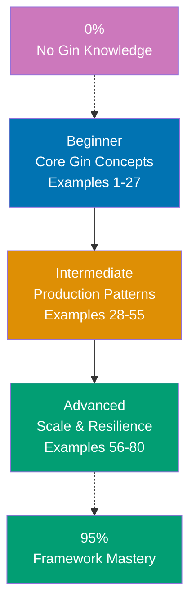

## Want to Master Gin Through Working Code?

This guide teaches you the Go Gin web framework through **80 production-ready code examples** rather than lengthy explanations. If you are an experienced developer switching to Go or deepening your backend skills, you will build intuition through actual working patterns.

## What Is By-Example Learning?

By-example learning is a **code-first approach** where you learn concepts through annotated, working examples rather than narrative explanations. Each example shows:

1. **What the code does** - Brief explanation of the Gin concept
2. **How it works** - A focused, heavily commented code example
3. **Why it matters** - A pattern summary highlighting the key takeaway

This approach works best when you already understand programming fundamentals. You learn Gin's idioms, patterns, and best practices by studying real code rather than theoretical descriptions.

## What Is Go Gin?

Gin is a **high-performance HTTP web framework for Go** that prioritizes speed, minimal overhead, and developer productivity. Key distinctions:

- **Not Rails or Django**: Gin is explicit and minimalist, relying on Go's standard library for many features
- **Performance-first**: Gin uses a radix tree router and zero-allocation design, delivering significantly higher throughput than most frameworks
- **Middleware-driven**: Request handling composability through chainable middleware functions
- **JSON-native**: Built-in JSON binding, validation, and serialization optimized for API-first design
- **Production-proven**: Powers high-traffic services at scale with predictable memory footprint

## Learning Path



## Coverage Philosophy: 95% Through 80 Examples

The **95% coverage** means you will understand Gin deeply enough to build production systems with confidence. It does not mean you will know every edge case or advanced feature—those come with experience.

The 80 examples are organized progressively:

- **Beginner (Examples 1-27)**: Foundation concepts (routing, handlers, JSON, query params, middleware basics, static files, templates, groups, redirects, cookies, headers, basic auth)
- **Intermediate (Examples 28-55)**: Production patterns (custom middleware, JWT, CORS, rate limiting, file upload, validation, error handling, database, graceful shutdown, logging, config, testing)
- **Advanced (Examples 56-80)**: Scale and resilience (custom validators, middleware chains, WebSocket, SSE, reverse proxy, Prometheus, distributed tracing, circuit breaker, caching, API versioning, OpenAPI, deployment)

Together, these examples cover **95% of what you will use** in production Gin applications.

## What Is Covered

### Core Web Framework Concepts

- **Routing & HTTP**: Radix tree router, path parameters, wildcards, HTTP method handlers, route groups
- **Request Handling**: Query params, form data, JSON binding, multipart forms, headers, cookies
- **Response Types**: JSON, XML, HTML templates, file serving, redirects, status codes
- **Middleware**: Built-in middleware, custom middleware, middleware chaining, abort patterns

### Security & Authentication

- **Basic Auth**: Built-in BasicAuth middleware for simple credential checks
- **JWT Authentication**: Token generation, validation middleware, refresh token patterns
- **CORS**: Cross-origin resource sharing configuration with gin-contrib/cors
- **Rate Limiting**: Per-IP and per-route rate limiting patterns
- **Input Validation**: Struct tags with binding, custom validators, sanitization

### Data & Integration

- **JSON API**: Binding, validation, serialization, nested objects, arrays
- **Database Integration**: GORM patterns, repository pattern, connection pooling, transactions
- **File Operations**: Upload handling, multipart forms, static file serving
- **Configuration**: Environment-based config, Viper integration, structured config structs

### Testing & Quality

- **Unit Testing**: httptest package, table-driven tests, handler isolation
- **Integration Testing**: Full request-response cycle, middleware testing, mock dependencies
- **Benchmarks**: Performance measurement with Go benchmarks

### Production & Operations

- **Graceful Shutdown**: OS signal handling, connection draining, timeout management
- **Logging**: Structured logging, request logging middleware, log levels
- **Metrics**: Prometheus integration, custom metrics, health checks
- **Observability**: Distributed tracing with OpenTelemetry, structured logs
- **Deployment**: Docker containerization, multi-stage builds, environment configuration

## What Is NOT Covered

We exclude topics that belong in specialized tutorials:

- **Detailed Go syntax**: Master Go fundamentals first through language tutorials
- **Advanced DevOps**: Kubernetes, infrastructure-as-code, complex deployments
- **Database internals**: Deep PostgreSQL/MySQL optimization, advanced SQL
- **Go runtime internals**: Garbage collector tuning, goroutine scheduler details
- **Framework internals**: How Gin processes requests internally, radix tree implementation details

For these topics, see dedicated tutorials and framework documentation.

## How to Use This Guide

### 1. Choose Your Starting Point

- **New to Gin?** Start with Beginner (Example 1)
- **Framework experience** (Express, Flask, Spring)? Start with Intermediate (Example 28)
- **Building a specific feature?** Search for relevant example topic

### 2. Read the Example

Each example has five parts:

- **Explanation** (2-3 sentences): What Gin concept, why it exists, when to use it
- **Diagram** (when applicable): Visual representation of flow or architecture
- **Code** (with heavy comments): Working Go code showing the pattern
- **Key Takeaway** (1-2 sentences): Distilled essence of the pattern
- **Why It Matters** (50-100 words): Production relevance and real-world impact

### 3. Run the Code

Create a test module and run each example:

```bash
mkdir gin-examples && cd gin-examples
go mod init gin-examples
go get github.com/gin-gonic/gin
# Paste example code into main.go
go run main.go
```

### 4. Modify and Experiment

Change route paths, add middleware, break things on purpose. Experimenting builds intuition faster than reading.

### 5. Reference as Needed

Use this guide as a reference when building features. Search for relevant examples and adapt patterns to your code.

## Relationship to Other Tutorial Types

| Tutorial Type               | Approach                       | Coverage            | Best For                       | Why Different                       |
| --------------------------- | ------------------------------ | ------------------- | ------------------------------ | ----------------------------------- |
| **By Example** (this guide) | Code-first, 80 examples        | 95% breadth         | Learning framework idioms      | Emphasizes patterns through code    |
| **Quick Start**             | Project-based, hands-on        | 5-30% touchpoints   | Getting something working fast | Linear project flow, minimal theory |
| **Beginner Tutorial**       | Narrative, explanation-first   | 0-60% comprehensive | Understanding concepts deeply  | Detailed explanations, slower pace  |
| **Cookbook**                | Recipe-based, problem-solution | Problem-specific    | Solving specific problems      | Quick solutions, minimal context    |

## Prerequisites

### Required

- **Go fundamentals**: Basic syntax, structs, interfaces, goroutines, channels, error handling
- **Web development**: HTTP basics, JSON, REST API concepts
- **Programming experience**: You have built applications before in another language

### Recommended

- **Go modules**: `go mod init`, dependency management with `go get`
- **Relational databases**: SQL basics, schema design (for database integration examples)
- **Docker basics**: Container concepts for deployment examples

### Not Required

- **Gin experience**: This guide assumes you are new to the framework
- **Go expertise**: Beginner-to-intermediate Go knowledge suffices
- **Web framework experience**: Not necessary, but helpful

## Learning Strategies

### For Go Developers New to Gin

You know Go but haven't used Gin. Focus on understanding Gin's conventions and HTTP patterns:

- **Start with routing** (Examples 1-5): Understand Gin's radix tree router and handler signatures before middleware
- **Master context early** (Examples 6-10): `gin.Context` is central to every handler; grasp its methods deeply
- **Focus on binding** (Examples 11-15): Gin's binding and validation replace manual JSON parsing
- **Recommended path**: Examples 1-27 (Beginner) → 28-40 (Middleware and auth) → 41-55 (Database and testing)

### For Express/Node.js Developers Switching to Go

Express and Gin share architectural similarities but differ in type safety and concurrency:

- **Map middleware concepts**: Express middleware and Gin middleware are structurally similar; both use `next()` / `c.Next()` patterns
- **Understand static typing**: Go structs replace JavaScript objects; binding replaces manual `req.body` parsing
- **Learn error patterns**: Go's explicit error returns replace try/catch; see Examples 30-35 for idiomatic patterns
- **Recommended path**: Examples 1-15 (Gin basics) → Examples 28-40 (Middleware patterns) → Examples 41-50 (Database)

### For Python/Flask Developers Switching to Go

Flask and Gin are both micro-frameworks, but Go's static typing changes everything:

- **Map Flask patterns**: Routes, decorators → route handlers, middleware; blueprints → route groups
- **Understand compilation**: Go's compiler catches errors Flask misses at runtime; embrace struct binding
- **Learn goroutine concurrency**: Go's goroutines replace Flask's threading/async; see Examples 60-65
- **Recommended path**: Examples 1-20 (Gin fundamentals) → Examples 28-45 (Production patterns) → Examples 56-70 (Advanced)

### For Java/Spring Developers Switching to Go

Spring's annotation-driven approach contrasts sharply with Gin's functional composition:

- **Understand explicit wiring**: Gin has no dependency injection container; wire dependencies manually
- **Map annotations to code**: `@GetMapping` → `r.GET(...)`, `@RequestBody` → struct binding
- **Learn functional middleware**: Spring interceptors map to Gin middleware functions
- **Recommended path**: Examples 1-15 (Gin fundamentals) → Examples 20-30 (Middleware) → Examples 45-55 (Testing and config)

## Structure of Each Example

All examples follow a consistent 5-part format:

````
### Example N: Descriptive Title

2-3 sentence explanation of the concept.

[Optional Mermaid diagram for complex concepts]

```go
// Heavily annotated code example
// showing the Gin pattern in action
// => annotations show values and outputs
````

**Key Takeaway**: 1-2 sentence summary.

**Why It Matters**: 50-100 words on production relevance.

```

**Code annotations**:

- `// =>` shows expected output or result
- Inline comments explain what each line does and why
- Variable names are self-documenting

**Mermaid diagrams** appear when visualizing flow or architecture improves understanding. We use a color-blind friendly palette:

- Blue #0173B2 - Primary
- Orange #DE8F05 - Secondary
- Teal #029E73 - Accent
- Purple #CC78BC - Alternative
- Brown #CA9161 - Neutral

## Ready to Start?

Choose your learning path:

- **[Beginner](/en/learn/software-engineering/platform-web/tools/golang-gin/by-example/beginner)** - Start here if new to Gin. Build foundation understanding through 27 core examples.
- **[Intermediate](/en/learn/software-engineering/platform-web/tools/golang-gin/by-example/intermediate)** - Jump here if you know Gin basics. Master production patterns through 28 examples.
- **[Advanced](/en/learn/software-engineering/platform-web/tools/golang-gin/by-example/advanced)** - Expert mastery through 25 advanced examples covering scale, performance, and resilience.

Or jump to specific topics by searching for relevant example keywords (routing, authentication, middleware, testing, deployment, etc.).
```

## Examples by Level

### Beginner (Examples 1–27)

- [Example 1: Minimal Gin Server](/en/learn/software-engineering/platform-web/tools/golang-gin/by-example/beginner#example-1-minimal-gin-server)
- [Example 2: HTTP Method Handlers](/en/learn/software-engineering/platform-web/tools/golang-gin/by-example/beginner#example-2-http-method-handlers)
- [Example 3: Path Parameters](/en/learn/software-engineering/platform-web/tools/golang-gin/by-example/beginner#example-3-path-parameters)
- [Example 4: Query Parameters](/en/learn/software-engineering/platform-web/tools/golang-gin/by-example/beginner#example-4-query-parameters)
- [Example 5: JSON Response](/en/learn/software-engineering/platform-web/tools/golang-gin/by-example/beginner#example-5-json-response)
- [Example 6: JSON Request Binding](/en/learn/software-engineering/platform-web/tools/golang-gin/by-example/beginner#example-6-json-request-binding)
- [Example 7: Form Data and URL-Encoded Input](/en/learn/software-engineering/platform-web/tools/golang-gin/by-example/beginner#example-7-form-data-and-url-encoded-input)
- [Example 8: XML and YAML Responses](/en/learn/software-engineering/platform-web/tools/golang-gin/by-example/beginner#example-8-xml-and-yaml-responses)
- [Example 9: HTTP Status Codes and Empty Responses](/en/learn/software-engineering/platform-web/tools/golang-gin/by-example/beginner#example-9-http-status-codes-and-empty-responses)
- [Example 10: HTML Templates](/en/learn/software-engineering/platform-web/tools/golang-gin/by-example/beginner#example-10-html-templates)
- [Example 11: Route Groups](/en/learn/software-engineering/platform-web/tools/golang-gin/by-example/beginner#example-11-route-groups)
- [Example 12: Redirects](/en/learn/software-engineering/platform-web/tools/golang-gin/by-example/beginner#example-12-redirects)
- [Example 13: Static File Serving](/en/learn/software-engineering/platform-web/tools/golang-gin/by-example/beginner#example-13-static-file-serving)
- [Example 14: Request Headers](/en/learn/software-engineering/platform-web/tools/golang-gin/by-example/beginner#example-14-request-headers)
- [Example 15: Cookies](/en/learn/software-engineering/platform-web/tools/golang-gin/by-example/beginner#example-15-cookies)
- [Example 16: Context Values (Key-Value Store)](/en/learn/software-engineering/platform-web/tools/golang-gin/by-example/beginner#example-16-context-values-key-value-store)
- [Example 17: Basic Authentication](/en/learn/software-engineering/platform-web/tools/golang-gin/by-example/beginner#example-17-basic-authentication)
- [Example 18: Logger Middleware](/en/learn/software-engineering/platform-web/tools/golang-gin/by-example/beginner#example-18-logger-middleware)
- [Example 19: Recovery Middleware](/en/learn/software-engineering/platform-web/tools/golang-gin/by-example/beginner#example-19-recovery-middleware)
- [Example 20: Middleware Execution Order](/en/learn/software-engineering/platform-web/tools/golang-gin/by-example/beginner#example-20-middleware-execution-order)
- [Example 21: Aborting Middleware](/en/learn/software-engineering/platform-web/tools/golang-gin/by-example/beginner#example-21-aborting-middleware)
- [Example 22: Struct Validation Tags](/en/learn/software-engineering/platform-web/tools/golang-gin/by-example/beginner#example-22-struct-validation-tags)
- [Example 23: Binding Query Parameters to Structs](/en/learn/software-engineering/platform-web/tools/golang-gin/by-example/beginner#example-23-binding-query-parameters-to-structs)
- [Example 24: Single File Upload](/en/learn/software-engineering/platform-web/tools/golang-gin/by-example/beginner#example-24-single-file-upload)
- [Example 25: Multiple File Upload](/en/learn/software-engineering/platform-web/tools/golang-gin/by-example/beginner#example-25-multiple-file-upload)
- [Example 26: Centralized Error Handling](/en/learn/software-engineering/platform-web/tools/golang-gin/by-example/beginner#example-26-centralized-error-handling)
- [Example 27: NoRoute and NoMethod Handlers](/en/learn/software-engineering/platform-web/tools/golang-gin/by-example/beginner#example-27-noroute-and-nomethod-handlers)

### Intermediate (Examples 28–55)

- [Example 28: Request ID Middleware](/en/learn/software-engineering/platform-web/tools/golang-gin/by-example/intermediate#example-28-request-id-middleware)
- [Example 29: CORS Middleware](/en/learn/software-engineering/platform-web/tools/golang-gin/by-example/intermediate#example-29-cors-middleware)
- [Example 30: JWT Authentication Middleware](/en/learn/software-engineering/platform-web/tools/golang-gin/by-example/intermediate#example-30-jwt-authentication-middleware)
- [Example 31: Rate Limiting Middleware](/en/learn/software-engineering/platform-web/tools/golang-gin/by-example/intermediate#example-31-rate-limiting-middleware)
- [Example 32: Timeout Middleware](/en/learn/software-engineering/platform-web/tools/golang-gin/by-example/intermediate#example-32-timeout-middleware)
- [Example 33: Token Refresh Pattern](/en/learn/software-engineering/platform-web/tools/golang-gin/by-example/intermediate#example-33-token-refresh-pattern)
- [Example 34: Role-Based Access Control](/en/learn/software-engineering/platform-web/tools/golang-gin/by-example/intermediate#example-34-role-based-access-control)
- [Example 35: GORM Database Integration](/en/learn/software-engineering/platform-web/tools/golang-gin/by-example/intermediate#example-35-gorm-database-integration)
- [Example 36: Database Transactions](/en/learn/software-engineering/platform-web/tools/golang-gin/by-example/intermediate#example-36-database-transactions)
- [Example 37: Pagination Pattern](/en/learn/software-engineering/platform-web/tools/golang-gin/by-example/intermediate#example-37-pagination-pattern)
- [Example 38: Structured Configuration](/en/learn/software-engineering/platform-web/tools/golang-gin/by-example/intermediate#example-38-structured-configuration)
- [Example 39: Structured Logging with Zap](/en/learn/software-engineering/platform-web/tools/golang-gin/by-example/intermediate#example-39-structured-logging-with-zap)
- [Example 40: Handler Unit Testing](/en/learn/software-engineering/platform-web/tools/golang-gin/by-example/intermediate#example-40-handler-unit-testing)
- [Example 41: Table-Driven Handler Tests](/en/learn/software-engineering/platform-web/tools/golang-gin/by-example/intermediate#example-41-table-driven-handler-tests)
- [Example 42: Testing Middleware](/en/learn/software-engineering/platform-web/tools/golang-gin/by-example/intermediate#example-42-testing-middleware)
- [Example 43: Graceful Shutdown](/en/learn/software-engineering/platform-web/tools/golang-gin/by-example/intermediate#example-43-graceful-shutdown)
- [Example 44: Health Check Endpoints](/en/learn/software-engineering/platform-web/tools/golang-gin/by-example/intermediate#example-44-health-check-endpoints)
- [Example 45: Response Compression](/en/learn/software-engineering/platform-web/tools/golang-gin/by-example/intermediate#example-45-response-compression)
- [Example 46: Request Size Limiting](/en/learn/software-engineering/platform-web/tools/golang-gin/by-example/intermediate#example-46-request-size-limiting)
- [Example 47: API Versioning with Route Groups](/en/learn/software-engineering/platform-web/tools/golang-gin/by-example/intermediate#example-47-api-versioning-with-route-groups)
- [Example 48: Environment-Specific Gin Mode](/en/learn/software-engineering/platform-web/tools/golang-gin/by-example/intermediate#example-48-environment-specific-gin-mode)
- [Example 49: Custom Error Types and Error Middleware](/en/learn/software-engineering/platform-web/tools/golang-gin/by-example/intermediate#example-49-custom-error-types-and-error-middleware)
- [Example 50: Binding and Validation Error Responses](/en/learn/software-engineering/platform-web/tools/golang-gin/by-example/intermediate#example-50-binding-and-validation-error-responses)
- [Example 51: Caching Response Headers](/en/learn/software-engineering/platform-web/tools/golang-gin/by-example/intermediate#example-51-caching-response-headers)
- [Example 52: Request Logging with Context Values](/en/learn/software-engineering/platform-web/tools/golang-gin/by-example/intermediate#example-52-request-logging-with-context-values)
- [Example 53: Multipart Form with Text Fields](/en/learn/software-engineering/platform-web/tools/golang-gin/by-example/intermediate#example-53-multipart-form-with-text-fields)
- [Example 54: Context Cancellation in Handlers](/en/learn/software-engineering/platform-web/tools/golang-gin/by-example/intermediate#example-54-context-cancellation-in-handlers)
- [Example 55: Middleware for Business Metrics](/en/learn/software-engineering/platform-web/tools/golang-gin/by-example/intermediate#example-55-middleware-for-business-metrics)

### Advanced (Examples 56–80)

- [Example 56: Custom Validation Rules](/en/learn/software-engineering/platform-web/tools/golang-gin/by-example/advanced#example-56-custom-validation-rules)
- [Example 57: Middleware Chain Architecture](/en/learn/software-engineering/platform-web/tools/golang-gin/by-example/advanced#example-57-middleware-chain-architecture)
- [Example 58: WebSocket Connections](/en/learn/software-engineering/platform-web/tools/golang-gin/by-example/advanced#example-58-websocket-connections)
- [Example 59: Server-Sent Events (SSE)](/en/learn/software-engineering/platform-web/tools/golang-gin/by-example/advanced#example-59-server-sent-events-sse)
- [Example 60: WebSocket Hub for Broadcast](/en/learn/software-engineering/platform-web/tools/golang-gin/by-example/advanced#example-60-websocket-hub-for-broadcast)
- [Example 61: Prometheus Metrics Integration](/en/learn/software-engineering/platform-web/tools/golang-gin/by-example/advanced#example-61-prometheus-metrics-integration)
- [Example 62: Distributed Tracing with OpenTelemetry](/en/learn/software-engineering/platform-web/tools/golang-gin/by-example/advanced#example-62-distributed-tracing-with-opentelemetry)
- [Example 63: Circuit Breaker Pattern](/en/learn/software-engineering/platform-web/tools/golang-gin/by-example/advanced#example-63-circuit-breaker-pattern)
- [Example 64: Reverse Proxy](/en/learn/software-engineering/platform-web/tools/golang-gin/by-example/advanced#example-64-reverse-proxy)
- [Example 65: In-Memory Response Caching](/en/learn/software-engineering/platform-web/tools/golang-gin/by-example/advanced#example-65-in-memory-response-caching)
- [Example 66: Connection Pool Tuning](/en/learn/software-engineering/platform-web/tools/golang-gin/by-example/advanced#example-66-connection-pool-tuning)
- [Example 67: Docker Multi-Stage Build](/en/learn/software-engineering/platform-web/tools/golang-gin/by-example/advanced#example-67-docker-multi-stage-build)
- [Example 68: Environment-Based Configuration with Validation](/en/learn/software-engineering/platform-web/tools/golang-gin/by-example/advanced#example-68-environment-based-configuration-with-validation)
- [Example 69: OpenAPI Specification Comments](/en/learn/software-engineering/platform-web/tools/golang-gin/by-example/advanced#example-69-openapi-specification-comments)
- [Example 70: Graceful Shutdown with Cleanup Hooks](/en/learn/software-engineering/platform-web/tools/golang-gin/by-example/advanced#example-70-graceful-shutdown-with-cleanup-hooks)
- [Example 71: Generic Response Wrapper](/en/learn/software-engineering/platform-web/tools/golang-gin/by-example/advanced#example-71-generic-response-wrapper)
- [Example 72: Request Deduplication](/en/learn/software-engineering/platform-web/tools/golang-gin/by-example/advanced#example-72-request-deduplication)
- [Example 73: Plugin Architecture via Gin Groups](/en/learn/software-engineering/platform-web/tools/golang-gin/by-example/advanced#example-73-plugin-architecture-via-gin-groups)
- [Example 74: Conditional Middleware Based on Route](/en/learn/software-engineering/platform-web/tools/golang-gin/by-example/advanced#example-74-conditional-middleware-based-on-route)
- [Example 75: Streaming Large Responses](/en/learn/software-engineering/platform-web/tools/golang-gin/by-example/advanced#example-75-streaming-large-responses)
- [Example 76: Signed URL Generation](/en/learn/software-engineering/platform-web/tools/golang-gin/by-example/advanced#example-76-signed-url-generation)
- [Example 77: Middleware for A/B Testing](/en/learn/software-engineering/platform-web/tools/golang-gin/by-example/advanced#example-77-middleware-for-ab-testing)
- [Example 78: Streaming File Downloads](/en/learn/software-engineering/platform-web/tools/golang-gin/by-example/advanced#example-78-streaming-file-downloads)
- [Example 79: Dynamic Route Registration](/en/learn/software-engineering/platform-web/tools/golang-gin/by-example/advanced#example-79-dynamic-route-registration)
- [Example 80: Full Production Application Structure](/en/learn/software-engineering/platform-web/tools/golang-gin/by-example/advanced#example-80-full-production-application-structure)
