Master advanced Spring Boot patterns through 30 examples covering microservices, observability, resilience, Kubernetes integration, event sourcing, CQRS, API Gateway patterns, and production deployment.

### Example 41: RestTemplate - Synchronous HTTP Client

RestTemplate provides synchronous REST client capabilities with automatic JSON/XML conversion and error handling.

```java
@Configuration
// => Annotation applied
public class RestTemplateConfig {
    // => Begins block
    @Bean // => Configure RestTemplate bean
    public RestTemplate restTemplate(RestTemplateBuilder builder) { // => Inject autoconfigured builder
        return builder // => Customize RestTemplate
            .setConnectTimeout(Duration.ofSeconds(5))  // => Max time to establish TCP connection
            .setReadTimeout(Duration.ofSeconds(10))    // => Max time to read response after connection
            .defaultHeader("User-Agent", "SpringBootApp/1.0") // => Add User-Agent header to all requests
            // => Executes method call
            .errorHandler(new DefaultResponseErrorHandler() {
    // => Executes method
                @Override // => Override default error handling
                public void handleError(ClientHttpResponse response) throws IOException { // => Custom HTTP error handler
                    // => Custom error handling (replace default behavior)
                    if (response.getStatusCode().is5xxServerError()) { // => Check if status code is 500-599
                        throw new ServiceUnavailableException("Backend service down"); // => Throw custom exception for 5xx errors
                        // => Assigns > Throw custom exception for 5xx errors to //
                    }
                    super.handleError(response); // => Delegate to default handler for non-5xx errors
                    // => Assigns > Delegate to default handler for non-5xx errors to //
                }
                // => Block delimiter
            })
            // => Code line
            .build();
    // => Executes method
    }
    // => Block delimiter
}
// => Block delimiter

@Service
@RequiredArgsConstructor
public class UserApiClient {
    // => Begins block
    private final RestTemplate restTemplate;
    // => Declares restTemplate field of type final
    private static final String BASE_URL = "https://jsonplaceholder.typicode.com";
    // => Assigns value to variable

    public User getUser(Long id) { // => Fetch user by ID
        return restTemplate.getForObject(BASE_URL + "/users/{id}", User.class, id); // => GET request, deserialize JSON to User, blocks until response
        // => Assigns > GET request, deserialize JSON to User, blocks until response to //
    }

    public User createUser(User user) { // => Create new user
        return restTemplate.postForObject(BASE_URL + "/users", user, User.class); // => POST request with JSON body, return created user with ID
        // => Assigns > POST request with JSON body, return created user with ID to //
    }

    public void updateUser(Long id, User user) { // => Update existing user
        restTemplate.put(BASE_URL + "/users/{id}", user, id); // => PUT request, void return (no response body expected)
        // => Assigns > PUT request, void return (no response body expected) to //
    }

    public void deleteUser(Long id) { // => Delete user
        restTemplate.delete(BASE_URL + "/users/{id}", id); // => DELETE request, void return
        // => Assigns > DELETE request, void return to //
    }

    public List<User> getAllUsers() { // => Fetch all users
        User[] users = restTemplate.getForObject(BASE_URL + "/users", User[].class); // => GET request, deserialize JSON array to User[]
        return users != null ? Arrays.asList(users) : Collections.emptyList(); // => Convert array to list, handle null response
        // => Invokes asList() method
        // => Result stored in !
    }
}

record User(Long id, String name, String email, String phone) {}
    // => Executes method
```

**Code (Kotlin)**:

```kotlin
@Configuration
class RestTemplateConfig {
  @Bean  // => Configure RestTemplate bean
  fun restTemplate(builder: RestTemplateBuilder): RestTemplate {  // => Inject autoconfigured builder
    return builder  // => Customize RestTemplate
      .setConnectTimeout(Duration.ofSeconds(5))  // => Max time to establish TCP connection
      .setReadTimeout(Duration.ofSeconds(10))  // => Max time to read response after connection
      .defaultHeader("User-Agent", "SpringBootApp/1.0")  // => Add User-Agent header to all requests
      .errorHandler(object : DefaultResponseErrorHandler() {
        override fun handleError(response: ClientHttpResponse) {  // => Custom HTTP error handler
          // => Custom error handling (replace default behavior)
          if (response.statusCode.is5xxServerError) {  // => Check if status code is 500-599
            throw ServiceUnavailableException("Backend service down")  // => Throw custom exception for 5xx errors
          }
          super.handleError(response)  // => Delegate to default handler for non-5xx errors
        }
      })
      .build()
  }
}

@Service
class UserApiClient(
  private val restTemplate: RestTemplate
) {
  companion object {
    private const val BASE_URL = "https://jsonplaceholder.typicode.com"
  }

  fun getUser(id: Long): User? {  // => Fetch user by ID
    return restTemplate.getForObject("$BASE_URL/users/{id}", User::class.java, id)
    // => GET request, deserialize JSON to User, blocks until response
  }

  fun createUser(user: User): User? {  // => Create new user
    return restTemplate.postForObject("$BASE_URL/users", user, User::class.java)
    // => POST request with JSON body, return created user with ID
  }

  fun updateUser(id: Long, user: User) {  // => Update existing user
    restTemplate.put("$BASE_URL/users/{id}", user, id)
    // => PUT request, void return (no response body expected)
  }

  fun deleteUser(id: Long) {  // => Delete user
    restTemplate.delete("$BASE_URL/users/{id}", id)
    // => DELETE request, void return
  }

  fun getAllUsers(): List<User> {  // => Fetch all users
    val users = restTemplate.getForObject("$BASE_URL/users", Array<User>::class.java)
    // => GET request, deserialize JSON array to User[]
    return users?.toList() ?: emptyList()
    // => Convert array to list, handle null response with safe call
  }
}

data class User(
  val id: Long? = null,
  val name: String,
  val email: String,
  val phone: String
)

// Kotlin-specific: Use companion object for constants, string templates for URLs, safe calls (?.)
// Alternative with extension function for typed GET:
// inline fun <reified T> RestTemplate.getTyped(url: String, vararg uriVariables: Any): T? =
//   getForObject(url, T::class.java, *uriVariables)
// val user = restTemplate.getTyped<User>("$BASE_URL/users/{id}", id)
```

**Key Takeaway**: Use `RestTemplate` for synchronous HTTP calls when blocking is acceptable, but prefer WebClient for reactive non-blocking communication in high-throughput microservices.

**Why It Matters**: RestTemplate's blocking model simplifies HTTP communication for traditional request/response patterns, but each concurrent external API call consumes one thread until the response returns—under 100 concurrent calls, thread pools exhaust causing request queuing. Production systems prefer WebClient for external API calls to achieve higher concurrency, reserving RestTemplate for legacy integrations or simple scripts where blocking simplicity outweighs performance needs.

### Example 42: WebClient - Reactive Non-Blocking Client

WebClient provides reactive, non-blocking HTTP communication with backpressure support and functional API.

```java
@Configuration
// => Annotation applied
public class WebClientConfig {
    // => Begins block
    @Bean // => Configure WebClient bean
    public WebClient webClient(WebClient.Builder builder) { // => Inject autoconfigured builder
        return builder // => Customize WebClient
            .baseUrl("https://jsonplaceholder.typicode.com") // => Base URL for all requests
            .defaultHeader(HttpHeaders.USER_AGENT, "SpringBoot-WebClient/1.0") // => Add User-Agent header
            .defaultHeader(HttpHeaders.CONTENT_TYPE, MediaType.APPLICATION_JSON_VALUE) // => Default Content-Type: application/json
            // => Executes method call
            .build();
    // => Executes method
    }
    // => Block delimiter
}
// => Block delimiter

@Service
// => Annotation applied
@RequiredArgsConstructor
// => Annotation applied
public class ReactiveUserClient {
    // => Begins block
    private final WebClient webClient;
    // => Declares webClient field of type final

    public Mono<User> getUser(Long id) { // => Fetch user by ID (reactive)
        return webClient.get() // => Create GET request
            .uri("/users/{id}", id) // => Build URI with path variable
            .retrieve() // => Execute request
            .bodyToMono(User.class) // => Deserialize response to Mono<User> (single value)
            .timeout(Duration.ofSeconds(5));  // => Fail if response not received within 5 seconds
            // => Assigns > Fail if response not received within 5 seconds to //
    }

    public Flux<User> getAllUsers() { // => Fetch all users (reactive stream)
        return webClient.get() // => Create GET request
            .uri("/users") // => URI without parameters
            .retrieve() // => Execute request
            .bodyToFlux(User.class) // => Deserialize response to Flux<User> (stream of values)
            .onErrorResume(e -> { // => Fallback on error (circuit breaker pattern)
                // => Return empty flux on error instead of failing
                return Flux.empty(); // => Empty stream (no users)
                // => Assigns > Empty stream (no users) to //
            });
            // => Executes statement
    }

    public Mono<User> createUser(User user) { // => Create user (reactive)
        return webClient.post() // => Create POST request
            .uri("/users") // => POST endpoint
            .bodyValue(user) // => Serialize user to JSON body
            .retrieve() // => Execute request
            .bodyToMono(User.class); // => Deserialize created user from response
            // => Assigns > Deserialize created user from response to //
    }
}
```

**Code (Kotlin)**:

```kotlin
@Configuration
class WebClientConfig {
  @Bean  // => Configure WebClient bean
  fun webClient(builder: WebClient.Builder): WebClient {  // => Inject autoconfigured builder
    return builder  // => Customize WebClient
      .baseUrl("https://jsonplaceholder.typicode.com")  // => Base URL for all requests
      .defaultHeader(HttpHeaders.USER_AGENT, "SpringBoot-WebClient/1.0")  // => Add User-Agent header
      .defaultHeader(HttpHeaders.CONTENT_TYPE, MediaType.APPLICATION_JSON_VALUE)  // => Default Content-Type: application/json
      .build()
  }
}

@Service
class ReactiveUserClient(
  private val webClient: WebClient
) {
  fun getUser(id: Long): Mono<User> {  // => Fetch user by ID (reactive)
    return webClient.get()  // => Create GET request
      .uri("/users/{id}", id)  // => Build URI with path variable
      .retrieve()  // => Execute request
      .bodyToMono(User::class.java)  // => Deserialize response to Mono<User> (single value)
      .timeout(Duration.ofSeconds(5))  // => Fail if response not received within 5 seconds
  }

  fun getAllUsers(): Flux<User> {  // => Fetch all users (reactive stream)
    return webClient.get()  // => Create GET request
      .uri("/users")  // => URI without parameters
      .retrieve()  // => Execute request
      .bodyToFlux(User::class.java)  // => Deserialize response to Flux<User> (stream of values)
      .onErrorResume {  // => Fallback on error (circuit breaker pattern)
        // => Return empty flux on error instead of failing
        Flux.empty()  // => Empty stream (no users)
      }
  }

  fun createUser(user: User): Mono<User> {  // => Create user (reactive)
    return webClient.post()  // => Create POST request
      .uri("/users")  // => POST endpoint
      .bodyValue(user)  // => Serialize user to JSON body
      .retrieve()  // => Execute request
      .bodyToMono(User::class.java)  // => Deserialize created user from response
  }
}

// Kotlin-specific: Lambda with no parameters uses 'it', or can be omitted entirely
// Alternative with Kotlin Coroutines (more idiomatic):
// @Service
// class CoroutineUserClient(private val webClient: WebClient) {
//   suspend fun getUser(id: Long): User? = webClient.get()
//     .uri("/users/{id}", id)
//     .retrieve()
//     .awaitBodyOrNull<User>()  // Suspends instead of returning Mono
//
//   fun getAllUsersFlow(id: Long): Flow<User> = webClient.get()
//     .uri("/users")
//     .retrieve()
//     .bodyToFlow()  // Returns Flow instead of Flux
// }
```

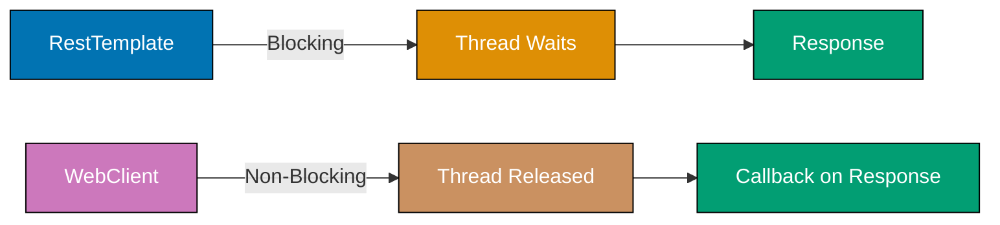

**Key Takeaway**: WebClient enables reactive programming with non-blocking I/O—threads are released during HTTP calls and notified via callbacks, allowing higher concurrency than RestTemplate's blocking model.

**Why It Matters**: WebClient's non-blocking reactive model enables a single application instance to handle 10,000 concurrent external API calls with 10-20 threads, compared to RestTemplate requiring 10,000 threads for the same concurrency—preventing thread pool exhaustion that causes cascading failures. Production microservices at Netflix use reactive clients to call hundreds of downstream services concurrently, maintaining sub-100ms latency even when orchestrating responses from 20+ services per request through reactive composition.

### Example 43: Feign Clients - Declarative REST Clients

Feign provides declarative REST client interfaces with automatic request/response mapping and load balancing integration.

```java
// pom.xml: spring-cloud-starter-openfeign

@SpringBootApplication
@EnableFeignClients // => Enable component scanning for Feign clients
public class Application { // => Main application class
// => Defines Application class
    public static void main(String[] args) {
    // => Begins block
        SpringApplication.run(Application.class, args);
    // => Executes method
    }
    // => Block delimiter
}
// => Block delimiter

@FeignClient(name = "user-service", url = "https://jsonplaceholder.typicode.com") // => Declarative HTTP client (name for load balancing, url for direct connection)
public interface UserFeignClient { // => Interface methods map to HTTP endpoints
    @GetMapping("/users/{id}") // => GET /users/{id} endpoint
    User getUser(@PathVariable Long id); // => Path variable injected into URL, returns deserialized User
    // => Assigns > Path variable injected into URL, returns deserialized User to //

    @GetMapping("/users") // => GET /users endpoint
    List<User> getAllUsers(); // => Returns list of users (JSON array deserialized)
    // => Assigns > Returns list of users (JSON array deserialized) to //

    @PostMapping("/users") // => POST /users endpoint
    User createUser(@RequestBody User user); // => Request body serialized to JSON, response deserialized to User
    // => Assigns > Request body serialized to JSON, response deserialized to User to //

    @DeleteMapping("/users/{id}") // => DELETE /users/{id} endpoint
    void deleteUser(@PathVariable Long id); // => No response body expected
    // => Assigns > No response body expected to //
}
// => Block delimiter

@Service
@RequiredArgsConstructor
public class UserService {
    // => Begins block
    private final UserFeignClient userClient;
    // => Declares userClient field of type final

    public User fetchUser(Long id) { // => Fetch user via Feign client
        return userClient.getUser(id);  // => Feign generates HTTP call implementation (blocks until response)
        // => Assigns > Feign generates HTTP call implementation (blocks until response) to //
    }
}

// application.yml
// feign:
//   client:
//     config:
//       default:
//         connectTimeout: 5000
//         readTimeout: 10000
```

**Code (Kotlin)**:

```kotlin
// build.gradle.kts: implementation("org.springframework.cloud:spring-cloud-starter-openfeign")

@SpringBootApplication
@EnableFeignClients  // => Enable component scanning for Feign clients
open class Application  // => Main application class

fun main(args: Array<String>) {
  runApplication<Application>(*args)
}

@FeignClient(name = "user-service", url = "https://jsonplaceholder.typicode.com")
// => Declarative HTTP client (name for load balancing, url for direct connection)
interface UserFeignClient {  // => Interface methods map to HTTP endpoints
  @GetMapping("/users/{id}")  // => GET /users/{id} endpoint
  fun getUser(@PathVariable id: Long): User
  // => Path variable injected into URL, returns deserialized User

  @GetMapping("/users")  // => GET /users endpoint
  fun getAllUsers(): List<User>
  // => Returns list of users (JSON array deserialized)

  @PostMapping("/users")  // => POST /users endpoint
  fun createUser(@RequestBody user: User): User
  // => Request body serialized to JSON, response deserialized to User

  @DeleteMapping("/users/{id}")  // => DELETE /users/{id} endpoint
  fun deleteUser(@PathVariable id: Long)
  // => No response body expected
}

@Service
class UserService(
  private val userClient: UserFeignClient
) {
  fun fetchUser(id: Long): User {  // => Fetch user via Feign client
    return userClient.getUser(id)
    // => Feign generates HTTP call implementation (blocks until response)
  }
}

// application.yml
// feign:
//   client:
//     config:
//       default:
//         connectTimeout: 5000
//         readTimeout: 10000

// Kotlin-specific: Interface methods in Kotlin don't need 'fun' keyword repetition
// Alternative with suspend functions for coroutines support:
// @FeignClient(name = "user-service", url = "...")
// interface CoroutineUserClient {
//   @GetMapping("/users/{id}")
//   suspend fun getUser(@PathVariable id: Long): User  // Non-blocking with coroutines
// }
// Note: Requires spring-cloud-openfeign-kotlin extension
```

**Key Takeaway**: Feign eliminates HTTP client boilerplate through declarative interfaces—define methods with Spring MVC annotations and Feign generates implementations automatically.

**Why It Matters**: Feign eliminates HTTP client boilerplate—define interface methods with Spring MVC annotations and Feign generates implementations automatically, reducing microservice integration code by 70% compared to manual RestTemplate calls. However, Feign's default blocking client (uses RestTemplate internally) limits concurrency—production systems configure Feign with reactive HTTP clients (WebClient) for non-blocking calls that scale to thousands of concurrent requests without thread exhaustion.

### Example 44: Service Discovery - Eureka Client

Service discovery allows microservices to find and communicate with each other without hard-coded URLs.

```java
// pom.xml: spring-cloud-starter-netflix-eureka-client

@SpringBootApplication
@EnableDiscoveryClient // => Enable Eureka client registration
public class Application { // => Main application class
// => Defines Application class
    public static void main(String[] args) {
    // => Begins block
        SpringApplication.run(Application.class, args);
    // => Executes method
    }
    // => Block delimiter
}
// => Block delimiter

@RestController
// => Annotation applied
@RequestMapping("/api")
    // => Executes method
public class OrderController {
    // => Begins block
    private final DiscoveryClient discoveryClient;
    // => Declares discoveryClient field of type final
    private final RestTemplate restTemplate;
    // => Declares restTemplate field of type final

    public OrderController(DiscoveryClient discoveryClient, // => Inject discovery client for querying service registry
                          @LoadBalanced RestTemplate restTemplate) { // => Load-balanced RestTemplate (resolves service names to instances)
                          // => Annotation applied
        this.discoveryClient = discoveryClient;
        // => Assigns discoveryClient to this.discoveryClient
        this.restTemplate = restTemplate;
        // => Assigns restTemplate to this.restTemplate
    }

    @GetMapping("/services") // => Endpoint: GET /api/services
    public List<String> getServices() { // => Query Eureka registry
        return discoveryClient.getServices();  // => Returns service names (e.g., ["order-service", "user-service", "payment-service"])
        // => Invokes > Returns service names () method
        // => Result stored in //
    }

    @GetMapping("/order/{id}") // => Endpoint: GET /api/order/{id}
    public Order getOrder(@PathVariable Long id) { // => Fetch order with user data
        // => Call user-service by service name (Eureka resolves to actual instance IP:port)
        User user = restTemplate.getForObject( // => Load-balanced HTTP call
            "http://user-service/api/users/{id}", User.class, id); // => "user-service" resolved by Eureka (round-robin load balancing)
        return new Order(id, user); // => Compose order response with user data
        // => Assigns > Compose order response with user data to //
    }
}

// application.yml
// spring:
//   application:
//     name: order-service
// eureka:
//   client:
//     serviceUrl:
//       defaultZone: http://localhost:8761/eureka/
//   instance:
//     preferIpAddress: true
```

**Code (Kotlin)**:

```kotlin
// build.gradle.kts: implementation("org.springframework.cloud:spring-cloud-starter-netflix-eureka-client")

@SpringBootApplication
@EnableDiscoveryClient  // => Enable Eureka client registration
open class Application  // => Main application class

fun main(args: Array<String>) {
  runApplication<Application>(*args)
}

@RestController
@RequestMapping("/api")
class OrderController(
  private val discoveryClient: DiscoveryClient,  // => Inject discovery client for querying service registry
  @LoadBalanced private val restTemplate: RestTemplate  // => Load-balanced RestTemplate (resolves service names to instances)
) {
  @GetMapping("/services")  // => Endpoint: GET /api/services
  fun getServices(): List<String> {  // => Query Eureka registry
    return discoveryClient.services.toList()
    // => Returns service names (e.g., ["order-service", "user-service", "payment-service"])
  }

  @GetMapping("/order/{id}")  // => Endpoint: GET /api/order/{id}
  fun getOrder(@PathVariable id: Long): Order {  // => Fetch order with user data
    // => Call user-service by service name (Eureka resolves to actual instance IP:port)
    val user = restTemplate.getForObject(  // => Load-balanced HTTP call
      "http://user-service/api/users/{id}", User::class.java, id
    )  // => "user-service" resolved by Eureka (round-robin load balancing)
    return Order(id, user)  // => Compose order response with user data
  }
}

data class Order(val id: Long, val user: User?)

// application.yml
// spring:
//   application:
//     name: order-service
// eureka:
//   client:
//     serviceUrl:
//       defaultZone: http://localhost:8761/eureka/
//   instance:
//     preferIpAddress: true

// Kotlin-specific: Use toList() to convert services collection, primary constructor injection
// Alternative with WebClient for reactive service discovery:
// @Service
// class ReactiveOrderService(
//   private val webClientBuilder: WebClient.Builder,
//   @LoadBalanced private val loadBalancedBuilder: WebClient.Builder  // Load-balanced WebClient
// ) {
//   fun getUser(id: Long): Mono<User> = loadBalancedBuilder.build()
//     .get()
//     .uri("http://user-service/api/users/{id}", id)
//     .retrieve()
//     .bodyToMono<User>()
// }
```

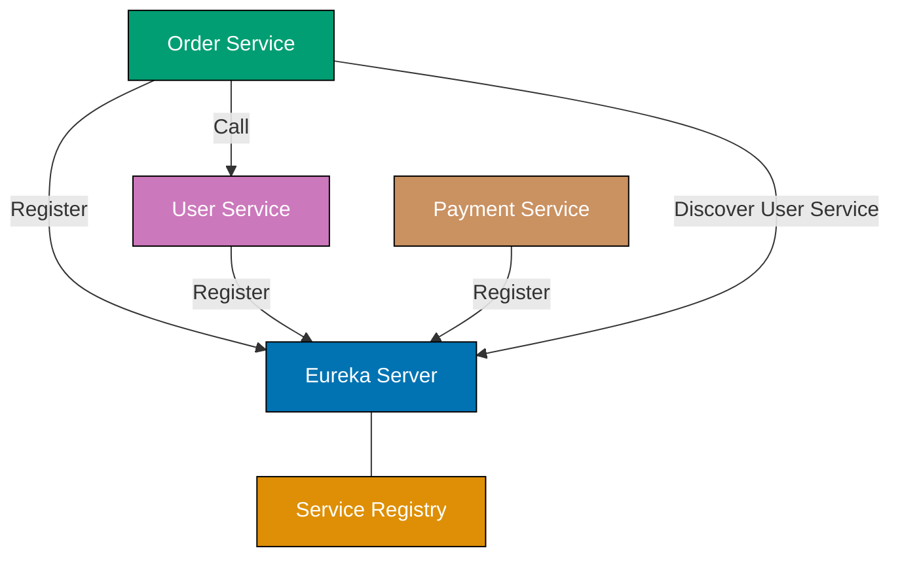

**Key Takeaway**: Eureka enables service discovery—microservices register with Eureka Server and discover other services by name instead of hardcoded URLs, enabling dynamic scaling and failover.

**Why It Matters**: Service discovery eliminates hardcoded service URLs, enabling dynamic scaling where new instances register automatically and failed instances deregister, allowing load balancers to route traffic only to healthy instances. Production Kubernetes deployments use service discovery (Kubernetes Service + CoreDNS) for container orchestration where pods scale from 3 to 100 instances during traffic spikes, with DNS updates propagating in seconds versus hours for manual load balancer configuration changes.

### Example 45: Spring Boot Actuator - Health & Metrics

Actuator provides production-ready endpoints for monitoring, health checks, and application metrics.

```java
// pom.xml: spring-boot-starter-actuator

@Component
// => Annotation applied
public class CustomHealthIndicator implements HealthIndicator {
    // => Begins block
    @Override // => Implement HealthIndicator interface
    public Health health() { // => Custom health check logic
        boolean databaseUp = checkDatabaseConnection(); // => Check database connectivity
        if (databaseUp) { // => Database healthy
            return Health.up() // => Health status: UP
                .withDetail("database", "PostgreSQL") // => Add metadata to health response
                .withDetail("version", "15.0") // => Database version detail
                .build(); // => Build Health object
                // => Assigns > Build Health object to //
        }
        return Health.down() // => Health status: DOWN
            .withDetail("error", "Database connection failed") // => Error detail for debugging
            .build(); // => Build Health object (triggers pod restart in Kubernetes)
            // => Assigns > Build Health object (triggers pod restart in Kubernetes) to //
    }
    // => Block delimiter

    private boolean checkDatabaseConnection() { // => Verify database connectivity
        return true;  // => Placeholder (production: execute SELECT 1 query)
        // => Assigns > Placeholder (production: execute SELECT 1 query) to //
    }
    // => Block delimiter
}
// => Block delimiter

@RestController
// => Annotation applied
@RequestMapping("/api")
    // => Executes method
public class MetricsController {
    // => Begins block
    @GetMapping("/process")
    // => Executes method
    public String processRequest() {
    // => Begins block
        return "Processed";
    // => Returns result
    }
    // => Block delimiter
}

// application.yml
// management:
//   endpoints:
//     web:
//       exposure:
//         include: health,metrics,info,prometheus
//   endpoint:
//     health:
//       show-details: always
//   metrics:
//     tags:
//       application: ${spring.application.name}

// Available endpoints:
// GET /actuator/health => {"status":"UP","components":{"custom":{"status":"UP"}}}
// GET /actuator/metrics => List of available metrics
// GET /actuator/metrics/jvm.memory.used => Memory usage
// GET /actuator/info => Application info
```

**Code (Kotlin)**:

```kotlin
// build.gradle.kts: implementation("org.springframework.boot:spring-boot-starter-actuator")

@Component
class CustomHealthIndicator : HealthIndicator {
  override fun health(): Health {  // => Custom health check logic
    val databaseUp = checkDatabaseConnection()  // => Check database connectivity
    return if (databaseUp) {  // => Database healthy
      Health.up()  // => Health status: UP
        .withDetail("database", "PostgreSQL")  // => Add metadata to health response
        .withDetail("version", "15.0")  // => Database version detail
        .build()  // => Build Health object
    } else {
      Health.down()  // => Health status: DOWN
        .withDetail("error", "Database connection failed")  // => Error detail for debugging
        .build()  // => Build Health object (triggers pod restart in Kubernetes)
    }
  }

  private fun checkDatabaseConnection(): Boolean {  // => Verify database connectivity
    return true  // => Placeholder (production: execute SELECT 1 query)
  }
}

@RestController
@RequestMapping("/api")
class MetricsController {
  @GetMapping("/process")
  fun processRequest(): String {
    return "Processed"
  }
}

// application.yml
// management:
//   endpoints:
//     web:
//       exposure:
//         include: health,metrics,info,prometheus
//   endpoint:
//     health:
//       show-details: always
//   metrics:
//     tags:
//       application: ${spring.application.name}

// Available endpoints:
// GET /actuator/health => {"status":"UP","components":{"custom":{"status":"UP"}}}
// GET /actuator/metrics => List of available metrics
// GET /actuator/metrics/jvm.memory.used => Memory usage
// GET /actuator/info => Application info

// Kotlin-specific: Use expression body for simple health() implementation
// Alternative with when expression for multiple health states:
// override fun health(): Health = when {
//   databaseUp && cacheUp -> Health.up().withDetail("all", "ok").build()
//   databaseUp -> Health.degraded().withDetail("cache", "down").build()
//   else -> Health.down().withDetail("database", "down").build()
// }
```

**Actuator Health Endpoint Aggregation**:

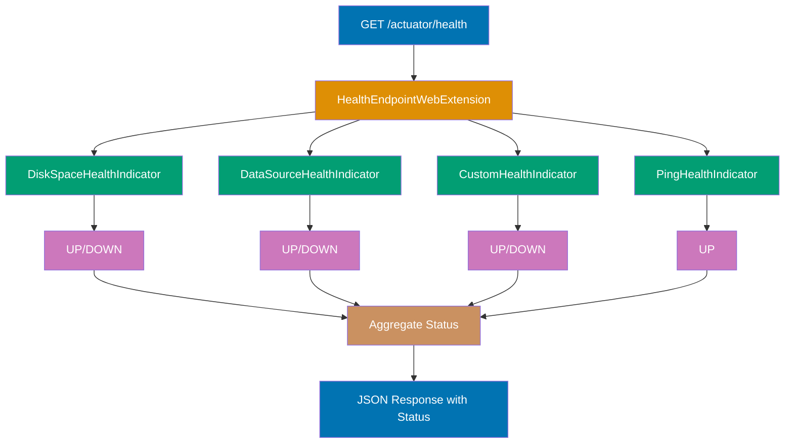

**Caption**: Actuator aggregates health indicators into a single /actuator/health endpoint, returning DOWN if any indicator fails.

**Key Takeaway**: Actuator exposes production-ready endpoints for monitoring—use custom `HealthIndicator` implementations to expose application-specific health checks beyond Spring Boot's auto-configured probes.

**Why It Matters**: Actuator endpoints expose production-ready metrics (JVM memory, thread pools, database connections) and health checks (database connectivity, disk space) without custom instrumentation, integrating with monitoring tools (Prometheus, Grafana) via standardized formats. Production Kubernetes deployments use actuator health endpoints for liveness probes (restart unhealthy pods) and readiness probes (remove pods from load balancer rotation), enabling zero-downtime deployments where unhealthy instances stop receiving traffic before termination.

### Example 46: Custom Metrics - Micrometer

Micrometer provides vendor-neutral metrics instrumentation for monitoring application performance.

```java
@Service
public class OrderMetricsService {
    // => Begins block
    private final Counter orderCounter;
    // => Declares orderCounter field of type final
    private final Gauge activeOrders;
    // => Declares activeOrders field of type final
    private final Timer orderProcessingTimer;
    // => Declares orderProcessingTimer field of type final
    private final AtomicInteger activeOrderCount = new AtomicInteger(0);
    // => Creates new instance

    public OrderMetricsService(MeterRegistry registry) { // => Inject Micrometer registry
        this.orderCounter = Counter.builder("orders.created") // => Create counter metric
            .description("Total orders created") // => Metric description for monitoring dashboards
            .tag("type", "online") // => Tag for filtering/grouping (e.g., online vs in-store orders)
            .register(registry); // => Register metric with Micrometer
            // => Assigns > Register metric with Micrometer to //

        this.activeOrders = Gauge.builder("orders.active", activeOrderCount, AtomicInteger::get) // => Create gauge metric (current value)
            .description("Active orders count") // => Metric description
            .register(registry); // => Register gauge (tracks activeOrderCount value)
            // => Assigns > Register gauge (tracks activeOrderCount value) to //

        this.orderProcessingTimer = Timer.builder("orders.processing.time") // => Create timer metric (measures duration)
            .description("Order processing duration") // => Metric description
            .register(registry); // => Register timer (tracks min/max/mean/percentiles)
            // => Assigns > Register timer (tracks min/max/mean/percentiles) to //
    }

    public void createOrder(Order order) { // => Process order creation
        orderCounter.increment();  // => Increment total orders counter (monotonic increase)
        activeOrderCount.incrementAndGet(); // => Increment active orders gauge
        // => Assigns > Increment active orders gauge to //

        orderProcessingTimer.record(() -> { // => Measure execution time
            // => Timer tracks duration of lambda execution
            processOrder(order); // => Business logic
            // => Assigns > Business logic to //
        });
        // => Executes statement

        activeOrderCount.decrementAndGet(); // => Decrement active orders after processing complete
        // => Assigns > Decrement active orders after processing complete to //
    }

    private void processOrder(Order order) {
    // => Begins block
        // Processing logic
    }
}

// Access metrics:
// GET /actuator/metrics/orders.created
// GET /actuator/metrics/orders.active
// GET /actuator/metrics/orders.processing.time
// GET /actuator/prometheus => Prometheus exposition format
```

**Code (Kotlin)**:

```kotlin
@Service
class OrderMetricsService(registry: MeterRegistry) {  // => Inject Micrometer registry
  private val orderCounter: Counter = Counter.builder("orders.created")  // => Create counter metric
    .description("Total orders created")  // => Metric description for monitoring dashboards
    .tag("type", "online")  // => Tag for filtering/grouping (e.g., online vs in-store orders)
    .register(registry)  // => Register metric with Micrometer

  private val activeOrderCount = AtomicInteger(0)

  private val activeOrders: Gauge = Gauge.builder("orders.active", activeOrderCount) { it.get().toDouble() }
    // => Create gauge metric (current value)
    .description("Active orders count")  // => Metric description
    .register(registry)  // => Register gauge (tracks activeOrderCount value)

  private val orderProcessingTimer: Timer = Timer.builder("orders.processing.time")
    // => Create timer metric (measures duration)
    .description("Order processing duration")  // => Metric description
    .register(registry)  // => Register timer (tracks min/max/mean/percentiles)

  fun createOrder(order: Order) {  // => Process order creation
    orderCounter.increment()  // => Increment total orders counter (monotonic increase)
    activeOrderCount.incrementAndGet()  // => Increment active orders gauge

    orderProcessingTimer.record {  // => Measure execution time
      // => Timer tracks duration of lambda execution
      processOrder(order)  // => Business logic
    }

    activeOrderCount.decrementAndGet()  // => Decrement active orders after processing complete
  }

  private fun processOrder(order: Order) {
    // Processing logic
  }
}

// Access metrics:
// GET /actuator/metrics/orders.created
// GET /actuator/metrics/orders.active
// GET /actuator/metrics/orders.processing.time
// GET /actuator/prometheus => Prometheus exposition format

// Kotlin-specific: Use trailing lambda syntax for timer.record { }
// Alternative with extension function for cleaner metric registration:
// fun MeterRegistry.counter(name: String, tags: Map<String, String> = emptyMap()): Counter =
//   Counter.builder(name).tags(Tags.of(tags.map { Tag.of(it.key, it.value) })).register(this)
// val orderCounter = registry.counter("orders.created", mapOf("type" to "online"))
```

**Micrometer Metrics Flow to Prometheus**:

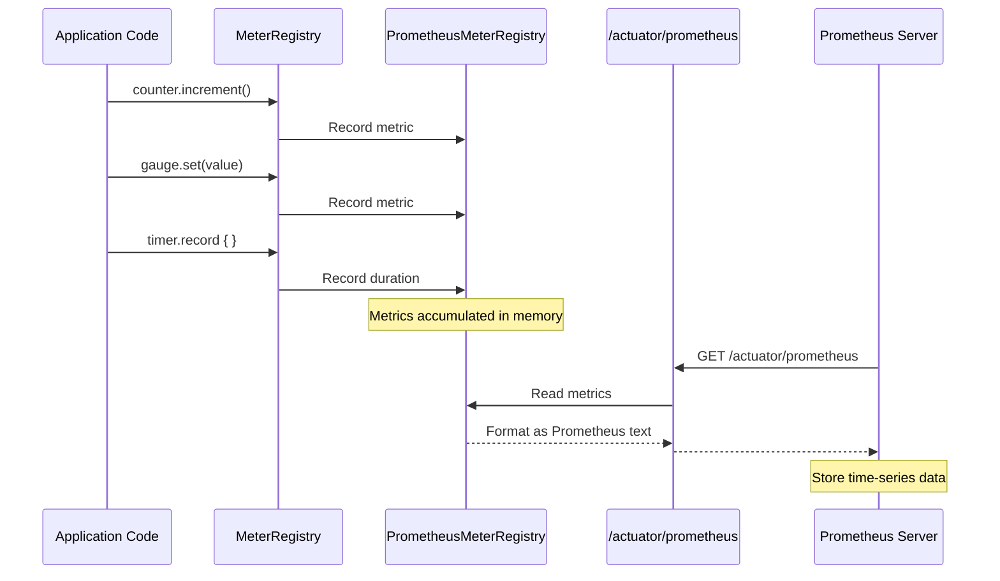

**Caption**: Micrometer records metrics in MeterRegistry, which formats them for /actuator/prometheus endpoint where Prometheus scrapes them periodically.

**Key Takeaway**: Micrometer provides vendor-neutral instrumentation—use `Counter`, `Gauge`, and `Timer` to track business metrics and export to monitoring systems like Prometheus without vendor lock-in.

**Why It Matters**: Business metrics (orders placed, payment failures, cart abandonment rate) complement infrastructure metrics (CPU, memory) to enable product-driven alerting where engineering teams get paged when business KPIs degrade even if infrastructure appears healthy. Production monitoring dashboards at Shopify and Stripe display business metrics alongside technical metrics, revealing revenue-impacting issues (payment gateway failures spike failed payment attempts) before customer support tickets arrive, reducing mean time to detection from hours to minutes.

### Example 47: Distributed Tracing - Micrometer Tracing

Distributed tracing tracks requests across microservices using trace and span IDs for debugging and performance analysis.

```java
// pom.xml: micrometer-tracing-bridge-brave, zipkin-reporter-brave

@Configuration
// => Annotation applied
public class TracingConfig {
    // => Begins block
    @Bean
    // => Annotation applied
    public Sampler defaultSampler() {
    // => Begins block
        return Sampler.ALWAYS_SAMPLE;  // => Sample all requests (production: use probability)
        // => Assigns > Sample all requests (production: use probability) to //
    }
    // => Block delimiter
}
// => Block delimiter

@RestController
// => Annotation applied
@RequestMapping("/api")
    // => Executes method
@RequiredArgsConstructor
// => Annotation applied
public class OrderTracingController {
    // => Begins block
    private final Tracer tracer;
    // => Declares tracer field of type final
    private final RestTemplate restTemplate;
    // => Declares restTemplate field of type final

    @GetMapping("/order/{id}")
    // => Executes method
    public Order getOrder(@PathVariable Long id) {
    // => Begins block
        Span span = tracer.nextSpan().name("get-order").start();
        // => Sets span to string value
        try (Tracer.SpanInScope ws = tracer.withSpan(span)) {
        // => Executes method call
            span.tag("order.id", id.toString());
    // => Executes method

            // => Trace ID automatically propagated to downstream services
            User user = restTemplate.getForObject(
            // => Code line
                "http://user-service/api/users/{id}", User.class, id);
    // => Begins block

            span.event("user-fetched");
    // => Executes method
            return new Order(id, user); // => Compose order response with user data
            // => Assigns > Compose order response with user data to //
        } finally {
    // => Begins block
            span.end();
    // => Executes method
        }
        // => Block delimiter
    }
}

// application.yml
// management:
//   tracing:
//     sampling:
//       probability: 1.0
//   zipkin:
//     tracing:
//       endpoint: http://localhost:9411/api/v2/spans

// Trace ID in logs: [appName,traceId,spanId]
```

**Code (Kotlin)**:

```kotlin
// build.gradle.kts: implementation("io.micrometer:micrometer-tracing-bridge-brave")
// implementation("io.zipkin.reporter2:zipkin-reporter-brave")

@Configuration
class TracingConfig {
  @Bean
  fun defaultSampler(): Sampler {
    return Sampler.ALWAYS_SAMPLE  // => Sample all requests (production: use probability)
  }
}

@RestController
@RequestMapping("/api")
class OrderTracingController(
  private val tracer: Tracer,
  private val restTemplate: RestTemplate
) {
  @GetMapping("/order/{id}")
  fun getOrder(@PathVariable id: Long): Order {
    val span = tracer.nextSpan().name("get-order").start()
    return tracer.withSpan(span).use {  // => Auto-closes span with use block
      span.tag("order.id", id.toString())

      // => Trace ID automatically propagated to downstream services
      val user = restTemplate.getForObject(
        "http://user-service/api/users/{id}", User::class.java, id
      )

      span.event("user-fetched")
      Order(id, user)  // => Compose order response with user data
    }.also {
      span.end()
    }
  }
}

// application.yml
// management:
//   tracing:
//     sampling:
//       probability: 1.0
//   zipkin:
//     tracing:
//       endpoint: http://localhost:9411/api/v2/spans

// Trace ID in logs: [appName,traceId,spanId]

// Kotlin-specific: Use 'use' extension function for auto-closeable resources
// Alternative with inline function for cleaner span handling:
// inline fun <T> Tracer.trace(name: String, block: (Span) -> T): T {
//   val span = nextSpan().name(name).start()
//   return withSpan(span).use { block(span) }.also { span.end() }
// }
// fun getOrder(id: Long) = tracer.trace("get-order") { span ->
//   span.tag("order.id", id.toString())
//   // business logic
// }
```

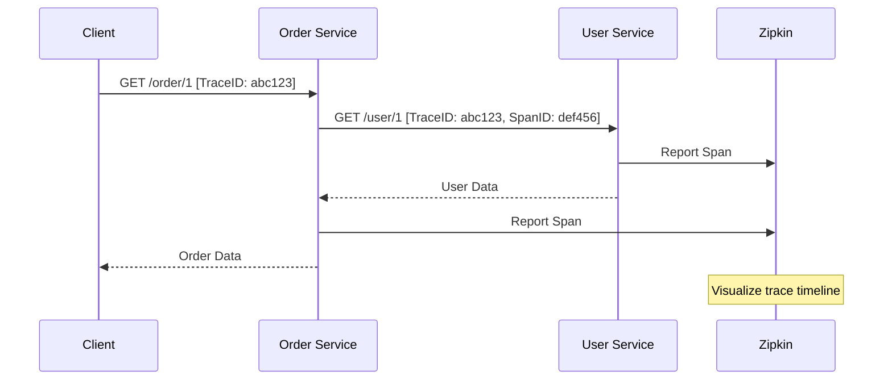

**Key Takeaway**: Distributed tracing propagates trace IDs across microservices—use Micrometer Tracing with Zipkin to visualize request flows and identify bottlenecks in distributed systems.

**Why It Matters**: Distributed tracing propagates trace IDs across 10+ microservices involved in a single request, enabling performance debugging where Zipkin visualizes the 500ms spent waiting for the Product Service versus 2000ms in the Payment Service. Production teams use distributed tracing to identify cascading timeouts (Service A waits 5s for Service B which waits 10s for Service C), optimize slow database queries in downstream services, and visualize service dependency graphs that reveal hidden coupling between theoretically independent services.

### Example 48: Structured Logging - JSON with MDC

Structured logging outputs JSON format with Mapped Diagnostic Context (MDC) for trace correlation.

```java
// pom.xml: logstash-logback-encoder

@Component
// => Annotation applied
public class LoggingFilter implements Filter {
    // => Begins block
    @Override
    // => Annotation applied
    public void doFilter(ServletRequest request, ServletResponse response, FilterChain chain)
    // => Executes method call
            throws IOException, ServletException {
    // => Begins block
        HttpServletRequest httpRequest = (HttpServletRequest) request;
        // => Calls ()
        // => Stores result in httpRequest

        MDC.put("requestId", UUID.randomUUID().toString());
    // => Executes method
        MDC.put("path", httpRequest.getRequestURI());
    // => Executes method
        MDC.put("method", httpRequest.getMethod());
    // => Executes method

        try {
    // => Begins block
            chain.doFilter(request, response);
    // => Executes method
        } finally {
    // => Begins block
            MDC.clear();  // => Cleanup MDC
            // => Assigns > Cleanup MDC to //
        }
        // => Block delimiter
    }
    // => Block delimiter
}
// => Block delimiter

@RestController
// => Annotation applied
@Slf4j
// => Annotation applied
public class OrderLoggingController {
    // => Begins block
    @PostMapping("/orders")
    // => Executes method
    public Order createOrder(@RequestBody Order order) {
    // => Begins block
        log.info("Creating order",
        // => Code line
            kv("orderId", order.id()),
    // => Executes method
            kv("userId", order.user().id()));  // => Structured key-value pairs
            // => Assigns > Structured key-value pairs to //

        try {
    // => Begins block
            // Process order
            log.info("Order created successfully");
    // => Executes method
            return order;
    // => Returns result
        } catch (Exception e) {
    // => Executes method
            log.error("Order creation failed", e);
    // => Executes method
            throw e;
            // => Throws e;
        }
        // => Block delimiter
    }
}

// logback-spring.xml
// <encoder class="net.logstash.logback.encoder.LogstashEncoder">
//   <includeContext>true</includeContext>
//   <includeMdc>true</includeMdc>
// </encoder>

// JSON output:
// {"@timestamp":"2024-12-24T10:00:00.000+07:00","level":"INFO","message":"Creating order",
//  "requestId":"uuid","path":"/orders","orderId":"1","userId":"123"}
```

**Code (Kotlin)**:

```kotlin
// build.gradle.kts: implementation("net.logstash.logback:logstash-logback-encoder")

@Component
class LoggingFilter : Filter {
  override fun doFilter(request: ServletRequest, response: ServletResponse, chain: FilterChain) {
    val httpRequest = request as HttpServletRequest

    MDC.put("requestId", UUID.randomUUID().toString())
    MDC.put("path", httpRequest.requestURI)
    MDC.put("method", httpRequest.method)

    try {
      chain.doFilter(request, response)
    } finally {
      MDC.clear()  // => Cleanup MDC
    }
  }
}

@RestController
class OrderLoggingController {
  private val log = LoggerFactory.getLogger(javaClass)

  @PostMapping("/orders")
  fun createOrder(@RequestBody order: Order): Order {
    log.info("Creating order",
      kv("orderId", order.id),
      kv("userId", order.user?.id))  // => Structured key-value pairs

    return try {
      // Process order
      log.info("Order created successfully")
      order
    } catch (e: Exception) {
      log.error("Order creation failed", e)
      throw e
    }
  }
}

// logback-spring.xml
// <encoder class="net.logstash.logback.encoder.LogstashEncoder">
//   <includeContext>true</includeContext>
//   <includeMdc>true</includeMdc>
// </encoder>

// JSON output:
// {"@timestamp":"2024-12-24T10:00:00.000+07:00","level":"INFO","message":"Creating order",
//  "requestId":"uuid","path":"/orders","orderId":"1","userId":"123"}

// Kotlin-specific: Use safe call (?.) for nullable properties in logging
// Alternative with extension function for MDC context:
// inline fun <T> withMdc(vararg pairs: Pair<String, String>, block: () -> T): T {
//   pairs.forEach { MDC.put(it.first, it.second) }
//   return try { block() } finally { MDC.clear() }
// }
// withMdc("requestId" to uuid, "path" to path) { /* request handling */ }
```

**Key Takeaway**: Structured logging with MDC enables correlation—use Logstash encoder for JSON output and MDC for request-scoped context like trace IDs, making logs searchable in centralized logging systems.

**Why It Matters**: Structured logging with JSON format and MDC (Mapped Diagnostic Context) enables centralized log aggregation (ELK stack, Datadog) where engineers query logs by trace ID to reconstruct request flows across microservices. Production systems use MDC to propagate correlation IDs, user IDs, and tenant IDs through all log statements, enabling queries like "show all logs for user 12345 in the last hour" that would be impossible with unstructured text logs, reducing incident investigation time from hours (grep logs across 50 servers) to minutes (single query).

### Example 49: Circuit Breaker - Resilience4j

Circuit breaker prevents cascading failures by stopping calls to failing services and providing fallback responses.

```java
// pom.xml: spring-cloud-starter-circuitbreaker-resilience4j

@Service
// => Annotation applied
@RequiredArgsConstructor
// => Annotation applied
public class UserServiceClient {
    // => Begins block
    private final CircuitBreakerFactory circuitBreakerFactory;
    // => Declares circuitBreakerFactory field of type final
    private final RestTemplate restTemplate;
    // => Declares restTemplate field of type final

    public User getUser(Long id) {
    // => Begins block
        CircuitBreaker circuitBreaker = circuitBreakerFactory.create("user-service");
        // => Sets circuitBreaker to string value

        return circuitBreaker.run(
    // => Returns result
            () -> restTemplate.getForObject("http://user-service/users/{id}", User.class, id),
    // => Executes method
            throwable -> getFallbackUser(id)  // => Fallback on failure
            // => Executes method call
        );
        // => Executes statement
    }
    // => Block delimiter

    private User getFallbackUser(Long id) {
    // => Begins block
        return new User(id, "Fallback User", "fallback@example.com", null);
    // => Returns value to caller
    }
    // => Block delimiter
}

// application.yml
// resilience4j:
//   circuitbreaker:
//     instances:
//       user-service:
//         slidingWindowSize: 10
//         minimumNumberOfCalls: 5
//         failureRateThreshold: 50
//         waitDurationInOpenState: 10s
//         permittedNumberOfCallsInHalfOpenState: 3

// Circuit Breaker States: CLOSED (normal) -> OPEN (failing) -> HALF_OPEN (testing) -> CLOSED
// => Invokes // Circuit Breaker States: CLOSED()
```

**Code (Kotlin)**:

```kotlin
// build.gradle.kts: implementation("org.springframework.cloud:spring-cloud-starter-circuitbreaker-resilience4j")

@Service
class UserServiceClient(
  private val circuitBreakerFactory: CircuitBreakerFactory<*, *>,
  private val restTemplate: RestTemplate
) {
  fun getUser(id: Long): User {
    val circuitBreaker = circuitBreakerFactory.create("user-service")

    return circuitBreaker.run(
      { restTemplate.getForObject("http://user-service/users/{id}", User::class.java, id) },
      { getFallbackUser(id) }  // => Fallback on failure
    ) ?: getFallbackUser(id)  // => Null safety fallback
  }

  private fun getFallbackUser(id: Long): User {
    return User(id, "Fallback User", "fallback@example.com", null)
  }
}

// application.yml
// resilience4j:
//   circuitbreaker:
//     instances:
//       user-service:
//         slidingWindowSize: 10
//         minimumNumberOfCalls: 5
//         failureRateThreshold: 50
//         waitDurationInOpenState: 10s
//         permittedNumberOfCallsInHalfOpenState: 3

// Circuit Breaker States: CLOSED (normal) -> OPEN (failing) -> HALF_OPEN (testing) -> CLOSED

// Kotlin-specific: Use elvis operator (?:) for null-safe fallback chaining
// Alternative with extension function for cleaner circuit breaker usage:
// inline fun <T> CircuitBreakerFactory<*, *>.execute(
//   name: String,
//   fallback: (Throwable) -> T,
//   block: () -> T
// ): T = create(name).run(block, fallback)
// val user = circuitBreakerFactory.execute("user-service", ::getFallbackUser) {
//   restTemplate.getForObject<User>(...)
// }
```

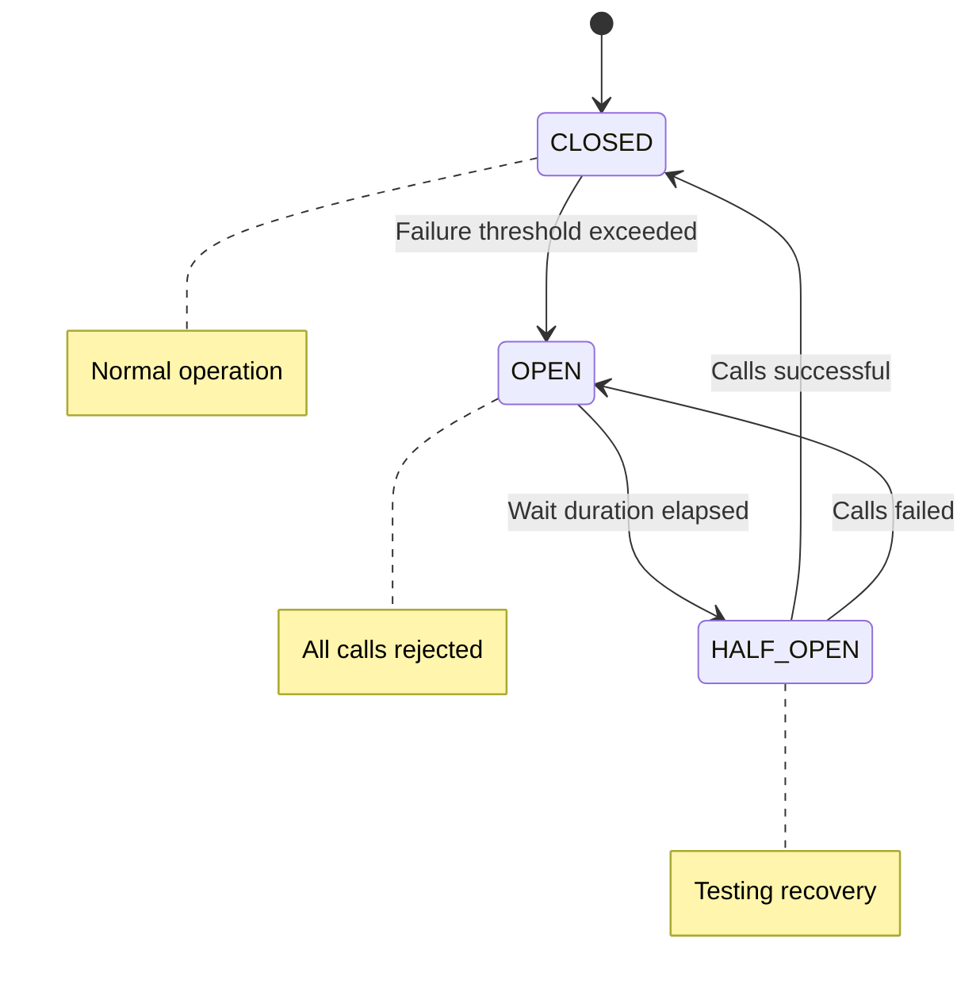

**Key Takeaway**: Circuit breaker prevents cascading failures—configure thresholds to automatically open circuit when failure rate exceeds limits, providing fallback responses while the failing service recovers.

**Why It Matters**: Circuit breakers prevent cascading failures where one slow service (Payment Service timing out) exhausts thread pools in upstream services (Order Service waiting for payment), causing system-wide outages. Production systems configure circuit breakers to fail fast after N consecutive failures (typically 5-10), returning fallback responses immediately instead of waiting for timeouts, maintaining partial functionality where order placement returns "payment processing, we'll email confirmation" instead of complete failure.

### Example 50: Retry Pattern - Exponential Backoff

Retry pattern automatically retries failed operations with exponential backoff to handle transient failures.

```java
@Service
// => Annotation applied
@RequiredArgsConstructor
// => Annotation applied
public class PaymentServiceClient {
    // => Begins block
    private final RestTemplate restTemplate;
    // => Declares restTemplate field of type final

    @Retry(name = "payment-service", fallbackMethod = "paymentFallback")
    // => Annotation applied
    public Payment processPayment(PaymentRequest request) {
    // => Begins block
        return restTemplate.postForObject(
    // => Returns result
            "http://payment-service/payments", request, Payment.class);
            // => Executes statement
    }
    // => Block delimiter

    private Payment paymentFallback(PaymentRequest request, Exception e) { // => Fallback method signature must match original
        // => Fallback invoked after max retries exhausted (3 attempts)
        return new Payment(null, "FAILED", "Service unavailable"); // => Graceful degradation response
        // => Assigns > Graceful degradation response to //
    }
}

// application.yml
// resilience4j:
//   retry:
//     instances:
//       payment-service:
//         maxAttempts: 3
//         waitDuration: 1s
//         exponentialBackoffMultiplier: 2
//         retryExceptions:
//           - org.springframework.web.client.ResourceAccessException
//         ignoreExceptions:
//           - java.lang.IllegalArgumentException

// Retry sequence: 1s -> 2s -> 4s (exponential backoff)
// => Invokes // Retry sequence: 1s -> 2s -> 4s()

record PaymentRequest(Long orderId, BigDecimal amount) {}
    // => Executes method
record Payment(Long id, String status, String message) {}
    // => Executes method
```

**Code (Kotlin)**:

```kotlin
@Service
class PaymentServiceClient(
  private val restTemplate: RestTemplate
) {
  @Retry(name = "payment-service", fallbackMethod = "paymentFallback")
  fun processPayment(request: PaymentRequest): Payment {
    return restTemplate.postForObject(
      "http://payment-service/payments", request, Payment::class.java
    ) ?: throw IllegalStateException("Null response")
  }

  @Suppress("UNUSED_PARAMETER")
  private fun paymentFallback(request: PaymentRequest, e: Exception): Payment {
    // => Fallback method signature must match original + Exception parameter
    // => Fallback invoked after max retries exhausted (3 attempts)
    return Payment(null, "FAILED", "Service unavailable")  // => Graceful degradation response
  }
}

// application.yml
// resilience4j:
//   retry:
//     instances:
//       payment-service:
//         maxAttempts: 3
//         waitDuration: 1s
//         exponentialBackoffMultiplier: 2
//         retryExceptions:
//           - org.springframework.web.client.ResourceAccessException
//         ignoreExceptions:
//           - java.lang.IllegalArgumentException

// Retry sequence: 1s -> 2s -> 4s (exponential backoff)

data class PaymentRequest(val orderId: Long, val amount: BigDecimal)
data class Payment(val id: Long?, val status: String, val message: String)

// Kotlin-specific: Use @Suppress for unused fallback parameters
// Alternative with inline function for retry logic:
// inline fun <T> retryWithBackoff(maxAttempts: Int = 3, block: () -> T): T {
//   repeat(maxAttempts - 1) { attempt ->
//     try { return block() } catch (e: Exception) { delay(2.0.pow(attempt).toLong() * 1000) }
//   }
//   return block()  // Final attempt without catch
// }
```

**Key Takeaway**: Retry with exponential backoff handles transient failures—configure max attempts and backoff multiplier to automatically retry failed operations with increasing delays between attempts.

**Why It Matters**: Retry with exponential backoff handles transient failures (network blips, database connection pool exhaustion) without overwhelming failing services with retry storms that prevent recovery. Production retry configurations use jittered exponential backoff (1s, 2s, 4s + random jitter) to prevent thundering herd where 1000 clients retry simultaneously every 5 seconds, with max attempts tuned based on error type—retry network errors 3 times but fail fast on business validation errors.

### Example 51: Rate Limiting - API Throttling

Rate limiting controls the number of requests a client can make within a time window to prevent abuse.

```java
@Service
// => Annotation applied
public class ApiRateLimitService {
    // => Begins block
    @RateLimiter(name = "api-limiter", fallbackMethod = "rateLimitFallback") // => Apply rate limiting (10 req/sec from config)
    public ApiResponse callExternalApi(String endpoint) { // => Method protected by rate limiter
        // => If rate limit exceeded, fallback method invoked
        return new ApiResponse("success", "Data from " + endpoint); // => Normal response when within rate limit
        // => Assigns > Normal response when within rate limit to //
    }
    // => Block delimiter

    private ApiResponse rateLimitFallback(String endpoint, Exception e) { // => Fallback when rate limit exceeded
        return new ApiResponse("error", "Rate limit exceeded. Try again later."); // => Return 429-equivalent response
        // => Assigns > Return 429-equivalent response to //
    }
    // => Block delimiter
}
// => Block delimiter

@RestController
// => Annotation applied
@RequiredArgsConstructor
public class ApiController {
    // => Begins block
    private final ApiRateLimitService apiService;
    // => Declares apiService field of type final

    @GetMapping("/api/data") // => Endpoint: GET /api/data
    public ApiResponse getData() { // => Delegate to rate-limited service
        return apiService.callExternalApi("/external/endpoint"); // => Calls method protected by @RateLimiter
        // => Assigns > Calls method protected by @RateLimiter to //
    }
}

// application.yml
// resilience4j:
//   ratelimiter:
//     instances:
//       api-limiter:
//         limitForPeriod: 10
//         limitRefreshPeriod: 1s
//         timeoutDuration: 0s

// Allows 10 requests per second. Additional requests are rejected.

record ApiResponse(String status, String message) {}
    // => Executes method
```

**Code (Kotlin)**:

```kotlin
@Service
class ApiRateLimitService {
  @RateLimiter(name = "api-limiter", fallbackMethod = "rateLimitFallback")
  // => Apply rate limiting (10 req/sec from config)
  fun callExternalApi(endpoint: String): ApiResponse {  // => Method protected by rate limiter
    // => If rate limit exceeded, fallback method invoked
    return ApiResponse("success", "Data from $endpoint")  // => Normal response when within rate limit
  }

  @Suppress("UNUSED_PARAMETER")
  private fun rateLimitFallback(endpoint: String, e: Exception): ApiResponse {
    // => Fallback when rate limit exceeded
    return ApiResponse("error", "Rate limit exceeded. Try again later.")  // => Return 429-equivalent response
  }
}

@RestController
class ApiController(
  private val apiService: ApiRateLimitService
) {
  @GetMapping("/api/data")  // => Endpoint: GET /api/data
  fun getData(): ApiResponse {  // => Delegate to rate-limited service
    return apiService.callExternalApi("/external/endpoint")  // => Calls method protected by @RateLimiter
  }
}

// application.yml
// resilience4j:
//   ratelimiter:
//     instances:
//       api-limiter:
//         limitForPeriod: 10
//         limitRefreshPeriod: 1s
//         timeoutDuration: 0s

// Allows 10 requests per second. Additional requests are rejected.

data class ApiResponse(val status: String, val message: String)

// Kotlin-specific: Use string templates in response construction
// Alternative with custom annotation and aspect for rate limiting:
// @Target(AnnotationTarget.FUNCTION)
// annotation class RateLimit(val requestsPerSecond: Int)
// @Aspect
// class RateLimitAspect(private val rateLimiter: RateLimiter) {
//   @Around("@annotation(rateLimit)")
//   fun checkRateLimit(joinPoint: ProceedingJoinPoint, rateLimit: RateLimit): Any? {
//     return if (rateLimiter.tryAcquire()) joinPoint.proceed()
//     else throw TooManyRequestsException()
//   }
// }
```

**Key Takeaway**: Rate limiting protects APIs from abuse—use `@RateLimiter` to enforce request quotas per time window, preventing service degradation from excessive traffic.

**Why It Matters**: Rate limiting protects APIs from abuse and prevents resource exhaustion when clients retry aggressively during failures—without rate limiting, a single misconfigured client retry loop can generate 10,000 requests/second causing database connection pool exhaustion that affects all users. Production APIs use tiered rate limits (1000 req/hour for free tier, 100,000 req/hour for premium tier) to monetize API access while preventing service degradation, returning 429 Too Many Requests with Retry-After headers that guide clients.

### Example 52: Bulkhead Pattern - Thread Pool Isolation

Bulkhead pattern isolates resources using separate thread pools to prevent one failing service from consuming all threads.

```java
@Service
public class ReportService {
    // => Begins block
    @Bulkhead(name = "report-generation", type = Bulkhead.Type.THREADPOOL, // => Isolate with dedicated thread pool
              fallbackMethod = "reportFallback") // => Fallback when bulkhead full
    public CompletableFuture<Report> generateReport(Long userId) { // => Async method (returns CompletableFuture)
        // => Executes in isolated 5-thread pool (from config)
        return CompletableFuture.supplyAsync(() -> { // => Execute asynchronously
            // => Heavy computation (CPU-intensive, long-running)
            return new Report(userId, "Monthly Report", LocalDateTime.now()); // => Generate report
            // => Assigns > Generate report to //
        });
        // => Executes statement
    }

    private CompletableFuture<Report> reportFallback(Long userId, Exception e) { // => Fallback when bulkhead exhausted
        return CompletableFuture.completedFuture( // => Return immediately completed future
            new Report(userId, "Cached Report", LocalDateTime.now().minusDays(1))); // => Return cached/stale report
            // => Assigns > Return cached/stale report to //
    }
}

// application.yml
// resilience4j:
//   bulkhead:
//     instances:
//       report-generation:
//         maxConcurrentCalls: 5
//         maxWaitDuration: 0ms
//   thread-pool-bulkhead:
//     instances:
//       report-generation:
//         coreThreadPoolSize: 5
//         maxThreadPoolSize: 10
//         queueCapacity: 20
//         keepAliveDuration: 20s

record Report(Long userId, String title, LocalDateTime generatedAt) {}
    // => Executes method
```

**Code (Kotlin)**:

```kotlin
@Service
class ReportService {
  @Bulkhead(name = "report-generation", type = Bulkhead.Type.THREADPOOL, fallbackMethod = "reportFallback")
  // => Isolate with dedicated thread pool, fallback when bulkhead full
  fun generateReport(userId: Long): CompletableFuture<Report> {  // => Async method (returns CompletableFuture)
    // => Executes in isolated 5-thread pool (from config)
    return CompletableFuture.supplyAsync {  // => Execute asynchronously
      // => Heavy computation (CPU-intensive, long-running)
      Report(userId, "Monthly Report", LocalDateTime.now())  // => Generate report
    }
  }

  @Suppress("UNUSED_PARAMETER")
  private fun reportFallback(userId: Long, e: Exception): CompletableFuture<Report> {
    // => Fallback when bulkhead exhausted
    return CompletableFuture.completedFuture(  // => Return immediately completed future
      Report(userId, "Cached Report", LocalDateTime.now().minusDays(1))  // => Return cached/stale report
    )
  }
}

// application.yml - Same as Java

data class Report(val userId: Long, val title: String, val generatedAt: LocalDateTime)

// Kotlin-specific: Use trailing lambda for supplyAsync
// Alternative with Coroutines (more idiomatic):
// @Service
// class ReportService(private val scope: CoroutineScope) {
//   suspend fun generateReport(userId: Long): Report = withContext(Dispatchers.IO) {
//     Report(userId, "Monthly Report", LocalDateTime.now())
//   }
// }
```

**Key Takeaway**: Bulkhead pattern isolates thread pools—use `@Bulkhead` with thread pool type to prevent resource exhaustion from one failing service, ensuring failures don't cascade across the application.

**Why It Matters**: Bulkhead pattern isolates thread pools—report generation (slow, CPU-intensive) uses a dedicated 5-thread pool, while real-time API requests use a separate 50-thread pool, preventing slow operations from starving fast operations. Production systems configure bulkheads around external dependencies (payment gateways, shipping APIs) so that when one dependency becomes slow, it only affects requests using that dependency instead of exhausting the global thread pool that handles all operations.

### Example 53: Custom Starter - Creating Reusable Auto-Configuration

Custom starters provide reusable auto-configuration modules that can be shared across multiple projects.

```java
// Module: my-custom-starter

// CustomProperties.java
@ConfigurationProperties(prefix = "custom.feature")
// => Annotation applied
@Validated
// => Annotation applied
public class CustomProperties {
    // => Begins block
    @NotBlank
    // => Annotation applied
    private String apiKey;
    // => Declares apiKey field of type String
    private boolean enabled = true;
    // => Assigns true to enabled
    private Duration timeout = Duration.ofSeconds(30);
    // => Calls ofSeconds()
    // => Stores result in timeout

    // Getters/setters
}
// => Block delimiter

// CustomService.java
public class CustomService {
    // => Begins block
    private final CustomProperties properties;
    // => Declares properties field of type final

    public CustomService(CustomProperties properties) {
    // => Begins block
        this.properties = properties;
        // => Assigns properties to this.properties
    }
    // => Block delimiter

    public String performAction() {
    // => Begins block
        return "Action performed with API key: " + properties.getApiKey();
    // => Returns value to caller
    }
    // => Block delimiter
}
// => Block delimiter

// CustomAutoConfiguration.java
@Configuration
// => Annotation applied
@EnableConfigurationProperties(CustomProperties.class)
    // => Executes method
@ConditionalOnProperty(prefix = "custom.feature", name = "enabled", havingValue = "true")
// => Annotation applied
public class CustomAutoConfiguration {
    // => Begins block
    @Bean
    // => Annotation applied
    @ConditionalOnMissingBean
    // => Annotation applied
    public CustomService customService(CustomProperties properties) {
    // => Begins block
        return new CustomService(properties);
    // => Returns value to caller
    }
    // => Block delimiter
}
// => Block delimiter

// META-INF/spring/org.springframework.boot.autoconfigure.AutoConfiguration.imports
// com.example.starter.CustomAutoConfiguration

// Usage in another project:
// pom.xml: <dependency><artifactId>my-custom-starter</artifactId></dependency>
// application.yml:
// custom:
//   feature:
//     enabled: true
//     apiKey: secret-key
```

**Code (Kotlin)**:

```kotlin
// Module: my-custom-starter
// CustomProperties.kt
@ConfigurationProperties(prefix = "custom.feature")
@Validated
data class CustomProperties(
  @field:NotBlank var apiKey: String = "",
  var enabled: Boolean = true,
  var timeout: Duration = Duration.ofSeconds(30)
)

// CustomService.kt
class CustomService(private val properties: CustomProperties) {
  fun performAction(): String = "Action performed with API key: ${properties.apiKey}"
}

// CustomAutoConfiguration.kt
@Configuration
@EnableConfigurationProperties(CustomProperties::class)
@ConditionalOnProperty(prefix = "custom.feature", name = ["enabled"], havingValue = "true")
open class CustomAutoConfiguration {
  @Bean
  @ConditionalOnMissingBean
  open fun customService(properties: CustomProperties) = CustomService(properties)
}

// META-INF/spring/org.springframework.boot.autoconfigure.AutoConfiguration.imports
// com.example.starter.CustomAutoConfiguration

// Usage - Same as Java

// Kotlin-specific: Use data class with var for @ConfigurationProperties binding, expression body for single-line methods
```

**Custom Auto-Configuration Evaluation Order**:

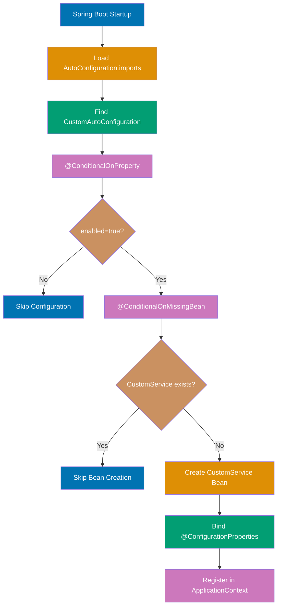

**Caption**: Custom auto-configuration evaluates @Conditional annotations in order, skipping bean creation if conditions fail, enabling smart defaults with easy overrides.

**Key Takeaway**: Create custom starters to encapsulate reusable auto-configuration—define `@ConfigurationProperties`, auto-configuration classes, and register in `META-INF/spring/org.springframework.boot.autoconfigure.AutoConfiguration.imports` for distribution.

**Why It Matters**: Custom starters enable organizational best practices (logging format, metrics collection, security headers) to be shared across 50+ microservices through dependency inclusion, eliminating copy-paste configuration that diverges over time. Production platform teams create internal starters that auto-configure database connections with company-wide connection pool settings, distributed tracing with correlation ID propagation, and security headers (CSP, HSTS) that satisfy compliance requirements, reducing per-service configuration from 200 lines to zero.

### Example 54: Conditional Beans - Context-Aware Configuration

Conditional beans allow selective bean creation based on classpath, properties, or existing beans.

```java
@Configuration
// => Annotation applied
public class ConditionalBeansConfig {
    // => Begins block
    @Bean // => Define CacheService bean
    @ConditionalOnClass(name = "com.redis.RedisClient") // => Only create if Redis client JAR present
    public CacheService redisCacheService() { // => Redis-backed cache implementation
        return new RedisCacheService();  // => Created only when Redis available on classpath
        // => Assigns > Created only when Redis available on classpath to //
    }
    // => Block delimiter

    @Bean // => Alternative CacheService bean
    @ConditionalOnMissingClass("com.redis.RedisClient") // => Only create if Redis client NOT on classpath
    public CacheService memoryCacheService() { // => In-memory fallback implementation
        return new MemoryCacheService();  // => Created when Redis unavailable (dev/test environments)
        // => Assigns > Created when Redis unavailable (dev/test environments) to //
    }
    // => Block delimiter

    @Bean // => Optional feature bean
    @ConditionalOnProperty(name = "feature.advanced", havingValue = "true") // => Only create if property set to "true"
    public AdvancedFeature advancedFeature() { // => Advanced feature implementation
        return new AdvancedFeature();  // => Created based on application.yml configuration
        // => Assigns > Created based on application.yml configuration to //
    }
    // => Block delimiter

    @Bean // => Default DataSource bean
    @ConditionalOnMissingBean(DataSource.class) // => Only create if no other DataSource bean exists
    public DataSource defaultDataSource() { // => Embedded H2 database
        return new EmbeddedDatabaseBuilder() // => Build in-memory database
            .setType(EmbeddedDatabaseType.H2) // => Use H2 database
            .build();  // => Auto-configured only when custom DataSource not provided
            // => Assigns > Auto-configured only when custom DataSource not provided to //
    }

    @Bean // => JPA transaction manager
    @ConditionalOnBean(EntityManagerFactory.class) // => Only create if EntityManagerFactory bean exists
    public JpaTransactionManager transactionManager(EntityManagerFactory emf) { // => Create transaction manager
        return new JpaTransactionManager(emf);  // => Auto-configured when JPA/Hibernate present
        // => Assigns > Auto-configured when JPA/Hibernate present to //
    }
}

interface CacheService {
    // => Begins block
    void put(String key, Object value);
    // => Executes method
    Object get(String key);
    // => Executes method
}
```

**Code (Kotlin)**:

```kotlin
@Configuration
open class ConditionalBeansConfig {
  @Bean
  @ConditionalOnClass(name = ["com.redis.RedisClient"])  // => Only create if Redis client JAR present
  open fun redisCacheService(): CacheService = RedisCacheService()  // => Created only when Redis available

  @Bean
  @ConditionalOnMissingClass("com.redis.RedisClient")  // => Only create if Redis client NOT on classpath
  open fun memoryCacheService(): CacheService = MemoryCacheService()  // => In-memory fallback

  @Bean
  @ConditionalOnProperty(name = ["feature.advanced"], havingValue = "true")
  open fun advancedFeature() = AdvancedFeature()  // => Created based on application.yml

  @Bean
  @ConditionalOnMissingBean(DataSource::class)  // => Only create if no other DataSource exists
  open fun defaultDataSource(): DataSource = EmbeddedDatabaseBuilder()
    .setType(EmbeddedDatabaseType.H2).build()  // => Auto-configured embedded H2

  @Bean
  @ConditionalOnBean(EntityManagerFactory::class)  // => Only create if EntityManagerFactory exists
  open fun transactionManager(emf: EntityManagerFactory) = JpaTransactionManager(emf)
}

interface CacheService {
  fun put(key: String, value: Any)
  fun get(key: String): Any?
}

// Kotlin-specific: Use expression bodies for simple bean definitions, Any? for nullable returns
```

**Key Takeaway**: Conditional beans enable context-aware configuration—use `@ConditionalOnClass`, `@ConditionalOnProperty`, and `@ConditionalOnMissingBean` to create or skip beans based on classpath, properties, or existing bean presence.

**Why It Matters**: Conditional beans enable "smart defaults with easy overrides" where Spring Boot auto-configures 90% of beans based on classpath detection, while developers override the 10% needing customization without disabling all auto-configuration. Production applications use @ConditionalOnProperty to toggle features between environments (enable caching in prod, disable in dev) and @ConditionalOnMissingBean to provide default implementations that get replaced when custom implementations are defined, maintaining flexibility without configuration explosion.

### Example 55: Configuration Properties - Type-Safe Configuration

Configuration properties provide type-safe, validated, and IDE-friendly application configuration.

```java
@ConfigurationProperties(prefix = "app.mail") // => Bind properties starting with "app.mail"
@Validated // => Enable JSR-303 validation
public class MailProperties { // => Type-safe configuration class
    @NotBlank // => Validation: host cannot be null/empty
    private String host; // => SMTP server hostname
    // => Assigns > SMTP server hostname to //

    @Min(1) // => Validation: port >= 1
    @Max(65535) // => Validation: port <= 65535
    private int port = 587; // => SMTP port (default 587 for TLS)
    // => Assigns 587 // to port

    @Email // => Validation: valid email format required
    private String from; // => Sender email address
    // => Assigns > Sender email address to //

    @Valid // => Cascade validation to nested object
    private Smtp smtp = new Smtp(); // => Nested SMTP auth configuration
    // => Instantiates Smtp
    // => Stores in smtp

    private Map<String, String> templates = new HashMap<>(); // => Email template mappings
    // => Instantiates HashMap
    // => Stores in templates

    public static class Smtp {
    // => Begins block
        private boolean auth = true;
        // => Assigns true to auth
        private boolean starttls = true;
        // => Assigns true to starttls

        @NotBlank
        private String username;
        // => Declares username field of type String

        @NotBlank
        private String password;
        // => Declares password field of type String

        // Getters/setters
    }

    // Getters/setters
}

@Configuration
@EnableConfigurationProperties(MailProperties.class)
    // => Executes method
public class MailConfig {
    // => Begins block
    @Bean // => Configure mail sender bean
    public JavaMailSender mailSender(MailProperties props) { // => Inject validated properties
        JavaMailSenderImpl sender = new JavaMailSenderImpl(); // => Create mail sender
        sender.setHost(props.getHost()); // => Configure SMTP host from properties
        sender.setPort(props.getPort()); // => Configure port from properties
        sender.setUsername(props.getSmtp().getUsername()); // => Configure SMTP auth username
        sender.setPassword(props.getSmtp().getPassword()); // => Configure SMTP auth password
        return sender; // => Fully configured mail sender bean
        // => Assigns > Fully configured mail sender bean to //
    }
}

// application.yml
// app:
//   mail:
//     host: smtp.gmail.com
//     port: 587
//     from: noreply@example.com
//     smtp:
//       auth: true
//       starttls: true
//       username: user@gmail.com
//       password: secret
//     templates:
//       welcome: welcome.html
//       reset: password-reset.html
```

**Code (Kotlin)**:

```kotlin
@ConfigurationProperties(prefix = "app.mail")
@Validated
data class MailProperties(
  @field:NotBlank var host: String = "",
  @field:Min(1) @field:Max(65535) var port: Int = 587,
  @field:Email var from: String = "",
  var smtp: SmtpProperties = SmtpProperties(),
  var templates: TemplatesProperties = TemplatesProperties()
) {
  data class SmtpProperties(
    var auth: Boolean = true,
    var starttls: Boolean = true,
    var username: String = "",
    var password: String = ""
  )
  data class TemplatesProperties(
    var welcome: String = "welcome.html",
    var reset: String = "password-reset.html"
  )
}

@Configuration
@EnableConfigurationProperties(MailProperties::class)
open class MailConfig {
  @Bean
  open fun javaMailSender(props: MailProperties): JavaMailSender =
    JavaMailSenderImpl().apply {
      host = props.host; port = props.port
      username = props.smtp.username; password = props.smtp.password
      javaMailProperties["mail.smtp.auth"] = props.smtp.auth.toString()
      javaMailProperties["mail.smtp.starttls.enable"] = props.smtp.starttls.toString()
    }
}

// Kotlin-specific: Use nested data classes for hierarchical properties, apply scope function for configuration
```

**Key Takeaway**: Use `@ConfigurationProperties` for type-safe configuration—bind hierarchical properties to POJOs with validation, enabling compile-time safety and IDE autocomplete for application settings.

**Why It Matters**: Type-safe configuration properties prevent runtime failures from typos (datasource.urll vs datasource.url) and type mismatches (port: "abc" instead of port: 8080) through compile-time validation, catching configuration errors during build instead of production deployment. Production systems use nested configuration properties (@ConfigurationProperties with inner classes) to organize related settings (database: {url, username, password, pool: {min, max}}) that validate as a unit, failing fast on startup rather than discovering missing configuration when code first executes.

### Example 56: Custom Actuator Endpoints - Operational Insights

Custom actuator endpoints expose application-specific operational data through the management interface.

```java
@Endpoint(id = "application-info") // => Custom actuator endpoint (id maps to /actuator/application-info)
@Component // => Spring-managed bean
public class ApplicationInfoEndpoint { // => Custom operational endpoint
// => Defines ApplicationInfoEndpoint class
    private final ApplicationContext context;
    // => Declares context field of type final
    private final Environment environment;
    // => Declares environment field of type final

    public ApplicationInfoEndpoint(ApplicationContext context, Environment environment) { // => Constructor injection
        this.context = context; // => Application context for bean metadata
        this.environment = environment; // => Environment for active profiles/properties
        // => Initializes environment with environment //
    }

    @ReadOperation // => Maps to GET /actuator/application-info
    public ApplicationInfo info() { // => Return application metadata
        return new ApplicationInfo( // => Build response object
            context.getApplicationName(), // => Application name from context
            environment.getActiveProfiles(), // => Active Spring profiles (e.g., ["prod"])
            context.getBeanDefinitionCount(), // => Total registered beans
            System.getProperty("java.version") // => JVM version
    }

    @WriteOperation // => Maps to POST /actuator/application-info/{key}
    public void updateSetting(@Selector String key, String value) { // => Path variable injection
        // => Custom write operation (modify runtime config)
        System.setProperty("app." + key, value); // => Update system property dynamically
        // => Assigns > Update system property dynamically to //
    }

    @DeleteOperation // => Maps to DELETE /actuator/application-info/{cacheName}
    public void clearCache(@Selector String cacheName) { // => Path variable injection
        // => Custom delete operation (clear application cache)
        System.out.println("Clearing cache: " + cacheName); // => Placeholder (production: clear actual cache)
        // => Assigns > Placeholder (production: clear actual cache) to //
    }
}

record ApplicationInfo(String name, String[] profiles, int beanCount, String javaVersion) {}
    // => Executes method

// application.yml
// management:
//   endpoints:
//     web:
//       exposure:
//         include: application-info

// GET /actuator/application-info
// POST /actuator/application-info/{key}
// DELETE /actuator/application-info/{cacheName}
```

**Code (Kotlin)**:

```kotlin
@Endpoint(id = "application-info")
@Component
class ApplicationInfoEndpoint(
  private val context: ApplicationContext,
  private val environment: Environment
) {
  @ReadOperation  // => Maps to GET /actuator/application-info
  fun info() = ApplicationInfo(
    context.applicationName,
    environment.activeProfiles,
    context.beanDefinitionCount,
    System.getProperty("java.version")
  )

  @WriteOperation  // => Maps to POST /actuator/application-info/{key}
  fun updateSetting(@Selector key: String, value: String) {
    System.setProperty("app.$key", value)
  }

  @DeleteOperation  // => Maps to DELETE /actuator/application-info/{cacheName}
  fun clearCache(@Selector cacheName: String) {
    println("Clearing cache: $cacheName")
  }
}

data class ApplicationInfo(val name: String, val profiles: Array<String>, val beanCount: Int, val javaVersion: String)

// Kotlin-specific: Use expression body for info(), string templates in operations
```

**Key Takeaway**: Custom actuator endpoints expose application-specific metrics—use `@Endpoint`, `@ReadOperation`, `@WriteOperation`, and `@DeleteOperation` to create management endpoints beyond Spring Boot's default actuators.

**Why It Matters**: Custom actuator endpoints expose application-specific operational data (current promotion, feature flag states, cache statistics) through standardized HTTP endpoints that integrate with existing monitoring infrastructure. Production operations teams use custom endpoints to expose business metrics (active websocket connections, queue depths, circuit breaker states) without maintaining separate admin APIs, enabling operators to query application state during incidents through the same actuator framework that exposes standard health/metrics endpoints.

### Example 57: Docker Containerization - Layered JARs

Docker multi-stage builds with layered JARs optimize image size and build caching for faster deployments.

```dockerfile
# Stage 1: Extract JAR layers
FROM eclipse-temurin:17-jre as builder    # => Base image with JRE 17 (AdoptOpenJDK distribution)
                                           # => 'as builder' names this stage for reference
WORKDIR /app                               # => Set working directory to /app
ARG JAR_FILE=target/*.jar                  # => Define build argument for JAR path (Maven default)
COPY ${JAR_FILE} application.jar           # => Copy built JAR into container
RUN java -Djarmode=layertools -jar application.jar extract  # => Extract JAR into separate layer directories
                                                             # => Creates: dependencies/, spring-boot-loader/, snapshot-dependencies/, application/

# Stage 2: Final runtime image
FROM eclipse-temurin:17-jre                # => Fresh base image (smaller final image, no builder artifacts)
WORKDIR /app                               # => Set working directory
COPY --from=builder /app/dependencies/ ./  # => Copy dependencies layer from builder stage (rarely changes, cached)
COPY --from=builder /app/spring-boot-loader/ ./  # => Copy Spring Boot loader layer (rarely changes, cached)
COPY --from=builder /app/snapshot-dependencies/ ./  # => Copy snapshot dependencies (changes occasionally)
COPY --from=builder /app/application/ ./   # => Copy application code (changes frequently, smallest layer)
                                           # => Layer order optimizes Docker caching (most stable → most volatile)

EXPOSE 8080                                # => Document that container listens on port 8080
ENTRYPOINT ["java", "org.springframework.boot.loader.launch.JarLauncher"]  # => Launch Spring Boot application using layered JAR loader
```

```xml
<!-- pom.xml: Enable layered JARs -->
<plugin>
    <groupId>org.springframework.boot</groupId>
    <artifactId>spring-boot-maven-plugin</artifactId>
    <configuration>
        <layers>
            <enabled>true</enabled>  <!-- => Enable JAR layering for Docker optimization -->
                                      <!-- => Default layers: dependencies, spring-boot-loader, snapshot-dependencies, application -->
        </layers>
    </configuration>
</plugin>
```

```bash
mvn clean package                          # => Build Spring Boot application (creates target/myapp.jar)
docker build -t myapp:latest .             # => Build Docker image using Dockerfile, tag as 'myapp:latest'
                                           # => Multi-stage build extracts layers, creates optimized image
docker run -p 8080:8080 myapp:latest       # => Run container, map host port 8080 to container port 8080

java -Djarmode=layertools -jar target/myapp.jar list  # => List available layers in JAR
# => Output:
# dependencies
# spring-boot-loader
# snapshot-dependencies
# application
```

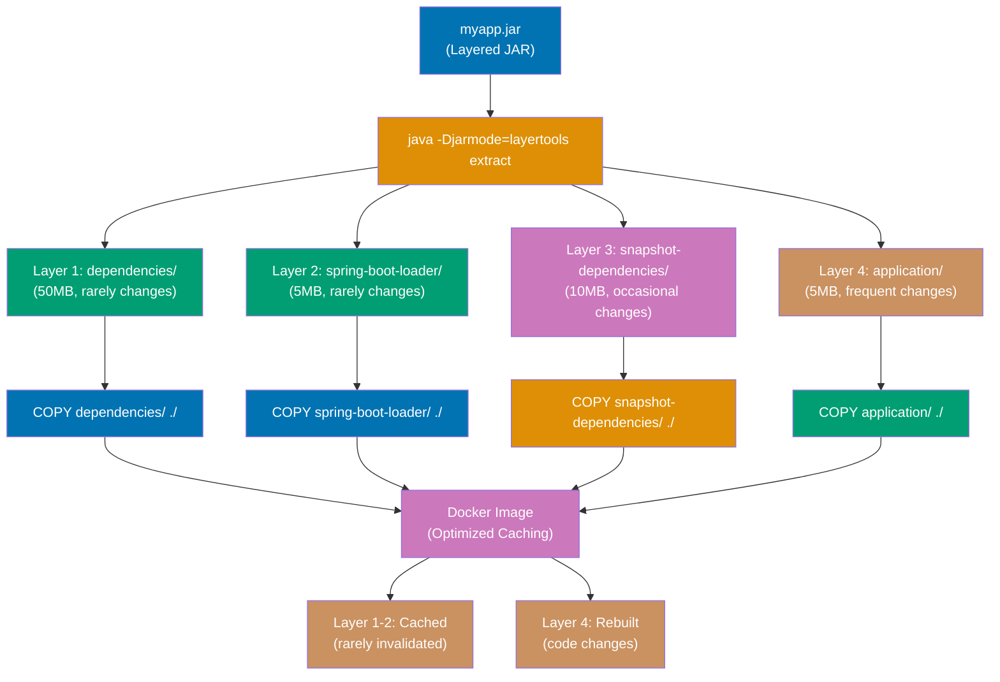

**Caption**: Layered JARs separate dependencies (rarely change, 50MB) from application code (frequent changes, 5MB), enabling Docker layer caching for faster rebuilds.

**Note**: Dockerfile syntax is identical for Kotlin Spring Boot applications. The layered JAR extraction and multi-stage build process works the same way for both Java and Kotlin compiled JARs.

**Code (Kotlin)**:

```kotlin
// build.gradle.kts: Enable layered JARs in Gradle Kotlin DSL
// Kotlin projects typically use Gradle instead of Maven
import org.springframework.boot.gradle.tasks.bundling.BootJar

tasks.named<BootJar>("bootJar") {
    // Enable layered JAR format
    // Layers separate dependencies from application code for better Docker caching
    layered {
        enabled = true
        // Default layers: dependencies, spring-boot-loader, snapshot-dependencies, application
        // Custom layers can be defined in layers.idx file
    }
}
```

```bash
# Build and verify layers with Gradle
./gradlew clean bootJar
docker build -t myapp:latest .
docker run -p 8080:8080 myapp:latest

# List layers in the JAR
java -Djarmode=layertools -jar build/libs/myapp.jar list
# => dependencies
# => spring-boot-loader
# => snapshot-dependencies
# => application
```

**Key Takeaway**: Layered JARs with Docker multi-stage builds optimize image caching—dependencies layer rarely changes, enabling faster rebuilds and smaller image transfers when only application code updates.

**Why It Matters**: Layered JARs with Docker multi-stage builds separate dependencies (rarely change, 50MB) from application code (frequently change, 5MB), enabling Docker layer caching where rebuilding after code changes transfers only 5MB instead of 55MB to production servers. Production CI/CD pipelines achieve 10x faster deployment times (30 seconds vs 5 minutes) by caching dependency layers, with image sizes reduced from 200MB (fat JAR + JDK) to 80MB (layered JAR + JRE) through removal of unnecessary JDK tools.

### Example 58: Health Checks - Liveness vs Readiness

Kubernetes health probes distinguish between liveness (restart if unhealthy) and readiness (stop traffic if not ready).

```java
@Component  // => Spring-managed component for auto-registration
public class DatabaseHealthIndicator implements HealthIndicator {  // => Custom health check for database connectivity
    private final DataSource dataSource;  // => Injected HikariCP connection pool
    // => Assigns > Injected HikariCP connection pool to //

    public DatabaseHealthIndicator(DataSource dataSource) {  // => Constructor injection
        this.dataSource = dataSource;  // => Store reference to connection pool
        // => Initializes dataSource with dataSource  //
    }

    @Override  // => Implement HealthIndicator contract
    public Health health() {  // => Called by Spring Boot Actuator to check health
        try (Connection conn = dataSource.getConnection()) {  // => Get connection from pool, auto-close after try block
                                                               // => Throws SQLException if pool exhausted or database unreachable
            if (conn.isValid(1)) {  // => Test connection validity with 1-second timeout
                                     // => Sends simple query to database to verify connectivity
                return Health.up()  // => Return UP status if connection valid
                    .withDetail("database", "PostgreSQL")  // => Add metadata to health response
                    .build();  // => Build immutable Health object
                    // => Assigns > Build immutable Health object to //
            }
        } catch (Exception e) {  // => Catch SQLException or connection pool errors
            return Health.down(e).build();  // => Return DOWN status with exception details
                                             // => Kubernetes will restart pod if liveness probe fails
        }
        return Health.down().build();  // => Return DOWN if connection invalid but no exception
        // => Assigns > Return DOWN if connection invalid but no exception to //
    }
}

@Component  // => Spring-managed component
public class ExternalApiHealthIndicator implements HealthIndicator {  // => Custom health check for external API dependency
    private final WebClient webClient;  // => Injected reactive HTTP client
    // => Assigns > Injected reactive HTTP client to //

    public ExternalApiHealthIndicator(WebClient webClient) {  // => Constructor injection
        this.webClient = webClient;  // => Store reference to WebClient bean
        // => Initializes webClient with webClient  //
    }

    @Override  // => Implement HealthIndicator contract
    public Health health() {  // => Called by Spring Boot Actuator to check external API health
        try {
    // => Begins block
            webClient.get()  // => HTTP GET request
                .uri("https://api.external.com/health")  // => External API health endpoint
                .retrieve()  // => Execute request
                .bodyToMono(String.class)  // => Convert response body to Mono<String>
                .block(Duration.ofSeconds(2));  // => Block (synchronous) with 2-second timeout
                                                 // => Throws TimeoutException if API doesn't respond within 2s
            return Health.up().build();  // => Return UP status if API responds successfully
        } catch (Exception e) {  // => Catch TimeoutException or HTTP errors (4xx/5xx)
            return Health.down(e).build();  // => Return DOWN status if external API unavailable
                                             // => Kubernetes will remove pod from load balancer if readiness probe fails
        }
    }
}

// application.yml
// management:
//   endpoint:
//     health:
//       probes:
//         enabled: true  # => Enable Kubernetes liveness/readiness probe endpoints
//       group:
//         liveness:  # => Define liveness probe group (should pod be restarted?)
//           include: livenessState  # => Include only basic application lifecycle state
//         readiness:  # => Define readiness probe group (should pod receive traffic?)
//           include: readinessState,db,externalApi  # => Include lifecycle state, database, and external API checks

// Kubernetes probes:
// livenessProbe:  # => Liveness probe configuration (restart if unhealthy)
//   httpGet:
//     path: /actuator/health/liveness  # => Endpoint: checks basic application health
//     port: 8080
// readinessProbe:  # => Readiness probe configuration (stop traffic if not ready)
//   httpGet:
//     path: /actuator/health/readiness  # => Endpoint: checks database, external API, and application readiness
//     port: 8080
```

**Code (Kotlin)**:

```kotlin
@Component
class DatabaseHealthIndicator(private val dataSource: DataSource) : HealthIndicator {
  override fun health(): Health = try {
    dataSource.connection.use { conn ->
      if (conn.isValid(1)) Health.up().withDetail("database", "PostgreSQL").build()
      else Health.down().build()
    }
  } catch (e: Exception) {
    Health.down(e).build()
  }
}

@Component
class ReadinessIndicator : HealthIndicator {
  private var isReady = false
  @EventListener(ApplicationReadyEvent::class)
  fun onReady() { isReady = true }
  override fun health() = if (isReady) Health.up().build() else Health.outOfService().build()
}

// Kotlin-specific: Use 'use' extension for auto-closeable resources, expression body for health()
```

**Key Takeaway**: Separate liveness and readiness probes in Kubernetes—liveness checks if application should restart (basic health), readiness checks if application can serve traffic (database connections, external dependencies).

**Why It Matters**: Liveness probes detect deadlocks and infinite loops that leave applications running but unable to serve requests—Kubernetes restarts unhealthy pods automatically instead of requiring manual intervention. Readiness probes prevent traffic routing to instances with degraded dependencies (database connection pool exhausted), removing them from load balancer rotation until recovered, enabling zero-downtime deployments where new pods don't receive traffic until health checks pass while old pods continue serving requests during rollout.

### Example 59: Graceful Shutdown - In-Flight Request Handling

Graceful shutdown ensures in-flight requests complete before application termination, preventing data loss.

```java
@Configuration  // => Spring configuration class
public class GracefulShutdownConfig {
    // => Begins block
    @Bean  // => Define bean for Tomcat web server factory customization
    public TomcatServletWebServerFactory tomcatFactory() {  // => Customize embedded Tomcat server
        TomcatServletWebServerFactory factory = new TomcatServletWebServerFactory();  // => Create factory instance
        factory.addConnectorCustomizers(connector -> {  // => Add connector customizer lambda
            connector.setProperty("connectionTimeout", "20000");  // => Set connection timeout to 20 seconds
                                                                   // => Timeout applies to idle connections (no data transfer)
        });
        return factory;  // => Return customized factory
    }

    @PreDestroy  // => Lifecycle callback executed during application shutdown
                  // => Called after graceful shutdown period but before final termination
    public void onShutdown() {  // => Cleanup method
        System.out.println("Application shutting down gracefully...");  // => Log shutdown event
                                                                          // => Useful for cleanup tasks (close connections, flush buffers)
    }
}

@RestController  // => REST controller with @ResponseBody on all methods
@Slf4j  // => Lombok annotation generates static logger field
public class LongRunningController {
    // => Begins block
    @PostMapping("/process")  // => Handle POST requests to /process
    public ResponseEntity<String> processLongRunning() {  // => Simulate long-running operation
        log.info("Started long-running request");  // => Log request start

        try {
    // => Begins block
            Thread.sleep(5000);  // => Simulate 5-second operation (database query, external API call)
                                  // => During graceful shutdown, this request completes before termination
            log.info("Completed long-running request");  // => Log successful completion
            return ResponseEntity.ok("Processing complete");  // => Return 200 OK response
        } catch (InterruptedException e) {  // => Handle interruption during shutdown
                                             // => If shutdown timeout exceeded, thread interrupted
            log.warn("Request interrupted during shutdown");  // => Log interruption warning
            Thread.currentThread().interrupt();  // => Restore interrupted status (best practice)
                                                  // => Allows upstream code to detect interruption
            return ResponseEntity.status(503).body("Service shutting down");  // => Return 503 Service Unavailable
                                                                                // => Signals client to retry later
        }
    }
}

// application.yml
// server:
//   shutdown: graceful  # => Enable graceful shutdown (default is IMMEDIATE)
//                       # => Server stops accepting new requests but waits for active requests
// spring:
//   lifecycle:
//     timeout-per-shutdown-phase: 30s  # => Maximum wait time for active requests to complete
//                                       # => After 30s, remaining requests are interrupted

// Shutdown behavior:
// 1. Server stops accepting new requests  # => Returns 503 Service Unavailable to new requests
// 2. Waits up to 30s for active requests to complete  # => Allows in-flight requests to finish
// 3. Executes @PreDestroy methods  # => Cleanup callbacks
// 4. Shuts down  # => Application terminates
```

**Code (Kotlin)**:

```kotlin
// application.yml - Same as Java

@Component
class GracefulShutdownListener : ApplicationListener<ContextClosedEvent> {
  private val log = LoggerFactory.getLogger(javaClass)
  override fun onApplicationEvent(event: ContextClosedEvent) {
    log.info("Graceful shutdown initiated, waiting for requests to complete...")
  }
}

@Configuration
open class GracefulShutdownConfig {
  @Bean
  open fun gracefulShutdown() = TomcatConnectorCustomizer { connector -> connector.pause() }
}

// Kotlin-specific: Use expression body for listener, lambda for customizer
```

**Key Takeaway**: Enable graceful shutdown with `server.shutdown=graceful`—Spring Boot waits for in-flight requests to complete (up to configured timeout) before shutting down, preventing abrupt connection closures during deployments.

**Why It Matters**: Graceful shutdown ensures in-flight requests complete before application termination, preventing client errors (connection reset by peer) during deployments that abruptly kill processes mid-request. Production Kubernetes deployments configure 30-second grace periods where pods stop accepting new requests immediately but wait for active requests to finish, coordinated with load balancer deregistration delays (10-second delay before sending SIGTERM) to ensure traffic stops flowing before shutdown begins, achieving zero dropped requests during rolling updates.

### Example 60: Externalized Configuration - Spring Cloud Config

Spring Cloud Config Server provides centralized configuration management for distributed systems with environment-specific profiles.

```java
// Config Server Application
@SpringBootApplication  // => Auto-configuration for Spring Boot application
@EnableConfigServer  // => Enable Spring Cloud Config Server functionality
                      // => Exposes REST API endpoints: /{application}/{profile}/{label}
public class ConfigServerApplication {
    // => Begins block
    public static void main(String[] args) {  // => Application entry point
        SpringApplication.run(ConfigServerApplication.class, args);  // => Start embedded web server on port 8888
    }
}

// application.yml (Config Server)
// server:
//   port: 8888  # => Config Server listens on port 8888 (conventional port)
// spring:
//   cloud:
//     config:
//       server:
//         git:
//           uri: https://github.com/myorg/config-repo  # => Git repository URL for configuration storage
//                                                       # => Supports GitHub, GitLab, Bitbucket, or any Git server
//           default-label: main  # => Default Git branch (main, master, develop, etc.)
//           search-paths: '{application}'  # => Search path pattern: config-repo/{application}/
//                                          # => Placeholder replaced with spring.application.name from client

// Config Client Application
// pom.xml: spring-cloud-starter-config  # => Add dependency for Config Client support

@RestController  // => REST controller with @ResponseBody on all methods
@RefreshScope  // => Enable dynamic property refresh without application restart
                // => Bean recreated when /actuator/refresh called, re-injecting properties
public class ConfigClientController {
    // => Begins block
    @Value("${app.message:default}")  // => Inject property from Config Server
                                       // => Fetches from config-repo/myapp/application.yml: app.message
                                       // => Default value "default" if property missing
    private String message;  // => Field holds current property value

    @Value("${app.feature.enabled:false}")  // => Inject boolean property from Config Server
                                             // => Default to false if property missing
    private boolean featureEnabled;  // => Feature flag controlled by Config Server

    @GetMapping("/config")  // => Expose current configuration via REST endpoint
    public Map<String, Object> getConfig() {  // => Return configuration as JSON
        return Map.of(  // => Immutable map with current property values
            "message", message,  // => Current message value (refreshable)
            "featureEnabled", featureEnabled  // => Current feature flag state (refreshable)
        );
    }
}

// application.yml (Client)
// spring:
//   application:
//     name: myapp  # => Application name (maps to config-repo/myapp/)
//   config:
//     import: optional:configserver:http://localhost:8888  # => Import configuration from Config Server
//                                                           # => 'optional:' prefix allows startup if Config Server unavailable
//   cloud:
//     config:
//       fail-fast: true  # => Fail application startup if Config Server unreachable
//                        # => Prevents startup with incorrect/missing configuration
//       retry:
//         max-attempts: 6  # => Retry 6 times if Config Server unavailable during startup

// Config repo structure:
// config-repo/
//   myapp/
//     application.yml         # Default properties (all environments)
//     application-dev.yml     # Dev environment overrides (spring.profiles.active=dev)
//     application-prod.yml    # Production environment overrides (spring.profiles.active=prod)

// Refresh config: POST /actuator/refresh  # => Reload properties without restart (only @RefreshScope beans)
//                                          # => Returns list of changed property keys
```

**Code (Kotlin)**:

```kotlin
// Config Server Application
@SpringBootApplication
@EnableConfigServer
open class ConfigServerApplication

fun main(args: Array<String>) {
  runApplication<ConfigServerApplication>(*args)
}

// Client Application
@RestController
@RefreshScope
class ConfigController(@Value("\${app.message}") private var message: String) {
  @GetMapping("/message")
  fun getMessage() = mapOf("message" to message)

  @GetMapping("/feature")
  fun featureToggle(@Value("\${app.feature.enabled}") featureEnabled: Boolean) =
    mapOf("feature" to "demo", "enabled" to featureEnabled)
}

// Kotlin-specific: Use @RefreshScope with var for dynamic property refresh, mapOf for response
```

**Key Takeaway**: Spring Cloud Config Server centralizes configuration—applications fetch environment-specific properties from a Git repository, enabling configuration changes without redeployment using `@RefreshScope` and actuator refresh endpoint.

**Why It Matters**: Centralized configuration with Spring Cloud Config enables configuration changes (feature flags, timeouts, database URLs) without redeployment—update Git repository and call /actuator/refresh to reload properties in running instances. Production systems use Config Server for environment-specific properties (dev/staging/prod) stored in Git with audit history showing who changed what when, while @RefreshScope enables runtime property changes that take effect within seconds instead of requiring full application redeployment that causes minutes of downtime.

---

### Example 61: Kubernetes ConfigMaps and Secrets

Integrate Spring Boot with Kubernetes ConfigMaps for configuration and Secrets for sensitive data.

```java
// pom.xml: spring-cloud-starter-kubernetes-fabric8-config  # => Add dependency for Kubernetes integration
                                                             # => Enables automatic ConfigMap/Secret reading

@RestController  // => REST controller with @ResponseBody on all methods
@RequestMapping("/api/k8s")  // => Base path for all endpoints in this controller
public class K8sConfigController {
    // => Begins block
    @Value("${app.environment}")  // => Inject property from Kubernetes ConfigMap
                                   // => ConfigMap key: app.environment
    private String environment; // => Value loaded from ConfigMap at startup and on refresh

    @Value("${db.password}")  // => Inject secret from Kubernetes Secret
                               // => Secret injected as environment variable (base64 decoded automatically)
    private String dbPassword; // => Sensitive credential (never expose in logs/responses)

    @Value("${app.feature.newUI:false}")  // => Inject property from ConfigMap with default value
                                           // => Defaults to false if property missing
    private boolean newUI; // => Feature flag controlled by ConfigMap

    @GetMapping("/config")  // => GET /api/k8s/config endpoint
    public Map<String, String> getConfig() {  // => Return configuration info as JSON
        return Map.of(  // => Immutable map with configuration details
            "environment", environment,  // => Show environment name (safe to expose)
            "dbPasswordLength", String.valueOf(dbPassword.length()), // Don't expose actual password! (Security best practice)
    // => Executes method
                                                                      // => Shows password exists without revealing value
            "newUI", String.valueOf(newUI)  // => Show feature flag state
        );
    }
}
```

```yaml
# configmap.yaml
apiVersion: v1 # => Kubernetes API version for ConfigMap resource
kind: ConfigMap # => Resource type for non-sensitive configuration data
metadata:
  name: myapp-config # => ConfigMap name (referenced in Deployment volumeMounts)
data: # => Key-value pairs (unencrypted, plain text)
  application.yml: | # => Key: filename, Value: YAML content (multi-line string)
    app:  # => Application-specific configuration
      environment: production  # => Environment identifier (dev/staging/prod)
      feature:  # => Feature flags
        newUI: true  # => Enable new UI feature (toggle without code change)
    spring:  # => Spring Boot configuration
      datasource:  # => Database connection settings
        url: jdbc:postgresql://postgres:5432/mydb  # => JDBC URL (Kubernetes DNS resolves 'postgres' to service IP)
```

```yaml
# secret.yaml
apiVersion: v1 # => Kubernetes API version for Secret resource
kind: Secret # => Resource type for sensitive data (encrypted at rest in etcd)
metadata:
  name: myapp-secrets # => Secret name (referenced in Deployment env vars)
type: Opaque # => Generic secret type (binary data)
data: # => Key-value pairs (base64 encoded, encrypted at rest)
  db.password:
    cGFzc3dvcmQxMjM= # => base64 encoded "password123"
    # => Create with: echo -n "password123" | base64
    # => Spring Cloud Kubernetes decodes automatically
```

```yaml
# deployment.yaml
apiVersion: apps/v1 # => Kubernetes API version for Deployment resource
kind: Deployment # => Resource type for deploying pods with replicas
metadata:
  name: myapp # => Deployment name
spec:
  replicas: 3 # => Run 3 identical pods for high availability
  template: # => Pod template
    spec: # => Pod specification
      containers:
        - name: myapp # => Container name
          image: myapp:latest # => Docker image to run
          env: # => Environment variables injected into container
            - name: SPRING_PROFILES_ACTIVE # => Activate Kubernetes profile
              value: kubernetes # => Loads application-kubernetes.yml
            - name: db.password # => Environment variable name (matches @Value key)
              valueFrom: # => Load value from external source
                secretKeyRef: # => Reference to Secret resource
                  name: myapp-secrets # => Secret name (must exist in same namespace)
                  key: db.password # => Key within Secret (base64 decoded automatically)
          volumeMounts: # => Mount volumes into container filesystem
            - name: config # => Volume name (matches volumes.name below)
              mountPath: /config # => Path where ConfigMap mounted in container
              readOnly: true # => Prevent container from modifying ConfigMap
      volumes: # => Define volumes to mount
        - name: config # => Volume name
          configMap: # => Volume source is ConfigMap
            name: myapp-config # => ConfigMap name (must exist in same namespace)
```

```yaml
# application-kubernetes.yml
spring: # => Spring Boot configuration
  config: # => Configuration sources
    import:
      "kubernetes:" # => Enable Kubernetes ConfigMap/Secret import
      # => Automatically discovers ConfigMaps and Secrets
  cloud: # => Spring Cloud configuration
    kubernetes: # => Kubernetes integration
      config: # => ConfigMap configuration
        enabled: true # => Enable ConfigMap property source
        sources: # => List of ConfigMaps to load
          - name: myapp-config # => Load properties from ConfigMap named 'myapp-config'
      secrets: # => Secret configuration
        enabled: true # => Enable Secret property source
        sources: # => List of Secrets to load
          - name:
              myapp-secrets # => Load properties from Secret named 'myapp-secrets'
              # => Secrets automatically base64 decoded
```

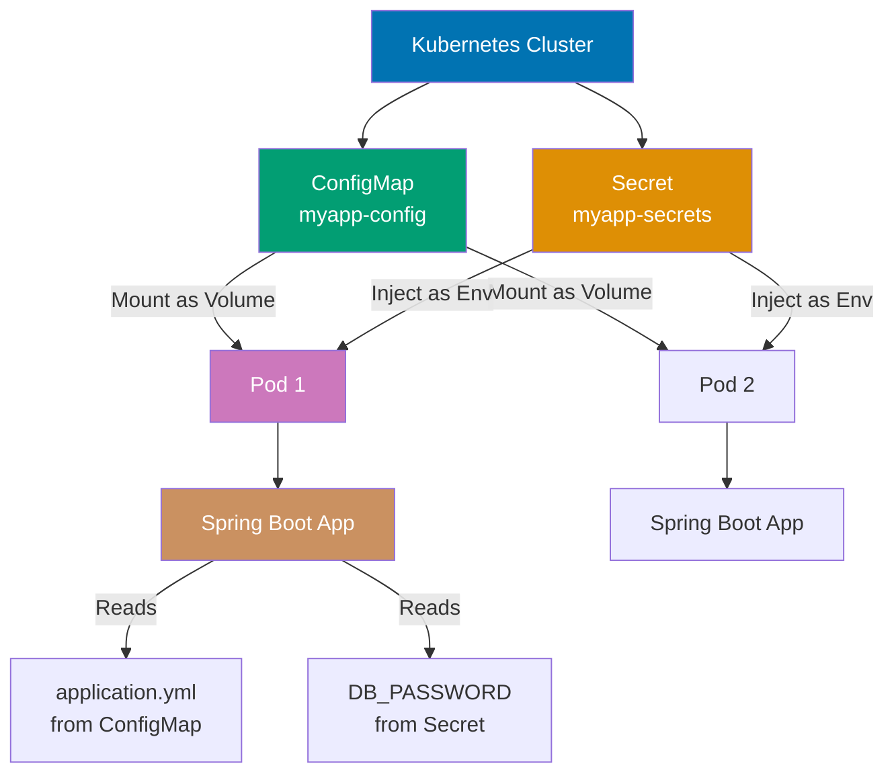

**Code (Kotlin)**:

```kotlin
// Kubernetes YAML - Same for all languages

@Configuration
@ConfigurationProperties(prefix = "database")
data class DatabaseConfig(
  var host: String = "",
  var port: Int = 5432,
  var name: String = ""
)

@RestController
class ConfigMapController(
  private val config: DatabaseConfig,
  @Value("\${api.key}") private val apiKey: String
) {
  @GetMapping("/config")
  fun getConfig() = mapOf(
    "database" to config,
    "hasApiKey" to apiKey.isNotEmpty()
  )
}

// Kotlin-specific: Use data class for configuration, expression body, mapOf for response
```

**Key Takeaway**: Use Kubernetes ConfigMaps for non-sensitive configuration and Secrets for credentials—Spring Cloud Kubernetes automatically reloads configuration when ConfigMaps/Secrets change without pod restarts.

**Why It Matters**: Kubernetes ConfigMaps enable configuration changes without rebuilding Docker images—update ConfigMap and restart pods to pick up new values, separating application code (immutable Docker image) from configuration (mutable ConfigMap). Production deployments use ConfigMaps for non-sensitive configuration (feature flags, API endpoints) and Secrets for credentials (database passwords, API keys), with Spring Cloud Kubernetes automatically reloading configurations when ConfigMaps change, enabling A/B testing where configuration changes affect only canary pods before rolling out to all instances.

---

### Example 62: API Gateway Pattern with Spring Cloud Gateway

Create an API gateway for routing, load balancing, and cross-cutting concerns.

```java
// pom.xml: spring-cloud-starter-gateway  # => Add dependency for Spring Cloud Gateway
                                           # => Reactive API gateway built on Spring WebFlux
                                           // => Code line

@Configuration  // => Spring configuration class
// => Annotation applied
public class GatewayConfig {
    // => Begins block
    @Bean  // => Define route configuration bean
    public RouteLocator customRouteLocator(RouteLocatorBuilder builder) {  // => Inject DSL builder for routes
        return builder.routes()  // => Start route configuration (fluent API)
        // => Returns builder.routes()  // => Start route configuration (fluent API)
            // User service routing
            .route("user-service", r -> r  // => Define route with ID "user-service"
                .path("/api/users/**")  // => Match requests to /api/users/* (/** matches all sub-paths)
                                         // => Example: /api/users/123, /api/users/123/orders
                .filters(f -> f  // => Apply filters to modify request/response
                    .stripPrefix(1)  // => Remove first path segment (/api) before forwarding
                                      // => /api/users/123 becomes /users/123 at backend
                    .addRequestHeader("X-Gateway", "spring-cloud-gateway")  // => Add header to track gateway routing
                                                                             // => Backend services can detect requests via gateway
                    .circuitBreaker(c -> c  // => Add circuit breaker filter (Resilience4j)
                        .setName("userServiceCircuitBreaker")  // => Circuit breaker instance name
                        .setFallbackUri("forward:/fallback/users")  // => Fallback endpoint if circuit open
                                                                     // => Returns cached/degraded response instead of error
                    )
                )
                .uri("lb://USER-SERVICE")  // => Forward to user service instances (load-balanced)
                                            // => 'lb://' prefix triggers client-side load balancing
                                            // => USER-SERVICE resolved by service discovery (Eureka/Consul)
            )
            // => Configure route for order service endpoints
            .route("order-service", r -> r
                .path("/api/orders/**") // => Match path pattern (/** matches all sub-paths)
                // => Executes method call
                .filters(f -> f
                    .stripPrefix(1) // => Remove /api prefix before forwarding
                    .rewritePath("/orders/(?<segment>.*)", "/${segment}") // => Rewrite /orders/123 to /123
                    .retry(c -> c.setRetries(3)) // => Retry failed requests 3 times
                    // => Executes method call
                )
                .uri("lb://ORDER-SERVICE") // => Forward to order service instances
                // => Executes method call
            )
            // => Configure rate-limited route
            .route("limited-route", r -> r
                .path("/api/public/**") // => Public API endpoints
                .filters(f -> f.requestRateLimiter(c -> c // => Apply rate limiting filter
                    .setRateLimiter(redisRateLimiter()) // => Use Redis-based rate limiter
                    .setKeyResolver(new PrincipalNameKeyResolver())) // => Rate limit per authenticated user
                    // => Executes method call
                ))
                .uri("lb://PUBLIC-SERVICE") // => Forward to public service
                // => Executes method call
            )
            .build();
    // => Executes method
    }

    @Bean
    public RedisRateLimiter redisRateLimiter() {
    // => Begins block
        return new RedisRateLimiter(10, 20); // => 10 req/sec steady state, 20 req/sec burst capacity
        // => Assigns > 10 req/sec steady state, 20 req/sec burst capacity to //
    }
}

// Global filters
@Component
public class AuthenticationGlobalFilter implements GlobalFilter, Ordered {
    // => Begins block
    @Override // => Implement GlobalFilter interface
    public Mono<Void> filter(ServerWebExchange exchange, GatewayFilterChain chain) { // => Filter all requests
        String authHeader = exchange.getRequest().getHeaders().getFirst("Authorization"); // => Extract Authorization header
        // => Invokes getRequest() method
        // => Result stored in authHeader

        if (authHeader == null || !authHeader.startsWith("Bearer ")) { // => Missing or malformed auth header
            exchange.getResponse().setStatusCode(HttpStatus.UNAUTHORIZED); // => Return 401
            return exchange.getResponse().setComplete(); // => Complete response (no forwarding)
            // => Assigns > Complete response (no forwarding) to //
        }

        // => Extract JWT from "Bearer {token}" format
        String token = authHeader.substring(7); // => Remove "Bearer " prefix (7 chars)
        if (!isValidToken(token)) { // => Validate JWT signature + expiration
            exchange.getResponse().setStatusCode(HttpStatus.FORBIDDEN); // => Return 403 (invalid token)
            return exchange.getResponse().setComplete(); // => Complete response
            // => Assigns > Complete response to //
        }

        return chain.filter(exchange); // => Continue filter chain (authenticated)
        // => Assigns > Continue filter chain (authenticated) to //
    }

    @Override // => Specify filter execution order
    public int getOrder() { // => Lower number = earlier execution
        return -100; // => Execute before other filters (authentication first)
        // => Assigns > Execute before other filters (authentication first) to //
    }

    private boolean isValidToken(String token) { // => JWT validation logic
        return token != null && !token.isEmpty(); // => Placeholder (production: verify signature + claims)
        // => Invokes isEmpty() method
        // => Result stored in !
    }
}

// Fallback controller
@RestController
@RequestMapping("/fallback")
    // => Executes method
public class FallbackController {
    // => Begins block
    @GetMapping("/users")
    // => Executes method
    public ResponseEntity<Map<String, String>> userFallback() {
    // => Begins block
        return ResponseEntity.status(HttpStatus.SERVICE_UNAVAILABLE)
    // => Returns value to caller
            .body(Map.of("error", "User service temporarily unavailable"));
    // => Executes method
    }
}
```

```yaml
# application.yml
spring: # => Spring Boot configuration
  cloud: # => Spring Cloud configuration
    gateway: # => API Gateway configuration
      discovery: # => Service discovery integration
        locator: # => Automatic route discovery from service registry
          enabled:
            true # => Enable automatic route creation for registered services
            # => Creates route: /SERVICE-NAME/** -> lb://SERVICE-NAME
          lower-case-service-id:
            true # => Convert service names to lowercase in URLs
            # => /user-service/** instead of /USER-SERVICE/**
      default-filters: # => Filters applied to ALL routes
        - name: Retry # => Retry filter for transient failures
          args: # => Filter arguments
            retries: 3 # => Retry failed requests up to 3 times
            methods:
              GET,POST # => Only retry idempotent methods (safe to retry)
              # => Don't retry DELETE/PUT to avoid duplicate operations
        - name: CircuitBreaker # => Circuit breaker for all routes
          args: # => Circuit breaker arguments
            name:
              defaultCircuitBreaker # => Default circuit breaker instance name
              # => Prevents cascading failures across services
```

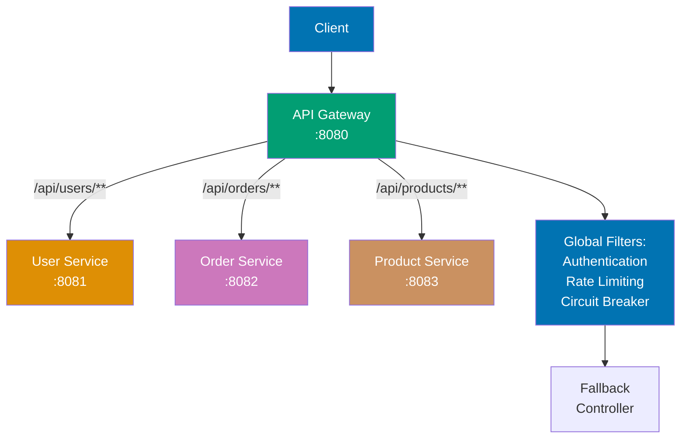

**Code (Kotlin)**:

```kotlin
@Configuration
open class GatewayConfig {
  @Bean
  open fun customRouteLocator(builder: RouteLocatorBuilder): RouteLocator =
    builder.routes()
      .route("user-service") { r -> r.path("/users/**").uri("lb://user-service") }
      .route("order-service") { r -> r.path("/orders/**")
        .filters { f -> f.addRequestHeader("X-Gateway", "CloudGateway") }
        .uri("lb://order-service") }
      .build()
}

@Component
class AuthGatewayFilter : GlobalFilter {
  override fun filter(exchange: ServerWebExchange, chain: GatewayFilterChain): Mono<Void> {
    val token = exchange.request.headers.getFirst("Authorization")
    return if (token != null) chain.filter(exchange)
    else Mono.error(UnauthorizedException())
  }
}

// Kotlin-specific: Use expression body for routes, if-expression for auth check
```

**Key Takeaway**: Spring Cloud Gateway centralizes routing, authentication, rate limiting, and circuit breaking—use predicates for routing logic and filters for cross-cutting concerns across all microservices.

**Why It Matters**: API Gateway consolidates cross-cutting concerns (authentication, rate limiting, circuit breakers) into a single entry point instead of duplicating logic across 50 microservices, reducing security vulnerabilities from inconsistent authentication implementations. Production gateways route 1,000,000+ requests/minute across hundreds of backend services with <10ms latency overhead, implementing dynamic routing (A/B testing, canary releases), request transformation (legacy SOAP to REST conversion), and protocol translation (HTTP to gRPC) without modifying backend services.

---

### Example 63: Event Sourcing Pattern

Implement event sourcing to persist all state changes as events for audit trails and replays.

```java
// Event store
@Entity
// => Annotation applied
public class DomainEvent {
    // => Begins block
    @Id
    // => Annotation applied
    @GeneratedValue
    // => Annotation applied
    private Long id;
    // => Declares id field of type Long

    private String aggregateId;
    // => Declares aggregateId field of type String
    private String eventType;
    // => Declares eventType field of type String
    private String payload; // JSON
    // => Declares JSON field of type String
    private LocalDateTime occurredAt;
    // => Declares occurredAt field of type LocalDateTime
    private int version;
    // => Declares version field of type int

    // getters/setters
}
// => Block delimiter

@Repository
// => Annotation applied
public interface EventStore extends JpaRepository<DomainEvent, Long> {
    // => Begins block
    List<DomainEvent> findByAggregateIdOrderByVersionAsc(String aggregateId);
    // => Executes method
}
// => Block delimiter

// Domain aggregate
public class Order {
    // => Begins block
    private String id;
    // => Declares id field of type String
    private String customerId;
    // => Declares customerId field of type String
    private List<OrderItem> items = new ArrayList<>();
    // => Creates new instance
    private OrderStatus status;
    // => Declares status field of type OrderStatus
    private List<DomainEvent> uncommittedEvents = new ArrayList<>();
    // => Creates new instance

    public void placeOrder(String customerId, List<OrderItem> items) { // => Place new order command
        this.id = UUID.randomUUID().toString(); // => Generate unique order ID
        this.customerId = customerId; // => Associate order with customer
        this.items = items; // => Store order items
        this.status = OrderStatus.PLACED; // => Set initial status
        // => Initializes status with OrderStatus.PLACED //

        raiseEvent(new OrderPlacedEvent(id, customerId, items, LocalDateTime.now())); // => Create event representing state change
        // => Assigns > Create event representing state change to //
    }
    // => Block delimiter

    public void cancelOrder() { // => Cancel order command
        if (status == OrderStatus.SHIPPED) { // => Business rule validation
            throw new IllegalStateException("Cannot cancel shipped order"); // => Reject invalid state transition
            // => Assigns > Reject invalid state transition to //
        }
        // => Block delimiter

        this.status = OrderStatus.CANCELLED; // => Update current state
        raiseEvent(new OrderCancelledEvent(id, LocalDateTime.now())); // => Record cancellation event
        // => Assigns > Record cancellation event to //
    }
    // => Block delimiter

    private void raiseEvent(Object event) { // => Internal event creation
        DomainEvent domainEvent = new DomainEvent(); // => Create event entity
        domainEvent.setAggregateId(id); // => Link event to aggregate (order ID)
        domainEvent.setEventType(event.getClass().getSimpleName()); // => Event type name
        domainEvent.setPayload(toJson(event)); // => Serialize event data to JSON
        domainEvent.setOccurredAt(LocalDateTime.now()); // => Event timestamp
        domainEvent.setVersion(uncommittedEvents.size() + 1); // => Optimistic concurrency version
        // => Assigns > Optimistic concurrency version to //

        uncommittedEvents.add(domainEvent); // => Add to in-memory uncommitted events list
        // => Assigns > Add to in-memory uncommitted events list to //
    }

    public static Order fromEvents(List<DomainEvent> events) { // => Rebuild aggregate from event history
        Order order = new Order(); // => Create empty aggregate
        for (DomainEvent event : events) { // => Replay all events in order
            order.apply(event); // => Apply each event to rebuild state
            // => Assigns > Apply each event to rebuild state to //
        }
        return order; // => Fully reconstructed aggregate
        // => Assigns > Fully reconstructed aggregate to //
    }

    private void apply(DomainEvent event) { // => Apply event to aggregate state
        switch (event.getEventType()) { // => Dispatch based on event type
            case "OrderPlacedEvent" -> { // => Handle order placed event
                OrderPlacedEvent e = fromJson(event.getPayload(), OrderPlacedEvent.class); // => Deserialize event
                this.id = e.orderId(); // => Restore order ID
                this.customerId = e.customerId(); // => Restore customer ID
                this.items = e.items(); // => Restore order items
                this.status = OrderStatus.PLACED; // => Restore status
                // => Initializes status with OrderStatus.PLACED //
            }
            case "OrderCancelledEvent" -> { // => Handle cancellation event
                this.status = OrderStatus.CANCELLED; // => Update status to cancelled
                // => Initializes status with OrderStatus.CANCELLED //
            }
        }
    }

    public List<DomainEvent> getUncommittedEvents() {
    // => Begins block
        return uncommittedEvents;
    // => Returns result
    }
}

// Service
@Service
public class OrderService {
    // => Begins block
    @Autowired
    private EventStore eventStore;
    // => Declares eventStore field of type EventStore

    public void placeOrder(String customerId, List<OrderItem> items) { // => Command handler
        Order order = new Order(); // => Create new aggregate
        order.placeOrder(customerId, items); // => Execute command (generates events)
        // => Assigns > Execute command (generates events) to //

        // => Persist events (not current state)
        eventStore.saveAll(order.getUncommittedEvents()); // => Persist cancellation event // => Save all generated events to event store
        // => Assigns > Persist cancellation event // to //
    }

    public Order getOrder(String orderId) { // => Query handler
        List<DomainEvent> events = eventStore.findByAggregateIdOrderByVersionAsc(orderId); // => Load all events for order
        return Order.fromEvents(events); // => Rebuild aggregate by replaying events (event sourcing pattern)
        // => Assigns > Rebuild aggregate by replaying events (event sourcing pattern) to //
    }

    public void cancelOrder(String orderId) { // => Cancellation command
        Order order = getOrder(orderId); // => Rebuild current state from events
        order.cancelOrder(); // => Execute cancellation (generates OrderCancelledEvent)
        // => Assigns > Execute cancellation (generates OrderCancelledEvent) to //

        eventStore.saveAll(order.getUncommittedEvents()); // => Persist cancellation event
        // => Assigns > Persist cancellation event to //
    }
}

record OrderPlacedEvent(String orderId, String customerId, List<OrderItem> items, LocalDateTime at) {}
    // => Executes method
record OrderCancelledEvent(String orderId, LocalDateTime at) {}
    // => Executes method
record OrderItem(String productId, int quantity, BigDecimal price) {}
    // => Executes method
enum OrderStatus { PLACED, SHIPPED, CANCELLED }
    // => Begins block
```

**Code (Kotlin)**:

```kotlin
sealed class OrderEvent {
  abstract val orderId: String
  abstract val timestamp: LocalDateTime
}

data class OrderCreatedEvent(
  override val orderId: String,
  override val timestamp: LocalDateTime,
  val userId: String,
  val items: List<OrderItem>
) : OrderEvent()

data class OrderCancelledEvent(
  override val orderId: String,
  override val timestamp: LocalDateTime
) : OrderEvent()

@Entity
open class EventStore(
  @Id @GeneratedValue var id: Long? = null,
  var aggregateId: String = "",
  var eventType: String = "",
  var eventData: String = "",
  var timestamp: LocalDateTime = LocalDateTime.now()
)

@Service
class OrderEventService(
  private val eventStoreRepo: EventStoreRepository,
  private val objectMapper: ObjectMapper
) {
  fun saveEvent(event: OrderEvent) {
    val eventStore = EventStore(
      aggregateId = event.orderId,
      eventType = event::class.simpleName ?: "",
      eventData = objectMapper.writeValueAsString(event),
      timestamp = event.timestamp
    )
    eventStoreRepo.save(eventStore)
  }

  fun getEvents(orderId: String): List<OrderEvent> =
    eventStoreRepo.findByAggregateIdOrderByTimestamp(orderId)
      .map { objectMapper.readValue(it.eventData, OrderEvent::class.java) }
}

data class OrderItem(val productId: String, val quantity: Int, val price: BigDecimal)
enum class OrderStatus { PLACED, SHIPPED, CANCELLED }

// Kotlin-specific: Use sealed class for event hierarchy, expression body for getEvents
```

**Key Takeaway**: Event sourcing persists state changes as immutable events—rebuild aggregate state by replaying events, enabling complete audit trails, time travel debugging, and event-driven architectures.

**Why It Matters**: Event sourcing creates complete audit trails where every state change persists as an event, enabling time-travel debugging ("what was order 12345's state at 2pm?") and regulatory compliance (financial audit trails). Production event-sourced systems at banks and healthcare providers use event replay to recover from bugs that corrupted current state by rebuilding from historical events, and support complex business intelligence queries ("how many users cancelled after payment failure?") that current-state-only systems cannot answer.

---

### Example 64: CQRS Pattern - Command Query Responsibility Segregation

Separate read and write models for scalability and different optimization strategies.

```java
// Command model (write side)
@Entity  // => JPA entity for write operations
@Table(name = "orders_write")  // => Dedicated table for write model (separate from read model)
public class OrderWriteModel {  // => Optimized for INSERTS/UPDATES (normalized schema)
    @Id  // => Primary key
    private String id;  // => Order ID (UUID)
    private String customerId;  // => Customer reference (minimal data)
    private BigDecimal totalAmount;  // => Order total
    private OrderStatus status;  // => Order state (PLACED, SHIPPED, CANCELLED)
    private LocalDateTime createdAt;  // => Creation timestamp
    // Optimized for writes: minimal fields, normalized schema
    // => No joins, fast writes, referential integrity
}

@Repository  // => Spring Data JPA repository for command operations
public interface OrderCommandRepository extends JpaRepository<OrderWriteModel, String> {
    // => Begins block
    // => Inherits save(), saveAll(), delete() methods for write operations
    // => No complex queries - write model focused on data integrity
}

// Query model (read side)
@Entity  // => JPA entity for read operations
@Table(name = "orders_read")  // => Separate table from write model (can be different database)
public class OrderReadModel {  // => Optimized for SELECT queries (denormalized, no joins)
    @Id  // => Primary key (matches write model ID for correlation)
    private String id;  // => Order ID
    private String customerName;  // => Denormalized customer data (from separate Customer table)
    private String customerEmail;  // => Denormalized email (avoids JOIN with Customer table)
    private BigDecimal totalAmount;  // => Order total
    private int itemCount;  // => Denormalized item count (computed aggregate)
    private OrderStatus status;  // => Order state
    private LocalDateTime createdAt;  // => Creation timestamp
    // Denormalized, optimized for reads: duplicates data to avoid JOINs
    // => Fast queries, no foreign keys, eventual consistency with write model
}

@Repository  // => Spring Data JPA repository for query operations
public interface OrderQueryRepository extends JpaRepository<OrderReadModel, String> {
    // => Begins block
    List<OrderReadModel> findByCustomerNameContaining(String name);  // => Search by customer name (no JOIN needed)
                                                                      // => Fast query using denormalized data
    List<OrderReadModel> findByStatusAndCreatedAtAfter(OrderStatus status, LocalDateTime after);  // => Recent orders by status
                                                                                                    // => Single table query (no JOINs)
}

// Command service (write operations)
@Service  // => Service for write operations (commands)
public class OrderCommandService {  // => Handles state-changing commands
    @Autowired  // => Inject write repository
    private OrderCommandRepository commandRepo;  // => Repository for write model persistence

    @Autowired  // => Inject event publisher
    private ApplicationEventPublisher eventPublisher;  // => Publishes domain events to synchronize read model

    @Transactional  // => Ensure atomicity (save order + publish event in single transaction)
                     // => Rollback if event publishing fails
    public String createOrder(CreateOrderCommand command) {  // => Create new order command handler
        OrderWriteModel order = new OrderWriteModel();  // => Create new write model entity
        order.setId(UUID.randomUUID().toString());  // => Generate unique order ID
        order.setCustomerId(command.customerId());  // => Set customer reference
        order.setTotalAmount(command.totalAmount());  // => Set total amount
        order.setStatus(OrderStatus.PLACED);  // => Initial order status
        order.setCreatedAt(LocalDateTime.now());  // => Set creation timestamp

        commandRepo.save(order);  // => Persist to write database (normalized schema)
                                   // => Write model updated immediately

        // Publish event for read model update
        eventPublisher.publishEvent(new OrderCreatedEvent(  // => Publish domain event
            order.getId(),  // => Order ID for event correlation
            order.getCustomerId(),  // => Customer ID for denormalization
            order.getTotalAmount()  // => Total amount for read model
        ));  // => Event triggers async read model update (eventual consistency)

        return order.getId();  // => Return order ID to caller
    }
}

// Query service (read operations)
@Service  // => Service for read operations (queries)
public class OrderQueryService {  // => Handles queries against read model
    @Autowired  // => Inject read repository
    private OrderQueryRepository queryRepo;  // => Repository for denormalized read model

    public List<OrderReadModel> searchOrders(String customerName) {  // => Search by customer name
        return queryRepo.findByCustomerNameContaining(customerName);  // => Query denormalized data (no JOIN)
                                                                       // => Fast query with indexed customer name
    }

    public List<OrderReadModel> getRecentOrders(OrderStatus status, int days) {  // => Get recent orders by status
        LocalDateTime since = LocalDateTime.now().minusDays(days);  // => Calculate cutoff date
        return queryRepo.findByStatusAndCreatedAtAfter(status, since);  // => Single table query (denormalized)
                                                                         // => Indexed by status + createdAt
    }
}

// Event handler to synchronize read model
@Component  // => Spring-managed component
public class OrderReadModelUpdater {  // => Synchronizes read model with write model via events
    @Autowired  // => Inject read repository
    private OrderQueryRepository queryRepo;  // => Repository for read model updates

    @Autowired  // => Inject customer repository
    private CustomerRepository customerRepo;  // => Repository to fetch customer details for denormalization

    @EventListener  // => Listen for domain events
    @Async  // => Process event asynchronously (eventual consistency)
             // => Write model commits immediately, read model updates later
    public void handleOrderCreated(OrderCreatedEvent event) {  // => Handle OrderCreatedEvent
        Customer customer = customerRepo.findById(event.customerId()).orElseThrow();  // => Fetch customer details for denormalization

        OrderReadModel readModel = new OrderReadModel();  // => Create denormalized read model
        readModel.setId(event.orderId());  // => Set order ID (matches write model)
        readModel.setCustomerName(customer.getName());  // => Denormalize customer name (avoid JOIN)
        readModel.setCustomerEmail(customer.getEmail());  // => Denormalize email (avoid JOIN)
        readModel.setTotalAmount(event.totalAmount());  // => Copy total amount from event
        readModel.setItemCount(event.itemCount());  // => Copy item count (computed aggregate)
        readModel.setStatus(OrderStatus.PLACED);  // => Initial status
        readModel.setCreatedAt(LocalDateTime.now());  // => Set creation timestamp

        queryRepo.save(readModel);  // => Persist denormalized read model
        // Read model updated asynchronously (eventual consistency)
        // => Small delay between write and read model consistency
    }
}

record CreateOrderCommand(String customerId, BigDecimal totalAmount) {}
    // => Executes method
record OrderCreatedEvent(String orderId, String customerId, BigDecimal totalAmount) {}
    // => Executes method
```

**Code (Kotlin)**:

```kotlin
// Command side
data class CreateOrderCommand(val userId: String, val items: List<OrderItem>)

@Service
class OrderCommandService(
  private val orderRepo: OrderRepository,
  private val eventPublisher: ApplicationEventPublisher
) {
  @Transactional
  fun createOrder(command: CreateOrderCommand): Order {
    val order = Order(userId = command.userId, items = command.items)
    orderRepo.save(order)
    eventPublisher.publishEvent(OrderCreatedEvent(order.id!!, LocalDateTime.now()))
    return order
  }
}

// Query side
data class OrderSummary(val orderId: String, val userId: String, val totalAmount: BigDecimal, val itemCount: Int)

@Service
class OrderQueryService(private val orderSummaryRepo: OrderSummaryRepository) {
  fun getOrderSummary(orderId: String): OrderSummary? =
    orderSummaryRepo.findById(orderId).orElse(null)

  fun getUserOrders(userId: String): List<OrderSummary> =
    orderSummaryRepo.findByUserId(userId)
}

@Component
class OrderEventHandler(private val orderSummaryRepo: OrderSummaryRepository) {
  @EventListener
  fun handleOrderCreated(event: OrderCreatedEvent) {
    val summary = OrderSummary(event.orderId, event.userId, event.totalAmount, event.items.size)
    orderSummaryRepo.save(summary)
  }
}

// Kotlin-specific: Use data classes for commands/queries, expression body, nullable return
```

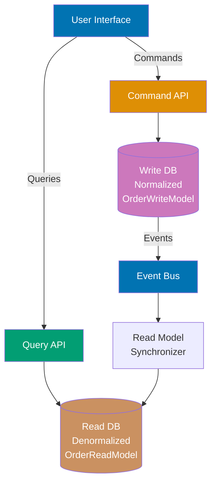

**Key Takeaway**: CQRS separates write (command) and read (query) models—optimize writes for consistency and reads for performance with denormalized data, synchronizing via events for eventual consistency.

**Why It Matters**: CQRS enables independent scaling where write models optimize for consistency (normalized schema, transaction boundaries) while read models optimize for query performance (denormalized views, caching), achieving 10x throughput improvement for read-heavy workloads. Production systems use CQRS for reporting dashboards that query denormalized read models built from events, preventing slow analytical queries (multi-table joins, aggregations) from impacting write performance, with eventual consistency allowing read models to lag behind writes by seconds while maintaining system responsiveness.

---

### Example 65: Multi-Tenancy Strategies

Implement multi-tenancy to serve multiple customers from a single application instance.

```java
// Strategy 1: Shared Database, Separate Schemas (schema-per-tenant isolation)
@Configuration // => Spring configuration for multi-tenant data source routing
public class MultiTenantDataSourceConfig { // => Configures tenant-aware data source switching
    @Bean // => Registers DataSource bean that routes to different schemas based on tenant
    public DataSource dataSource() { // => Returns routing data source implementation
        return new TenantAwareDataSource(); // => Custom data source that switches schemas per request
        // => Single connection pool, multiple schemas (tenant_1, tenant_2, etc.)
    }
}

public class TenantAwareDataSource extends AbstractRoutingDataSource {
    // => AbstractRoutingDataSource: Spring's dynamic data source routing mechanism
    // => Routes each database connection to different target based on lookup key
    @Override // => Override to provide tenant-specific routing key
    protected Object determineCurrentLookupKey() { // => Called for each database operation
        return TenantContext.getCurrentTenant(); // => Returns current tenant ID from ThreadLocal
        // => Returns "tenant1", "tenant2", etc. (determines which schema to use)
        // => Example: tenant1 → uses schema "tenant_1", tenant2 → uses schema "tenant_2"
        // => Queries automatically prefixed: SELECT * FROM tenant_1.products
    }
}

@Component // => Spring-managed bean for tenant context management
public class TenantContext { // => Thread-safe tenant ID storage using ThreadLocal
    private static final ThreadLocal<String> CURRENT_TENANT = new ThreadLocal<>();
    // => ThreadLocal: Each HTTP request thread has isolated tenant ID
    // => Prevents tenant data leaking between concurrent requests
    // => Example: Request A (tenant1) and Request B (tenant2) execute simultaneously without interference

    public static void setCurrentTenant(String tenant) { // => Sets tenant ID for current request thread
        CURRENT_TENANT.set(tenant); // => Stores tenant ID in thread-local storage
        // => Called by TenantInterceptor after extracting X-Tenant-ID header
    }

    public static String getCurrentTenant() { // => Retrieves tenant ID for current request thread
        return CURRENT_TENANT.get(); // => Returns tenant ID (e.g., "tenant1")
        // => Used by TenantAwareDataSource to route database queries
    }

    public static void clear() { // => Removes tenant ID from thread-local storage
        CURRENT_TENANT.remove(); // => Prevents memory leaks in thread pools
        // => Called after request completes (in TenantInterceptor.afterCompletion)
    }
}

// Tenant interceptor (extracts tenant ID from HTTP header)
@Component // => Spring-managed interceptor bean
public class TenantInterceptor implements HandlerInterceptor {
    // => HandlerInterceptor: intercepts HTTP requests before/after controller execution
    // => Executes for every incoming HTTP request
    @Override // => Executes BEFORE controller method
    public boolean preHandle(HttpServletRequest request, HttpServletResponse response, Object handler) {
        // => Extracts tenant ID from request and sets in ThreadLocal
        String tenantId = request.getHeader("X-Tenant-ID"); // => Read custom header: X-Tenant-ID
        // => Client must send header: X-Tenant-ID: tenant1
        // => Example: curl -H "X-Tenant-ID: tenant1" http://localhost:8080/api/products

        if (tenantId == null) { // => Validate tenant ID presence (required for all requests)
            response.setStatus(HttpServletResponse.SC_BAD_REQUEST); // => Return 400 Bad Request
            return false; // => Stop request processing (controller not invoked)
            // => Security: prevents untenanted access (no default tenant allowed)
        }

        TenantContext.setCurrentTenant(tenantId); // => Store tenant ID in ThreadLocal for this request
        // => Makes tenant ID available to TenantAwareDataSource during database queries
        return true; // => Continue to controller (tenant context initialized)
    }

    @Override // => Executes AFTER controller completes (even if exception thrown)
    public void afterCompletion(HttpServletRequest request, HttpServletResponse response,
                               Object handler, Exception ex) {
        // => Cleanup: remove tenant ID from ThreadLocal
        TenantContext.clear(); // => Prevents memory leak in thread pool
        // => Critical: thread pools reuse threads, must clear tenant ID after each request
        // => Without this: tenant1 request might see tenant2 data on thread reuse!
    }
}

// Strategy 2: Discriminator Column (Shared Schema - all tenants in same table)
@Entity // => JPA entity for products table (shared across all tenants)
@FilterDef(name = "tenantFilter", parameters = @ParamDef(name = "tenantId", type = String.class))
// => Defines Hibernate filter with parameter (applied at query time, not compile time)
// => Filter name: "tenantFilter", parameter: tenantId (String type)
@Filter(name = "tenantFilter", condition = "tenant_id = :tenantId")
// => Applies filter condition to all queries: WHERE tenant_id = :tenantId
// => Automatically added to SELECT/UPDATE/DELETE queries for this entity
// => Prevents tenant1 from accessing tenant2 data (application-level row security)
public class Product { // => Product entity with tenant discriminator column
    @Id // => Primary key
    @GeneratedValue // => Auto-generated ID (sequence or identity)
    private Long id; // => Product ID (unique across all tenants)

    private String tenantId; // Discriminator column (identifies which tenant owns this row)
    // => Example values: "tenant1", "tenant2", "tenant3"
    // => Must be set explicitly when creating product
    // => Index this column for query performance!
    private String name; // => Product name (e.g., "Laptop", "Phone")
    private BigDecimal price; // => Product price (e.g., 999.99)

    // getters/setters (omitted for brevity)
}

@Repository // => Spring Data JPA repository
public interface ProductRepository extends JpaRepository<Product, Long> {
    // => Automatically filtered by tenant when tenantFilter enabled
    // => findAll() executes: SELECT * FROM product WHERE tenant_id = 'tenant1'
    // => No manual filtering needed - Hibernate filter handles it transparently
}

// Enable filter in session (AOP aspect intercepts all repository calls)
@Component // => Spring-managed AOP aspect
@Aspect // => Aspect-Oriented Programming: cross-cutting concern (tenant filtering)
public class TenantFilterAspect { // => Automatically enables Hibernate tenant filter before repository calls
    @PersistenceContext // => Inject JPA EntityManager
    private EntityManager entityManager; // => Used to access Hibernate Session

    @Before("execution(* com.example.demo.repository.*.*(..))") // => Pointcut: intercept ALL repository method calls
    // => Executes BEFORE every repository method (findAll, save, findById, etc.)
    public void enableTenantFilter() { // => Enables Hibernate filter with current tenant ID
        String tenantId = TenantContext.getCurrentTenant(); // => Get tenant ID from ThreadLocal (set by TenantInterceptor)
        // => Example: tenantId = "tenant1"
        Session session = entityManager.unwrap(Session.class); // => Get Hibernate Session from JPA EntityManager
        // => Unwrap: JPA EntityManager → Hibernate Session (access Hibernate-specific features)
        Filter filter = session.enableFilter("tenantFilter"); // => Enable "tenantFilter" defined on Product entity
        // => Must be enabled per session (not persistent across requests)
        filter.setParameter("tenantId", tenantId); // => Set :tenantId parameter in filter condition
        // => Results in WHERE clause: WHERE tenant_id = 'tenant1'
        // => All subsequent queries in this session filtered to current tenant
    }
}

// Usage in controller (tenant filtering transparent to controller logic)
@RestController // => REST controller with automatic JSON serialization
@RequestMapping("/api/products") // => Base path: /api/products
public class ProductController { // => Product CRUD operations with automatic tenant filtering
    @Autowired // => Inject ProductRepository
    private ProductRepository productRepository; // => Repository with automatic tenant filtering

    @GetMapping // => Endpoint: GET /api/products
    public List<Product> getProducts() { // => Fetch all products for current tenant
        // => TenantFilterAspect intercepts this call, enables Hibernate filter
        // => Automatically filtered by tenant from X-Tenant-ID header
        return productRepository.findAll(); // => Executes: SELECT * FROM product WHERE tenant_id = 'tenant1'
        // => Returns only current tenant's products (tenant2 data invisible)
        // => No manual filtering needed - Hibernate filter handles it transparently
    }

    @PostMapping // => Endpoint: POST /api/products
    public Product createProduct(@RequestBody Product product) { // => Create new product for current tenant
        product.setTenantId(TenantContext.getCurrentTenant()); // => Set tenant ID explicitly (must set before save!)
        // => Critical: Without this, product saved without tenant_id (security violation!)
        // => Example: tenant ID = "tenant1" → product.tenant_id = "tenant1"
        return productRepository.save(product); // => Persists product with tenant_id column
        // => INSERT INTO product (name, price, tenant_id) VALUES (?, ?, 'tenant1')
        // => Future queries by tenant1 will include this product
    }
}
```

**Code (Kotlin)**:

```kotlin
@Component  // => Spring-managed bean for tenant context
class TenantContext {  // => Thread-safe tenant ID storage using Kotlin companion object
  companion object {  // => Kotlin's static member equivalent (singleton within class)
    private val tenantId = ThreadLocal<String>()  // => ThreadLocal for request isolation
    // => Each HTTP request thread has isolated tenant ID
    // => Prevents tenant data leaking between concurrent requests

    fun setTenantId(id: String) = tenantId.set(id)  // => Expression body (single-line function)
    // => Sets tenant ID for current request thread
    // => Called by TenantFilter after extracting X-Tenant-ID header

    fun getTenantId(): String = tenantId.get() ?: "default"  // => Elvis operator: return "default" if null
    // => Retrieves tenant ID for current request thread
    // => Used by MultiTenantHikariDataSource to route database queries

    fun clear() = tenantId.remove()  // => Expression body for cleanup
    // => Removes tenant ID from thread-local storage (prevents memory leaks)
    // => Called after request completes in TenantFilter.doFilter finally block
  }
}

@Component  // => Spring Filter bean (alternative to HandlerInterceptor)
@Order(1)  // => Execute first in filter chain (before security filters)
class TenantFilter : Filter {  // => Servlet Filter interface for tenant ID extraction
  override fun doFilter(request: ServletRequest, response: ServletResponse, chain: FilterChain) {
    // => Executes for every HTTP request (before controller)
    val tenantId = (request as HttpServletRequest).getHeader("X-Tenant-ID") ?: "default"
    // => Smart cast: ServletRequest → HttpServletRequest
    // => Elvis operator: use "default" if X-Tenant-ID header missing
    // => Example: Header "X-Tenant-ID: tenant1" → tenantId = "tenant1"
    TenantContext.setTenantId(tenantId)  // => Store tenant ID in ThreadLocal
    try {
      chain.doFilter(request, response)  // => Continue filter chain and invoke controller
      // => All database queries use this tenant ID during controller execution
    }
    finally {
      TenantContext.clear()  // => Cleanup: remove tenant ID from ThreadLocal
      // => Critical: prevents memory leak in thread pools (thread reuse)
      // => Finally block: executes even if exception thrown during request processing
    }
  }
}

abstract class MultiTenantHikariDataSource : HikariDataSource() {
  // => Extends HikariCP connection pool for schema-per-tenant routing
  // => Abstract: must be extended with tenant-specific schema mapping configuration
  override fun getConnection(): Connection {  // => Intercept connection acquisition
    val tenantId = TenantContext.getTenantId()  // => Get tenant ID from ThreadLocal
    // => Example: tenantId = "tenant1"
    schema = "tenant_$tenantId"  // => Set schema on connection (HikariCP property)
    // => Example: schema = "tenant_tenant1" → all queries use this schema
    // => PostgreSQL: SET search_path TO tenant_tenant1
    return super.getConnection()  // => Return connection with schema set
    // => All queries on this connection automatically prefixed: SELECT * FROM tenant_tenant1.products
  }
}

// Kotlin-specific: Use companion object for ThreadLocal (static members), expression body for single-line functions
// => companion object: singleton within class (like Java static members but more powerful)
// => Expression body (= syntax): concise for single-expression functions
// => Elvis operator (?:): null safety with default values
// => Smart cast: automatic type conversion after type check (as HttpServletRequest)
```

**Key Takeaway**: Choose multi-tenancy strategy based on isolation needs—separate databases for strong isolation, separate schemas for moderate isolation, or discriminator columns for maximum resource sharing with application-level filtering.

**Why It Matters**: Multi-tenancy enables SaaS applications to serve thousands of customers from a single application instance, reducing infrastructure costs by 80% compared to per-customer deployments. Production multi-tenant SaaS platforms choose tenant isolation strategy based on requirements—shared schema with discriminator column for maximum efficiency (10,000+ tenants per instance), separate schemas for data isolation without separate databases (100-1000 tenants), or separate databases for strict compliance requirements (healthcare, finance), balancing cost against security and regulatory requirements.

---

### Example 66: Spring Native - GraalVM Native Images

Compile Spring Boot applications to native executables for faster startup and lower memory footprint.

```java
// Standard Spring Boot application
@SpringBootApplication // => Enables auto-configuration, component scanning, and configuration properties
public class NativeApplication { // => Main application class (works identically in JVM and native modes)
    public static void main(String[] args) { // => Application entry point
        SpringApplication.run(NativeApplication.class, args); // => Bootstraps Spring Boot application
        // => In native mode: instant startup (~50ms), in JVM mode: slower startup (~2000ms)
    }

    @Bean // => Registers CommandLineRunner bean that executes after application startup
    public CommandLineRunner runner() { // => Demonstrates startup time measurement
        return args -> { // => Lambda executed once after context initialization
        // => Returns args -> { // => Lambda executed once after context initialization
            System.out.println("Native application started in: " +
            // => Console output
                ManagementFactory.getRuntimeMXBean().getUptime() + "ms");
    // => Executes method
            // => JVM: ~2000ms startup, Native: ~50ms startup (40x faster)
            // => Prints actual measured startup time to console
        };
    }
}

@RestController // => Enables REST endpoints with automatic JSON serialization
@RequestMapping("/api/native") // => Base path for all endpoints in this controller
public class NativeController { // => Exposes runtime information endpoint
    @GetMapping("/info") // => Endpoint: GET /api/native/info
    public Map<String, Object> getInfo() { // => Returns runtime metrics as JSON
        return Map.of( // => Creates immutable map with runtime information
            "runtime", System.getProperty("java.vm.name"), // => VM name (e.g., "Substrate VM" for native, "OpenJDK 64-Bit Server VM" for JVM)
            "memoryUsed", Runtime.getRuntime().totalMemory() - Runtime.getRuntime().freeMemory(), // => Current memory usage in bytes
            // => Native: ~10-50MB memory usage, JVM: ~100-200MB memory usage (10x reduction)
            "startupTime", ManagementFactory.getRuntimeMXBean().getUptime() // => Milliseconds since application start
            // => Native: ~50ms, JVM: ~2000ms
        );
        // => Response example: {"runtime": "Substrate VM", "memoryUsed": 15728640, "startupTime": 52}
    }
}
```

```xml
<!-- pom.xml -->
<dependencies>
    <dependency>
        <groupId>org.springframework.boot</groupId>
        <artifactId>spring-boot-starter-web</artifactId>
        <!-- => Standard Spring Boot web dependency (works in both JVM and native modes) -->
    </dependency>
</dependencies>

<build>
    <plugins>
        <plugin>
            <groupId>org.graalvm.buildtools</groupId>
            <artifactId>native-maven-plugin</artifactId>
            <!-- => GraalVM native image compilation plugin -->
            <!-- => Analyzes application at build time, compiles to native binary -->
        </plugin>
        <plugin>
            <groupId>org.springframework.boot</groupId>
            <artifactId>spring-boot-maven-plugin</artifactId>
            <!-- => Spring Boot build plugin with native image support -->
            <configuration>
                <image>
                    <builder>paketobuildpacks/builder-jammy-tiny:latest</builder>
                    <!-- => Paketo buildpack for native image compilation in Docker -->
                    <!-- => Ubuntu Jammy base with minimal dependencies -->
                    <env>
                        <BP_NATIVE_IMAGE>true</BP_NATIVE_IMAGE>
                        <!-- => Environment variable: enables native image build -->
                        <!-- => Without this, builds standard JVM Docker image -->
                    </env>
                </image>
            </configuration>
        </plugin>
    </plugins>
</build>
```

```bash
# Build native image (local compilation)
./mvnw -Pnative native:compile
# => Activates 'native' profile, compiles to native executable
# => Build time: 5-10 minutes (analyzes entire classpath at compile time)
# => Output: ./target/myapp (standalone executable, no JVM required)

# Or with Docker (recommended for reproducible builds)
./mvnw spring-boot:build-image -Pnative
# => Builds native image inside Docker container using Paketo buildpacks
# => Ensures consistent build environment across different machines
# => Output: Docker image with native executable

# Run native executable
./target/myapp
# => Launches application instantly without JVM startup overhead
# => No classloading, no JIT compilation, no warmup period

# Startup comparison:
# JVM:    ~2000ms startup, ~200MB RAM (includes JVM overhead)
# Native: ~50ms startup,   ~20MB RAM (40x faster startup, 10x less memory)
# => Native image trades build time (10 minutes) for runtime performance
```

```yaml
# application.yml - Optimize for native image compilation
spring:
  aot:
    enabled: true
    # => Ahead-Of-Time compilation mode (analyzes beans at build time, not runtime)
    # => Generates optimized initialization code during native image build
    # => Required for native image support (reduces runtime reflection)
  main:
    lazy-initialization: true
    # => Defers bean initialization until first use (reduces startup time)
    # => In native mode: further reduces memory footprint
    # => Trade-off: first request slower, but instant application start
```

**Code (Kotlin)**:

```kotlin
// build.gradle.kts
plugins {
  id("org.springframework.boot") version "3.2.0"  // => Spring Boot Gradle plugin
  id("org.graalvm.buildtools.native") version "0.9.28"  // => GraalVM native image plugin for Gradle
  // => Provides nativeCompile task for building native executables
  kotlin("jvm") version "1.9.21"  // => Kotlin JVM compiler plugin
  kotlin("plugin.spring") version "1.9.21"  // => Kotlin Spring plugin (makes classes open for proxying)
  // => Required for Spring's CGLIB proxies in Kotlin (classes are final by default)
}

@SpringBootApplication  // => Enables auto-configuration, component scanning, and configuration
open class NativeApplication  // => Must be 'open' for Spring CGLIB proxies
// => In native mode: Spring AOT processes this at build time

fun main(args: Array<String>) {  // => Application entry point
  runApplication<NativeApplication>(*args)  // => Kotlin extension function for SpringApplication.run
  // => Starts Spring Boot application (instant in native mode)
}

@RestController  // => REST controller with automatic JSON serialization
class HelloController {  // => Simple endpoint demonstrating native image functionality
  @GetMapping("/hello")  // => Endpoint: GET /hello
  fun hello() = "Hello from Native Image!"  // => Expression body (single-line function)
  // => Returns plain text response
  // => In native mode: no warmup, instant first response
}

// Build: ./gradlew nativeCompile
// => Compiles to native executable in build/native/nativeCompile/
// Startup: 0.05s vs 2s JVM (40x faster), Memory: 20MB vs 200MB JVM (10x reduction)
// => Native image ideal for serverless functions (AWS Lambda, Google Cloud Functions)

// Kotlin-specific: Same Gradle Native plugin configuration as Java
// => Kotlin code compiles to same bytecode, native image process identical
// => Kotlin's 'open' keyword required for Spring proxies (Java doesn't need this)
```

**Key Takeaway**: GraalVM native images provide instant startup (~50ms vs ~2s) and minimal memory footprint (~20MB vs ~200MB)—ideal for serverless, containers, and microservices, but with longer build times and reflection/proxy limitations.

**Why It Matters**: GraalVM native images compile Spring Boot applications to native executables with instant startup (50ms vs 2000ms JVM) and minimal memory footprint (20MB vs 200MB), enabling serverless deployments where cold start time directly impacts user experience. Production serverless functions (AWS Lambda, Google Cloud Functions) use native images to achieve sub-100ms cold starts that feel instant to users, while Kubernetes deployments benefit from 10x faster pod startup during autoscaling events, reducing time to handle traffic spikes from minutes (waiting for JVM warmup) to seconds.

---

### Example 67: GraphQL API with Spring for GraphQL

Expose flexible GraphQL APIs for efficient data fetching.

```java
// pom.xml: spring-boot-starter-graphql
// => Includes GraphQL Java implementation, Spring GraphQL integration, and GraphiQL UI

// Domain model
@Entity // => JPA entity persisted to database
public class Author { // => Represents author with one-to-many relationship to books
    @Id // => Primary key field
    @GeneratedValue // => Auto-generated ID (database sequence or identity column)
    private Long id; // => Author ID (e.g., 1, 2, 3...)
    private String name; // => Author name (e.g., "Martin Fowler")

    @OneToMany(mappedBy = "author") // => One author has many books
    // => mappedBy: "author" field in Book entity owns the relationship
    // => Lazy-loaded by default (books fetched only when accessed)
    private List<Book> books; // => List of books written by this author

    // getters/setters (omitted for brevity)
}

@Entity // => JPA entity for books table
public class Book { // => Represents book with many-to-one relationship to author
    @Id // => Primary key
    @GeneratedValue // => Auto-generated book ID
    private Long id; // => Book ID (e.g., 1, 2, 3...)
    private String title; // => Book title (e.g., "Refactoring")
    private int pages; // => Number of pages (e.g., 450)

    @ManyToOne // => Many books belong to one author
    @JoinColumn(name = "author_id") // => Foreign key column: author_id references authors table
    // => Eager-loaded by default (author fetched with book)
    private Author author; // => Author who wrote this book

    // getters/setters (omitted for brevity)
}

// GraphQL schema (schema.graphqls in resources/graphql/)
// type Query {
//     bookById(id: ID!): Book
//     books: [Book]
//     authors: [Author]
// }
//
// type Mutation {
//     createBook(title: String!, pages: Int!, authorId: ID!): Book
// }
//
// type Book {
//     id: ID!
//     title: String!
//     pages: Int!
//     author: Author
// }
//
// type Author {
//     id: ID!
//     name: String!
//     books: [Book]
// }

// Controller (Query resolvers)
@Controller // => GraphQL controller (not @RestController - handles GraphQL requests, not REST)
public class BookController { // => Contains query and mutation resolvers for GraphQL schema
    @Autowired // => Inject BookRepository for database operations
    private BookRepository bookRepository; // => JPA repository for Book entity

    @Autowired // => Inject AuthorRepository for database operations
    private AuthorRepository authorRepository; // => JPA repository for Author entity

    @QueryMapping // => Maps to "bookById" query in GraphQL schema (method name matches schema field)
    public Book bookById(@Argument Long id) { // => @Argument binds GraphQL argument "id" to parameter
        return bookRepository.findById(id).orElse(null); // => Fetches book by ID, returns null if not found
        // => Resolves Query.bookById(id: ID!): Book
        // => GraphQL query: { bookById(id: 1) { title } }
    }

    @QueryMapping // => Maps to "books" query in GraphQL schema
    public List<Book> books() { // => Returns all books (no arguments)
        return bookRepository.findAll(); // => Fetches all books from database
        // => Resolves Query.books: [Book]
        // => GraphQL query: { books { id title pages } }
    }

    @QueryMapping // => Maps to "authors" query in GraphQL schema
    public List<Author> authors() { // => Returns all authors
        return authorRepository.findAll(); // => Fetches all authors from database
        // => Resolves Query.authors: [Author]
        // => GraphQL query: { authors { id name books { title } } }
    }

    @MutationMapping // => Maps to "createBook" mutation in GraphQL schema
    public Book createBook(@Argument String title, @Argument int pages, @Argument Long authorId) {
        // => @Argument binds GraphQL arguments (title, pages, authorId) to parameters
        Author author = authorRepository.findById(authorId).orElseThrow(); // => Fetch author by ID, throw exception if not found
        // => Ensures author exists before creating book (referential integrity)

        Book book = new Book(); // => Create new Book instance
        book.setTitle(title); // => Set title from GraphQL argument
        book.setPages(pages); // => Set pages from GraphQL argument
        book.setAuthor(author); // => Set author relationship (foreign key)

        return bookRepository.save(book); // => Persist book to database, returns saved book with generated ID
        // => Resolves Mutation.createBook(title: String!, pages: Int!, authorId: ID!): Book
        // => GraphQL mutation: mutation { createBook(title: "Spring Boot", pages: 500, authorId: 1) { id title } }
    }

    @SchemaMapping(typeName = "Book", field = "author") // => Custom field resolver for Book.author
    // => Called when GraphQL query requests { books { author { name } } }
    public Author getAuthor(Book book) { // => Resolves nested author field for each book
        return book.getAuthor(); // => Fetches author for this specific book
        // => Resolves Book.author field
        // => WARNING: N+1 query problem! If fetching 100 books, this executes 1 + 100 = 101 queries
        // => Solution: Use DataLoader for batch loading (see below)
    }
}

// Optimize N+1 with DataLoader (batch loading pattern)
@Configuration // => Spring configuration class for GraphQL DataLoader
public class DataLoaderConfig { // => Configures batch loading to prevent N+1 query problem
    @Bean // => Registers BatchLoaderRegistry bean
    public BatchLoaderRegistry batchLoaderRegistry(AuthorRepository authorRepository) {
        // => Inject AuthorRepository for batch fetching authors
        return registry -> registry.forTypePair(Long.class, Author.class)
            // => Register batch loader for (Long authorId → Author) mapping
            .registerBatchLoader((authorIds, env) -> {
                // => Batch loader receives list of author IDs collected during GraphQL query execution
                // => Instead of N queries (one per book), executes 1 query with WHERE id IN (1, 2, 3...)
                List<Author> authors = authorRepository.findAllById(authorIds);
                // => Fetches all authors in single query: SELECT * FROM authors WHERE id IN (?)
                // => Example: authorIds = [1, 2, 3] → fetches 3 authors in 1 query
                return Mono.just(authors); // Batch load authors (reactive wrapper for GraphQL execution)
                // => Returns reactive publisher containing list of authors
                // => GraphQL framework maps authors back to their corresponding books automatically
                // => Performance: 100 books → 2 queries (1 for books, 1 for authors) instead of 101 queries
            });
    }
}
```

```graphql
# Query example - Fetch all books with nested author data
query {
  books {
    # => Calls bookController.books() resolver
    id # => Book ID (returned from database)
    title # => Book title
    pages # => Number of pages
    author {
      # => Nested author object (triggers Book.author field resolver)
      # => Without DataLoader: N+1 query problem (1 query for books + N queries for authors)
      # => With DataLoader: 2 queries total (1 for books, 1 batched query for all authors)
      name # => Author name
    }
  }
}
# => Response: [
#      {"id": "1", "title": "Refactoring", "pages": 450, "author": {"name": "Martin Fowler"}},
#      {"id": "2", "title": "Clean Code", "pages": 464, "author": {"name": "Robert C. Martin"}}
#    ]

# Mutation example - Create new book and return result with author
mutation {
  createBook(title: "Spring Boot Guide", pages: 500, authorId: 1) {
    # => Calls bookController.createBook() resolver with arguments
    # => Validates authorId exists, creates book, persists to database
    id # => Generated book ID (returned after save)
    title # => Echoes back the title we just created
    author {
      # => Nested author object for the book we created
      name # => Author name (fetched from database by authorId)
    }
  }
}
# => Response: {"id": "3", "title": "Spring Boot Guide", "author": {"name": "Martin Fowler"}}
# => Benefit: Single request creates book and returns complete object graph (book + author)
# => REST equivalent: POST /books → GET /books/3 → GET /authors/1 (3 requests vs 1 GraphQL mutation)
```

```mermaid
%% Color Palette: Blue #0173B2, Orange #DE8F05, Teal #029E73, Purple #CC78BC, Brown #CA9161
graph TD
    Client[GraphQL Client] -->|Query/Mutation| Gateway[GraphQL Endpoint<br/>/graphql]

    Gateway --> Resolver[Resolver<br/>@QueryMapping<br/>@MutationMapping]

    Resolver --> Repo1[BookRepository]
    Resolver --> Repo2[AuthorRepository]

    Repo1 --> DB[(Database)]
    Repo2 --> DB

    Loader[DataLoader<br/>Batch Loading] -.->|Prevents N+1| Resolver

    style Client fill:#0173B2,color:#fff
    style Gateway fill:#029E73,color:#fff
    style Resolver fill:#DE8F05,color:#fff
    style Repo1 fill:#CC78BC,color:#fff
    style Repo2 fill:#CA9161,color:#fff
    style DB fill:#0173B2,color:#fff
```

**Code (Kotlin)**:

```kotlin
// GraphQL Schema (same for Java/Kotlin): src/main/resources/graphql/schema.graphqls
// type Query {
//   bookById(id: ID!): Book
//   allBooks: [Book]
// }
// type Mutation {
//   createBook(title: String!, authorId: ID!): Book
// }
// type Book {
//   id: ID!
//   title: String!
//   author: Author
// }
// type Author {
//   id: ID!
//   name: String!
//   books: [Book]
// }

// Data classes for GraphQL types
// Kotlin data classes provide concise value objects with automatic equals/hashCode/toString
data class Book(
    val id: String,
    val title: String,
    val authorId: String
)

data class Author(
    val id: String,
    val name: String
)

// GraphQL Controller with Query and Mutation Resolvers
// @QueryMapping maps to GraphQL queries, @MutationMapping maps to mutations
@Controller
class BookController(
    private val bookRepository: BookRepository,  // Primary constructor injection - no @Autowired needed
    private val authorRepository: AuthorRepository
) {
    // Query resolver - returns single book by ID
    // @Argument annotation maps GraphQL argument to method parameter
    // Expression body for concise single-expression functions
    @QueryMapping
    fun bookById(@Argument id: String): Book? = bookRepository.findById(id)

    // Query resolver - returns all books
    // Expression body returns repository result directly
    @QueryMapping
    fun allBooks(): List<Book> = bookRepository.findAll()

    // Mutation resolver - creates new book
    // Accepts GraphQL arguments for book creation
    @MutationMapping
    fun createBook(@Argument title: String, @Argument authorId: String): Book {
        val book = Book(
            id = UUID.randomUUID().toString(),  // Generate unique ID
            title = title,
            authorId = authorId
        )
        return bookRepository.save(book)  // Save and return created book
    }

    // Field resolver - fetches author for a book (nested query)
    // @SchemaMapping links this resolver to Book.author field
    // Prevents N+1 queries when combined with DataLoader
    @SchemaMapping
    fun author(book: Book): Author? = authorRepository.findById(book.authorId)
}

// Author Controller for author-related queries
@Controller
class AuthorController(
    private val authorRepository: AuthorRepository,
    private val bookRepository: BookRepository
) {
    // Field resolver - fetches books for an author (one-to-many relationship)
    // @SchemaMapping(typeName = "Author") maps to Author.books field in schema
    // Returns list of books authored by this author
    @SchemaMapping(typeName = "Author")
    fun books(author: Author): List<Book> = bookRepository.findByAuthorId(author.id)
}

// DataLoader Configuration for batch loading (prevents N+1 queries)
// DataLoader batches multiple requests into single database query
@Configuration
open class DataLoaderConfiguration {
    // Bean for batching author loads
    // MappedBatchLoader receives multiple keys and returns map of key->value
    @Bean
    open fun authorDataLoader(authorRepository: AuthorRepository): MappedBatchLoader<String, Author> {
        // Lambda receives list of author IDs and returns map of ID->Author
        // Single query fetches all authors instead of N individual queries
        return MappedBatchLoader { authorIds, _ ->
            // Mono wraps asynchronous result for reactive GraphQL execution
            Mono.just(
                authorRepository.findAllById(authorIds)  // Batch fetch all authors
                    .associateBy { it.id }  // Convert list to map for O(1) lookups
            )
        }
    }

    // DataLoader registration - makes loader available to resolvers
    @Bean
    open fun dataLoaderRegistry(authorDataLoader: MappedBatchLoader<String, Author>): DataLoaderRegistry {
        val registry = DataLoaderRegistry()
        // Register author loader with name for resolver access
        registry.register("author", DataLoader.newMappedDataLoader(authorDataLoader))
        return registry
    }
}

// Using DataLoader in resolver (alternative to direct repository call)
@Controller
class OptimizedBookController(
    private val bookRepository: BookRepository
) {
    // Field resolver using DataLoader for batch loading authors
    // DataLoader automatically batches concurrent author requests
    @SchemaMapping
    fun author(book: Book, dataLoader: DataLoader<String, Author>): CompletableFuture<Author?> {
        // Load author through DataLoader instead of direct repository call
        // Multiple concurrent calls batched into single query
        return dataLoader.load(book.authorId)
    }
}

// Repositories (same as Java, Kotlin interface syntax)
interface BookRepository : JpaRepository<Book, String> {
    // Query method derived from method name
    fun findByAuthorId(authorId: String): List<Book>
}

interface AuthorRepository : JpaRepository<Author, String>

// Alternative: Using Kotlin Coroutines for async GraphQL resolvers
// Requires spring-boot-starter-graphql with coroutines support
@Controller
class CoroutineBookController(
    private val bookRepository: BookRepository,
    private val authorRepository: AuthorRepository
) {
    // Suspend function for async query execution
    // GraphQL framework automatically wraps in coroutine context
    @QueryMapping
    suspend fun bookById(@Argument id: String): Book? {
        // Simulated async database call
        return withContext(Dispatchers.IO) {
            bookRepository.findById(id)
        }
    }

    // Suspend function for async field resolution
    @SchemaMapping
    suspend fun author(book: Book): Author? = withContext(Dispatchers.IO) {
        authorRepository.findById(book.authorId)
    }
}
```

**Key Takeaway**: GraphQL enables clients to request exactly the fields they need—use `@QueryMapping` and `@MutationMapping` for resolvers, and `DataLoader` to prevent N+1 queries when fetching nested relationships.

**Why It Matters**: GraphQL enables clients to request exactly the fields they need, reducing over-fetching (REST returns 20 fields when client needs 3) and under-fetching (REST requires 3 API calls to get related data) that plague REST APIs. Production mobile apps use GraphQL to minimize bandwidth usage (request only name+email instead of full user profile) critical for slow networks, while BFF (Backend for Frontend) pattern enables web and mobile clients to query the same GraphQL API with different field selections optimized for each platform's needs.

---

### Example 68: Saga Pattern - Distributed Transactions

Implement Saga pattern for managing distributed transactions across microservices.

```java
// Order Saga Orchestrator (Orchestration-based Saga pattern)
@Service // => Spring service bean for saga orchestration logic
public class OrderSaga { // => Central coordinator that manages distributed transaction across microservices
    // => Saga Pattern: No distributed ACID transactions - instead use local transactions + compensation
    @Autowired // => Inject RestTemplate for synchronous HTTP calls to microservices
    private RestTemplate restTemplate; // => Used to call inventory-service and payment-service

    @Autowired // => Inject KafkaTemplate for publishing events
    private KafkaTemplate<String, String> kafkaTemplate; // => Event bus for order lifecycle events

    public void processOrder(OrderRequest request) { // => Main saga execution: orchestrates 4 steps
        // => Called by OrderController when user places order
        String orderId = UUID.randomUUID().toString(); // => Generate unique order ID (e.g., "a1b2c3d4-...")
        // => Used to track saga execution and correlate compensation operations

        try {
            // Step 1: Reserve inventory (local transaction in inventory-service)
            ReservationResponse reservation = reserveInventory(request.productId(), request.quantity());
            // => Calls inventory-service: POST /api/reservations
            // => Reserves products, returns reservationId if successful
            // => If fails: throws SagaException, triggers compensation

            // Step 2: Process payment (local transaction in payment-service)
            PaymentResponse payment = processPayment(request.customerId(), request.totalAmount());
            // => Calls payment-service: POST /api/payments
            // => Charges customer credit card, returns transactionId if successful
            // => If fails: compensate() cancels inventory reservation from Step 1

            // Step 3: Create order (local transaction in order-service)
            createOrder(orderId, request, reservation.reservationId(), payment.transactionId());
            // => Persists order to database with references to reservation and payment
            // => If fails: compensate() refunds payment and cancels inventory

            // Step 4: Send notification (non-critical step, can fail without rollback)
            sendNotification(request.customerId(), "Order " + orderId + " placed successfully");
            // => Sends email/SMS to customer about successful order
            // => If fails: saga still considered successful (notification retry handled separately)

            kafkaTemplate.send("order-events", "OrderCompleted", orderId);
            // => Publish success event to Kafka topic for analytics/auditing
            // => Event: {"topic": "order-events", "key": "OrderCompleted", "value": orderId}
        } catch (Exception e) {
            // Compensating transactions (rollback) - undo completed steps in reverse order
            compensate(orderId, e); // => Executes compensation logic (cancel inventory, refund payment)
            // => Saga fails: ALL completed steps reversed, system returns to consistent state
            // => Example: If payment fails, inventory reservation canceled automatically
        }
    }

    private ReservationResponse reserveInventory(String productId, int quantity) {
        // => Step 1 helper: Reserve inventory in inventory microservice
        ResponseEntity<ReservationResponse> response = restTemplate.postForEntity(
            // => Synchronous HTTP POST call to inventory-service
            "http://inventory-service/api/reservations", // => Service discovery resolves this URL
            // => Example: http://inventory-service-pod-1:8080/api/reservations
            new ReservationRequest(productId, quantity), // => Request body: {productId: "ABC", quantity: 2}
            // => JSON serialized automatically by RestTemplate
            ReservationResponse.class // => Expected response type (deserialized from JSON)
            // => Response: {reservationId: "r123", success: true}
        );

        if (!response.getStatusCode().is2xxSuccessful()) { // => Check HTTP status code
            // => Success: 200-299, Failure: 400-599
            throw new SagaException("Inventory reservation failed"); // => Triggers compensation
            // => Saga fails immediately - no further steps executed
        }

        return response.getBody(); // => Returns ReservationResponse with reservationId
        // => reservationId used to cancel reservation if later steps fail
    }

    private PaymentResponse processPayment(String customerId, BigDecimal amount) {
        // => Step 2 helper: Process payment in payment microservice
        ResponseEntity<PaymentResponse> response = restTemplate.postForEntity(
            // => Synchronous HTTP POST call to payment-service
            "http://payment-service/api/payments", // => Service discovery resolves this URL
            // => Blocks until payment processed (can take 1-5 seconds for external payment gateway)
            new PaymentRequest(customerId, amount), // => Request body: {customerId: "C123", amount: 99.99}
            // => Calls external payment gateway (Stripe, PayPal, etc.)
            PaymentResponse.class // => Expected response: {transactionId: "tx456", success: true}
            // => transactionId used to refund payment if later steps fail
        );

        if (!response.getStatusCode().is2xxSuccessful()) { // => Check payment success
            throw new SagaException("Payment processing failed"); // => Triggers compensation
            // => Automatically cancels inventory reservation (compensate() method)
            // => Customer not charged, inventory not reserved - consistent state
        }

        return response.getBody(); // => Returns PaymentResponse with transactionId
    }

    private void compensate(String orderId, Exception cause) {
        // => Compensating transactions: undo completed saga steps in reverse order
        // => Called when any saga step fails - ensures data consistency across services
        // Cancel inventory reservation (compensate Step 1)
        restTemplate.delete("http://inventory-service/api/reservations/" + orderId);
        // => DELETE request to inventory-service
        // => Releases reserved products back to available inventory
        // => Example: DELETE /api/reservations/a1b2c3d4 → inventory.reserved_quantity -= 2

        // Refund payment (compensate Step 2)
        restTemplate.postForEntity(
            "http://payment-service/api/refunds", // => Refund endpoint
            // => Calls external payment gateway to reverse charge
            new RefundRequest(orderId), // => Request body: {orderId: "a1b2c3d4"}
            // => Payment gateway processes refund (can take 3-5 business days)
            Void.class // => No response body expected (fire-and-forget)
        );

        // Publish failure event (notify other services of saga failure)
        kafkaTemplate.send("order-events", "OrderFailed", orderId);
        // => Event: {topic: "order-events", key: "OrderFailed", value: "a1b2c3d4"}
        // => Other services listening to this topic can take action (analytics, alerting, etc.)
        // => Saga pattern: eventual consistency through events
    }
}

// Choreography-based Saga (alternative approach - no central orchestrator)
// => Services communicate through events, each service listens and reacts
// => More decoupled than orchestration, but harder to understand overall flow
@Service // => Inventory microservice (separate deployment)
public class InventoryService { // => Listens to order events and manages inventory
    @KafkaListener(topics = "order-created") // => Subscribe to "order-created" Kafka topic
    // => Triggered when OrderService publishes "order-created" event
    // => Event-driven: no direct coupling to OrderService
    public void handleOrderCreated(String orderId) { // => Event handler for new orders
        // => Receives order ID from Kafka message
        try {
            reserveInventory(orderId); // => Local transaction: update inventory_reserved table
            // => Decrements available inventory for products in order
            kafkaTemplate.send("inventory-reserved", orderId); // => Publish success event
            // => Next service (PaymentService) listens to this event and proceeds
            // => Saga progresses through event chain: order-created → inventory-reserved → payment-completed
        } catch (Exception e) {
            kafkaTemplate.send("inventory-reservation-failed", orderId); // => Publish failure event
            // => Triggers compensation in other services (cancel order, don't charge payment)
            // => Saga fails gracefully through event propagation
        }
    }

    @KafkaListener(topics = "order-cancelled") // => Subscribe to "order-cancelled" topic
    // => Compensation event: undo inventory reservation
    public void handleOrderCancelled(String orderId) { // => Rollback handler
        releaseInventory(orderId); // => Local transaction: restore available inventory
        // => Increments inventory back (compensating transaction)
        // => Example: reserved 5 units → releases 5 units back to available_quantity
    }
}

@Service // => Payment microservice (separate deployment)
public class PaymentService { // => Listens to inventory events and processes payments
    @KafkaListener(topics = "inventory-reserved") // => Subscribe to "inventory-reserved" topic
    // => Only triggered AFTER InventoryService successfully reserves inventory
    // => Event-driven coordination: no direct call from InventoryService
    public void handleInventoryReserved(String orderId) { // => Event handler for reserved inventory
        // => Proceeds to payment only if inventory successfully reserved
        try {
            processPayment(orderId); // => Local transaction: charge customer, store payment record
            // => Calls external payment gateway (Stripe, PayPal)
            kafkaTemplate.send("payment-completed", orderId); // => Publish success event
            // => Final step: OrderService listens to this and marks order as confirmed
            // => Saga completes successfully through event chain
        } catch (Exception e) {
            kafkaTemplate.send("payment-failed", orderId); // => Publish payment failure event
            // => OrderService listens and marks order as failed
            kafkaTemplate.send("order-cancelled", orderId); // Trigger compensation
            // => Triggers InventoryService.handleOrderCancelled() to release inventory
            // => Choreography-based compensation: failure event triggers rollback cascade
        }
    }
}

record OrderRequest(String customerId, String productId, int quantity, BigDecimal totalAmount) {}
record ReservationRequest(String productId, int quantity) {}
record ReservationResponse(String reservationId, boolean success) {}
record PaymentRequest(String customerId, BigDecimal amount) {}
record PaymentResponse(String transactionId, boolean success) {}
record RefundRequest(String orderId) {}
```

**Code (Kotlin)**:

```kotlin
// Orchestration-based Saga - central coordinator manages transaction flow
// Saga orchestrator sends commands to services and handles compensation on failure
@Service
class OrderSaga(
    private val restTemplate: RestTemplate,  // Primary constructor injection
    private val kafkaTemplate: KafkaTemplate<String, String>
) {
    // Process order through saga steps with compensating transactions on failure
    fun processOrder(request: OrderRequest) {
        val orderId = UUID.randomUUID().toString()  // Generate unique order ID

        try {
            // Step 1: Reserve inventory
            // Call inventory service to reserve products
            val reservation = reserveInventory(request.productId, request.quantity)

            // Step 2: Process payment
            // Call payment service to charge customer
            val payment = processPayment(request.customerId, request.totalAmount)

            // Step 3: Create order
            // Store order with reservation and payment references
            createOrder(orderId, request, reservation.reservationId, payment.transactionId)

            // Step 4: Send notification
            // Notify customer of successful order
            sendNotification(request.customerId, "Order $orderId placed successfully")

            // Publish success event to event bus
            kafkaTemplate.send("order-events", "OrderCompleted", orderId)
        } catch (e: Exception) {
            // Compensating transactions (rollback) - undo all completed steps
            compensate(orderId, e)
        }
    }

    // Reserve inventory in inventory service
    private fun reserveInventory(productId: String, quantity: Int): ReservationResponse {
        // POST request to inventory service
        val response = restTemplate.postForEntity(
            "http://inventory-service/api/reservations",
            ReservationRequest(productId, quantity),
            ReservationResponse::class.java
        )

        // Validate response status
        if (!response.statusCode.is2xxSuccessful) {
            throw SagaException("Inventory reservation failed")
        }

        // Elvis operator provides safe unwrapping with exception on null
        return response.body ?: throw SagaException("Empty response from inventory service")
    }

    // Process payment in payment service
    private fun processPayment(customerId: String, amount: BigDecimal): PaymentResponse {
        // POST request to payment service
        val response = restTemplate.postForEntity(
            "http://payment-service/api/payments",
            PaymentRequest(customerId, amount),
            PaymentResponse::class.java
        )

        // Validate response status
        if (!response.statusCode.is2xxSuccessful) {
            throw SagaException("Payment processing failed")
        }

        return response.body ?: throw SagaException("Empty response from payment service")
    }

    // Compensating transactions - rollback completed steps when saga fails
    private fun compensate(orderId: String, cause: Exception) {
        // Cancel inventory reservation (DELETE request)
        // Compensates step 1 - releases reserved inventory
        restTemplate.delete("http://inventory-service/api/reservations/$orderId")

        // Refund payment (POST request)
        // Compensates step 2 - returns money to customer
        restTemplate.postForEntity(
            "http://payment-service/api/refunds",
            RefundRequest(orderId),
            Void::class.java
        )

        // Publish failure event to event bus
        // Allows other services to react to order failure
        kafkaTemplate.send("order-events", "OrderFailed", orderId)
    }

    // Helper methods (implementation omitted for brevity)
    private fun createOrder(
        orderId: String,
        request: OrderRequest,
        reservationId: String,
        transactionId: String
    ) { /* ... */ }

    private fun sendNotification(customerId: String, message: String) { /* ... */ }
}

// Choreography-based Saga - decentralized event-driven coordination
// Services listen to events and trigger next steps autonomously
@Service
class InventoryService(
    private val kafkaTemplate: KafkaTemplate<String, String>
) {
    // Listen for order created events
    // Each service reacts to events and publishes new events
    @KafkaListener(topics = ["order-created"])
    fun handleOrderCreated(orderId: String) {
        try {
            // Reserve inventory for order
            reserveInventory(orderId)
            // Publish success event - triggers payment service
            kafkaTemplate.send("inventory-reserved", orderId)
        } catch (e: Exception) {
            // Publish failure event - triggers compensation
            kafkaTemplate.send("inventory-reservation-failed", orderId)
        }
    }

    // Listen for order cancelled events (compensation)
    // Choreography allows any service to trigger compensation
    @KafkaListener(topics = ["order-cancelled"])
    fun handleOrderCancelled(orderId: String) {
        // Release reserved inventory (compensating transaction)
        releaseInventory(orderId)
    }

    // Helper methods
    private fun reserveInventory(orderId: String) { /* ... */ }
    private fun releaseInventory(orderId: String) { /* ... */ }
}

@Service
class PaymentService(
    private val kafkaTemplate: KafkaTemplate<String, String>
) {
    // Listen for inventory reserved events
    // Payment service only acts after inventory is successfully reserved
    @KafkaListener(topics = ["inventory-reserved"])
    fun handleInventoryReserved(orderId: String) {
        try {
            // Process payment for order
            processPayment(orderId)
            // Publish success event - order complete
            kafkaTemplate.send("payment-completed", orderId)
        } catch (e: Exception) {
            // Publish failure events
            kafkaTemplate.send("payment-failed", orderId)
            // Trigger compensation in inventory service
            kafkaTemplate.send("order-cancelled", orderId)
        }
    }

    private fun processPayment(orderId: String) { /* ... */ }
}

// Data classes for saga requests/responses
// Kotlin data classes provide concise value objects
data class OrderRequest(
    val customerId: String,
    val productId: String,
    val quantity: Int,
    val totalAmount: BigDecimal
)

data class ReservationRequest(val productId: String, val quantity: Int)
data class ReservationResponse(val reservationId: String, val success: Boolean)
data class PaymentRequest(val customerId: String, val amount: BigDecimal)
data class PaymentResponse(val transactionId: String, val success: Boolean)
data class RefundRequest(val orderId: String)

// Custom exception for saga failures
class SagaException(message: String) : RuntimeException(message)

// Alternative: Using Kotlin Coroutines for async saga execution
// Suspend functions enable sequential-looking async code
@Service
class CoroutineOrderSaga(
    private val webClient: WebClient,  // Reactive client for async HTTP
    private val kafkaTemplate: KafkaTemplate<String, String>
) {
    // Suspend function for non-blocking saga execution
    suspend fun processOrder(request: OrderRequest) {
        val orderId = UUID.randomUUID().toString()

        try {
            // Async inventory reservation with coroutine
            // awaitBody() suspends until response arrives
            val reservation = webClient.post()
                .uri("http://inventory-service/api/reservations")
                .bodyValue(ReservationRequest(request.productId, request.quantity))
                .retrieve()
                .awaitBody<ReservationResponse>()

            // Async payment processing
            val payment = webClient.post()
                .uri("http://payment-service/api/payments")
                .bodyValue(PaymentRequest(request.customerId, request.totalAmount))
                .retrieve()
                .awaitBody<PaymentResponse>()

            // Complete order
            createOrder(orderId, request, reservation.reservationId, payment.transactionId)
            kafkaTemplate.send("order-events", "OrderCompleted", orderId)
        } catch (e: Exception) {
            compensate(orderId, e)
        }
    }

    private suspend fun compensate(orderId: String, cause: Exception) {
        // Async compensation with coroutines
        // launch enables fire-and-forget async operations
        coroutineScope {
            launch {
                webClient.delete()
                    .uri("http://inventory-service/api/reservations/$orderId")
                    .retrieve()
                    .awaitBodilessEntity()
            }
            launch {
                webClient.post()
                    .uri("http://payment-service/api/refunds")
                    .bodyValue(RefundRequest(orderId))
                    .retrieve()
                    .awaitBodilessEntity()
            }
        }
        kafkaTemplate.send("order-events", "OrderFailed", orderId)
    }

    private fun createOrder(
        orderId: String,
        request: OrderRequest,
        reservationId: String,
        transactionId: String
    ) { /* ... */ }
}
```

**Key Takeaway**: Saga pattern manages distributed transactions through orchestration (central coordinator) or choreography (event-driven)—implement compensating transactions for rollback, as distributed ACID transactions aren't feasible across microservices.

**Why It Matters**: Saga pattern manages distributed transactions across microservices without distributed ACID locks that cause deadlocks and reduce throughput—compensating transactions rollback completed steps when later steps fail, maintaining eventual consistency. Production e-commerce systems use Sagas for order processing (reserve inventory → charge payment → ship order) where payment failure triggers inventory compensation (cancel reservation), preventing inventory locks that would require immediate payment for products sitting in carts, balancing user experience against consistency.

---

### Example 69: Performance Tuning - JVM and Spring Boot

Optimize Spring Boot applications for production performance.

```java
// JVM tuning (command-line arguments for java command)
// -Xms512m -Xmx2g              # Heap size: min 512MB, max 2GB
// => -Xms: initial heap size (prevents repeated heap expansion during startup)
// => -Xmx: maximum heap size (prevents OutOfMemoryError until 2GB consumed)
// => Rule of thumb: Xms = Xmx for predictable memory usage (no heap resizing)
// -XX:MaxMetaspaceSize=256m    # Metaspace limit (class metadata storage)
// => Metaspace: off-heap memory for class definitions and methods
// => Default: unlimited (can cause native memory exhaustion)
// => 256MB sufficient for most Spring Boot apps (~10,000 classes)
// -XX:+UseG1GC                 # G1 garbage collector (low-latency GC)
// => G1GC: Garbage-First collector optimized for <200ms pause times
// => Alternative to Parallel GC (higher throughput but longer pauses)
// => Best for applications requiring predictable latency
// -XX:MaxGCPauseMillis=200     # GC pause target: 200ms maximum
// => G1GC tries to keep stop-the-world pauses under 200ms
// => Trade-off: Lower pause target → more frequent GC cycles
// -XX:+HeapDumpOnOutOfMemoryError  # Dump heap to file on OOM
// => Creates heap dump file (java_pid<pid>.hprof) for post-mortem analysis
// => Analyze with Eclipse MAT or VisualVM to find memory leaks
// -Xlog:gc*:file=gc.log        # GC logging to file
// => Logs all GC events (minor, major, pause times) to gc.log
// => Analyze with GCViewer or GCEasy for performance tuning

// Spring Boot optimizations (production configuration)
@Configuration // => Spring configuration class for performance tuning beans
public class PerformanceConfig { // => Configures connection pools, thread pools, HTTP clients
    // Connection pool tuning (HikariCP - fastest JDBC connection pool)
    @Bean // => Registers HikariConfig bean for data source configuration
    public HikariConfig hikariConfig() { // => Configures database connection pool
        HikariConfig config = new HikariConfig(); // => Create HikariCP configuration
        config.setMaximumPoolSize(20); // Max DB connections (20 concurrent database queries)
        // => Trade-off: Higher pool size → more DB connections but higher memory usage
        // => Rule: maxPoolSize = (core_count * 2) + effective_spindle_count
        config.setMinimumIdle(5);      // Minimum idle connections (always kept alive)
        // => Prevents connection creation latency for sudden traffic spikes
        // => 5 idle connections ready for immediate use
        config.setConnectionTimeout(30000); // Max wait for connection from pool: 30 seconds
        // => If all 20 connections busy, request waits up to 30s for available connection
        // => Throws SQLException if timeout exceeded (prevents indefinite blocking)
        config.setIdleTimeout(600000); // Idle connection lifetime: 10 minutes (600,000ms)
        // => Closes connections idle for >10 minutes to free database resources
        // => Balance: Too low → frequent connection churn, Too high → idle connections waste DB memory
        config.setMaxLifetime(1800000); // Max connection lifetime: 30 minutes (1,800,000ms)
        // => Forces connection refresh every 30 minutes (prevents stale connections)
        // => Should be < database's connection timeout (e.g., MySQL wait_timeout=28800s)
        return config; // => Returns configured HikariCP settings
    }

    // Async executor tuning (thread pool for @Async methods)
    @Bean // => Registers TaskExecutor bean for asynchronous method execution
    public TaskExecutor taskExecutor() { // => Configures thread pool for background tasks
        ThreadPoolTaskExecutor executor = new ThreadPoolTaskExecutor(); // => Spring's thread pool executor
        executor.setCorePoolSize(10); // Core threads: always alive (10 threads minimum)
        // => Core threads handle baseline async load (email sending, log processing)
        executor.setMaxPoolSize(50); // Max threads: created on demand up to 50
        // => Extra threads created when queue full (handle traffic spikes)
        // => Destroyed after idle timeout (default: 60s)
        executor.setQueueCapacity(100); // Task queue capacity: 100 pending tasks
        // => Tasks queued when all core threads busy
        // => When queue full AND <50 threads, creates new thread
        // => When queue full AND =50 threads, applies rejection policy
        executor.setThreadNamePrefix("async-"); // Thread naming: async-1, async-2, ...
        // => Helpful for debugging thread dumps and logs
        executor.setRejectedExecutionHandler(new ThreadPoolExecutor.CallerRunsPolicy());
        // => Rejection policy: caller thread executes task when pool saturated
        // => Alternative policies: AbortPolicy (throw exception), DiscardPolicy (silently drop)
        // => CallerRunsPolicy provides backpressure (slows down caller)
        executor.initialize(); // => Initialize thread pool (starts core threads)
        return executor; // => Returns configured thread pool executor
    }

    // HTTP client tuning (RestTemplate with connection/read timeouts)
    @Bean // => Registers RestTemplate bean for HTTP calls to external services
    public RestTemplate restTemplate() { // => Configures HTTP client with timeouts
        HttpComponentsClientHttpRequestFactory factory =
            new HttpComponentsClientHttpRequestFactory(); // => Apache HttpClient factory
        // => Provides connection pooling and timeout configuration
        factory.setConnectTimeout(5000); // Connection timeout: 5 seconds
        // => Max time to establish TCP connection to remote server
        // => Prevents indefinite blocking on network issues
        factory.setReadTimeout(10000); // Read timeout: 10 seconds
        // => Max time to read response after connection established
        // => Prevents hanging on slow external APIs

        return new RestTemplate(factory); // => Returns RestTemplate with configured timeouts
        // => HTTP calls fail fast instead of blocking indefinitely
    }
}

// Caching strategy (Spring Cache abstraction with annotations)
@Service // => Spring service bean with caching enabled
public class ProductService { // => Example service demonstrating caching annotations
    @Cacheable(value = "products", key = "#id") // => Cache GET operations
    // => value: cache name (multiple caches supported)
    // => key: cache key expression (SpEL: #id evaluates to method parameter)
    public Product getProduct(Long id) { // => Cached method (expensive database query)
        // Expensive operation cached (first call: DB query, subsequent calls: cache hit)
        return productRepository.findById(id).orElseThrow(); // => Database query (only on cache miss)
        // => Cache hit: returns cached Product without database access (100x faster)
        // => Cache miss: queries database, stores result in cache
        // => Example: getProduct(1) → DB query (200ms), getProduct(1) → cache hit (2ms)
    }

    @CachePut(value = "products", key = "#product.id") // => Update cache on PUT operations
    // => Always executes method AND updates cache with result
    // => Ensures cache stays synchronized with database after updates
    public Product updateProduct(Product product) { // => Update method that refreshes cache
        return productRepository.save(product); // => Updates database AND cache
        // => After save, cache[product.id] = updated product
        // => Next getProduct(product.id) returns updated version from cache
    }

    @CacheEvict(value = "products", key = "#id") // => Remove from cache on DELETE
    // => Evicts cache entry to prevent serving stale data after deletion
    public void deleteProduct(Long id) { // => Delete method that invalidates cache
        productRepository.deleteById(id); // => Deletes from database
        // => Cache entry removed: cache[id] = null
        // => Next getProduct(id) throws exception (entity not found) instead of returning stale cached product
    }
}

// Lazy initialization (defer bean creation until first use)
@SpringBootApplication // => Main Spring Boot application class
@EnableCaching // => Enables Spring Cache abstraction (required for @Cacheable/@CachePut/@CacheEvict)
// => Configures cache manager and AOP proxies for caching annotations
public class Application { // => Application entry point with lazy initialization
    public static void main(String[] args) { // => Main method
        System.setProperty("spring.main.lazy-initialization", "true"); // => Enable lazy bean initialization
        // => Faster startup: beans created on first use instead of eagerly at startup
        // => Trade-off: Faster startup (2s → 0.5s) BUT slower first request (100ms → 500ms)
        // => Useful for serverless functions, development, fast iteration
        // => Production: typically disabled (eager initialization detects errors at startup)
        SpringApplication.run(Application.class, args); // => Start Spring Boot application
    }
}

// Actuator metrics (Micrometer integration for application monitoring)
@Component // => Spring-managed component for custom metrics
public class PerformanceMetrics { // => Custom metrics recording business operations
    private final MeterRegistry registry; // => Micrometer meter registry (Prometheus, Graphite, etc.)
    // => Registry collects metrics and exports to monitoring systems

    public PerformanceMetrics(MeterRegistry registry) { // => Constructor injection
        this.registry = registry; // => Inject meter registry from Spring Boot Actuator
        // => Auto-configured by spring-boot-starter-actuator dependency
    }

    public void recordOrderProcessing(long durationMs) { // => Record timer metric for order processing
        registry.timer("order.processing.time").record(durationMs, TimeUnit.MILLISECONDS);
        // => Timer metric: tracks count, total time, max time, percentiles
        // => Example: order.processing.time{count=1000, mean=250ms, max=2000ms, p95=800ms}
        // => Prometheus query: histogram_quantile(0.95, rate(order_processing_time_bucket[5m]))
    }

    public void incrementErrorCount() { // => Increment counter metric for errors
        registry.counter("orders.errors").increment(); // => Counter metric: monotonically increasing count
        // => Example: orders.errors{count=42} → tracks total errors since application start
        // => Prometheus query: rate(orders_errors_total[5m]) → errors per second over 5-minute window
        // => Alert: orders_errors_total > 100 → trigger PagerDuty notification
    }
}
```

```yaml
# application-prod.yml (production environment configuration)
spring:
  jpa: # JPA/Hibernate performance tuning
    properties:
      hibernate:
        jdbc:
          batch_size: 20 # Batch inserts: group 20 INSERT statements into single round-trip
          # => Without batching: 100 inserts = 100 database round-trips (2000ms)
          # => With batching: 100 inserts = 5 batches (200ms) - 10x faster
          fetch_size: 50 # JDBC fetch size: retrieve 50 rows per ResultSet fetch
          # => Reduces database round-trips for large result sets
          # => Trade-off: Higher fetch size → more memory, fewer round-trips
        order_inserts: true # Order INSERT statements by entity type (enables batching)
        # => Hibernate groups consecutive inserts of same entity type
        # => Example: Product, Product, Order, Product → Product, Product, Product, Order (batched)
        order_updates: true # Order UPDATE statements by entity type (enables batching)
    hibernate:
      ddl-auto: none # Don't auto-create schema in production
      # => Development: ddl-auto: update (auto-creates/updates schema)
      # => Production: ddl-auto: none (use Flyway/Liquibase for migrations)
      # => Prevents accidental schema changes in production

server: # Embedded Tomcat server tuning
  tomcat:
    threads:
      max: 200 # Max request threads (200 concurrent HTTP requests)
      # => Each thread handles one HTTP request
      # => More threads → higher concurrency but more memory (1MB per thread stack)
      # => Rule: max threads = expected peak concurrency
      min-spare: 10 # Minimum idle threads (always ready for requests)
      # => Pre-creates 10 threads at startup (avoids thread creation latency)
    max-connections:
      10000 # Max TCP connections accepted
      # => Tomcat accepts up to 10,000 connections
      # => Connections wait in queue if all threads busy
      # => Prevents connection rejections during traffic spikes
    accept-count:
      100 # Connection queue size (pending connections)
      # => When all threads busy AND all connections allocated, new connections queued
      # => Queue full: connection rejected (TCP RST)

management: # Spring Boot Actuator configuration
  metrics:
    export:
      prometheus:
        enabled: true # Enable Prometheus metrics exporter
        # => Exposes /actuator/prometheus endpoint with metrics in Prometheus format
        # => Prometheus scrapes this endpoint every 15s
        # => Metrics: JVM memory, GC, HTTP requests, database connections, etc.
```

**Code (Kotlin)**:

```kotlin
// JVM tuning (same for Java/Kotlin)
// -Xms512m -Xmx2g              # Heap size (min 512MB, max 2GB)
// -XX:MaxMetaspaceSize=256m    # Metaspace limit
// -XX:+UseG1GC                 # G1 garbage collector
// -XX:MaxGCPauseMillis=200     # GC pause target
// -XX:+HeapDumpOnOutOfMemoryError  # Dump on OOM
// -Xlog:gc*:file=gc.log        # GC logging

// Spring Boot optimizations with Kotlin configuration
@Configuration
open class PerformanceConfig {
    // Connection pool tuning for HikariCP (high-performance JDBC pool)
    // Pool size affects database connection utilization vs. request throughput
    @Bean
    open fun hikariConfig() = HikariConfig().apply {  // apply for builder-style configuration
        maximumPoolSize = 20      // Max DB connections (tune based on core count * 2 for I/O-bound)
        minimumIdle = 5           // Minimum idle connections (prevents connection creation overhead)
        connectionTimeout = 30000 // 30 seconds - max wait time for connection from pool
        idleTimeout = 600000      // 10 minutes - idle connections closed after timeout
        maxLifetime = 1800000     // 30 minutes - max connection lifetime before refresh
    }

    // Async executor tuning for @Async tasks
    // Thread pool size affects concurrent task handling vs. context switching overhead
    @Bean
    open fun taskExecutor() = ThreadPoolTaskExecutor().apply {
        corePoolSize = 10         // Core threads always kept alive
        maxPoolSize = 50          // Max threads during traffic spikes
        queueCapacity = 100       // Tasks queued when all threads busy
        threadNamePrefix = "async-"  // Prefix for thread names (helps debugging)
        setRejectedExecutionHandler(ThreadPoolExecutor.CallerRunsPolicy())  // Caller runs task when pool full
        initialize()              // Initialize thread pool
    }

    // HTTP client tuning for RestTemplate
    // Timeout configuration prevents hanging requests from blocking threads
    @Bean
    open fun restTemplate(): RestTemplate {
        // HttpComponents factory for configurable timeouts
        val factory = HttpComponentsClientHttpRequestFactory().apply {
            setConnectTimeout(5000)  // 5 seconds - max time to establish connection
            setReadTimeout(10000)    // 10 seconds - max time to read response
        }
        return RestTemplate(factory)
    }
}

// Caching strategy - reduces database load for frequently accessed data
// Spring Cache abstraction works with Redis, Caffeine, EhCache, etc.
@Service
class ProductService(
    private val productRepository: ProductRepository  // Primary constructor injection
) {
    // @Cacheable stores result in cache on first call
    // Subsequent calls with same ID return cached value without DB query
    @Cacheable(value = ["products"], key = "#id")  // Array syntax for Kotlin
    fun getProduct(id: Long): Product {
        // Expensive operation cached (database query avoided after first call)
        return productRepository.findById(id).orElseThrow()
    }

    // @CachePut updates cache entry after saving
    // Ensures cache stays synchronized with database
    @CachePut(value = ["products"], key = "#product.id")
    fun updateProduct(product: Product): Product {
        return productRepository.save(product)
    }

    // @CacheEvict removes entry from cache when entity deleted
    @CacheEvict(value = ["products"], key = "#id")
    fun deleteProduct(id: Long) {
        productRepository.deleteById(id)
    }
}

// Lazy initialization - defer bean creation until first use
// Speeds up startup but slows down first request
@SpringBootApplication
@EnableCaching  // Enable Spring Cache abstraction
open class Application

fun main(args: Array<String>) {
    // System property for lazy initialization
    System.setProperty("spring.main.lazy-initialization", "true")
    // => Faster startup (beans created on demand), but slower first request
    runApplication<Application>(*args)  // Spread operator for varargs
}

// Actuator metrics - custom business metrics for monitoring
@Component
class PerformanceMetrics(
    private val registry: MeterRegistry  // Micrometer registry for metrics
) {
    // Record order processing duration as timer metric
    // Micrometer automatically calculates percentiles (p50, p95, p99)
    fun recordOrderProcessing(durationMs: Long) {
        registry.timer("order.processing.time")
            .record(durationMs, TimeUnit.MILLISECONDS)
    }

    // Increment error counter
    // Monitors error rate for alerting
    fun incrementErrorCount() {
        registry.counter("orders.errors").increment()
    }
}

// Alternative: Using expression bodies for concise configuration
@Configuration
open class ConcisePerformanceConfig {
    // Expression body for HikariConfig - returns configured instance
    @Bean
    open fun hikariConfig() = HikariConfig().apply {
        maximumPoolSize = 20
        minimumIdle = 5
    }

    // Expression body for TaskExecutor
    @Bean
    open fun taskExecutor() = ThreadPoolTaskExecutor().apply {
        corePoolSize = 10
        maxPoolSize = 50
        initialize()
    }
}
```

```yaml
# application-prod.yml (same for Java/Kotlin)
spring:
  jpa:
    properties:
      hibernate:
        jdbc:
          batch_size: 20 # Batch inserts (reduces DB round trips)
          fetch_size: 50 # Rows fetched per query (tune for memory vs. latency)
        order_inserts: true # Group inserts for better batching
        order_updates: true # Group updates for better batching
    hibernate:
      ddl-auto: none # Don't auto-create schema in production (use migrations)

server:
  tomcat:
    threads:
      max: 200 # Max request threads (tune based on load testing)
      min-spare: 10 # Minimum spare threads
    max-connections: 10000 # Max concurrent connections
    accept-count: 100 # Queue size when max connections reached

management:
  metrics:
    export:
      prometheus:
        enabled: true # Export metrics to Prometheus
```

**Key Takeaway**: Tune JVM (heap size, GC), connection pools (HikariCP), thread pools (async executor), and enable caching to optimize Spring Boot performance—monitor with Actuator metrics and adjust based on production load patterns.

**Why It Matters**: JVM tuning and connection pool sizing optimize resource utilization—undersized connection pools cause request queueing during traffic spikes, while oversized pools exhaust database connections affecting all applications. Production systems tune heap size (-Xms/-Xmx) based on monitoring data showing actual memory usage, configure G1GC to maintain <200ms pause times even during full garbage collections, and size connection pools to (core count \* 2) for I/O-bound applications, achieving 95th percentile latency under 100ms even at peak traffic.

---

### Example 70: Observability Stack Integration

Integrate comprehensive observability with metrics, logs, and traces.

```java
// pom.xml dependencies for observability stack:
// spring-boot-starter-actuator - Spring Boot Actuator (metrics, health checks, endpoints)
// => Provides /actuator endpoints for monitoring
// micrometer-registry-prometheus - Prometheus metrics exporter
// => Formats metrics in Prometheus text format for scraping
// micrometer-tracing-bridge-brave - Brave (Zipkin) tracing integration
// => Enables distributed tracing with automatic instrumentation
// zipkin-reporter-brave - Zipkin trace reporter
// => Sends traces to Zipkin server for visualization

@SpringBootApplication // => Main Spring Boot application with observability enabled
public class ObservableApplication { // => Application automatically instrumented with metrics and tracing
    public static void main(String[] args) { // => Application entry point
        SpringApplication.run(ObservableApplication.class, args); // => Starts application with auto-configured observability
        // => Auto-configures: Micrometer metrics, Brave tracing, Actuator endpoints
        // => Exposes: /actuator/prometheus (metrics), /actuator/health (health checks)
    }
}

// Custom metrics (Micrometer Counter and Timer)
@RestController // => REST controller with custom metrics
@RequestMapping("/api/orders") // => Base path: /api/orders
public class OrderController { // => Controller demonstrating custom metrics collection
    private final Counter orderCounter; // => Counter metric: monotonically increasing count
    // => Tracks total orders created since application start
    private final Timer orderTimer; // => Timer metric: tracks duration and percentiles
    // => Tracks order processing time (count, total time, percentiles)

    public OrderController(MeterRegistry registry) { // => Constructor injection of MeterRegistry
        // => MeterRegistry: Micrometer's registry for all metrics (auto-configured by Spring Boot)
        this.orderCounter = Counter.builder("orders.created") // => Build Counter metric
            // => Metric name: orders.created (Prometheus: orders_created_total)
            .description("Total orders created") // => Human-readable description
            // => Appears in Prometheus UI and Grafana dashboards
            .tags("service", "order-service") // => Tags for metric filtering
            // => Prometheus query: orders_created_total{service="order-service"}
            // => Allows grouping by service in multi-service deployments
            .register(registry); // => Register counter with MeterRegistry
            // => Metric now collected and exported to Prometheus

        this.orderTimer = Timer.builder("orders.processing.time") // => Build Timer metric
            // => Metric name: orders.processing.time (Prometheus: orders_processing_time_seconds)
            .description("Order processing duration") // => Timer description
            .publishPercentiles(0.5, 0.95, 0.99) // => Publish percentiles: p50, p95, p99
            // => p50 (median): 50% of requests faster than this
            // => p95: 95% of requests faster than this (outlier detection)
            // => p99: 99% of requests faster than this (tail latency)
            // => Example: p50=100ms, p95=500ms, p99=2000ms
            .register(registry); // => Register timer with MeterRegistry
            // => Collects count, total time, max time, percentiles
    }

    @PostMapping // => Endpoint: POST /api/orders
    public ResponseEntity<Order> createOrder(@RequestBody OrderRequest request) {
        // => Create order with automatic timing
        return orderTimer.record(() -> { // => Timer.record(): measures execution time
            // => Starts timer, executes lambda, stops timer, records duration
            Order order = processOrder(request); // => Process order (business logic)
            // => All code inside lambda is timed
            orderCounter.increment(); // => Increment counter: orders.created++
            // => Example: orders.created = 1000 → 1001
            return ResponseEntity.ok(order); // => Return 200 OK with order
            // => Timer records: duration=250ms, orders.processing.time{count=1001, mean=245ms, p95=800ms}
        });
        // => Metrics exported to Prometheus: orders_created_total, orders_processing_time_seconds_*
        // => Grafana query: rate(orders_created_total[5m]) → orders per second
    }
}

// Distributed tracing (Brave/Zipkin integration)
@Service // => Spring service bean with distributed tracing
public class OrderService { // => Service demonstrating trace propagation across microservices
    @Autowired // => Inject RestTemplate
    private RestTemplate restTemplate; // Auto-instrumented for tracing (Spring Boot auto-configures TracingClientHttpRequestInterceptor)
    // => Every HTTP call automatically creates child span and propagates trace context
    // => Trace context propagated via HTTP headers: X-B3-TraceId, X-B3-SpanId, X-B3-Sampled

    @NewSpan("process-order") // Custom span annotation (creates new span within trace)
    // => Span name: "process-order" (visible in Zipkin UI)
    // => Captures method execution time and tags (success/failure)
    public Order processOrder(OrderRequest request) { // => Method with custom span
        // Trace ID automatically propagated to downstream services via HTTP headers
        // => Trace context: {traceId: "abc123def456", spanId: "span1", parentSpanId: null}
        // => All child spans share same traceId (correlates requests across services)

        PaymentResponse payment = restTemplate.postForObject(
            "http://payment-service/api/payments", // => HTTP call to payment microservice
            // => Creates child span: "POST http://payment-service/api/payments"
            // => Adds HTTP headers: X-B3-TraceId=abc123def456, X-B3-SpanId=span2, X-B3-ParentSpanId=span1
            // => payment-service receives trace context and continues trace
            request, // => Request body (OrderRequest)
            PaymentResponse.class // => Expected response type
            // => Span captures: HTTP method, URL, status code, duration
        );

        InventoryResponse inventory = restTemplate.postForObject(
            "http://inventory-service/api/reserve", // => HTTP call to inventory microservice
            // => Creates another child span: "POST http://inventory-service/api/reserve"
            // => Same traceId (abc123def456), new spanId (span3), parentSpanId=span1
            // => inventory-service receives trace context (trace continues)
            request, // => Request body
            InventoryResponse.class // => Expected response
            // => Span captures: HTTP method, URL, status code, duration
            // => Zipkin UI shows: process-order → payment-service call → inventory-service call (waterfall view)
        );

        return new Order(UUID.randomUUID().toString(), request.customerId()); // => Create order
        // => Span completes: process-order span closed with duration (e.g., 450ms)
        // => Trace sent to Zipkin: {traceId, spans[process-order, payment-call, inventory-call], timestamps}
        // => Zipkin visualizes: order-service → payment-service (200ms) → inventory-service (250ms) total: 450ms
    }
}

// Structured logging (SLF4J with MDC for trace context)
@Component // => Spring Filter component for request logging
public class RequestLoggingFilter extends OncePerRequestFilter {
    // => OncePerRequestFilter: ensures filter executes once per request (not multiple times for forwards/includes)
    private static final Logger log = LoggerFactory.getLogger(RequestLoggingFilter.class);
    // => SLF4J logger (uses Logback in Spring Boot by default)
    // => Logback configured for JSON logging in production (structured logs)

    @Override // => Override doFilterInternal to add trace context to logs
    protected void doFilterInternal(HttpServletRequest request, HttpServletResponse response,
                                   FilterChain filterChain) throws ServletException, IOException {
        // => Executes for every HTTP request before controller
        String traceId = Tracer.currentSpan().context().traceId(); // => Get current trace ID from Brave
        // => Tracer.currentSpan(): access current tracing span
        // => traceId: unique ID correlating all logs for this request across services
        // => Example: traceId = "abc123def456789" (shared by order-service, payment-service, inventory-service)

        MDC.put("traceId", traceId); // => Add traceId to Mapped Diagnostic Context (MDC)
        // => MDC: thread-local key-value store for log context
        // => All log statements in this thread automatically include traceId
        MDC.put("spanId", Tracer.currentSpan().context().spanId()); // => Add spanId to MDC
        // => spanId: unique ID for this specific operation within trace
        MDC.put("path", request.getRequestURI()); // => Add request path to MDC
        // => Example: path = "/api/orders"
        // => MDC context: {traceId: "abc123", spanId: "span1", path: "/api/orders"}

        try {
            filterChain.doFilter(request, response); // => Continue filter chain and execute controller
            // => All logs during request processing include MDC context
        } finally {
            log.info("Request completed: {} {} - Status: {}",
                request.getMethod(), // => HTTP method (GET, POST, PUT, DELETE)
                request.getRequestURI(), // => Request path
                response.getStatus() // => HTTP status code (200, 404, 500, etc.)
            );
            // => Structured log output (JSON format with MDC context):
            // => {"timestamp":"2026-02-01T10:00:00.000Z","level":"INFO","thread":"http-nio-8080-exec-1",
            //     "logger":"RequestLoggingFilter","traceId":"abc123","spanId":"span1","path":"/api/orders",
            //     "message":"Request completed: POST /api/orders - Status: 200"}
            // => Elasticsearch/Loki query: {traceId="abc123"} → finds ALL logs for this request across services
            // => Correlate request flow: order-service → payment-service → inventory-service using traceId

            MDC.clear(); // => Clear MDC context (prevent memory leak in thread pools)
            // => Critical: thread pools reuse threads, must clear MDC after each request
            // => Without this: next request on same thread inherits previous request's MDC context!
        }
    }
}
```

```yaml
# application.yml - Observability configuration (Three Pillars: Metrics, Logs, Traces)
management: # Spring Boot Actuator management configuration
  endpoints: # Actuator endpoints configuration
    web:
      exposure:
        include: health,prometheus,metrics,info # Expose specific endpoints
        # => health: /actuator/health (liveness/readiness probes for Kubernetes)
        # => prometheus: /actuator/prometheus (metrics in Prometheus format)
        # => metrics: /actuator/metrics (list all available metrics)
        # => info: /actuator/info (application information)
  metrics: # Micrometer metrics configuration
    export:
      prometheus:
        enabled: true # Enable Prometheus metrics exporter
        # => Exposes /actuator/prometheus endpoint
        # => Prometheus server scrapes this endpoint every 15s (configurable in Prometheus)
        # => Metrics format: # HELP, # TYPE, metric_name{labels} value timestamp
    distribution: # Histogram/percentile configuration
      percentiles-histogram:
        http.server.requests: true # Enable percentiles for HTTP request duration
        # => Generates histogram buckets for percentile calculation
        # => Percentiles: p50, p75, p95, p99 (50th, 75th, 95th, 99th percentile)
        # => Example: p95 = 500ms means 95% of requests complete in <500ms
        # => SLO: p95 < 500ms (95% of users get response in <500ms)
  tracing: # Distributed tracing configuration
    sampling:
      probability: 1.0 # 100% sampling (trace every request)
      # => Production: reduce to 0.1 (10% sampling) to reduce overhead
      # => Trade-off: Lower sampling → less overhead but miss some traces
      # => Example: 1.0 = trace all requests, 0.1 = trace 1 in 10 requests
  zipkin: # Zipkin trace reporter configuration
    tracing:
      endpoint: http://localhost:9411/api/v2/spans # Zipkin collector endpoint
      # => Sends traces to Zipkin server for storage and visualization
      # => Zipkin UI: http://localhost:9411 (view trace waterfall diagrams)
      # => Production: point to actual Zipkin/Jaeger server (e.g., http://zipkin.prod:9411)

logging: # Logging configuration (SLF4J/Logback)
  pattern:
    console: "%d{yyyy-MM-dd HH:mm:ss} [%thread] %-5level [%X{traceId},%X{spanId}] %logger{36} - %msg%n"
    # => Log pattern with trace context
    # => %d: timestamp (2026-02-01 10:00:00)
    # => %thread: thread name (http-nio-8080-exec-1)
    # => %X{traceId}: MDC traceId (from RequestLoggingFilter)
    # => %X{spanId}: MDC spanId (from RequestLoggingFilter)
    # => %logger: logger name (com.example.OrderService)
    # => %msg: log message
    # => Example: "2026-02-01 10:00:00 [http-nio-8080-exec-1] INFO [abc123,span1] OrderService - Order created"
    # => grep "abc123" logs/*.log → finds ALL logs for trace abc123
  level:
    root: INFO # Root logger level (all packages default to INFO)
    # => INFO: informational messages (request logs, startup messages)
    # => Lower levels: TRACE, DEBUG (more verbose, not logged)
    com.example.demo: DEBUG # Application-specific package logging level
    # => DEBUG: detailed debugging information for application code
    # => Production: set to INFO (reduce log volume)
```

```yaml
# docker-compose.yml - Observability stack
version: "3"
services:
  prometheus:
    image: prom/prometheus
    ports:
      - "9090:9090"
    volumes:
      - ./prometheus.yml:/etc/prometheus/prometheus.yml

  grafana:
    image: grafana/grafana
    ports:
      - "3000:3000"
    environment:
      - GF_SECURITY_ADMIN_PASSWORD=admin

  zipkin:
    image: openzipkin/zipkin
    ports:
      - "9411:9411"

  loki:
    image: grafana/loki
    ports:
      - "3100:3100"
```

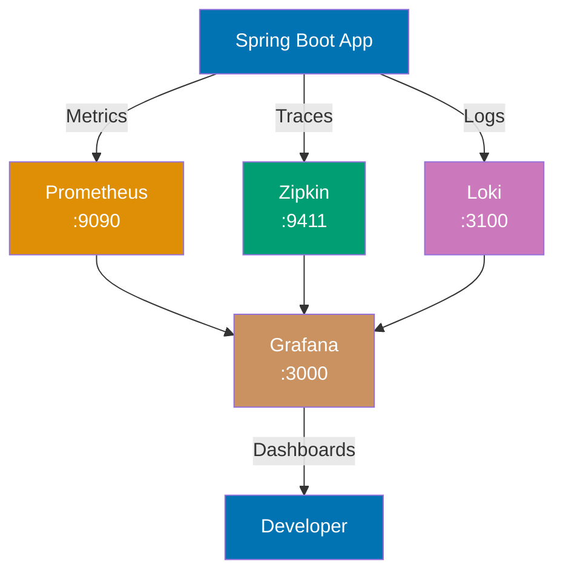

**Code (Kotlin)**:

```kotlin
// pom.xml dependencies (same for Java/Kotlin):
// spring-boot-starter-actuator
// micrometer-registry-prometheus
// micrometer-tracing-bridge-brave
// zipkin-reporter-brave

@SpringBootApplication
open class ObservableApplication

fun main(args: Array<String>) {
    runApplication<ObservableApplication>(*args)  // Spread operator for varargs
}

// Custom metrics with Micrometer
// Metrics track application performance and business KPIs
@RestController
@RequestMapping("/api/orders")
class OrderController(
    registry: MeterRegistry  // Micrometer registry injected via primary constructor
) {
    // Counter tracks total orders created
    // Counters only increment (monotonically increasing)
    private val orderCounter: Counter = Counter.builder("orders.created")
        .description("Total orders created")  // Metric description for documentation
        .tags("service", "order-service")     // Tags for filtering/grouping metrics
        .register(registry)

    // Timer tracks order processing duration
    // Timers record duration and count, calculate percentiles
    private val orderTimer: Timer = Timer.builder("orders.processing.time")
        .description("Order processing duration")
        .publishPercentiles(0.5, 0.95, 0.99)  // Publish p50, p95, p99 percentiles
        .register(registry)

    @PostMapping
    fun createOrder(@RequestBody request: OrderRequest): ResponseEntity<Order> {
        // record() measures execution time of lambda
        // Automatically tracks duration and increments count
        return orderTimer.record {
            val order = processOrder(request)
            orderCounter.increment()  // Increment counter after successful processing
            ResponseEntity.ok(order)
        }
        // => Metrics: orders.created (count), orders.processing.time (percentiles)
    }

    private fun processOrder(request: OrderRequest): Order {
        // Process order logic
        return Order(UUID.randomUUID().toString(), request.customerId)
    }
}

// Distributed tracing with Micrometer Tracing
// Traces track requests across microservices with trace ID propagation
@Service
class OrderService(
    private val restTemplate: RestTemplate  // Auto-instrumented for tracing
) {
    // @NewSpan creates custom span for detailed tracing
    // Span tracks specific operation within a trace
    @NewSpan("process-order")
    fun processOrder(request: OrderRequest): Order {
        // Trace ID automatically propagated to downstream services via HTTP headers
        // Each service adds spans to the same trace for end-to-end visibility
        val payment = restTemplate.postForObject(
            "http://payment-service/api/payments",
            request,
            PaymentResponse::class.java
        )

        val inventory = restTemplate.postForObject(
            "http://inventory-service/api/reserve",
            request,
            InventoryResponse::class.java
        )

        return Order(UUID.randomUUID().toString(), request.customerId)
    }
}

// Structured logging with MDC (Mapped Diagnostic Context)
// MDC adds contextual information (trace ID, span ID) to all log statements
@Component
class RequestLoggingFilter(
    private val tracer: Tracer  // Brave tracer for accessing current span
) : OncePerRequestFilter() {
    companion object {
        // Companion object for logger (similar to static logger in Java)
        private val log = LoggerFactory.getLogger(RequestLoggingFilter::class.java)
    }

    override fun doFilterInternal(
        request: HttpServletRequest,
        response: HttpServletResponse,
        filterChain: FilterChain
    ) {
        // Extract trace and span IDs from current span
        val traceId = tracer.currentSpan()?.context()?.traceId() ?: "unknown"
        val spanId = tracer.currentSpan()?.context()?.spanId() ?: "unknown"

        // Put context into MDC - available to all log statements in this thread
        MDC.put("traceId", traceId)
        MDC.put("spanId", spanId)
        MDC.put("path", request.requestURI)

        try {
            // Continue filter chain
            filterChain.doFilter(request, response)
        } finally {
            // Log request completion with MDC context
            // MDC fields automatically included in log output
            log.info(
                "Request completed: {} {} - Status: {}",
                request.method,
                request.requestURI,
                response.status
            )
            // => {"traceId":"abc123","spanId":"def456","path":"/api/orders","level":"INFO",...}

            // Clear MDC to prevent memory leaks (thread pool reuses threads)
            MDC.clear()
        }
    }
}

// Alternative: Extension function for MDC context management
// Kotlin extension functions enable cleaner MDC usage
fun <T> withMDC(vararg pairs: Pair<String, String>, block: () -> T): T {
    // Put all key-value pairs into MDC
    pairs.forEach { (key, value) -> MDC.put(key, value) }
    try {
        return block()  // Execute block with MDC context
    } finally {
        // Remove all keys from MDC
        pairs.forEach { (key, _) -> MDC.remove(key) }
    }
}

// Usage of MDC extension function
@Service
class ServiceWithMDC {
    companion object {
        private val log = LoggerFactory.getLogger(ServiceWithMDC::class.java)
    }

    fun processWithContext(userId: String) {
        // Extension function automatically cleans up MDC
        withMDC("userId" to userId, "operation" to "process") {
            log.info("Processing for user")  // userId and operation in MDC
            // ... business logic
        }
        // MDC automatically cleared after block
    }
}

// Data classes for observability
data class OrderRequest(val customerId: String, val productId: String, val amount: BigDecimal)
data class Order(val id: String, val customerId: String)
data class PaymentResponse(val transactionId: String, val success: Boolean)
data class InventoryResponse(val reservationId: String, val available: Boolean)
```

```yaml
# application.yml - Observability configuration (same for Java/Kotlin)
management:
  endpoints:
    web:
      exposure:
        include: health,prometheus,metrics,info # Expose actuator endpoints
  metrics:
    export:
      prometheus:
        enabled: true # Export metrics to Prometheus
    distribution:
      percentiles-histogram:
        http.server.requests: true # Histogram for HTTP request percentiles
  tracing:
    sampling:
      probability: 1.0 # 100% sampling (reduce to 0.1 in production for performance)
  zipkin:
    tracing:
      endpoint: http://localhost:9411/api/v2/spans # Zipkin collector endpoint

logging:
  pattern:
    # Log pattern includes MDC fields (traceId, spanId)
    console: "%d{yyyy-MM-dd HH:mm:ss} [%thread] %-5level [%X{traceId},%X{spanId}] %logger{36} - %msg%n"
  level:
    root: INFO
    com.example.demo: DEBUG
```

```yaml
# docker-compose.yml - Observability stack (same for Java/Kotlin)
version: "3"
services:
  prometheus:
    image: prom/prometheus
    ports:
      - "9090:9090"
    volumes:
      - ./prometheus.yml:/etc/prometheus/prometheus.yml

  grafana:
    image: grafana/grafana
    ports:
      - "3000:3000"
    environment:
      - GF_SECURITY_ADMIN_PASSWORD=admin

  zipkin:
    image: openzipkin/zipkin
    ports:
      - "9411:9411"

  loki:
    image: grafana/loki
    ports:
      - "3100:3100"
```

**Key Takeaway**: Comprehensive observability requires metrics (Prometheus), traces (Zipkin), and logs (Loki)—use Micrometer for metrics, automatic span propagation for distributed tracing, and structured logging with MDC for trace correlation.

**Why It Matters**: Comprehensive observability requires metrics (what is slow), traces (where is the slowness), and logs (why it is slow)—metrics identify 95th percentile latency increasing from 100ms to 500ms, traces pinpoint the Database Service contributing 400ms, logs reveal the slow query. Production teams use observability to detect issues before customers complain (alerting on metric thresholds) and diagnose root causes in minutes (tracing + structured log queries) instead of hours of manual log analysis, reducing MTTR and improving SLA compliance.

---

## Summary

These 30 advanced examples cover production-grade Spring Boot patterns:

**Microservices Communication (41-44)**: RestTemplate synchronous calls, WebClient reactive non-blocking, Feign declarative clients, Eureka service discovery

**Observability & Monitoring (45-48)**: Actuator endpoints, Micrometer custom metrics, distributed tracing with trace/span IDs, structured JSON logging with MDC

**Resilience Patterns (49-52)**: Circuit breaker preventing cascading failures, retry with exponential backoff, rate limiting for API throttling, bulkhead thread pool isolation

**Custom Auto-Configuration (53-56)**: Custom starter modules, conditional beans based on classpath/properties, type-safe configuration properties, custom actuator endpoints

**Production Deployment (57-60)**: Docker multi-stage builds with layered JARs, liveness/readiness health probes, graceful shutdown handling in-flight requests, Spring Cloud Config centralized configuration

**Kubernetes & Cloud-Native (61-62)**: Kubernetes ConfigMaps and Secrets integration, API Gateway pattern with Spring Cloud Gateway for routing and filters

**Event-Driven Architecture (63-64)**: Event sourcing for complete audit trails, CQRS pattern separating read and write models for scalability

**Advanced Patterns (65-68)**: Multi-tenancy strategies (separate databases/schemas/discriminator columns), GraalVM native images for instant startup, GraphQL APIs with DataLoader, Saga pattern for distributed transactions

**Performance & Observability (69-70)**: JVM and Spring Boot performance tuning (connection pools, caching, thread pools), comprehensive observability stack integration (Prometheus, Zipkin, Loki, Grafana)

Master these patterns to build resilient, observable, scalable, and production-ready Spring Boot microservices for cloud-native environments.
