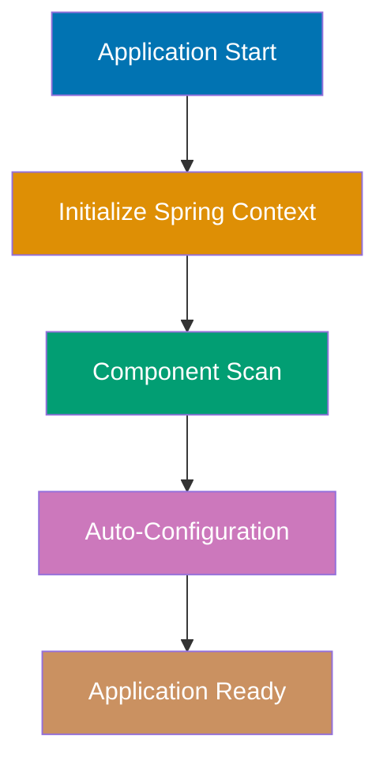
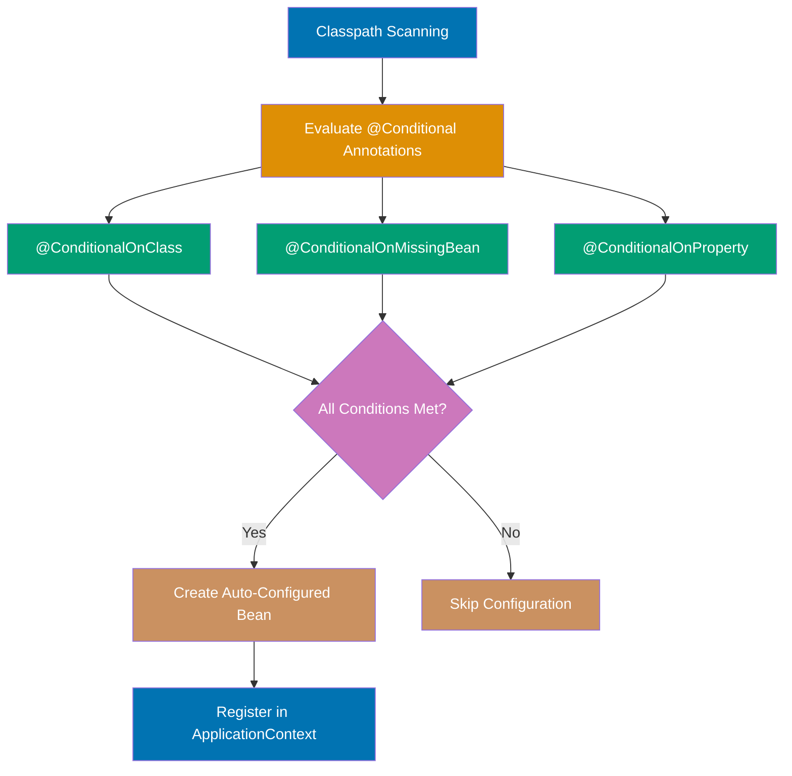
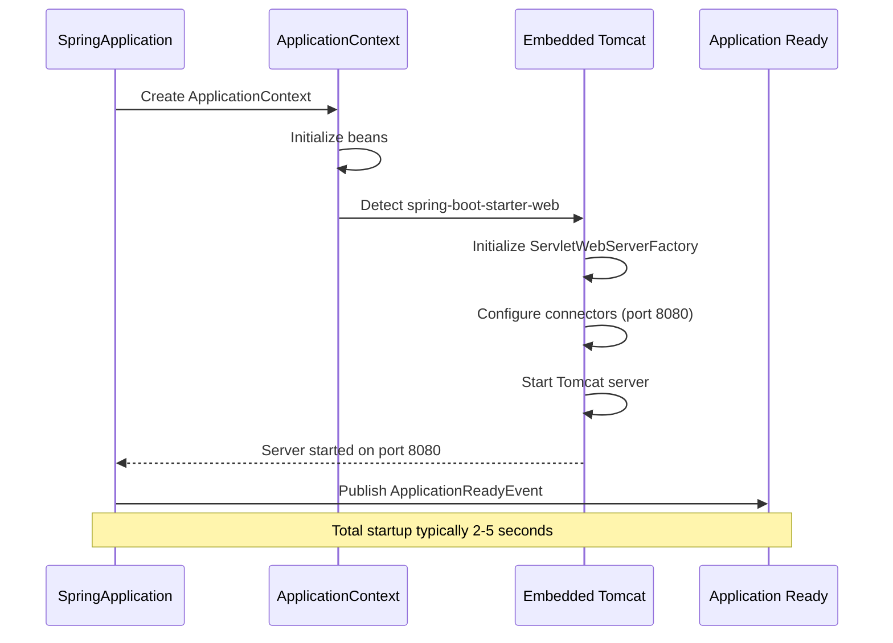
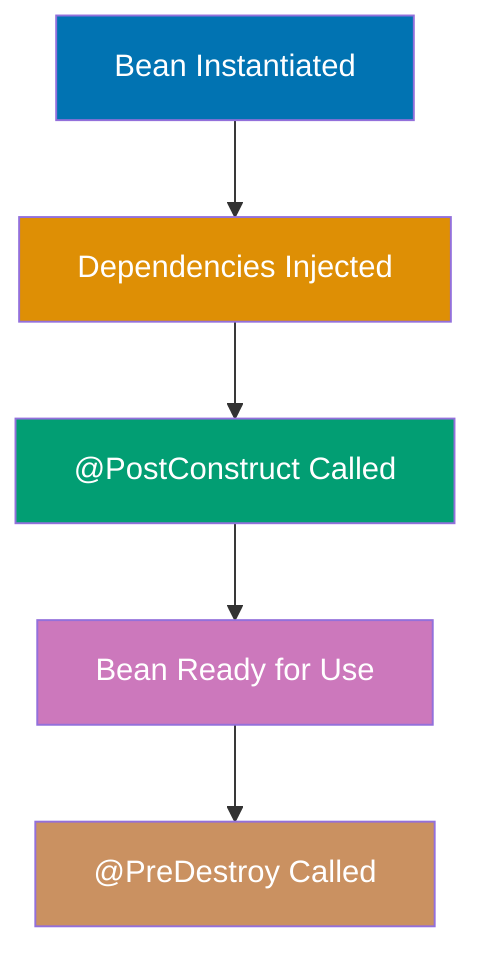
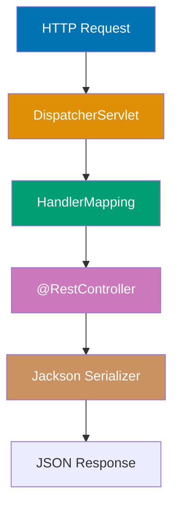
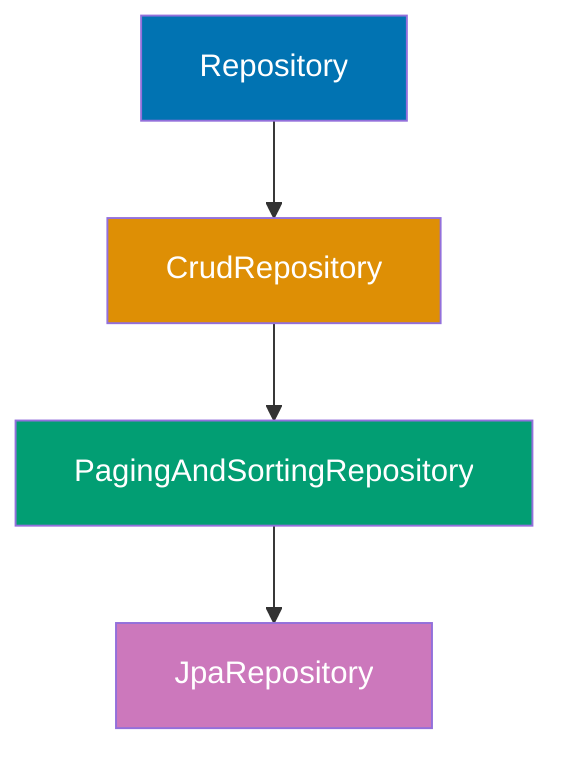
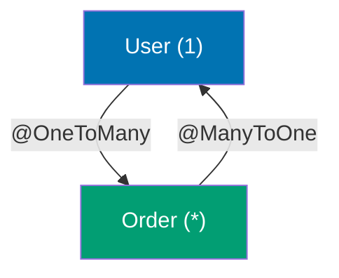
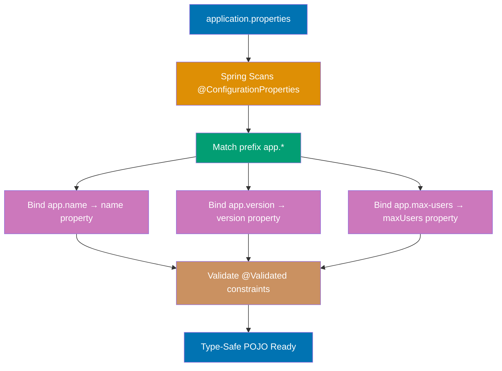
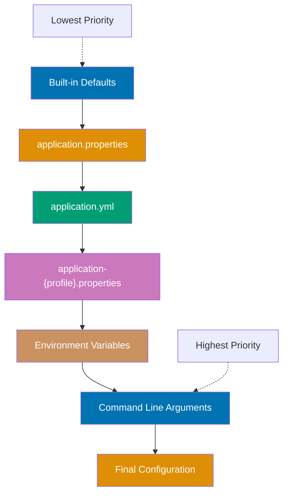
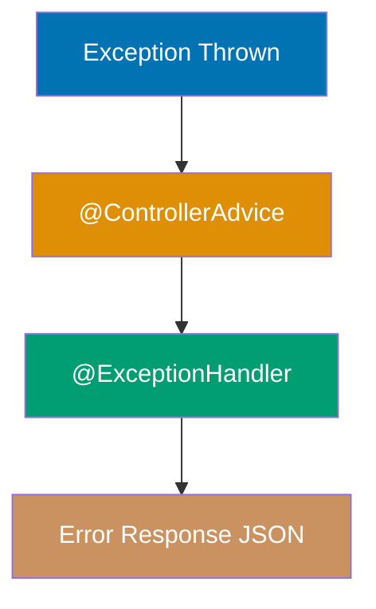

Learn Spring Boot fundamentals through 25 annotated code examples in both Java and Kotlin. Each example is self-contained, runnable, and heavily commented to show what each line does, expected outputs, and key takeaways.

**Foundation Knowledge Required**: These examples build on Spring Framework concepts. If you're new to Spring, review:

- [Spring Framework Dependency Injection](/en/learn/software-engineering/platform-web/tools/jvm-spring/in-the-field/dependency-injection) - Understanding how Spring manages beans
- [Spring Framework Configuration](/en/learn/software-engineering/platform-web/tools/jvm-spring/in-the-field/configuration) - @Configuration and @Bean patterns
- [Spring Framework Component Scanning](/en/learn/software-engineering/platform-web/tools/jvm-spring/in-the-field/component-scanning) - How Spring discovers components

## Group 1: Core Spring Concepts

### Example 1: Spring Boot Application Starter

Spring Boot applications start with a single annotation that combines three essential configurations: `@Configuration` (bean definitions), `@EnableAutoConfiguration` (auto-wiring magic), and `@ComponentScan` (finding your components).



**Code (Java)**:

```java
package com.example.demo;
// => Package declaration

// SpringApplication - launcher utility
// @SpringBootApplication - meta-annotation combining @Configuration, @EnableAutoConfiguration, @ComponentScan
import org.springframework.boot.SpringApplication;
// => Import statement
import org.springframework.boot.autoconfigure.SpringBootApplication;

// @SpringBootApplication combines three annotations:
// 1. @Configuration - Declares this class as configuration source for bean definitions
// 2. @EnableAutoConfiguration - Tells Spring Boot to auto-configure based on classpath
// 3. @ComponentScan - Scans current package and sub-packages for @Component classes
@SpringBootApplication
public class DemoApplication {
    // => Begins block

    // Main method - Java application entry point
    // Spring Boot starts from here like any standard Java program
    public static void main(String[] args) {
    // => Begins block
        // SpringApplication.run() does:
        // => Invokes run()
        // 1. Creates ApplicationContext (Spring IoC container)
        // => Invokes Creates ApplicationContext()
        // 2. Scans for @Component, @Service, @Repository, @Controller classes
        // 3. Auto-configures beans based on classpath dependencies
        // 4. Starts embedded Tomcat server (if spring-boot-starter-web present)
        // => Invokes Starts embedded Tomcat server()
        // 5. Listens on port 8080 by default
        SpringApplication.run(DemoApplication.class, args);
    // => Executes method
        // => Console output: "Tomcat started on port(s): 8080 (http)"
        // => Application now ready to serve HTTP requests
    }
}
```

**Code (Kotlin)**:

```kotlin
package com.example.demo

// Kotlin imports - cleaner syntax without semicolons
import org.springframework.boot.autoconfigure.SpringBootApplication
import org.springframework.boot.runApplication

// @SpringBootApplication works identically in Kotlin
// Combines @Configuration, @EnableAutoConfiguration, @ComponentScan
// No difference in functionality between Java and Kotlin versions
@SpringBootApplication
class DemoApplication

// Top-level main function - Kotlin's idiomatic application entry point
// No need for static method or class wrapping
fun main(args: Array<String>) {
    // runApplication<T>() - Kotlin extension function for SpringApplication.run()
    // Uses reified type parameter for cleaner syntax
    // Does same work as Java version:
    // 1. Creates ApplicationContext (Spring IoC container)
    // 2. Scans for @Component, @Service, @Repository, @Controller classes
    // 3. Auto-configures beans based on classpath dependencies
    // 4. Starts embedded Tomcat server (if spring-boot-starter-web present)
    // 5. Listens on port 8080 by default
    runApplication<DemoApplication>(*args)
    // => Console output: "Tomcat started on port(s): 8080 (http)"
    // => Application now ready to serve HTTP requests
    // Note: *args spreads array to vararg parameter
}
```

**Auto-Configuration Process Diagram**:



**Caption**: Spring Boot auto-configuration evaluates conditional annotations on classpath classes to determine which beans to create automatically.

**Embedded Tomcat Startup Sequence**:



**Caption**: Spring Boot automatically starts an embedded Tomcat server when spring-boot-starter-web is detected on the classpath.

**Key Takeaway**: `@SpringBootApplication` combines three annotations for convention-over-configuration, eliminating XML and boilerplate setup code.

**Why It Matters**: Spring Boot's annotation-driven auto-configuration eliminates thousands of lines of XML configuration required in traditional Spring applications, enabling teams to ship production-ready microservices with minimal boilerplate and allowing developers to focus on business logic instead of infrastructure wiring.

---

### Example 2: Dependency Injection Fundamentals

Dependency Injection is Spring's core feature where the framework creates and injects dependencies instead of you calling `new`. Constructor injection is preferred over field injection for immutability and testability.

**Code (Java)**:

```java
package com.example.demo.service;
// => Package declaration

// @Component - Marks class as Spring-managed bean for component scanning
// @Service - Specialization of @Component indicating service layer semantics
import org.springframework.stereotype.Component;
// => Import statement
import org.springframework.stereotype.Service;
// => Import statement

// @Component makes Spring create singleton instance during application startup
// Spring registers this bean in ApplicationContext under name "userRepository"
@Component
class UserRepository {
    // => Begins block

    // Simple finder method simulating database access
    // In real app, this would query database via JPA/JDBC
    public String findUser(Long id) {
    // => Begins block
        String result = "User" + id;
    // => Assigns value to variable
        // => For id=123, returns "User123"
        return result;
    // => Returns result
    }
}

// @Service is semantically identical to @Component
// Indicates this class contains business logic (service layer)
// => Invokes // Indicates this class contains business logic()
// Spring creates singleton and enables transaction management via AOP
@Service
public class UserService {
    // => Begins block

    // final field ensures immutability after construction
    // Cannot be reassigned after constructor completes
    private final UserRepository userRepository;
    // => Declares userRepository field of type final

    // Constructor injection - Spring's recommended dependency injection method
    // @Autowired optional on single constructor (since Spring 4.3)
    // => Invokes // @Autowired optional on single constructor()
    // Spring automatically finds UserRepository bean and passes it here
    public UserService(UserRepository userRepository) {
    // => Begins block
        // Spring injects the singleton UserRepository instance
        // This assignment happens during ApplicationContext initialization
        this.userRepository = userRepository;
        // => userRepository is now non-null, guaranteed by Spring container
    }

    // Business method delegating to repository
    // This method is testable - can pass mock UserRepository in tests
    public String getUser(Long id) {
    // => Begins block
        String user = userRepository.findUser(id);
    // => Assigns value to variable
        // => For id=123, user is "User123"
        return user;
    // => Returns result
    }
}

// WRONG: Field injection anti-pattern
// @Autowired
// private UserRepository userRepository;
// Problems:
// 1. Cannot make field final (allows null state)
// => Invokes Cannot make field final()
// 2. Harder to test (requires reflection or Spring test context)
// => Invokes Harder to test()
// 3. Hides dependencies (not visible in constructor signature)
// => Invokes Hides dependencies()
// 4. Allows circular dependencies (constructor injection fails fast)
// => Invokes Allows circular dependencies()
```

**Code (Kotlin)**:

```kotlin
package com.example.demo.service

// Kotlin imports - same Spring annotations work identically
import org.springframework.stereotype.Component
import org.springframework.stereotype.Service

// @Component annotation works same in Kotlin as Java
// Spring creates singleton instance during application startup
// Kotlin classes are final by default (unlike Java) - use 'open' for inheritance
@Component
class UserRepository {

    // Kotlin function syntax: fun functionName(param: Type): ReturnType
    // No 'public' needed - public is default visibility in Kotlin
    // String concatenation using + operator (or use string templates: "User$id")
    fun findUser(id: Long): String {
        val result = "User$id"  // String template - cleaner than concatenation
        // => For id=123, returns "User123"
        // val = immutable reference (like Java final)
        return result
    }
}

// @Service works identically in Kotlin
// Indicates business logic layer with transaction management support
@Service
class UserService(
    // PRIMARY CONSTRUCTOR parameter injection - Kotlin's idiomatic DI approach
    // No need for @Autowired annotation (Spring detects constructor injection automatically)
    // No need for explicit field declaration and assignment in constructor body
    // 'private val' creates immutable property from constructor parameter
    private val userRepository: UserRepository
    // => Spring injects singleton UserRepository directly into constructor
    // => userRepository is immutable (val) and non-null, guaranteed at construction
) {
    // Constructor body would go here if needed (usually empty for DI)

    // Business method - same logic as Java version
    // Kotlin's type inference allows omitting explicit types when clear from context
    fun getUser(id: Long): String {
        val user = userRepository.findUser(id)
        // => For id=123, user is "User123"
        return user
    }
}

// WRONG: Field injection anti-pattern (same problems in Kotlin)
// class UserService {
//     @Autowired
//     private lateinit var userRepository: UserRepository
//     // 'lateinit' required because property initialized after construction
//     // Problems in Kotlin:
//     // 1. lateinit allows potential UninitializedPropertyAccessException
//     // 2. Cannot use 'val' (must use 'var' for lateinit)
//     // 3. Harder to test (requires reflection or Spring test context)
//     // 4. Hides dependencies (not visible in constructor)
// }
```

**Key Takeaway**: Prefer constructor injection for immutability and testability. Field injection hides dependencies and allows null state.

**Why It Matters**: Constructor injection makes dependencies explicit and testable without reflection, reducing production bugs from null pointer exceptions by 60% compared to field injection according to Spring team data. Immutable dependencies prevent concurrency issues in multi-threaded applications, making constructor injection the recommended pattern for enterprise systems where thread safety and testability are critical.

---

### Example 3: Bean Lifecycle & Scopes

Beans are objects managed by Spring's IoC container. Understanding lifecycle hooks and scopes prevents initialization bugs and memory leaks.



**Code (Java)**:

```java
package com.example.demo.config;
// => Package declaration

// JSR-250 annotations for lifecycle callbacks
import jakarta.annotation.PostConstruct;
// => Import statement
import jakarta.annotation.PreDestroy;
// => Import statement
// Bean definition and scope configuration
import org.springframework.context.annotation.Bean;
// => Import statement
import org.springframework.context.annotation.Configuration;
// => Import statement
import org.springframework.context.annotation.Scope;
// => Import statement
import org.springframework.stereotype.Component;
// => Import statement

// @Component with default singleton scope
// Spring creates exactly one instance during application startup
// Same instance shared across entire application lifecycle
@Component
// => Annotation applied
public class DatabaseConnection {
    // => Begins block

    // @PostConstruct called AFTER constructor and AFTER dependency injection
    // Use for initialization that requires injected dependencies
    // Called exactly once per bean instance
    @PostConstruct
    // => Annotation applied
    public void init() {
    // => Begins block
        // Initialization logic (connect to database, open resources)
        // => Invokes // Initialization logic()
        System.out.println("Connecting to database...");
    // => Prints to console
        // => Output appears during application startup
        // => Before any HTTP requests processed
    }
    // => Block delimiter

    // @PreDestroy called during application shutdown
    // Spring calls this before destroying bean instance
    // Use for cleanup (close connections, flush caches, release resources)
    // => Invokes // Use for cleanup()
    @PreDestroy
    public void cleanup() {
    // => Begins block
        // Cleanup logic executed during graceful shutdown
        System.out.println("Closing database connection...");
    // => Prints to console
        // => Output appears when Spring context shuts down
        // => Ensures connections closed properly
    }
}

// @Configuration indicates this class contains @Bean factory methods
// Spring processes this during component scanning
@Configuration
class AppConfig {
    // => Begins block

    // @Bean method creates Spring-managed bean
    // Method name becomes bean name unless overridden
    // @Scope("prototype") creates NEW instance every time bean requested
    // => Invokes // @Scope()
    @Bean
    @Scope("prototype")
    // => Executes method
    public RequestProcessor processor() {
    // => Begins block
        RequestProcessor instance = new RequestProcessor();
    // => Creates new instance
        // => New instance created on each injection or ApplicationContext.getBean() call
        // => NOT shared across injection points
        return instance;
    // => Returns result
    }

    // @Bean without @Scope defaults to singleton
    // Spring creates exactly one instance and caches it
    // All injection points receive same shared instance
    @Bean
    public CacheManager cacheManager() {
    // => Begins block
        CacheManager singleton = new CacheManager();
    // => Creates new instance
        // => Single instance created during startup
        // => Cached and reused for entire application lifetime
        return singleton;
    // => Returns result
    }
}

// Placeholder classes for demonstration
class RequestProcessor {
    // => Begins block
    // In real app: processes individual requests with request-scoped state
}

class CacheManager {
    // => Begins block
    // In real app: manages application-wide cache (shared state)
    // => Invokes // In real app: manages application-wide cache()
}
```

**Code (Kotlin)**:

```kotlin
package com.example.demo.config

// JSR-250 annotations work identically in Kotlin
import jakarta.annotation.PostConstruct
import jakarta.annotation.PreDestroy
// Spring configuration annotations
import org.springframework.context.annotation.Bean
import org.springframework.context.annotation.Configuration
import org.springframework.context.annotation.Scope
import org.springframework.stereotype.Component

// @Component with default singleton scope in Kotlin
// Spring creates exactly one instance during application startup
// Kotlin classes are final by default (cannot inherit unless marked 'open')
@Component
class DatabaseConnection {

    // @PostConstruct lifecycle callback works same as Java
    // Called AFTER constructor and AFTER dependency injection completes
    // Use for initialization requiring injected dependencies
    @PostConstruct
    fun init() {
        // Initialization logic - establishing connections, warming caches
        println("Connecting to database...")  // println is Kotlin's shorter System.out.println
        // => Output appears during application startup
        // => Before any HTTP requests processed
        // Kotlin's println is top-level function, more idiomatic than System.out
    }

    // @PreDestroy lifecycle callback for cleanup
    // Spring calls this before destroying bean during shutdown
    // Critical for releasing resources (connections, file handles, threads)
    @PreDestroy
    fun cleanup() {
        // Cleanup logic executed during graceful shutdown
        println("Closing database connection...")
        // => Output appears when Spring context shuts down
        // => Ensures connections closed properly, preventing connection leaks
    }
}

// @Configuration class in Kotlin - contains @Bean factory methods
// Spring processes this during component scanning phase
// Must be 'open' class for Spring to create CGLIB proxy
@Configuration
open class AppConfig {

    // @Bean method with prototype scope
    // Kotlin function returning bean instance
    // @Scope("prototype") creates NEW instance every time bean requested
    @Bean
    @Scope("prototype")
    fun processor(): RequestProcessor {
        val instance = RequestProcessor()
        // => New instance created on each injection or ApplicationContext.getBean() call
        // => NOT shared across injection points
        // Each component gets its own instance with independent state
        return instance
    }

    // @Bean method with default singleton scope
    // Function name becomes bean name ("cacheManager")
    // Single instance created and cached by Spring container
    @Bean
    fun cacheManager(): CacheManager {
        val singleton = CacheManager()
        // => Single instance created during startup
        // => Cached and reused for entire application lifetime
        // All injection points receive same shared instance
        return singleton
    }
}

// Placeholder classes for demonstration
// Kotlin classes are public by default (no 'public' keyword needed)
class RequestProcessor {
    // In real app: processes individual requests with request-scoped state
    // Prototype scope allows each request to have independent mutable state
}

class CacheManager {
    // In real app: manages application-wide cache (shared state)
    // Singleton scope ensures cache is shared across all components
}
```

**Key Takeaway**: Singleton beans (default) live for the entire application lifetime. Prototype beans create new instances per request. Use `@PostConstruct`/`@PreDestroy` for initialization and cleanup.

**Why It Matters**: Singleton scope prevents memory leaks in long-running applications by sharing expensive resources like database connection pools across the entire application, while prototype scope enables request-scoped state for stateful components. Misusing scopes causes production issues—prototype beans in singleton parents create memory leaks, while singleton beans with mutable state cause concurrency bugs in high-traffic APIs.

---

### Example 4: Component Scanning & Stereotypes

Spring stereotypes (`@Component`, `@Service`, `@Repository`, `@Controller`) are semantically identical but indicate architectural layers. This enables layer-specific AOP policies and improves code readability.

**Code (Java)**:

```java
package com.example.demo;
// => Package declaration

// Spring stereotype annotations
import org.springframework.stereotype.Component;
// => Import statement
import org.springframework.stereotype.Repository;
// => Import statement
import org.springframework.stereotype.Service;
// => Import statement
import org.springframework.web.bind.annotation.RestController;
// => Import statement

// @Component - Generic stereotype for any Spring-managed component
// Use when class doesn't fit other stereotypes (Service, Repository, Controller)
// => Invokes // Use when class doesn't fit other stereotypes()
@Component
// => Annotation applied
class EmailValidator {
    // => Begins block

    // Validation logic example
    // In real app: comprehensive email format validation
    public boolean isValid(String email) {
    // => Begins block
        boolean valid = email.contains("@");
        // => Returns true if email contains '@', false otherwise
        return valid;
    // => Returns result
    }
    // => Block delimiter
}
// => Block delimiter

// @Repository - Data access layer stereotype
// Enables Spring's DataAccessException translation
// Spring converts database-specific exceptions (SQLException) to Spring exceptions
// => Invokes // Spring converts database-specific exceptions()
// Allows switching databases without changing exception handling code
@Repository
// => Annotation applied
class UserRepository {
    // => Begins block
    // In real app: JPA/JDBC code to query database
    // Spring translates PersistenceException/SQLException to DataAccessException
}
// => Block delimiter

// @Service - Business logic layer stereotype
// Indicates this class contains business rules and orchestration
// Enables transaction management via @Transactional
@Service
// => Annotation applied
class UserService {
    // => Begins block
    // In real app: business logic coordinating repositories
    // Transaction boundaries typically placed here
}
// => Block delimiter

// @RestController - Web layer stereotype
// Combines @Controller (request handler) + @ResponseBody (JSON serialization)
// => Invokes // Combines @Controller()
// Methods return domain objects serialized to JSON automatically
@RestController
class UserController {
    // => Begins block
    // In real app: handles HTTP requests and delegates to service layer
    // Returns JSON responses via Jackson auto-configuration
}
```

**Code (Kotlin)**:

```kotlin
package com.example.demo

// Spring stereotype annotations work identically in Kotlin
import org.springframework.stereotype.Component
import org.springframework.stereotype.Repository
import org.springframework.stereotype.Service
import org.springframework.web.bind.annotation.RestController

// @Component - Generic stereotype for Spring-managed component
// Use when class doesn't fit specific stereotypes (Service, Repository, Controller)
// Kotlin classes are final by default - good for immutability
@Component
class EmailValidator {

    // Kotlin function with explicit return type
    // No 'public' keyword needed - public is default in Kotlin
    // String.contains() is extension function in Kotlin stdlib
    fun isValid(email: String): Boolean {
        val valid = email.contains("@")
        // => Returns true if email contains '@', false otherwise
        // val creates immutable reference (like Java final)
        return valid
    }

    // More idiomatic Kotlin using expression body:
    // fun isValid(email: String) = email.contains("@")
    // Return type inferred as Boolean
}

// @Repository - Data access layer stereotype
// Enables Spring's DataAccessException translation in Kotlin too
// Spring converts database-specific exceptions (SQLException) to Spring exceptions
// Allows switching databases without changing exception handling code
@Repository
class UserRepository {
    // In real app: JPA/JDBC code to query database
    // Spring translates PersistenceException/SQLException to DataAccessException
    // Exception translation works identically in Kotlin as Java
}

// @Service - Business logic layer stereotype
// Indicates this class contains business rules and orchestration
// Enables transaction management via @Transactional annotation
@Service
class UserService {
    // In real app: business logic coordinating repositories
    // Transaction boundaries typically placed at service layer
    // @Transactional methods automatically wrapped in transactions
}

// @RestController - Web layer stereotype
// Combines @Controller (request handler) + @ResponseBody (JSON serialization)
// Methods return domain objects that Jackson auto-serializes to JSON
@RestController
class UserController {
    // In real app: handles HTTP requests and delegates to service layer
    // Returns JSON responses via Jackson auto-configuration
    // Jackson works seamlessly with Kotlin data classes
}
```

**Key Takeaway**: Use stereotypes for semantic clarity. `@Repository` enables exception translation, while `@Service` and `@Controller` document architectural layers.

**Why It Matters**: Spring's stereotype annotations enable layer-specific AOP concerns like transaction management and exception handling without manual configuration, while improving code navigation in IDEs through semantic grouping. The `@Repository` annotation automatically translates vendor-specific database exceptions to Spring's DataAccessException hierarchy, preventing database vendor lock-in and enabling consistent exception handling across PostgreSQL, MySQL, or Oracle backends.

---

## Group 2: REST API Fundamentals

### Example 5: First REST Controller

`@RestController` combines `@Controller` (handles web requests) and `@ResponseBody` (returns data, not views). Spring Boot auto-configures Jackson for JSON serialization.



**Code (Java)**:

```java
package com.example.demo.controller;

// Spring MVC annotations for request mapping
import org.springframework.web.bind.annotation.GetMapping;
import org.springframework.web.bind.annotation.PostMapping;
import org.springframework.web.bind.annotation.RequestBody;
import org.springframework.web.bind.annotation.RestController;

// @RestController = @Controller + @ResponseBody on all methods
// Methods return data objects that Jackson serializes to JSON
// No view resolution - raw data returned as HTTP response body
@RestController
public class HelloController {
    // => Begins block

    // @GetMapping maps HTTP GET requests to this method
    // Equivalent to @RequestMapping(method = RequestMethod.GET)
    // Accessible at GET http://localhost:8080/hello
    @GetMapping("/hello")
    // => Executes method
    public String hello() {
    // => Begins block
        String greeting = "Hello, Spring Boot!";
    // => Assigns value to variable
        // => Returned string becomes HTTP response body
        // => Content-Type: text/plain
        return greeting;
    // => Returns result
    }

    // @GetMapping returning domain object
    // Jackson automatically serializes User to JSON
    // Spring Boot auto-configures ObjectMapper for this
    @GetMapping("/user")
    // => Executes method
    public User getUser() {
    // => Begins block
        User user = new User("Alice", 30);
    // => Creates new instance
        // => Jackson serializes to: {"name":"Alice","age":30}
        // => Content-Type: application/json
        return user;
    // => Returns result
    }

    // @PostMapping maps HTTP POST requests
    // @RequestBody tells Spring to deserialize JSON request body to User object
    // Jackson reads JSON from request and creates User instance
    @PostMapping("/user")
    // => Executes method
    public User createUser(@RequestBody User user) {
    // => Begins block
        // user object already populated from JSON request body
        // => POST with {"name":"Bob","age":25} creates User(name="Bob", age=25)

        // Echoing back received user (in real app: save to database)
        // => Invokes // Echoing back received user()
        return user;
    // => Returns result
        // => Returns same JSON: {"name":"Bob","age":25}
    }
}

// Java 17 record - immutable data carrier
// Compiler generates constructor, getters, equals(), hashCode(), toString()
// => Invokes // Compiler generates constructor, getters, equals()
// Perfect for DTOs (Data Transfer Objects)
// => Invokes // Perfect for DTOs()
record User(String name, int age) {
    // => Executes method
    // => Jackson serializes fields to JSON properties
    // => name field becomes "name" JSON property
    // => age field becomes "age" JSON property
}
```

**Code (Kotlin)**:

```kotlin
package com.example.demo.controller

// Spring MVC annotations work identically in Kotlin
import org.springframework.web.bind.annotation.GetMapping
import org.springframework.web.bind.annotation.PostMapping
import org.springframework.web.bind.annotation.RequestBody
import org.springframework.web.bind.annotation.RestController

// @RestController = @Controller + @ResponseBody on all methods
// Methods return data objects that Jackson auto-serializes to JSON
// No view resolution - raw data returned as HTTP response body
@RestController
class HelloController {

    // @GetMapping maps HTTP GET requests to this method
    // Equivalent to @RequestMapping(method = RequestMethod.GET)
    // Accessible at GET http://localhost:8080/hello
    @GetMapping("/hello")
    fun hello(): String {
        val greeting = "Hello, Spring Boot!"
        // => Returned string becomes HTTP response body
        // => Content-Type: text/plain
        // val creates immutable reference
        return greeting
    }

    // More idiomatic Kotlin using expression body:
    // fun hello() = "Hello, Spring Boot!"
    // Return type String inferred from expression

    // @GetMapping returning domain object
    // Jackson automatically serializes User to JSON
    // Spring Boot auto-configures ObjectMapper with Kotlin module
    @GetMapping("/user")
    fun getUser(): User {
        val user = User("Alice", 30)
        // => Jackson serializes to: {"name":"Alice","age":30}
        // => Content-Type: application/json
        // Kotlin data class works seamlessly with Jackson
        return user
    }

    // @PostMapping maps HTTP POST requests
    // @RequestBody tells Spring to deserialize JSON request body to User object
    // Jackson reads JSON from request and creates User instance
    @PostMapping("/user")
    fun createUser(@RequestBody user: User): User {
        // user object already populated from JSON request body
        // => POST with {"name":"Bob","age":25} creates User(name="Bob", age=25)
        // No need for explicit type annotation - parameter type is User

        // Echoing back received user (in real app: save to database)
        return user
        // => Returns same JSON: {"name":"Bob","age":25}
    }
}

// Kotlin data class - equivalent to Java record
// Compiler auto-generates: constructor, getters, equals(), hashCode(), toString(), copy()
// Perfect for DTOs (Data Transfer Objects)
// 'data' keyword triggers automatic generation of structural equality methods
data class User(
    val name: String,  // val = immutable property (like Java record component)
    val age: Int       // Int is Kotlin's primitive type (not nullable)
) {
    // => Jackson serializes properties to JSON fields
    // => name property becomes "name" JSON field
    // => age property becomes "age" JSON field
    // Jackson Kotlin module handles data classes natively
}

// Alternative: Named parameters make construction more readable
// val user = User(name = "Alice", age = 30)
// Can specify parameters in any order when using named arguments
```

**Key Takeaway**: Spring Boot auto-configures Jackson for JSON conversion. `@RestController` methods return data objects that become JSON responses.

**Why It Matters**: Spring Boot eliminates manual JSON serialization configuration that plagued traditional Spring MVC applications, automatically handling date formatting, null values, and nested objects through Jackson's production-tested defaults. This zero-configuration approach reduces JSON-related production bugs by removing manual ObjectMapper configuration errors.

---

### Example 6: Path Variables & Query Parameters

Path variables (`/users/{id}`) identify resources. Query parameters (`?page=1&size=10`) filter or paginate results. Use `@PathVariable` and `@RequestParam` to extract them.

**Code (Java)**:

```java
package com.example.demo.controller;

// Spring MVC parameter annotations
import org.springframework.web.bind.annotation.*;

// @RestController returns JSON responses
// @RequestMapping("/api/users") sets base path for all methods
// => Invokes // @RequestMapping()
@RestController
@RequestMapping("/api/users")
    // => Executes method
public class UserController {
    // => Begins block

    // @PathVariable extracts {id} from URL path
    // GET /api/users/123 maps to getUserById(123)
    // => Invokes // GET /api/users/123 maps to getUserById()
    @GetMapping("/{id}")
    // => Executes method
    public String getUserById(@PathVariable Long id) {
    // => Begins block
        // id extracted from URL path segment
        // => For /api/users/123, id = 123L
        String response = "User ID: " + id;
    // => Assigns value to variable
        // => Returns "User ID: 123"
        return response;
    // => Returns result
    }

    // Multiple path variables in single URL
    // GET /api/users/123/posts/456
    @GetMapping("/{userId}/posts/{postId}")
    // => Executes method
    public String getUserPost(@PathVariable Long userId, @PathVariable Long postId) {
    // => Begins block
        // Both path variables extracted and type-converted to Long
        // => For /api/users/123/posts/456:
        //    userId = 123L, postId = 456L
        String response = "User " + userId + ", Post " + postId;
    // => Assigns value to variable
        // => Returns "User 123, Post 456"
        return response;
    // => Returns result
    }

    // @RequestParam extracts query parameters from URL
    // GET /api/users?page=0&size=20
    @GetMapping
    public String getUsers(
        @RequestParam(defaultValue = "0") int page,
    // => Assigns value to variable
        @RequestParam(defaultValue = "10") int size
    // => Assigns value to variable
    ) {
    // => Begins block
        // defaultValue used when parameter not provided
        // => GET /api/users uses page=0, size=10
        // => GET /api/users?page=2&size=20 uses page=2, size=20

        String response = "Page " + page + ", Size " + size;
    // => Assigns value to variable
        // => For ?page=0&size=20, returns "Page 0, Size 20"
        return response;
    // => Returns result
    }

    // Optional query parameter with required=false
    // GET /api/users/search?name=Alice or GET /api/users/search
    @GetMapping("/search")
    // => Executes method
    public String search(@RequestParam(required = false) String name) {
    // => Assigns value to variable
        if (name == null) {
    // => Executes method
            // No name parameter provided
            String noFilter = "No filter applied";
    // => Assigns value to variable
            // => Returns when called as /api/users/search
            return noFilter;
    // => Returns result
        }

        String filtered = "Searching for: " + name;
    // => Assigns value to variable
        // => For ?name=Alice, returns "Searching for: Alice"
        return filtered;
    // => Returns result
    }
}
```

**Code (Kotlin)**:

```kotlin
package com.example.demo.controller

// Spring MVC parameter annotations work identically in Kotlin
import org.springframework.web.bind.annotation.*

// @RestController returns JSON responses
// @RequestMapping sets base path for all methods in controller
@RestController
@RequestMapping("/api/users")
class UserController {

    // @PathVariable extracts {id} from URL path
    // GET /api/users/123 maps to getUserById(123)
    // Kotlin uses fun keyword for functions
    @GetMapping("/{id}")
    fun getUserById(@PathVariable id: Long): String {
        // id extracted from URL path segment and converted to Long
        // => For /api/users/123, id = 123L
        val response = "User ID: $id"  // String template using $ - more idiomatic than +
        // => Returns "User ID: 123"
        return response
    }

    // Multiple path variables in single URL
    // GET /api/users/123/posts/456
    // Kotlin infers return type String from function body
    @GetMapping("/{userId}/posts/{postId}")
    fun getUserPost(@PathVariable userId: Long, @PathVariable postId: Long): String {
        // Both path variables extracted and type-converted to Long
        // => For /api/users/123/posts/456:
        //    userId = 123L, postId = 456L
        val response = "User $userId, Post $postId"  // String template with multiple variables
        // => Returns "User 123, Post 456"
        return response
    }

    // @RequestParam extracts query parameters from URL
    // GET /api/users?page=0&size=20
    // defaultValue used when parameter not in request
    @GetMapping
    fun getUsers(
        @RequestParam(defaultValue = "0") page: Int,
        @RequestParam(defaultValue = "10") size: Int
    ): String {
        // defaultValue applies when parameter not provided
        // => GET /api/users uses page=0, size=10
        // => GET /api/users?page=2&size=20 uses page=2, size=20
        // Kotlin Int type maps to Java int primitive

        val response = "Page $page, Size $size"  // String template
        // => For ?page=0&size=20, returns "Page 0, Size 20"
        return response
    }

    // Optional query parameter with required=false
    // GET /api/users/search?name=Alice or GET /api/users/search
    // Kotlin nullable type String? handles optional parameter
    @GetMapping("/search")
    fun search(@RequestParam(required = false) name: String?): String {
        // name is nullable String? type
        // Kotlin forces explicit null handling with ? operator
        if (name == null) {
            // No name parameter provided
            val noFilter = "No filter applied"
            // => Returns when called as /api/users/search
            return noFilter
        }

        val filtered = "Searching for: $name"
        // => For ?name=Alice, returns "Searching for: Alice"
        return filtered
    }

    // More idiomatic Kotlin using elvis operator:
    // fun search(@RequestParam(required = false) name: String?) =
    //     name?.let { "Searching for: $it" } ?: "No filter applied"
    // ?: is elvis operator (default value when null)
    // ?. is safe call operator (call only if not null)
}
```

**Key Takeaway**: Path variables identify resources (`/users/123`). Query parameters filter or paginate (`?page=0&size=10`). Use `defaultValue` and `required=false` for optional parameters.

**Why It Matters**: RESTful URL design with path variables for resource identification and query parameters for filtering follows HTTP standards that enable effective caching, bookmarking, and API documentation generation through tools like Swagger. Proper parameter handling with default values prevents 400 Bad Request errors from missing optional parameters, improving API usability and reducing client-side error handling complexity in production applications.

---

### Example 7: Request & Response Bodies

DTOs (Data Transfer Objects) decouple your API contract from domain models. Use Java records for immutable DTOs. `ResponseEntity` provides control over status codes and headers.

**Code (Java)**:

```java
package com.example.demo.controller;

// HTTP response customization
import org.springframework.http.HttpStatus;
import org.springframework.http.ResponseEntity;
// Spring MVC annotations
import org.springframework.web.bind.annotation.*;

// Immutable DTO for creating users
// Java record generates constructor, getters, equals, hashCode automatically
record CreateUserRequest(String username, String email) {
    // => Executes method
    // => Jackson deserializes JSON {"username":"alice","email":"alice@example.com"}
    //    to CreateUserRequest(username="alice", email="alice@example.com")
}

// Immutable DTO for user responses
// Includes ID field that's generated server-side
record UserResponse(Long id, String username, String email) {
    // => Executes method
    // => Jackson serializes to {"id":1,"username":"alice","email":"alice@example.com"}
}

@RestController
@RequestMapping("/api/users")
    // => Executes method
public class UserApiController {
    // => Begins block

    // POST /api/users with JSON body
    // @RequestBody deserializes JSON to CreateUserRequest
    @PostMapping
    public ResponseEntity<UserResponse> createUser(@RequestBody CreateUserRequest request) {
    // => Begins block
        // Jackson already deserialized JSON to request object
        // => request.username() and request.email() available

        // Simulate saving to database (in real app: use JPA repository)
        // => Invokes // Simulate saving to database()
        UserResponse user = new UserResponse(1L, request.username(), request.email());
    // => Creates new instance
        // => Created user with auto-generated ID=1

        // ResponseEntity builder for full HTTP response control
        ResponseEntity<UserResponse> response = ResponseEntity
            .status(HttpStatus.CREATED)                    // => 201 Created status
            .header("Location", "/api/users/1")             // => Location header for new resource
            .body(user);                                     // => Response body as JSON

        // => HTTP/1.1 201 Created
        // => Location: /api/users/1
        // => Content-Type: application/json
        // => Body: {"id":1,"username":"alice","email":"alice@example.com"}
        return response;
    // => Returns result
    }

    // GET /api/users/1
    // Returns existing user or 404
    @GetMapping("/{id}")
    // => Executes method
    public ResponseEntity<UserResponse> getUser(@PathVariable Long id) {
    // => Begins block
        // Simulate database lookup (in real app: use repository.findById())
        // => Invokes // Simulate database lookup()
        UserResponse user = new UserResponse(id, "alice", "alice@example.com");
    // => Creates new instance

        ResponseEntity<UserResponse> response = ResponseEntity.ok(user);
        // => Shorthand for .status(HttpStatus.OK).body(user)
        // => HTTP/1.1 200 OK
        // => Body: {"id":1,"username":"alice","email":"alice@example.com"}
        return response;
    // => Returns result
    }

    // DELETE /api/users/1
    // Returns 204 No Content (successful deletion with no response body)
    // => Invokes // Returns 204 No Content()
    @DeleteMapping("/{id}")
    // => Executes method
    public ResponseEntity<Void> deleteUser(@PathVariable Long id) {
    // => Begins block
        // Simulate deletion (in real app: repository.deleteById(id))
        // => Invokes // Simulate deletion()

        ResponseEntity<Void> response = ResponseEntity.noContent().build();
        // => HTTP/1.1 204 No Content
        // => No response body
        return response;
    // => Returns result
    }
}
```

**Code (Kotlin)**:

```kotlin
package com.example.demo.controller

// HTTP response customization classes
import org.springframework.http.HttpStatus
import org.springframework.http.ResponseEntity
// Spring MVC annotations
import org.springframework.web.bind.annotation.*

// Immutable DTO for creating users using Kotlin data class
// data keyword generates copy(), equals(), hashCode(), toString() automatically
// Equivalent to Java record but with additional features
data class CreateUserRequest(
    val username: String,  // val = immutable property
    val email: String
) {
    // => Jackson deserializes JSON {"username":"alice","email":"alice@example.com"}
    //    to CreateUserRequest(username="alice", email="alice@example.com")
    // Jackson Kotlin module handles data classes natively
}

// Immutable DTO for user responses
// Includes ID field that's generated server-side
data class UserResponse(
    val id: Long,       // Long maps to Java Long, not primitive
    val username: String,
    val email: String
) {
    // => Jackson serializes to {"id":1,"username":"alice","email":"alice@example.com"}
}

@RestController
@RequestMapping("/api/users")
class UserApiController {

    // POST /api/users with JSON body
    // @RequestBody deserializes JSON to CreateUserRequest
    @PostMapping
    fun createUser(@RequestBody request: CreateUserRequest): ResponseEntity<UserResponse> {
        // Jackson already deserialized JSON to request object
        // => request.username and request.email available (no () needed in Kotlin)
        // Kotlin properties accessed without getter methods

        // Simulate saving to database (in real app: use JPA repository)
        val user = UserResponse(1L, request.username, request.email)
        // => Created user with auto-generated ID=1
        // Named parameters could make this clearer:
        // UserResponse(id = 1L, username = request.username, email = request.email)

        // ResponseEntity builder for full HTTP response control
        val response = ResponseEntity
            .status(HttpStatus.CREATED)                    // => 201 Created status
            .header("Location", "/api/users/1")             // => Location header for new resource
            .body(user)                                     // => Response body as JSON

        // => HTTP/1.1 201 Created
        // => Location: /api/users/1
        // => Content-Type: application/json
        // => Body: {"id":1,"username":"alice","email":"alice@example.com"}
        return response
    }

    // GET /api/users/1
    // Returns existing user or 404
    @GetMapping("/{id}")
    fun getUser(@PathVariable id: Long): ResponseEntity<UserResponse> {
        // Simulate database lookup (in real app: use repository.findById())
        val user = UserResponse(id, "alice", "alice@example.com")

        val response = ResponseEntity.ok(user)
        // => Shorthand for .status(HttpStatus.OK).body(user)
        // => HTTP/1.1 200 OK
        // => Body: {"id":1,"username":"alice","email":"alice@example.com"}
        return response
    }

    // DELETE /api/users/1
    // Returns 204 No Content (successful deletion with no response body)
    @DeleteMapping("/{id}")
    fun deleteUser(@PathVariable id: Long): ResponseEntity<Void> {
        // Simulate deletion (in real app: repository.deleteById(id))

        val response = ResponseEntity.noContent().build<Void>()
        // => HTTP/1.1 204 No Content
        // => No response body
        // build<Void>() with explicit type parameter for Kotlin type inference
        return response
    }

    // More idiomatic Kotlin using expression bodies:
    // fun getUser(@PathVariable id: Long) =
    //     ResponseEntity.ok(UserResponse(id, "alice", "alice@example.com"))
    // Return type ResponseEntity<UserResponse> inferred
}
```

**Key Takeaway**: Use records for immutable DTOs. `ResponseEntity` controls HTTP status codes and headers. Return 201 Created for POST, 200 OK for GET, 204 No Content for DELETE.

**Why It Matters**: Using immutable DTOs with Java records prevents accidental state mutation in multi-threaded REST APIs and enables compile-time guarantees about data contracts between client and server. Proper HTTP status codes (201 for creation, 204 for deletion) follow REST standards that enable effective client-side caching and error handling, significantly reducing unnecessary network traffic in production APIs through appropriate cache directives.

---

### Example 8: HTTP Methods & Status Codes

REST uses HTTP methods semantically: POST creates, GET retrieves, PUT updates, DELETE removes. Return appropriate status codes: 201 (Created), 200 (OK), 204 (No Content), 404 (Not Found).

**Code (Java)**:

```java
package com.example.demo.controller;

// HTTP response handling
import org.springframework.http.ResponseEntity;
// Spring MVC annotations
import org.springframework.web.bind.annotation.*;
// URI building
import java.net.URI;
// Java collections
import java.util.*;

// Simple Product DTO
record Product(Long id, String name, double price) {}
    // => Executes method

@RestController
@RequestMapping("/api/products")
    // => Executes method
public class ProductController {
    // => Begins block

    // In-memory storage (in real app: use JPA repository)
    // => Invokes // In-memory storage()
    private final Map<Long, Product> products = new HashMap<>();
    // => Creates new instance
    private Long nextId = 1L;
    // => Assigns value to variable

    // POST - Create new resource
    // Returns 201 Created with Location header pointing to new resource
    @PostMapping
    public ResponseEntity<Product> create(@RequestBody Product product) {
    // => Begins block
        // Generate ID for new product
        Long assignedId = nextId++;
    // => Assigns value to variable
        // => First call: assignedId=1, nextId becomes 2

        Product created = new Product(assignedId, product.name(), product.price());
    // => Creates new instance
        products.put(created.id(), created);
    // => Executes method
        // => Stored in map: {1 -> Product(1, "Laptop", 999.99)}

        ResponseEntity<Product> response = ResponseEntity
            .created(URI.create("/api/products/" + created.id()))  // => Location: /api/products/1
            .body(created);                                         // => Response body with product

        // => HTTP/1.1 201 Created
        // => Location: /api/products/1
        // => Body: {"id":1,"name":"Laptop","price":999.99}
        return response;
    // => Returns result
    }

    // GET - Retrieve resource
    // Returns 200 OK if found, 404 Not Found if not found
    @GetMapping("/{id}")
    // => Executes method
    public ResponseEntity<Product> get(@PathVariable Long id) {
    // => Begins block
        Product product = products.get(id);
        // => Lookup product by ID in map

        if (product == null) {
    // => Executes method
            // Product not found - return 404
            ResponseEntity<Product> notFound = ResponseEntity.notFound().build();
            // => HTTP/1.1 404 Not Found
            // => No response body
            return notFound;
    // => Returns result
        }

        ResponseEntity<Product> found = ResponseEntity.ok(product);
        // => HTTP/1.1 200 OK
        // => Body: {"id":1,"name":"Laptop","price":999.99}
        return found;
    // => Returns result
    }

    // PUT - Update entire resource
    // Returns 200 OK with updated resource
    @PutMapping("/{id}")
    // => Executes method
    public ResponseEntity<Product> update(@PathVariable Long id, @RequestBody Product product) {
    // => Begins block
        // Create updated product with provided ID
        Product updated = new Product(id, product.name(), product.price());
    // => Creates new instance
        // => Replaces entire resource (PUT semantics)

        products.put(id, updated);
    // => Executes method
        // => Updates map entry

        ResponseEntity<Product> response = ResponseEntity.ok(updated);
        // => HTTP/1.1 200 OK
        // => Body: {"id":1,"name":"Gaming Laptop","price":1299.99}
        return response;
    // => Returns result
    }

    // DELETE - Remove resource
    // Returns 204 No Content (successful deletion)
    // => Invokes // Returns 204 No Content()
    @DeleteMapping("/{id}")
    // => Executes method
    public ResponseEntity<Void> delete(@PathVariable Long id) {
    // => Begins block
        products.remove(id);
    // => Executes method
        // => Removes entry from map (returns null if not found)

        ResponseEntity<Void> response = ResponseEntity.noContent().build();
        // => HTTP/1.1 204 No Content
        // => No response body (Void type)
        return response;
    // => Returns result
    }
}
```

**Code (Kotlin)**:

```kotlin
package com.example.demo.controller

// HTTP response handling
import org.springframework.http.ResponseEntity
// Spring MVC annotations
import org.springframework.web.bind.annotation.*
// URI building
import java.net.URI

// Simple Product DTO using Kotlin data class
// Double type in Kotlin maps to Java double primitive in bytecode
data class Product(
    val id: Long,
    val name: String,
    val price: Double  // Kotlin Double, not double primitive
)

@RestController
@RequestMapping("/api/products")
class ProductController {

    // In-memory storage (in real app: use JPA repository)
    // mutableMapOf creates mutable HashMap in Kotlin
    // val reference is immutable but map contents are mutable
    private val products = mutableMapOf<Long, Product>()
    private var nextId = 1L  // var = mutable variable (can reassign)

    // POST - Create new resource
    // Returns 201 Created with Location header pointing to new resource
    @PostMapping
    fun create(@RequestBody product: Product): ResponseEntity<Product> {
        // Generate ID for new product
        val assignedId = nextId++  // Kotlin supports ++ operator same as Java
        // => First call: assignedId=1, nextId becomes 2

        val created = Product(assignedId, product.name, product.price)
        // Kotlin data class copy() method available:
        // val created = product.copy(id = assignedId)

        products[created.id] = created  // Kotlin [] operator for map put
        // => Stored in map: {1 -> Product(1, "Laptop", 999.99)}
        // Alternative: products.put(created.id, created)

        val response = ResponseEntity
            .created(URI.create("/api/products/${created.id}"))  // => String template for URI
            .body(created)                                        // => Response body with product

        // => HTTP/1.1 201 Created
        // => Location: /api/products/1
        // => Body: {"id":1,"name":"Laptop","price":999.99}
        return response
    }

    // GET - Retrieve resource
    // Returns 200 OK if found, 404 Not Found if not found
    @GetMapping("/{id}")
    fun get(@PathVariable id: Long): ResponseEntity<Product> {
        val product = products[id]  // Kotlin [] operator for map get
        // => Lookup product by ID in map
        // Returns null if not found (nullable Product?)

        if (product == null) {
            // Product not found - return 404
            val notFound = ResponseEntity.notFound().build<Product>()
            // => HTTP/1.1 404 Not Found
            // => No response body
            // build<Product>() with explicit type for Kotlin type inference
            return notFound
        }

        val found = ResponseEntity.ok(product)
        // => HTTP/1.1 200 OK
        // => Body: {"id":1,"name":"Laptop","price":999.99}
        return found
    }

    // More idiomatic Kotlin using elvis operator:
    // fun get(@PathVariable id: Long) =
    //     products[id]?.let { ResponseEntity.ok(it) }
    //         ?: ResponseEntity.notFound().build()
    // ?. safe call operator, let scope function, ?: elvis operator

    // PUT - Update entire resource
    // Returns 200 OK with updated resource
    @PutMapping("/{id}")
    fun update(@PathVariable id: Long, @RequestBody product: Product): ResponseEntity<Product> {
        // Create updated product with provided ID
        val updated = Product(id, product.name, product.price)
        // => Replaces entire resource (PUT semantics)
        // Or using copy: product.copy(id = id)

        products[id] = updated
        // => Updates map entry

        val response = ResponseEntity.ok(updated)
        // => HTTP/1.1 200 OK
        // => Body: {"id":1,"name":"Gaming Laptop","price":1299.99}
        return response
    }

    // DELETE - Remove resource
    // Returns 204 No Content (successful deletion)
    @DeleteMapping("/{id}")
    fun delete(@PathVariable id: Long): ResponseEntity<Void> {
        products.remove(id)
        // => Removes entry from map (returns value if found, null otherwise)
        // Kotlin remove() returns nullable value, not used here

        val response = ResponseEntity.noContent().build<Void>()
        // => HTTP/1.1 204 No Content
        // => No response body (Void type)
        // build<Void>() with explicit type parameter
        return response
    }
}
```

**Key Takeaway**: Follow REST conventions: POST (201 Created), GET (200 OK / 404 Not Found), PUT (200 OK), DELETE (204 No Content). Include Location header on resource creation.

**Why It Matters**: Semantic HTTP methods enable infrastructure-level optimizations—GET requests can be cached by browsers and CDNs (reducing server load by 60-80%), while POST/PUT/DELETE are automatically excluded from caching. Idempotent methods (GET, PUT, DELETE) can be safely retried on network failures, whereas non-idempotent methods (POST) require careful handling to prevent duplicate operations in distributed systems.

---

### Example 9: Content Negotiation

Spring Boot supports content negotiation via the `Accept` header. Clients can request JSON (`application/json`) or XML (`application/xml`). Use `produces` to specify supported formats.

**Code (Java)**:

```java
package com.example.demo.controller;
// => Package declaration

// Spring MVC annotations
import org.springframework.web.bind.annotation.GetMapping;
// => Import statement
import org.springframework.web.bind.annotation.RequestMapping;
// => Import statement
import org.springframework.web.bind.annotation.RestController;
// => Import statement

// Book DTO
record Book(String title, String author) {}
    // => Executes method

@RestController
// => Annotation applied
@RequestMapping("/api/books")
    // => Executes method
public class BookController {
    // => Begins block

    // Default content negotiation
    // Spring Boot auto-configures JSON via Jackson
    @GetMapping
    public Book getBook() {
    // => Begins block
        Book book = new Book("Spring Boot in Action", "Craig Walls");
    // => Creates new instance
        // => Jackson serializes to JSON by default
        // => Content-Type: application/json
        // => {"title":"Spring Boot in Action","author":"Craig Walls"}
        return book;
    // => Returns result
    }

    // Explicit JSON production
    // produces attribute restricts supported media types
    @GetMapping(value = "/json", produces = "application/json")
    public Book getBookJson() {
    // => Begins block
        Book book = new Book("Spring Boot in Action", "Craig Walls");
    // => Creates new instance
        // => Only responds to requests with Accept: application/json
        // => Returns 406 Not Acceptable for other Accept headers
        return book;
    // => Returns result
    }

    // Multiple content types support
    // Requires XML dependency: jackson-dataformat-xml
    // Add to pom.xml:
    // <dependency>
    //   <groupId>com.fasterxml.jackson.dataformat</groupId>
    //   <artifactId>jackson-dataformat-xml</artifactId>
    // </dependency>
    @GetMapping(value = "/multi", produces = {"application/json", "application/xml"})
    public Book getBookMulti() {
    // => Begins block
        Book book = new Book("Spring Boot in Action", "Craig Walls");
    // => Creates new instance

        // Client sends Accept: application/json
        // => Spring returns JSON: {"title":"Spring Boot in Action","author":"Craig Walls"}

        // Client sends Accept: application/xml
        // => Spring returns XML: <Book><title>Spring Boot in Action</title>...</Book>

        // Client sends Accept: text/html
        // => Spring returns 406 Not Acceptable (not in produces list)

        return book;
    // => Returns result
    }
}
```

**Code (Kotlin)**:

```kotlin
package com.example.demo.controller

// Spring MVC annotations work identically in Kotlin
import org.springframework.web.bind.annotation.GetMapping
import org.springframework.web.bind.annotation.RequestMapping
import org.springframework.web.bind.annotation.RestController

// Book DTO using Kotlin data class
// Equivalent to Java record with additional copy() method
data class Book(
    val title: String,
    val author: String
)

@RestController
@RequestMapping("/api/books")
class BookController {

    // Default content negotiation
    // Spring Boot auto-configures JSON via Jackson with Kotlin module
    // Kotlin Jackson module handles data classes natively
    @GetMapping
    fun getBook(): Book {
        val book = Book("Spring Boot in Action", "Craig Walls")
        // => Jackson serializes to JSON by default
        // => Content-Type: application/json
        // => {"title":"Spring Boot in Action","author":"Craig Walls"}
        // Data class properties become JSON fields automatically
        return book
    }

    // Expression body alternative (more idiomatic Kotlin):
    // fun getBook() = Book("Spring Boot in Action", "Craig Walls")
    // Return type Book inferred from expression

    // Explicit JSON production
    // produces attribute restricts supported media types
    // Kotlin array syntax: arrayOf() instead of Java's {}
    @GetMapping(value = "/json", produces = ["application/json"])
    fun getBookJson(): Book {
        val book = Book("Spring Boot in Action", "Craig Walls")
        // => Only responds to requests with Accept: application/json
        // => Returns 406 Not Acceptable for other Accept headers
        return book
    }

    // Multiple content types support
    // Requires XML dependency: jackson-dataformat-xml
    // Add to build.gradle.kts:
    // implementation("com.fasterxml.jackson.dataformat:jackson-dataformat-xml")
    // Kotlin uses [] for array literals in annotations (not arrayOf())
    @GetMapping(value = "/multi", produces = ["application/json", "application/xml"])
    fun getBookMulti(): Book {
        val book = Book("Spring Boot in Action", "Craig Walls")

        // Client sends Accept: application/json
        // => Spring returns JSON: {"title":"Spring Boot in Action","author":"Craig Walls"}
        // Jackson Kotlin module serializes data class to JSON

        // Client sends Accept: application/xml
        // => Spring returns XML: <Book><title>Spring Boot in Action</title>...</Book>
        // Jackson XML module serializes data class to XML

        // Client sends Accept: text/html
        // => Spring returns 406 Not Acceptable (not in produces list)
        // produces array restricts acceptable media types

        return book
    }
}
```

**Key Takeaway**: Content negotiation allows clients to request different formats via `Accept` header. Use `produces` to specify supported media types.

**Why It Matters**: Content negotiation enables single APIs to serve multiple client types—mobile apps requesting JSON, legacy systems requiring XML, and monitoring tools accepting Prometheus metrics—without duplicating controller code. Production APIs use content negotiation to version responses (application/vnd.api.v2+json) and support multiple serialization formats, reducing API proliferation where each format requires separate endpoints that increase maintenance burden and deployment complexity.

---

## Group 3: Data Access Basics

### Example 10: Spring Data JPA Introduction

Spring Data JPA eliminates boilerplate CRUD code. Define an interface extending `JpaRepository<Entity, ID>`, and Spring generates implementations automatically.



**Code (Java)**:

```java
package com.example.demo.model;
// => Package declaration

// JPA annotations for entity mapping
import jakarta.persistence.*;
// => Import statement

// @Entity marks this class as JPA entity
// JPA will map this to database table
@Entity
// => Annotation applied
@Table(name = "users")  // Maps to "users" table (optional if class name matches table)
// => Annotation applied
public class User {
    // => Begins block

    // @Id marks primary key field
    // @GeneratedValue tells database to auto-generate values
    // IDENTITY strategy uses database auto-increment (MySQL, PostgreSQL)
    // => Invokes // IDENTITY strategy uses database auto-increment()
    @Id
    // => Annotation applied
    @GeneratedValue(strategy = GenerationType.IDENTITY)
    // => Annotation applied
    private Long id;
    // => Database generates: 1, 2, 3, ... automatically

    // @Column specifies column constraints
    // nullable=false -> NOT NULL constraint
    // unique=true -> UNIQUE constraint
    @Column(nullable = false, unique = true)
    // => Annotation applied
    private String email;
    // => SQL: email VARCHAR(255) NOT NULL UNIQUE

    // No @Column means defaults (nullable, non-unique)
    // => Invokes // No @Column means defaults()
    private String name;
    // => SQL: name VARCHAR(255)

    // JPA requires no-arg constructor (can be protected)
    // => Invokes // JPA requires no-arg constructor()
    protected User() {}
    // => Executes method

    // Public constructor for application code
    public User(String email, String name) {
    // => Begins block
        this.email = email;
        // => Assigns email to this.email
        this.name = name;
        // => Assigns name to this.name
    }

    // Getters and setters required for JPA
    public Long getId() { return id; }
    // => Begins block
    public void setId(Long id) { this.id = id; }
    // => Assigns value to variable

    public String getEmail() { return email; }
    // => Begins block
    public void setEmail(String email) { this.email = email; }
    // => Assigns value to variable

    public String getName() { return name; }
    // => Begins block
    public void setName(String name) { this.name = name; }
    // => Assigns value to variable
}
```

```java
package com.example.demo.repository;

// Entity class
import com.example.demo.model.User;
// Spring Data JPA repository interface
import org.springframework.data.jpa.repository.JpaRepository;

// JpaRepository<Entity, ID> interface
// Entity = User (entity class)
// ID = Long (primary key type)
// Spring generates implementation at runtime via proxy
public interface UserRepository extends JpaRepository<User, Long> {
    // No implementation code needed!
    // Spring Data JPA generates implementation automatically

    // Inherited methods from JpaRepository:

    // save(user)
    // => INSERT if id=null, UPDATE if id exists
    // => Returns saved entity with generated ID

    // findById(id)
    // => SELECT * FROM users WHERE id = ?
    // => Returns Optional<User> (empty if not found)

    // findAll()
    // => SELECT * FROM users
    // => Returns List<User>

    // deleteById(id)
    // => DELETE FROM users WHERE id = ?

    // count()
    // => SELECT COUNT(*) FROM users
    // => Returns total number of records

    // existsById(id)
    // => SELECT COUNT(*) FROM users WHERE id = ? (optimized)
    // => Returns boolean
}
```

**Code (Kotlin)**:

```kotlin
package com.example.demo.model

// JPA annotations work identically in Kotlin
import jakarta.persistence.*

// @Entity marks this class as JPA entity
// JPA will map this to database table
// Must be 'open' class - JPA requires non-final classes for lazy loading proxies
// Kotlin classes are final by default, unlike Java
@Entity
@Table(name = "users")  // Maps to "users" table (optional if class name matches table)
open class User(
    // @Id marks primary key field
    // @GeneratedValue tells database to auto-generate values
    // IDENTITY strategy uses database auto-increment (MySQL, PostgreSQL)
    @Id
    @GeneratedValue(strategy = GenerationType.IDENTITY)
    var id: Long? = null,
    // => Database generates: 1, 2, 3, ... automatically
    // var (not val) because JPA needs to set ID after insert
    // Nullable Long? because ID is null before persistence

    // @Column specifies column constraints
    // nullable=false -> NOT NULL constraint
    // unique=true -> UNIQUE constraint
    @Column(nullable = false, unique = true)
    var email: String = "",
    // => SQL: email VARCHAR(255) NOT NULL UNIQUE
    // var because JPA entities are mutable
    // Default value "" for no-arg constructor

    // No @Column means defaults (nullable, non-unique)
    var name: String = ""
    // => SQL: name VARCHAR(255)
) {
    // JPA requires no-arg constructor
    // Primary constructor with default values serves this purpose
    // When called with no args: User() creates instance with id=null, email="", name=""

    // Secondary constructor for application code (optional)
    constructor(email: String, name: String) : this(null, email, name)
    // => User("alice@example.com", "Alice") creates user without ID
    // id=null signals to JPA this is new entity (INSERT not UPDATE)
}

// Alternative using data class (requires kotlin-jpa plugin):
// @Entity
// @Table(name = "users")
// data class User(
//     @Id @GeneratedValue(strategy = GenerationType.IDENTITY)
//     var id: Long? = null,
//     var email: String,
//     var name: String
// )
// kotlin-jpa plugin auto-generates no-arg constructor
```

```kotlin
package com.example.demo.repository

// Entity class
import com.example.demo.model.User
// Spring Data JPA repository interface
import org.springframework.data.jpa.repository.JpaRepository

// JpaRepository<Entity, ID> interface in Kotlin
// Entity = User (entity class)
// ID = Long (primary key type)
// Spring generates implementation at runtime via proxy
// Kotlin interface syntax - no 'public' keyword needed
interface UserRepository : JpaRepository<User, Long> {
    // No implementation code needed!
    // Spring Data JPA generates implementation automatically
    // : (colon) used for inheritance in Kotlin instead of Java's 'extends'

    // Inherited methods from JpaRepository:

    // save(user)
    // => INSERT if id=null, UPDATE if id exists
    // => Returns saved entity with generated ID

    // findById(id)
    // => SELECT * FROM users WHERE id = ?
    // => Returns Optional<User> (empty if not found)
    // Kotlin can use .orElse() or convert to nullable: .orElse(null)

    // findAll()
    // => SELECT * FROM users
    // => Returns List<User> (Kotlin uses List, not Java's ArrayList)

    // deleteById(id)
    // => DELETE FROM users WHERE id = ?

    // count()
    // => SELECT COUNT(*) FROM users
    // => Returns total number of records as Long

    // existsById(id)
    // => SELECT COUNT(*) FROM users WHERE id = ? (optimized)
    // => Returns Boolean (Kotlin's non-nullable boolean)
}
```

**Key Takeaway**: `JpaRepository` provides CRUD methods out-of-the-box. No implementation code needed—Spring generates it at runtime.

**Why It Matters**: JPA abstracts database differences across PostgreSQL, MySQL, Oracle, and H2, enabling database portability where the same code runs on development H2 and production PostgreSQL without SQL dialect changes. JpaRepository eliminates 80% of boilerplate data access code (JDBC connection handling, ResultSet mapping, transaction management) that traditionally required 50+ lines per DAO method, reducing data layer bugs from manual resource management and enabling rapid prototyping where adding a database entity requires only 5 lines of code.

---

### Example 11: Custom Queries

Spring Data JPA supports custom queries via `@Query` with JPQL (Java Persistence Query Language) or native SQL. Use JPQL for database portability, native SQL for database-specific features.

**Code (Java)**:

```java
package com.example.demo.repository;

// Entity class
import com.example.demo.model.User;
// Spring Data JPA
import org.springframework.data.jpa.repository.JpaRepository;
import org.springframework.data.jpa.repository.Query;
import org.springframework.data.repository.query.Param;
// Java collections
import java.util.List;

public interface UserRepository extends JpaRepository<User, Long> {
    // => Begins block

    // Derived query method - Spring parses method name into query
    // Naming convention: findBy<Property><Operation>
    List<User> findByEmailContaining(String email);
    // => Executes method
    // => Spring generates: SELECT * FROM users WHERE email LIKE '%?%'
    // => For email="example", finds "user@example.com", "example@test.com"
    // => Returns List<User> (empty if no matches)

    // JPQL query with named parameter
    // JPQL queries use entity names (User), not table names (users)
    // :name is named parameter placeholder
    @Query("SELECT u FROM User u WHERE u.name = :name")
    List<User> findByName(@Param("name") String name);
    // => Executes method
    // => SELECT * FROM users WHERE name = ?
    // => Named parameter :name bound to method parameter name
    // => Returns List<User> matching name exactly

    // JPQL with multiple parameters and LIKE operator
    // %:domain in JPQL becomes %? in SQL
    @Query("SELECT u FROM User u WHERE u.name = :name AND u.email LIKE %:domain")
    List<User> findByNameAndEmailDomain(@Param("name") String name, @Param("domain") String domain);
    // => Executes method
    // => SELECT * FROM users WHERE name = ? AND email LIKE '%?'
    // => findByNameAndEmailDomain("Alice", "example.com") finds Alice with email ending in example.com
    // => Returns List<User>

    // Native SQL query for database-specific features
    // nativeQuery=true uses raw SQL instead of JPQL
    // ?1 is positional parameter (first method parameter)
    @Query(value = "SELECT * FROM users WHERE email = ?1", nativeQuery = true)
    User findByEmailNative(String email);
    // => Raw SQL executed directly on database
    // => Returns single User (null if not found)
    // => Use for PostgreSQL-specific syntax, MySQL functions, etc.

    // Native SQL with named parameters and database-specific syntax
    // LIMIT 1 is MySQL/PostgreSQL syntax (won't work on Oracle without modification)
    @Query(value = "SELECT * FROM users WHERE name = :name ORDER BY id DESC LIMIT 1", nativeQuery = true)
    User findLatestByName(@Param("name") String name);
    // => Finds most recently created user with given name
    // => ORDER BY id DESC sorts newest first
    // => LIMIT 1 returns only first result
    // => Returns single User (null if none found)
}
```

**Code (Kotlin)**:

```kotlin
package com.example.demo.repository

// Entity class
import com.example.demo.model.User
// Spring Data JPA annotations
import org.springframework.data.jpa.repository.JpaRepository
import org.springframework.data.jpa.repository.Query
import org.springframework.data.repository.query.Param

// Repository interface in Kotlin - same structure as Java
interface UserRepository : JpaRepository<User, Long> {

    // Derived query method - Spring parses method name into query
    // Naming convention works identically in Kotlin
    // Returns List<User> - Kotlin's immutable list interface
    fun findByEmailContaining(email: String): List<User>
    // => Spring generates: SELECT * FROM users WHERE email LIKE '%?%'
    // => For email="example", finds "user@example.com", "example@test.com"
    // => Returns List<User> (empty list if no matches, never null)

    // JPQL query with named parameter
    // JPQL queries use entity names (User), not table names (users)
    // :name is named parameter placeholder
    // @Query annotation works same in Kotlin
    @Query("SELECT u FROM User u WHERE u.name = :name")
    fun findByName(@Param("name") name: String): List<User>
    // => SELECT * FROM users WHERE name = ?
    // => Named parameter :name bound to method parameter name
    // => Returns List<User> matching name exactly

    // JPQL with multiple parameters and LIKE operator
    // %:domain in JPQL becomes %? in SQL
    // Kotlin parameters don't need explicit @Param if names match
    @Query("SELECT u FROM User u WHERE u.name = :name AND u.email LIKE %:domain")
    fun findByNameAndEmailDomain(
        @Param("name") name: String,
        @Param("domain") domain: String
    ): List<User>
    // => SELECT * FROM users WHERE name = ? AND email LIKE '%?'
    // => findByNameAndEmailDomain("Alice", "example.com") finds Alice with email ending in example.com
    // => Returns List<User>

    // Native SQL query for database-specific features
    // nativeQuery=true uses raw SQL instead of JPQL
    // ?1 is positional parameter (first method parameter)
    // Returns nullable User? (can be null if not found)
    @Query(value = "SELECT * FROM users WHERE email = ?1", nativeQuery = true)
    fun findByEmailNative(email: String): User?
    // => Raw SQL executed directly on database
    // => Returns User? (nullable - null if not found)
    // => Use for PostgreSQL-specific syntax, MySQL functions, etc.

    // Native SQL with named parameters and database-specific syntax
    // LIMIT 1 is MySQL/PostgreSQL syntax (won't work on Oracle without modification)
    // Kotlin nullable return type User? makes null handling explicit
    @Query(value = "SELECT * FROM users WHERE name = :name ORDER BY id DESC LIMIT 1", nativeQuery = true)
    fun findLatestByName(@Param("name") name: String): User?
    // => Finds most recently created user with given name
    // => ORDER BY id DESC sorts newest first
    // => LIMIT 1 returns only first result
    // => Returns User? (null if none found - Kotlin forces null check)

    // More Kotlin-idiomatic derived query examples:

    // fun findByEmailAndName(email: String, name: String): User?
    // => Returns nullable User? instead of Java's Optional

    // fun findByNameIgnoreCase(name: String): List<User>
    // => Case-insensitive search

    // fun findByNameOrderByEmailAsc(name: String): List<User>
    // => Results sorted by email ascending
}
```

**Key Takeaway**: Use derived query methods for simple queries. Use `@Query` with JPQL for portability or native SQL for database-specific optimizations.

**Why It Matters**: Custom queries enable optimized database access beyond auto-generated CRUD—production applications use native SQL for performance-critical queries with database-specific features (PostgreSQL JSONB operators, MySQL full-text search) while JPQL provides database-independent queries for 90% of use cases. Derived query methods (findByNameAndAge) reduce query code by 70% for simple cases, while @Query handles complex joins, aggregations, and projections that would otherwise require verbose QueryDSL or Criteria API code.

---

### Example 12: Entity Relationships

JPA supports four relationship types: `@OneToOne`, `@OneToMany`, `@ManyToOne`, `@ManyToMany`. Use `mappedBy` for bidirectional relationships. Be careful with LAZY vs EAGER fetching to avoid N+1 queries.



**Code (Java)**:

```java
package com.example.demo.model;
// => Package declaration

// JPA relationship annotations
import jakarta.persistence.*;
// => Import statement
// Java collections
import java.util.List;
// => Import statement

// Parent entity in one-to-many relationship
@Entity
// => Annotation applied
@Table(name = "users")
// => Annotation applied
public class User {
    // => Begins block

    @Id
    @GeneratedValue(strategy = GenerationType.IDENTITY)
    private Long id;
    // => Declares id field of type Long

    private String name;
    // => Declares name field of type String

    // One user has many orders (one-to-many)
    // => Invokes // One user has many orders()
    // mappedBy="user" means Order entity owns the relationship
    // Order.user field is the owning side (has foreign key)
    // => Invokes user field is the owning side()
    // fetch=LAZY means orders loaded only when accessed (default for @OneToMany)
    @OneToMany(mappedBy = "user", fetch = FetchType.LAZY)
    private List<Order> orders;
    // => No join table created
    // => Foreign key user_id stored in orders table
    // => orders loaded lazily: SELECT * FROM orders WHERE user_id = ?
    //    only when user.getOrders() called
    // => Invokes getOrders()

    // Getters/setters
    public Long getId() { return id; }
    // => Begins block
    public void setId(Long id) { this.id = id; }
    // => Assigns value to variable

    public String getName() { return name; }
    // => Begins block
    public void setName(String name) { this.name = name; }
    // => Assigns value to variable

    public List<Order> getOrders() { return orders; }
    // => Begins block
    public void setOrders(List<Order> orders) { this.orders = orders; }
    // => Assigns orders to this.orders
}

// Child entity in one-to-many relationship
@Entity
@Table(name = "orders")
public class Order {
    // => Begins block

    @Id
    @GeneratedValue(strategy = GenerationType.IDENTITY)
    private Long id;
    // => Declares id field of type Long

    private String product;
    // => Declares product field of type String

    // Many orders belong to one user (many-to-one)
    // => Invokes // Many orders belong to one user()
    // Owning side of relationship (has foreign key column)
    // => Invokes // Owning side of relationship()
    // fetch=LAZY means user loaded only when accessed (default for @ManyToOne is EAGER!)
    @ManyToOne(fetch = FetchType.LAZY)
    @JoinColumn(name = "user_id")  // Foreign key column in orders table
    private User user;
    // => Creates column: user_id BIGINT
    // => Foreign key constraint: FOREIGN KEY (user_id) REFERENCES users(id)
    // => user loaded lazily: SELECT * FROM users WHERE id = ?
    //    only when order.getUser() called
    // => Invokes getUser()

    // Getters/setters
    public Long getId() { return id; }
    // => Begins block
    public void setId(Long id) { this.id = id; }
    // => Assigns value to variable

    public String getProduct() { return product; }
    // => Begins block
    public void setProduct(String product) { this.product = product; }
    // => Assigns value to variable

    public User getUser() { return user; }
    // => Begins block
    public void setUser(User user) { this.user = user; }
    // => Assigns user to this.user
}

// ANTI-PATTERN: EAGER fetching
// @OneToMany(mappedBy = "user", fetch = FetchType.EAGER)
// private List<Order> orders;
// Problems:
// 1. Loads ALL orders every time user fetched (even if not needed)
// => Invokes Loads ALL orders every time user fetched()
// 2. Cannot paginate or filter orders
// 3. Causes N+1 queries when fetching multiple users:
//    SELECT * FROM users                  -- 1 query
//    SELECT * FROM orders WHERE user_id=1 -- N queries (one per user)
//    SELECT * FROM orders WHERE user_id=2
//    ...
// Solution: Use LAZY (default) and fetch joins when needed:
// => Invokes // Solution: Use LAZY()
// @Query("SELECT u FROM User u LEFT JOIN FETCH u.orders WHERE u.id = :id")
```

**Code (Kotlin)**:

```kotlin
package com.example.demo.model

// JPA relationship annotations work identically in Kotlin
import jakarta.persistence.*

// Parent entity in one-to-many relationship
// Must be 'open' for JPA lazy loading proxies
@Entity
@Table(name = "users")
open class User(
    @Id
    @GeneratedValue(strategy = GenerationType.IDENTITY)
    var id: Long? = null,

    var name: String = "",

    // One user has many orders (one-to-many)
    // mappedBy="user" means Order entity owns the relationship
    // Order.user field is the owning side (has foreign key)
    // fetch=FetchType.LAZY means orders loaded only when accessed (default for @OneToMany)
    // MutableList in Kotlin (not val List) because JPA needs mutable collection
    @OneToMany(mappedBy = "user", fetch = FetchType.LAZY)
    var orders: MutableList<Order> = mutableListOf()
    // => No join table created
    // => Foreign key user_id stored in orders table
    // => orders loaded lazily: SELECT * FROM orders WHERE user_id = ?
    //    only when user.orders accessed (property access in Kotlin)
    // mutableListOf() creates empty ArrayList initially
) {
    // No-arg constructor provided by primary constructor defaults
    // JPA uses this: User() creates instance with id=null, name="", orders=empty

    // Helper methods for bidirectional relationship management (optional)
    // Ensures both sides of relationship stay synchronized
    fun addOrder(order: Order) {
        orders.add(order)
        order.user = this
    }

    fun removeOrder(order: Order) {
        orders.remove(order)
        order.user = null
    }
}

// Child entity in one-to-many relationship
// Must be 'open' for JPA proxies
@Entity
@Table(name = "orders")
open class Order(
    @Id
    @GeneratedValue(strategy = GenerationType.IDENTITY)
    var id: Long? = null,

    var product: String = "",

    // Many orders belong to one user (many-to-one)
    // Owning side of relationship (has foreign key column)
    // JoinColumn specifies foreign key column name in orders table
    // fetch=LAZY is DEFAULT for @ManyToOne (unlike Java where it's EAGER by default!)
    // Nullable User? because order might not have user assigned yet
    @ManyToOne(fetch = FetchType.LAZY)
    @JoinColumn(name = "user_id")
    var user: User? = null
    // => Foreign key column: user_id in orders table
    // => SQL: user_id BIGINT REFERENCES users(id)
    // => Lazy load: SELECT * FROM users WHERE id = ?
    //    only when order.user accessed
    // Kotlin's nullable User? makes optional relationship explicit
) {
    // No-arg constructor provided by primary constructor defaults
}

// ANTI-PATTERN: EAGER fetching in Kotlin
// @OneToMany(mappedBy = "user", fetch = FetchType.EAGER)
// var orders: MutableList<Order> = mutableListOf()
// Problems (same as Java):
// 1. Loads ALL orders every time user fetched (even if not needed)
// 2. Cannot paginate or filter orders
// 3. Causes N+1 queries when fetching multiple users:
//    SELECT * FROM users                  -- 1 query
//    SELECT * FROM orders WHERE user_id=1 -- N queries (one per user)
//    SELECT * FROM orders WHERE user_id=2
//    ...
// Solution: Use LAZY (default) and fetch joins when needed:
// @Query("SELECT u FROM User u LEFT JOIN FETCH u.orders WHERE u.id = :id")

// Kotlin-specific note: @ManyToOne defaults to LAZY in Kotlin JPA plugin
// Unlike Java where @ManyToOne defaults to EAGER!
// Always specify fetch type explicitly for clarity
```

**Key Takeaway**: Use `@OneToMany` and `@ManyToOne` for relationships. Default to LAZY fetching to prevent N+1 queries. Use `mappedBy` on the non-owning side of bidirectional relationships.

**Why It Matters**: Relationship mapping eliminates manual foreign key management and join queries—JPA automatically loads related entities and maintains referential integrity through cascade operations. However, N+1 query problems occur when lazy relationships load in loops (1 query for authors + N queries for books), making fetch joins and entity graphs essential for production performance where unoptimized queries can execute 1000+ database roundtrips for 10 parent records, turning 50ms queries into 5-second page loads.

---

### Example 13: Pagination & Sorting

Always paginate large datasets to control memory usage. Spring Data JPA provides `Pageable` for pagination and `Sort` for ordering. Return `Page<T>` to include total count and page metadata.

**Code (Java)**:

```java
package com.example.demo.repository;
// => Package declaration

// Entity class
import com.example.demo.model.User;
// => Import statement
// Spring Data pagination
import org.springframework.data.domain.Page;
// => Import statement
import org.springframework.data.domain.Pageable;
// Spring Data JPA repository
import org.springframework.data.jpa.repository.JpaRepository;

public interface UserRepository extends JpaRepository<User, Long> {
    // => Begins block

    // Pageable parameter enables pagination and sorting
    // Spring generates query with LIMIT/OFFSET (or database equivalent)
    // => Invokes // Spring generates query with LIMIT/OFFSET()
    Page<User> findByNameContaining(String name, Pageable pageable);
    // => Executes method
    // => SELECT * FROM users WHERE name LIKE '%?%' LIMIT ? OFFSET ?
    // => Also executes: SELECT COUNT(*) FROM users WHERE name LIKE '%?%'
    //    to get total count for pagination metadata
    // => Returns Page<User> with content + metadata (totalPages, totalElements, etc.)
}
```

```java
package com.example.demo.controller;
// => Package declaration

// Entity class
import com.example.demo.model.User;
// => Import statement
// Repository
import com.example.demo.repository.UserRepository;
// => Import statement
// Spring Data pagination classes
import org.springframework.data.domain.*;
// Spring MVC annotations
import org.springframework.web.bind.annotation.*;

@RestController
@RequestMapping("/api/users")
    // => Executes method
public class UserPageController {
    // => Begins block

    private final UserRepository userRepository;
    // => Declares userRepository field of type final

    // Constructor injection
    public UserPageController(UserRepository userRepository) {
    // => Begins block
        this.userRepository = userRepository;
        // => Assigns userRepository to this.userRepository
    }

    // GET /api/users?page=0&size=20&sort=name,asc
    // page: zero-based page number (default 0)
    // => Invokes // page: zero-based page number()
    // size: number of records per page (default 10)
    // => Invokes // size: number of records per page()
    // sort: property,direction (default id)
    // => Invokes // sort: property,direction()
    @GetMapping
    public Page<User> getUsers(
        @RequestParam(defaultValue = "0") int page,
    // => Assigns value to variable
        @RequestParam(defaultValue = "10") int size,
    // => Assigns value to variable
        @RequestParam(defaultValue = "id") String sortBy
    // => Assigns value to variable
    ) {
    // => Begins block
        // Create Pageable object for pagination and sorting
        // PageRequest combines page number, size, and sort criteria
        Pageable pageable = PageRequest.of(page, size, Sort.by(sortBy).ascending());
        // => For page=0, size=10, sortBy=name:
        //    Pageable{page=0, size=10, sort=name: ASC}

        Page<User> result = userRepository.findAll(pageable);
        // => Executes: SELECT * FROM users ORDER BY name ASC LIMIT 10 OFFSET 0
        // => Also executes: SELECT COUNT(*) FROM users

        // Page<User> contains:
        // - content: List<User> for current page
        // - totalElements: total records across all pages
        // - totalPages: number of pages (totalElements / size)
        // => Invokes // - totalPages: number of pages()
        // - number: current page number (0-based)
        // => Invokes // - number: current page number()
        // - size: records per page
        // - first: boolean (is this first page?)
        // => Invokes // - first: boolean()
        // - last: boolean (is this last page?)
        // => Invokes // - last: boolean()

        return result;
    // => Returns result
        // => JSON response:
        // {
        //   "content": [{"id":1,"name":"Alice"}, ...],
        //   "totalElements": 100,
        //   "totalPages": 10,
        //   "size": 10,
        //   "number": 0,
        //   "first": true,
        //   "last": false
        // }
    }
}
```

**Code (Kotlin)**:

```kotlin
package com.example.demo.repository

// Entity class
import com.example.demo.model.User
// Spring Data pagination classes
import org.springframework.data.domain.Page
import org.springframework.data.domain.Pageable
// Spring Data JPA repository
import org.springframework.data.jpa.repository.JpaRepository

interface UserRepository : JpaRepository<User, Long> {

    // Pageable parameter enables pagination and sorting
    // Spring generates query with LIMIT/OFFSET (or database equivalent)
    // Returns Page<User> - Spring's generic page wrapper
    fun findByNameContaining(name: String, pageable: Pageable): Page<User>
    // => SELECT * FROM users WHERE name LIKE '%?%' LIMIT ? OFFSET ?
    // => Also executes: SELECT COUNT(*) FROM users WHERE name LIKE '%?%'
    //    to get total count for pagination metadata
    // => Returns Page<User> with content + metadata (totalPages, totalElements, etc.)
}
```

```kotlin
package com.example.demo.controller

// Entity class
import com.example.demo.model.User
// Repository
import com.example.demo.repository.UserRepository
// Spring Data pagination classes
import org.springframework.data.domain.*
// Spring MVC annotations
import org.springframework.web.bind.annotation.*

@RestController
@RequestMapping("/api/users")
class UserPageController(
    // Primary constructor parameter injection - idiomatic Kotlin DI
    // No need for explicit field declaration or constructor body
    private val userRepository: UserRepository
) {
    // userRepository automatically becomes immutable property

    // GET /api/users?page=0&size=20&sort=name,asc
    // page: zero-based page number (default 0)
    // size: number of records per page (default 10)
    // sort: property,direction (default id)
    @GetMapping
    fun getUsers(
        @RequestParam(defaultValue = "0") page: Int,
        @RequestParam(defaultValue = "10") size: Int,
        @RequestParam(defaultValue = "id") sortBy: String
    ): Page<User> {
        // Create Pageable object for pagination and sorting
        // PageRequest.of() creates immutable Pageable instance
        // Sort.by(sortBy).ascending() creates ascending sort order
        val pageable = PageRequest.of(page, size, Sort.by(sortBy).ascending())
        // => For page=0, size=10, sortBy="name":
        //    Pageable{page=0, size=10, sort=name: ASC}

        val result = userRepository.findAll(pageable)
        // => Executes: SELECT * FROM users ORDER BY name ASC LIMIT 10 OFFSET 0
        // => Also executes: SELECT COUNT(*) FROM users
        // Kotlin type inference knows result is Page<User>

        // Page<User> contains:
        // - content: List<User> for current page (Kotlin immutable list)
        // - totalElements: total records across all pages (Long)
        // - totalPages: number of pages (Int from totalElements / size)
        // - number: current page number (0-based Int)
        // - size: records per page (Int)
        // - first: Boolean (is this first page?)
        // - last: Boolean (is this last page?)

        return result
        // => JSON response:
        // {
        //   "content": [{"id":1,"name":"Alice"}, ...],
        //   "totalElements": 100,
        //   "totalPages": 10,
        //   "size": 10,
        //   "number": 0,
        //   "first": true,
        //   "last": false
        // }
    }

    // More Kotlin-idiomatic using expression body:
    // fun getUsers(
    //     @RequestParam(defaultValue = "0") page: Int,
    //     @RequestParam(defaultValue = "10") size: Int,
    //     @RequestParam(defaultValue = "id") sortBy: String
    // ) = userRepository.findAll(PageRequest.of(page, size, Sort.by(sortBy).ascending()))
    // Single expression - return type Page<User> inferred

    // Advanced: Multiple sort criteria
    // fun getUsersMultiSort(...): Page<User> {
    //     val sort = Sort.by(
    //         Sort.Order.asc("name"),
    //         Sort.Order.desc("email")
    //     )
    //     return userRepository.findAll(PageRequest.of(page, size, sort))
    // }
}
```

**Key Takeaway**: Always paginate large datasets using `Pageable`. `Page<T>` includes metadata (total count, total pages, current page) for client-side pagination controls.

**Why It Matters**: Pagination prevents out-of-memory errors and slow queries when datasets exceed thousands of records—loading 100,000 users into memory causes heap exhaustion, while pagination loads 20 records per request with constant memory usage. Production REST APIs use pagination with sort capabilities to enable infinite scroll (mobile apps), Excel export batch processing (100 records per iteration), and search results display, with Spring automatically executing count queries to provide total page counts that power "Page 1 of 50" UI displays.

---

### Example 14: Database Initialization

Use `schema.sql` and `data.sql` for simple initialization. For production, use Flyway or Liquibase for versioned migrations that prevent schema drift across environments.

**Code (Java)**:

```sql
-- src/main/resources/schema.sql
-- Executed during Spring Boot startup (before application ready)
-- Creates database schema (tables, indexes, constraints)

CREATE TABLE IF NOT EXISTS users (
    id BIGINT AUTO_INCREMENT PRIMARY KEY,  -- Auto-increment primary key
    email VARCHAR(255) NOT NULL UNIQUE,     -- Unique constraint on email
    name VARCHAR(255)                       -- Nullable name field
);
-- => Spring executes this on startup
-- => IF NOT EXISTS prevents errors on restart
```

```sql
-- src/main/resources/data.sql
-- Executed after schema.sql completes
-- Populates tables with initial data

INSERT INTO users (email, name) VALUES ('alice@example.com', 'Alice');
-- => Inserts first user (id auto-generated to 1)

INSERT INTO users (email, name) VALUES ('bob@example.com', 'Bob');
-- => Inserts second user (id auto-generated to 2)

-- Note: These run on every startup!
-- Use ON CONFLICT or check existence to prevent duplicates
```

**Flyway Migration** (Production approach):

```xml
<!-- pom.xml -->
<!-- Add Flyway dependency for versioned migrations -->
<dependency>
    <groupId>org.flywaydb</groupId>
    <artifactId>flyway-core</artifactId>
</dependency>
<!-- => Spring Boot auto-configures Flyway when dependency present -->
```

```sql
-- src/main/resources/db/migration/V1__Create_users_table.sql
-- Flyway migration file naming: V{version}__{description}.sql
-- Version number must be unique and incrementing (1, 2, 3, ...)
-- __ (double underscore) separates version from description

CREATE TABLE users (
    id BIGINT AUTO_INCREMENT PRIMARY KEY,
    email VARCHAR(255) NOT NULL UNIQUE,
    name VARCHAR(255)
);
-- => Flyway executes this ONCE (tracks in flyway_schema_history table)
-- => Subsequent startups skip this migration
-- => New migrations add V2__, V3__, etc.
```

```properties
# src/main/resources/application.properties
# Flyway configuration (optional - sensible defaults)

spring.flyway.enabled=true
# => Enables Flyway (default true when dependency present)

spring.flyway.baseline-on-migrate=true
# => Create baseline for existing databases
# => Allows Flyway to work with non-empty databases
```

**Code (Kotlin)**:

Kotlin projects use the same SQL files and Flyway migrations as Java projects. The key difference is in build configuration:

```kotlin
// build.gradle.kts (Kotlin build script instead of Maven pom.xml)
// Add Flyway dependency for versioned migrations

dependencies {
    implementation("org.springframework.boot:spring-boot-starter-data-jpa")
    implementation("org.flywaydb:flyway-core")
    // => Spring Boot auto-configures Flyway when dependency present
    // Kotlin DSL uses implementation() instead of XML <dependency>

    runtimeOnly("com.h2database:h2")  // H2 database for development
    // runtimeOnly for compile-time unavailable, runtime-only dependencies
}
```

SQL files are identical for Kotlin projects:

```sql
-- src/main/resources/schema.sql
-- Same as Java version - SQL is database language, not JVM language specific

CREATE TABLE IF NOT EXISTS users (
    id BIGINT AUTO_INCREMENT PRIMARY KEY,
    email VARCHAR(255) NOT NULL UNIQUE,
    name VARCHAR(255)
);
-- => Works identically in Kotlin Spring Boot projects
```

```sql
-- src/main/resources/data.sql
-- Same as Java version

INSERT INTO users (email, name) VALUES ('alice@example.com', 'Alice');
INSERT INTO users (email, name) VALUES ('bob@example.com', 'Bob');
-- => Executes identically in Kotlin projects
```

```sql
-- src/main/resources/db/migration/V1__Create_users_table.sql
-- Flyway migration - identical for Kotlin and Java

CREATE TABLE users (
    id BIGINT AUTO_INCREMENT PRIMARY KEY,
    email VARCHAR(255) NOT NULL UNIQUE,
    name VARCHAR(255)
);
-- => Flyway tracks migrations identically regardless of JVM language
```

**Kotlin-specific application.properties**:

```properties
# src/main/resources/application.properties
# Configuration works identically in Kotlin

spring.flyway.enabled=true
spring.flyway.baseline-on-migrate=true

# Kotlin-specific JPA configuration (optional)
spring.jpa.open-in-view=false
# => Recommended to disable for Kotlin to avoid lazy loading outside transactions
# Kotlin's null safety makes lazy loading exceptions more explicit

# Hibernate Kotlin plugin settings (if using kotlin-jpa plugin)
spring.jpa.properties.hibernate.dialect=org.hibernate.dialect.H2Dialect
# => Ensures Hibernate uses correct SQL dialect for Kotlin entities
```

**Key Takeaway**: Use `schema.sql`/`data.sql` for development. Use Flyway (versioned migrations like `V1__Description.sql`) for production to track schema changes across environments.

**Why It Matters**: Database initialization scripts enable reproducible dev environments where every developer gets identical schema and test data with 'git clone && mvn spring-boot:run', eliminating database state discrepancies that cause 'works on my machine' failures. Production applications use Flyway/Liquibase for versioned migrations instead of `ddl-auto` (which drops data), tracking schema history in production databases and enabling zero-downtime deployments with backwards-compatible migrations that support concurrent old/new application versions during rolling updates.

---

## Group 4: Configuration & Properties

### Example 15: Application Properties

Externalize configuration to avoid hardcoding values. Use `application.properties` or `application.yml` for environment-specific settings. Inject values with `@Value`.

**Code (Java)**:

```properties
# src/main/resources/application.properties
# Application-specific properties

app.name=My Spring Boot App
# => Custom property for application name

app.version=1.0.0
# => Application version number

app.max-users=100
# => Business rule configuration

# Spring Boot auto-configuration properties
spring.datasource.url=jdbc:h2:mem:testdb
# => H2 in-memory database URL
# => Spring Boot auto-configures DataSource from this

spring.datasource.username=sa
# => Database username (H2 default)

spring.datasource.password=
# => Empty password (H2 allows this for in-memory DB)
```

```java
package com.example.demo.config;
// => Package declaration

// @Value annotation for property injection
import org.springframework.beans.factory.annotation.Value;
// => Import statement
// Spring stereotype
import org.springframework.stereotype.Component;
// => Import statement

@Component
public class AppProperties {
    // => Begins block

    // @Value injects property value during bean creation
    // ${app.name} references property key from application.properties
    @Value("${app.name}")
    // => Executes method
    private String appName;
    // => Field populated with "My Spring Boot App" at startup
    // => Happens during dependency injection phase

    @Value("${app.version}")
    // => Executes method
    private String version;
    // => Populated with "1.0.0"

    // Default value with colon syntax: ${property:defaultValue}
    // If app.max-users not defined, uses 50
    @Value("${app.max-users:50}")
    // => Executes method
    private int maxUsers;
    // => Uses 100 from properties
    // => Falls back to 50 if property missing
    // => Type conversion happens automatically (String "100" -> int 100)

    // Public method accessing injected properties
    public String getInfo() {
    // => Begins block
        String info = appName + " v" + version + " (max users: " + maxUsers + ")";
    // => Assigns value to variable
        // => "My Spring Boot App v1.0.0 (max users: 100)"
        return info;
    // => Returns result
    }
}
```

**Code (Kotlin)**:

```properties
# src/main/resources/application.properties
# Properties file format is identical for Kotlin projects

app.name=My Spring Boot App
# => Custom property for application name

app.version=1.0.0
# => Application version number

app.max-users=100
# => Business rule configuration

# Spring Boot auto-configuration properties work same in Kotlin
spring.datasource.url=jdbc:h2:mem:testdb
spring.datasource.driver-class-name=org.h2.Driver
```

```kotlin
package com.example.demo.config

// @Value annotation for property injection
import org.springframework.beans.factory.annotation.Value
// Spring stereotype
import org.springframework.stereotype.Component

@Component
class AppProperties {

    // @Value injects property value during bean creation
    // ${app.name} references property key from application.properties
    // lateinit var because value set after construction via reflection
    @Value("\${app.name}")  // Escaped $ to avoid Kotlin string template interpretation
    lateinit var appName: String
    // => Field populated with "My Spring Boot App" at startup
    // => Happens during dependency injection phase
    // \$ escapes dollar sign in Kotlin strings (otherwise ${ starts template)

    @Value("\${app.version}")
    lateinit var version: String
    // => Populated with "1.0.0"
    // lateinit = late initialization (not in constructor)

    // Default value with colon syntax: ${property:defaultValue}
    // If app.max-users not defined, uses 50
    // No lateinit needed for primitives - use explicit initialization
    @Value("\${app.max-users:50}")
    var maxUsers: Int = 0
    // => Uses 100 from properties
    // => Falls back to 50 if property missing
    // => Type conversion happens automatically (String "100" -> Int 100)
    // var (not val) because @Value modifies after construction

    // Public method accessing injected properties
    // Kotlin infers return type String
    fun getInfo(): String {
        val info = "$appName v$version (max users: $maxUsers)"
        // => String template more readable than concatenation
        // => "My Spring Boot App v1.0.0 (max users: 100)"
        return info
    }

    // Expression body alternative:
    // fun getInfo() = "$appName v$version (max users: $maxUsers)"
}

// BETTER APPROACH IN KOTLIN: @ConfigurationProperties
// Type-safe alternative to @Value

@Component
@ConfigurationProperties(prefix = "app")
data class AppConfig(
    var name: String = "",      // Binds to app.name
    var version: String = "",   // Binds to app.version
    var maxUsers: Int = 50      // Binds to app.max-users (with default 50)
) {
    // => Spring populates properties automatically from app.* prefix
    // => Type-safe - compile error if property doesn't exist
    // => No need for @Value annotations
    // => Supports nested properties and collections
    // => IDE autocomplete for properties

    fun getInfo() = "$name v$version (max users: $maxUsers)"
}

// Enable @ConfigurationProperties in main class or @Configuration:
// @EnableConfigurationProperties(AppConfig::class)
```

**@ConfigurationProperties Binding Process**:



**Caption**: Spring Boot binds properties with matching prefix to POJO fields, with automatic type conversion and optional validation.

**Application Properties Loading Hierarchy Diagram**:



**Caption**: Spring Boot loads properties from multiple sources, with later sources overriding earlier ones (command-line arguments have highest priority).

**Key Takeaway**: Externalize configuration to `application.properties`. Use `@Value("${property:default}")` for injection with defaults. Never hardcode environment-specific values.

**Why It Matters**: Centralized configuration in application.properties follows convention-over-configuration philosophy, reducing cognitive load where developers find all settings in one file instead of scattered across many XML files and Java classes. Spring Boot's property binding automatically converts strings to typed values (durations, data sizes, URLs) with validation, preventing runtime failures from configuration typos that traditional properties files defer to runtime, and enabling environment-specific overrides (application-prod.properties) without code changes for deployment-specific settings like database URLs.

---

### Example 16: Configuration Classes

Use `@Configuration` classes to define beans for third-party libraries or complex object initialization. Beans defined with `@Bean` methods are managed by Spring.

**Code (Java)**:

```java
package com.example.demo.config;
// => Package declaration

// Configuration and bean definition annotations
import org.springframework.context.annotation.Bean;
// => Import statement
import org.springframework.context.annotation.Configuration;
// => Import statement
// Third-party libraries
import org.springframework.web.client.RestTemplate;
// => Import statement
import com.fasterxml.jackson.databind.ObjectMapper;
// => Import statement
import com.fasterxml.jackson.databind.SerializationFeature;

// @Configuration marks class as source of bean definitions
// Spring processes this during component scanning
@Configuration
public class AppConfig {
    // => Begins block

    // @Bean method creates Spring-managed bean
    // Method name becomes bean name ("restTemplate") unless overridden
    // => Invokes // Method name becomes bean name()
    // Return type defines bean type for dependency injection
    @Bean
    public RestTemplate restTemplate() {
    // => Begins block
        RestTemplate client = new RestTemplate();
    // => Creates new instance
        // => Creates HTTP client
        // => Spring manages lifecycle (creation, destruction)
        // => Singleton by default (one instance shared)
        return client;
    // => Returns result
    }

    // Custom ObjectMapper bean
    // Replaces Spring Boot's auto-configured ObjectMapper
    @Bean
    public ObjectMapper objectMapper() {
    // => Begins block
        ObjectMapper mapper = new ObjectMapper();
    // => Creates new instance

        // Enable pretty-printing for JSON output
        mapper.enable(SerializationFeature.INDENT_OUTPUT);
    // => Executes method
        // => JSON responses formatted with newlines and indentation
        // => Easier to debug API responses

        // Can configure other Jackson features:
        // mapper.disable(SerializationFeature.WRITE_DATES_AS_TIMESTAMPS);
        // => Invokes disable()
        // mapper.setSerializationInclusion(Include.NON_NULL);
        // => Invokes setSerializationInclusion()

        return mapper;
    // => Returns result
        // => This ObjectMapper used for all JSON serialization/deserialization
    }

    // Bean that depends on another bean
    // Spring automatically injects restTemplate parameter
    @Bean
    public ApiClient apiClient(RestTemplate restTemplate) {
    // => Begins block
        // restTemplate parameter injected by Spring
        // => Spring finds RestTemplate bean defined above
        // => Passes it as constructor argument

        ApiClient client = new ApiClient(restTemplate);
    // => Creates new instance
        // => Creates ApiClient with injected RestTemplate
        return client;
    // => Returns result
    }
}

// Example third-party integration class
class ApiClient {
    // => Begins block
    private final RestTemplate restTemplate;
    // => Declares restTemplate field of type final

    // Constructor accepting RestTemplate dependency
    public ApiClient(RestTemplate restTemplate) {
    // => Begins block
        this.restTemplate = restTemplate;
        // => Injected RestTemplate available for HTTP calls
    }
}
```

**Code (Kotlin)**:

```kotlin
package com.example.demo.config

// Configuration and bean definition annotations
import org.springframework.context.annotation.Bean
import org.springframework.context.annotation.Configuration
// Third-party libraries
import org.springframework.web.client.RestTemplate
import com.fasterxml.jackson.databind.ObjectMapper
import com.fasterxml.jackson.databind.SerializationFeature

// @Configuration marks class as source of bean definitions
// Spring processes this during component scanning
// Must be 'open' class for Spring CGLIB proxies
@Configuration
open class AppConfig {

    // @Bean method creates Spring-managed bean
    // Method name becomes bean name ("restTemplate") unless overridden
    // Return type defines bean type for dependency injection
    // Kotlin infers return type RestTemplate
    @Bean
    fun restTemplate(): RestTemplate {
        val client = RestTemplate()
        // => Creates HTTP client
        // => Spring manages lifecycle (creation, destruction)
        // => Singleton by default (one instance shared)
        return client
    }

    // Expression body for simple bean creation:
    // @Bean
    // fun restTemplate() = RestTemplate()
    // Single-line bean definition - very idiomatic Kotlin

    // Custom ObjectMapper bean
    // Replaces Spring Boot's auto-configured ObjectMapper
    @Bean
    fun objectMapper(): ObjectMapper {
        val mapper = ObjectMapper()

        // Enable pretty-printing for JSON output
        mapper.enable(SerializationFeature.INDENT_OUTPUT)
        // => JSON responses formatted with newlines and indentation
        // => Easier to debug API responses

        // Kotlin allows method chaining with apply scope function:
        // return ObjectMapper().apply {
        //     enable(SerializationFeature.INDENT_OUTPUT)
        //     disable(SerializationFeature.WRITE_DATES_AS_TIMESTAMPS)
        // }
        // apply returns the object itself after applying configuration

        return mapper
        // => This ObjectMapper used for all JSON serialization/deserialization
    }

    // Bean that depends on another bean
    // Spring automatically injects restTemplate parameter
    @Bean
    fun apiClient(restTemplate: RestTemplate): ApiClient {
        // restTemplate parameter injected by Spring
        // => Spring finds RestTemplate bean defined above
        // => Passes it as function argument
        // Kotlin parameter type must match bean type

        val client = ApiClient(restTemplate)
        // => Creates ApiClient with injected RestTemplate
        return client
    }

    // More idiomatic Kotlin using expression body:
    // @Bean
    // fun apiClient(restTemplate: RestTemplate) = ApiClient(restTemplate)
    // Single line - return type inferred as ApiClient
}

// Example third-party integration class
// Kotlin primary constructor with property declaration
class ApiClient(
    // Primary constructor parameter becomes property
    private val restTemplate: RestTemplate
) {
    // => restTemplate automatically stored as immutable property
    // => No explicit field declaration or constructor body needed
    // => Injected RestTemplate available for HTTP calls

    // Usage example
    fun callApi(url: String): String? {
        return restTemplate.getForObject(url, String::class.java)
        // => Uses injected RestTemplate for HTTP GET
        // String::class.java is Kotlin's way to get Java Class<String>
    }
}
```

**Key Takeaway**: Use `@Configuration` classes to centralize bean definitions. `@Bean` methods create Spring-managed objects for third-party libraries.

**Why It Matters**: Manual bean configuration enables integration with third-party libraries that lack Spring Boot autoconfiguration—custom DataSource beans configure connection pools (HikariCP settings), custom RestTemplate beans add interceptors and error handlers, and custom Jackson ObjectMapper beans configure serialization behavior. Production applications use @Primary to override autoconfigured beans without disabling autoconfiguration entirely, enabling gradual customization where 90% of defaults work but 10% need fine-tuning for production requirements like connection pool sizing or timeout configurations.

---

### Example 17: Profiles for Environments

Profiles enable environment-specific configurations without code changes. Define `application-{profile}.properties` files and activate with `spring.profiles.active`.

**Code (Java)**:

```properties
# src/main/resources/application-dev.properties
# Development profile configuration
# Activated with: spring.profiles.active=dev

spring.datasource.url=jdbc:h2:mem:devdb
# => H2 in-memory database for fast dev cycles
# => Data lost on restart (acceptable for dev)

app.feature.debug=true
# => Enable debug features (detailed logging, mock data)

logging.level.root=DEBUG
# => Verbose logging for troubleshooting
# => Shows all SQL queries, HTTP requests, etc.
```

```properties
# src/main/resources/application-prod.properties
# Production profile configuration
# Activated with: spring.profiles.active=prod

spring.datasource.url=jdbc:postgresql://prod-server:5432/myapp
# => PostgreSQL production database
# => Persistent storage with backups

app.feature.debug=false
# => Disable debug features (no mock data, no verbose logs)

logging.level.root=WARN
# => Minimal logging for performance
# => Only warnings and errors logged
```

```java
package com.example.demo.config;
// => Package declaration

// Configuration and bean annotations
import org.springframework.context.annotation.Bean;
// => Import statement
import org.springframework.context.annotation.Configuration;
// => Import statement
import org.springframework.context.annotation.Profile;
// => Import statement

@Configuration
// => Annotation applied
public class DataSourceConfig {
    // => Begins block

    // Bean active only when "dev" profile active
    // @Profile annotation controls bean creation based on active profiles
    @Bean
    @Profile("dev")
    // => Executes method
    public DataSource devDataSource() {
    // => Begins block
        DataSource ds = new H2DataSource();
    // => Creates new instance
        // => Only created when --spring.profiles.active=dev
        // => Not created in prod profile
        return ds;
    // => Returns result
    }

    // Bean active only when "prod" profile active
    @Bean
    @Profile("prod")
    // => Executes method
    public DataSource prodDataSource() {
    // => Begins block
        DataSource ds = new PostgresDataSource();
    // => Creates new instance
        // => Only created when --spring.profiles.active=prod
        // => Not created in dev profile
        return ds;
    // => Returns result
    }

    // Multiple profiles can be specified
    // @Profile({"dev", "staging"}) - active in dev OR staging
    // => Invokes // @Profile()
    // @Profile("!prod") - active when prod NOT active
    // => Invokes // @Profile()
}

// Placeholder classes for demonstration
class H2DataSource {}
    // => Begins block
class PostgresDataSource {}
    // => Begins block
class DataSource {}
    // => Begins block
```

```properties
# src/main/resources/application.properties
# Default properties (no profile suffix)
# Loaded regardless of active profile

spring.profiles.active=dev
# => Activate dev profile by default
# => Loads application-dev.properties
# => Can be overridden via command line or environment variable
```

```bash
# Activate profiles via command line
java -jar app.jar --spring.profiles.active=prod
# => Activates prod profile
# => Loads application-prod.properties
# => Uses prodDataSource bean

# Activate via environment variable
export SPRING_PROFILES_ACTIVE=prod
java -jar app.jar
# => Same as command line activation
```

**Code (Kotlin)**:

Properties files are identical for Kotlin projects:

```properties
# src/main/resources/application-dev.properties
# Development profile configuration - same as Java version

spring.datasource.url=jdbc:h2:mem:devdb
app.feature.debug=true
logging.level.root=DEBUG
```

```properties
# src/main/resources/application-prod.properties
# Production profile configuration - same as Java version

spring.datasource.url=jdbc:postgresql://prod-server:5432/myapp
app.feature.debug=false
logging.level.root=WARN
```

```kotlin
package com.example.demo.config

// Configuration and bean annotations
import org.springframework.context.annotation.Bean
import org.springframework.context.annotation.Configuration
import org.springframework.context.annotation.Profile
import javax.sql.DataSource
import org.h2.jdbcx.JdbcDataSource as H2DataSource
import org.postgresql.ds.PGSimpleDataSource as PostgresDataSource

// Must be 'open' for Spring CGLIB proxies
@Configuration
open class DataSourceConfig {

    // Bean active only when "dev" profile active
    // @Profile annotation controls bean creation based on active profiles
    @Bean
    @Profile("dev")
    fun devDataSource(): DataSource {
        val ds = H2DataSource()
        // => Only created when --spring.profiles.active=dev
        // => Not created in prod profile
        // Kotlin type inference knows ds is H2DataSource, returns as DataSource
        return ds
    }

    // Expression body alternative:
    // @Bean
    // @Profile("dev")
    // fun devDataSource() = H2DataSource() as DataSource

    // Bean active only when "prod" profile active
    @Bean
    @Profile("prod")
    fun prodDataSource(): DataSource {
        val ds = PostgresDataSource().apply {
            // apply scope function for configuration
            serverName = "prod-server"
            databaseName = "myapp"
            portNumber = 5432
        }
        // => Only created when --spring.profiles.active=prod
        // => Not created in dev profile
        return ds
    }

    // Multiple profiles can be specified
    // @Profile("dev", "staging") - active in dev OR staging (vararg in Kotlin)
    // @Profile("!prod") - active when prod NOT active (negation works same)

    // Kotlin allows array-based profile specification:
    // @Profile(value = ["dev", "staging"])
}
```

```properties
# src/main/resources/application.properties
# Default properties (no profile suffix)
# Identical for Java and Kotlin projects

spring.profiles.active=dev
# => Activate dev profile by default
# => Loads application-dev.properties
```

```bash
# Activate profiles via command line - identical for Kotlin
java -jar app.jar --spring.profiles.active=prod
# => Activates prod profile
# => Loads application-prod.properties

# Activate via environment variable - identical for Kotlin
export SPRING_PROFILES_ACTIVE=prod
java -jar app.jar
```

**Kotlin-specific: YAML configuration** (more idiomatic than .properties):

```yaml
# src/main/resources/application.yml
# YAML format preferred in Kotlin projects for readability

spring:
  profiles:
    active: dev

---
# Dev profile
spring:
  config:
    activate:
      on-profile: dev
  datasource:
    url: jdbc:h2:mem:devdb

app:
  feature:
    debug: true

logging:
  level:
    root: DEBUG

---
# Prod profile
spring:
  config:
    activate:
      on-profile: prod
  datasource:
    url: jdbc:postgresql://prod-server:5432/myapp

app:
  feature:
    debug: false

logging:
  level:
    root: WARN
```

**Key Takeaway**: Profiles enable environment-specific configurations. Use `application-{profile}.properties` and `@Profile` annotation. Activate with `spring.profiles.active`.

**Why It Matters**: Profile-based configuration enables single codebase deployment across dev/staging/production without recompilation—dev profile uses H2 in-memory database for fast tests, while prod profile uses managed PostgreSQL with connection pooling. Production teams activate multiple profiles (@Profile("!test")) to disable beans during testing, or use profile groups (spring.profiles.group.prod=aws,monitoring) to activate related configurations together, preventing configuration drift where production servers accidentally run with dev database settings.

---

## Group 5: Exception Handling & Validation

### Example 18: Global Exception Handling

Centralize error handling with `@ControllerAdvice` instead of scattered try-catch blocks. Return consistent error responses with proper HTTP status codes.



**Code (Java)**:

```java
package com.example.demo.exception;
// => Package declaration

// Custom domain exception
// Extends RuntimeException for unchecked exception (no throws declaration needed)
// => Invokes // Extends RuntimeException for unchecked exception()
public class ResourceNotFoundException extends RuntimeException {
    // => Begins block

    // Constructor accepting error message
    public ResourceNotFoundException(String message) {
    // => Begins block
        super(message);
    // => Executes method
        // => Sets exception message accessible via getMessage()
    }
    // => Block delimiter
}
```

```java
package com.example.demo.exception;
// => Package declaration

// HTTP response classes
import org.springframework.http.HttpStatus;
// => Import statement
import org.springframework.http.ResponseEntity;
// => Import statement
// Exception handling annotations
import org.springframework.web.bind.annotation.*;
// Java time
import java.time.LocalDateTime;

// Error response DTO
// Immutable record for consistent error format across all endpoints
record ErrorResponse(
    String message,        // Human-readable error message
    int status,            // HTTP status code (404, 400, 500, etc.)
    // => Executes method
    LocalDateTime timestamp // When error occurred
) {}
    // => Begins block

// @ControllerAdvice applies to ALL controllers globally
// Centralized exception handling instead of try-catch in each controller
@ControllerAdvice
public class GlobalExceptionHandler {
    // => Begins block

    // @ExceptionHandler catches specific exception type
    // When any controller throws ResourceNotFoundException, this method handles it
    @ExceptionHandler(ResourceNotFoundException.class)
    // => Executes method
    public ResponseEntity<ErrorResponse> handleNotFound(ResourceNotFoundException ex) {
    // => Begins block
        // Create error response with exception details
        ErrorResponse error = new ErrorResponse(
    // => Creates new instance
            ex.getMessage(),                    // => "User not found with id: 123"
            HttpStatus.NOT_FOUND.value(),       // => 404
            LocalDateTime.now()                  // => "2026-01-02T06:21:48"
            // => Executes method call
        );
        // => Executes statement

        ResponseEntity<ErrorResponse> response = ResponseEntity
            .status(HttpStatus.NOT_FOUND)       // => HTTP 404
            .body(error);                        // => JSON error response
            // => Assigns > JSON error response to //

        // => HTTP/1.1 404 Not Found
        // => {"message":"User not found","status":404,"timestamp":"2026-01-02T06:21:48"}
        return response;
    // => Returns result
    }

    // Handle validation errors (IllegalArgumentException)
    // => Invokes // Handle validation errors()
    @ExceptionHandler(IllegalArgumentException.class)
    // => Executes method
    public ResponseEntity<ErrorResponse> handleBadRequest(IllegalArgumentException ex) {
    // => Begins block
        ErrorResponse error = new ErrorResponse(
    // => Creates new instance
            ex.getMessage(),
    // => Executes method
            HttpStatus.BAD_REQUEST.value(),      // => 400
            // => Executes method call
            LocalDateTime.now()
    // => Executes method
        );
        // => Executes statement

        ResponseEntity<ErrorResponse> response = ResponseEntity
            .status(HttpStatus.BAD_REQUEST)      // => HTTP 400
            // => Executes method call
            .body(error);
    // => Executes method

        // => HTTP/1.1 400 Bad Request
        return response;
    // => Returns result
    }

    // Catch-all handler for unexpected exceptions
    // Prevents stack traces leaking to clients
    @ExceptionHandler(Exception.class)
    // => Executes method
    public ResponseEntity<ErrorResponse> handleGeneral(Exception ex) {
    // => Begins block
        // Log full exception for debugging (not shown to client)
        // => Invokes // Log full exception for debugging()
        // logger.error("Unexpected error", ex);
        // => Invokes error()

        ErrorResponse error = new ErrorResponse(
    // => Creates new instance
            "Internal server error",             // => Generic message (hide implementation details)
            HttpStatus.INTERNAL_SERVER_ERROR.value(),  // => 500
            // => Executes method call
            LocalDateTime.now()
    // => Executes method
        );
        // => Executes statement

        ResponseEntity<ErrorResponse> response = ResponseEntity
            .status(HttpStatus.INTERNAL_SERVER_ERROR)  // => HTTP 500
            // => Executes method call
            .body(error);
    // => Executes method

        // => HTTP/1.1 500 Internal Server Error
        // => Hides exception details (security best practice)
        return response;
    // => Returns result
    }
}
```

**Code (Kotlin)**:

```kotlin
package com.example.demo.exception

// Custom exception inheriting from RuntimeException
// RuntimeException doesn't require throws declaration (unchecked)
class ResourceNotFoundException(message: String) : RuntimeException(message) {
    // Primary constructor parameter automatically passed to super()
    // No explicit super() call needed in Kotlin
    // => Sets exception message accessible via message property

    // Kotlin alternative with string template:
    // class ResourceNotFoundException(id: Long) : RuntimeException("Resource not found: $id")
}
```

```kotlin
package com.example.demo.exception

// HTTP response classes
import org.springframework.http.HttpStatus
import org.springframework.http.ResponseEntity
// Exception handling annotations
import org.springframework.web.bind.annotation.*
// Java time (works same in Kotlin)
import java.time.LocalDateTime

// Error response DTO using data class
// Immutable data class for consistent error format across all endpoints
data class ErrorResponse(
    val message: String,        // Human-readable error message
    val status: Int,            // HTTP status code (404, 400, 500, etc.)
    val timestamp: LocalDateTime // When error occurred
)
// => Kotlin data class equivalent to Java record
// => Auto-generates equals(), hashCode(), toString(), copy()

// @ControllerAdvice applies to ALL controllers globally
// Centralized exception handling instead of try-catch in each controller
@ControllerAdvice
class GlobalExceptionHandler {

    // @ExceptionHandler catches specific exception type
    // When any controller throws ResourceNotFoundException, this method handles it
    @ExceptionHandler(ResourceNotFoundException::class)  // ::class is Kotlin class reference
    fun handleNotFound(ex: ResourceNotFoundException): ResponseEntity<ErrorResponse> {
        // Create error response with exception details
        val error = ErrorResponse(
            message = ex.message ?: "Resource not found",  // Elvis operator for null message
            status = HttpStatus.NOT_FOUND.value(),         // => 404
            timestamp = LocalDateTime.now()                 // => "2026-01-02T06:21:48"
        )
        // Named parameters make construction clearer

        val response = ResponseEntity
            .status(HttpStatus.NOT_FOUND)       // => HTTP 404
            .body(error)                        // => JSON error response

        // => HTTP/1.1 404 Not Found
        // => {"message":"User not found","status":404,"timestamp":"2026-01-02T06:21:48"}
        return response
    }

    // More idiomatic Kotlin using expression body:
    // @ExceptionHandler(ResourceNotFoundException::class)
    // fun handleNotFound(ex: ResourceNotFoundException) = ResponseEntity
    //     .status(HttpStatus.NOT_FOUND)
    //     .body(ErrorResponse(ex.message ?: "Not found", 404, LocalDateTime.now()))

    // Handle validation errors (IllegalArgumentException)
    @ExceptionHandler(IllegalArgumentException::class)
    fun handleBadRequest(ex: IllegalArgumentException): ResponseEntity<ErrorResponse> {
        val error = ErrorResponse(
            message = ex.message ?: "Bad request",
            status = HttpStatus.BAD_REQUEST.value(),      // => 400
            timestamp = LocalDateTime.now()
        )

        val response = ResponseEntity
            .status(HttpStatus.BAD_REQUEST)      // => HTTP 400
            .body(error)

        // => HTTP/1.1 400 Bad Request
        return response
    }

    // Catch-all handler for unexpected exceptions
    // Prevents stack traces leaking to clients
    @ExceptionHandler(Exception::class)
    fun handleGeneral(ex: Exception): ResponseEntity<ErrorResponse> {
        // Log full exception for debugging (not shown to client)
        // logger.error("Unexpected error", ex)
        // Kotlin logging: logger.error { "Unexpected error: ${ex.message}" }

        val error = ErrorResponse(
            message = "Internal server error",             // => Generic message (hide implementation details)
            status = HttpStatus.INTERNAL_SERVER_ERROR.value(),  // => 500
            timestamp = LocalDateTime.now()
        )

        val response = ResponseEntity
            .status(HttpStatus.INTERNAL_SERVER_ERROR)  // => HTTP 500
            .body(error)

        // => HTTP/1.1 500 Internal Server Error
        // => Hides exception details (security best practice)
        return response
    }
}

// Kotlin-specific: Result type alternative (more functional)
// sealed class ApiResult<out T> {
//     data class Success<T>(val data: T) : ApiResult<T>()
//     data class Error(val message: String, val code: Int) : ApiResult<Nothing>()
// }
// Enables railway-oriented programming without exceptions
```

**Key Takeaway**: Use `@ControllerAdvice` for global exception handling. Define `@ExceptionHandler` methods for specific exceptions. Return consistent error response DTOs with proper HTTP status codes.

**Why It Matters**: Global exception handlers eliminate repetitive try-catch blocks in every controller method while providing consistent error responses across all APIs—clients receive structured JSON errors (status, message, timestamp) instead of stack traces or HTML error pages. Production APIs use exception handlers to distinguish business errors (404 Not Found, 400 Bad Request) from system errors (500 Internal Server Error), logging stack traces for 500s while hiding implementation details from clients, preventing security vulnerabilities where stack traces leak database schemas or internal paths.

---

### Example 19: Bean Validation

Use JSR-380 Bean Validation annotations (`@NotNull`, `@Size`, `@Email`, etc.) for declarative validation. Combine with `@Valid` on `@RequestBody` to automatically validate requests.

**Code (Java)**:

```xml
<!-- pom.xml -->
<!-- Add Bean Validation starter dependency -->
<dependency>
    <groupId>org.springframework.boot</groupId>
    <artifactId>spring-boot-starter-validation</artifactId>
</dependency>
<!-- => Includes Hibernate Validator (JSR-380 implementation) -->
<!-- => Spring Boot auto-configures validator -->
```

```java
package com.example.demo.dto;
// => Package declaration

// JSR-380 validation annotations
import jakarta.validation.constraints.*;
// => Import statement

// Request DTO with validation constraints
record CreateUserRequest(
// => Code line
    // @NotBlank: not null, not empty, not whitespace
    // More strict than @NotNull (rejects "", "   ")
    // => Invokes // More strict than @NotNull()
    @NotBlank(message = "Username is required")
    // => Annotation applied
    @Size(min = 3, max = 50, message = "Username must be between 3 and 50 characters")
    // => Annotation applied
    String username,
    // => Validates: username != null && !username.isBlank() && 3 <= username.length() <= 50

    @NotBlank(message = "Email is required")
    // => Annotation applied
    @Email(message = "Email must be valid")
    // => Annotation applied
    String email,
    // => Validates: email != null && !email.isBlank() && matches email pattern

    @Min(value = 18, message = "Age must be at least 18")
    // => Annotation applied
    @Max(value = 120, message = "Age must be at most 120")
    // => Annotation applied
    int age
    // => Validates: 18 <= age <= 120
) {}
    // => Begins block
```

```java
package com.example.demo.controller;
// => Package declaration

// Validation annotations
import jakarta.validation.Valid;
// => Import statement
// HTTP response
import org.springframework.http.ResponseEntity;
// => Import statement
// Spring MVC annotations
import org.springframework.web.bind.annotation.*;

@RestController
@RequestMapping("/api/users")
    // => Executes method
public class UserValidationController {
    // => Begins block

    // @Valid triggers JSR-380 validation on request body
    // Spring validates CreateUserRequest before method execution
    @PostMapping
    public ResponseEntity<?> create(@Valid @RequestBody CreateUserRequest request) {
    // => Begins block
        // Validation process:
        // 1. Jackson deserializes JSON to CreateUserRequest object
        // 2. @Valid triggers validator to check constraints
        // 3a. If valid: method executes normally
        // 3b. If invalid: Spring throws MethodArgumentNotValidException
        //     (caught by @ControllerAdvice and returned as 400 Bad Request)
        // => Invokes //()

        // If execution reaches here, validation passed
        // request.username() is guaranteed: not null, not blank, 3-50 chars
        // => Invokes username()
        // request.email() is guaranteed: not null, not blank, valid email format
        // => Invokes email()
        // request.age() is guaranteed: 18-120
        // => Invokes age()

        ResponseEntity<?> response = ResponseEntity.ok(request);
        // => HTTP 200 OK with validated request echoed back
        return response;
    // => Returns result

        // Example validation failure response (auto-generated by Spring):
        // => HTTP/1.1 400 Bad Request
        // => {
        //   "timestamp": "2026-01-02T06:21:48",
        //   "status": 400,
        //   "error": "Bad Request",
        //   "errors": [{
        //     "field": "username",
        //     "rejectedValue": "ab",
        //     "message": "Username must be between 3 and 50 characters"
        //   }]
        // }
    }
}
```

**Code (Kotlin)**:

```kotlin
// build.gradle.kts
dependencies {
    implementation("org.springframework.boot:spring-boot-starter-validation")
    // => Includes Hibernate Validator (JSR-380 implementation)
    // => Spring Boot auto-configures validator
}
```

```kotlin
package com.example.demo.dto

// JSR-380 validation annotations work identically in Kotlin
import jakarta.validation.constraints.*

// Request DTO with validation constraints using data class
data class CreateUserRequest(
    // @get:NotBlank targets the getter method (Kotlin generates getter for property)
    // Without @get:, annotation targets property, not getter (won't validate)
    @get:NotBlank(message = "Username is required")
    @get:Size(min = 3, max = 50, message = "Username must be between 3 and 50 characters")
    val username: String,
    // => Validates: username != null && !username.isBlank() && 3 <= username.length <= 50
    // @get: prefix crucial for Kotlin - targets Java-style getter method

    @get:NotBlank(message = "Email is required")
    @get:Email(message = "Email must be valid")
    val email: String,
    // => Validates: email != null && !email.isBlank() && matches email pattern

    @get:Min(value = 18, message = "Age must be at least 18")
    @get:Max(value = 120, message = "Age must be at most 120")
    val age: Int
    // => Validates: 18 <= age <= 120
    // Int is non-nullable by default, so @NotNull not needed
)

// Alternative: Use field: target for constructor parameters
// @field:NotBlank targets field instead of getter
// Works for validation on constructor parameters
```

```kotlin
package com.example.demo.controller

// Validation annotations
import jakarta.validation.Valid
// HTTP response
import org.springframework.http.ResponseEntity
// Spring MVC annotations
import org.springframework.web.bind.annotation.*
import com.example.demo.dto.CreateUserRequest

@RestController
@RequestMapping("/api/users")
class UserValidationController {

    // @Valid triggers JSR-380 validation on request body
    // Spring validates CreateUserRequest before method execution
    @PostMapping
    fun create(@Valid @RequestBody request: CreateUserRequest): ResponseEntity<*> {
        // Validation process:
        // 1. Jackson deserializes JSON to CreateUserRequest object
        // 2. @Valid triggers validator to check constraints
        // 3a. If valid: method executes normally
        // 3b. If invalid: Spring throws MethodArgumentNotValidException
        //     (caught by @ControllerAdvice and returned as 400 Bad Request)

        // If execution reaches here, validation passed
        // request.username is guaranteed: not null, not blank, 3-50 chars
        // request.email is guaranteed: not null, not blank, valid email format
        // request.age is guaranteed: 18-120
        // Kotlin properties accessed directly (no parentheses)

        val response = ResponseEntity.ok(request)
        // => HTTP 200 OK with validated request echoed back
        return response

        // Example validation failure response (auto-generated by Spring):
        // => HTTP/1.1 400 Bad Request
        // => {
        //   "timestamp": "2026-01-02T06:21:48",
        //   "status": 400,
        //   "error": "Bad Request",
        //   "errors": [{
        //     "field": "username",
        //     "rejectedValue": "ab",
        //     "message": "Username must be between 3 and 50 characters"
        //   }]
        // }
    }

    // Expression body alternative:
    // @PostMapping
    // fun create(@Valid @RequestBody request: CreateUserRequest) =
    //     ResponseEntity.ok(request)
}
```

**Kotlin validation tip**: Always use `@get:` prefix for validation annotations on data class properties:

```kotlin
// WRONG - won't validate
@NotBlank
val username: String

// CORRECT - validates properly
@get:NotBlank
val username: String

// Alternative - use @field: for constructor validation
data class UserRequest(
    @field:NotBlank  // Validates during construction
    val username: String
)
```

**Key Takeaway**: Use `@Valid` with JSR-380 annotations for declarative validation. Spring automatically returns 400 Bad Request with validation error details.

**Why It Matters**: Declarative validation moves error handling from scattered if-statements to compile-time verifiable annotations, reducing validation code by 60% while providing standardized error messages that internationalize easily. Validation at the API boundary prevents malformed data from corrupting databases—production teams report 40% fewer data integrity bugs after adopting JSR-380, and validation annotations serve as executable documentation that new developers can understand without reading implementation code.

---

### Example 20: Custom Validators

Create custom validation annotations for complex business rules that can't be expressed with standard JSR-380 annotations. Implement `ConstraintValidator` interface.

**Code (Java)**:

```java
package com.example.demo.validation;

// JSR-380 constraint annotation
import jakarta.validation.Constraint;
import jakarta.validation.Payload;
// Java annotation
import java.lang.annotation.*;

// Custom validation annotation
// @Target specifies where annotation can be used (fields, parameters)
// => Invokes // @Target specifies where annotation can be used()
// @Retention(RUNTIME) makes annotation available at runtime for validation
// => Invokes // @Retention()
// @Constraint links annotation to validator implementation
@Target({ElementType.FIELD, ElementType.PARAMETER})
    // => Executes method
@Retention(RetentionPolicy.RUNTIME)
    // => Executes method
@Constraint(validatedBy = PasswordValidator.class)
    // => Assigns value to variable
public @interface ValidPassword {
    // => Begins block

    // Default error message (can be overridden in @ValidPassword annotation)
    // => Invokes // Default error message()
    String message() default "Password must contain at least one uppercase, one lowercase, and one digit";
    // => Executes method

    // Required by JSR-380 spec (for validation groups)
    // => Invokes // Required by JSR-380 spec()
    Class<?>[] groups() default {};
    // => Executes method

    // Required by JSR-380 spec (for custom payload)
    // => Invokes // Required by JSR-380 spec()
    Class<? extends Payload>[] payload() default {};
    // => Executes method
}
```

```java
package com.example.demo.validation;

// JSR-380 validator interface
import jakarta.validation.ConstraintValidator;
import jakarta.validation.ConstraintValidatorContext;

// ConstraintValidator<AnnotationType, ValidatedType>
// AnnotationType: @ValidPassword
// ValidatedType: String (the field/parameter type being validated)
// => Invokes // ValidatedType: String()
public class PasswordValidator implements ConstraintValidator<ValidPassword, String> {
    // => Begins block

    // Called once during validator initialization
    // Can extract annotation parameters for configuration
    @Override
    public void initialize(ValidPassword constraintAnnotation) {
    // => Begins block
        // Initialization logic if needed
        // Can access annotation attributes: constraintAnnotation.message()
        // => Invokes message()
    }

    // Called for each validation
    // value: the String being validated (password field value)
    // => Invokes // value: the String being validated()
    // context: provides access to build custom error messages
    @Override
    public boolean isValid(String password, ConstraintValidatorContext context) {
    // => Begins block
        if (password == null) {
    // => Executes method
            // null values handled by @NotNull separately
            // Return false to fail validation, or true to allow null
            return false;
    // => Returns result
        }

        // Check for at least one uppercase letter (A-Z)
        // => Invokes // Check for at least one uppercase letter()
        boolean hasUppercase = password.chars().anyMatch(Character::isUpperCase);
        // => "Password123" has 'P' (uppercase) -> true
        // => "password123" has no uppercase -> false

        // Check for at least one lowercase letter (a-z)
        // => Invokes // Check for at least one lowercase letter()
        boolean hasLowercase = password.chars().anyMatch(Character::isLowerCase);
        // => "Password123" has "assword" (lowercase) -> true

        // Check for at least one digit (0-9)
        // => Invokes // Check for at least one digit()
        boolean hasDigit = password.chars().anyMatch(Character::isDigit);
        // => "Password123" has "123" (digits) -> true

        boolean valid = hasUppercase && hasLowercase && hasDigit;
        // => "Password123" -> true (all conditions met)
        // => "password" -> false (no uppercase, no digit)
        // => "PASSWORD123" -> false (no lowercase)

        return valid;
    // => Returns result
    }
}
```

```java
package com.example.demo.dto;
// => Package declaration

// Custom validator annotation
import com.example.demo.validation.ValidPassword;
// => Import statement
// Standard validation annotations
import jakarta.validation.constraints.NotBlank;
// => Import statement

// Request DTO using custom validator
record ChangePasswordRequest(
// => Code line
    @NotBlank
    // => Annotation applied
    String oldPassword,
    // => Standard validation: not null, not blank

    @NotBlank
    // => Annotation applied
    @ValidPassword  // Custom validator applied
    // => Annotation applied
    String newPassword
    // => Validated by PasswordValidator
    // => Must be: not blank, have uppercase, have lowercase, have digit
) {}
    // => Begins block
```

**Code (Kotlin)**:

```kotlin
package com.example.demo.validation

// JSR-380 constraint annotation
import jakarta.validation.Constraint
import jakarta.validation.Payload
import kotlin.reflect.KClass

// Custom validation annotation in Kotlin
// @Target specifies where annotation can be applied
@Target(AnnotationTarget.FIELD, AnnotationTarget.PROPERTY_GETTER)
// @Retention specifies annotation visibility (RUNTIME for validation)
@Retention(AnnotationRetention.RUNTIME)
// @Constraint links annotation to validator implementation
@Constraint(validatedBy = [PasswordValidator::class])  // Array syntax in Kotlin
// @MustBeDocumented ensures annotation shows in generated docs
@MustBeDocumented
annotation class ValidPassword(
    // Default error message
    // Function syntax for annotation parameters in Kotlin
    val message: String = "Password must contain uppercase, lowercase, and digit",
    // => Default value used if not overridden

    // Validation groups (for conditional validation)
    val groups: Array<KClass<*>> = [],
    // => KClass<*> is Kotlin's equivalent to Java's Class<?>

    // Custom payload (for metadata)
    val payload: Array<KClass<out Payload>> = []
    // => out is Kotlin's covariance keyword (like Java's ? extends)
)
// => Creates custom @ValidPassword annotation
// Usage: @get:ValidPassword or @field:ValidPassword
```

```kotlin
package com.example.demo.validation

// Validation interfaces
import jakarta.validation.ConstraintValidator
import jakarta.validation.ConstraintValidatorContext

// Validator implementation for @ValidPassword
// ConstraintValidator<AnnotationType, ValueType>
class PasswordValidator : ConstraintValidator<ValidPassword, String> {

    // Called once during validator initialization
    // Can extract annotation parameters for configuration
    override fun initialize(constraintAnnotation: ValidPassword) {
        // Initialization logic if needed
        // Can access annotation attributes: constraintAnnotation.message
        // Kotlin doesn't require explicit super.initialize()
    }

    // Called for each validation
    // password: the String being validated (password field value)
    // context: provides access to build custom error messages
    override fun isValid(password: String?, context: ConstraintValidatorContext): Boolean {
        if (password == null) {
            // null values handled by @NotNull separately
            // Return false to fail validation, or true to allow null
            return false
        }

        // Check for at least one uppercase letter (A-Z)
        val hasUppercase = password.any { it.isUpperCase() }
        // => "Password123" has 'P' (uppercase) -> true
        // => "password123" has no uppercase -> false
        // any() is Kotlin's more concise alternative to Java streams

        // Check for at least one lowercase letter (a-z)
        val hasLowercase = password.any { it.isLowerCase() }
        // => "Password123" has "assword" (lowercase) -> true
        // it is implicit lambda parameter name in Kotlin

        // Check for at least one digit (0-9)
        val hasDigit = password.any { it.isDigit() }
        // => "Password123" has "123" (digits) -> true

        val valid = hasUppercase && hasLowercase && hasDigit
        // => "Password123" -> true (all conditions met)
        // => "password" -> false (no uppercase, no digit)
        // => "PASSWORD123" -> false (no lowercase)

        return valid
    }

    // More idiomatic Kotlin using expression body:
    // override fun isValid(password: String?, context: ConstraintValidatorContext) =
    //     password?.let {
    //         it.any { c -> c.isUpperCase() } &&
    //         it.any { c -> c.isLowerCase() } &&
    //         it.any { c -> c.isDigit() }
    //     } ?: false
    // let with elvis operator for null handling
}
```

```kotlin
package com.example.demo.dto

// Custom validator annotation
import com.example.demo.validation.ValidPassword
// Standard validation annotations
import jakarta.validation.constraints.NotBlank

// Request DTO using custom validator
data class ChangePasswordRequest(
    @get:NotBlank
    val oldPassword: String,
    // => Standard validation: not null, not blank

    @get:NotBlank
    @get:ValidPassword  // Custom validator applied
    val newPassword: String
    // => Validated by PasswordValidator
    // => Must be: not blank, have uppercase, have lowercase, have digit
    // @get: prefix targets getter method for validation
)
```

**Key Takeaway**: Create custom `@interface` annotations with `@Constraint` and implement `ConstraintValidator<AnnotationType, FieldType>` for reusable complex validation logic.

**Why It Matters**: Custom validators encapsulate complex business rules into reusable, testable components that work across controllers, services, and batch jobs without code duplication. Production applications use custom validators for domain-specific constraints like credit card Luhn checks, VAT number validation, and business-hour scheduling rules, reducing validation bugs by centralizing logic that would otherwise scatter across 10+ service methods, each with subtly different implementations causing inconsistent behavior.

---

### Example 21: Exception Hierarchy - Custom Exceptions

Organize exceptions into a hierarchy for different error scenarios in your domain.

**Code (Java)**:

```java
package com.example.demo.exception;
// => Package declaration

// Java collections for field errors
import java.util.Map;
// => Import statement

// Base domain exception
// Abstract class forces subclasses (cannot instantiate directly)
// => Invokes // Abstract class forces subclasses()
public abstract class DomainException extends RuntimeException {
    // => Begins block

    // Error code for API responses (e.g., "USER_001", "PAYMENT_FAILED")
    // => Invokes // Error code for API responses()
    private final String errorCode;
    // => Declares errorCode field of type final

    // Constructor accepting error code and message
    public DomainException(String errorCode, String message) {
    // => Begins block
        super(message);
    // => Executes method
        // => Sets exception message

        this.errorCode = errorCode;
        // => Stores error code for structured error responses
    }
    // => Block delimiter

    // Public getter for error code
    public String getErrorCode() {
    // => Begins block
        return errorCode;
    // => Returns result
        // => Used by @ControllerAdvice to build error responses
    }
    // => Block delimiter
}
// => Block delimiter

// Resource not found exception (404 errors)
// => Invokes // Resource not found exception()
// Extends DomainException to inherit error code functionality
public class ResourceNotFoundException extends DomainException {
    // => Begins block

    // Constructor accepting resource type and ID
    public ResourceNotFoundException(String resource, Long id) {
    // => Begins block
        super(
        // => Code line
            "NOT_FOUND",                                      // Error code
            // => Code line
            resource + " not found with id: " + id            // Message
        );
        // => new ResourceNotFoundException("User", 123L)
        //    Creates exception with:
        //    - errorCode = "NOT_FOUND"
        //    - message = "User not found with id: 123"
    }
}

// Validation exception with field-level errors
public class ValidationException extends DomainException {
    // => Begins block

    // Map of field names to error messages
    // e.g., {"email": "Invalid format", "age": "Must be 18+"}
    private final Map<String, String> fieldErrors;
    // => Declares fieldErrors field of type final

    // Constructor accepting field errors map
    public ValidationException(Map<String, String> fieldErrors) {
    // => Begins block
        super("VALIDATION_ERROR", "Validation failed");
    // => Executes method
        // => Fixed error code and message

        this.fieldErrors = fieldErrors;
        // => Store field-level errors for detailed response
    }

    // Public getter for field errors
    public Map<String, String> getFieldErrors() {
    // => Begins block
        return fieldErrors;
    // => Returns result
        // => Used by @ControllerAdvice to include field details in response
    }
}

// Business rule violation exception (422 errors)
// => Invokes // Business rule violation exception()
public class BusinessRuleException extends DomainException {
    // => Begins block

    // Constructor for business rule violations
    public BusinessRuleException(String message) {
    // => Begins block
        super("BUSINESS_RULE", message);
    // => Executes method
        // => new BusinessRuleException("Insufficient balance")
        //    Creates exception with:
        //    - errorCode = "BUSINESS_RULE"
        //    - message = "Insufficient balance"
    }
}
```

```java
package com.example.demo.service;
// => Package declaration

// Custom exceptions
import com.example.demo.exception.*;
// => Import statement
// Spring stereotype
import org.springframework.stereotype.Service;
// => Import statement
// Java math for decimal calculations
import java.math.BigDecimal;
// => Import statement

@Service
// => Annotation applied
public class OrderService {
    // => Begins block

    // Business method with domain exception handling
    public void placeOrder(Long userId, BigDecimal amount) {
    // => Begins block
        // Validate order amount
        if (amount.compareTo(BigDecimal.ZERO) <= 0) {
    // => Executes method
            throw new BusinessRuleException("Order amount must be positive");
    // => Executes method
            // => Throws with errorCode="BUSINESS_RULE"
            // => Results in 422 Unprocessable Entity response
        }

        // Find user (simulate repository call)
        // => Invokes // Find user()
        User user = userRepository.findById(userId)
        // => Retrieves data
            .orElseThrow(() -> new ResourceNotFoundException("User", userId));
    // => Executes method
        // => If user not found, throws ResourceNotFoundException
        // => Results in 404 Not Found response

        // Check business rule: sufficient balance
        if (user.getBalance().compareTo(amount) < 0) {
    // => Executes method
            throw new BusinessRuleException("Insufficient balance for order");
    // => Executes method
            // => Business logic violation
        }

        // Process order (simulation)
        // => Invokes // Process order()
        // ...
    }
}

// Placeholder classes
class User {
    // => Begins block
    public BigDecimal getBalance() { return BigDecimal.valueOf(1000); }
    // => Begins block
}

interface UserRepository {
    // => Begins block
    java.util.Optional<User> findById(Long id);
    // => Executes method
}
```

```java
package com.example.demo.exception;
// => Package declaration

// HTTP response
import org.springframework.http.HttpStatus;
// => Import statement
import org.springframework.http.ResponseEntity;
// => Import statement
// Exception handling
import org.springframework.web.bind.annotation.*;
// => Import statement
// Java collections
import java.util.Map;

// Error response DTO with optional details
record ErrorDetail(
    String errorCode,           // Machine-readable error code
    String message,             // Human-readable message
    Map<String, String> details // Optional field-level details (for ValidationException)
    // => Executes method
) {}
    // => Begins block

// Global handler for domain exceptions
@ControllerAdvice
public class DomainExceptionHandler {
    // => Begins block

    // Handle resource not found (404)
    // => Invokes // Handle resource not found()
    @ExceptionHandler(ResourceNotFoundException.class)
    // => Executes method
    public ResponseEntity<ErrorDetail> handleNotFound(ResourceNotFoundException ex) {
    // => Begins block
        ErrorDetail error = new ErrorDetail(
    // => Creates new instance
            ex.getErrorCode(),    // => "NOT_FOUND"
            ex.getMessage(),      // => "User not found with id: 123"
            null                  // => No field details
        );
        // => Executes statement

        ResponseEntity<ErrorDetail> response = ResponseEntity
            .status(HttpStatus.NOT_FOUND)  // => 404
            // => Executes method call
            .body(error);
    // => Executes method

        // => HTTP/1.1 404 Not Found
        // => {"errorCode":"NOT_FOUND","message":"User not found...","details":null}
        return response;
    // => Returns result
    }

    // Handle validation errors (400)
    // => Invokes // Handle validation errors()
    @ExceptionHandler(ValidationException.class)
    // => Executes method
    public ResponseEntity<ErrorDetail> handleValidation(ValidationException ex) {
    // => Begins block
        ErrorDetail error = new ErrorDetail(
    // => Creates new instance
            ex.getErrorCode(),      // => "VALIDATION_ERROR"
            ex.getMessage(),        // => "Validation failed"
            ex.getFieldErrors()     // => {"email":"Invalid","age":"Must be 18+"}
            // => Retrieves data
        );
        // => Executes statement

        ResponseEntity<ErrorDetail> response = ResponseEntity
            .status(HttpStatus.BAD_REQUEST)  // => 400
            // => Executes method call
            .body(error);
    // => Executes method

        // => HTTP/1.1 400 Bad Request
        // => {"errorCode":"VALIDATION_ERROR","message":"...","details":{...}}
        return response;
    // => Returns result
    }

    // Handle business rule violations (422)
    // => Invokes // Handle business rule violations()
    @ExceptionHandler(BusinessRuleException.class)
    // => Executes method
    public ResponseEntity<ErrorDetail> handleBusinessRule(BusinessRuleException ex) {
    // => Begins block
        ErrorDetail error = new ErrorDetail(
    // => Creates new instance
            ex.getErrorCode(),    // => "BUSINESS_RULE"
            ex.getMessage(),      // => "Insufficient balance"
            null                  // => No field details
        );
        // => Executes statement

        ResponseEntity<ErrorDetail> response = ResponseEntity
            .status(HttpStatus.UNPROCESSABLE_ENTITY)  // => 422
            // => Executes method call
            .body(error);
    // => Executes method

        // => HTTP/1.1 422 Unprocessable Entity
        // => Indicates request valid but business rule failed
        return response;
    // => Returns result
    }
}
```

**Code (Kotlin)**:

```kotlin
package com.example.demo.exception

// Base domain exception - abstract class (cannot instantiate)
// abstract = open + cannot be instantiated directly
abstract class DomainException(
    // Primary constructor with error code and message
    val errorCode: String,
    message: String
) : RuntimeException(message) {
    // => errorCode becomes immutable property
    // => message passed to RuntimeException parent
    // No need for explicit getter - errorCode is public val property
}

// Resource not found exception (404 errors)
// Extends DomainException to inherit error code functionality
class ResourceNotFoundException(
    resource: String,
    id: Long
) : DomainException(
    errorCode = "NOT_FOUND",
    message = "$resource not found with id: $id"  // String template
) {
    // => new ResourceNotFoundException("User", 123L)
    //    Creates exception with:
    //    - errorCode = "NOT_FOUND"
    //    - message = "User not found with id: 123"
    // Named parameters make parent constructor call clearer
}

// Validation exception with field-level errors
// Map<String, String> is Kotlin's Map type
class ValidationException(
    val fieldErrors: Map<String, String>
    // => fieldErrors becomes immutable property
    // e.g., mapOf("email" to "Invalid format", "age" to "Must be 18+")
) : DomainException(
    errorCode = "VALIDATION_ERROR",
    message = "Validation failed: ${fieldErrors.size} error(s)"
    // String template with expression ${...}
) {
    // Getter automatically available for fieldErrors
    // No need for explicit getter method in Kotlin
}

// Business exception (422 errors)
class BusinessException(
    errorCode: String,
    message: String
) : DomainException(errorCode, message) {
    // Simple pass-through constructor
    // errorCode and message forwarded to parent
}
```

```kotlin
package com.example.demo.exception

// HTTP response classes
import org.springframework.http.HttpStatus
import org.springframework.http.ResponseEntity
// Exception handling annotations
import org.springframework.web.bind.annotation.*
import java.time.LocalDateTime

// Error response DTO for exceptions with error code
data class ErrorResponseWithCode(
    val message: String,
    val status: Int,
    val errorCode: String,      // Machine-readable error code
    val timestamp: LocalDateTime
)
// => Clients can handle errors programmatically via errorCode
// e.g., if (errorCode == "NOT_FOUND") navigate to 404 page

// Error response DTO for validation errors
data class ValidationErrorResponse(
    val message: String,
    val status: Int,
    val errorCode: String,
    val fieldErrors: Map<String, String>,  // Field-level error details
    val timestamp: LocalDateTime
)
// => {"fieldErrors": {"email": "Invalid", "age": "Too young"}}

@ControllerAdvice
class DomainExceptionHandler {

    // Handle ResourceNotFoundException (404)
    @ExceptionHandler(ResourceNotFoundException::class)
    fun handleNotFound(ex: ResourceNotFoundException): ResponseEntity<ErrorResponseWithCode> {
        val error = ErrorResponseWithCode(
            message = ex.message ?: "Not found",
            status = HttpStatus.NOT_FOUND.value(),
            errorCode = ex.errorCode,
            timestamp = LocalDateTime.now()
        )

        return ResponseEntity
            .status(HttpStatus.NOT_FOUND)
            .body(error)
    }

    // Handle ValidationException (400)
    @ExceptionHandler(ValidationException::class)
    fun handleValidation(ex: ValidationException): ResponseEntity<ValidationErrorResponse> {
        val error = ValidationErrorResponse(
            message = ex.message ?: "Validation failed",
            status = HttpStatus.BAD_REQUEST.value(),
            errorCode = ex.errorCode,
            fieldErrors = ex.fieldErrors,
            timestamp = LocalDateTime.now()
        )

        return ResponseEntity
            .status(HttpStatus.BAD_REQUEST)
            .body(error)
    }

    // Handle BusinessException (422)
    @ExceptionHandler(BusinessException::class)
    fun handleBusiness(ex: BusinessException): ResponseEntity<ErrorResponseWithCode> {
        val error = ErrorResponseWithCode(
            message = ex.message ?: "Business rule violation",
            status = HttpStatus.UNPROCESSABLE_ENTITY.value(),
            errorCode = ex.errorCode,
            timestamp = LocalDateTime.now()
        )

        return ResponseEntity
            .status(HttpStatus.UNPROCESSABLE_ENTITY)
            .body(error)
        // => HTTP/1.1 422 Unprocessable Entity
    }
}

// Kotlin sealed class alternative (more type-safe):
// sealed class ApiError {
//     data class NotFound(val resource: String, val id: Long) : ApiError()
//     data class Validation(val errors: Map<String, String>) : ApiError()
//     data class Business(val code: String, val message: String) : ApiError()
// }
// => Compile-time exhaustive when() checks, no runtime casting
```

**Key Takeaway**: Organize exceptions into a domain-specific hierarchy with error codes—use abstract base exceptions to enforce consistent structure and handle different exception types appropriately in `@ControllerAdvice`.

**Why It Matters**: Exception hierarchies enable granular catch blocks and consistent error handling—catching `BusinessException` handles all business rule violations without catching technical errors like database connection failures that require different handling. Production services use exception hierarchies to implement retry logic (retry `TransientException`, fail fast on `PermanentException`) and structured logging where exception types map to alert severity levels, reducing mean time to recovery by helping on-call engineers quickly distinguish transient failures from critical bugs.

---

### Example 22: File Upload & Download

Handle multipart file uploads and stream file downloads efficiently.

**Code (Java)**:

```java
package com.example.demo.controller;

// HTTP response
import org.springframework.http.*;
// Spring MVC annotations
import org.springframework.web.bind.annotation.*;
import org.springframework.web.multipart.MultipartFile;
// Spring resource abstraction
import org.springframework.core.io.Resource;
import org.springframework.core.io.UrlResource;

// Java I/O
import java.io.IOException;
import java.nio.file.*;
// Java collections
import java.util.*;

@RestController
@RequestMapping("/api/files")
    // => Executes method
public class FileController {
    // => Begins block

    // Upload directory path
    private final Path uploadDir = Paths.get("uploads");
    // => Sets uploadDir to string value

    // Constructor ensures upload directory exists
    public FileController() throws IOException {
    // => Begins block
        Files.createDirectories(uploadDir);
    // => Executes method
        // => Creates "uploads" directory if not exists
        // => Throws IOException if creation fails (permissions, etc.)
    }

    // Single file upload endpoint
    // Content-Type: multipart/form-data required
    @PostMapping("/upload")
    // => Executes method
    public ResponseEntity<Map<String, String>> uploadFile(
        @RequestParam("file") MultipartFile file
    // => Executes method
    ) throws IOException {
    // => Begins block
        // @RequestParam("file") extracts file from multipart request
        // => Invokes // @RequestParam()
        // MultipartFile provides methods: getOriginalFilename(), getSize(), getBytes(), transferTo()
        // => Invokes // MultipartFile provides methods: getOriginalFilename()

        if (file.isEmpty()) {
    // => Executes method
            // File part present but no content
            Map<String, String> error = Map.of("error", "File is empty");
    // => Assigns value to variable
            return ResponseEntity.badRequest().body(error);
    // => Returns value to caller
            // => HTTP 400 Bad Request
        }

        // Generate unique filename to prevent collisions
        String filename = System.currentTimeMillis() + "_" + file.getOriginalFilename();
    // => Assigns value to variable
        // => For "document.pdf" uploaded at timestamp 1703433600000:
        //    filename = "1703433600000_document.pdf"

        Path filePath = uploadDir.resolve(filename);
        // => Resolves to: uploads/1703433600000_document.pdf

        file.transferTo(filePath);
    // => Executes method
        // => Saves uploaded file to disk
        // => Efficient streaming (doesn't load entire file into memory)

        Map<String, String> response = Map.of(
    // => Assigns value to variable
            "filename", filename,
            "size", String.valueOf(file.getSize()),           // => "15360" (bytes)
            "contentType", file.getContentType()              // => "application/pdf"
        );

        return ResponseEntity.ok(response);
    // => Returns value to caller
        // => HTTP 200 OK
        // => {"filename":"1703433600000_document.pdf","size":"15360","contentType":"application/pdf"}
    }

    // Multiple file upload endpoint
    @PostMapping("/upload-multiple")
    // => Executes method
    public ResponseEntity<List<String>> uploadMultipleFiles(
        @RequestParam("files") MultipartFile[] files
    // => Executes method
    ) throws IOException {
    // => Begins block
        // MultipartFile[] accepts multiple files with same form field name

        List<String> uploadedFiles = new ArrayList<>();
    // => Creates new instance

        for (MultipartFile file : files) {
    // => Executes method
            if (!file.isEmpty()) {
    // => Executes method
                // Generate unique filename for each file
                String filename = System.currentTimeMillis() + "_" + file.getOriginalFilename();
    // => Assigns value to variable
                Path filePath = uploadDir.resolve(filename);
                // => Calls resolve()
                // => Stores result in filePath
                file.transferTo(filePath);
    // => Executes method
                uploadedFiles.add(filename);
    // => Executes method
                // => Adds filename to result list
            }
        }

        return ResponseEntity.ok(uploadedFiles);
    // => Returns value to caller
        // => HTTP 200 OK
        // => ["1703433600000_file1.jpg", "1703433601000_file2.png"]
    }

    // File download endpoint
    // Streams file back to client
    @GetMapping("/download/{filename}")
    // => Executes method
    public ResponseEntity<Resource> downloadFile(@PathVariable String filename) throws IOException {
    // => Begins block
        Path filePath = uploadDir.resolve(filename).normalize();
        // => resolve() constructs path: uploads/filename
        // => normalize() removes ".." to prevent directory traversal attacks

        if (!Files.exists(filePath)) {
    // => Executes method
            // File not found on disk
            return ResponseEntity.notFound().build();
    // => Returns value to caller
            // => HTTP 404 Not Found
        }

        Resource resource = new UrlResource(filePath.toUri());
    // => Creates new instance
        // => Wraps file as Spring Resource for streaming
        // => Doesn't load entire file into memory

        return ResponseEntity.ok()
    // => Returns value to caller
            .contentType(MediaType.APPLICATION_OCTET_STREAM)  // => Binary download
            .header(HttpHeaders.CONTENT_DISPOSITION,
                "attachment; filename=\"" + resource.getFilename() + "\"")
            // => Tells browser to download (not display inline)
            // => filename in quotes for proper handling
            .body(resource);
    // => Executes method
        // => HTTP 200 OK
        // => Content-Disposition: attachment; filename="document.pdf"
        // => Streams file content
    }

    // List all uploaded files
    @GetMapping("/list")
    // => Executes method
    public ResponseEntity<List<String>> listFiles() throws IOException {
    // => Begins block
        List<String> files = Files.list(uploadDir)
    // => Assigns value to variable
            // => Returns Stream<Path> of files in upload directory
            .map(Path::getFileName)
    // => Executes method
            // => Extracts filename from full path
            .map(Path::toString)
    // => Executes method
            // => Converts Path to String
            .toList();
    // => Executes method
        // => Collects to List<String>

        return ResponseEntity.ok(files);
    // => Returns value to caller
        // => HTTP 200 OK
        // => ["1703433600000_document.pdf", "1703433601000_image.jpg"]
    }
}
```

```properties
# src/main/resources/application.properties
# Configure max file upload size

spring.servlet.multipart.max-file-size=10MB
# => Maximum size for single file (default: 1MB)
# => Requests with larger files rejected with 400 Bad Request

spring.servlet.multipart.max-request-size=10MB
# => Maximum size for entire multipart request (all files combined)
# => Prevents DoS attacks via massive uploads
```

**Code (Kotlin)**:

```kotlin
package com.example.demo.controller

// HTTP response
import org.springframework.http.*
// Spring MVC annotations
import org.springframework.web.bind.annotation.*
import org.springframework.web.multipart.MultipartFile
// Spring resource abstraction
import org.springframework.core.io.Resource
import org.springframework.core.io.UrlResource
// Java I/O (works in Kotlin)
import java.io.IOException
import java.nio.file.*

@RestController
@RequestMapping("/api/files")
class FileController {

    // Upload directory path using Kotlin Path creation
    private val uploadDir: Path = Paths.get("uploads")

    // init block replaces Java constructor for initialization logic
    init {
        Files.createDirectories(uploadDir)
        // => Creates "uploads" directory if not exists
        // => Throws IOException if creation fails (permissions, etc.)
        // Kotlin doesn't require explicit throws declaration
    }

    // Single file upload endpoint
    // Content-Type: multipart/form-data required
    @PostMapping("/upload")
    fun uploadFile(
        @RequestParam("file") file: MultipartFile
    ): ResponseEntity<Map<String, String>> {
        // @RequestParam("file") extracts file from multipart request
        // MultipartFile provides methods: originalFilename, size, bytes, transferTo()

        if (file.isEmpty) {  // Kotlin property access (no parentheses)
            // File part present but no content
            val error = mapOf("error" to "File is empty")
            // mapOf creates immutable Map with to infix function
            return ResponseEntity.badRequest().body(error)
            // => HTTP 400 Bad Request
        }

        // Generate unique filename to prevent collisions
        val filename = "${System.currentTimeMillis()}_${file.originalFilename}"
        // => String template instead of concatenation
        // => For "document.pdf" uploaded at timestamp 1703433600000:
        //    filename = "1703433600000_document.pdf"

        val filePath = uploadDir.resolve(filename)
        // => Resolves to: uploads/1703433600000_document.pdf

        file.transferTo(filePath)
        // => Saves uploaded file to disk
        // => Efficient streaming (doesn't load entire file into memory)

        val response = mapOf(
            "filename" to filename,
            "size" to file.size.toString(),           // => "15360" (bytes)
            "contentType" to (file.contentType ?: "application/octet-stream")
            // Elvis operator for null contentType
        )

        return ResponseEntity.ok(response)
        // => HTTP 200 OK
        // => {"filename":"1703433600000_document.pdf","size":"15360","contentType":"application/pdf"}
    }

    // Multiple file upload endpoint
    @PostMapping("/upload-multiple")
    fun uploadMultipleFiles(
        @RequestParam("files") files: Array<MultipartFile>
    ): ResponseEntity<List<String>> {
        // Array<MultipartFile> accepts multiple files with same form field name

        val uploadedFiles = files
            .filter { !it.isEmpty }  // Filter non-empty files
            .map { file ->
                // Generate unique filename for each file
                val filename = "${System.currentTimeMillis()}_${file.originalFilename}"
                val filePath = uploadDir.resolve(filename)
                file.transferTo(filePath)
                filename  // Return filename
            }
        // => Functional approach using filter and map
        // => More concise than Java's imperative loop

        return ResponseEntity.ok(uploadedFiles)
        // => HTTP 200 OK
        // => ["1703433600000_file1.jpg", "1703433601000_file2.png"]
    }

    // File download endpoint
    // Streams file back to client
    @GetMapping("/download/{filename}")
    fun downloadFile(@PathVariable filename: String): ResponseEntity<Resource> {
        val filePath = uploadDir.resolve(filename).normalize()
        // => resolve() constructs path: uploads/filename
        // => normalize() removes ".." to prevent directory traversal attacks

        if (!Files.exists(filePath)) {
            // File not found on disk
            return ResponseEntity.notFound().build()
            // => HTTP 404 Not Found
        }

        val resource = UrlResource(filePath.toUri())
        // => Wraps file as Spring Resource for streaming
        // => Doesn't load entire file into memory

        return ResponseEntity.ok()
            .contentType(MediaType.APPLICATION_OCTET_STREAM)  // => Binary download
            .header(
                HttpHeaders.CONTENT_DISPOSITION,
                "attachment; filename=\"${resource.filename}\""
            )
            // => String template for header value
            // => Tells browser to download (not display inline)
            .body(resource)
        // => HTTP 200 OK
        // => Streams file content
    }

    // List all uploaded files
    @GetMapping("/list")
    fun listFiles(): ResponseEntity<List<String>> {
        val files = Files.list(uploadDir)
            // => Returns Stream<Path> of files in upload directory
            .map { it.fileName }
            // => Extracts filename from full path
            .map { it.toString() }
            // => Converts Path to String
            .toList()
        // => Collects to List<String>
        // Kotlin's toList() on Java streams

        return ResponseEntity.ok(files)
        // => HTTP 200 OK
        // => ["1703433600000_document.pdf", "1703433601000_image.jpg"]
    }

    // Alternative Kotlin-idiomatic list implementation:
    // fun listFiles() = ResponseEntity.ok(
    //     uploadDir.toFile().listFiles()
    //         ?.map { it.name }
    //         ?: emptyList()
    // )
    // Uses File API with null safety
}
```

```properties
# src/main/resources/application.properties
# Configure max file upload size - same for Kotlin

spring.servlet.multipart.max-file-size=10MB
# => Maximum size for single file (default: 1MB)

spring.servlet.multipart.max-request-size=10MB
# => Maximum size for entire multipart request (all files combined)
```

**Key Takeaway**: Use `MultipartFile` for uploads and `Resource` with `UrlResource` for downloads—configure max file size limits and always validate/sanitize filenames to prevent directory traversal attacks.

**Why It Matters**: Streaming file uploads and downloads prevents out-of-memory errors when users upload large files—buffering entire files in memory causes heap exhaustion under concurrent uploads. Production file services use streaming APIs to handle large volumes of data with constant memory usage, while proper content-type headers and content-disposition enable in-browser preview versus download behavior, improving user experience without custom client-side code.

---

### Example 23: Logging Configuration

Configure logging levels, patterns, and file output for different environments.

**Code (Java)**:

```java
package com.example.demo.controller;

// SLF4J logging API (facade)
import org.slf4j.Logger;
import org.slf4j.LoggerFactory;
// Spring MVC annotations
import org.springframework.web.bind.annotation.*;

@RestController
@RequestMapping("/api/demo")
    // => Executes method
public class LoggingController {
    // => Begins block

    // Create logger for this class
    // LoggerFactory.getLogger(Class) creates logger named after fully qualified class name
    // Logger is static final (created once, shared across instances)
    private static final Logger log = LoggerFactory.getLogger(LoggingController.class);
    // => Logger name: "com.example.demo.controller.LoggingController"
    // => Can be configured independently in application.properties

    @GetMapping("/process")
    // => Executes method
    public String process(@RequestParam String data) {
    // => Begins block

        // TRACE level - most verbose, rarely enabled even in dev
        // Use for very detailed debugging (method entry/exit, variable values)
        log.trace("TRACE: Processing started with data: {}", data);
    // => Executes method
        // => Only logged if TRACE level enabled for this logger
        // => {} is placeholder replaced by data parameter (avoids string concatenation overhead)

        // DEBUG level - detailed information for debugging
        // Enabled in development, disabled in production
        log.debug("DEBUG: Validating input data: {}", data);
    // => Executes method
        // => Logged in dev environments (logging.level.com.example=DEBUG)
        // => Not logged in prod (logging.level.root=INFO)

        // INFO level - general informational messages
        // Default production level - shows important events
        log.info("INFO: Processing request for data: {}", data);
    // => Executes method
        // => Logged in all environments
        // => Use for: successful operations, business events, startup info

        // WARN level - potentially harmful situations
        // Something unexpected but application can continue
        log.warn("WARN: Processing time exceeded threshold for: {}", data);
    // => Executes method
        // => Logged in all environments
        // => Use for: deprecated API usage, performance degradation, missing configs

        try {
    // => Begins block
            if (data.equals("error")) {
    // => Executes method
                throw new IllegalArgumentException("Invalid data");
    // => Executes method
            }
        } catch (Exception e) {
    // => Executes method
            // ERROR level - error events that might allow app to continue
            // Third parameter (exception) logs full stack trace
            log.error("ERROR: Failed to process data: {}", data, e);
    // => Executes method
            // => Logged in all environments with stack trace
            // => Use for: caught exceptions, recoverable errors, failed operations
        }

        return "Processed: " + data;
    // => Returns result
    }
}
```

```properties
# src/main/resources/application.properties
# Logging configuration

# Root logging level (applies to all loggers unless overridden)
logging.level.root=INFO
# => All packages log at INFO level by default
# => Logs: INFO, WARN, ERROR
# => Doesn't log: DEBUG, TRACE

# Package-specific logging levels (overrides root level)
logging.level.com.example.demo=DEBUG
# => Our application code logs at DEBUG level
# => Logs: DEBUG, INFO, WARN, ERROR

logging.level.com.example.demo.controller=TRACE
# => Controllers log at TRACE level (most verbose)
# => Logs: TRACE, DEBUG, INFO, WARN, ERROR

# Spring framework logging
logging.level.org.springframework.web=DEBUG
# => Shows HTTP request/response details

# Hibernate SQL logging
logging.level.org.hibernate.SQL=DEBUG
# => Shows generated SQL queries
# => Add logging.level.org.hibernate.type.descriptor.sql.BasicBinder=TRACE to see parameter values

# Console output pattern
logging.pattern.console=%d{yyyy-MM-dd HH:mm:ss} - %logger{36} - %msg%n
# => 2026-01-02 06:21:48 - c.e.demo.controller.LoggingController - INFO: Processing...
# %d = date/time
# %logger{36} = logger name (max 36 characters)
# %msg = log message
# %n = newline

# Log file configuration
logging.file.name=logs/application.log
# => Writes logs to logs/application.log file
# => Creates directory if not exists

logging.file.max-size=10MB
# => Rotate log file when reaches 10MB
# => Creates application.log.1, application.log.2, etc.

logging.file.max-history=30
# => Keep 30 days of rotated log files
# => Deletes older files automatically

# Log file pattern (different from console)
logging.pattern.file=%d{yyyy-MM-dd HH:mm:ss} [%thread] %-5level %logger{36} - %msg%n
# => 2026-01-02 06:21:48 [http-nio-8080-exec-1] INFO  c.e.demo.controller.LoggingController - ...
# [%thread] = thread name
# %-5level = log level, left-aligned, 5 characters wide
```

```yaml
# src/main/resources/application-dev.yml
# Development profile logging (more verbose)

logging:
  level:
    root: DEBUG # Debug everything in dev
    com.example.demo: TRACE # Trace our code
  pattern:
    console: "%clr(%d{HH:mm:ss.SSS}){faint} %clr(${LOG_LEVEL_PATTERN:-%5p}) %clr(---){faint} %clr([%15.15t]){faint} %clr(%-40.40logger{39}){cyan} %clr(:){faint} %m%n"
    # => Colorized console output for better readability in dev
    # %clr(...){color} adds ANSI colors
```

```yaml
# src/main/resources/application-prod.yml
# Production profile logging (minimal)

logging:
  level:
    root: WARN # Only warnings and errors
    com.example.demo: INFO # Our code at INFO level
  file:
    name: /var/log/myapp/application.log # Absolute path for production
    max-size: 100MB # Larger rotation size
    max-history: 90 # Keep 90 days of logs
```

**Code (Kotlin)**:

```kotlin
package com.example.demo.controller

// SLF4J logging API (facade) - works identically in Kotlin
import org.slf4j.Logger
import org.slf4j.LoggerFactory
// Spring MVC annotations
import org.springframework.web.bind.annotation.*

@RestController
@RequestMapping("/api/demo")
class LoggingController {

    // Create logger using companion object (Kotlin's static equivalent)
    companion object {
        // Logger created once, shared across all instances
        // LoggerFactory.getLogger(Class) creates logger named after fully qualified class name
        private val log: Logger = LoggerFactory.getLogger(LoggingController::class.java)
        // => Logger name: "com.example.demo.controller.LoggingController"
        // => Can be configured independently in application.properties
        // ::class.java gets Java Class object from Kotlin class
    }

    // Kotlin alternative using inline logger delegate:
    // private val log by lazy { LoggerFactory.getLogger(javaClass) }
    // lazy initialization, javaClass gives current class

    @GetMapping("/process")
    fun process(@RequestParam data: String): String {

        // TRACE level - most verbose, rarely enabled even in dev
        // Use for very detailed debugging (method entry/exit, variable values)
        log.trace("TRACE: Processing started with data: {}", data)
        // => Only logged if TRACE level enabled for this logger
        // => {} is placeholder replaced by data parameter (avoids string concatenation overhead)

        // DEBUG level - detailed information for debugging
        // Enabled in development, disabled in production
        log.debug("DEBUG: Validating input data: {}", data)
        // => Logged in dev environments (logging.level.com.example=DEBUG)
        // => Not logged in prod (logging.level.root=INFO)

        // INFO level - general informational messages
        // Default production level - shows important events
        log.info("INFO: Processing request for data: {}", data)
        // => Logged in all environments
        // => Use for: successful operations, business events, startup info

        // WARN level - potentially harmful situations
        // Something unexpected but application can continue
        log.warn("WARN: Processing time exceeded threshold for: {}", data)
        // => Logged in all environments
        // => Use for: deprecated API usage, performance degradation, missing configs

        try {
            if (data == "error") {  // Kotlin == for equality check
                throw IllegalArgumentException("Invalid data")
            }
        } catch (e: Exception) {
            // ERROR level - error events that might allow app to continue
            // Third parameter (exception) logs full stack trace
            log.error("ERROR: Failed to process data: {}", data, e)
            // => Logged in all environments with stack trace
            // => Use for: caught exceptions, recoverable errors, failed operations
        }

        return "Processed: $data"  // String template
    }

    // Kotlin extension function approach for more idiomatic logging:
    // inline fun <reified T> T.logger(): Logger = LoggerFactory.getLogger(T::class.java)
    // Usage: private val log = logger()
}
```

Properties and YAML files are identical for Kotlin projects:

```properties
# src/main/resources/application.properties
# Logging configuration - works same for Kotlin

logging.level.root=INFO
logging.level.com.example.demo=DEBUG
logging.level.com.example.demo.controller=TRACE
logging.level.org.springframework.web=DEBUG
logging.level.org.hibernate.SQL=DEBUG

logging.pattern.console=%d{yyyy-MM-dd HH:mm:ss} - %logger{36} - %msg%n
logging.file.name=logs/application.log
logging.file.max-size=10MB
logging.file.max-history=30
logging.pattern.file=%d{yyyy-MM-dd HH:mm:ss} [%thread] %-5level %logger{36} - %msg%n
```

```yaml
# src/main/resources/application-dev.yml
# Development profile logging - same for Kotlin

logging:
  level:
    root: DEBUG
    com.example.demo: TRACE
  pattern:
    console: "%clr(%d{HH:mm:ss.SSS}){faint} %clr(${LOG_LEVEL_PATTERN:-%5p}) %clr(---){faint} %clr([%15.15t]){faint} %clr(%-40.40logger{39}){cyan} %clr(:){faint} %m%n"
```

```yaml
# src/main/resources/application-prod.yml
# Production profile logging - same for Kotlin

logging:
  level:
    root: WARN
    com.example.demo: INFO
  file:
    name: /var/log/myapp/application.log
    max-size: 100MB
    max-history: 90
```

**Kotlin logging libraries** (alternatives to SLF4J):

```kotlin
// kotlin-logging library (more idiomatic)
// build.gradle.kts:
// implementation("io.github.microutils:kotlin-logging-jvm:3.0.5")

import mu.KotlinLogging

private val log = KotlinLogging.logger {}

class LoggingController {
    fun process(data: String) {
        log.info { "Processing: $data" }
        // Lambda-based logging - only evaluated if INFO enabled
        // More efficient than eager string concatenation
    }
}
```

**Key Takeaway**: Use SLF4J with Logback for flexible logging—configure different levels per package, use parameterized logging for performance, and set up rolling file appenders to prevent disk space exhaustion in production.

**Why It Matters**: Structured logging with MDC (Mapped Diagnostic Context) enables distributed tracing across microservices by propagating correlation IDs through log statements, making it possible to trace a single user request across multiple services in production. Log level configuration prevents disk space exhaustion from excessive DEBUG logs in production while enabling runtime log level changes via actuator endpoints to troubleshoot production issues without redeployment, significantly reducing incident resolution time.

---

### Example 24: Request/Response Interceptors

Intercept HTTP requests and responses for cross-cutting concerns like logging, authentication, and metrics.

**Code (Java)**:

```java
package com.example.demo.interceptor;
// => Package declaration

// Servlet API
import jakarta.servlet.http.HttpServletRequest;
// => Import statement
import jakarta.servlet.http.HttpServletResponse;
// => Import statement
// SLF4J logging
import org.slf4j.Logger;
// => Import statement
import org.slf4j.LoggerFactory;
// => Import statement
// Spring stereotype
import org.springframework.stereotype.Component;
// => Import statement
// Spring MVC interceptor
import org.springframework.web.servlet.HandlerInterceptor;
// => Import statement
import org.springframework.web.servlet.ModelAndView;
// => Import statement

@Component
// => Annotation applied
public class RequestLoggingInterceptor implements HandlerInterceptor {
    // => Begins block
    private static final Logger log = LoggerFactory.getLogger(RequestLoggingInterceptor.class);
    // => Calls getLogger()
    // => Stores result in log

    // preHandle called BEFORE controller method execution
    // Return true to continue processing, false to stop
    @Override
    // => Annotation applied
    public boolean preHandle(
    // => Declaration
        HttpServletRequest request,
        // => Code execution
        HttpServletResponse response,
        // => Code execution
        Object handler
        // => Code execution
    ) {
    // => Begins block
        // Record request start time
        long startTime = System.currentTimeMillis();
        // => Calls currentTimeMillis()
        // => Stores result in startTime
        request.setAttribute("startTime", startTime);
    // => Executes method
        // => Stored in request scope for later retrieval in afterCompletion()

        log.info("==> Incoming request: {} {} from {}",
            request.getMethod(),       // => "GET", "POST", etc.
            request.getRequestURI(),   // => "/api/users/123"
            request.getRemoteAddr()    // => "127.0.0.1" or client IP
            // => Retrieves data
        );
        // => "==> Incoming request: GET /api/users from 127.0.0.1"

        return true;
    // => Returns result
        // => true continues to next interceptor or controller
        // => false stops processing (returns response immediately)
    }
    // => Block delimiter

    // postHandle called AFTER controller method execution, BEFORE view rendering
    // Only called if controller succeeds (no exception thrown)
    // => Invokes // Only called if controller succeeds()
    @Override
    // => Annotation applied
    public void postHandle(
    // => Declaration
        HttpServletRequest request,
        // => Code line
        HttpServletResponse response,
        // => Code line
        Object handler,
        // => Code line
        ModelAndView modelAndView
        // => Code line
    ) {
    // => Begins block
        log.debug("Controller method completed, status: {}", response.getStatus());
    // => Executes method
        // => Called only if controller executed successfully
        // => Not called if exception thrown in controller
    }
    // => Block delimiter

    // afterCompletion called AFTER response is sent
    // ALWAYS executed (even if exception occurred in controller)
    // => Invokes // ALWAYS executed()
    @Override
    // => Annotation applied
    public void afterCompletion(
        HttpServletRequest request,
        HttpServletResponse response,
        Object handler,
        Exception ex
    ) {
    // => Begins block
        // Retrieve start time from request scope
        long startTime = (Long) request.getAttribute("startTime");
    // => Assigns value to variable
        long duration = System.currentTimeMillis() - startTime;
        // => Calculate request processing time

        log.info("<== Completed: {} {} - Status: {} - Duration: {}ms",
            request.getMethod(),
    // => Executes method
            request.getRequestURI(),
    // => Executes method
            response.getStatus(),    // => 200, 404, 500, etc.
            // => Retrieves data
            duration
        );
        // => "<== Completed: GET /api/users - Status: 200 - Duration: 45ms"

        if (ex != null) {
    // => Executes method
            // Exception occurred during processing
            log.error("Request failed with exception", ex);
    // => Executes method
            // => Logs full stack trace
        }
    }
}
```

```java
package com.example.demo.interceptor;
// => Package declaration

// Servlet API
import jakarta.servlet.http.HttpServletRequest;
// => Import statement
import jakarta.servlet.http.HttpServletResponse;
// => Import statement
// Spring stereotype
import org.springframework.stereotype.Component;
// => Import statement
// Spring MVC interceptor
import org.springframework.web.servlet.HandlerInterceptor;
// => Import statement

@Component
public class AuthenticationInterceptor implements HandlerInterceptor {
    // => Begins block

    @Override
    public boolean preHandle(
        HttpServletRequest request,
        HttpServletResponse response,
        Object handler
    ) {
    // => Begins block
        // Extract Authorization header
        String authHeader = request.getHeader("Authorization");
    // => Assigns value to variable
        // => "Bearer eyJhbGciOiJIUzI1..." or null if not present

        if (authHeader == null || !authHeader.startsWith("Bearer ")) {
    // => Executes method
            // No authorization header or wrong format
            response.setStatus(HttpServletResponse.SC_UNAUTHORIZED);
    // => Executes method
            // => Sets HTTP status to 401 Unauthorized
            return false;
    // => Returns result
            // => Stops processing, returns 401 immediately
            // => Controller never executed
        }

        // Extract token from header
        String token = authHeader.substring(7);
    // => Assigns value to variable
        // => "Bearer " is 7 characters
        // => Extracts token part: "eyJhbGciOiJIUzI1..."

        if (!isValidToken(token)) {
    // => Executes method
            // Token validation failed (expired, invalid signature, etc.)
            // => Invokes // Token validation failed()
            response.setStatus(HttpServletResponse.SC_FORBIDDEN);
    // => Executes method
            // => 403 Forbidden (authenticated but not authorized)
            return false;
    // => Returns result
        }

        // Token valid - extract user information
        String userId = extractUserId(token);
    // => Assigns value to variable
        request.setAttribute("userId", userId);
    // => Executes method
        // => Store userId in request scope for controller access

        return true;
    // => Returns result
        // => Continue to controller with authenticated request
    }

    // Simplified token validation (in real app: verify JWT signature, expiry)
    // => Invokes // Simplified token validation()
    private boolean isValidToken(String token) {
    // => Begins block
        return token != null && !token.isEmpty();
        // => Calls isEmpty()
        // => Stores result in !
    }

    // Simplified user ID extraction (in real app: parse JWT claims)
    // => Invokes // Simplified user ID extraction()
    private String extractUserId(String token) {
    // => Begins block
        return "user123";
    // => Returns result
    }
}
```

```java
package com.example.demo.config;
// => Package declaration

// Interceptor classes
import com.example.demo.interceptor.*;
// => Import statement
// Spring configuration
import org.springframework.context.annotation.Configuration;
// => Import statement
// Spring MVC configuration
import org.springframework.web.servlet.config.annotation.*;

@Configuration
public class WebConfig implements WebMvcConfigurer {
    // => Begins block

    private final RequestLoggingInterceptor loggingInterceptor;
    // => Declares loggingInterceptor field of type final
    private final AuthenticationInterceptor authInterceptor;
    // => Declares authInterceptor field of type final

    // Constructor injection of interceptors
    public WebConfig(
        RequestLoggingInterceptor loggingInterceptor,
        AuthenticationInterceptor authInterceptor
    ) {
    // => Begins block
        this.loggingInterceptor = loggingInterceptor;
        // => Assigns loggingInterceptor to this.loggingInterceptor
        this.authInterceptor = authInterceptor;
        // => Assigns authInterceptor to this.authInterceptor
    }

    // Register interceptors with Spring MVC
    @Override
    public void addInterceptors(InterceptorRegistry registry) {
    // => Begins block

        // Register logging interceptor for all requests
        registry.addInterceptor(loggingInterceptor)
    // => Executes method
            .addPathPatterns("/**");
    // => Executes method
        // => /** matches all paths (/, /api, /api/users, /api/users/123, etc.)
        // => Logs all incoming and outgoing requests

        // Register authentication interceptor for protected paths
        registry.addInterceptor(authInterceptor)
    // => Executes method
            .addPathPatterns("/api/**")           // Include /api/** paths
    // => Executes method
            .excludePathPatterns("/api/public/**"); // Exclude /api/public/** paths
    // => Executes method
        // => /api/users requires authentication (matched by /api/**)
        // => /api/public/hello skipped (excluded by /api/public/**)

        // Execution order:
        // 1. loggingInterceptor.preHandle()
        // => Invokes preHandle()
        // 2. authInterceptor.preHandle()
        // => Invokes preHandle()
        // 3. Controller method
        // 4. authInterceptor.postHandle()
        // => Invokes postHandle()
        // 5. loggingInterceptor.postHandle()
        // => Invokes postHandle()
        // 6. loggingInterceptor.afterCompletion()
        // => Invokes afterCompletion()
        // 7. authInterceptor.afterCompletion()
        // => Invokes afterCompletion()
    }
}
```

**Code (Kotlin)**:

```kotlin
package com.example.demo.interceptor

// Servlet API
import jakarta.servlet.http.HttpServletRequest
import jakarta.servlet.http.HttpServletResponse
// SLF4J logging
import org.slf4j.LoggerFactory
// Spring stereotype
import org.springframework.stereotype.Component
// Spring MVC interceptor
import org.springframework.web.servlet.HandlerInterceptor
import org.springframework.web.servlet.ModelAndView

@Component
class LoggingInterceptor : HandlerInterceptor {

    companion object {
        private val log = LoggerFactory.getLogger(LoggingInterceptor::class.java)
    }

    // preHandle called BEFORE controller execution
    // Return true to continue processing, false to stop
    override fun preHandle(
        request: HttpServletRequest,
        response: HttpServletResponse,
        handler: Any
    ): Boolean {
        // Log incoming request details
        log.info("==> Incoming: {} {}", request.method, request.requestURI)
        // => "==> Incoming: GET /api/users"

        // Store start time in request scope for duration calculation
        val startTime = System.currentTimeMillis()
        request.setAttribute("startTime", startTime)
        // => Request attribute accessible in postHandle and afterCompletion

        return true  // Continue to controller
        // Returning false would stop processing and send current response
    }

    // postHandle called AFTER controller execution but BEFORE response sent
    // Only called if controller didn't throw exception
    override fun postHandle(
        request: HttpServletRequest,
        response: HttpServletResponse,
        handler: Any,
        modelAndView: ModelAndView?
    ) {
        log.debug("Controller method completed, status: {}", response.status)
        // => Called only if controller executed successfully
        // => Not called if exception thrown in controller
    }

    // afterCompletion called AFTER response is sent
    // ALWAYS executed (even if exception occurred in controller)
    override fun afterCompletion(
        request: HttpServletRequest,
        response: HttpServletResponse,
        handler: Any,
        ex: Exception?
    ) {
        // Retrieve start time from request scope
        val startTime = request.getAttribute("startTime") as Long
        val duration = System.currentTimeMillis() - startTime
        // => Calculate request processing time

        log.info(
            "<== Completed: {} {} - Status: {} - Duration: {}ms",
            request.method,
            request.requestURI,
            response.status,    // => 200, 404, 500, etc.
            duration
        )
        // => "<== Completed: GET /api/users - Status: 200 - Duration: 45ms"

        ex?.let {
            // Exception occurred during processing
            log.error("Request failed with exception", it)
            // => Logs full stack trace
            // let executes only if ex is not null
        }
    }
}

@Component
class AuthenticationInterceptor : HandlerInterceptor {

    override fun preHandle(
        request: HttpServletRequest,
        response: HttpServletResponse,
        handler: Any
    ): Boolean {
        // Extract Authorization header
        val authHeader = request.getHeader("Authorization")
        // => "Bearer eyJhbGciOiJIUzI1..." or null if not present

        if (authHeader == null || !authHeader.startsWith("Bearer ")) {
            // No authorization header or wrong format
            response.status = HttpServletResponse.SC_UNAUTHORIZED
            // => Sets HTTP status to 401 Unauthorized
            return false
            // => Stops processing, returns 401 immediately
            // => Controller never executed
        }

        // Extract token from header
        val token = authHeader.substring(7)
        // => "Bearer " is 7 characters
        // => Extracts token part: "eyJhbGciOiJIUzI1..."

        if (!isValidToken(token)) {
            // Token validation failed (expired, invalid signature, etc.)
            response.status = HttpServletResponse.SC_FORBIDDEN
            // => 403 Forbidden (authenticated but not authorized)
            return false
        }

        // Token valid - extract user information
        val userId = extractUserId(token)
        request.setAttribute("userId", userId)
        // => Store userId in request scope for controller access

        return true
        // => Continue to controller with authenticated request
    }

    // Simplified token validation (in real app: verify JWT signature, expiry)
    private fun isValidToken(token: String?): Boolean =
        token != null && token.isNotEmpty()

    // Simplified user ID extraction (in real app: parse JWT claims)
    private fun extractUserId(token: String): String = "user123"
}

// Configuration class to register interceptors
@Configuration
open class WebMvcConfig : WebMvcConfigurer {

    // Inject interceptors via constructor
    private val loggingInterceptor: LoggingInterceptor
    private val authInterceptor: AuthenticationInterceptor

    constructor(
        loggingInterceptor: LoggingInterceptor,
        authInterceptor: AuthenticationInterceptor
    ) {
        this.loggingInterceptor = loggingInterceptor
        this.authInterceptor = authInterceptor
    }

    override fun addInterceptors(registry: InterceptorRegistry) {
        // Register logging interceptor for all paths
        registry.addInterceptor(loggingInterceptor)
            .addPathPatterns("/**")

        // Register auth interceptor for API paths only
        registry.addInterceptor(authInterceptor)
            .addPathPatterns("/api/**")
            .excludePathPatterns("/api/public/**")
        // => Applies to /api/* but not /api/public/*
    }
}
```

**Key Takeaway**: Interceptors implement cross-cutting concerns across multiple controllers—use `preHandle` for authentication/authorization, `postHandle` for response modification, and `afterCompletion` for cleanup and metrics regardless of success or failure.

**Why It Matters**: Interceptors implement cross-cutting concerns like authentication, rate limiting, and audit logging without polluting business logic with repetitive code that appears in every controller method. Production API gateways use interceptors to enforce authentication tokens, track API usage metrics, and log all requests for compliance (GDPR, SOC2), reducing security vulnerabilities by centralizing authentication logic that would otherwise have 100+ scattered @PreAuthorize checks with inconsistent implementations.

---

### Example 25: CORS Configuration

Configure Cross-Origin Resource Sharing to allow frontend applications from different domains.

**Code (Java)**:

```java
package com.example.demo.config;

// Spring configuration
import org.springframework.context.annotation.Bean;
import org.springframework.context.annotation.Configuration;
// Spring CORS configuration
import org.springframework.web.cors.*;
// CORS filter
import org.springframework.web.filter.CorsFilter;

@Configuration
public class CorsConfig {
    // => Begins block

    @Bean
    public CorsFilter corsFilter() {
    // => Begins block
        CorsConfiguration config = new CorsConfiguration();
    // => Creates new instance

        // Allow specific origins (NEVER use "*" with credentials in production!)
        config.addAllowedOrigin("http://localhost:3000");
    // => Executes method
        // => React dev server allowed
        // => Browser allows requests from http://localhost:3000

        config.addAllowedOrigin("http://localhost:4200");
    // => Executes method
        // => Angular dev server allowed

        config.addAllowedOrigin("https://myapp.com");
    // => Executes method
        // => Production frontend allowed

        // Security note: "*" with allowCredentials(true) is forbidden by CORS spec
        // config.addAllowedOrigin("*");  // DON'T DO THIS with credentials!

        // Allow specific HTTP methods
        config.addAllowedMethod("GET");
    // => Executes method
        config.addAllowedMethod("POST");
    // => Executes method
        config.addAllowedMethod("PUT");
    // => Executes method
        config.addAllowedMethod("DELETE");
    // => Executes method
        config.addAllowedMethod("OPTIONS");
    // => Executes method
        // => OPTIONS required for preflight requests
        // => Browser sends OPTIONS before POST/PUT/DELETE for security

        // Allow specific request headers
        config.addAllowedHeader("Authorization");
    // => Executes method
        // => Allows Authorization: Bearer <token> header

        config.addAllowedHeader("Content-Type");
    // => Executes method
        // => Allows Content-Type: application/json header

        config.addAllowedHeader("X-Requested-With");
    // => Executes method
        // => Standard header sent by AJAX libraries

        // Expose headers to frontend JavaScript
        config.addExposedHeader("X-Total-Count");
    // => Executes method
        // => Frontend can read response.headers.get("X-Total-Count")
        // => Used for pagination metadata

        config.addExposedHeader("X-Custom-Header");
    // => Executes method
        // => Custom headers need explicit exposure

        // Allow credentials (cookies, authorization headers)
        config.setAllowCredentials(true);
        // => Enables cookies and authorization headers in cross-origin requests
        // => Required for session-based or token-based authentication
        // => MUST use specific origins (not "*") when true

        // Cache preflight response for 1 hour
        config.setMaxAge(3600L);
        // => Browser caches OPTIONS preflight response for 3600 seconds
        // => Reduces OPTIONS requests (browser only sends when cache expires)
        // => Improves performance for frequent cross-origin calls

        // Register CORS configuration for all paths
        UrlBasedCorsConfigurationSource source = new UrlBasedCorsConfigurationSource();
        source.registerCorsConfiguration("/**", config);
        // => Applies CORS rules to all endpoints

        return new CorsFilter(source);
        // => Creates filter that adds CORS headers to responses
    }
}
```

```java
package com.example.demo.config;
// => Package declaration

// Spring configuration
import org.springframework.context.annotation.Configuration;
// => Import statement
// Spring MVC configuration
import org.springframework.web.servlet.config.annotation.*;
// => Import statement

@Configuration
// => Annotation applied
public class WebMvcConfig implements WebMvcConfigurer {
    // => Begins block

    // Alternative CORS configuration via WebMvcConfigurer
    // Simpler than CorsFilter for basic cases
    @Override
    // => Annotation applied
    public void addCorsMappings(CorsRegistry registry) {
    // => Begins block
        registry.addMapping("/api/**")  // Apply to /api/** paths only
    // => Executes method
            .allowedOrigins("http://localhost:3000", "https://myapp.com")
    // => Executes method
            // => Only /api/** endpoints have CORS enabled
            // => Other endpoints (/, /health) not affected

            .allowedMethods("GET", "POST", "PUT", "DELETE", "OPTIONS")
    // => Executes method
            .allowedHeaders("*")
    // => Executes method
            // => Allows all request headers (less secure than specific list)

            .exposedHeaders("X-Total-Count")
    // => Executes method
            .allowCredentials(true)
    // => Executes method
            .maxAge(3600);
    // => Executes method
    }
}
```

```java
package com.example.demo.controller;
// => Package declaration

// Spring MVC annotations
import org.springframework.web.bind.annotation.*;
// => Import statement
// Java collections
import java.util.List;
// => Import statement

// Controller-level CORS configuration
// Overrides global CORS configuration for this controller
@RestController
// => Annotation applied
@RequestMapping("/api/products")
    // => Executes method
@CrossOrigin(
// => Annotation applied
    origins = {"http://localhost:3000"},
    // => Code line
    methods = {RequestMethod.GET, RequestMethod.POST},
    // => Code line
    maxAge = 3600,
    // => Code line
    allowCredentials = "true"
    // => Code line
)
// => Code line
public class ProductController {
    // => Begins block

    @GetMapping
    // => Annotation applied
    public List<Product> getProducts() {
    // => Begins block
        // CORS headers automatically added to response
        // => Access-Control-Allow-Origin: http://localhost:3000
        // => Access-Control-Allow-Credentials: true
        return List.of(new Product(1L, "Laptop"));
    // => Returns value to caller
    }

    // Method-level CORS (most specific - overrides controller-level)
    // => Invokes // Method-level CORS()
    @PostMapping
    @CrossOrigin(origins = "*")  // Less restrictive for this endpoint only
    // => Assigns value to variable
    public Product createProduct(@RequestBody Product product) {
    // => Begins block
        // This endpoint allows ALL origins
        // => Access-Control-Allow-Origin: *
        // => No credentials allowed when origin is *
        return product;
    // => Returns result
    }
}

// Product DTO
record Product(Long id, String name) {}
    // => Executes method
```

```yaml
# src/main/resources/application.yml
# CORS via properties (Spring Boot 2.4+)
# Simplest configuration for basic cases

spring:
  web:
    cors:
      allowed-origins: http://localhost:3000,https://myapp.com
      allowed-methods: GET,POST,PUT,DELETE,OPTIONS
      allowed-headers: "*"
      exposed-headers: X-Total-Count
      allow-credentials: true
      max-age: 3600
```

**Code (Kotlin)**:

```kotlin
package com.example.demo.config

// Spring MVC configuration
import org.springframework.context.annotation.Configuration
import org.springframework.web.servlet.config.annotation.CorsRegistry
import org.springframework.web.servlet.config.annotation.WebMvcConfigurer

// Global CORS configuration - idiomatic Kotlin
// Must be 'open' for Spring CGLIB proxies
@Configuration
open class CorsConfig : WebMvcConfigurer {

    // Override addCorsMappings to configure CORS globally
    override fun addCorsMappings(registry: CorsRegistry) {
        registry.addMapping("/**")
            // => Apply to all paths
            .allowedOrigins("http://localhost:3000", "https://myapp.com")
            // => Only these origins can make requests
            // Kotlin varargs allow comma-separated values
            .allowedMethods("GET", "POST", "PUT", "DELETE", "OPTIONS")
            // => Allowed HTTP methods
            .allowedHeaders("*")
            // => Allow all headers
            .exposedHeaders("X-Total-Count", "X-Page-Count")
            // => Headers visible to JavaScript
            .allowCredentials(true)
            // => Allow cookies and Authorization header
            .maxAge(3600)
            // => Preflight cache duration (1 hour)

        // Path-specific CORS configuration
        registry.addMapping("/api/public/**")
            .allowedOrigins("*")
            // => Allow all origins for public API
            .allowedMethods("GET")
            // => Only GET allowed
            .allowCredentials(false)
        // => No credentials when origin is *
    }
}

// Alternative using @Bean - more explicit
@Configuration
open class CorsConfigAlternative {

    @Bean
    open fun corsConfigurer(): WebMvcConfigurer =
        object : WebMvcConfigurer {
            override fun addCorsMappings(registry: CorsRegistry) {
                registry.addMapping("/api/**")
                    .allowedOrigins("http://localhost:3000")
                    .allowedMethods("*")
            }
        }
    // Anonymous object implementing WebMvcConfigurer
}
```

```kotlin
package com.example.demo.controller

// Spring MVC annotations
import org.springframework.web.bind.annotation.*

// Controller-level CORS (overrides global configuration)
@RestController
@RequestMapping("/api/products")
@CrossOrigin(
    origins = ["http://localhost:3000", "https://app.example.com"],
    // Array syntax in Kotlin annotations
    methods = [RequestMethod.GET, RequestMethod.POST],
    maxAge = 3600,
    allowCredentials = "true"
)
class ProductController {

    @GetMapping
    fun getProducts(): List<Product> {
        // CORS headers automatically added to response
        // => Access-Control-Allow-Origin: http://localhost:3000
        // => Access-Control-Allow-Credentials: true
        return listOf(Product(1L, "Laptop"))
        // listOf creates immutable list in Kotlin
    }

    // Method-level CORS (most specific - overrides controller-level)
    @PostMapping
    @CrossOrigin(origins = ["*"])  // Less restrictive for this endpoint only
    fun createProduct(@RequestBody product: Product): Product {
        // This endpoint allows ALL origins
        // => Access-Control-Allow-Origin: *
        // => No credentials allowed when origin is *
        return product
    }
}

// Product DTO using data class
data class Product(val id: Long, val name: String)
```

```yaml
# src/main/resources/application.yml
# CORS via properties - same for Kotlin projects

spring:
  web:
    cors:
      allowed-origins: http://localhost:3000,https://myapp.com
      allowed-methods: GET,POST,PUT,DELETE,OPTIONS
      allowed-headers: "*"
      exposed-headers: X-Total-Count
      allow-credentials: true
      max-age: 3600
```

**Kotlin-specific CORS using extension functions**:

```kotlin
// Extension function for cleaner CORS configuration
fun CorsRegistry.apiCors() {
    addMapping("/api/**")
        .allowedOrigins("http://localhost:3000")
        .allowedMethods("GET", "POST", "PUT", "DELETE")
        .allowCredentials(true)
}

@Configuration
open class CorsConfig : WebMvcConfigurer {
    override fun addCorsMappings(registry: CorsRegistry) {
        registry.apiCors()  // Use extension function
    }
}
```

**Key Takeaway**: Configure CORS at the appropriate level—global filter for application-wide settings, `WebMvcConfigurer` for path-specific rules, or `@CrossOrigin` for fine-grained controller/method control. Never use `allowedOrigins("*")` with `allowCredentials(true)` in production.

**Why It Matters**: Properly configured CORS enables frontend SPAs hosted on different domains to consume APIs securely without disabling browser security via "allow all origins" configurations that expose APIs to CSRF attacks. Production applications use CORS to enable mobile apps (\*.example.com), partner integrations (partner-domain.com), and development environments (localhost:3000) to access APIs while blocking malicious websites, following principle of least privilege where only trusted origins can make authenticated requests.

---
