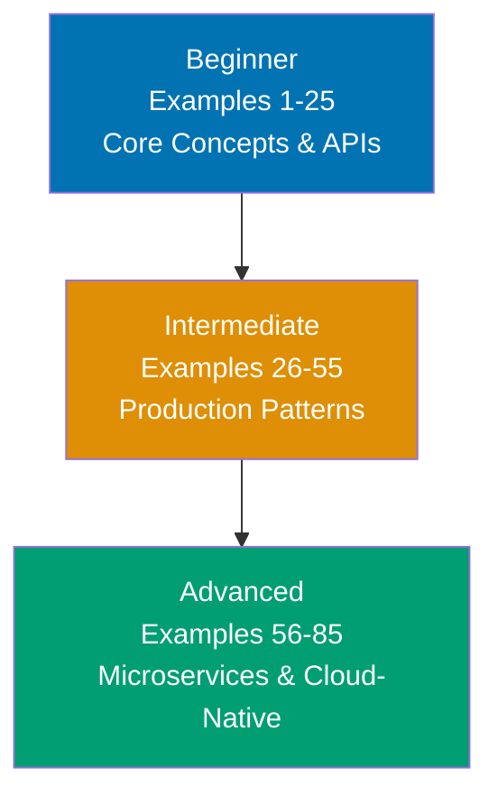

**Want to master Spring Boot through working examples?** This by-example guide teaches 95% of Spring Boot through 75-90 annotated code examples in both Java and Kotlin, organized by complexity level.

## What Is By-Example Learning?

By-example learning is an **example-first approach** where you learn through annotated, runnable code rather than narrative explanations. Each example is self-contained, immediately executable as a Spring Boot application or test class, and heavily commented to show:

- **What each line does** - Inline comments explain annotations, configuration, and framework behavior
- **Expected outputs** - Using `// =>` notation for API responses, log messages, and test assertions
- **Framework mechanics** - How Spring Boot's auto-configuration, dependency injection, and lifecycle work
- **Key takeaways** - 1-2 sentence summaries of patterns and best practices

**Every example is provided in both Java and Kotlin**, allowing you to learn Spring Boot patterns in your preferred JVM language. The examples demonstrate idiomatic code for each language while maintaining conceptual equivalence.

This approach is **ideal for experienced Java or Kotlin developers** who already understand their language's syntax and OOP concepts, and want to quickly master Spring Boot's conventions, annotations, and architectural patterns through working code.

Unlike narrative tutorials that build understanding through explanation and storytelling, by-example learning lets you **see the code first, run it second, and understand it through direct interaction**. You learn Spring Boot patterns by running actual Spring Boot applications.

## What Is Spring Boot?

**Spring Boot** is an opinionated framework built on top of the Spring Framework that simplifies building production-ready applications. While the **Spring Framework** provides core features like dependency injection, transaction management, and data access, **Spring Boot adds**:

- **Auto-configuration** - Automatically configures Spring and third-party libraries based on classpath dependencies
- **Embedded servers** - Tomcat, Jetty, or Undertow embedded in the application JAR
- **Starter dependencies** - Pre-configured dependency sets (spring-boot-starter-web, spring-boot-starter-data-jpa)
- **Production features** - Health checks, metrics, externalized configuration out of the box
- **Convention over configuration** - Sensible defaults that reduce boilerplate XML and Java configuration

**Spring Boot vs. Spring Framework**: Spring Framework requires extensive XML or Java configuration. Spring Boot eliminates this through auto-configuration and starters, letting you build applications with minimal setup. Think of Spring Boot as Spring Framework + sensible defaults + embedded server + production readiness.

## Learning Path



Progress from Spring Boot fundamentals (dependency injection, REST APIs, data access) through production patterns (security, testing, caching) to microservices architecture and observability. Each level builds on the previous, introducing more sophisticated Spring Boot features and real-world patterns.

## Coverage Philosophy

This by-example guide provides **95% coverage of Spring Boot** through practical, annotated examples. The 95% figure represents the depth and breadth of concepts covered, not a time estimate—focus is on **outcomes and understanding**, not duration.

### What's Covered

- **Dependency injection and IoC container** - `@Component`, `@Autowired`, `@Bean`, application context, scopes
- **REST API development** - `@RestController`, `@RequestMapping`, request/response handling, validation
- **Data access with Spring Data JPA** - Entities, repositories, queries, relationships, transactions
- **Spring Security** - Authentication, authorization, JWT tokens, OAuth2, method security
- **Testing** - `@SpringBootTest`, MockMvc, TestContainers, integration testing, mocking
- **Caching and async processing** - `@Cacheable`, `@Async`, task scheduling, event handling
- **Microservices communication** - RestTemplate, WebClient, service discovery, load balancing
- **Observability** - Actuator metrics, distributed tracing, structured logging, health checks
- **Resilience patterns** - Circuit breaker (Resilience4j), retries, rate limiting, bulkheads
- **Production deployment** - Docker containerization, health checks, graceful shutdown, externalized config

### What's NOT Covered

This guide focuses on **Spring Boot essentials and production patterns**, not specialized frameworks or advanced customization. For additional topics:

- **Spring Batch** - Batch processing framework for large-scale data pipelines
- **Spring Integration** - Enterprise integration patterns and messaging
- **Advanced Reactive Programming** - Deep WebFlux, reactive streams, backpressure strategies
- **Spring Cloud exhaustive coverage** - Config Server, Sleuth, Gateway covered at introductory level only
- **Framework internals customization** - Custom auto-configuration, bean post-processors, advanced AOP

The 95% coverage goal maintains humility—no tutorial can cover everything. This guide teaches the **core patterns that unlock the remaining 5%** through your own exploration and Spring documentation.

## How to Use This Guide

1. **Sequential or selective** - Read examples in order for progressive learning, or jump to specific topics when you need to solve a particular problem
2. **Run everything** - Copy examples into your IDE, execute the Spring Boot applications, observe console output and HTTP responses. Experimentation solidifies understanding.
3. **Modify and experiment** - Change annotations, add endpoints, break configurations intentionally. Learn by seeing what happens.
4. **Use as reference** - Bookmark examples for quick lookups when you forget annotation syntax or configuration patterns
5. **Complement with Spring documentation** - By-example learning is code-first; refer to official Spring Boot documentation for deeper architectural explanations and framework internals

**Best workflow**: Open your IDE in one window, this guide in another. Copy each example to a Spring Boot project, run it, inspect the logs and responses. When you encounter unfamiliar annotations, modify the example and observe behavior changes.

## Relationship to Other Tutorials

Understanding where by-example fits in the tutorial ecosystem helps you choose the right learning path:

| Tutorial Type    | Coverage                   | Approach                       | Target Audience             | When to Use                                                 |
| ---------------- | -------------------------- | ------------------------------ | --------------------------- | ----------------------------------------------------------- |
| **By Example**   | 95% through 75-90 examples | Code-first, annotated examples | Experienced Java developers | Quick framework pickup, reference, switching to Spring Boot |
| **Quick Start**  | 5-30% touchpoints          | Hands-on project               | Spring Boot newcomers       | First taste, decide if worth learning                       |
| **Beginner**     | 0-60% comprehensive        | Narrative, explanatory         | New to frameworks           | Deep understanding, first web framework                     |
| **Intermediate** | 60-85%                     | Production applications        | Past basics                 | Production patterns, microservices architecture             |
| **Advanced**     | 85-95%                     | Complex systems                | Experienced Spring devs     | Framework internals, advanced customization                 |
| **Cookbook**     | Problem-oriented           | Recipe, solution-focused       | All levels                  | Specific problems, common tasks                             |

**By Example vs. Quick Start**: By Example provides 95% coverage through isolated examples vs. Quick Start's 5-30% through a single REST API project. By Example is code-first reference; Quick Start is hands-on introduction.

**By Example vs. Beginner Tutorial**: By Example is code-first for experienced Java developers; Beginner Tutorial is narrative-first for framework newcomers. By Example shows patterns; Beginner Tutorial explains Spring Boot architecture.

**By Example vs. Cookbook**: By Example is learning-oriented with progressive examples building framework knowledge. Cookbook is problem-solving oriented with standalone recipes for specific tasks. By Example teaches Spring Boot concepts; Cookbook solves implementation problems.

## Prerequisites

**Required**:

- **Java 17+ or Kotlin 1.9+ installed** - Spring Boot 3.x requires Java 17 minimum or Kotlin 1.9+
- **Maven or Gradle basics** - Understanding of dependency management and build commands (Gradle recommended for Kotlin)
- **Java or Kotlin programming experience** - Comfortable with OOP, collections, streams/sequences, annotations
- **HTTP and REST concepts** - Understanding of HTTP methods, status codes, JSON

**Recommended (helpful but not required)**:

- **Understanding of dependency injection concepts** - Helps grasp Spring's IoC container quickly
- **Basic SQL knowledge** - For Spring Data JPA examples
- **Web application architecture** - MVC pattern, stateless APIs, client-server model

**No prior Spring experience required** - This guide assumes Java competency but teaches Spring Boot from scratch. You don't need to know the Spring Framework's XML configuration or traditional Spring setup. We start with Spring Boot's modern annotation-based approach.

## Learning Strategies

Different developer backgrounds benefit from different learning paths through these examples. Choose the strategy matching your experience:

### For Java Developers New to Spring

You already know Java but haven't used Spring Boot. Focus on understanding Spring's conventions and patterns:

- **Start with dependency injection** (Examples 1-5) - Master `@Component`, `@Autowired`, `@Bean` before moving to REST APIs
- **Focus on annotations** - Spring Boot is annotation-driven; understand `@RestController`, `@Service`, `@Repository` semantics
- **Run every example** - See how auto-configuration works by observing startup logs and bean creation
- **Recommended path**: Examples 1-25 (Beginner) → 26-30 (Security basics) → 31-35 (Testing patterns)

### For Python/Ruby Developers Switching to Java/Spring

You're learning both Java and Spring Boot simultaneously. Expect a steeper learning curve:

- **Master Java syntax first** - Complete Java basics (types, classes, generics, streams) before tackling Spring Boot
- **Understand static typing** - Java's compile-time type checking differs from Python/Ruby's runtime duck typing
- **Focus on Spring's magic** - Auto-configuration and dependency injection replace Django's explicit imports or Rails' conventions
- **Compare patterns** - Map Spring's `@RestController` to Django views or Rails controllers; Spring Data JPA to ActiveRecord
- **Recommended path**: Java fundamentals → Examples 1-10 (Core concepts) → Examples 15-20 (REST APIs) → Examples 40-45 (Database access)

### For C# Developers Coming from .NET

Spring Boot resembles ASP.NET Core. Leverage your .NET knowledge:

- **Map annotations** - `@Autowired` = `[Inject]`, `@RestController` = `[ApiController]`, `@Bean` = service registration
- **Understand differences** - Spring's IoC container works similarly to .NET's DI container; focus on Java-specific patterns
- **Compare ecosystems** - Spring Data JPA similar to Entity Framework; MockMvc similar to WebApplicationFactory testing
- **Skip basics** - You understand MVC, REST, dependency injection; focus on Spring Boot-specific conventions
- **Recommended path**: Examples 1-5 (Spring IoC) → Examples 10-15 (REST patterns) → Examples 25-30 (Spring Security vs ASP.NET Identity)

### For Node.js/Express Developers Switching to JVM

Spring Boot's structure differs significantly from Express. Focus on understanding Spring's opinionated architecture:

- **Understand synchronous by default** - Spring Boot MVC is blocking (thread-per-request); use WebFlux for Express-like async patterns
- **Learn dependency injection** - Spring's IoC container replaces Express's manual require/import and middleware chaining
- **Grasp static typing** - Java requires type declarations; if you know TypeScript, Java will feel familiar but more verbose
- **Focus on Spring conventions** - Spring Boot is more opinionated than Express; learn its structure instead of fighting it
- **Recommended path**: Examples 1-10 (Spring fundamentals) → Examples 15-25 (REST APIs) → Examples 70-75 (WebFlux for async patterns)

### For Complete Framework Beginners

You're new to both Java and web frameworks. Take a methodical, sequential approach:

- **Master Java first** - Complete Java fundamentals (OOP, collections, streams, annotations) before starting Spring Boot
- **Follow sequential order** - Read Examples 1-85 in order; each builds on previous concepts
- **Run every example** - Don't just read; copy-paste into your IDE and run each example to see framework behavior
- **Build small projects** - After completing Beginner examples, build a simple CRUD app to consolidate understanding
- **Use Spring Initializr** - Generate projects via start.spring.io to see proper dependency setup and project structure
- **Recommended path**: Examples 1-25 (Beginner) → Build simple CRUD app → Examples 26-55 (Intermediate) → Build REST API project → Examples 56-85 (Advanced)

## Structure of Each Example

Every example follows this consistent format:

````markdown
### Example N: Concept Name

Brief explanation of the Spring Boot concept in 2-3 sentences. Explains **what** the feature is, **why** Spring Boot provides it, and **when** to use it.

[OPTIONAL: Mermaid diagram when request flow, bean relationships, or architecture needs visualization]

**Code (Java)**:

```java
// Comment explaining what this Spring Boot component does
@RestController
@RequestMapping("/api")
public class ExampleController {

    // Inline comment explaining annotation and dependency injection
    @Autowired
    private ExampleService service;

    @GetMapping("/resource")
    public ResponseEntity<Resource> getResource() {
        Resource resource = service.fetch(); // => Resource{id=1, name="example"}
        return ResponseEntity.ok(resource); // => HTTP 200, JSON response body
    }
}
```

**Code (Kotlin)**:

```kotlin
// Comment explaining what this Spring Boot component does
@RestController
@RequestMapping("/api")
class ExampleController(
    // Constructor injection - Kotlin's concise syntax
    // No @Autowired needed with single constructor
    private val service: ExampleService
) {

    @GetMapping("/resource")
    fun getResource(): ResponseEntity<Resource> {
        val resource = service.fetch() // => Resource(id=1, name="example")
        return ResponseEntity.ok(resource) // => HTTP 200, JSON response body
    }
}
```

**Expected Output**:

```
GET /api/resource => 200 OK
{
  "id": 1,
  "name": "example"
}
```

**Key Takeaway**: 1-2 sentence summary highlighting the Spring Boot pattern, best practice, or architectural insight from this example.
````

The **brief explanation** provides Spring Boot context and motivation. The **code** is heavily annotated with inline comments explaining annotations, auto-configuration behavior, and framework mechanics. The **expected output** shows HTTP responses, console logs, or test assertions. The **key takeaway** distills the pattern to its essence.

Mermaid diagrams appear when **visual representation clarifies request flows, bean lifecycles, or architectural patterns** - showing HTTP request handling, dependency injection graphs, or microservices communication. Not every example needs a diagram; they're used strategically to enhance understanding of Spring Boot's runtime behavior.

## Ready to Start?

Jump into the beginner examples to start learning Spring Boot through code:

- [Beginner Examples (1-25)](/en/learn/software-engineering/platform-web/tools/jvm-spring-boot/by-example/beginner) - Dependency injection, REST controllers, Spring Data JPA, configuration, file handling, CORS
- [Intermediate Examples (26-55)](/en/learn/software-engineering/platform-web/tools/jvm-spring-boot/by-example/intermediate) - Security, testing, caching, async processing, WebSocket, API versioning, advanced patterns
- [Advanced Examples (56-85)](/en/learn/software-engineering/platform-web/tools/jvm-spring-boot/by-example/advanced) - Microservices, Kubernetes, event sourcing, CQRS, API Gateway, performance tuning, observability

Each example is self-contained and runnable as a Spring Boot application or test class. Start with Example 1, or jump to topics that interest you most.
