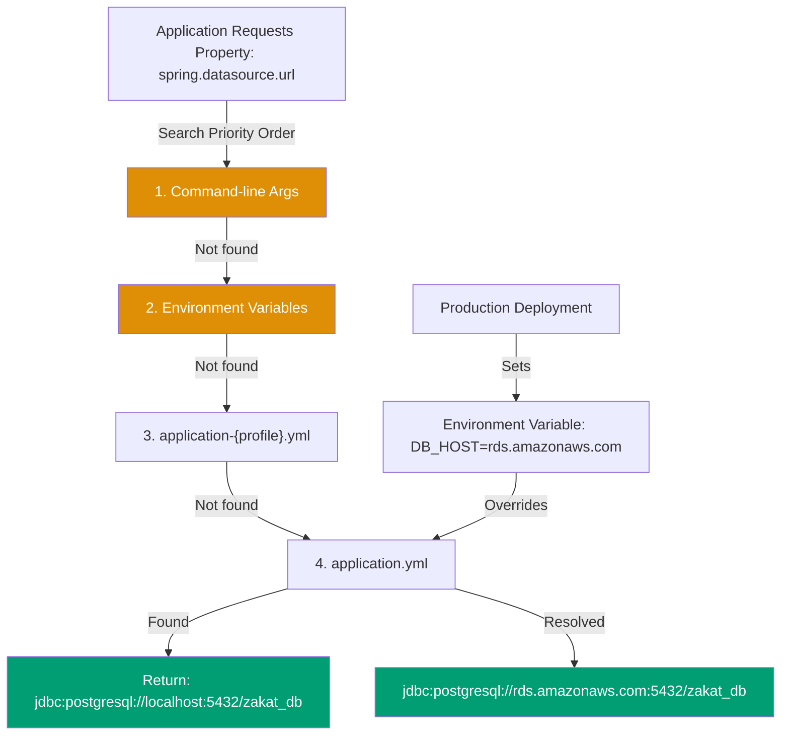

## Why Application Properties Matter

Externalized configuration enables the same application binary to run across development, staging, and production environments with different database URLs, API keys, and feature flags. In production systems, hardcoded configuration causes security vulnerabilities (exposed secrets in version control), inflexible deployments (recompilation for config changes), and environment-specific bugs—Spring Boot's property system provides hierarchical configuration with 15 precedence levels ensuring environment variables and command-line arguments override application defaults.

**Core Benefits**:

- **Environment independence**: Same JAR runs in dev (H2 database) and prod (PostgreSQL)
- **Security**: Secrets via environment variables, not version control
- **Flexibility**: Override any property via command-line without recompilation
- **Profile support**: Different configurations per environment (dev/staging/prod)
- **Type safety**: Property validation and type conversion at startup

**Problem**: Hardcoded configuration ties application to specific environment, preventing portable deployments.

**Solution**: Spring Boot's property hierarchy allows configuration precedence from defaults → profiles → environment variables → command-line arguments.

## Manual Spring Framework Configuration

Traditional Spring requires @PropertySource annotation for properties files:

```java
// => @PropertySource: loads properties from classpath file
@Configuration
@PropertySource("classpath:application.properties")
// => Must explicitly specify property file location
// => No profile support, no YAML support, no precedence hierarchy
public class AppConfig {

    // => @Value: injects property value at runtime
    @Value("${db.url}")  // => Property key from application.properties
    private String dbUrl;  // => Injected value: "jdbc:postgresql://localhost:5432/zakat_db"

    @Value("${db.username}")
    private String dbUsername;

    @Value("${db.password}")
    private String dbPassword;  // => Security risk: password in file tracked by git

    @Bean
    public DataSource dataSource() {
        // => Manual DataSource configuration using injected values
        HikariConfig config = new HikariConfig();
        config.setJdbcUrl(dbUrl);  // => Uses @Value injected property
        config.setUsername(dbUsername);
        config.setPassword(dbPassword);
        return new HikariDataSource(config);
    }
}

// => application.properties: flat key-value pairs
// File: src/main/resources/application.properties
// db.url=jdbc:postgresql://localhost:5432/zakat_db
// db.username=zakat_user
// db.password=secret123  # SECURITY RISK: password in version control!
// zakat.nisab.gold=85
// zakat.rate=0.025
```

**Limitations**:

- **No profiles**: Single properties file, can't have dev/prod variants
- **No hierarchy**: Can't override properties via environment variables
- **Flat structure**: All properties top-level, no nesting (db.url, db.username vs db.url, db.username)
- **No type safety**: All values Strings, must parse manually
- **Security risk**: Sensitive values committed to version control

## Spring Boot Application Properties

Spring Boot provides application.yml with profile support and precedence hierarchy:

```yaml
# => application.yml: hierarchical YAML configuration
# File: src/main/resources/application.yml

# => Default profile: applies to all environments unless overridden
spring:
  application:
    name: zakat-service
    # => Application name used in logs, monitoring, service discovery

  datasource:
    # => ${VAR:default}: environment variable with fallback
    url: jdbc:postgresql://${DB_HOST:localhost}:5432/${DB_NAME:zakat_db}
    # => DB_HOST from environment, fallback to localhost
    # => Production: DB_HOST=rds.amazonaws.com
    # => Development: DB_HOST not set, uses localhost

    username: ${DB_USER:zakat_user} # => Environment variable with default
    password: ${DB_PASSWORD} # => MUST come from environment, no default
    # => Startup fails if DB_PASSWORD not set: prevents insecure defaults

    hikari:
      maximum-pool-size: 10 # => Connection pool size
      connection-timeout: 30000 # => 30 seconds
      idle-timeout: 600000 # => 10 minutes

  jpa:
    show-sql: false # => SQL logging: false (prod), true (dev)
    hibernate:
      ddl-auto: validate # => validate (prod), update (dev), create-drop (test)
    properties:
      hibernate:
        dialect: org.hibernate.dialect.PostgreSQLDialect

# => Custom application properties: zakat calculation configuration
zakat:
  nisab:
    gold: 85 # => 85 grams gold threshold for zakat obligation
    silver: 595 # => 595 grams silver threshold
  rate: 0.025 # => 2.5% zakat rate
  features:
    auto-calculate: true # => Feature flag: enable auto-calculation
    notifications: true # => Feature flag: send zakat notifications
```

**How Spring Boot resolves properties**:



**Trade-offs**:

- **Complexity**: Understanding 15 precedence levels requires learning
- **Debugging**: Hard to determine which property source applied
- **YAML pitfalls**: Indentation errors cause silent property loss
- **Justification**: Worth it for multi-environment deployments (dev/staging/prod)

## Profile-Specific Configuration

Spring Boot supports environment-specific configuration via profiles:

```yaml
# => application.yml: shared defaults across all profiles
spring:
  application:
    name: zakat-service

  datasource:
    url: jdbc:postgresql://${DB_HOST:localhost}:5432/${DB_NAME:zakat_db}
    username: ${DB_USER:zakat_user}
    password: ${DB_PASSWORD}
    hikari:
      maximum-pool-size: 10

---
# => application-dev.yml: development profile overrides
# File: src/main/resources/application-dev.yml
spring:
  config:
    activate:
      on-profile: dev # => Active when --spring.profiles.active=dev

  datasource:
    url: jdbc:h2:mem:zakat_db # => H2 in-memory database for dev
    username: sa
    password: "" # => No password for dev H2 database

  jpa:
    show-sql: true # => Enable SQL logging in development
    hibernate:
      ddl-auto: create-drop # => Recreate schema on startup/shutdown

  h2:
    console:
      enabled: true # => H2 web console at /h2-console

zakat:
  features:
    auto-calculate: false # => Disable auto-calculation in dev for testing

---
# => application-prod.yml: production profile overrides
# File: src/main/resources/application-prod.yml
spring:
  config:
    activate:
      on-profile: prod

  datasource:
    hikari:
      maximum-pool-size: 50 # => Higher pool size for production load
      connection-timeout: 5000 # => Stricter timeout: 5 seconds

  jpa:
    show-sql: false # => Disable SQL logging in production
    hibernate:
      ddl-auto: validate # => Only validate schema, never modify

logging:
  level:
    com.example.zakat: INFO # => Production logging level
    org.hibernate: WARN
  file:
    name: /var/log/zakat-service/application.log # => File logging for prod

zakat:
  features:
    auto-calculate: true
    notifications: true
```

Activate profiles:

```bash
# => Development: activate dev profile
java -jar zakat-service.jar --spring.profiles.active=dev
# => Loads: application.yml + application-dev.yml
# => application-dev.yml overrides application.yml

# => Production: activate prod profile
java -jar zakat-service.jar --spring.profiles.active=prod
# => Loads: application.yml + application-prod.yml
# => Environment variables override application-prod.yml

# => Multiple profiles: comma-separated
java -jar zakat-service.jar --spring.profiles.active=prod,monitoring
# => Loads: application.yml + application-prod.yml + application-monitoring.yml
# => Later profiles override earlier profiles
```

## Property Precedence Hierarchy

Spring Boot resolves properties using 15 precedence levels (highest to lowest):

```java
// => Complete precedence order (highest precedence wins)

// 1. Command-line arguments
// java -jar app.jar --spring.datasource.url=jdbc:postgresql://custom:5432/db
// => Overrides everything else, useful for production overrides

// 2. Java System properties (System.getProperty())
// java -Dspring.datasource.url=jdbc:postgresql://custom:5432/db -jar app.jar
// => Less common, used for JVM-level configuration

// 3. OS environment variables
// export DB_HOST=production-rds.amazonaws.com
// => Production standard: secrets via environment variables
// => Spring Boot converts: DB_HOST → spring.datasource.host

// 4. application-{profile}.properties outside of packaged JAR
// /config/application-prod.properties (in JAR directory)
// => External configuration: update config without rebuilding JAR

// 5. application-{profile}.properties inside packaged JAR
// src/main/resources/application-prod.properties
// => Profile-specific defaults bundled with application

// 6. application.properties outside of packaged JAR
// /config/application.properties
// => External default configuration

// 7. application.properties inside packaged JAR
// src/main/resources/application.properties
// => Bundled default configuration (lowest precedence)

// => Example: How precedence works
// application.yml:        db.url = jdbc:postgresql://localhost:5432/db
// application-prod.yml:   db.url = jdbc:postgresql://prod:5432/db
// Environment variable:   DB_URL = jdbc:postgresql://rds:5432/db
// Command-line:           --db.url=jdbc:postgresql://custom:5432/db
//
// Result with prod profile active + command-line arg:
// db.url = jdbc:postgresql://custom:5432/db (command-line wins)
//
// Result with prod profile active, no command-line:
// db.url = jdbc:postgresql://rds:5432/db (environment variable wins)
//
// Result with prod profile active, no env var or command-line:
// db.url = jdbc:postgresql://prod:5432/db (application-prod.yml wins)
```

Verify active properties:

```java
// => Print resolved properties at startup
@Component
public class PropertyLogger {

    @Value("${spring.datasource.url}")
    private String dbUrl;

    @EventListener(ApplicationReadyEvent.class)
    public void logProperties() {
        // => Logs resolved property after all precedence applied
        System.out.println("Resolved DB URL: " + dbUrl);
        // => Production output: "Resolved DB URL: jdbc:postgresql://rds:5432/db"
    }
}
```

## Environment Variable Mapping

Spring Boot converts environment variables to property names:

```bash
# => Environment variable naming conventions

# 1. Uppercase with underscores → lowercase with dots
export SPRING_DATASOURCE_URL="jdbc:postgresql://prod:5432/db"
# => Maps to: spring.datasource.url

# 2. Numbers preserved
export SPRING_DATASOURCE_HIKARI_MAXIMUM_POOL_SIZE=50
# => Maps to: spring.datasource.hikari.maximum-pool-size

# 3. Complex property paths
export ZAKAT_FEATURES_AUTO_CALCULATE=true
# => Maps to: zakat.features.auto-calculate

# 4. Kebab-case preserved
export SPRING_DATA_REDIS_CLUSTER_NODES="node1:6379,node2:6379"
# => Maps to: spring.data.redis.cluster.nodes

# => Production deployment with environment variables
export DB_HOST=production-rds.amazonaws.com
export DB_NAME=zakat_prod_db
export DB_USER=prod_user
export DB_PASSWORD=prod_secret_from_secrets_manager
export SPRING_PROFILES_ACTIVE=prod
java -jar zakat-service.jar

# => Resolved properties:
# spring.datasource.url = jdbc:postgresql://production-rds.amazonaws.com:5432/zakat_prod_db
# spring.datasource.username = prod_user
# spring.datasource.password = prod_secret_from_secrets_manager
```

## Property Validation

Spring Boot validates properties at startup:

```java
// => @ConfigurationProperties with validation
@ConfigurationProperties(prefix = "zakat")
@Validated  // => Enable JSR-380 validation
public class ZakatProperties {

    @NotNull  // => Required: startup fails if zakat.nisab.gold missing
    @Min(1)  // => Must be positive: startup fails if <= 0
    private BigDecimal nisabGold;

    @NotNull
    @DecimalMin(value = "0.0", inclusive = false)
    @DecimalMax(value = "1.0", inclusive = true)
    private BigDecimal rate;  // => Must be 0 < rate <= 1

    @NotEmpty  // => Required: must have at least one feature
    private Map<String, Boolean> features;

    // => Nested configuration: validates nested objects
    @Valid  // => Enable validation for nested object
    private NotificationConfig notification;

    public static class NotificationConfig {
        @Email  // => Must be valid email format
        private String adminEmail;

        @Pattern(regexp = "^https://.*")  // => Must start with https://
        private String webhookUrl;

        // getters/setters
    }

    // getters/setters
}

// => Startup validation failure example
// application.yml with invalid configuration:
zakat:
  nisab:
    gold: -10  # INVALID: negative value
  rate: 1.5  # INVALID: > 1.0

// => Application startup fails with clear error:
// ***************************
// APPLICATION FAILED TO START
// ***************************
//
// Description:
// Binding to target org.springframework.boot.context.properties.bind.BindException:
// Failed to bind properties under 'zakat' to ZakatProperties:
//
//     Property: zakat.nisabGold
//     Value: -10
//     Reason: must be greater than or equal to 1
//
//     Property: zakat.rate
//     Value: 1.5
//     Reason: must be less than or equal to 1.0
```

## Configuration Encryption

Sensitive properties should be encrypted or retrieved from secret managers:

```yaml
# => Jasypt: property encryption in application.yml
# Add jasypt-spring-boot-starter dependency

spring:
  datasource:
    password: ENC(encrypted_password_here)
    # => Encrypted using jasypt-maven-plugin or CLI
    # => Decrypted at runtime using master password

# => Master password via environment variable
# export JASYPT_ENCRYPTOR_PASSWORD=master_secret
# java -jar zakat-service.jar

# => AWS Secrets Manager integration (Spring Cloud AWS)
spring:
  cloud:
    aws:
      secretsmanager:
        enabled: true
        region: us-east-1

  datasource:
    password: ${sm://zakat-db-password}
    # => sm:// prefix: fetch from AWS Secrets Manager
    # => Spring Cloud AWS resolves: secretsmanager.getSecretValue("zakat-db-password")

# => HashiCorp Vault integration (Spring Cloud Vault)
spring:
  cloud:
    vault:
      uri: https://vault.example.com:8200
      token: ${VAULT_TOKEN}
      kv:
        enabled: true
        backend: secret

  datasource:
    password: ${vault://secret/zakat-service/db-password}
    # => vault:// prefix: fetch from Vault KV store
```

## Property Source Loading Order

Spring Boot loads property files in specific order:

```java
// => Property file search locations (searched in order)

// 1. /config subdirectory of current directory
// ./config/application.yml
// => Production deployments: external config alongside JAR

// 2. Current directory
// ./application.yml

// 3. Classpath /config package
// src/main/resources/config/application.yml

// 4. Classpath root
// src/main/resources/application.yml
// => Standard location for bundled configuration

// => Profile-specific files loaded AFTER default files
// Load order with prod profile active:
// 1. application.yml (classpath)
// 2. application-prod.yml (classpath)
// 3. application.yml (current directory)
// 4. application-prod.yml (current directory)
// 5. application.yml (./config/)
// 6. application-prod.yml (./config/)

// => Custom property source locations
java -jar zakat-service.jar --spring.config.location=file:/etc/zakat/config.yml
// => Replaces default locations with custom path

java -jar zakat-service.jar --spring.config.additional-location=file:/etc/zakat/
// => Adds additional location to default search paths
```

## Best Practices

```yaml
# => Good: Environment-aware defaults with overrides
spring:
  datasource:
    url: jdbc:postgresql://${DB_HOST:localhost}:5432/${DB_NAME:zakat_db}
    # => Default works for dev, production sets DB_HOST environment variable

# => Bad: Hardcoded production values
spring:
  datasource:
    url: jdbc:postgresql://prod-rds.amazonaws.com:5432/zakat_db
    # => Can't run locally, can't test with different databases

# => Good: Required secrets without defaults
spring:
  datasource:
    password: ${DB_PASSWORD}
    # => Startup fails if not set: prevents insecure defaults

# => Bad: Default passwords
spring:
  datasource:
    password: ${DB_PASSWORD:admin123}
    # => Security risk: default password might reach production

# => Good: Feature flags for gradual rollout
zakat:
  features:
    new-calculation-engine: ${FEATURE_NEW_CALC:false}
    # => Default disabled, enable per environment

# => Good: Profile-specific sensitive configuration
---
spring:
  config:
    activate:
      on-profile: prod

  datasource:
    hikari:
      maximum-pool-size: 50
    # => Production-specific tuning, not in default profile

# => Bad: Sensitive data in version control
spring:
  datasource:
    password: prod_secret_123
    # => Never commit secrets to git
```

## When to Use application.yml vs Environment Variables

**Use application.yml**:

- Default values safe for version control
- Non-sensitive configuration (pool sizes, timeouts)
- Feature flags with sensible defaults
- Profile-specific defaults (dev/staging/prod)

**Use environment variables**:

- Secrets (database passwords, API keys, tokens)
- Environment-specific values (database hosts, external service URLs)
- Runtime overrides (scaling parameters, feature flags)
- Kubernetes ConfigMaps and Secrets

**Production recommendation**: Store defaults in application.yml, override secrets and environment-specific values via environment variables. Never commit passwords to version control.

## Related Patterns

- **[Configuration Properties](/en/learn/software-engineering/platform-web/tools/jvm-spring-boot/in-the-field/configuration-properties)** - Type-safe configuration binding with @ConfigurationProperties
- **[Auto-Configuration](/en/learn/software-engineering/platform-web/tools/jvm-spring-boot/in-the-field/auto-configuration)** - How application.yml properties trigger auto-configuration
- **[Spring Boot DevTools](/en/learn/software-engineering/platform-web/tools/jvm-spring-boot/in-the-field/spring-boot-devtools)** - LiveReload and fast application restarts
