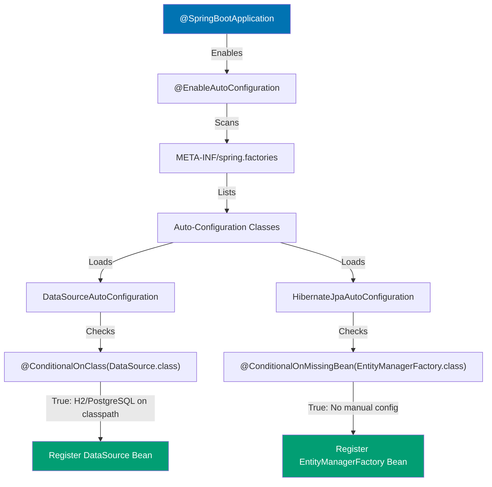

## Why Auto-Configuration Matters

Spring Boot auto-configuration eliminates hundreds of lines of boilerplate configuration by automatically detecting classpath dependencies and configuring beans accordingly. In production systems with dozens of Spring modules (Data JPA, Security, Actuator, Redis, Kafka), manual @Configuration classes become unmaintainable—auto-configuration enables teams to focus on business logic instead of infrastructure wiring.

**Core Benefits**:

- **Eliminates boilerplate**: No manual DataSource, EntityManagerFactory, or TransactionManager configuration
- **Classpath-aware**: Automatically configures H2 for tests, PostgreSQL for production
- **Convention over configuration**: Sensible defaults work immediately, override only when needed
- **Production-ready**: Auto-configured beans follow Spring best practices (connection pooling, transaction management)
- **Maintainable**: Centralized configuration logic, not scattered across projects

**Problem**: Manual Spring configuration requires explicit @Bean methods for every infrastructure component.

**Solution**: Spring Boot auto-configuration automatically registers beans based on classpath presence and @Conditional annotations.

## Manual Spring Framework Configuration

Spring Framework requires explicit @Configuration classes for all infrastructure:

```java
// => Manual DataSource configuration: verbose, error-prone
@Configuration
public class DatabaseConfig {

    // => Manually configure HikariCP connection pool
    @Bean
    public DataSource dataSource() {
        HikariConfig config = new HikariConfig();
        // => Hardcoded JDBC URL: not environment-aware
        config.setJdbcUrl("jdbc:postgresql://localhost:5432/zakat_db");
        config.setUsername("zakat_user");  // => Hardcoded credentials: security risk
        config.setPassword("secret123");
        config.setMaximumPoolSize(10);  // => Manual pool tuning
        config.setConnectionTimeout(30000);
        return new HikariDataSource(config);  // => Returns connection pool
    }

    // => Manually configure JPA EntityManagerFactory
    @Bean
    public LocalContainerEntityManagerFactoryBean entityManagerFactory(
            DataSource dataSource) {
        // => Hibernate setup: requires knowledge of Hibernate internals
        LocalContainerEntityManagerFactoryBean em =
            new LocalContainerEntityManagerFactoryBean();
        em.setDataSource(dataSource);  // => Wire DataSource manually
        em.setPackagesToScan("com.example.zakat.entity");  // => Entity scanning

        // => Hibernate provider configuration
        JpaVendorAdapter vendorAdapter = new HibernateJpaVendorAdapter();
        em.setJpaVendorAdapter(vendorAdapter);

        // => Hibernate properties: dialect, DDL, SQL logging
        Properties properties = new Properties();
        properties.setProperty("hibernate.dialect",
            "org.hibernate.dialect.PostgreSQLDialect");
        properties.setProperty("hibernate.hbm2ddl.auto", "validate");
        properties.setProperty("hibernate.show_sql", "false");
        em.setJpaProperties(properties);

        return em;  // => Returns EntityManagerFactory
    }

    // => Manually configure JPA TransactionManager
    @Bean
    public PlatformTransactionManager transactionManager(
            EntityManagerFactory entityManagerFactory) {
        // => JpaTransactionManager: requires EntityManagerFactory
        JpaTransactionManager transactionManager =
            new JpaTransactionManager();
        transactionManager.setEntityManagerFactory(entityManagerFactory);
        return transactionManager;  // => Returns transaction manager
    }
}

// => Repository requires manual EntityManager injection
@Repository
public class ZakatDonationRepository {
    private final EntityManager entityManager;

    public ZakatDonationRepository(EntityManager entityManager) {
        this.entityManager = entityManager;
    }

    // => Manual JPQL query: no Spring Data repository abstraction
    public List<ZakatDonation> findByDonor(String donorName) {
        // => JPQL query string: type-unsafe, no compile-time checks
        return entityManager
            .createQuery("SELECT d FROM ZakatDonation d WHERE d.donorName = :name",
                ZakatDonation.class)
            .setParameter("name", donorName)
            .getResultList();
    }
}
```

**Limitations**:

- **Verbose**: 50+ lines of configuration for basic JPA setup
- **Error-prone**: Typos in property names ("hibernate.dialekt") fail at runtime
- **Not environment-aware**: Hardcoded database URLs don't work across dev/test/prod
- **No sensible defaults**: Must specify every Hibernate property explicitly
- **Duplication**: Every project needs identical configuration code

## Spring Boot Auto-Configuration

Spring Boot detects `spring-boot-starter-data-jpa` on classpath and automatically configures DataSource, EntityManagerFactory, and TransactionManager:

```java
// => application.yml: externalized configuration, environment-aware
// => Spring Boot reads these properties and auto-configures beans
spring:
  datasource:
    url: jdbc:postgresql://${DB_HOST:localhost}:5432/zakat_db
    # => ${DB_HOST:localhost}: environment variable with fallback
    # => Different per environment: localhost (dev), RDS endpoint (prod)
    username: ${DB_USER:zakat_user}  # => Externalized credentials
    password: ${DB_PASSWORD}  # => From environment variable or secrets manager
    hikari:
      maximum-pool-size: 10  # => HikariCP configuration
      connection-timeout: 30000
  jpa:
    hibernate:
      ddl-auto: validate  # => validate (prod), update (dev)
    show-sql: false  # => SQL logging: true (dev), false (prod)
    properties:
      hibernate:
        dialect: org.hibernate.dialect.PostgreSQLDialect
        # => Auto-detected from JDBC URL, explicit config for edge cases

# => Repository uses Spring Data JPA: no manual EntityManager
@Repository
public interface ZakatDonationRepository
        extends JpaRepository<ZakatDonation, Long> {

    // => Spring Data generates implementation automatically
    // => Method name parsed: findBy + DonorName = WHERE donorName = ?
    List<ZakatDonation> findByDonorName(String donorName);

    // => Query derivation: no JPQL required for simple queries
    // => Spring Data JPA generates:
    // => SELECT * FROM zakat_donation WHERE donor_name = ?
}

// => @SpringBootApplication enables auto-configuration
@SpringBootApplication  // => Combines @Configuration, @EnableAutoConfiguration, @ComponentScan
                        // => Triggers classpath scanning for @Configuration classes
                        // => Activates auto-configuration based on dependencies
public class ZakatApplication {
    public static void main(String[] args) {
        SpringApplication.run(ZakatApplication.class, args);
        // => SpringApplication.run():
        // => 1. Creates ApplicationContext
        // => 2. Scans classpath for spring-boot-starter-* dependencies
        // => 3. Loads META-INF/spring.factories from JARs
        // => 4. Applies @Conditional checks (e.g., @ConditionalOnClass)
        // => 5. Registers auto-configured beans (DataSource, EntityManagerFactory)
        // => 6. Starts embedded Tomcat server
    }
}
```

**How auto-configuration works**:



**Trade-offs**:

- **Adds complexity**: Auto-configuration logic hidden in Spring Boot internals
- **Learning curve**: Understanding @Conditional annotations and spring.factories
- **Debugging difficulty**: Need to know which auto-configuration activated
- **Justification**: Worth it for projects using multiple Spring modules (>3 starters)

## Understanding @Conditional Annotations

Spring Boot uses @Conditional annotations to enable/disable auto-configuration:

```java
// => DataSourceAutoConfiguration: auto-configures DataSource bean
@Configuration
@ConditionalOnClass(DataSource.class)  // => Only if DataSource on classpath
                                        // => Spring Boot starter adds JDBC driver
public class DataSourceAutoConfiguration {

    // => HikariCP DataSource: only if no custom DataSource defined
    @Bean
    @ConditionalOnMissingBean(DataSource.class)  // => Allows manual override
                                                  // => If user defines @Bean DataSource,
                                                  // => this auto-config skipped
    public DataSource dataSource(DataSourceProperties properties) {
        // => DataSourceProperties: bound from spring.datasource.* properties
        // => Spring Boot reads application.yml and populates this object
        return properties.initializeDataSourceBuilder()
            .type(HikariDataSource.class)  // => Default: HikariCP (fastest pool)
            .build();
        // => HikariDataSource configured from properties:
        // => url, username, password, hikari.maximum-pool-size, etc.
    }
}

// => Common @Conditional annotations
@ConditionalOnClass(DataSource.class)  // => If class exists on classpath
@ConditionalOnMissingBean(DataSource.class)  // => If bean NOT defined
@ConditionalOnProperty(name = "spring.datasource.enabled", havingValue = "true")
// => If property set to specific value
@ConditionalOnResource(resources = "classpath:data.sql")  // => If file exists
@ConditionalOnWebApplication  // => If web app (spring-boot-starter-web)
@ConditionalOnExpression("${feature.enabled:false}")  // => SpEL expression
```

## Debugging Auto-Configuration

Spring Boot provides tools to understand which auto-configurations activated:

```java
// => Enable debug logging in application.yml
logging:
  level:
    org.springframework.boot.autoconfigure: DEBUG
    # => Logs all auto-configuration decisions:
    # => "Positive matches" (activated auto-configs)
    # => "Negative matches" (skipped auto-configs with reasons)

// => Run with --debug flag
// java -jar zakat-app.jar --debug
// => Prints auto-configuration report:
// ============================
// CONDITIONS EVALUATION REPORT
// ============================
//
// Positive matches:
// -----------------
//
//    DataSourceAutoConfiguration matched:
//       - @ConditionalOnClass found required class 'javax.sql.DataSource'
//       - @ConditionalOnMissingBean (types: javax.sql.DataSource) found no beans
//
// Negative matches:
// -----------------
//
//    MongoAutoConfiguration:
//       Did not match:
//          - @ConditionalOnClass did not find required class
//            'com.mongodb.client.MongoClient'

// => Use Actuator /conditions endpoint (production debugging)
@SpringBootApplication
public class ZakatApplication {
    // => Add spring-boot-starter-actuator dependency
    // => Exposes /actuator/conditions endpoint showing all auto-config decisions
}

// GET /actuator/conditions returns:
// {
//   "contexts": {
//     "application": {
//       "positiveMatches": {
//         "DataSourceAutoConfiguration": [
//           {
//             "condition": "OnClassCondition",
//             "message": "@ConditionalOnClass found required class 'javax.sql.DataSource'"
//           }
//         ]
//       },
//       "negativeMatches": {
//         "MongoAutoConfiguration": [
//           {
//             "condition": "OnClassCondition",
//             "message": "@ConditionalOnClass did not find required class
//                         'com.mongodb.client.MongoClient'"
//           }
//         ]
//       }
//     }
//   }
// }
```

## Creating Custom Auto-Configuration

Production libraries can provide their own auto-configuration:

```java
// => Custom auto-configuration for Zakat calculation service
@Configuration
@ConditionalOnClass(ZakatCalculator.class)  // => Only if ZakatCalculator on classpath
@EnableConfigurationProperties(ZakatProperties.class)  // => Bind zakat.* properties
public class ZakatAutoConfiguration {

    // => Auto-configure ZakatCalculator bean
    @Bean
    @ConditionalOnMissingBean  // => Allow manual override
    public ZakatCalculator zakatCalculator(ZakatProperties properties) {
        // => ZakatProperties: type-safe configuration binding
        return new ZakatCalculator(
            properties.getNisabGrams(),  // => From zakat.nisab-grams
            properties.getRate()  // => From zakat.rate
        );
    }
}

// => Type-safe configuration properties
@ConfigurationProperties(prefix = "zakat")  // => Binds zakat.* properties
public class ZakatProperties {
    private BigDecimal nisabGrams = new BigDecimal("85");  // => Default: 85 grams gold
    private BigDecimal rate = new BigDecimal("0.025");  // => Default: 2.5%

    // => Getters/setters for property binding
    public BigDecimal getNisabGrams() { return nisabGrams; }
    public void setNisabGrams(BigDecimal nisabGrams) {
        this.nisabGrams = nisabGrams;
    }
    public BigDecimal getRate() { return rate; }
    public void setRate(BigDecimal rate) { this.rate = rate; }
}

// => Register auto-configuration in META-INF/spring.factories
// src/main/resources/META-INF/spring.factories:
// org.springframework.boot.autoconfigure.EnableAutoConfiguration=\
// com.example.zakat.autoconfigure.ZakatAutoConfiguration
// => Spring Boot scans this file during startup
// => Loads ZakatAutoConfiguration if @Conditional checks pass

// => Users consume library by adding dependency + configuration
// => pom.xml:
// <dependency>
//   <groupId>com.example</groupId>
//   <artifactId>zakat-spring-boot-starter</artifactId>
//   <version>1.0.0</version>
// </dependency>

// => application.yml:
// zakat:
//   nisab-grams: 85  # => Overrides default
//   rate: 0.025
// => ZakatCalculator bean automatically available in ApplicationContext
```

## When to Use Manual Configuration vs Auto-Configuration

**Use Spring Boot auto-configuration**:

- Standard Spring starters (Data JPA, Security, Web, Redis, Kafka)
- Default configuration sufficient (can override via application.yml)
- Rapid development, convention over configuration
- Team lacks Spring expertise (auto-config provides best practices)

**Use manual @Configuration**:

- Non-standard requirements (custom connection pooling logic)
- Multiple DataSources with complex routing
- Custom bean initialization requiring programmatic control
- Testing scenarios requiring specific bean configurations

**Production recommendation**: Use auto-configuration as default, add manual @Configuration only when auto-config insufficient. Override auto-configured beans by defining @Bean with same name.

## Common Auto-Configuration Patterns

```java
// => Disable specific auto-configurations
@SpringBootApplication(exclude = {
    DataSourceAutoConfiguration.class,  // => Disable DataSource auto-config
    SecurityAutoConfiguration.class  // => Disable Spring Security auto-config
})
public class ZakatApplication { }

// => Conditional bean registration based on profile
@Configuration
public class ProfileSpecificConfig {

    @Bean
    @Profile("dev")  // => Only in dev profile
    public DataSource devDataSource() {
        return new EmbeddedDatabaseBuilder()
            .setType(EmbeddedDatabaseType.H2)
            .build();  // => H2 in-memory database for development
    }

    @Bean
    @Profile("prod")  // => Only in prod profile
    public DataSource prodDataSource() {
        // => Production PostgreSQL with connection pooling
        HikariConfig config = new HikariConfig();
        config.setJdbcUrl(System.getenv("DATABASE_URL"));
        config.setMaximumPoolSize(50);  // => Higher pool for production
        return new HikariDataSource(config);
    }
}

// => Custom @Conditional annotation
@Target({ ElementType.TYPE, ElementType.METHOD })
@Retention(RetentionPolicy.RUNTIME)
@Conditional(OnZakatEnabledCondition.class)
public @interface ConditionalOnZakatEnabled {
}

public class OnZakatEnabledCondition implements Condition {
    @Override
    public boolean matches(ConditionContext context,
                          AnnotatedTypeMetadata metadata) {
        // => Custom logic: enable zakat features only if property set
        String enabled = context.getEnvironment()
            .getProperty("zakat.enabled", "false");
        return Boolean.parseBoolean(enabled);
    }
}

@Configuration
public class ConditionalConfig {

    @Bean
    @ConditionalOnZakatEnabled  // => Custom conditional annotation
    public ZakatService zakatService() {
        return new ZakatService();
    }
}
```

## Related Patterns

- **[Dependency Injection](/en/learn/software-engineering/platform-web/tools/jvm-spring/in-the-field/dependency-injection)** - Spring Framework IoC container foundation for auto-configuration
- **[Configuration Properties](/en/learn/software-engineering/platform-web/tools/jvm-spring-boot/in-the-field/configuration-properties)** - Type-safe configuration binding with @ConfigurationProperties
- **[Starter Dependencies](/en/learn/software-engineering/platform-web/tools/jvm-spring-boot/in-the-field/starter-dependencies)** - Pre-configured dependency bundles triggering auto-configuration
- **[Application Properties](/en/learn/software-engineering/platform-web/tools/jvm-spring-boot/in-the-field/application-properties)** - Externalized configuration with profiles and precedence
