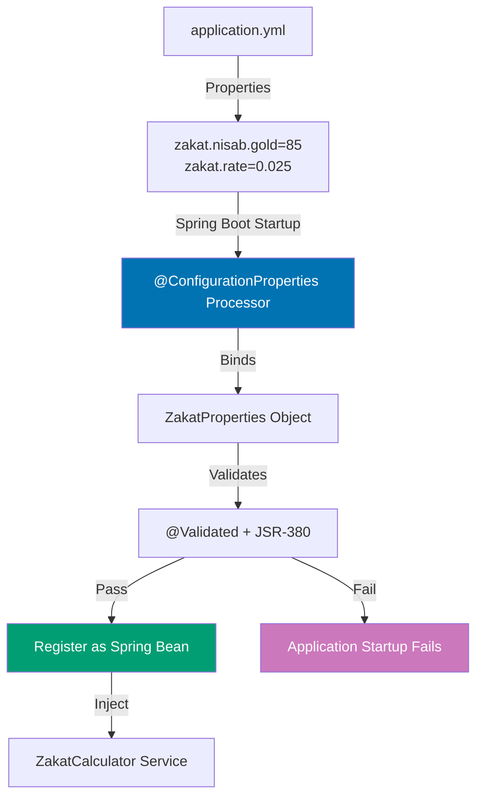

## Why Configuration Properties Matter

Type-safe configuration binding with @ConfigurationProperties prevents runtime errors from typos, invalid types, and missing properties by validating configuration at application startup. In production systems with 50+ configuration properties across multiple modules, @Value annotations become unmaintainable—@ConfigurationProperties provides centralized, validated, IDE-supported configuration objects that fail fast at startup rather than silently during request handling.

**Core Benefits**:

- **Type safety**: Compile-time checks for property names and types
- **IDE support**: Autocomplete and navigation for configuration properties
- **Validation**: JSR-380 validation ensures valid configuration at startup
- **Centralized configuration**: Single class per configuration namespace
- **Refactoring safety**: Rename properties via IDE refactoring

**Problem**: @Value annotations scatter configuration throughout codebase, provide no type safety, and fail silently at runtime.

**Solution**: @ConfigurationProperties binds external configuration to strongly-typed POJOs with validation.

## Manual @Value Injection

Spring Framework requires @Value annotations for each property:

```java
// => @Value: injects individual property values
@Component
public class ZakatCalculator {

    // => @Value injects string from application.properties
    @Value("${zakat.nisab.gold}")  // => Property key: zakat.nisab.gold
    private BigDecimal nisabGold;  // => Type conversion: String → BigDecimal
    // => Runtime error if property missing or invalid format

    @Value("${zakat.nisab.silver}")
    private BigDecimal nisabSilver;

    @Value("${zakat.rate}")
    private BigDecimal rate;

    @Value("${zakat.features.auto-calculate}")
    private boolean autoCalculate;  // => String → boolean conversion

    @Value("${zakat.features.notifications}")
    private boolean notifications;

    // => Constructor injection: @Value in parameters
    public ZakatCalculator(
        @Value("${zakat.grace-period-days}") int gracePeriod,
        @Value("${zakat.notification.email}") String notificationEmail) {
        // => Must repeat @Value for every injected property
    }

    public BigDecimal calculate(BigDecimal goldGrams) {
        // => Uses injected configuration values
        if (goldGrams.compareTo(nisabGold) >= 0) {
            return goldGrams.multiply(rate);
        }
        return BigDecimal.ZERO;
    }
}

// => application.properties: flat key-value pairs
// zakat.nisab.gold=85
// zakat.nisab.silver=595
// zakat.rate=0.025
// zakat.features.auto-calculate=true
// zakat.features.notifications=true
// zakat.grace-period-days=30
// zakat.notification.email=admin@example.com
```

**Limitations**:

- **No type safety**: Typos in property names fail at runtime, not compile-time
- **Scattered configuration**: @Value annotations throughout codebase
- **No validation**: Invalid values (negative numbers, invalid emails) cause runtime errors
- **No IDE support**: No autocomplete for property names
- **Poor refactoring**: Renaming properties requires text search-and-replace

## @ConfigurationProperties Approach

Spring Boot provides @ConfigurationProperties for type-safe configuration binding:

```java
// => @ConfigurationProperties: binds properties to POJO
@ConfigurationProperties(prefix = "zakat")
// => Binds all properties starting with "zakat."
// => Spring Boot maps: zakat.nisab.gold → nisabGold field
// => Supports relaxed binding: zakat.nisab-gold or ZAKAT_NISAB_GOLD

@Validated  // => Enable JSR-380 validation at startup
public class ZakatProperties {

    // => Nested configuration object: zakat.nisab.*
    @Valid  // => Validate nested object
    private Nisab nisab = new Nisab();

    // => Simple property: zakat.rate
    @NotNull  // => Validation: startup fails if missing
    @DecimalMin(value = "0.0", inclusive = false)
    @DecimalMax(value = "1.0", inclusive = true)
    private BigDecimal rate;  // => Must be 0 < rate <= 1

    // => Feature flags: zakat.features.*
    private Features features = new Features();

    // => Notification configuration: zakat.notification.*
    @Valid
    private Notification notification = new Notification();

    // => Duration property: zakat.grace-period
    @DurationUnit(ChronoUnit.DAYS)  // => Parse as days
    private Duration gracePeriod;  // => Supports: 30d, 2w, 1M
    // => Spring Boot converts: "30d" → Duration.ofDays(30)

    // => Nested class: zakat.nisab.*
    public static class Nisab {
        @NotNull
        @Min(1)  // => Must be positive
        private BigDecimal gold = new BigDecimal("85");  // => Default value

        @NotNull
        @Min(1)
        private BigDecimal silver = new BigDecimal("595");

        // => Getters/setters required for property binding
        public BigDecimal getGold() { return gold; }
        public void setGold(BigDecimal gold) { this.gold = gold; }
        public BigDecimal getSilver() { return silver; }
        public void setSilver(BigDecimal silver) { this.silver = silver; }
    }

    // => Nested class: zakat.features.*
    public static class Features {
        private boolean autoCalculate = true;  // => Default: true
        private boolean notifications = true;

        public boolean isAutoCalculate() { return autoCalculate; }
        public void setAutoCalculate(boolean autoCalculate) {
            this.autoCalculate = autoCalculate;
        }
        public boolean isNotifications() { return notifications; }
        public void setNotifications(boolean notifications) {
            this.notifications = notifications;
        }
    }

    // => Nested class: zakat.notification.*
    public static class Notification {
        @Email  // => Validation: must be valid email format
        private String email;

        @Pattern(regexp = "^https://.*")  // => Validation: must be HTTPS URL
        private String webhookUrl;

        public String getEmail() { return email; }
        public void setEmail(String email) { this.email = email; }
        public String getWebhookUrl() { return webhookUrl; }
        public void setWebhookUrl(String webhookUrl) {
            this.webhookUrl = webhookUrl;
        }
    }

    // => Getters/setters for top-level properties
    public Nisab getNisab() { return nisab; }
    public void setNisab(Nisab nisab) { this.nisab = nisab; }
    public BigDecimal getRate() { return rate; }
    public void setRate(BigDecimal rate) { this.rate = rate; }
    public Features getFeatures() { return features; }
    public void setFeatures(Features features) { this.features = features; }
    public Notification getNotification() { return notification; }
    public void setNotification(Notification notification) {
        this.notification = notification;
    }
    public Duration getGracePeriod() { return gracePeriod; }
    public void setGracePeriod(Duration gracePeriod) {
        this.gracePeriod = gracePeriod;
    }
}

// => Enable @ConfigurationProperties scanning
@SpringBootApplication
@EnableConfigurationProperties(ZakatProperties.class)
// => Registers ZakatProperties as Spring bean
// => Spring Boot binds properties from application.yml at startup
public class ZakatApplication {
    public static void main(String[] args) {
        SpringApplication.run(ZakatApplication.class, args);
    }
}

// => Inject ZakatProperties like any Spring bean
@Service
public class ZakatCalculator {
    private final ZakatProperties properties;

    // => Constructor injection: ZakatProperties is a Spring bean
    public ZakatCalculator(ZakatProperties properties) {
        this.properties = properties;
        // => properties.getNisab().getGold() → 85
        // => properties.getRate() → 0.025
    }

    public BigDecimal calculate(BigDecimal goldGrams) {
        // => Type-safe access: no string keys, compile-time checks
        BigDecimal nisabGold = properties.getNisab().getGold();
        BigDecimal rate = properties.getRate();

        if (goldGrams.compareTo(nisabGold) >= 0) {
            return goldGrams.multiply(rate);
        }
        return BigDecimal.ZERO;
    }
}
```

**How @ConfigurationProperties binding works**:



**Trade-offs**:

- **Boilerplate**: Requires getter/setter methods for property binding
- **Learning curve**: Understanding relaxed binding and nested properties
- **Verbosity**: Separate class for configuration vs inline @Value
- **Justification**: Worth it for projects with >10 configuration properties

## Relaxed Binding

Spring Boot supports multiple property naming formats:

```yaml
# => application.yml: various naming formats (all equivalent)

# 1. Kebab-case (recommended for YAML)
zakat:
  nisab-gold: 85
  # => Maps to: nisabGold field

# 2. Camel-case
zakat:
  nisabGold: 85
  # => Maps to: nisabGold field

# 3. Snake_case
zakat:
  nisab_gold: 85
  # => Maps to: nisabGold field

# 4. Uppercase with underscores (environment variables)
# Environment variable: ZAKAT_NISAB_GOLD=85
# => Maps to: nisabGold field

# => All four formats bind to the same field:
# private BigDecimal nisabGold;
```

**Relaxed binding rules**:

```java
// => Java field name: gracePeriod
private Duration gracePeriod;

// => Accepted property formats:
// zakat.grace-period        ← Kebab-case (recommended)
// zakat.gracePeriod         ← Camel-case
// zakat.grace_period        ← Snake-case
// ZAKAT_GRACE_PERIOD        ← Environment variable

// => Best practice: Use kebab-case in YAML, uppercase for env vars
```

## Type Conversion and Complex Types

Spring Boot automatically converts property values to Java types:

```java
@ConfigurationProperties(prefix = "zakat")
public class ZakatProperties {

    // => Duration: automatic conversion from string
    private Duration gracePeriod;  // => "30d" → Duration.ofDays(30)
    // => Supported formats: 2s, 30m, 24h, 7d, 2w

    // => DataSize: automatic conversion from string
    private DataSize maxUploadSize;  // => "10MB" → DataSize.ofMegabytes(10)
    // => Supported formats: 100B, 10KB, 5MB, 2GB

    // => Period: automatic conversion from string
    private Period retentionPeriod;  // => "P1Y2M3D" → Period (ISO-8601)

    // => List: comma-separated values
    private List<String> allowedCountries;
    // => "US,UK,ID" → List.of("US", "UK", "ID")

    // => Map: key-value pairs
    private Map<String, BigDecimal> currencyRates;
    // => YAML: currencyRates: { USD: 1.0, IDR: 15000.0 }

    // => Set: unique values
    private Set<String> supportedLanguages;
    // => "en,id,ar" → Set.of("en", "id", "ar")

    // => Enum: string to enum conversion
    private CalculationMethod method;  // => "STANDARD" → CalculationMethod.STANDARD

    public enum CalculationMethod {
        STANDARD, ADVANCED, CUSTOM
    }

    // getters/setters
}

// => application.yml: complex type configuration
zakat:
  grace-period: 30d  # => Duration.ofDays(30)
  max-upload-size: 10MB  # => DataSize.ofMegabytes(10)
  retention-period: P1Y  # => Period.ofYears(1)
  allowed-countries: US, UK, ID, MY, SA  # => List of 5 countries
  currency-rates:
    USD: 1.0
    IDR: 15000.0
    MYR: 4.5
  supported-languages: en, id, ar  # => Set of 3 languages
  method: STANDARD  # => CalculationMethod.STANDARD enum
```

## Validation with JSR-380

@ConfigurationProperties integrates with Bean Validation:

```java
@ConfigurationProperties(prefix = "zakat")
@Validated  // => Enable validation at startup
public class ZakatProperties {

    // => @NotNull: required property
    @NotNull(message = "Nisab gold threshold is required")
    private BigDecimal nisabGold;

    // => @Min/@Max: numeric range validation
    @Min(value = 1, message = "Nisab gold must be positive")
    @Max(value = 1000, message = "Nisab gold cannot exceed 1000 grams")
    private BigDecimal nisabGold;

    // => @DecimalMin/@DecimalMax: BigDecimal range validation
    @DecimalMin(value = "0.0", inclusive = false,
        message = "Zakat rate must be greater than 0")
    @DecimalMax(value = "1.0", inclusive = true,
        message = "Zakat rate cannot exceed 100%")
    private BigDecimal rate;

    // => @Email: email format validation
    @Email(message = "Invalid email format")
    private String notificationEmail;

    // => @Pattern: regex validation
    @Pattern(regexp = "^https://.*",
        message = "Webhook URL must use HTTPS")
    private String webhookUrl;

    // => @Size: collection size validation
    @Size(min = 1, max = 10,
        message = "Must have 1-10 allowed countries")
    private List<String> allowedCountries;

    // => @NotEmpty: collection not empty
    @NotEmpty(message = "At least one supported language required")
    private Set<String> supportedLanguages;

    // => @Valid: validate nested objects
    @Valid
    private Notification notification;

    public static class Notification {
        @NotBlank(message = "Admin email is required")
        @Email
        private String adminEmail;

        // getters/setters
    }

    // getters/setters
}

// => Startup validation failure example
// application.yml with invalid configuration:
zakat:
  nisab-gold: -10  # INVALID: negative value
  rate: 1.5  # INVALID: > 1.0
  notification-email: invalid-email  # INVALID: not email format
  webhook-url: http://example.com  # INVALID: not HTTPS
  allowed-countries: []  # INVALID: empty list

// => Application startup fails with detailed error:
// ***************************
// APPLICATION FAILED TO START
// ***************************
//
// Description:
// Binding to target org.springframework.boot.context.properties.bind.BindException:
// Failed to bind properties under 'zakat' to ZakatProperties:
//
//     Property: zakat.nisabGold
//     Value: -10
//     Reason: Nisab gold must be positive
//
//     Property: zakat.rate
//     Value: 1.5
//     Reason: Zakat rate cannot exceed 100%
//
//     Property: zakat.notificationEmail
//     Value: invalid-email
//     Reason: Invalid email format
//
//     Property: zakat.webhookUrl
//     Value: http://example.com
//     Reason: Webhook URL must use HTTPS
//
//     Property: zakat.allowedCountries
//     Value: []
//     Reason: Must have 1-10 allowed countries
```

## IDE Support with Metadata

Spring Boot generates metadata for IDE autocomplete:

```xml
<!-- Add annotation processor dependency -->
<dependency>
    <groupId>org.springframework.boot</groupId>
    <artifactId>spring-boot-configuration-processor</artifactId>
    <optional>true</optional>
    <!-- => Generates: META-INF/spring-configuration-metadata.json
         - Property names, types, descriptions for IDE autocomplete
         - IntelliJ IDEA shows property suggestions in application.yml -->
</dependency>
```

Add property documentation:

```java
@ConfigurationProperties(prefix = "zakat")
public class ZakatProperties {

    /**
     * Gold threshold in grams for zakat obligation (nisab).
     * Default: 85 grams (standard nisab for gold).
     */
    // => Javadoc appears in IDE autocomplete
    private BigDecimal nisabGold = new BigDecimal("85");

    /**
     * Zakat rate as decimal (e.g., 0.025 = 2.5%).
     * Must be between 0 and 1 (exclusive to inclusive).
     */
    private BigDecimal rate = new BigDecimal("0.025");

    // getters/setters
}

// => Generated metadata: META-INF/spring-configuration-metadata.json
// {
//   "properties": [
//     {
//       "name": "zakat.nisab-gold",
//       "type": "java.math.BigDecimal",
//       "description": "Gold threshold in grams for zakat obligation (nisab).
//                       Default: 85 grams (standard nisab for gold).",
//       "defaultValue": 85
//     },
//     {
//       "name": "zakat.rate",
//       "type": "java.math.BigDecimal",
//       "description": "Zakat rate as decimal (e.g., 0.025 = 2.5%).
//                       Must be between 0 and 1 (exclusive to inclusive).",
//       "defaultValue": 0.025
//     }
//   ]
// }

// => IntelliJ IDEA autocomplete in application.yml:
// zakat:
//   nisab-gold: █  ← IDE shows: "Gold threshold in grams for zakat..."
//   rate:       █  ← IDE shows: "Zakat rate as decimal (e.g., 0.025 = 2.5%)..."
```

## Constructor Binding (Immutable Properties)

Spring Boot supports immutable configuration via constructor binding:

```java
// => Immutable @ConfigurationProperties with constructor binding
@ConfigurationProperties(prefix = "zakat")
@ConstructorBinding  // => Use constructor for binding instead of setters
// => All fields final: immutable after construction
public class ZakatProperties {

    // => Final fields: cannot be modified after construction
    private final BigDecimal nisabGold;
    private final BigDecimal rate;
    private final Features features;

    // => Constructor: all parameters bound from properties
    public ZakatProperties(
        @DefaultValue("85") BigDecimal nisabGold,
        // => @DefaultValue: constructor parameter default
        @DefaultValue("0.025") BigDecimal rate,
        Features features) {

        this.nisabGold = nisabGold;
        this.rate = rate;
        this.features = features;
    }

    // => Nested class also immutable
    public static class Features {
        private final boolean autoCalculate;
        private final boolean notifications;

        public Features(
            @DefaultValue("true") boolean autoCalculate,
            @DefaultValue("true") boolean notifications) {

            this.autoCalculate = autoCalculate;
            this.notifications = notifications;
        }

        public boolean isAutoCalculate() { return autoCalculate; }
        public boolean isNotifications() { return notifications; }
    }

    // => Only getters, no setters: immutable
    public BigDecimal getNisabGold() { return nisabGold; }
    public BigDecimal getRate() { return rate; }
    public Features getFeatures() { return features; }
}

// => Enable constructor binding scanning
@SpringBootApplication
@ConfigurationPropertiesScan  // => Scans for @ConfigurationProperties
public class ZakatApplication {
    // => Automatically registers ZakatProperties with constructor binding
}
```

## Multiple Configuration Property Classes

Organize configuration by domain:

```java
// => Database configuration
@ConfigurationProperties(prefix = "app.database")
public class DatabaseProperties {
    private int poolSize = 10;
    private Duration connectionTimeout = Duration.ofSeconds(30);
    // getters/setters
}

// => Security configuration
@ConfigurationProperties(prefix = "app.security")
public class SecurityProperties {
    private Duration jwtExpiration = Duration.ofHours(24);
    private String jwtSecret;
    // getters/setters
}

// => Feature flags
@ConfigurationProperties(prefix = "app.features")
public class FeatureProperties {
    private Map<String, Boolean> flags = new HashMap<>();
    // getters/setters
}

// => Register all configuration classes
@SpringBootApplication
@EnableConfigurationProperties({
    DatabaseProperties.class,
    SecurityProperties.class,
    FeatureProperties.class
})
public class ZakatApplication { }

// => application.yml: organized by domain
app:
  database:
    pool-size: 50
    connection-timeout: 10s

  security:
    jwt-expiration: 24h
    jwt-secret: ${JWT_SECRET}  # From environment variable

  features:
    flags:
      new-calculator: true
      beta-features: false
```

## When to Use @ConfigurationProperties vs @Value

**Use @ConfigurationProperties**:

- Multiple related properties (>5 properties)
- Type-safe access with validation
- Nested configuration objects
- IDE support and refactoring safety
- Immutable configuration (constructor binding)

**Use @Value**:

- Single property injection in one place
- Quick prototypes or legacy code
- Property used in @Conditional annotations

**Production recommendation**: Use @ConfigurationProperties for application configuration, @Value only for quick prototypes or @Conditional expressions.

## Related Patterns

- **[Application Properties](/en/learn/software-engineering/platform-web/tools/jvm-spring-boot/in-the-field/application-properties)** - Property files and precedence hierarchy
- **[Auto-Configuration](/en/learn/software-engineering/platform-web/tools/jvm-spring-boot/in-the-field/auto-configuration)** - How @ConfigurationProperties enables auto-configuration
- **[Starter Dependencies](/en/learn/software-engineering/platform-web/tools/jvm-spring-boot/in-the-field/starter-dependencies)** - Custom starters with @ConfigurationProperties
