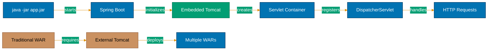

## Why Embedded Servers Matter

Spring Boot's embedded servers eliminate external application server dependencies by packaging Tomcat, Jetty, or Undertow directly into executable JARs. In production environments managing hundreds of microservices, embedded servers enable single-command deployment (`java -jar app.jar`) without coordinating separate server installations—reducing deployment complexity from "install server + deploy WAR" to "run JAR."

**Core Benefits**:

- **Self-contained deployment**: No external Tomcat/WildFly installation required
- **Version consistency**: Server version packaged with application (no environment mismatches)
- **Container-friendly**: Docker images simpler (`FROM openjdk` + JAR, not `FROM tomcat` + WAR)
- **Faster startup**: Optimized for single application (not shared server)
- **Configuration as code**: Server configuration in application.yml (not server.xml)

**Problem**: Traditional Java web apps require separate application server installation and WAR deployment.

**Solution**: Spring Boot embeds web server in application JAR for self-contained deployment.

## Traditional WAR Deployment

Spring Framework applications deploy as WAR files to external application servers:

```java
// => Traditional Spring MVC: extends WebApplicationInitializer
public class ZakatWebAppInitializer implements WebApplicationInitializer {

    @Override
    public void onStartup(ServletContext servletContext) throws ServletException {
        // => Manual DispatcherServlet registration
        AnnotationConfigWebApplicationContext context =
            new AnnotationConfigWebApplicationContext();
        context.register(WebConfig.class);  // => Load Spring config

        // => Register DispatcherServlet manually
        DispatcherServlet servlet = new DispatcherServlet(context);
        ServletRegistration.Dynamic registration =
            servletContext.addServlet("dispatcher", servlet);
        // => Map servlet to /* (all requests)
        registration.setLoadOnStartup(1);
        registration.addMapping("/");
    }
}

// => Package as WAR file
// => mvn clean package produces zakat-app.war

// => Deploy to external Tomcat
// => 1. Install Tomcat 9.x
// => 2. Copy zakat-app.war to $TOMCAT_HOME/webapps/
// => 3. Start Tomcat with startup.sh
// => 4. Application available at http://localhost:8080/zakat-app/
```

**Deployment process**:

```bash
# => Install Tomcat (external dependency)
wget https://archive.apache.org/dist/tomcat/tomcat-9/v9.0.80/bin/apache-tomcat-9.0.80.tar.gz
tar xzf apache-tomcat-9.0.80.tar.gz
cd apache-tomcat-9.0.80

# => Deploy WAR
cp /path/to/zakat-app.war webapps/

# => Start server
./bin/startup.sh
# => Tomcat starts, unpacks WAR, deploys application
# => Application accessible at http://localhost:8080/zakat-app/
```

**Limitations**:

- **External dependency**: Requires separate Tomcat installation
- **Version mismatch**: Production Tomcat 9.0.50 vs dev 9.0.80 causes subtle bugs
- **Configuration complexity**: Server configuration (server.xml) separate from app configuration
- **Slow deployment**: Copy WAR, restart server, wait for deployment
- **Container bloat**: Docker images need full Tomcat installation

## Spring Boot Embedded Server

Spring Boot embeds Tomcat in application JAR by default:

```java
package com.zakatfoundation.app;

import org.springframework.boot.SpringApplication;
import org.springframework.boot.autoconfigure.SpringBootApplication;

@SpringBootApplication  // => Includes spring-boot-starter-web
// => spring-boot-starter-web transitively includes spring-boot-starter-tomcat
public class ZakatApplication {

    public static void main(String[] args) {
        SpringApplication.run(ZakatApplication.class, args);
        // => Starts embedded Tomcat automatically
        // => Server listens on port 8080 by default
    }
}
```

**Maven dependency** (spring-boot-starter-web includes embedded Tomcat):

```xml
<dependency>
    <groupId>org.springframework.boot</groupId>
    <artifactId>spring-boot-starter-web</artifactId>
    <!-- Transitively includes spring-boot-starter-tomcat -->
    <!-- No explicit Tomcat dependency needed -->
</dependency>
```

**Build and run**:

```bash
# => Package as executable JAR
mvn clean package
# => Produces target/zakat-app-1.0.0.jar (fat JAR with embedded Tomcat)

# => Run application (single command)
java -jar target/zakat-app-1.0.0.jar
# => Spring Boot starts embedded Tomcat on port 8080
# => Application accessible at http://localhost:8080/ (no context path)
```

## Switching Embedded Servers

### Using Jetty Instead of Tomcat

```xml
<dependency>
    <groupId>org.springframework.boot</groupId>
    <artifactId>spring-boot-starter-web</artifactId>
    <exclusions>
        <!-- Exclude default Tomcat -->
        <exclusion>
            <groupId>org.springframework.boot</groupId>
            <artifactId>spring-boot-starter-tomcat</artifactId>
        </exclusion>
    </exclusions>
</dependency>

<!-- Add Jetty -->
<dependency>
    <groupId>org.springframework.boot</groupId>
    <artifactId>spring-boot-starter-jetty</artifactId>
</dependency>
```

**Application code unchanged**:

```java
@SpringBootApplication
public class ZakatApplication {
    public static void main(String[] args) {
        SpringApplication.run(ZakatApplication.class, args);
        // => Now starts embedded Jetty instead of Tomcat
        // => No code changes required
    }
}
```

### Using Undertow (Highest Performance)

```xml
<dependency>
    <groupId>org.springframework.boot</groupId>
    <artifactId>spring-boot-starter-web</artifactId>
    <exclusions>
        <exclusion>
            <groupId>org.springframework.boot</groupId>
            <artifactId>spring-boot-starter-tomcat</artifactId>
        </exclusion>
    </exclusions>
</dependency>

<!-- Add Undertow (non-blocking, high-performance) -->
<dependency>
    <groupId>org.springframework.boot</groupId>
    <artifactId>spring-boot-starter-undertow</artifactId>
</dependency>
```

## Server Configuration

Configure embedded server via application.yml:

```yaml
# => Server configuration: port, context path, timeouts
server:
  port: 8443 # => Listen on port 8443 (default: 8080)
  # => Production: use 8080 (HTTP) or 8443 (HTTPS)

  servlet:
    context-path: /zakat-api
    # => All endpoints under /zakat-api/*
    # => GET /zakat-api/donations (not GET /donations)
    # => Useful for versioning: /v1/donations

  # => Connection timeouts (important for production)
  tomcat:
    connection-timeout: 20s # => 20 seconds for request
    threads:
      max: 200 # => Maximum concurrent requests
      min-spare: 10 # => Minimum threads always running
    # => Thread pool configuration affects throughput

  # => SSL/TLS configuration
  ssl:
    enabled: true # => Enable HTTPS
    key-store: classpath:keystore.p12
    # => PKCS12 keystore with certificate
    key-store-password: ${SSL_KEYSTORE_PASSWORD}
    # => Password from environment variable
    key-store-type: PKCS12
    key-alias: zakat-api

  # => Compression (reduce bandwidth)
  compression:
    enabled: true # => Enable gzip compression
    mime-types: text/html,text/xml,text/plain,application/json
    # => Compress JSON responses (API responses)
    min-response-size: 1024 # => Only compress responses >1KB
```

## Customizing Embedded Server

### Programmatic Configuration

```java
package com.zakatfoundation.config;

import org.springframework.boot.web.embedded.tomcat.TomcatServletWebServerFactory;
import org.springframework.boot.web.server.WebServerFactoryCustomizer;
import org.springframework.context.annotation.Bean;
import org.springframework.context.annotation.Configuration;

@Configuration
public class ServerConfig {

    @Bean
    public WebServerFactoryCustomizer<TomcatServletWebServerFactory>
            servletContainerCustomizer() {
        // => Customize Tomcat server factory
        return factory -> {
            // => Add custom Tomcat connector
            factory.addConnectorCustomizers(connector -> {
                // => HTTP/2 support
                connector.addUpgradeProtocol(
                    new org.apache.coyote.http2.Http2Protocol());
                // => Enables HTTP/2 for better performance
            });

            // => Add error pages
            factory.addErrorPages(
                new ErrorPage(HttpStatus.NOT_FOUND, "/404.html"),
                new ErrorPage(HttpStatus.INTERNAL_SERVER_ERROR, "/500.html")
            );
        };
    }
}
```

### Access Logs Configuration

```yaml
# => Enable Tomcat access logs (production requirement)
server:
  tomcat:
    accesslog:
      enabled: true # => Enable access logging
      directory: /var/log/zakat-api
      # => Log directory (ensure writable)
      prefix: access_log
      suffix: .txt
      pattern: '%h %l %u %t "%r" %s %b %D'
      # => %h: client IP, %r: request line, %s: status, %D: time in ms
      # => Example: 192.168.1.100 - - [06/Feb/2026:10:30:00 +0700] "GET /donations HTTP/1.1" 200 1234 150
      rotate: true # => Daily rotation
```

## Production Patterns

### Pattern 1: Environment-Specific Port

```yaml
# => application.yml (default: dev)
server:
  port: 8080

---
# => application-prod.yml (production)
server:
  port: ${PORT:8080}
  # => Use $PORT environment variable (Cloud Foundry, Heroku)
  # => Fallback to 8080 if not set
```

### Pattern 2: Graceful Shutdown

```yaml
# => Graceful shutdown (complete in-flight requests)
server:
  shutdown: graceful # => Don't cut connections immediately
  # => Waits for requests to complete before shutdown

spring:
  lifecycle:
    timeout-per-shutdown-phase: 30s
    # => Maximum 30 seconds to complete requests
    # => After timeout, forceful shutdown
```

### Pattern 3: Docker Deployment

```dockerfile
FROM eclipse-temurin:17-jre-alpine
# => JRE only (no JDK), Alpine for smaller image

WORKDIR /app
COPY target/zakat-app-1.0.0.jar app.jar
# => Copy JAR with embedded Tomcat

# => Run as non-root user (security best practice)
RUN addgroup -S spring && adduser -S spring -G spring
USER spring:spring

EXPOSE 8080
# => Expose port (informational)

# => Health check
HEALTHCHECK --interval=30s --timeout=3s --start-period=40s \
  CMD wget -q --spider http://localhost:8080/actuator/health || exit 1

# => Run application
ENTRYPOINT ["java", "-jar", "app.jar"]
# => Single command: no Tomcat installation needed
```

## Architecture Diagram



## When to Use Embedded Servers

**Use embedded servers when**:

- ✅ Microservices architecture (one service per JAR)
- ✅ Container deployment (Docker/Kubernetes)
- ✅ Cloud platforms (Heroku, Cloud Foundry)
- ✅ Simple deployment preferred (single JAR)
- ✅ Development environment (fast startup)

**Use external servers when**:

- ⚠️ Multiple applications sharing server (cost optimization)
- ⚠️ Strict corporate standards (mandated server versions)
- ⚠️ Complex server configuration (advanced Tomcat features)
- ⚠️ Legacy infrastructure (existing Tomcat installations)

**Trade-offs**:

| Aspect                  | Embedded Server       | External Server             |
| ----------------------- | --------------------- | --------------------------- |
| **Deployment**          | Single JAR            | WAR + server install        |
| **Version consistency** | Guaranteed (packaged) | Risk of mismatch            |
| **Startup time**        | Fast (~3 seconds)     | Slower (~10 seconds)        |
| **Memory**              | One server per app    | Shared server (lower total) |
| **Configuration**       | application.yml       | server.xml (external)       |
| **Docker image size**   | Smaller (JRE + JAR)   | Larger (Tomcat + WARs)      |

**Production recommendation**: Use embedded servers for microservices, cloud deployments, and modern architectures. External servers only for legacy constraints.

## Next Steps

- [Profiles and Environments](/en/learn/software-engineering/platform-web/tools/jvm-spring-boot/in-the-field/profiles-environments) - Environment-specific configuration
- [Spring Boot Actuator](/en/learn/software-engineering/platform-web/tools/jvm-spring-boot/in-the-field/spring-boot-actuator) - Production monitoring endpoints
- [Docker Containerization](/en/learn/software-engineering/platform-web/tools/jvm-spring-boot/in-the-field/docker-containerization) - Container deployment strategies
