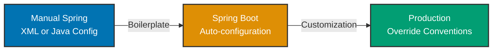

## Why This Matters

Spring Boot revolutionized Java enterprise development by providing "Spring with batteries included"—eliminating boilerplate configuration while preserving Spring Framework's power. Understanding the manual Spring Framework→Spring Boot progression prevents over-reliance on auto-configuration magic and enables debugging when conventions fail. This approach ensures you know both when to embrace Boot's conventions and when to override them.

## Spring with Batteries Included

Spring Boot is NOT a separate framework—it's Spring Framework plus:

- **Auto-configuration**: Convention-based bean configuration
- **Starter dependencies**: Curated dependency bundles
- **Embedded servers**: Tomcat/Jetty/Undertow built-in
- **Production features**: Health checks, metrics, externalized config
- **Opinionated defaults**: Sensible choices that work out-of-box

## Spring Core First Principle

Every guide follows three-stage progression showing why Spring Boot adds value:



### Stage 1: Manual Spring Framework

Each guide starts with manual Spring configuration showing explicit bean definitions, component scanning setup, and property management. This reveals configuration complexity that Spring Boot eliminates.

**Example - Manual Spring Web Application:**

```java
// => Manual configuration: explicit servlet container, dispatcher servlet, view resolver
@Configuration
@EnableWebMvc  // => Enables Spring MVC support manually
@ComponentScan(basePackages = "com.example")  // => Explicitly specify packages to scan
public class WebConfig implements WebMvcConfigurer {

    // => Must manually configure view resolver for template rendering
    @Bean
    public ViewResolver viewResolver() {
        InternalResourceViewResolver resolver = new InternalResourceViewResolver();
        resolver.setPrefix("/WEB-INF/views/");  // => Hard-coded view location
        resolver.setSuffix(".jsp");  // => Hard-coded template engine
        return resolver;
    }

    // => Must configure servlet container manually (Tomcat)
    @Bean
    public ServletWebServerFactory servletContainer() {
        TomcatServletWebServerFactory tomcat = new TomcatServletWebServerFactory();
        tomcat.setPort(8080);  // => Hard-coded port
        tomcat.setContextPath("/app");  // => Hard-coded context path
        return tomcat;
    }

    // => Must enable static resource handling explicitly
    @Override
    public void addResourceHandlers(ResourceHandlerRegistry registry) {
        registry.addResourceHandler("/static/**")
                .addResourceLocations("/static/");  // => Map static resources manually
    }
}

// => Application entry point: manual servlet container initialization
public class Application {
    public static void main(String[] args) {
        // => Create Spring context manually
        AnnotationConfigApplicationContext context =
            new AnnotationConfigApplicationContext(WebConfig.class);

        // => Start embedded Tomcat manually
        ServletWebServerFactory factory = context.getBean(ServletWebServerFactory.class);
        WebServer webServer = factory.getWebServer();
        webServer.start();  // => Blocks until shutdown
    }
}
```

**Limitations:**

- 50+ lines of configuration for basic web app
- Hard-coded values spread across configuration classes
- Must know exact beans needed (ViewResolver, ServletContainer)
- Different configuration for different profiles (dev vs prod)
- No built-in health checks or metrics

### Stage 2: Spring Boot Auto-Configuration

Shows how Spring Boot eliminates boilerplate through conventions and starter dependencies:

**Example - Spring Boot Web Application:**

```java
// => Spring Boot: @SpringBootApplication combines three annotations
@SpringBootApplication  // => @Configuration + @EnableAutoConfiguration + @ComponentScan
                        // => Auto-configures web server, MVC, view resolver, static resources
public class Application {

    // => Single method: Spring Boot handles everything
    public static void main(String[] args) {
        SpringApplication.run(Application.class, args);  // => Starts embedded Tomcat automatically
                                                          // => Scans for components automatically
                                                          // => Configures beans automatically
    }
}

// => application.properties: externalized configuration
// server.port=8080                    # Port configuration (default)
// server.servlet.context-path=/app   # Context path (overrides default /)
// spring.mvc.view.prefix=/WEB-INF/views/   # View prefix (convention)
// spring.mvc.view.suffix=.jsp              # View suffix (convention)

// => Controller: same as manual Spring
@RestController
public class ZakatController {

    @GetMapping("/api/zakat")  // => Spring Boot auto-configures JSON serialization
                               // => Returns JSON without manual ObjectMapper configuration
    public ZakatResponse calculateZakat(@RequestParam BigDecimal gold) {
        return new ZakatResponse(gold.multiply(new BigDecimal("0.025")));
    }
}
```

**Benefits:**

- 5 lines instead of 50+ for web app setup
- No manual bean configuration for common scenarios
- Convention-based configuration in `application.properties`
- Auto-configures based on classpath (sees spring-web → adds web support)
- Built-in health endpoint (`/actuator/health`) and metrics

**Auto-configuration Classes Spring Boot Provides:**

When you add `spring-boot-starter-web`, Boot auto-configures:

- `DispatcherServlet` - Spring MVC front controller
- `HttpMessageConverters` - JSON/XML serialization (Jackson by default)
- `EmbeddedServletContainer` - Tomcat/Jetty/Undertow
- `ViewResolver` - Template engine integration (Thymeleaf default)
- Static resource handlers - `/static`, `/public`, `/resources`, `/META-INF/resources`
- Error handling - Default error page and exception mapping

### Stage 3: Production Customization

Demonstrates overriding Boot conventions for production requirements:

**Example - Production Overrides:**

```java
@SpringBootApplication
public class Application {

    // => Override auto-configured DataSource for production connection pooling
    @Bean
    @ConfigurationProperties("app.datasource")  // => Loads properties prefixed with app.datasource
    public DataSource dataSource() {
        // => Spring Boot would auto-configure HikariCP, but we customize for production
        HikariConfig config = new HikariConfig();
        config.setMaximumPoolSize(50);  // => Production: higher connection pool
        config.setMinimumIdle(10);  // => Keep 10 connections ready
        config.setConnectionTimeout(30000);  // => 30 second timeout
        return new HikariDataSource(config);  // => Replaces Boot's auto-configured DataSource
    }

    // => Add custom health indicator for business logic
    @Bean
    public HealthIndicator zakatServiceHealthIndicator(ZakatService zakatService) {
        // => Spring Boot Actuator exposes this at /actuator/health
        return () -> {
            boolean isHealthy = zakatService.checkDatabaseConnection();
            return isHealthy
                ? Health.up().withDetail("zakat-service", "operational").build()
                : Health.down().withDetail("zakat-service", "database unavailable").build();
        };
    }

    // => Override Boot's error handling for API-specific responses
    @ControllerAdvice
    public class GlobalExceptionHandler {

        @ExceptionHandler(ZakatValidationException.class)  // => Business-specific exception
        public ResponseEntity<ErrorResponse> handleValidation(ZakatValidationException ex) {
            // => Custom error format for API consumers
            ErrorResponse error = new ErrorResponse("VALIDATION_ERROR", ex.getMessage());
            return ResponseEntity.badRequest().body(error);
        }
    }

    public static void main(String[] args) {
        SpringApplication.run(Application.class, args);
    }
}

// => application-prod.properties: production-specific config
// server.port=8080
// server.tomcat.threads.max=200           # Production threading
// server.tomcat.accept-count=100          # Queue size for requests
// spring.jpa.hibernate.ddl-auto=validate  # Production: no auto-DDL
// management.endpoints.web.exposure.include=health,metrics,info  # Expose Actuator endpoints
// management.endpoint.health.show-details=when-authorized        # Security
```

**Key Insight**: Spring Boot auto-configuration is NOT magic—it's conditional bean registration. When you provide a `DataSource` bean, Boot's auto-configuration backs off. Understanding this pattern enables confident customization.

## Production Patterns

Each guide demonstrates:

- **Auto-configuration**: Understanding what Boot configures automatically
- **Starter dependencies**: Choosing the right starters for your use case
- **Configuration properties**: Using `application.properties` effectively
- **Actuator integration**: Production health checks and metrics
- **Profile-based config**: Environment-specific settings (dev, staging, prod)
- **Error handling**: Customizing Boot's error responses
- **Security**: Leveraging Boot's security defaults and customization
- **Testing**: Spring Boot test slices (`@WebMvcTest`, `@DataJpaTest`)

## Trade-offs and When to Use

**Manual Spring vs Spring Boot:**

| Aspect              | Manual Spring                     | Spring Boot                        |
| ------------------- | --------------------------------- | ---------------------------------- |
| Configuration       | Explicit control                  | Convention-based                   |
| Learning Curve      | Steep (need to know all beans)    | Moderate (learn conventions)       |
| Boilerplate         | High (50+ lines setup)            | Low (5 lines)                      |
| Customization       | Total control                     | Override conventions               |
| Startup Time        | Fast (minimal classpath scanning) | Slower (auto-configuration checks) |
| Production Features | Manual (build your own)           | Built-in (Actuator)                |

**When to Use Manual Spring:**

- Library/framework development (avoid Boot dependencies)
- Extremely constrained environments (embedded systems)
- Learning Spring internals deeply
- Maximum performance (eliminate auto-configuration overhead)

**When to Use Spring Boot:**

- Standard enterprise applications (99% of use cases)
- Microservices (fast startup with embedded server)
- Projects needing production features (health checks, metrics)
- Teams benefiting from conventions (consistency across projects)
- When using Spring ecosystem heavily (Data, Security, Cloud)

## Guide Structure

Each production guide follows this template:

1. **Why [Topic] Matters** - Production relevance
2. **Manual Spring Approach** - Explicit configuration showing boilerplate
3. **Spring Boot Auto-Configuration** - Convention-based approach
4. **Progression Diagram** - Visual representation of Manual → Boot → Production
5. **Production Patterns** - Customization, overrides, best practices
6. **Trade-offs and When to Use** - Decision criteria
7. **Best Practices** - Actionable guidance with code examples
8. **See Also** - Related guides and documentation

## Annotation Standards

All code examples maintain 1.0-2.25 annotation density per convention:

```java
@SpringBootApplication  // => Combines @Configuration, @EnableAutoConfiguration, @ComponentScan
                        // => Triggers auto-configuration based on classpath
                        // => Scans current package and sub-packages for components
public class Application {

    public static void main(String[] args) {
        // => SpringApplication.run() starts embedded server, configures beans, enables Actuator
        // => args passed to configure via command-line properties: --server.port=9000
        SpringApplication.run(Application.class, args);
    }

    @Bean  // => Overrides Boot's auto-configured DataSource
           // => Boot detects custom bean, disables auto-configuration for DataSource
    public DataSource dataSource() {
        return new HikariDataSource(config);  // => Custom configuration replaces Boot's default
    }
}
```

Annotations explain:

- **What Boot auto-configures**: Which beans Boot creates automatically
- **When conventions apply**: Conditions triggering auto-configuration
- **How to override**: Providing custom beans to replace Boot's defaults
- **Why customization needed**: Production requirements Boot doesn't handle

## Prerequisites

**Required Knowledge:**

- **Spring Framework Foundation**: IoC container, DI, bean lifecycle (see [Spring Framework in-the-field guides](/en/learn/software-engineering/platform-web/tools/jvm-spring/in-the-field/overview))
- **Java Fundamentals**: Annotations, interfaces, generics
- **Maven/Gradle**: Dependency management, build lifecycle

**Recommended Reading:**

- [Spring Framework Overview](/en/learn/software-engineering/platform-web/tools/jvm-spring/in-the-field/overview) - **CRITICAL**: Master Spring Core first
- [Spring Dependency Injection](/en/learn/software-engineering/platform-web/tools/jvm-spring/in-the-field/dependency-injection) - Foundation for Boot
- [Spring Configuration](/en/learn/software-engineering/platform-web/tools/jvm-spring/in-the-field/configuration) - Java Config patterns

## Next Steps

Start with **Spring Boot Foundation** guides:

1. [Best Practices](/en/learn/software-engineering/platform-web/tools/jvm-spring-boot/in-the-field/best-practices) - Boot-specific production patterns
2. [Anti-Patterns](/en/learn/software-engineering/platform-web/tools/jvm-spring-boot/in-the-field/anti-patterns) - Common Boot mistakes

Then explore specific Spring Boot topics based on your application needs.

## See Also

- [Spring Boot Reference](https://docs.spring.io/spring-boot/docs/current/reference/html/) - Official documentation
- [Spring Framework In the Field](/en/learn/software-engineering/platform-web/tools/jvm-spring/in-the-field/overview) - Spring Core foundation
- [Spring Boot Quick Start](/en/learn/software-engineering/platform-web/tools/jvm-spring-boot/quick-start) - Getting started guide
