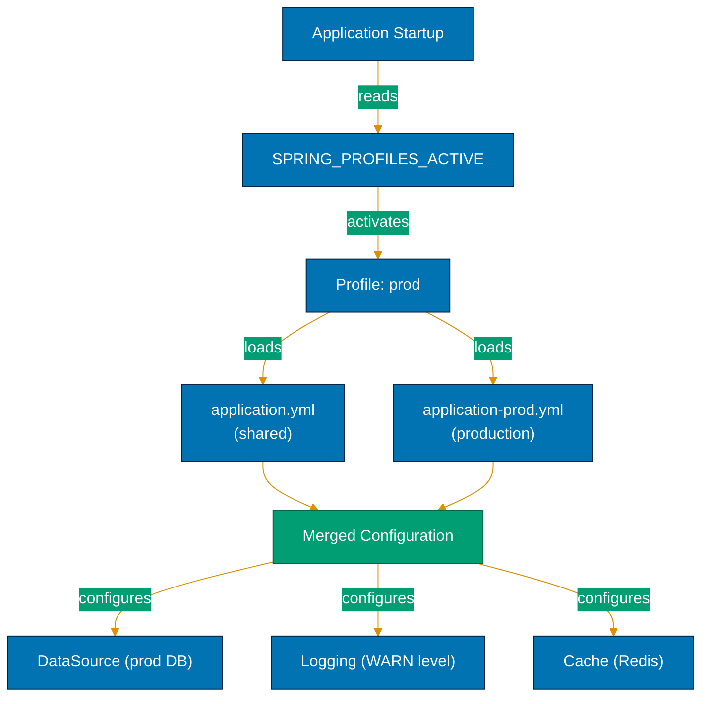

## Why Profiles Matter

Spring Boot profiles enable environment-specific configuration (dev, staging, production) through a single application with multiple configuration files. In production systems deployed across development, staging, and production environments, profiles eliminate hardcoded values—enabling the same artifact (JAR) to run in all environments with different datasources, credentials, and feature flags based on active profile.

**Core Benefits**:

- **Single artifact deployment**: Same JAR runs in dev/staging/prod
- **Environment isolation**: Database credentials differ per environment
- **Feature flags**: Enable/disable features by environment
- **Configuration externalization**: No code changes for environment differences
- **Profile groups**: Activate multiple related profiles together

**Problem**: Applications need different configurations (database URLs, credentials, feature flags) per environment.

**Solution**: Spring Boot profiles with application-{profile}.yml files and @Profile annotations.

## Manual Environment Configuration

Traditional approach uses separate config files loaded manually:

```java
// => Manual environment detection: brittle, error-prone
public class DatabaseConfig {

    @Bean
    public DataSource dataSource() {
        String env = System.getenv("APP_ENV");  // => Read from environment
        // => Manual if/else for environment selection

        HikariConfig config = new HikariConfig();
        if ("production".equals(env)) {
            // => Production database
            config.setJdbcUrl("jdbc:postgresql://prod-db.aws.com:5432/zakat");
            config.setUsername("prod_user");
            config.setPassword(System.getenv("DB_PASSWORD"));
        } else if ("staging".equals(env)) {
            // => Staging database
            config.setJdbcUrl("jdbc:postgresql://staging-db.aws.com:5432/zakat");
            config.setUsername("staging_user");
            config.setPassword(System.getenv("STAGING_DB_PASSWORD"));
        } else {
            // => Development database (default)
            config.setJdbcUrl("jdbc:postgresql://localhost:5432/zakat_dev");
            config.setUsername("dev_user");
            config.setPassword("dev_password");
        }

        return new HikariDataSource(config);
    }
}
```

**Limitations**:

- **Verbose**: Manual if/else for each environment
- **Error-prone**: Easy to forget environment (misspell "production" as "prod")
- **Not declarative**: Configuration logic mixed with environment detection
- **Hard to test**: Must set environment variables for testing

## Spring Boot Profiles

Spring Boot profiles provide declarative environment configuration:

**Step 1: Create profile-specific configuration files**:

```yaml
# => application.yml (default/shared configuration)
# => Active in ALL profiles
spring:
  application:
    name: zakat-api # => Shared across environments

server:
  shutdown: graceful # => Shared configuration

logging:
  pattern:
    console: "%d{HH:mm:ss.SSS} [%thread] %-5level %logger{36} - %msg%n"
    # => Log pattern (same for all environments)
```

```yaml
# => application-dev.yml (development profile)
# => Active when spring.profiles.active=dev
spring:
  datasource:
    url: jdbc:postgresql://localhost:5432/zakat_dev
    # => Local PostgreSQL for development
    username: dev_user
    password: dev_password # => Plain text acceptable in dev

  jpa:
    hibernate:
      ddl-auto: update # => Auto-create tables in dev
    show-sql: true # => Show SQL in console (development only)

logging:
  level:
    com.zakatfoundation: DEBUG # => Verbose logging in dev
```

```yaml
# => application-staging.yml (staging profile)
spring:
  datasource:
    url: jdbc:postgresql://staging-db.aws.com:5432/zakat_staging
    username: staging_user
    password: ${DB_PASSWORD} # => From environment variable

  jpa:
    hibernate:
      ddl-auto: validate # => No auto-DDL in staging
    show-sql: false

logging:
  level:
    com.zakatfoundation: INFO # => Less verbose than dev
```

```yaml
# => application-prod.yml (production profile)
spring:
  datasource:
    url: jdbc:postgresql://prod-db.aws.com:5432/zakat_prod
    username: ${DB_USER} # => From environment or secrets manager
    password: ${DB_PASSWORD}
    hikari:
      maximum-pool-size: 20 # => Higher pool for production load

  jpa:
    hibernate:
      ddl-auto: validate # => Never auto-modify schema in prod
    show-sql: false # => No SQL logging (performance)

logging:
  level:
    com.zakatfoundation: WARN # => Only warnings/errors in prod
```

**Step 2: Activate profile**:

```bash
# => Set active profile via environment variable
export SPRING_PROFILES_ACTIVE=prod

# => Run application
java -jar zakat-api.jar
# => Loads application.yml + application-prod.yml
```

Or via command line:

```bash
# => Activate profile via --spring.profiles.active
java -jar zakat-api.jar --spring.profiles.active=prod
# => Loads application.yml + application-prod.yml
```

## @Profile Annotation

Profile-specific beans with @Profile annotation:

```java
package com.zakatfoundation.config;

import org.springframework.context.annotation.Bean;
import org.springframework.context.annotation.Configuration;
import org.springframework.context.annotation.Profile;

@Configuration
public class CacheConfig {

    @Bean
    @Profile("dev")
    // => Only active when profile=dev
    public CacheManager devCacheManager() {
        // => Simple in-memory cache for development
        return new ConcurrentMapCacheManager("donations", "recipients");
        // => No Redis dependency in dev
    }

    @Bean
    @Profile("prod")
    // => Only active when profile=prod
    public CacheManager prodCacheManager(RedisConnectionFactory factory) {
        // => Redis cache for production (distributed)
        RedisCacheConfiguration config = RedisCacheConfiguration
            .defaultCacheConfig()
            .entryTtl(Duration.ofMinutes(10));  // => 10 minute TTL

        return RedisCacheManager.builder(factory)
            .cacheDefaults(config)
            .build();
        // => Requires Redis connection (production infrastructure)
    }
}
```

**Profile expressions** (AND/OR/NOT logic):

```java
@Bean
@Profile("prod & !test")
// => Active when profile=prod AND profile≠test
public DataSource prodDataSource() {
    // => Production database (not for tests)
}

@Bean
@Profile("dev | test")
// => Active when profile=dev OR profile=test
public DataSource h2DataSource() {
    // => H2 in-memory database for dev/test
    return new EmbeddedDatabaseBuilder()
        .setType(EmbeddedDatabaseType.H2)
        .build();
}
```

## Profile Groups

Activate multiple profiles together with profile groups:

```yaml
# => application.yml
spring:
  profiles:
    group:
      production: "prod,aws,monitoring"
      # => Activating "production" activates all three profiles
      # => prod: production config
      # => aws: AWS-specific beans
      # => monitoring: APM/metrics configuration

      development: "dev,local-cache,debug"
      # => Activating "development" activates all three profiles
```

```bash
# => Activate profile group
java -jar zakat-api.jar --spring.profiles.active=production
# => Loads: application.yml + application-prod.yml +
#          application-aws.yml + application-monitoring.yml
```

## Production Patterns

### Pattern 1: Feature Flags

```java
@Component
@Profile("premium-features")
// => Only active when premium-features profile enabled
public class PremiumZakatCalculator {

    public BigDecimal calculateWithInvestments(BigDecimal wealth,
                                               BigDecimal investments) {
        // => Advanced calculation including investment portfolios
        // => Only available in premium tier
    }
}

@Component
@Profile("!premium-features")
// => Active when premium-features profile NOT enabled
public class BasicZakatCalculator {

    public BigDecimal calculateBasic(BigDecimal wealth) {
        // => Basic 2.5% calculation
        // => Available in all tiers
    }
}
```

Activate premium features:

```bash
# => Enable premium features for specific customers
java -jar zakat-api.jar --spring.profiles.active=prod,premium-features
```

### Pattern 2: Cloud Provider Configuration

```yaml
# => application-aws.yml (AWS-specific)
cloud:
  aws:
    region:
      static: ap-southeast-1 # => Singapore region
    credentials:
      access-key: ${AWS_ACCESS_KEY}
      secret-key: ${AWS_SECRET_KEY}

# => application-gcp.yml (Google Cloud-specific)
spring:
  cloud:
    gcp:
      project-id: zakat-foundation-prod
      credentials:
        location: file:/etc/secrets/gcp-service-account.json
```

### Pattern 3: Database Migration Per Environment

```yaml
# => application-dev.yml
spring:
  flyway:
    enabled: true  # => Auto-migrate in dev
    locations: classpath:db/migration
    clean-on-validation-error: true  # => Reset database on error (dev only)

# => application-prod.yml
spring:
  flyway:
    enabled: false  # => Manual migration in prod
    # => DBA runs migrations separately
```

## Default Profile

Configure default profile when none specified:

```yaml
# => application.yml
spring:
  profiles:
    default: dev # => Use dev profile by default
    # => Developers don't need to set SPRING_PROFILES_ACTIVE
```

## Testing with Profiles

Activate profile for specific tests:

```java
@SpringBootTest
@ActiveProfiles("test")
// => Activates "test" profile for this test
// => Loads application.yml + application-test.yml
class DonationServiceTest {

    @Autowired
    private DonationService service;

    @Test
    void shouldCalculateZakat() {
        // => Uses test profile configuration
        // => H2 in-memory database, no external dependencies
    }
}
```

## Architecture Diagram



## When to Use Profiles

**Use profiles for**:

- ✅ Environment configuration (dev/staging/prod)
- ✅ Database connections per environment
- ✅ Feature flags (A/B testing, premium features)
- ✅ Cloud provider-specific configuration
- ✅ Testing with different configurations

**Don't use profiles for**:

- ❌ Business logic (use strategy pattern instead)
- ❌ Runtime feature toggles (use feature flag service)
- ❌ User-specific configuration (use application properties)
- ❌ Temporary debugging (use logging levels)

**Trade-offs**:

| Aspect          | Spring Profiles                | Manual Environment Detection |
| --------------- | ------------------------------ | ---------------------------- |
| **Verbosity**   | Declarative (YAML)             | Imperative (if/else)         |
| **Type safety** | Limited (YAML strings)         | Full (Java code)             |
| **Testability** | Easy (@ActiveProfiles)         | Hard (mocking System.getenv) |
| **Clarity**     | Separate files per environment | Mixed configuration logic    |
| **IDE support** | Good (Spring tools)            | Standard Java                |

**Production recommendation**: Use Spring profiles for environment configuration. Reserve manual detection for complex logic requiring Java code.

## Next Steps

- [External Configuration](/en/learn/software-engineering/platform-web/tools/jvm-spring-boot/in-the-field/external-configuration) - Spring Cloud Config Server
- [Configuration Properties](/en/learn/software-engineering/platform-web/tools/jvm-spring-boot/in-the-field/configuration-properties) - Type-safe @ConfigurationProperties
- [Application Properties](/en/learn/software-engineering/platform-web/tools/jvm-spring-boot/in-the-field/application-properties) - Property resolution and sources
