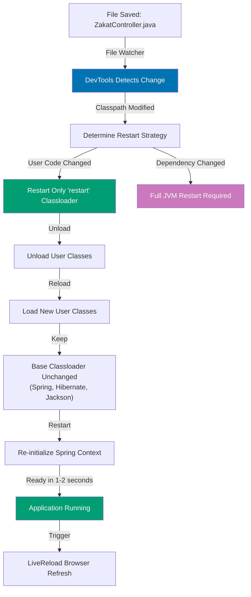

## Why DevTools Matters

Spring Boot DevTools enables sub-second application restarts during development by intelligently reloading only changed classes, eliminating the 10-30 second full restart cycle. In production development workflows where engineers make dozens of code changes per hour, manual restart overhead costs 5-15 minutes per hour—DevTools with automatic restart and LiveReload browser refresh delivers instant feedback loops enabling rapid iteration on REST APIs, templates, and configuration.

**Core Benefits**:

- **Fast restart**: 1-2 second restarts vs 10-30 seconds for full JVM restart
- **Automatic restart**: File changes trigger restart without manual intervention
- **LiveReload**: Browser auto-refreshes on restart (no F5 spam)
- **Remote debugging**: Connect to running applications in containers or cloud
- **Development-only**: Automatically disabled in production deployments

**Problem**: Manual restart cycles waste developer time and break flow state.

**Solution**: Spring Boot DevTools monitors classpath changes and triggers intelligent restarts with LiveReload integration.

## Manual Restart Cycle

Traditional development requires manual restart after every code change:

```java
// => Traditional development workflow (no DevTools)

// 1. Write code
@RestController
public class ZakatController {
    @GetMapping("/api/zakat/calculate")
    public BigDecimal calculate(@RequestParam BigDecimal gold) {
        return gold.multiply(new BigDecimal("0.025"));
    }
}

// 2. Save file (Ctrl+S or Cmd+S)
// 3. Stop application (Ctrl+C in terminal)
// 4. Wait for JVM shutdown: 2-3 seconds
// 5. Run: mvn spring-boot:run or gradle bootRun
// 6. Wait for startup: 10-30 seconds (Spring context initialization)
// 7. Switch to browser
// 8. Refresh page (F5)
// 9. Test changes

// => Time per iteration: 15-35 seconds
// => 20 code changes per hour: 5-12 minutes wasted waiting
// => Flow state disrupted by context switching
```

**Limitations**:

- **Slow feedback**: 15-35 seconds per code change
- **Manual process**: Must remember to restart after every change
- **Context switching**: IDE → terminal → browser → IDE
- **Flow disruption**: Long waits break concentration

## Spring Boot DevTools Automatic Restart

DevTools monitors classpath for changes and triggers fast restarts:

```xml
<!-- Add DevTools dependency -->
<dependency>
    <groupId>org.springframework.boot</groupId>
    <artifactId>spring-boot-devtools</artifactId>
    <optional>true</optional>
    <!-- => Optional: not included in production JARs
         - DevTools automatically disabled when running java -jar app.jar
         - Only active during development (mvn spring-boot:run, IDE run) -->
</dependency>
```

Development workflow with DevTools:

```java
// => DevTools-enabled development workflow

// 1. Write code
@RestController
public class ZakatController {
    @GetMapping("/api/zakat/calculate")
    public BigDecimal calculate(@RequestParam BigDecimal gold) {
        return gold.multiply(new BigDecimal("0.025"));
        // => Modify rate to 0.03 for testing
    }
}

// 2. Save file (Ctrl+S)
// => DevTools detects classpath change automatically
// => Triggers restart in background

// 3. Wait for restart: 1-2 seconds
// => DevTools output:
// 2025-12-30 10:15:23.456  INFO 12345 --- [  restartedMain]
//   .ConditionEvaluationDeltaLoggingListener : Condition evaluation unchanged
//
// => "restartedMain" thread indicates DevTools restart, not full JVM restart
// => Application ready in 1.2 seconds (vs 15 seconds for cold start)

// 4. Browser auto-refreshes (LiveReload)
// => No manual F5, no context switching

// => Time per iteration: 1-3 seconds (vs 15-35 seconds)
// => 20 code changes per hour: 30-60 seconds total wait (vs 5-12 minutes)
// => Flow state preserved: minimal context switching
```

**How DevTools fast restart works**:



**Trade-offs**:

- **Development-only**: DevTools disabled in production (optional dependency)
- **Resource usage**: File watching and classloader management add overhead
- **Limited scope**: Only restarts for classpath changes, not configuration server changes
- **Justification**: Worth it for >5 code changes per hour (saves 2-5 minutes hourly)

## Two-Classloader Architecture

DevTools uses two classloaders for fast restarts:

```java
// => DevTools classloader architecture

// Base Classloader (never reloaded)
// - Third-party JARs: Spring Framework, Hibernate, Jackson, SLF4J
// - JDK classes: java.*, javax.*, jakarta.*
// - Loaded once at JVM startup, cached for entire dev session
// - Loading time: 8-12 seconds

// Restart Classloader (reloaded on file change)
// - User code: @RestController, @Service, @Repository classes
// - application.properties, application.yml
// - Templates (Thymeleaf, Freemarker)
// - Static resources (CSS, JS) if not excluded
// - Loading time: 1-2 seconds

// => Example: Change ZakatController.java
// 1. DevTools unloads restart classloader (100ms)
// 2. Reloads ZakatController.class from disk (50ms)
// 3. Re-initializes Spring ApplicationContext with new controller (1-2 seconds)
// 4. Base classloader unchanged: Spring Framework JARs not reloaded

// => Result: 1-2 second restart instead of 10-15 second full JVM restart
```

Configure what triggers restart:

```yaml
# => application.yml: DevTools configuration
spring:
  devtools:
    restart:
      enabled: true # => Enable automatic restart (default: true)

      # => Exclude paths from restart (static resources)
      exclude: static/**, public/**, resources/**
      # => Changes to CSS/JS don't trigger restart
      # => Only changes to Java classes, templates, application.yml trigger restart

      # => Additional paths to watch (outside classpath)
      additional-paths: /path/to/external/config
      # => Watch external configuration files

      # => Paths to exclude from watch
      additional-exclude: "**/node_modules/**"
      # => Ignore frontend dependencies

      # => Trigger file: restart when this file modified
      trigger-file: .restart
      # => Manual restart control: touch .restart to trigger restart
      # => Useful for batch changes: modify 10 files, trigger once

      # => Restart delay: debounce rapid file changes
      poll-interval: 1s # => Check for changes every 1 second
      quiet-period: 400ms # => Wait 400ms after last change before restarting
      # => Prevents restart storm when saving multiple files rapidly
```

## LiveReload Browser Integration

DevTools includes embedded LiveReload server for automatic browser refresh:

```yaml
# => Enable LiveReload (default: true)
spring:
  devtools:
    livereload:
      enabled: true
      # => Starts LiveReload server on port 35729
      # => Browser extension connects via WebSocket

      port: 35729 # => LiveReload server port (default)
```

Install browser extension:

```bash
# => LiveReload browser extensions

# Chrome/Edge: LiveReload extension
# https://chrome.google.com/webstore/detail/livereload/jnihajbhpnppcggbcgedagnkighmdlei

# Firefox: LiveReload add-on
# https://addons.mozilla.org/en-US/firefox/addon/livereload/

# Safari: LiveReload app (paid)
# http://livereload.com/

# => After installing:
# 1. Click extension icon to enable for localhost
# 2. DevTools sends reload signal after restart
# 3. Browser refreshes automatically (no F5)
```

LiveReload workflow:

```java
// => LiveReload development flow

// 1. Application running with DevTools
// 2. Browser extension connected to localhost:35729

// 3. Modify code:
@RestController
public class ZakatController {
    @GetMapping("/api/zakat/calculate")
    public BigDecimal calculate(@RequestParam BigDecimal gold) {
        return gold.multiply(new BigDecimal("0.03"));  // Changed rate
    }
}

// 4. Save file (Ctrl+S)
// => DevTools detects change
// => Restarts application (1-2 seconds)
// => Sends LiveReload signal to browser

// 5. Browser receives signal
// => Automatically refreshes page
// => Shows updated response with 0.03 rate

// => No manual F5, no context switching to browser
```

**Manual LiveReload trigger** (without browser extension):

```bash
# => Embed LiveReload script in HTML template
<script src="http://localhost:35729/livereload.js"></script>
<!-- DevTools serves this script automatically -->
<!-- Browser connects to LiveReload server via WebSocket -->

# => Or use curl to trigger refresh
curl http://localhost:35729/changed?files=application.css
# => Tells LiveReload to refresh browsers (testing)
```

## Remote DevTools for Containerized Development

DevTools supports remote applications running in Docker or cloud:

```xml
<!-- Enable remote DevTools (production: set to runtime scope) -->
<dependency>
    <groupId>org.springframework.boot</groupId>
    <artifactId>spring-boot-devtools</artifactId>
    <scope>runtime</scope>
    <!-- => Include in production JAR for remote debugging -->
</dependency>
```

Configure remote secret:

```yaml
# => application.yml: Remote DevTools security
spring:
  devtools:
    remote:
      secret: ${DEVTOOLS_SECRET}
      # => Shared secret between client and server
      # => Prevents unauthorized remote connections

      # => Remote restart endpoint
      restart:
        enabled: true # => Allow remote restart triggers


# => Set environment variable
# export DEVTOOLS_SECRET=my-secure-secret-key
```

Connect to remote application:

```bash
# => Run remote DevTools client (from IDE or command-line)
java -jar spring-boot-devtools.jar http://remote-host:8080 \
  --spring.devtools.remote.secret=my-secure-secret-key

# => Remote client:
# 1. Connects to remote application via HTTP tunnel
# 2. Monitors local classpath for changes
# 3. Sends changed classes to remote application
# 4. Triggers remote restart with updated classes

# => Use case: Kubernetes development with remote debug
# 1. Deploy app to Kubernetes with DevTools
# 2. Port-forward: kubectl port-forward pod/zakat-app 8080:8080
# 3. Connect remote DevTools client to localhost:8080
# 4. Edit code locally, changes applied to Kubernetes pod
```

**Security warning**: Remote DevTools exposes restart endpoint—only enable in development clusters, never production.

## DevTools Property Overrides

DevTools applies development-friendly defaults:

```java
// => DevTools automatically sets these properties in development

// Caching disabled
spring.thymeleaf.cache=false
// => Template changes reflect immediately, no restart

spring.freemarker.cache=false
// => Freemarker template hot reload

spring.groovy.template.cache=false
// => Groovy template hot reload

spring.mustache.cache=false
// => Mustache template hot reload

// H2 console enabled
spring.h2.console.enabled=true
// => H2 web console available at /h2-console

// Web resources cache disabled
spring.web.resources.cache.period=0
// => Static resources (CSS, JS, images) not cached

spring.web.resources.chain.cache=false
// => Resource chain caching disabled

// Jackson pretty-print enabled
spring.jackson.serialization.indent-output=true
// => JSON responses formatted (development readability)

// => Override DevTools defaults in application-dev.yml
spring:
  devtools:
    add-properties: false # => Disable DevTools property overrides
    # => Use explicit configuration instead of DevTools defaults
```

## Excluding Resources from Restart

Prevent restart for static resources:

```yaml
spring:
  devtools:
    restart:
      # => Default exclusions (no restart for these paths)
      exclude: >
        META-INF/maven/**,
        META-INF/resources/**,
        resources/**,
        static/**,
        public/**,
        templates/**
      # => CSS, JS, HTML template changes don't trigger restart
      # => LiveReload refreshes browser without restart

      # => Add custom exclusions
      additional-exclude: >
        **/node_modules/**,
        **/frontend/**,
        **/docs/**
```

Trigger file for manual restart control:

```bash
# => Create trigger file
touch src/main/resources/.restart

# => DevTools watches for trigger file modification
# => Allows batching changes:
# 1. Modify 5 Java files (no restart yet)
# 2. Modify 3 templates (no restart yet)
# 3. Touch trigger file: touch src/main/resources/.restart
# 4. DevTools restarts once with all changes
```

## Production Deployment (DevTools Disabled)

DevTools automatically disables itself in production:

```bash
# => Production JAR deployment
java -jar zakat-service.jar
# => DevTools detects production deployment:
# - No IDE classpath
# - Running from java -jar (not mvn spring-boot:run)
# - DevTools dependency marked optional
# => DevTools features disabled:
# - No automatic restart
# - No LiveReload server
# - No remote DevTools endpoint

# => Explicitly disable DevTools (if needed)
java -jar zakat-service.jar --spring.devtools.restart.enabled=false
```

Exclude DevTools from production JARs:

```xml
<!-- Maven: exclude DevTools from production -->
<plugin>
    <groupId>org.springframework.boot</groupId>
    <artifactId>spring-boot-maven-plugin</artifactId>
    <configuration>
        <excludeDevtools>true</excludeDevtools>
        <!-- => DevTools not included in bootJar -->
    </configuration>
</plugin>
```

```groovy
// Gradle: exclude DevTools from production
bootJar {
    excludeDevtools = true
    // => DevTools not included in JAR
}
```

## DevTools Logging and Debugging

Monitor DevTools activity:

```yaml
# => Enable DevTools debug logging
logging:
  level:
    org.springframework.boot.devtools: DEBUG
    # => Logs:
    # - File changes detected
    # - Restart triggered
    # - LiveReload signals sent

# => DevTools restart log output example:
# 2025-12-30 10:15:23.123  INFO 12345 --- [  restartedMain]
#   o.s.b.d.a.OptionalLiveReloadServer       : LiveReload server is running on port 35729
#
# 2025-12-30 10:15:45.678  INFO 12345 --- [       Thread-5]
#   o.s.b.d.a.LocalDevToolsAutoConfiguration$RestartingClassPathChangeChangedEventListener
#   : Restart triggered due to change: ZakatController.class
#
# 2025-12-30 10:15:46.789  INFO 12345 --- [  restartedMain]
#   c.e.z.ZakatApplication                   : Started ZakatApplication in 1.234 seconds
```

## When to Use DevTools

**Use DevTools**:

- Active development with frequent code changes (>5 per hour)
- Template-based applications (Thymeleaf, Freemarker, JSP)
- REST API development with manual browser testing
- Docker/Kubernetes local development (remote DevTools)

**Skip DevTools**:

- Production deployments (always disabled)
- Unit test development (restart not needed)
- Configuration-only changes (restart needed anyway)
- Minimal code changes (<5 per hour)

**Production recommendation**: Always include DevTools in development, exclude from production JARs via optional dependency or bootJar configuration.

## Best Practices

```java
// => Good: DevTools with trigger file for batch changes
// Modify 10 files without triggering restart
// Touch .restart when ready for single restart

// => Good: Exclude static resources from restart
spring.devtools.restart.exclude=static/**,public/**
// => CSS/JS changes reload via LiveReload without restart

// => Bad: DevTools in production JAR
<dependency>
    <groupId>org.springframework.boot</groupId>
    <artifactId>spring-boot-devtools</artifactId>
    <scope>compile</scope>  <!-- BAD: should be optional -->
</dependency>
// => DevTools included in production, security risk

// => Good: Remote DevTools with secret
spring.devtools.remote.secret=${DEVTOOLS_SECRET}
// => Prevents unauthorized remote connections

// => Bad: Remote DevTools without authentication
spring.devtools.remote.secret=password123
// => Hardcoded secret, security vulnerability
```

## Common Issues and Solutions

```bash
# => Issue: DevTools not restarting on file change
# Solution: Check IDE auto-save settings
# IntelliJ IDEA: File > Settings > Build > Compiler > Build project automatically
# Eclipse: Project > Build Automatically (enable)

# => Issue: Restart too slow (5-10 seconds)
# Solution: Exclude unnecessary paths
spring.devtools.restart.exclude=node_modules/**,frontend/**

# => Issue: LiveReload not working
# Solution: Check browser extension enabled and port not blocked
# Verify: curl http://localhost:35729/livereload.js
# Should return JavaScript content

# => Issue: Application restarts in infinite loop
# Solution: Exclude generated files from restart
spring.devtools.restart.additional-exclude=**/target/**,**/build/**

# => Issue: Remote DevTools connection refused
# Solution: Verify secret matches and port forwarding correct
# Check logs: Caused by: java.net.ConnectException: Connection refused
```

## Related Patterns

- **[Application Properties](/en/learn/software-engineering/platform-web/tools/jvm-spring-boot/in-the-field/application-properties)** - Property overrides applied by DevTools
- **[Auto-Configuration](/en/learn/software-engineering/platform-web/tools/jvm-spring-boot/in-the-field/auto-configuration)** - DevTools auto-configuration for development
