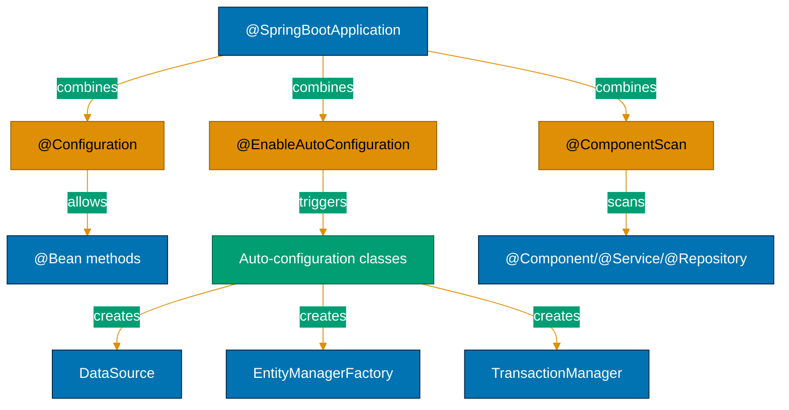

## Why @SpringBootApplication Matters

Spring Boot's @SpringBootApplication meta-annotation eliminates boilerplate by combining three essential annotations (@Configuration, @EnableAutoConfiguration, @ComponentScan) into a single declaration. In production applications with dozens of configuration classes, this consolidation reduces verbosity while maintaining explicit control through attribute overrides—enabling teams to configure applications concisely without sacrificing clarity.

**Core Benefits**:

- **Reduces boilerplate**: One annotation instead of three
- **Explicit defaults**: Component scanning from package containing main class
- **Override capability**: Customize base packages, exclude auto-configurations
- **Convention over configuration**: Sensible defaults work immediately
- **Production-ready**: Enables auto-configuration and component scanning with one line

**Problem**: Manual Spring Boot setup requires three separate annotations on main class.

**Solution**: @SpringBootApplication meta-annotation combines all three with customizable attributes.

## Manual Spring Boot Configuration

Spring Boot applications require explicit @Configuration, @EnableAutoConfiguration, and @ComponentScan:

```java
package com.zakatfoundation.app;

import org.springframework.boot.SpringApplication;
import org.springframework.boot.autoconfigure.EnableAutoConfiguration;
// => EnableAutoConfiguration: triggers Spring Boot auto-configuration
// => Scans META-INF/spring.factories for auto-config classes
import org.springframework.context.annotation.ComponentScan;
// => ComponentScan: scans for @Component, @Service, @Repository
// => Without this, Spring doesn't detect beans
import org.springframework.context.annotation.Configuration;
// => Configuration: marks class as configuration source
// => Allows @Bean methods

@Configuration  // => This class provides bean definitions
@EnableAutoConfiguration  // => Enable Spring Boot auto-configuration
@ComponentScan  // => Scan for components in current package
// => Scans com.zakatfoundation.app and subpackages
public class ZakatApplication {

    public static void main(String[] args) {
        // => SpringApplication.run: bootstraps Spring Boot
        // => Creates ApplicationContext, starts embedded server
        SpringApplication.run(ZakatApplication.class, args);
        // => ZakatApplication.class: configuration class with three annotations
    }
}
```

**Limitations**:

- **Verbose**: Three annotations for standard setup
- **Error-prone**: Easy to forget one annotation (common mistake: omit @ComponentScan)
- **Repetitive**: Every Spring Boot app needs identical three annotations
- **No clear intent**: Doesn't communicate "this is a Spring Boot app"

## @SpringBootApplication Meta-Annotation

Spring Boot provides @SpringBootApplication as single meta-annotation:

```java
package com.zakatfoundation.app;

import org.springframework.boot.SpringApplication;
import org.springframework.boot.autoconfigure.SpringBootApplication;
// => SpringBootApplication: meta-annotation combining three annotations
// => Internally annotated with @Configuration + @EnableAutoConfiguration + @ComponentScan

@SpringBootApplication  // => Equivalent to three annotations
// => @Configuration: allows @Bean methods in this class
// => @EnableAutoConfiguration: triggers auto-configuration
// => @ComponentScan: scans com.zakatfoundation.app and subpackages
public class ZakatApplication {

    public static void main(String[] args) {
        SpringApplication.run(ZakatApplication.class, args);
        // => Starts Spring Boot application with auto-configuration
    }
}
```

**How @SpringBootApplication Works**:

```java
// => Meta-annotation definition in Spring Boot source
@Target(ElementType.TYPE)
@Retention(RetentionPolicy.RUNTIME)
@Documented
@Inherited
@SpringBootConfiguration  // => Specialized @Configuration
@EnableAutoConfiguration  // => Triggers auto-configuration
@ComponentScan(excludeFilters = {  // => Component scanning with defaults
    @Filter(type = FilterType.CUSTOM, classes = TypeExcludeFilter.class),
    @Filter(type = FilterType.CUSTOM, classes = AutoConfigurationExcludeFilter.class)
})
// => Excludes other @SpringBootConfiguration classes (prevents duplicate config)
public @interface SpringBootApplication {
    // => Attributes delegate to underlying annotations
}
```

## Customizing @SpringBootApplication

Override default behavior through attributes:

```java
package com.zakatfoundation.app;

import org.springframework.boot.SpringApplication;
import org.springframework.boot.autoconfigure.SpringBootApplication;
import org.springframework.boot.autoconfigure.jdbc.DataSourceAutoConfiguration;

@SpringBootApplication(
    scanBasePackages = {
        "com.zakatfoundation.app",
        // => Custom package scanning: include additional packages
        "com.zakatfoundation.shared"
        // => Useful for multi-module projects
    },
    exclude = DataSourceAutoConfiguration.class
    // => Exclude specific auto-configurations
    // => Useful when manually configuring DataSource
)
public class ZakatApplication {
    public static void main(String[] args) {
        SpringApplication.run(ZakatApplication.class, args);
    }
}
```

**Common Customizations**:

```java
// => Exclude multiple auto-configurations
@SpringBootApplication(exclude = {
    DataSourceAutoConfiguration.class,  // => Manual DataSource config
    RedisAutoConfiguration.class  // => Manual Redis config
})

// => Scan specific packages only
@SpringBootApplication(scanBasePackages = "com.zakatfoundation")
// => Scans com.zakatfoundation and all subpackages

// => Use package classes for type-safe scanning
@SpringBootApplication(scanBasePackageClasses = {
    ZakatService.class,  // => Scans package containing ZakatService
    DonationService.class  // => Scans package containing DonationService
})
// => Type-safe: refactoring updates automatically
```

## Production Patterns

### Pattern 1: Multi-Module Applications

```java
// => Core module: shared domain
package com.zakatfoundation.core;

@SpringBootApplication(scanBasePackages = {
    "com.zakatfoundation.core",  // => Core module
    "com.zakatfoundation.donation",  // => Donation module
    "com.zakatfoundation.distribution"  // => Distribution module
})
public class ZakatCoreApplication {
    public static void main(String[] args) {
        SpringApplication.run(ZakatCoreApplication.class, args);
    }
}
```

### Pattern 2: Selective Auto-Configuration

```java
// => Test application: exclude database auto-configuration
@SpringBootApplication(exclude = {
    DataSourceAutoConfiguration.class,  // => No database
    DataSourceTransactionManagerAutoConfiguration.class,
    HibernateJpaAutoConfiguration.class
})
public class ZakatTestApplication {
    // => Lightweight context for testing without database
}
```

### Pattern 3: Configuration Properties Scanning

```java
@SpringBootApplication
@ConfigurationPropertiesScan
// => Scans for @ConfigurationProperties classes
// => Alternative to @EnableConfigurationProperties
public class ZakatApplication {
    // => All @ConfigurationProperties in scanned packages registered
}
```

## Architecture Diagram



## When to Use @SpringBootApplication

**Use @SpringBootApplication when**:

- ✅ Standard Spring Boot application (95% of cases)
- ✅ Default component scanning acceptable (package containing main class)
- ✅ Auto-configuration desired (DataSource, JPA, web, etc.)
- ✅ Following Spring Boot conventions

**Use explicit annotations when**:

- ⚠️ Fine-grained control over component scanning needed
- ⚠️ Disabling auto-configuration globally (use @Configuration + @ComponentScan only)
- ⚠️ Non-standard application structure (multi-module with complex scanning)
- ⚠️ Testing scenarios requiring partial configuration

**Trade-offs**:

| Aspect             | @SpringBootApplication               | Explicit Annotations              |
| ------------------ | ------------------------------------ | --------------------------------- |
| **Verbosity**      | Concise (1 annotation)               | Verbose (3 annotations)           |
| **Clarity**        | Clear intent (Spring Boot app)       | Explicit but repetitive           |
| **Flexibility**    | Attributes for common customizations | Full control over each annotation |
| **Maintenance**    | Less boilerplate                     | More code to maintain             |
| **Learning curve** | Simple (one concept)                 | Must understand three annotations |

**Production recommendation**: Use @SpringBootApplication with attributes for customization. Explicit annotations only for edge cases requiring fine-grained control.

## Common Pitfalls

### Pitfall 1: Multiple @SpringBootApplication Classes

```java
// => WRONG: Two @SpringBootApplication in same package hierarchy
@SpringBootApplication
public class ZakatApplication { }

@SpringBootApplication  // => ERROR: duplicate configuration
public class DonationApplication { }
// => Spring Boot fails with: "Found multiple @SpringBootConfiguration"
```

**Solution**: Use @Configuration for additional config classes:

```java
@SpringBootApplication
public class ZakatApplication { }

@Configuration  // => Additional config, not @SpringBootApplication
public class DonationConfig { }
```

### Pitfall 2: Wrong Package Structure

```java
// => WRONG: Main class in root package
package com;  // => Too broad for component scanning

@SpringBootApplication  // => Scans entire com.* hierarchy (thousands of classes)
public class ZakatApplication { }
```

**Solution**: Use specific package:

```java
package com.zakatfoundation.app;  // => Specific package

@SpringBootApplication  // => Scans com.zakatfoundation.app.* only
public class ZakatApplication { }
```

## Next Steps

- [Embedded Servers](/en/learn/software-engineering/platform-web/tools/jvm-spring-boot/in-the-field/embedded-servers) - WAR deployment → embedded Tomcat/Jetty
- [Profiles and Environments](/en/learn/software-engineering/platform-web/tools/jvm-spring-boot/in-the-field/profiles-environments) - Environment-specific configuration
- [Auto-Configuration](/en/learn/software-engineering/platform-web/tools/jvm-spring-boot/in-the-field/auto-configuration) - How auto-configuration works internally
