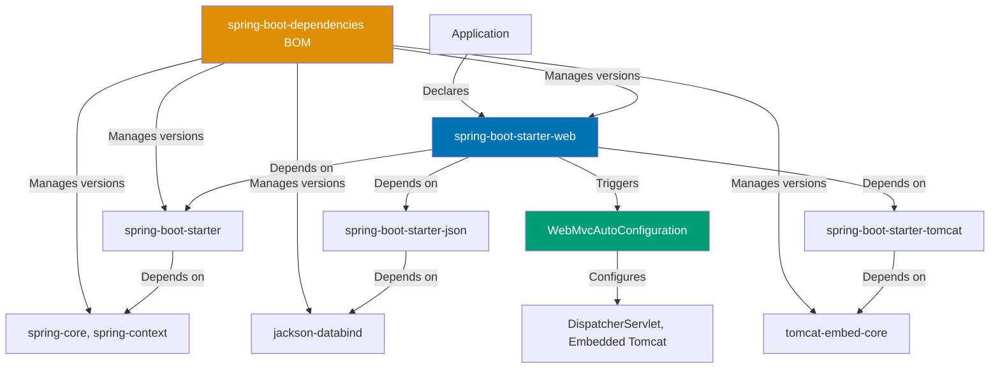

## Why Starter Dependencies Matter

Spring Boot starters bundle compatible versions of related dependencies into single coordinates, eliminating version conflicts and reducing pom.xml complexity from 50+ dependencies to 5-10 starters. In production systems using Spring Data JPA, Spring Security, Redis, Kafka, and monitoring, manual dependency management causes runtime ClassNotFoundExceptions and version incompatibilities—starters guarantee tested combinations that work together.

**Core Benefits**:

- **Simplified dependency management**: One starter replaces 10+ manual dependencies
- **Version compatibility**: Tested dependency combinations, no ClassNotFoundException
- **Transitive dependencies**: Spring Boot manages sub-dependencies automatically
- **Auto-configuration**: Starters trigger auto-configuration for included libraries
- **Production-ready**: Starters include production-grade defaults (connection pooling, JSON parsing)

**Problem**: Manual dependency management requires knowing exact coordinates, versions, and transitive dependencies for every library.

**Solution**: Spring Boot starters provide curated dependency bundles with compatible versions and auto-configuration.

## Manual Maven Dependency Management

Traditional Spring projects require explicit dependency declarations for every library:

```xml
<!-- pom.xml: Manual dependency management (before Spring Boot) -->
<project>
    <dependencies>
        <!-- Spring Framework Core (5 dependencies) -->
        <dependency>
            <groupId>org.springframework</groupId>
            <artifactId>spring-context</artifactId>
            <version>6.1.3</version>
            <!-- => Must specify exact version for every artifact -->
            <!-- => Version mismatch between spring-context and spring-jdbc
                     causes runtime errors -->
        </dependency>
        <dependency>
            <groupId>org.springframework</groupId>
            <artifactId>spring-jdbc</artifactId>
            <version>6.1.3</version>
            <!-- => Must keep version synchronized with spring-context -->
        </dependency>
        <dependency>
            <groupId>org.springframework</groupId>
            <artifactId>spring-tx</artifactId>
            <version>6.1.3</version>
            <!-- => Transaction management: separate artifact -->
        </dependency>

        <!-- Spring Data JPA (8 dependencies) -->
        <dependency>
            <groupId>org.springframework.data</groupId>
            <artifactId>spring-data-jpa</artifactId>
            <version>3.2.2</version>
            <!-- => Spring Data version must match Spring Framework version -->
        </dependency>
        <dependency>
            <groupId>org.hibernate.orm</groupId>
            <artifactId>hibernate-core</artifactId>
            <version>6.4.2.Final</version>
            <!-- => Hibernate version must be compatible with Spring Data JPA -->
        </dependency>
        <dependency>
            <groupId>jakarta.persistence</groupId>
            <artifactId>jakarta.persistence-api</artifactId>
            <version>3.1.0</version>
            <!-- => JPA API: version must match Hibernate -->
        </dependency>
        <dependency>
            <groupId>com.zaxxer</groupId>
            <artifactId>HikariCP</artifactId>
            <version>5.1.0</version>
            <!-- => Connection pool: must find compatible version manually -->
        </dependency>
        <dependency>
            <groupId>org.postgresql</groupId>
            <artifactId>postgresql</artifactId>
            <version>42.7.1</version>
            <!-- => JDBC driver: version compatibility with JDBC API -->
        </dependency>

        <!-- Spring Web (12 dependencies) -->
        <dependency>
            <groupId>org.springframework</groupId>
            <artifactId>spring-web</artifactId>
            <version>6.1.3</version>
        </dependency>
        <dependency>
            <groupId>org.springframework</groupId>
            <artifactId>spring-webmvc</artifactId>
            <version>6.1.3</version>
        </dependency>
        <dependency>
            <groupId>com.fasterxml.jackson.core</groupId>
            <artifactId>jackson-databind</artifactId>
            <version>2.16.1</version>
            <!-- => JSON parsing: must be compatible with Spring -->
        </dependency>
        <dependency>
            <groupId>org.apache.tomcat.embed</groupId>
            <artifactId>tomcat-embed-core</artifactId>
            <version>10.1.18</version>
            <!-- => Embedded server: manual version management -->
        </dependency>
        <!-- ... 8 more Tomcat dependencies ... -->

        <!-- Testing (6 dependencies) -->
        <dependency>
            <groupId>org.junit.jupiter</groupId>
            <artifactId>junit-jupiter</artifactId>
            <version>5.10.1</version>
            <scope>test</scope>
        </dependency>
        <dependency>
            <groupId>org.springframework</groupId>
            <artifactId>spring-test</artifactId>
            <version>6.1.3</version>
            <scope>test</scope>
        </dependency>
        <!-- ... 4 more test dependencies ... -->
    </dependencies>
</project>

<!-- Result: 50+ dependencies for basic Spring JPA web app -->
```

**Limitations**:

- **Verbose**: 50+ dependency declarations for basic app
- **Error-prone**: Version mismatches cause ClassNotFoundException at runtime
- **Maintenance burden**: Upgrading Spring requires updating 15+ version tags
- **No transitive management**: Must manually add transitive dependencies
- **No auto-configuration**: Dependencies don't trigger Spring Boot auto-config

## Spring Boot Starter Dependencies

Spring Boot provides starter POMs bundling compatible dependencies:

```xml
<!-- pom.xml: Spring Boot starters (simplified) -->
<project>
    <!-- Parent POM: provides dependency management -->
    <parent>
        <groupId>org.springframework.boot</groupId>
        <artifactId>spring-boot-starter-parent</artifactId>
        <version>3.2.2</version>
        <!-- => spring-boot-starter-parent:
             - Defines versions for 500+ managed dependencies
             - Provides Maven plugin configuration
             - Sets Java version, encoding, compiler settings -->
    </parent>

    <dependencies>
        <!-- Spring Boot Web Starter: REST APIs + embedded Tomcat -->
        <dependency>
            <groupId>org.springframework.boot</groupId>
            <artifactId>spring-boot-starter-web</artifactId>
            <!-- => No <version> tag: inherited from parent POM -->
            <!-- => Includes:
                 - spring-boot-starter (core Spring Boot)
                 - spring-boot-starter-tomcat (embedded Tomcat)
                 - spring-webmvc (Spring MVC)
                 - jackson-databind (JSON parsing)
                 - spring-boot-starter-json (JSON support)
                 - All transitive dependencies (30+ artifacts) -->
        </dependency>

        <!-- Spring Boot Data JPA Starter: JPA + Hibernate + connection pool -->
        <dependency>
            <groupId>org.springframework.boot</groupId>
            <artifactId>spring-boot-starter-data-jpa</artifactId>
            <!-- => Includes:
                 - spring-data-jpa (Spring Data repositories)
                 - hibernate-core (JPA implementation)
                 - jakarta.persistence-api (JPA API)
                 - HikariCP (connection pool)
                 - spring-jdbc (JDBC support)
                 - spring-tx (transaction management)
                 - All compatible versions tested together -->
        </dependency>

        <!-- PostgreSQL JDBC Driver: only driver needed explicitly -->
        <dependency>
            <groupId>org.postgresql</groupId>
            <artifactId>postgresql</artifactId>
            <scope>runtime</scope>
            <!-- => Version managed by spring-boot-dependencies BOM -->
        </dependency>

        <!-- Spring Boot Test Starter: JUnit + Spring Test + MockMvc -->
        <dependency>
            <groupId>org.springframework.boot</groupId>
            <artifactId>spring-boot-starter-test</artifactId>
            <scope>test</scope>
            <!-- => Includes:
                 - junit-jupiter (JUnit 5)
                 - spring-test (Spring testing support)
                 - spring-boot-test (Spring Boot test utilities)
                 - mockito-core (mocking framework)
                 - assertj-core (fluent assertions)
                 - hamcrest (matchers)
                 - All compatible versions -->
        </dependency>
    </dependencies>
</project>

<!-- Result: 4 dependencies replace 50+ manual declarations -->
```

**How starters work**:



**Trade-offs**:

- **Added complexity**: Transitive dependencies hidden, harder to troubleshoot
- **Less control**: Starter versions determined by Spring Boot BOM
- **Larger JARs**: Starters include dependencies you might not need
- **Justification**: Worth it for projects using multiple Spring modules (>3 dependencies)

## Common Spring Boot Starters

```xml
<!-- Production-ready starters -->

<!-- spring-boot-starter-web: REST APIs, Spring MVC, embedded Tomcat -->
<dependency>
    <groupId>org.springframework.boot</groupId>
    <artifactId>spring-boot-starter-web</artifactId>
    <!-- => Includes: Spring MVC, Jackson, Tomcat, validation -->
    <!-- => Use case: REST APIs, web applications -->
</dependency>

<!-- spring-boot-starter-data-jpa: JPA repositories, Hibernate -->
<dependency>
    <groupId>org.springframework.boot</groupId>
    <artifactId>spring-boot-starter-data-jpa</artifactId>
    <!-- => Includes: Spring Data JPA, Hibernate, HikariCP, JDBC -->
    <!-- => Use case: SQL databases (PostgreSQL, MySQL, Oracle) -->
</dependency>

<!-- spring-boot-starter-security: Authentication, authorization -->
<dependency>
    <groupId>org.springframework.boot</groupId>
    <artifactId>spring-boot-starter-security</artifactId>
    <!-- => Includes: Spring Security, authentication filters, CSRF protection -->
    <!-- => Use case: Authentication (JWT, OAuth2), authorization -->
</dependency>

<!-- spring-boot-starter-data-redis: Redis caching, session storage -->
<dependency>
    <groupId>org.springframework.boot</groupId>
    <artifactId>spring-boot-starter-data-redis</artifactId>
    <!-- => Includes: Lettuce Redis client, Spring Data Redis -->
    <!-- => Use case: Caching, session storage, distributed locks -->
</dependency>

<!-- spring-boot-starter-validation: Bean Validation (JSR 380) -->
<dependency>
    <groupId>org.springframework.boot</groupId>
    <artifactId>spring-boot-starter-validation</artifactId>
    <!-- => Includes: Hibernate Validator, Jakarta Bean Validation API -->
    <!-- => Use case: Input validation (@NotNull, @Email, @Size) -->
</dependency>

<!-- spring-boot-starter-actuator: Production monitoring, health checks -->
<dependency>
    <groupId>org.springframework.boot</groupId>
    <artifactId>spring-boot-starter-actuator</artifactId>
    <!-- => Includes: Actuator endpoints, metrics (Micrometer), health checks -->
    <!-- => Use case: /actuator/health, /actuator/metrics, production monitoring -->
</dependency>

<!-- spring-boot-starter-webflux: Reactive web, non-blocking I/O -->
<dependency>
    <groupId>org.springframework.boot</groupId>
    <artifactId>spring-boot-starter-webflux</artifactId>
    <!-- => Includes: Spring WebFlux, Project Reactor, Netty -->
    <!-- => Use case: Reactive streams, high concurrency (>10K connections) -->
</dependency>

<!-- spring-boot-starter-kafka: Kafka producer/consumer -->
<dependency>
    <groupId>org.springframework.boot</groupId>
    <artifactId>spring-boot-starter-kafka</artifactId>
    <!-- => Includes: Kafka client, Spring Kafka templates -->
    <!-- => Use case: Event streaming, message queues -->
</dependency>

<!-- spring-boot-starter-test: Testing (JUnit, Mockito, Spring Test) -->
<dependency>
    <groupId>org.springframework.boot</groupId>
    <artifactId>spring-boot-starter-test</artifactId>
    <scope>test</scope>
    <!-- => Includes: JUnit 5, Spring Test, Mockito, AssertJ, MockMvc -->
    <!-- => Use case: Unit tests, integration tests, MockMvc -->
</dependency>
```

## Creating Custom Starters

Production libraries can provide custom starters for their services:

```xml
<!-- Custom starter structure: zakat-spring-boot-starter -->
<!-- File: pom.xml -->
<project>
    <groupId>com.example</groupId>
    <artifactId>zakat-spring-boot-starter</artifactId>
    <version>1.0.0</version>
    <name>Zakat Spring Boot Starter</name>

    <dependencies>
        <!-- Auto-configuration module: provides @Configuration classes -->
        <dependency>
            <groupId>com.example</groupId>
            <artifactId>zakat-spring-boot-autoconfigure</artifactId>
            <version>${project.version}</version>
            <!-- => Contains ZakatAutoConfiguration class -->
        </dependency>

        <!-- Core library: business logic -->
        <dependency>
            <groupId>com.example</groupId>
            <artifactId>zakat-calculator</artifactId>
            <version>${project.version}</version>
            <!-- => ZakatCalculator, ZakatService implementation -->
        </dependency>

        <!-- Spring Boot core: required for auto-configuration -->
        <dependency>
            <groupId>org.springframework.boot</groupId>
            <artifactId>spring-boot-starter</artifactId>
            <!-- => Version managed by spring-boot-dependencies BOM -->
        </dependency>

        <!-- Optional dependencies: starter includes but doesn't force -->
        <dependency>
            <groupId>org.springframework.boot</groupId>
            <artifactId>spring-boot-starter-data-jpa</artifactId>
            <optional>true</optional>
            <!-- => Optional: only needed if ZakatRepository used -->
        </dependency>
    </dependencies>
</project>
```

Auto-configuration module:

```java
// => zakat-spring-boot-autoconfigure/src/main/java/.../ZakatAutoConfiguration.java
@Configuration
@ConditionalOnClass(ZakatCalculator.class)
@EnableConfigurationProperties(ZakatProperties.class)
public class ZakatAutoConfiguration {

    @Bean
    @ConditionalOnMissingBean
    public ZakatCalculator zakatCalculator(ZakatProperties properties) {
        // => Auto-configured ZakatCalculator bean
        return new ZakatCalculator(
            properties.getNisabGrams(),
            properties.getRate()
        );
    }

    @Bean
    @ConditionalOnClass(name = "org.springframework.data.jpa.repository.JpaRepository")
    @ConditionalOnProperty(name = "zakat.repository.enabled", havingValue = "true")
    public ZakatRepository zakatRepository() {
        // => Auto-configured repository: only if JPA on classpath
        return new JpaZakatRepository();
    }
}

// => Register auto-configuration in META-INF/spring.factories
// src/main/resources/META-INF/spring.factories:
// org.springframework.boot.autoconfigure.EnableAutoConfiguration=\
// com.example.zakat.autoconfigure.ZakatAutoConfiguration
```

Consumers use starter by adding dependency:

```xml
<!-- User's pom.xml -->
<dependency>
    <groupId>com.example</groupId>
    <artifactId>zakat-spring-boot-starter</artifactId>
    <version>1.0.0</version>
    <!-- => Single dependency brings:
         - zakat-calculator (core library)
         - ZakatAutoConfiguration (auto-config)
         - ZakatCalculator bean (auto-configured) -->
</dependency>

<!-- User's application.yml: configure via properties -->
zakat:
  nisab-grams: 85
  rate: 0.025
  repository:
    enabled: true  # => Enable ZakatRepository auto-configuration
```

## Gradle Starter Configuration

Gradle projects use Spring Boot plugin and dependency management:

```groovy
// build.gradle: Gradle equivalent of Spring Boot starters
plugins {
    id 'org.springframework.boot' version '3.2.2'
    // => Spring Boot Gradle plugin:
    // - Provides bootJar task (executable JAR)
    // - Manages dependency versions
    // - Configures Spring Boot plugin defaults

    id 'io.spring.dependency-management' version '1.1.4'
    // => Dependency management plugin:
    // - Imports spring-boot-dependencies BOM
    // - Provides version management without parent POM
}

dependencies {
    // Spring Boot starters: no version required
    implementation 'org.springframework.boot:spring-boot-starter-web'
    // => Version resolved from spring-boot-dependencies BOM

    implementation 'org.springframework.boot:spring-boot-starter-data-jpa'
    runtimeOnly 'org.postgresql:postgresql'
    // => Runtime dependency: not needed for compilation

    testImplementation 'org.springframework.boot:spring-boot-starter-test'
    // => Test scope: only available during testing
}

// Kotlin DSL (build.gradle.kts)
plugins {
    id("org.springframework.boot") version "3.2.2"
    id("io.spring.dependency-management") version "1.1.4"
}

dependencies {
    implementation("org.springframework.boot:spring-boot-starter-web")
    implementation("org.springframework.boot:spring-boot-starter-data-jpa")
    runtimeOnly("org.postgresql:postgresql")
    testImplementation("org.springframework.boot:spring-boot-starter-test")
}
```

## Overriding Managed Dependency Versions

Spring Boot BOM manages dependency versions, but you can override:

```xml
<!-- Override managed version in Maven -->
<properties>
    <!-- Override Jackson version (Spring Boot default: 2.16.1) -->
    <jackson.version>2.16.2</jackson.version>
    <!-- => Spring Boot respects this property when resolving jackson-databind -->

    <!-- Override Hibernate version -->
    <hibernate.version>6.4.3.Final</hibernate.version>
</properties>

<dependencies>
    <!-- Explicit version overrides BOM -->
    <dependency>
        <groupId>com.fasterxml.jackson.core</groupId>
        <artifactId>jackson-databind</artifactId>
        <version>2.17.0</version>
        <!-- => Explicit version takes precedence over managed version -->
    </dependency>
</dependencies>
```

```groovy
// Override managed version in Gradle
ext['jackson.version'] = '2.16.2'
// => Spring Boot plugin respects this property

dependencies {
    // Explicit version overrides BOM
    implementation('com.fasterxml.jackson.core:jackson-databind:2.17.0')
    // => Explicit version takes precedence
}
```

**Production warning**: Override managed versions only when necessary (security patches, critical bugs). Spring Boot tests starters together—overriding risks runtime incompatibilities.

## Starter Dependencies Best Practices

```java
// => Use starters for standard Spring modules
// GOOD: Spring Boot starter includes compatible versions
<dependency>
    <groupId>org.springframework.boot</groupId>
    <artifactId>spring-boot-starter-data-jpa</artifactId>
</dependency>

// => Add only drivers/connectors explicitly
// GOOD: Driver not included in starters, must add explicitly
<dependency>
    <groupId>org.postgresql</groupId>
    <artifactId>postgresql</artifactId>
    <scope>runtime</scope>
</dependency>

// => Avoid mixing Spring Boot and standalone Spring dependencies
// BAD: Version mismatch between Spring Boot and standalone Spring Data
<dependency>
    <groupId>org.springframework.boot</groupId>
    <artifactId>spring-boot-starter-web</artifactId>
</dependency>
<dependency>
    <groupId>org.springframework.data</groupId>
    <artifactId>spring-data-jpa</artifactId>
    <version>3.3.0</version>  <!-- Incompatible with Spring Boot 3.2.2 -->
</dependency>

// => Use dependency exclusions to remove unwanted transitive deps
<dependency>
    <groupId>org.springframework.boot</groupId>
    <artifactId>spring-boot-starter-web</artifactId>
    <exclusions>
        <exclusion>
            <!-- Exclude default Tomcat, use Jetty instead -->
            <groupId>org.springframework.boot</groupId>
            <artifactId>spring-boot-starter-tomcat</artifactId>
        </exclusion>
    </exclusions>
</dependency>
<dependency>
    <!-- Add Jetty starter explicitly -->
    <groupId>org.springframework.boot</groupId>
    <artifactId>spring-boot-starter-jetty</artifactId>
</dependency>
```

## When to Use Starters vs Manual Dependencies

**Use Spring Boot starters**:

- Standard Spring modules (Web, Data JPA, Security, Actuator, Redis, Kafka)
- Rapid development with auto-configuration
- Teams lacking Spring expertise (starters provide best practices)
- Greenfield projects following Spring Boot conventions

**Use manual dependencies**:

- Non-standard libraries without Spring Boot starters
- Existing projects with custom dependency management
- Precise version control requirements (regulatory compliance)
- Minimal JAR size critical (embedded systems, AWS Lambda)

**Production recommendation**: Use starters as default for Spring modules, add manual dependencies only for non-Spring libraries (AWS SDK, Apache POI, etc.).

## Related Patterns

- **[Auto-Configuration](/en/learn/software-engineering/platform-web/tools/jvm-spring-boot/in-the-field/auto-configuration)** - How starters trigger auto-configuration via @Conditional
- **[Application Properties](/en/learn/software-engineering/platform-web/tools/jvm-spring-boot/in-the-field/application-properties)** - Configure starter behavior via application.yml
- **[Configuration Properties](/en/learn/software-engineering/platform-web/tools/jvm-spring-boot/in-the-field/configuration-properties)** - Type-safe configuration for custom starters
