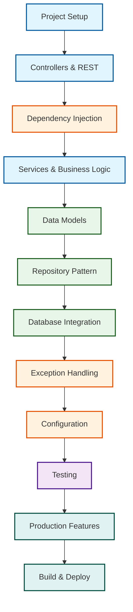
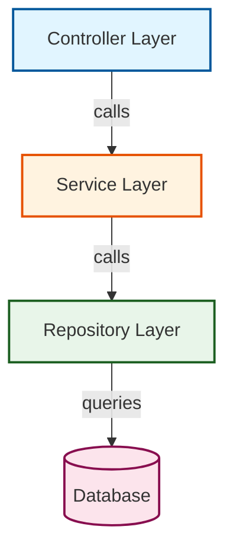

**Want to quickly understand Spring Boot's core concepts?** This quick start guide provides a fast-paced tour through the fundamental concepts that make Spring Boot work. By the end, you'll understand the architecture, patterns, and tools needed to build production-ready applications.

This tutorial provides 5-30% coverage - enough to understand Spring Boot's architecture and start building. For deeper learning, continue to [Beginner Tutorial](/en/learn/software-engineering/platform-web/tools/jvm-spring-boot/by-example/beginner) (0-60% coverage) or explore [By Example](/en/learn/software-engineering/platform-web/tools/jvm-spring-boot/by-example) for code-first learning.

## Prerequisites

Before starting this quick start, you should have:

- Spring Boot installed and working (complete [Initial Setup](/en/learn/software-engineering/platform-web/tools/jvm-spring-boot/initial-setup) first)
- Basic Java or Kotlin knowledge (classes, methods, annotations)
- Text editor or IDE (IntelliJ IDEA recommended)
- Terminal access
- Basic HTTP understanding (GET, POST, status codes)

## Learning Path

This quick start follows a structured learning path:



**Color Key**:

- Blue - Web Layer (Controllers, REST)
- Orange - Core Concepts (DI, Configuration, Error Handling)
- Green - Data Layer (Models, Repositories, Database)
- Purple - Testing
- Teal - Production & Deployment

## What You'll Build

Throughout this tutorial, you'll build a **Task Management API** that demonstrates Spring Boot's core features:

- REST endpoints for CRUD operations
- Service layer for business logic
- Database integration with PostgreSQL
- Exception handling and validation
- Configuration management
- Unit and integration tests

## Concept 1: Spring Boot Application Structure

Spring Boot applications follow layered architecture with clear separation of concerns.

### Three-Layer Architecture



**Layer responsibilities**:

- **Controller** - Handles HTTP requests, validates input, returns responses
- **Service** - Contains business logic, orchestrates operations
- **Repository** - Manages database operations, executes queries

### Project Structure Example

```
src/main/java/com/example/taskmanager/
├── TaskManagerApplication.java     # Main entry point
├── controller/
│   └── TaskController.java         # REST endpoints
├── service/
│   └── TaskService.java            # Business logic
├── repository/
│   └── TaskRepository.java         # Database access
├── model/
│   └── Task.java                   # Entity/domain model
├── dto/
│   ├── TaskRequest.java            # Request data transfer object
│   └── TaskResponse.java           # Response data transfer object
├── exception/
│   ├── TaskNotFoundException.java
│   └── GlobalExceptionHandler.java
└── config/
    └── DatabaseConfig.java         # Configuration classes
```

**Key principles**:

- Each layer has single responsibility
- Layers depend only on layers below them
- Controllers never access repositories directly
- Business logic stays in service layer

## Concept 2: REST Controllers

Controllers handle HTTP requests and return responses.

### Basic Controller

**Java**:

```java
package com.example.taskmanager.controller;

import org.springframework.web.bind.annotation.GetMapping;
import org.springframework.web.bind.annotation.RequestMapping;
import org.springframework.web.bind.annotation.RestController;

@RestController                       // => Marks class as REST controller
@RequestMapping("/api/tasks")         // => Base path for all endpoints
public class TaskController {

    @GetMapping                       // => Maps GET /api/tasks
    public String getAllTasks() {     // => Method handles GET request
        return "Task list";           // => Returns plain text response
    }                                 // => Spring serializes return value automatically
}
```

**Kotlin**:

```kotlin
package com.example.taskmanager.controller

import org.springframework.web.bind.annotation.GetMapping
import org.springframework.web.bind.annotation.RequestMapping
import org.springframework.web.bind.annotation.RestController

@RestController                       // => Marks class as REST controller
@RequestMapping("/api/tasks")         // => Base path for all endpoints
class TaskController {

    @GetMapping                       // => Maps GET /api/tasks
    fun getAllTasks(): String {       // => Method handles GET request
        return "Task list"            // => Returns plain text response
    }                                 // => Spring serializes return value automatically
}
```

**Test the endpoint**:

```bash
curl http://localhost:8080/api/tasks
```

**Key annotations**:

- `@RestController` - Combines `@Controller` and `@ResponseBody` (auto-serializes responses to JSON)
- `@RequestMapping` - Base path for all methods in controller
- `@GetMapping` - Maps HTTP GET requests to method

### Handling Path Variables

**Java**:

```java
import org.springframework.web.bind.annotation.GetMapping;
import org.springframework.web.bind.annotation.PathVariable;

@GetMapping("/{id}")                  // => Path template with variable
public String getTask(@PathVariable Long id) {
                                      // => @PathVariable extracts id from path
    return "Task #" + id;             // => id captured from URL path
}                                     // => Returns: "Task #123"
```

**Kotlin**:

```kotlin
import org.springframework.web.bind.annotation.GetMapping
import org.springframework.web.bind.annotation.PathVariable

@GetMapping("/{id}")                  // => Path template with variable
fun getTask(@PathVariable id: Long): String {
                                      // => @PathVariable extracts id from path
    return "Task #$id"                // => id captured from URL path
}                                     // => Returns: "Task #123"
```

**Test**:

```bash
curl http://localhost:8080/api/tasks/123
```

### Handling Query Parameters

**Java**:

```java
import org.springframework.web.bind.annotation.RequestParam;

@GetMapping("/search")                // => Endpoint: GET /api/tasks/search
public String searchTasks(
    @RequestParam(required = false) String status,
                                      // => Extracts ?status=completed
    @RequestParam(defaultValue = "10") int limit
                                      // => Default value if not provided
) {
    return "Search: status=" + status + ", limit=" + limit;
                                      // => Returns formatted string
}
```

**Kotlin**:

```kotlin
import org.springframework.web.bind.annotation.RequestParam

@GetMapping("/search")                // => Endpoint: GET /api/tasks/search
fun searchTasks(
    @RequestParam(required = false) status: String?,
                                      // => Extracts ?status=completed (nullable)
    @RequestParam(defaultValue = "10") limit: Int
                                      // => Default value if not provided
): String {
    return "Search: status=$status, limit=$limit"
                                      // => Returns formatted string
}
```

**Test**:

```bash
curl "http://localhost:8080/api/tasks/search?status=completed&limit=5"
```

## Concept 3: Dependency Injection (DI)

Spring Boot's core feature - automatic object creation and wiring.

### Why Dependency Injection?

Without DI (manual object creation):

**Java**:

```java
public class TaskController {
    private TaskService service = new TaskService();
                                      // => Manually creates service instance
                                      // => Controller tightly coupled to service
                                      // => Hard to test (can't mock service)
}
```

With DI (Spring manages objects):

**Java**:

```java
import org.springframework.beans.factory.annotation.Autowired;

@RestController
public class TaskController {

    private final TaskService service;
                                      // => Service instance provided by Spring

    @Autowired                        // => Spring injects dependency
    public TaskController(TaskService service) {
                                      // => Constructor injection (recommended)
        this.service = service;       // => Stores injected service
    }                                 // => Service created by Spring, not manually
}
```

**Kotlin** (simpler with primary constructor):

```kotlin
@RestController
class TaskController(
    private val service: TaskService  // => Spring injects automatically
)                                     // => No @Autowired needed in Kotlin
                                      // => Service provided by Spring
```

**Benefits**:

- Loose coupling (controller doesn't create service)
- Easy testing (inject mock service)
- Single Responsibility Principle (Spring manages object lifecycle)
- Automatic configuration

### Component Scanning

Spring automatically discovers and creates objects marked with stereotypes:

- `@RestController` - Web controllers
- `@Service` - Service layer
- `@Repository` - Data access layer
- `@Component` - Generic managed component

**Java Service Example**:

```java
package com.example.taskmanager.service;

import org.springframework.stereotype.Service;

@Service                              // => Marks class as Spring-managed service
public class TaskService {            // => Spring creates instance automatically

    public String findAll() {         // => Business logic method
        return "All tasks from service";
                                      // => Returns data (actual implementation would use repository)
    }
}
```

**Kotlin Service Example**:

```kotlin
package com.example.taskmanager.service

import org.springframework.stereotype.Service

@Service                              // => Marks class as Spring-managed service
class TaskService {                   // => Spring creates instance automatically

    fun findAll(): String {           // => Business logic method
        return "All tasks from service"
                                      // => Returns data (actual implementation would use repository)
    }
}
```

**Use in Controller**:

**Java**:

```java
@RestController
@RequestMapping("/api/tasks")
public class TaskController {

    private final TaskService service;

    @Autowired
    public TaskController(TaskService service) {
                                      // => Spring injects TaskService instance
        this.service = service;
    }

    @GetMapping
    public String getAllTasks() {
        return service.findAll();     // => Calls injected service
    }
}
```

**Kotlin**:

```kotlin
@RestController
@RequestMapping("/api/tasks")
class TaskController(
    private val service: TaskService  // => Spring injects TaskService instance
) {

    @GetMapping
    fun getAllTasks(): String {
        return service.findAll()      // => Calls injected service
    }
}
```

## Concept 4: Data Transfer Objects (DTOs)

DTOs separate external API representation from internal domain models.

### Why DTOs?

**Without DTOs** (exposing entity directly):

```java
@Entity                               // => Database entity
public class Task {
    private Long id;
    private String password;          // => Sensitive field exposed!
    private String internalNotes;     // => Internal field exposed!
    // Getters/setters
}

@GetMapping
public Task getTask() {
    return taskRepository.findById(1L);
                                      // => Returns entity with ALL fields
                                      // => password and internalNotes visible in JSON!
}
```

**With DTOs** (controlled exposure):

**Java**:

```java
// DTO for API responses
public class TaskResponse {
    private Long id;
    private String title;
    private String status;
    // Only public fields included

    public TaskResponse(Long id, String title, String status) {
        this.id = id;                 // => Explicit field selection
        this.title = title;
        this.status = status;
    }

    // Getters only (immutable response)
}
```

**Kotlin** (data class):

```kotlin
// DTO for API responses
data class TaskResponse(              // => Data class (automatic equals/hashCode/toString)
    val id: Long,                     // => Immutable fields
    val title: String,
    val status: String
)                                     // => Only public fields included
```

### Request and Response DTOs

**Java Request DTO**:

```java
public class TaskRequest {
    private String title;             // => Field from request body
    private String description;
    private String status;

    // Validation annotations
    @NotBlank(message = "Title required")
    public String getTitle() {
        return title;                 // => Getter with validation
    }

    // Setters for deserialization
}
```

**Kotlin Request DTO**:

```kotlin
data class TaskRequest(
    @field:NotBlank(message = "Title required")
                                      // => Validation on field
    val title: String,                // => Field from request body
    val description: String?,         // => Nullable field (optional)
    val status: String
)
```

**Using DTOs in Controller**:

**Java**:

```java
import org.springframework.web.bind.annotation.PostMapping;
import org.springframework.web.bind.annotation.RequestBody;

@PostMapping                          // => Maps POST /api/tasks
public TaskResponse createTask(@RequestBody TaskRequest request) {
                                      // => @RequestBody deserializes JSON to TaskRequest
    Task task = new Task(request.getTitle(), request.getDescription());
                                      // => Create entity from DTO
    Task saved = service.save(task);  // => Save to database
    return new TaskResponse(saved.getId(), saved.getTitle(), saved.getStatus());
                                      // => Convert entity to response DTO
}
```

**Kotlin**:

```kotlin
import org.springframework.web.bind.annotation.PostMapping
import org.springframework.web.bind.annotation.RequestBody

@PostMapping                          // => Maps POST /api/tasks
fun createTask(@RequestBody request: TaskRequest): TaskResponse {
                                      // => @RequestBody deserializes JSON to TaskRequest
    val task = Task(request.title, request.description)
                                      // => Create entity from DTO
    val saved = service.save(task)    // => Save to database
    return TaskResponse(saved.id, saved.title, saved.status)
                                      // => Convert entity to response DTO
}
```

**Test with curl**:

```bash
curl -X POST http://localhost:8080/api/tasks \
  -H "Content-Type: application/json" \
  -d '{"title":"Write docs","description":"Spring Boot tutorial","status":"pending"}'

```

## Concept 5: JPA Entities and Database Models

JPA (Java Persistence API) maps Java/Kotlin classes to database tables.

### Basic Entity

**Java**:

```java
package com.example.taskmanager.model;

import jakarta.persistence.*;
import java.time.LocalDateTime;

@Entity                               // => Marks class as database entity
@Table(name = "tasks")                // => Maps to "tasks" table
public class Task {

    @Id                               // => Primary key field
    @GeneratedValue(strategy = GenerationType.IDENTITY)
                                      // => Auto-increment ID
    private Long id;

    @Column(nullable = false, length = 200)
                                      // => NOT NULL constraint, max length 200
    private String title;

    @Column(columnDefinition = "TEXT")
                                      // => TEXT type for long content
    private String description;

    @Column(nullable = false)
    private String status;            // => NOT NULL status field

    @Column(name = "created_at", updatable = false)
                                      // => Maps to created_at column, read-only
    private LocalDateTime createdAt;

    @PrePersist                       // => Called before INSERT
    protected void onCreate() {
        createdAt = LocalDateTime.now();
                                      // => Sets timestamp on creation
    }

    // Constructors, getters, setters
    protected Task() {}               // => JPA requires no-arg constructor

    public Task(String title, String description) {
        this.title = title;
        this.description = description;
        this.status = "pending";      // => Default status
    }
}
```

**Kotlin** (more concise):

```kotlin
package com.example.taskmanager.model

import jakarta.persistence.*
import java.time.LocalDateTime

@Entity                               // => Marks class as database entity
@Table(name = "tasks")                // => Maps to "tasks" table
data class Task(
    @Id                               // => Primary key field
    @GeneratedValue(strategy = GenerationType.IDENTITY)
                                      // => Auto-increment ID
    val id: Long = 0,                 // => Default value for new entities

    @Column(nullable = false, length = 200)
                                      // => NOT NULL constraint, max length 200
    var title: String,

    @Column(columnDefinition = "TEXT")
                                      // => TEXT type for long content
    var description: String? = null,  // => Nullable field

    @Column(nullable = false)
    var status: String = "pending",   // => Default status

    @Column(name = "created_at", updatable = false)
                                      // => Maps to created_at column, read-only
    val createdAt: LocalDateTime = LocalDateTime.now()
                                      // => Initialized on creation
)
```

**Generated SQL** (PostgreSQL):

```sql
CREATE TABLE tasks (
    id BIGSERIAL PRIMARY KEY,         -- Auto-increment ID
    title VARCHAR(200) NOT NULL,      -- NOT NULL, max 200 chars
    description TEXT,                 -- TEXT type, nullable
    status VARCHAR(255) NOT NULL,     -- NOT NULL status
    created_at TIMESTAMP NOT NULL     -- Timestamp field
);
```

### Common JPA Annotations

- `@Entity` - Marks class as database entity
- `@Table(name = "...")` - Specifies table name
- `@Id` - Primary key field
- `@GeneratedValue` - Auto-generated value strategy
- `@Column` - Column properties (nullable, length, name)
- `@PrePersist` - Lifecycle callback before INSERT
- `@PreUpdate` - Lifecycle callback before UPDATE

## Concept 6: Spring Data JPA Repositories

Repositories provide database operations without writing SQL.

### Repository Interface

**Java**:

```java
package com.example.taskmanager.repository;

import com.example.taskmanager.model.Task;
import org.springframework.data.jpa.repository.JpaRepository;
import org.springframework.stereotype.Repository;
import java.util.List;

@Repository                           // => Marks as repository component
public interface TaskRepository extends JpaRepository<Task, Long> {
                                      // => JpaRepository<Entity, ID type>
                                      // => Provides CRUD methods automatically

    // Custom query methods (derived from method name)
    List<Task> findByStatus(String status);
                                      // => SELECT * FROM tasks WHERE status = ?
                                      // => Spring generates query automatically

    List<Task> findByTitleContaining(String keyword);
                                      // => SELECT * FROM tasks WHERE title LIKE %keyword%
                                      // => LIKE query generated automatically
}
```

**Kotlin**:

```kotlin
package com.example.taskmanager.repository

import com.example.taskmanager.model.Task
import org.springframework.data.jpa.repository.JpaRepository
import org.springframework.stereotype.Repository

@Repository                           // => Marks as repository component
interface TaskRepository : JpaRepository<Task, Long> {
                                      // => JpaRepository<Entity, ID type>
                                      // => Provides CRUD methods automatically

    // Custom query methods (derived from method name)
    fun findByStatus(status: String): List<Task>
                                      // => SELECT * FROM tasks WHERE status = ?
                                      // => Spring generates query automatically

    fun findByTitleContaining(keyword: String): List<Task>
                                      // => SELECT * FROM tasks WHERE title LIKE %keyword%
                                      // => LIKE query generated automatically
}
```

### Built-in Repository Methods

No implementation needed - Spring provides:

```java
// CRUD operations (inherited from JpaRepository)
task = repository.save(task);         // => INSERT or UPDATE
task = repository.findById(1L);       // => SELECT by ID
List<Task> all = repository.findAll(); // => SELECT all
repository.deleteById(1L);            // => DELETE by ID
boolean exists = repository.existsById(1L);
                                      // => Check existence
long count = repository.count();      // => COUNT query
```

### Using Repository in Service

**Java**:

```java
import org.springframework.beans.factory.annotation.Autowired;
import org.springframework.stereotype.Service;
import java.util.List;

@Service
public class TaskService {

    private final TaskRepository repository;

    @Autowired                        // => Inject repository
    public TaskService(TaskRepository repository) {
        this.repository = repository;
    }

    public List<Task> findAll() {
        return repository.findAll();  // => SELECT * FROM tasks
    }

    public Task save(Task task) {
        return repository.save(task); // => INSERT INTO tasks
    }

    public List<Task> findByStatus(String status) {
        return repository.findByStatus(status);
                                      // => Custom query method
    }
}
```

**Kotlin**:

```kotlin
import org.springframework.stereotype.Service

@Service
class TaskService(
    private val repository: TaskRepository
                                      // => Inject repository (no @Autowired needed)
) {

    fun findAll(): List<Task> {
        return repository.findAll()   // => SELECT * FROM tasks
    }

    fun save(task: Task): Task {
        return repository.save(task)  // => INSERT INTO tasks
    }

    fun findByStatus(status: String): List<Task> {
        return repository.findByStatus(status)
                                      // => Custom query method
    }
}
```

## Concept 7: Database Configuration

Configure database connection in `application.properties`.

### PostgreSQL Configuration

**File**: `src/main/resources/application.properties`

```properties
spring.datasource.url=jdbc:postgresql://localhost:5432/taskdb
                                      # => PostgreSQL connection URL
spring.datasource.username=dbuser     # => Database username
spring.datasource.password=dbpass     # => Database password
spring.datasource.driver-class-name=org.postgresql.Driver
                                      # => JDBC driver class

spring.jpa.hibernate.ddl-auto=update  # => Auto-update schema (create tables)
                                      # => Options: none, validate, update, create, create-drop
spring.jpa.show-sql=true              # => Log SQL queries to console
spring.jpa.properties.hibernate.format_sql=true
                                      # => Format SQL for readability
spring.jpa.properties.hibernate.dialect=org.hibernate.dialect.PostgreSQLDialect
                                      # => PostgreSQL-specific SQL dialect

spring.datasource.hikari.maximum-pool-size=10
                                      # => Max 10 database connections
```

### Add PostgreSQL Dependency

**Maven** (`pom.xml`):

```xml
<dependency>
    <groupId>org.springframework.boot</groupId>
    <artifactId>spring-boot-starter-data-jpa</artifactId>
</dependency>
<dependency>
    <groupId>org.postgresql</groupId>
    <artifactId>postgresql</artifactId>
    <scope>runtime</scope>
</dependency>
```

**Gradle** (`build.gradle.kts`):

```kotlin
implementation("org.springframework.boot:spring-boot-starter-data-jpa")
runtimeOnly("org.postgresql:postgresql")
```

### Environment-Specific Configuration

Use profiles for different environments:

**File**: `application-dev.properties` (development)

```properties
spring.datasource.url=jdbc:postgresql://localhost:5432/taskdb_dev
spring.jpa.hibernate.ddl-auto=create-drop
                                      # => Drop and recreate schema on restart
```

**File**: `application-prod.properties` (production)

```properties
spring.datasource.url=jdbc:postgresql://prod-db:5432/taskdb
spring.jpa.hibernate.ddl-auto=validate
                                      # => Only validate schema, don't modify
```

**Activate profile**:

```bash
./mvnw spring-boot:run -Dspring-boot.run.profiles=dev
```

## Concept 8: Exception Handling

Handle errors gracefully with custom exceptions and global exception handler.

### Custom Exception

**Java**:

```java
package com.example.taskmanager.exception;

public class TaskNotFoundException extends RuntimeException {
                                      // => Custom exception for missing tasks
    public TaskNotFoundException(Long id) {
        super("Task not found with id: " + id);
                                      // => Error message with task ID
    }
}
```

**Kotlin**:

```kotlin
package com.example.taskmanager.exception

class TaskNotFoundException(id: Long) : RuntimeException("Task not found with id: $id")
                                      // => Custom exception for missing tasks
```

### Global Exception Handler

**Java**:

```java
package com.example.taskmanager.exception;

import org.springframework.http.HttpStatus;
import org.springframework.http.ResponseEntity;
import org.springframework.web.bind.annotation.ExceptionHandler;
import org.springframework.web.bind.annotation.RestControllerAdvice;

@RestControllerAdvice                 // => Global exception handler for all controllers
public class GlobalExceptionHandler {

    @ExceptionHandler(TaskNotFoundException.class)
                                      // => Handles TaskNotFoundException
    public ResponseEntity<ErrorResponse> handleTaskNotFound(TaskNotFoundException ex) {
        ErrorResponse error = new ErrorResponse(
            HttpStatus.NOT_FOUND.value(),
            ex.getMessage()           // => Extract error message
        );
        return ResponseEntity.status(HttpStatus.NOT_FOUND).body(error);
                                      // => Returns 404 with error details
    }
}

class ErrorResponse {
    private int status;
    private String message;

    public ErrorResponse(int status, String message) {
        this.status = status;
        this.message = message;
    }

    // Getters
}
```

**Kotlin**:

```kotlin
package com.example.taskmanager.exception

import org.springframework.http.HttpStatus
import org.springframework.http.ResponseEntity
import org.springframework.web.bind.annotation.ExceptionHandler
import org.springframework.web.bind.annotation.RestControllerAdvice

@RestControllerAdvice                 // => Global exception handler for all controllers
class GlobalExceptionHandler {

    @ExceptionHandler(TaskNotFoundException::class)
                                      // => Handles TaskNotFoundException
    fun handleTaskNotFound(ex: TaskNotFoundException): ResponseEntity<ErrorResponse> {
        val error = ErrorResponse(
            status = HttpStatus.NOT_FOUND.value(),
            message = ex.message ?: "Task not found"
                                      // => Extract error message
        )
        return ResponseEntity.status(HttpStatus.NOT_FOUND).body(error)
                                      // => Returns 404 with error details
    }
}

data class ErrorResponse(
    val status: Int,
    val message: String
)
```

### Using Custom Exception

**Java**:

```java
@Service
public class TaskService {
    private final TaskRepository repository;

    public Task findById(Long id) {
        return repository.findById(id)
            .orElseThrow(() -> new TaskNotFoundException(id));
                                      // => Throws exception if not found
                                      // => Exception caught by GlobalExceptionHandler
    }
}
```

**Kotlin**:

```kotlin
@Service
class TaskService(private val repository: TaskRepository) {

    fun findById(id: Long): Task {
        return repository.findById(id)
            .orElseThrow { TaskNotFoundException(id) }
                                      // => Throws exception if not found
                                      // => Exception caught by GlobalExceptionHandler
    }
}
```

**Error response**:

```bash
curl http://localhost:8080/api/tasks/999
```

## Concept 9: Complete CRUD Operations

Combine all concepts into full CRUD API.

### Service Layer

**Java**:

```java
@Service
public class TaskService {
    private final TaskRepository repository;

    @Autowired
    public TaskService(TaskRepository repository) {
        this.repository = repository;
    }

    public List<Task> findAll() {
        return repository.findAll();  // => SELECT * FROM tasks
    }

    public Task findById(Long id) {
        return repository.findById(id)
            .orElseThrow(() -> new TaskNotFoundException(id));
    }

    public Task create(Task task) {
        task.setStatus("pending");    // => Set default status
        return repository.save(task); // => INSERT
    }

    public Task update(Long id, Task updates) {
        Task existing = findById(id); // => Load existing task
        existing.setTitle(updates.getTitle());
        existing.setDescription(updates.getDescription());
        existing.setStatus(updates.getStatus());
        return repository.save(existing);
                                      // => UPDATE
    }

    public void delete(Long id) {
        if (!repository.existsById(id)) {
            throw new TaskNotFoundException(id);
        }
        repository.deleteById(id);    // => DELETE
    }
}
```

**Kotlin**:

```kotlin
@Service
class TaskService(private val repository: TaskRepository) {

    fun findAll(): List<Task> {
        return repository.findAll()   // => SELECT * FROM tasks
    }

    fun findById(id: Long): Task {
        return repository.findById(id)
            .orElseThrow { TaskNotFoundException(id) }
    }

    fun create(task: Task): Task {
        task.status = "pending"       // => Set default status
        return repository.save(task)  // => INSERT
    }

    fun update(id: Long, updates: Task): Task {
        val existing = findById(id)   // => Load existing task
        existing.title = updates.title
        existing.description = updates.description
        existing.status = updates.status
        return repository.save(existing)
                                      // => UPDATE
    }

    fun delete(id: Long) {
        if (!repository.existsById(id)) {
            throw TaskNotFoundException(id)
        }
        repository.deleteById(id)     // => DELETE
    }
}
```

### Controller with Full CRUD

**Java**:

```java
import org.springframework.http.HttpStatus;
import org.springframework.web.bind.annotation.*;

@RestController
@RequestMapping("/api/tasks")
public class TaskController {
    private final TaskService service;

    @Autowired
    public TaskController(TaskService service) {
        this.service = service;
    }

    @GetMapping                       // => GET /api/tasks
    public List<TaskResponse> getAllTasks() {
        return service.findAll().stream()
            .map(task -> new TaskResponse(task.getId(), task.getTitle(), task.getStatus()))
            .toList();                // => Convert entities to DTOs
    }

    @GetMapping("/{id}")              // => GET /api/tasks/{id}
    public TaskResponse getTask(@PathVariable Long id) {
        Task task = service.findById(id);
        return new TaskResponse(task.getId(), task.getTitle(), task.getStatus());
    }

    @PostMapping                      // => POST /api/tasks
    @ResponseStatus(HttpStatus.CREATED)
                                      // => Returns 201 Created
    public TaskResponse createTask(@RequestBody TaskRequest request) {
        Task task = new Task(request.getTitle(), request.getDescription());
        Task saved = service.create(task);
        return new TaskResponse(saved.getId(), saved.getTitle(), saved.getStatus());
    }

    @PutMapping("/{id}")              // => PUT /api/tasks/{id}
    public TaskResponse updateTask(@PathVariable Long id, @RequestBody TaskRequest request) {
        Task updates = new Task(request.getTitle(), request.getDescription());
        Task updated = service.update(id, updates);
        return new TaskResponse(updated.getId(), updated.getTitle(), updated.getStatus());
    }

    @DeleteMapping("/{id}")           // => DELETE /api/tasks/{id}
    @ResponseStatus(HttpStatus.NO_CONTENT)
                                      // => Returns 204 No Content
    public void deleteTask(@PathVariable Long id) {
        service.delete(id);
    }
}
```

**Kotlin**:

```kotlin
import org.springframework.http.HttpStatus
import org.springframework.web.bind.annotation.*

@RestController
@RequestMapping("/api/tasks")
class TaskController(private val service: TaskService) {

    @GetMapping                       // => GET /api/tasks
    fun getAllTasks(): List<TaskResponse> {
        return service.findAll()
            .map { TaskResponse(it.id, it.title, it.status) }
                                      // => Convert entities to DTOs
    }

    @GetMapping("/{id}")              // => GET /api/tasks/{id}
    fun getTask(@PathVariable id: Long): TaskResponse {
        val task = service.findById(id)
        return TaskResponse(task.id, task.title, task.status)
    }

    @PostMapping                      // => POST /api/tasks
    @ResponseStatus(HttpStatus.CREATED)
                                      // => Returns 201 Created
    fun createTask(@RequestBody request: TaskRequest): TaskResponse {
        val task = Task(title = request.title, description = request.description)
        val saved = service.create(task)
        return TaskResponse(saved.id, saved.title, saved.status)
    }

    @PutMapping("/{id}")              // => PUT /api/tasks/{id}
    fun updateTask(@PathVariable id: Long, @RequestBody request: TaskRequest): TaskResponse {
        val updates = Task(title = request.title, description = request.description)
        val updated = service.update(id, updates)
        return TaskResponse(updated.id, updated.title, updated.status)
    }

    @DeleteMapping("/{id}")           // => DELETE /api/tasks/{id}
    @ResponseStatus(HttpStatus.NO_CONTENT)
                                      // => Returns 204 No Content
    fun deleteTask(@PathVariable id: Long) {
        service.delete(id)
    }
}
```

**Test CRUD operations**:

```bash
curl -X POST http://localhost:8080/api/tasks \
  -H "Content-Type: application/json" \
  -d '{"title":"Learn Spring Boot","description":"Complete tutorial"}'

curl http://localhost:8080/api/tasks

curl http://localhost:8080/api/tasks/1

curl -X PUT http://localhost:8080/api/tasks/1 \
  -H "Content-Type: application/json" \
  -d '{"title":"Learn Spring Boot - Updated","description":"Finished tutorial","status":"completed"}'

curl -X DELETE http://localhost:8080/api/tasks/1
```

## Concept 10: Testing Spring Boot Applications

Write unit and integration tests for controllers, services, and repositories.

### Unit Testing Service Layer

**Java** with JUnit 5 and Mockito:

```java
package com.example.taskmanager.service;

import com.example.taskmanager.model.Task;
import com.example.taskmanager.repository.TaskRepository;
import com.example.taskmanager.exception.TaskNotFoundException;
import org.junit.jupiter.api.Test;
import org.junit.jupiter.api.extension.ExtendWith;
import org.mockito.InjectMocks;
import org.mockito.Mock;
import org.mockito.junit.jupiter.MockitoExtension;
import java.util.Optional;

import static org.junit.jupiter.api.Assertions.*;
import static org.mockito.Mockito.*;

@ExtendWith(MockitoExtension.class)   // => Enable Mockito for JUnit 5
class TaskServiceTest {

    @Mock                             // => Mock repository dependency
    private TaskRepository repository;

    @InjectMocks                      // => Inject mocks into service
    private TaskService service;

    @Test
    void findById_existingTask_returnsTask() {
        // Arrange
        Task task = new Task("Test", "Description");
        when(repository.findById(1L)).thenReturn(Optional.of(task));
                                      // => Mock returns task when ID=1

        // Act
        Task result = service.findById(1L);
                                      // => Call service method

        // Assert
        assertNotNull(result);        // => Verify result not null
        assertEquals("Test", result.getTitle());
                                      // => Verify correct task returned
        verify(repository).findById(1L);
                                      // => Verify repository called once
    }

    @Test
    void findById_nonExistingTask_throwsException() {
        // Arrange
        when(repository.findById(999L)).thenReturn(Optional.empty());
                                      // => Mock returns empty for ID=999

        // Act & Assert
        assertThrows(TaskNotFoundException.class, () -> service.findById(999L));
                                      // => Verify exception thrown
    }
}
```

**Kotlin** with JUnit 5 and MockK:

```kotlin
package com.example.taskmanager.service

import com.example.taskmanager.model.Task
import com.example.taskmanager.repository.TaskRepository
import com.example.taskmanager.exception.TaskNotFoundException
import io.mockk.every
import io.mockk.mockk
import io.mockk.verify
import org.junit.jupiter.api.Test
import org.junit.jupiter.api.assertThrows
import java.util.Optional
import kotlin.test.assertEquals
import kotlin.test.assertNotNull

class TaskServiceTest {

    private val repository: TaskRepository = mockk()
                                      // => Mock repository dependency
    private val service = TaskService(repository)
                                      // => Inject mock into service

    @Test
    fun `findById with existing task returns task`() {
        // Arrange
        val task = Task(id = 1, title = "Test", description = "Description")
        every { repository.findById(1L) } returns Optional.of(task)
                                      // => Mock returns task when ID=1

        // Act
        val result = service.findById(1L)
                                      // => Call service method

        // Assert
        assertNotNull(result)         // => Verify result not null
        assertEquals("Test", result.title)
                                      // => Verify correct task returned
        verify { repository.findById(1L) }
                                      // => Verify repository called once
    }

    @Test
    fun `findById with non-existing task throws exception`() {
        // Arrange
        every { repository.findById(999L) } returns Optional.empty()
                                      // => Mock returns empty for ID=999

        // Act & Assert
        assertThrows<TaskNotFoundException> { service.findById(999L) }
                                      // => Verify exception thrown
    }
}
```

### Integration Testing Controller

**Java** with Spring Boot Test:

```java
package com.example.taskmanager.controller;

import com.example.taskmanager.model.Task;
import com.example.taskmanager.repository.TaskRepository;
import org.junit.jupiter.api.BeforeEach;
import org.junit.jupiter.api.Test;
import org.springframework.beans.factory.annotation.Autowired;
import org.springframework.boot.test.autoconfigure.web.servlet.AutoConfigureMockMvc;
import org.springframework.boot.test.context.SpringBootTest;
import org.springframework.http.MediaType;
import org.springframework.test.web.servlet.MockMvc;

import static org.springframework.test.web.servlet.request.MockMvcRequestBuilders.*;
import static org.springframework.test.web.servlet.result.MockMvcResultMatchers.*;

@SpringBootTest                       // => Load full Spring context
@AutoConfigureMockMvc                 // => Configure MockMvc for HTTP testing
class TaskControllerIntegrationTest {

    @Autowired
    private MockMvc mockMvc;          // => Mock HTTP client

    @Autowired
    private TaskRepository repository;

    @BeforeEach
    void setUp() {
        repository.deleteAll();       // => Clean database before each test
    }

    @Test
    void createTask_validRequest_returnsCreated() throws Exception {
        String requestBody = """
            {"title":"Test Task","description":"Test Description"}
            """;

        mockMvc.perform(post("/api/tasks")
                .contentType(MediaType.APPLICATION_JSON)
                .content(requestBody))
                                      // => POST request with JSON body
            .andExpect(status().isCreated())
                                      // => Verify 201 Created
            .andExpect(jsonPath("$.title").value("Test Task"))
                                      // => Verify response JSON
            .andExpect(jsonPath("$.status").value("pending"));
    }

    @Test
    void getTask_existingId_returnsTask() throws Exception {
        Task task = repository.save(new Task("Existing", "Description"));
                                      // => Save task to database

        mockMvc.perform(get("/api/tasks/" + task.getId()))
                                      // => GET request
            .andExpect(status().isOk())
                                      // => Verify 200 OK
            .andExpect(jsonPath("$.title").value("Existing"));
    }

    @Test
    void getTask_nonExistingId_returnsNotFound() throws Exception {
        mockMvc.perform(get("/api/tasks/999"))
            .andExpect(status().isNotFound());
                                      // => Verify 404 Not Found
    }
}
```

**Kotlin** with Spring Boot Test:

```kotlin
package com.example.taskmanager.controller

import com.example.taskmanager.model.Task
import com.example.taskmanager.repository.TaskRepository
import org.junit.jupiter.api.BeforeEach
import org.junit.jupiter.api.Test
import org.springframework.beans.factory.annotation.Autowired
import org.springframework.boot.test.autoconfigure.web.servlet.AutoConfigureMockMvc
import org.springframework.boot.test.context.SpringBootTest
import org.springframework.http.MediaType
import org.springframework.test.web.servlet.MockMvc
import org.springframework.test.web.servlet.request.MockMvcRequestBuilders.*
import org.springframework.test.web.servlet.result.MockMvcResultMatchers.*

@SpringBootTest                       // => Load full Spring context
@AutoConfigureMockMvc                 // => Configure MockMvc for HTTP testing
class TaskControllerIntegrationTest {

    @Autowired
    private lateinit var mockMvc: MockMvc
                                      // => Mock HTTP client

    @Autowired
    private lateinit var repository: TaskRepository

    @BeforeEach
    fun setUp() {
        repository.deleteAll()        // => Clean database before each test
    }

    @Test
    fun `createTask with valid request returns created`() {
        val requestBody = """{"title":"Test Task","description":"Test Description"}"""

        mockMvc.perform(post("/api/tasks")
                .contentType(MediaType.APPLICATION_JSON)
                .content(requestBody))
                                      // => POST request with JSON body
            .andExpect(status().isCreated)
                                      // => Verify 201 Created
            .andExpect(jsonPath("$.title").value("Test Task"))
                                      // => Verify response JSON
            .andExpect(jsonPath("$.status").value("pending"))
    }

    @Test
    fun `getTask with existing id returns task`() {
        val task = repository.save(Task(title = "Existing", description = "Description"))
                                      // => Save task to database

        mockMvc.perform(get("/api/tasks/${task.id}"))
                                      // => GET request
            .andExpect(status().isOk)
                                      // => Verify 200 OK
            .andExpect(jsonPath("$.title").value("Existing"))
    }

    @Test
    fun `getTask with non-existing id returns not found`() {
        mockMvc.perform(get("/api/tasks/999"))
            .andExpect(status().isNotFound)
                                      // => Verify 404 Not Found
    }
}
```

**Run tests**:

```bash
./mvnw test
```

## Concept 11: Production-Ready Features with Actuator

Spring Boot Actuator provides monitoring and management endpoints.

### Add Actuator Dependency

**Maven** (`pom.xml`):

```xml
<dependency>
    <groupId>org.springframework.boot</groupId>
    <artifactId>spring-boot-starter-actuator</artifactId>
</dependency>
```

**Gradle** (`build.gradle.kts`):

```kotlin
implementation("org.springframework.boot:spring-boot-starter-actuator")
```

### Configure Actuator

**File**: `application.properties`

```properties
management.endpoints.web.exposure.include=health,info,metrics,env
                                      # => Expose specific endpoints
management.endpoint.health.show-details=always
                                      # => Show detailed health information

info.app.name=Task Manager API
info.app.description=Spring Boot Task Management
info.app.version=1.0.0
```

### Built-in Actuator Endpoints

**Health Check**:

```bash
curl http://localhost:8080/actuator/health
```

Response:

```json
{
  "status": "UP",
  "components": {
    "db": {
      "status": "UP",
      "details": {
        "database": "PostgreSQL",
        "validationQuery": "isValid()"
      }
    },
    "diskSpace": {
      "status": "UP"
    }
  }
}
```

**Metrics**:

```bash
curl http://localhost:8080/actuator/metrics
```

Shows available metrics: JVM memory, CPU, HTTP requests, database connections.

**Application Info**:

```bash
curl http://localhost:8080/actuator/info
```

Response:

```json
{
  "app": {
    "name": "Task Manager API",
    "description": "Spring Boot Task Management",
    "version": "1.0.0"
  }
}
```

### Custom Health Indicator

**Java**:

```java
package com.example.taskmanager.health;

import org.springframework.boot.actuate.health.Health;
import org.springframework.boot.actuate.health.HealthIndicator;
import org.springframework.stereotype.Component;

@Component                            // => Register as Spring component
public class CustomHealthIndicator implements HealthIndicator {

    @Override
    public Health health() {
        // Check custom health conditions
        boolean isHealthy = checkExternalService();
                                      // => Custom health check logic

        if (isHealthy) {
            return Health.up()        // => Service healthy
                .withDetail("service", "Available")
                .build();
        } else {
            return Health.down()      // => Service unhealthy
                .withDetail("service", "Unavailable")
                .build();
        }
    }

    private boolean checkExternalService() {
        return true;                  // => Actual check implementation
    }
}
```

**Kotlin**:

```kotlin
package com.example.taskmanager.health

import org.springframework.boot.actuate.health.Health
import org.springframework.boot.actuate.health.HealthIndicator
import org.springframework.stereotype.Component

@Component                            // => Register as Spring component
class CustomHealthIndicator : HealthIndicator {

    override fun health(): Health {
        // Check custom health conditions
        val isHealthy = checkExternalService()
                                      // => Custom health check logic

        return if (isHealthy) {
            Health.up()               // => Service healthy
                .withDetail("service", "Available")
                .build()
        } else {
            Health.down()             // => Service unhealthy
                .withDetail("service", "Unavailable")
                .build()
        }
    }

    private fun checkExternalService(): Boolean {
        return true                   // => Actual check implementation
    }
}
```

## Concept 12: Building and Deploying

Package and run Spring Boot application.

### Build Executable JAR

**Maven**:

```bash
./mvnw clean package                  # => Compile, test, package to JAR
```

**Gradle**:

```bash
./gradlew clean build                 # => Compile, test, package to JAR
```

Output: `target/taskmanager-0.0.1-SNAPSHOT.jar` (Maven) or `build/libs/taskmanager-0.0.1-SNAPSHOT.jar` (Gradle)

### Run JAR Directly

```bash
java -jar target/taskmanager-0.0.1-SNAPSHOT.jar
                                      # => Start application from JAR
                                      # => No build tool needed
```

JAR includes:

- Compiled classes
- Dependencies
- Embedded Tomcat server
- Application configuration

### Docker Deployment

**Dockerfile**:

```dockerfile
FROM eclipse-temurin:21-jre           # => Base image with Java 21 runtime
WORKDIR /app                          # => Set working directory
COPY target/*.jar app.jar             # => Copy JAR to container
EXPOSE 8080                           # => Expose port 8080
ENTRYPOINT ["java", "-jar", "app.jar"]
                                      # => Run JAR on container start
```

**Build and run**:

```bash
./mvnw clean package

docker build -t taskmanager:1.0 .

docker run -p 8080:8080 \
  -e SPRING_DATASOURCE_URL=jdbc:postgresql://host.docker.internal:5432/taskdb \
  taskmanager:1.0
```

### Production Configuration

**Environment variables override**:

```bash
java -jar app.jar \
  --spring.datasource.url=jdbc:postgresql://prod-db:5432/taskdb \
  --spring.datasource.username=produser \
  --spring.datasource.password=prodpass \
  --spring.jpa.hibernate.ddl-auto=validate
```

## Summary

**What you've learned**:

1. **Spring Boot Architecture** - Three-layer structure (Controller, Service, Repository)
2. **REST Controllers** - Handle HTTP requests with `@RestController`, `@GetMapping`, `@PostMapping`
3. **Dependency Injection** - Automatic object creation with `@Autowired` and constructor injection
4. **DTOs** - Separate API representation from domain models
5. **JPA Entities** - Map Java/Kotlin classes to database tables with `@Entity`, `@Id`, `@Column`
6. **Spring Data Repositories** - Database operations without SQL using `JpaRepository`
7. **Database Configuration** - Configure PostgreSQL connection in `application.properties`
8. **Exception Handling** - Custom exceptions with `@RestControllerAdvice` global handler
9. **CRUD Operations** - Complete Create, Read, Update, Delete implementation
10. **Testing** - Unit tests with Mockito/MockK, integration tests with MockMvc
11. **Actuator** - Production monitoring with health checks, metrics, endpoints
12. **Deployment** - Build executable JAR, Docker containerization

**Key annotations**:

- `@SpringBootApplication` - Enable auto-configuration
- `@RestController` - REST API controller
- `@Service` - Service layer component
- `@Repository` - Data access layer component
- `@Entity` - JPA database entity
- `@Autowired` - Dependency injection
- `@GetMapping`, `@PostMapping`, `@PutMapping`, `@DeleteMapping` - HTTP method mapping
- `@PathVariable` - Extract URL path variable
- `@RequestBody` - Deserialize JSON request body
- `@ExceptionHandler` - Handle specific exceptions

**Skills gained**:

- Building REST APIs with Spring Boot
- Database integration with JPA and PostgreSQL
- Dependency injection and layered architecture
- Error handling and validation
- Testing strategies
- Production deployment

## Next Steps

**Ready for comprehensive Spring Boot mastery?**

- [Beginner Tutorial](/en/learn/software-engineering/platform-web/tools/jvm-spring-boot/by-example/beginner) (0-60% coverage) - Deep dive with extensive practice on controllers, services, repositories, security, and advanced features

**Prefer code-first learning?**

- [By-Example Tutorial](/en/learn/software-engineering/platform-web/tools/jvm-spring-boot/by-example) - Learn through 75-90 heavily annotated examples covering 95% of Spring Boot features

**Need setup help?**

- [Initial Setup](/en/learn/software-engineering/platform-web/tools/jvm-spring-boot/initial-setup) - JDK installation, Spring Initializr, first application

**Want to understand Spring Boot's philosophy?**

- [Overview](/en/learn/software-engineering/platform-web/tools/jvm-spring-boot/overview) - Spring Boot ecosystem, use cases, version compatibility
