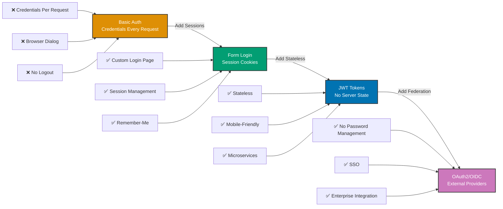

## Why Authentication Evolution Matters

Production applications need flexible authentication strategies for different clients: browsers prefer form login with sessions, mobile apps prefer stateless JWT tokens, and enterprise systems prefer OAuth2/OIDC federation. Manual authentication with hardcoded strategies limits deployment flexibility. In production systems serving millions of users across web, mobile, and API clients, Spring Security's multiple authentication mechanisms with pluggable providers enable gradual migration from Basic Auth → Form Login → JWT → OAuth2 without breaking existing clients—critical for zero-downtime authentication upgrades.

## Basic Authentication Baseline

Basic Auth sends username and password with every request (Base64 encoded):

```java
import jakarta.servlet.*;
import jakarta.servlet.http.*;
import java.io.IOException;
import java.util.Base64;
import java.util.Map;
import java.util.concurrent.ConcurrentHashMap;

// => Basic Auth filter: validates credentials on every request
public class BasicAuthFilter implements Filter {

    // => User store: username → password hash
    private final Map<String, String> users = new ConcurrentHashMap<>();

    @Override
    public void init(FilterConfig filterConfig) {
        // => Hardcoded users (insecure)
        // => Production: load from database
        users.put("admin", hashPassword("admin123"));
        users.put("viewer", hashPassword("view123"));
    }

    @Override
    public void doFilter(ServletRequest request, ServletResponse response, FilterChain chain)
            throws IOException, ServletException {

        HttpServletRequest httpRequest = (HttpServletRequest) request;
        HttpServletResponse httpResponse = (HttpServletResponse) response;

        // => Extract Authorization header
        String authHeader = httpRequest.getHeader("Authorization");

        if (authHeader != null && authHeader.startsWith("Basic ")) {
            // => Decode Base64: "Basic dXNlcjpwYXNz" → "user:pass"
            String base64Credentials = authHeader.substring("Basic ".length());
            byte[] decodedBytes = Base64.getDecoder().decode(base64Credentials);
            String credentials = new String(decodedBytes);

            // => Parse credentials: "username:password"
            String[] parts = credentials.split(":", 2);
            if (parts.length == 2) {
                String username = parts[0];
                String password = parts[1];

                // => Verify credentials
                String storedHash = users.get(username);
                if (storedHash != null && verifyPassword(password, storedHash)) {
                    // => Authentication success: set request attribute
                    httpRequest.setAttribute("authenticated_user", username);
                    // => Allow request to proceed
                    chain.doFilter(request, response);
                    return;
                }
            }
        }

        // => Authentication failed: 401 Unauthorized
        httpResponse.setStatus(HttpServletResponse.SC_UNAUTHORIZED);
        // => Tell client to use Basic Auth
        httpResponse.setHeader("WWW-Authenticate", "Basic realm=\"Zakat Management\"");
        httpResponse.getWriter().println("{\"error\": \"Authentication required\"}");
    }

    private String hashPassword(String password) {
        // => INSECURE: simple hash for demo
        // => Production: use BCrypt
        return Integer.toString(password.hashCode());
    }

    private boolean verifyPassword(String password, String storedHash) {
        return hashPassword(password).equals(storedHash);
    }
}
```

**Limitations:**

- **Credentials sent every request**: Username and password transmitted with each API call
- **No session management**: Server cannot track logged-in users
- **Weak password hashing**: Simple hashCode() is insecure (no salt, fast brute-force)
- **No logout**: Browsers cache credentials (cannot revoke)
- **No remember-me**: User must re-enter credentials after closing browser
- **Poor user experience**: Browser shows ugly HTTP auth dialog

## Form Login with Spring Security

Form-based authentication with HTML login page and session management:

```java
import org.springframework.context.annotation.*;
import org.springframework.security.config.annotation.web.builders.HttpSecurity;
import org.springframework.security.config.annotation.web.configuration.EnableWebSecurity;
import org.springframework.security.core.userdetails.*;
import org.springframework.security.crypto.bcrypt.BCryptPasswordEncoder;
import org.springframework.security.crypto.password.PasswordEncoder;
import org.springframework.security.provisioning.InMemoryUserDetailsManager;
import org.springframework.security.web.SecurityFilterChain;

@Configuration
@EnableWebSecurity
public class FormLoginSecurityConfig {

    @Bean
    public SecurityFilterChain securityFilterChain(HttpSecurity http) throws Exception {
        http
            .authorizeHttpRequests(authz -> authz
                // => Public URLs: login page, static resources
                .requestMatchers("/login", "/css/**", "/js/**").permitAll()
                // => All other URLs require authentication
                .anyRequest().authenticated()
            )

            // => Form login configuration
            .formLogin(form -> form
                .loginPage("/login")  // => Custom login page URL
                .loginProcessingUrl("/perform_login")  // => Where form submits
                .defaultSuccessUrl("/dashboard", true)  // => Redirect after successful login
                .failureUrl("/login?error=true")  // => Redirect after failed login
                .usernameParameter("username")  // => Form field name for username
                .passwordParameter("password")  // => Form field name for password
            )

            // => Logout configuration
            .logout(logout -> logout
                .logoutUrl("/perform_logout")  // => Logout endpoint
                .logoutSuccessUrl("/login?logout=true")  // => Redirect after logout
                .invalidateHttpSession(true)  // => Invalidate session
                .deleteCookies("JSESSIONID")  // => Delete session cookie
            )

            // => Remember-me authentication
            .rememberMe(rememberMe -> rememberMe
                .key("uniqueAndSecret")  // => Secret key for token generation
                .tokenValiditySeconds(86400)  // => 24 hours
                .rememberMeParameter("remember-me")  // => Form checkbox name
            )

            // => Session management
            .sessionManagement(session -> session
                .sessionFixation().newSession()  // => New session ID after login (prevent fixation)
                .maximumSessions(1)  // => One session per user
                .maxSessionsPreventsLogin(false)  // => New login invalidates old session
            );

        return http.build();
    }

    @Bean
    public UserDetailsService userDetailsService() {
        // => BCrypt-hashed passwords
        PasswordEncoder encoder = passwordEncoder();

        UserDetails admin = User.builder()
            .username("admin")
            .password(encoder.encode("admin123"))  // => BCrypt hash
            .roles("ADMIN")
            .build();

        UserDetails accountant = User.builder()
            .username("accountant")
            .password(encoder.encode("acct123"))
            .roles("ACCOUNTANT")
            .build();

        UserDetails viewer = User.builder()
            .username("viewer")
            .password(encoder.encode("view123"))
            .roles("VIEWER")
            .build();

        return new InMemoryUserDetailsManager(admin, accountant, viewer);
    }

    @Bean
    public PasswordEncoder passwordEncoder() {
        // => BCrypt: secure password hashing with salt
        // => Strength 10: 2^10 rounds (balance security/performance)
        return new BCryptPasswordEncoder(10);
    }
}

// => Login page controller
@Controller
public class LoginController {

    @GetMapping("/login")
    public String loginPage(@RequestParam(value = "error", required = false) String error,
                            @RequestParam(value = "logout", required = false) String logout,
                            Model model) {

        if (error != null) {
            // => Login failed: add error message
            model.addAttribute("error", "Invalid username or password");
        }

        if (logout != null) {
            // => Logout successful: add message
            model.addAttribute("message", "You have been logged out successfully");
        }

        return "login";  // => Thymeleaf template: login.html
    }
}
```

**Login HTML template** (Thymeleaf):

```html
<!DOCTYPE html>
<html xmlns:th="http://www.thymeleaf.org">
  <head>
    <title>Login - Zakat Management</title>
    <link rel="stylesheet" th:href="@{/css/login.css}" />
  </head>
  <body>
    <div class="login-container">
      <h2>Zakat Management Login</h2>

      <!-- Error message -->
      <div th:if="${error}" class="alert alert-danger">
        <span th:text="${error}"></span>
      </div>

      <!-- Logout message -->
      <div th:if="${message}" class="alert alert-success">
        <span th:text="${message}"></span>
      </div>

      <!-- Login form -->
      <!-- th:action: Thymeleaf generates URL with CSRF token -->
      <form th:action="@{/perform_login}" method="post">
        <div class="form-group">
          <label for="username">Username:</label>
          <input type="text" id="username" name="username" required autofocus />
        </div>

        <div class="form-group">
          <label for="password">Password:</label>
          <input type="password" id="password" name="password" required />
        </div>

        <div class="form-group">
          <!-- Remember-me checkbox -->
          <input type="checkbox" id="remember-me" name="remember-me" />
          <label for="remember-me">Remember me</label>
        </div>

        <button type="submit">Login</button>
      </form>
    </div>
  </body>
</html>
```

**Benefits over Basic Auth:**

- **Better UX**: Custom branded login page instead of browser dialog
- **Session management**: Server tracks logged-in users (no credentials per request)
- **Remember-me**: Persistent authentication across browser sessions
- **Logout support**: Users can explicitly log out
- **CSRF protection**: Form includes CSRF token automatically

## JWT (JSON Web Token) Authentication

Stateless token-based authentication for REST APIs and mobile apps:

```java
import org.springframework.security.config.annotation.web.builders.HttpSecurity;
import org.springframework.security.config.http.SessionCreationPolicy;
import org.springframework.security.web.authentication.UsernamePasswordAuthenticationFilter;
import io.jsonwebtoken.*;
import io.jsonwebtoken.security.Keys;
import javax.crypto.SecretKey;
import java.util.Date;

@Configuration
@EnableWebSecurity
public class JwtSecurityConfig {

    @Bean
    public SecurityFilterChain securityFilterChain(HttpSecurity http, JwtAuthenticationFilter jwtFilter) throws Exception {
        http
            .authorizeHttpRequests(authz -> authz
                // => Public endpoints: login (JWT generation)
                .requestMatchers("/api/auth/login").permitAll()
                // => All other endpoints require JWT token
                .anyRequest().authenticated()
            )

            // => Stateless session: no HttpSession
            // => Server doesn't store session state
            .sessionManagement(session -> session
                .sessionCreationPolicy(SessionCreationPolicy.STATELESS)
            )

            // => Disable CSRF: stateless (no cookies)
            .csrf(csrf -> csrf.disable())

            // => Add JWT filter before UsernamePasswordAuthenticationFilter
            // => JWT filter validates token and sets Authentication
            .addFilterBefore(jwtFilter, UsernamePasswordAuthenticationFilter.class);

        return http.build();
    }
}

// => JWT utility class: generate and validate tokens
@Component
public class JwtTokenProvider {

    // => Secret key for HMAC signing
    // => Production: load from environment variable, rotate regularly
    @Value("${jwt.secret}")
    private String jwtSecret;

    // => Token expiration: 24 hours
    @Value("${jwt.expiration:86400000}")
    private long jwtExpiration;

    private SecretKey key;

    @PostConstruct
    public void init() {
        // => Generate HMAC key from secret
        this.key = Keys.hmacShaKeyFor(jwtSecret.getBytes());
    }

    // => Generate JWT token for authenticated user
    public String generateToken(Authentication authentication) {
        UserDetails userDetails = (UserDetails) authentication.getPrincipal();

        Date now = new Date();
        Date expiryDate = new Date(now.getTime() + jwtExpiration);

        // => Build JWT: header + payload + signature
        return Jwts.builder()
            .setSubject(userDetails.getUsername())  // => Subject: username
            .setIssuedAt(now)  // => Token issued time
            .setExpiration(expiryDate)  // => Token expiration
            .claim("roles", userDetails.getAuthorities().stream()
                .map(GrantedAuthority::getAuthority)
                .collect(Collectors.toList()))  // => Custom claim: user roles
            .signWith(key, SignatureAlgorithm.HS512)  // => HMAC SHA-512 signature
            .compact();
    }

    // => Extract username from JWT token
    public String getUsernameFromToken(String token) {
        Claims claims = Jwts.parserBuilder()
            .setSigningKey(key)  // => Verify signature with secret key
            .build()
            .parseClaimsJws(token)  // => Parse and validate token
            .getBody();

        return claims.getSubject();  // => Extract username from subject
    }

    // => Validate JWT token
    public boolean validateToken(String token) {
        try {
            // => Parse token: validates signature and expiration
            Jwts.parserBuilder()
                .setSigningKey(key)
                .build()
                .parseClaimsJws(token);
            return true;

        } catch (ExpiredJwtException e) {
            // => Token expired
            return false;
        } catch (UnsupportedJwtException e) {
            // => Invalid token format
            return false;
        } catch (MalformedJwtException e) {
            // => Token structure invalid
            return false;
        } catch (SignatureException e) {
            // => Signature verification failed (tampered token)
            return false;
        } catch (IllegalArgumentException e) {
            // => Token is null or empty
            return false;
        }
    }
}

// => JWT authentication filter: validates token on every request
@Component
public class JwtAuthenticationFilter extends OncePerRequestFilter {

    private final JwtTokenProvider tokenProvider;
    private final UserDetailsService userDetailsService;

    public JwtAuthenticationFilter(JwtTokenProvider tokenProvider, UserDetailsService userDetailsService) {
        this.tokenProvider = tokenProvider;
        this.userDetailsService = userDetailsService;
    }

    @Override
    protected void doFilterInternal(HttpServletRequest request, HttpServletResponse response, FilterChain filterChain)
            throws ServletException, IOException {

        // => Extract JWT token from Authorization header
        String token = extractTokenFromRequest(request);

        if (token != null && tokenProvider.validateToken(token)) {
            // => Token valid: load user details
            String username = tokenProvider.getUsernameFromToken(token);
            UserDetails userDetails = userDetailsService.loadUserByUsername(username);

            // => Create Authentication object
            UsernamePasswordAuthenticationToken authentication =
                new UsernamePasswordAuthenticationToken(
                    userDetails,
                    null,  // => No credentials (stateless)
                    userDetails.getAuthorities()  // => User roles
                );

            // => Set Authentication in SecurityContext
            // => Spring Security: authorizes request based on this
            SecurityContextHolder.getContext().setAuthentication(authentication);
        }

        // => Continue filter chain
        filterChain.doFilter(request, response);
    }

    private String extractTokenFromRequest(HttpServletRequest request) {
        // => Get Authorization header: "Bearer <token>"
        String bearerToken = request.getHeader("Authorization");

        if (bearerToken != null && bearerToken.startsWith("Bearer ")) {
            // => Extract token: remove "Bearer " prefix
            return bearerToken.substring(7);
        }

        return null;
    }
}

// => Login endpoint: generates JWT token
@RestController
@RequestMapping("/api/auth")
public class AuthenticationController {

    private final AuthenticationManager authenticationManager;
    private final JwtTokenProvider tokenProvider;

    @PostMapping("/login")
    public ResponseEntity<JwtAuthenticationResponse> login(@Valid @RequestBody LoginRequest request) {
        // => Authenticate user with username and password
        Authentication authentication = authenticationManager.authenticate(
            new UsernamePasswordAuthenticationToken(
                request.getUsername(),
                request.getPassword()
            )
        );

        // => Authentication success: generate JWT token
        String token = tokenProvider.generateToken(authentication);

        // => Return token to client
        return ResponseEntity.ok(new JwtAuthenticationResponse(token));
    }
}

// => Request/response DTOs
public class LoginRequest {
    @NotBlank
    private String username;

    @NotBlank
    private String password;

    // => Getters and setters
}

public class JwtAuthenticationResponse {
    private String accessToken;
    private String tokenType = "Bearer";

    public JwtAuthenticationResponse(String accessToken) {
        this.accessToken = accessToken;
    }

    // => Getters and setters
}
```

**Benefits over Form Login:**

- **Stateless**: No server-side session storage (scales horizontally)
- **Mobile-friendly**: Works for mobile apps (no cookies)
- **Microservices**: Token can be validated by multiple services
- **Cross-origin**: Works with CORS (no cookie restrictions)
- **Expiration**: Built-in token expiration (configurable)

## OAuth2 and OpenID Connect (OIDC)

Federated authentication with external identity providers (Google, Azure AD, Keycloak):

```java
import org.springframework.security.config.annotation.web.builders.HttpSecurity;
import org.springframework.security.oauth2.client.registration.ClientRegistration;
import org.springframework.security.oauth2.client.registration.ClientRegistrationRepository;
import org.springframework.security.oauth2.client.registration.InMemoryClientRegistrationRepository;
import org.springframework.security.oauth2.core.AuthorizationGrantType;

@Configuration
@EnableWebSecurity
public class OAuth2SecurityConfig {

    @Bean
    public SecurityFilterChain securityFilterChain(HttpSecurity http) throws Exception {
        http
            .authorizeHttpRequests(authz -> authz
                .requestMatchers("/", "/login/**", "/oauth2/**").permitAll()
                .anyRequest().authenticated()
            )

            // => OAuth2 login configuration
            .oauth2Login(oauth2 -> oauth2
                .loginPage("/login")  // => Custom login page
                .defaultSuccessUrl("/dashboard")  // => Redirect after OAuth2 login
                .failureUrl("/login?error=true")
                // => Custom user service: map OAuth2 user to application user
                .userInfoEndpoint(userInfo -> userInfo
                    .userService(customOAuth2UserService())
                )
            )

            .logout(logout -> logout
                .logoutSuccessUrl("/")
                .invalidateHttpSession(true)
            );

        return http.build();
    }

    // => OAuth2 client registration: Google, Azure AD, etc.
    @Bean
    public ClientRegistrationRepository clientRegistrationRepository() {
        // => Google OAuth2 client
        ClientRegistration google = ClientRegistration.withRegistrationId("google")
            .clientId("${oauth2.google.client-id}")  // => From Google Console
            .clientSecret("${oauth2.google.client-secret}")
            .scope("openid", "profile", "email")  // => OIDC scopes
            .authorizationUri("https://accounts.google.com/o/oauth2/v2/auth")
            .tokenUri("https://oauth2.googleapis.com/token")
            .userInfoUri("https://openidconnect.googleapis.com/v1/userinfo")
            .userNameAttributeName("sub")  // => Unique user ID from Google
            .redirectUri("{baseUrl}/login/oauth2/code/{registrationId}")
            .authorizationGrantType(AuthorizationGrantType.AUTHORIZATION_CODE)
            .clientName("Google")
            .build();

        // => Azure AD OAuth2 client
        ClientRegistration azureAd = ClientRegistration.withRegistrationId("azure")
            .clientId("${oauth2.azure.client-id}")
            .clientSecret("${oauth2.azure.client-secret}")
            .scope("openid", "profile", "email")
            .authorizationUri("https://login.microsoftonline.com/${tenant-id}/oauth2/v2.0/authorize")
            .tokenUri("https://login.microsoftonline.com/${tenant-id}/oauth2/v2.0/token")
            .userInfoUri("https://graph.microsoft.com/oidc/userinfo")
            .userNameAttributeName("sub")
            .redirectUri("{baseUrl}/login/oauth2/code/{registrationId}")
            .authorizationGrantType(AuthorizationGrantType.AUTHORIZATION_CODE)
            .clientName("Azure AD")
            .build();

        return new InMemoryClientRegistrationRepository(google, azureAd);
    }

    // => Custom OAuth2 user service: map external user to application user
    @Bean
    public OAuth2UserService<OAuth2UserRequest, OAuth2User> customOAuth2UserService() {
        return new CustomOAuth2UserService();
    }
}

// => Custom OAuth2 user service implementation
@Service
public class CustomOAuth2UserService implements OAuth2UserService<OAuth2UserRequest, OAuth2User> {

    private final UserRepository userRepository;
    private final DefaultOAuth2UserService delegate = new DefaultOAuth2UserService();

    public CustomOAuth2UserService(UserRepository userRepository) {
        this.userRepository = userRepository;
    }

    @Override
    public OAuth2User loadUser(OAuth2UserRequest userRequest) throws OAuth2AuthenticationException {
        // => Load user from OAuth2 provider (Google, Azure AD)
        OAuth2User oauth2User = delegate.loadUser(userRequest);

        // => Extract user details from OAuth2 response
        String registrationId = userRequest.getClientRegistration().getRegistrationId();
        String email = oauth2User.getAttribute("email");
        String name = oauth2User.getAttribute("name");

        // => Find or create user in database
        UserEntity user = userRepository.findByEmail(email)
            .orElseGet(() -> {
                // => User doesn't exist: create new user
                UserEntity newUser = new UserEntity();
                newUser.setEmail(email);
                newUser.setName(name);
                newUser.setProvider(registrationId);  // => "google" or "azure"
                newUser.setProviderId(oauth2User.getAttribute("sub"));  // => External user ID
                newUser.setRoles(List.of(new RoleEntity("VIEWER")));  // => Default role
                return userRepository.save(newUser);
            });

        // => Return custom OAuth2User with application roles
        return new CustomOAuth2User(oauth2User, user.getRoles());
    }
}
```

**application.yml configuration**:

```yaml
spring:
  security:
    oauth2:
      client:
        registration:
          google:
            client-id: ${GOOGLE_CLIENT_ID}
            client-secret: ${GOOGLE_CLIENT_SECRET}
            scope: openid,profile,email
          azure:
            client-id: ${AZURE_CLIENT_ID}
            client-secret: ${AZURE_CLIENT_SECRET}
            scope: openid,profile,email
            tenant-id: ${AZURE_TENANT_ID}
```

**Benefits over JWT:**

- **No password management**: Users authenticate with external provider
- **SSO (Single Sign-On)**: One login for multiple applications
- **Enterprise integration**: Azure AD, Okta, Keycloak
- **Social login**: Google, Facebook, GitHub
- **Security delegation**: Identity provider handles authentication security

## Authentication Evolution Diagram



## Production Patterns

### Multi-Authentication Strategy

Support multiple authentication methods simultaneously:

```java
@Configuration
@EnableWebSecurity
public class MultiAuthConfig {

    @Bean
    public SecurityFilterChain securityFilterChain(HttpSecurity http, JwtAuthenticationFilter jwtFilter) throws Exception {
        http
            .authorizeHttpRequests(authz -> authz
                .requestMatchers("/api/**").permitAll()  // => API endpoints: JWT or Basic Auth
                .requestMatchers("/admin/**").hasRole("ADMIN")
                .anyRequest().authenticated()
            )

            // => Form login for browser clients
            .formLogin(form -> form
                .loginPage("/login")
                .defaultSuccessUrl("/dashboard")
            )

            // => Basic Auth for simple API clients
            .httpBasic()

            // => OAuth2 for social login
            .oauth2Login(oauth2 -> oauth2
                .loginPage("/login")
            )

            // => JWT for mobile apps and microservices
            .addFilterBefore(jwtFilter, UsernamePasswordAuthenticationFilter.class)

            // => Session for form login, stateless for API
            .sessionManagement(session -> session
                .sessionCreationPolicy(SessionCreationPolicy.IF_REQUIRED)
            );

        return http.build();
    }
}
```

### Refresh Token Pattern

Long-lived refresh tokens for JWT authentication:

```java
@Service
public class TokenService {

    // => Generate access and refresh tokens
    public TokenPair generateTokens(Authentication authentication) {
        // => Short-lived access token: 15 minutes
        String accessToken = generateAccessToken(authentication, 900000);

        // => Long-lived refresh token: 30 days
        String refreshToken = generateRefreshToken(authentication, 2592000000L);

        // => Store refresh token in database
        RefreshToken token = new RefreshToken();
        token.setToken(refreshToken);
        token.setUsername(authentication.getName());
        token.setExpiryDate(LocalDateTime.now().plusDays(30));
        refreshTokenRepository.save(token);

        return new TokenPair(accessToken, refreshToken);
    }

    // => Refresh access token using refresh token
    public String refreshAccessToken(String refreshToken) {
        // => Validate refresh token
        RefreshToken token = refreshTokenRepository.findByToken(refreshToken)
            .orElseThrow(() -> new InvalidTokenException("Invalid refresh token"));

        if (token.getExpiryDate().isBefore(LocalDateTime.now())) {
            // => Refresh token expired: delete and throw
            refreshTokenRepository.delete(token);
            throw new ExpiredTokenException("Refresh token expired");
        }

        // => Generate new access token
        UserDetails userDetails = userDetailsService.loadUserByUsername(token.getUsername());
        Authentication authentication = new UsernamePasswordAuthenticationToken(
            userDetails, null, userDetails.getAuthorities()
        );

        return generateAccessToken(authentication, 900000);
    }
}
```

### Logout with JWT Blacklist

Implement logout for stateless JWT tokens:

```java
@Service
public class JwtBlacklistService {

    // => Redis cache: store blacklisted tokens
    // => Key: token ID, Value: expiration time
    private final RedisTemplate<String, String> redisTemplate;

    // => Blacklist token on logout
    public void blacklistToken(String token) {
        // => Extract token ID (jti claim)
        Claims claims = Jwts.parserBuilder()
            .setSigningKey(key)
            .build()
            .parseClaimsJws(token)
            .getBody();

        String tokenId = claims.getId();
        Date expiration = claims.getExpiration();

        // => Store in Redis with TTL = token expiration
        long ttl = expiration.getTime() - System.currentTimeMillis();
        redisTemplate.opsForValue().set(
            "blacklist:" + tokenId,
            "true",
            ttl,
            TimeUnit.MILLISECONDS
        );
    }

    // => Check if token is blacklisted
    public boolean isBlacklisted(String token) {
        Claims claims = Jwts.parserBuilder()
            .setSigningKey(key)
            .build()
            .parseClaimsJws(token)
            .getBody();

        String tokenId = claims.getId();

        // => Check Redis cache
        return Boolean.TRUE.equals(redisTemplate.hasKey("blacklist:" + tokenId));
    }
}
```

## Trade-offs and When to Use

| Approach    | Client Type           | Scalability | User Experience | Complexity | Security  |
| ----------- | --------------------- | ----------- | --------------- | ---------- | --------- |
| Basic Auth  | Simple API clients    | High        | Poor            | Low        | Medium    |
| Form Login  | Browser (traditional) | Medium      | Good            | Medium     | High      |
| JWT         | Mobile apps, SPAs     | Very High   | Good            | Medium     | High      |
| OAuth2/OIDC | Enterprise, SSO       | High        | Excellent       | High       | Very High |

**When to Use Basic Auth:**

- Internal tools and scripts
- Simple API clients (curl, Postman)
- Development and testing
- Legacy system integration

**When to Use Form Login:**

- Traditional web applications
- Server-side rendered pages (Thymeleaf, JSP)
- Browser-only clients
- Applications requiring session management

**When to Use JWT:**

- **REST APIs** (stateless, scalable)
- **Mobile applications** (no cookies)
- **Single Page Applications** (React, Vue, Angular)
- **Microservices** (token-based authorization)
- **Horizontal scaling** (no session affinity)

**When to Use OAuth2/OIDC:**

- **Enterprise applications** (Azure AD, Okta)
- **Social login** (Google, Facebook, GitHub)
- **Single Sign-On (SSO)** across multiple apps
- **B2C applications** (consumer-facing)
- **No password management** requirement

## Best Practices

**1. Use BCrypt with Appropriate Strength**

```java
@Bean
public PasswordEncoder passwordEncoder() {
    // Strength 12 for sensitive systems
    return new BCryptPasswordEncoder(12);
}
```

**2. Implement Token Rotation for Refresh Tokens**

```java
public TokenPair refreshTokens(String refreshToken) {
    // Validate old refresh token
    validateRefreshToken(refreshToken);

    // Generate new access AND refresh tokens
    TokenPair newTokens = generateTokens(authentication);

    // Revoke old refresh token
    revokeRefreshToken(refreshToken);

    return newTokens;
}
```

**3. Store Secrets in Environment Variables**

```yaml
# application.yml
jwt:
  secret: ${JWT_SECRET} # From environment
  expiration: 900000 # 15 minutes

oauth2:
  google:
    client-id: ${GOOGLE_CLIENT_ID}
    client-secret: ${GOOGLE_CLIENT_SECRET}
```

**4. Implement Account Lockout for Failed Attempts**

```java
@EventListener
public void onAuthenticationFailure(AuthenticationFailureBadCredentialsEvent event) {
    String username = event.getAuthentication().getName();

    int attempts = loginAttemptService.incrementFailedAttempts(username);

    if (attempts >= 5) {
        userService.lockAccount(username);
        logger.warn("Account locked due to 5 failed login attempts: {}", username);
    }
}
```

**5. Log Authentication Events**

```java
@EventListener
public void onAuthenticationSuccess(AuthenticationSuccessEvent event) {
    String username = event.getAuthentication().getName();
    String ip = ((WebAuthenticationDetails) event.getAuthentication().getDetails()).getRemoteAddress();

    logger.info("Login successful: username={}, ip={}", username, ip);
}
```

## See Also

- [Spring Security Basics](/en/learn/software-engineering/platform-web/tools/jvm-spring/in-the-field/spring-security-basics) - Security filter chain and UserDetailsService
- [Authorization](/en/learn/software-engineering/platform-web/tools/jvm-spring/in-the-field/authorization) - Role-based and method-level authorization
- [Configuration](/en/learn/software-engineering/platform-web/tools/jvm-spring/in-the-field/configuration) - Externalized security configuration
- [Spring Data JPA](/en/learn/software-engineering/platform-web/tools/jvm-spring/in-the-field/spring-data-jpa) - User entity persistence
- [REST APIs](/en/learn/software-engineering/platform-web/tools/jvm-spring/in-the-field/rest-apis) - Securing REST endpoints
