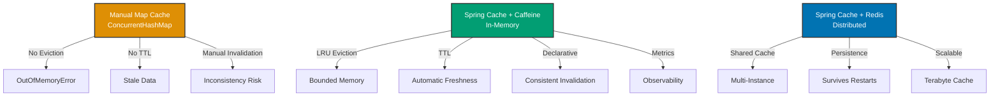

## Why Caching Matters

Database queries are expensive—even with connection pooling and indexes, queries take milliseconds. Caching stores frequently accessed data in memory, reducing latency from 10-50ms (database) to <1ms (cache). In production systems serving thousands of requests per second, caching reduces database load by 80-95% and improves response times by 10-50x.

## Manual Map Caching Baseline

Manual caching with ConcurrentHashMap:

```java
import java.util.concurrent.ConcurrentHashMap;
import java.util.Map;

// => Repository: manual caching with ConcurrentHashMap
@Repository
public class ZakatAccountRepository {

    private final JdbcTemplate jdbcTemplate;

    // => Manual cache: ConcurrentHashMap for thread-safe caching
    // => Key: account ID, Value: cached account
    private final Map<Long, ZakatAccount> cache = new ConcurrentHashMap<>();

    public ZakatAccountRepository(JdbcTemplate jdbcTemplate) {
        this.jdbcTemplate = jdbcTemplate;
    }

    // => Find account with manual caching
    public ZakatAccount findById(Long id) {
        // => Check cache first: O(1) lookup
        // => cache.get(): returns cached value or null
        ZakatAccount cached = cache.get(id);
        if (cached != null) {
            // => Cache hit: return immediately, no database query
            // => <1ms response time
            return cached;
        }

        // => Cache miss: query database
        // => 10-50ms response time
        ZakatAccount account = jdbcTemplate.queryForObject(
            "SELECT id, account_number, balance FROM zakat_accounts WHERE id = ?",
            (rs, rowNum) -> new ZakatAccount(
                rs.getLong("id"),
                rs.getString("account_number"),
                rs.getBigDecimal("balance")
            ),
            id
        );

        // => Store in cache: subsequent requests served from memory
        // => cache.put(): stores key-value pair
        cache.put(id, account);

        return account;
    }

    // => Update account: manual cache invalidation
    public void update(ZakatAccount account) {
        // => Update database
        jdbcTemplate.update(
            "UPDATE zakat_accounts SET balance = ? WHERE id = ?",
            account.getBalance(),
            account.getId()
        );

        // => Manual cache invalidation: remove stale entry
        // => cache.remove(): evicts key from cache
        // => Next read will fetch fresh data from database
        cache.remove(account.getId());
    }

    // => Delete account: manual cache invalidation
    public void delete(Long id) {
        // => Delete from database
        jdbcTemplate.update("DELETE FROM zakat_accounts WHERE id = ?", id);

        // => Manual cache invalidation
        cache.remove(id);
    }

    // => Clear all cache: manual eviction
    public void clearCache() {
        // => Remove all entries: cache.clear()
        cache.clear();
    }
}
```

**Limitations:**

- **No eviction**: Cache grows unbounded, causes OutOfMemoryError
- **No TTL**: Stale data persists forever unless manually invalidated
- **Manual invalidation**: Easy to forget, causes data inconsistency
- **No hit/miss metrics**: Can't measure cache effectiveness
- **Single JVM**: Can't share cache across multiple application instances
- **Synchronization overhead**: Manual thread-safety adds complexity

## Spring Cache Abstraction with Caffeine

Spring Cache abstraction with Caffeine provides production-grade in-memory caching:

```java
import org.springframework.cache.annotation.*;
import org.springframework.cache.CacheManager;
import com.github.benmanes.caffeine.cache.Caffeine;
import org.springframework.cache.caffeine.CaffeineCacheManager;

// => Configuration: Caffeine cache manager
@Configuration
@EnableCaching  // => Activates Spring Cache annotations
public class CacheConfig {

    @Bean  // => CacheManager: manages multiple named caches
    public CacheManager cacheManager() {
        // => CaffeineCacheManager: in-memory cache with Caffeine
        CaffeineCacheManager cacheManager = new CaffeineCacheManager();

        // => Configure Caffeine: cache behavior
        cacheManager.setCaffeine(Caffeine.newBuilder()
            // => Maximum size: max entries per cache
            .maximumSize(1000)  // => Max 1000 entries
            // => Automatic eviction: removes least recently used (LRU)
            // => Prevents OutOfMemoryError

            // => Time-based expiration: TTL (time to live)
            .expireAfterWrite(Duration.ofMinutes(10))  // => Evict after 10min
            // => Automatic invalidation: no manual cache clearing needed
            // => Ensures data freshness

            // => Metrics: track cache hit/miss rates
            .recordStats()  // => Enables cache statistics
            // => Exposes hit rate, eviction count, load time
        );

        // => Register cache names: explicit cache definitions
        cacheManager.setCacheNames(Arrays.asList("accounts", "nisabRates", "reports"));
        // => "accounts": account data cache
        // => "nisabRates": zakat threshold rates cache
        // => "reports": report data cache

        return cacheManager;
    }
}

// => Repository: Spring Cache annotations
@Repository
public class ZakatAccountRepository {

    private final JdbcTemplate jdbcTemplate;

    // => @Cacheable: cache method result
    @Cacheable(value = "accounts", key = "#id")
    // => value: cache name ("accounts")
    // => key: cache key expression (SpEL: #id = method parameter id)
    // => Behavior: if key exists in cache, return cached value; else execute method and cache result
    public ZakatAccount findById(Long id) {
        // => Method body executed only on cache miss
        // => Cache hit: method not executed, cached value returned immediately

        System.out.println("Querying database for account: " + id);  // => Debug: shows cache misses

        // => Database query: 10-50ms
        return jdbcTemplate.queryForObject(
            "SELECT id, account_number, balance FROM zakat_accounts WHERE id = ?",
            (rs, rowNum) -> new ZakatAccount(
                rs.getLong("id"),
                rs.getString("account_number"),
                rs.getBigDecimal("balance")
            ),
            id
        );
        // => Result automatically cached with key = id
        // => Subsequent calls with same id return cached value (<1ms)
    }

    // => @CachePut: always execute method and update cache
    @CachePut(value = "accounts", key = "#account.id")
    // => Always executes method (no cache check)
    // => Updates cache with return value
    // => Use for update operations: ensures cache has latest data
    public ZakatAccount update(ZakatAccount account) {
        // => Update database
        jdbcTemplate.update(
            "UPDATE zakat_accounts SET balance = ? WHERE id = ?",
            account.getBalance(),
            account.getId()
        );

        // => Return updated account: automatically cached
        // => Cache entry for account.id updated with fresh data
        return account;
    }

    // => @CacheEvict: remove entry from cache
    @CacheEvict(value = "accounts", key = "#id")
    // => Removes cache entry with key = id
    // => Next findById(id) will query database
    public void delete(Long id) {
        // => Delete from database
        jdbcTemplate.update("DELETE FROM zakat_accounts WHERE id = ?", id);

        // => Cache entry automatically evicted after method execution
    }

    // => @CacheEvict with allEntries: clear entire cache
    @CacheEvict(value = "accounts", allEntries = true)
    // => allEntries = true: removes all entries from "accounts" cache
    // => Use for bulk operations affecting many entries
    public void deleteAll() {
        jdbcTemplate.update("DELETE FROM zakat_accounts");
        // => All cache entries evicted after method execution
    }

    // => @Caching: multiple cache operations
    @Caching(
        cacheable = @Cacheable(value = "accounts", key = "#accountNumber"),
        // => Cache by accountNumber (primary lookup)
        put = @CachePut(value = "accounts", key = "#result.id")
        // => Also cache by id (secondary lookup)
        // => Single database query populates both cache entries
    )
    public ZakatAccount findByAccountNumber(String accountNumber) {
        // => Query database
        return jdbcTemplate.queryForObject(
            "SELECT id, account_number, balance FROM zakat_accounts WHERE account_number = ?",
            (rs, rowNum) -> new ZakatAccount(
                rs.getLong("id"),
                rs.getString("account_number"),
                rs.getBigDecimal("balance")
            ),
            accountNumber
        );
        // => Result cached twice: by accountNumber and by id
        // => findById() and findByAccountNumber() can both hit cache
    }

    // => Conditional caching: cache only when condition met
    @Cacheable(value = "accounts", key = "#id", condition = "#id > 0")
    // => condition: SpEL expression, cache only if true
    // => Caches only for positive IDs (skip negative/zero)
    public ZakatAccount findByIdConditional(Long id) {
        return jdbcTemplate.queryForObject(
            "SELECT id, account_number, balance FROM zakat_accounts WHERE id = ?",
            (rs, rowNum) -> new ZakatAccount(
                rs.getLong("id"),
                rs.getString("account_number"),
                rs.getBigDecimal("balance")
            ),
            id
        );
    }

    // => Unless: cache unless condition met
    @Cacheable(value = "accounts", key = "#id", unless = "#result.balance.compareTo(T(java.math.BigDecimal).ZERO) <= 0")
    // => unless: SpEL expression, skip caching if true
    // => Don't cache accounts with zero/negative balance
    public ZakatAccount findByIdUnless(Long id) {
        return jdbcTemplate.queryForObject(
            "SELECT id, account_number, balance FROM zakat_accounts WHERE id = ?",
            (rs, rowNum) -> new ZakatAccount(
                rs.getLong("id"),
                rs.getString("account_number"),
                rs.getBigDecimal("balance")
            ),
            id
        );
    }
}

// => Service: cache management API
@Service
public class ZakatAccountService {

    private final ZakatAccountRepository accountRepository;
    private final CacheManager cacheManager;

    // => Programmatic cache access
    public void warmCache() {
        // => Load frequently accessed data into cache
        List<Long> popularAccountIds = Arrays.asList(1L, 2L, 3L, 4L, 5L);

        popularAccountIds.forEach(id -> {
            // => findById(): populates cache via @Cacheable
            accountRepository.findById(id);
        });
    }

    // => Programmatic cache eviction
    public void evictAccount(Long accountId) {
        // => Get cache by name
        Cache cache = cacheManager.getCache("accounts");
        if (cache != null) {
            // => Evict specific key
            cache.evict(accountId);
        }
    }

    // => Programmatic cache clearing
    public void clearAllCaches() {
        // => Get all cache names
        cacheManager.getCacheNames().forEach(cacheName -> {
            Cache cache = cacheManager.getCache(cacheName);
            if (cache != null) {
                // => Clear entire cache
                cache.clear();
            }
        });
    }
}
```

**Benefits:**

- **Declarative**: `@Cacheable` instead of manual cache.get/put
- **Automatic eviction**: LRU with maximumSize prevents OutOfMemoryError
- **TTL**: expireAfterWrite automatically invalidates stale data
- **Metrics**: recordStats() exposes hit/miss rates for monitoring
- **Consistent API**: Same annotations work with different cache providers

## Distributed Caching with Redis

Redis provides shared cache across multiple application instances:

```java
import org.springframework.data.redis.cache.RedisCacheConfiguration;
import org.springframework.data.redis.cache.RedisCacheManager;
import org.springframework.data.redis.connection.RedisConnectionFactory;
import org.springframework.data.redis.serializer.*;

// => Configuration: Redis cache manager
@Configuration
@EnableCaching
public class RedisCacheConfig {

    @Bean  // => RedisCacheManager: distributed cache with Redis
    public CacheManager cacheManager(RedisConnectionFactory connectionFactory) {
        // => Redis serialization: how objects stored in Redis
        RedisCacheConfiguration cacheConfig = RedisCacheConfiguration.defaultCacheConfig()
            // => TTL: time to live for cache entries
            .entryTtl(Duration.ofMinutes(10))  // => 10-minute expiration
            // => Automatic invalidation: entries removed after TTL

            // => Key serialization: String keys
            .serializeKeysWith(
                RedisSerializationContext.SerializationPair.fromSerializer(
                    new StringRedisSerializer()  // => Keys stored as strings
                )
            )

            // => Value serialization: JSON for human-readable storage
            .serializeValuesWith(
                RedisSerializationContext.SerializationPair.fromSerializer(
                    new GenericJackson2JsonRedisSerializer()  // => Values stored as JSON
                )
            )

            // => Disable null values: prevents caching null results
            .disableCachingNullValues();

        // => Create RedisCacheManager
        return RedisCacheManager.builder(connectionFactory)
            .cacheDefaults(cacheConfig)  // => Default configuration for all caches
            .build();
    }
}

// => Repository: same annotations, distributed caching
@Repository
public class ZakatAccountRepository {

    private final JdbcTemplate jdbcTemplate;

    // => @Cacheable: now stores in Redis (shared across instances)
    @Cacheable(value = "accounts", key = "#id")
    public ZakatAccount findById(Long id) {
        // => Cache miss: queries database and stores in Redis
        // => Cache hit: retrieves from Redis (shared across all app instances)

        return jdbcTemplate.queryForObject(
            "SELECT id, account_number, balance FROM zakat_accounts WHERE id = ?",
            (rs, rowNum) -> new ZakatAccount(
                rs.getLong("id"),
                rs.getString("account_number"),
                rs.getBigDecimal("balance")
            ),
            id
        );
        // => Result stored in Redis: available to all app instances
    }

    // => @CachePut: updates Redis cache
    @CachePut(value = "accounts", key = "#account.id")
    public ZakatAccount update(ZakatAccount account) {
        jdbcTemplate.update(
            "UPDATE zakat_accounts SET balance = ? WHERE id = ?",
            account.getBalance(),
            account.getId()
        );
        // => Redis cache updated across all instances
        return account;
    }

    // => @CacheEvict: evicts from Redis
    @CacheEvict(value = "accounts", key = "#id")
    public void delete(Long id) {
        jdbcTemplate.update("DELETE FROM zakat_accounts WHERE id = ?", id);
        // => Redis cache entry removed across all instances
    }
}
```

**Benefits:**

- **Distributed**: Cache shared across multiple application instances
- **Persistence**: Redis persists cache to disk (survives restarts)
- **Scalability**: Redis cluster supports terabytes of cache
- **Pub/Sub**: Redis notifies other instances of cache changes
- **Flexible TTL**: Per-cache or per-entry expiration

## Progression Diagram



## Production Patterns

### Cache Warming

```java
@Service
public class CacheWarmingService {

    private final ZakatAccountRepository accountRepository;

    // => Warm cache on application startup
    @EventListener(ApplicationReadyEvent.class)
    // => Executes after Spring Boot fully started
    public void warmCaches() {
        // => Preload frequently accessed data
        List<Long> popularAccounts = getPopularAccountIds();

        popularAccounts.forEach(accountRepository::findById);
        // => Populates cache before first user request
        // => Eliminates cold-start latency
    }

    private List<Long> getPopularAccountIds() {
        // => Fetch most accessed accounts from analytics
        return Arrays.asList(1L, 2L, 3L, 4L, 5L);
    }
}
```

### Multi-Level Caching

```java
// => L1 cache: Caffeine (in-memory, fast, per-instance)
// => L2 cache: Redis (distributed, slower, shared)

@Configuration
@EnableCaching
public class MultiLevelCacheConfig {

    @Bean
    @Primary
    public CacheManager cacheManager(
            CacheManager caffeineCacheManager,
            CacheManager redisCacheManager) {

        // => CompositeCacheManager: multi-level caching
        return new CompositeCacheManager(
            caffeineCacheManager,  // => L1: check Caffeine first (fast)
            redisCacheManager  // => L2: fallback to Redis if L1 miss
        );
    }

    @Bean
    public CacheManager caffeineCacheManager() {
        CaffeineCacheManager cacheManager = new CaffeineCacheManager();
        cacheManager.setCaffeine(Caffeine.newBuilder()
            .maximumSize(1000)  // => Small L1 cache
            .expireAfterWrite(Duration.ofMinutes(5))  // => Short TTL
        );
        return cacheManager;
    }

    @Bean
    public CacheManager redisCacheManager(RedisConnectionFactory factory) {
        RedisCacheConfiguration config = RedisCacheConfiguration.defaultCacheConfig()
            .entryTtl(Duration.ofMinutes(30));  // => Longer TTL for L2
        return RedisCacheManager.builder(factory)
            .cacheDefaults(config)
            .build();
    }
}
```

### Cache Monitoring

```java
@Component
public class CacheMetrics {

    private final CacheManager cacheManager;

    @Scheduled(fixedRate = 60000)  // => Every 60 seconds
    public void logCacheStats() {
        cacheManager.getCacheNames().forEach(cacheName -> {
            Cache cache = cacheManager.getCache(cacheName);

            if (cache instanceof CaffeineCache) {
                // => Caffeine cache: extract statistics
                CaffeineCache caffeineCache = (CaffeineCache) cache;
                com.github.benmanes.caffeine.cache.Cache<Object, Object> nativeCache =
                    caffeineCache.getNativeCache();

                CacheStats stats = nativeCache.stats();

                // => Log cache metrics
                long hitCount = stats.hitCount();
                long missCount = stats.missCount();
                double hitRate = stats.hitRate();

                System.out.printf(
                    "Cache [%s]: hits=%d, misses=%d, hitRate=%.2f%%%n",
                    cacheName, hitCount, missCount, hitRate * 100
                );
            }
        });
    }
}
```

### Conditional Caching by Load

```java
@Service
public class ZakatReportService {

    private final AtomicInteger requestCount = new AtomicInteger(0);

    // => Cache only under high load
    @Cacheable(value = "reports", key = "#month", condition = "@zakatReportService.isHighLoad()")
    // => condition: calls isHighLoad() method
    // => Caches only when load is high
    public ZakatReport generateMonthlyReport(String month) {
        // => Expensive report generation
        return generateReport(month);
    }

    // => Check if system under high load
    public boolean isHighLoad() {
        // => Increment request counter
        int current = requestCount.incrementAndGet();

        // => High load: >100 requests per minute
        return current > 100;
    }

    @Scheduled(fixedRate = 60000)  // => Reset every minute
    public void resetCounter() {
        requestCount.set(0);
    }
}
```

## Trade-offs and When to Use

| Approach          | Eviction  | TTL       | Invalidation | Metrics  | Distribution | Complexity |
| ----------------- | --------- | --------- | ------------ | -------- | ------------ | ---------- |
| Manual Map        | Manual    | Manual    | Manual       | None     | No           | Low        |
| Spring + Caffeine | Automatic | Automatic | Declarative  | Built-in | No           | Low        |
| Spring + Redis    | Automatic | Automatic | Declarative  | Built-in | Yes          | Medium     |
| Multi-Level       | Automatic | Automatic | Declarative  | Built-in | Hybrid       | High       |

**When to Use Manual Map:**

- Learning caching fundamentals
- Simple single-threaded applications
- Debugging cache behavior

**When to Use Spring Cache + Caffeine:**

- Single-instance applications (no clustering)
- In-memory cache sufficient (<1GB)
- Sub-millisecond cache access required
- Simple deployment (no Redis infrastructure)

**When to Use Spring Cache + Redis:**

- Multi-instance deployments (horizontal scaling)
- Large cache sizes (>1GB)
- Cache persistence across restarts required
- Shared cache across microservices
- Pub/Sub for cache invalidation

**When to Use Multi-Level:**

- Best of both worlds: fast L1 + shared L2
- High-throughput applications
- Minimize Redis network latency
- Complex caching requirements

## Best Practices

**1. Use @Cacheable for Read Operations**

Cache frequently accessed data:

```java
@Cacheable(value = "accounts", key = "#id")
public ZakatAccount findById(Long id) {
    return jdbcTemplate.queryForObject(sql, rowMapper, id);
}
```

**2. Use @CachePut for Updates**

Keep cache in sync with database:

```java
@CachePut(value = "accounts", key = "#account.id")
public ZakatAccount update(ZakatAccount account) {
    jdbcTemplate.update(sql, account.getBalance(), account.getId());
    return account;
}
```

**3. Use @CacheEvict for Deletes**

Remove stale entries:

```java
@CacheEvict(value = "accounts", key = "#id")
public void delete(Long id) {
    jdbcTemplate.update("DELETE FROM zakat_accounts WHERE id = ?", id);
}
```

**4. Set Appropriate TTL**

Balance freshness vs cache hit rate:

```java
Caffeine.newBuilder()
    .expireAfterWrite(Duration.ofMinutes(10))  // 10-minute TTL
```

**5. Monitor Cache Hit Rate**

Track cache effectiveness:

```java
Caffeine.newBuilder().recordStats()  // Enable metrics
```

**6. Size Cache Appropriately**

Prevent OutOfMemoryError:

```java
Caffeine.newBuilder().maximumSize(1000)  // Max 1000 entries
```

**7. Use Conditional Caching**

Cache selectively based on conditions:

```java
@Cacheable(value = "accounts", condition = "#id > 0", unless = "#result == null")
```

## See Also

- [Spring JDBC](/en/learn/software-engineering/platform-web/tools/jvm-spring/in-the-field/spring-jdbc) - Database operations with caching
- [Spring Data JPA](/en/learn/software-engineering/platform-web/tools/jvm-spring/in-the-field/spring-data-jpa) - JPA query caching
- [Configuration](/en/learn/software-engineering/platform-web/tools/jvm-spring/in-the-field/configuration) - Cache manager configuration
- [Connection Pooling](/en/learn/software-engineering/platform-web/tools/jvm-spring/in-the-field/connection-pooling) - Reduce database load
- [Java Concurrency](/en/learn/software-engineering/programming-languages/java/in-the-field/concurrency-and-parallelism) - Thread-safe caching
