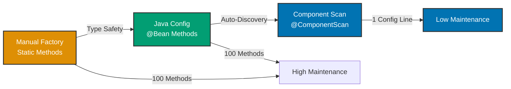

## Why Component Scanning Matters

Production applications contain hundreds of beans. Manual registration (@Bean methods for each class) becomes unmaintainable at scale. Component scanning auto-discovers beans via annotations, reducing configuration from hundreds of @Bean methods to a single @ComponentScan declaration.

## Java Standard Library Baseline

Manual bean registration requires explicit factory methods:

```java
// => Configuration class: manual bean registration
public class ApplicationFactory {

    // => Manual registration: one method per class
    public static ZakatCalculator createZakatCalculator() {
        // => Manually creates PriceConverter dependency
        PriceConverter converter = createPriceConverter();
        // => Manually wires dependency
        return new ZakatCalculator(converter);
    }

    public static PriceConverter createPriceConverter() {
        // => Manual instantiation
        return new GoldPriceConverter();
    }

    public static ZakatService createZakatService() {
        // => Must know entire dependency graph
        ZakatCalculator calculator = createZakatCalculator();
        ZakatRepository repository = createZakatRepository();
        NotificationService notifications = createNotificationService();
        // => Manual wiring of multiple dependencies
        return new ZakatService(calculator, repository, notifications);
    }

    public static ZakatRepository createZakatRepository() {
        // => Manual database connection
        DataSource dataSource = createDataSource();
        return new ZakatRepositoryImpl(dataSource);
    }

    public static NotificationService createNotificationService() {
        return new EmailNotificationService();
    }

    public static DataSource createDataSource() {
        return new HikariDataSource();
    }
}

// => Application: manual factory calls
public class Application {
    public static void main(String[] args) {
        // => Must manually call factory for every bean
        ZakatService service = ApplicationFactory.createZakatService();
        service.processZakat(new BigDecimal("100"));
    }
}
```

**Limitations:**

- **Manual registration**: One factory method per class
- **Maintenance burden**: Add new class = add new factory method
- **Coupling**: Factory knows all implementation details
- **No discovery**: Must explicitly register every class
- **Verbose**: Hundreds of factory methods for large apps

## Spring @Bean Configuration (Manual)

Spring's @Bean methods provide type-safe manual registration:

```java
@Configuration  // => Configuration class
public class ApplicationConfig {

    // => @Bean method: manually registers each class
    @Bean
    public PriceConverter priceConverter() {
        return new GoldPriceConverter();
    }

    @Bean
    public ZakatCalculator zakatCalculator(PriceConverter priceConverter) {
        // => Spring injects dependency
        return new ZakatCalculator(priceConverter);
    }

    @Bean
    public DataSource dataSource() {
        return new HikariDataSource();
    }

    @Bean
    public ZakatRepository zakatRepository(DataSource dataSource) {
        return new ZakatRepositoryImpl(dataSource);
    }

    @Bean
    public NotificationService notificationService() {
        return new EmailNotificationService();
    }

    @Bean
    public ZakatService zakatService(
            ZakatCalculator calculator,
            ZakatRepository repository,
            NotificationService notifications) {
        return new ZakatService(calculator, repository, notifications);
    }

    // => For 100 classes: need 100 @Bean methods
}
```

**Benefits over manual Java:**

- Type safety, dependency injection

**Limitations:**

- Still verbose: one @Bean method per class
- Maintenance burden: new class = new @Bean method

## Spring Component Scanning (Auto-Discovery)

Component scanning auto-discovers beans via annotations:

```java
// => Configuration class: enables component scanning
@Configuration  // => Configuration class marker
@ComponentScan(basePackages = "com.ayokoding.zakat")
// => Scans package recursively for stereotype annotations
// => Discovers: @Component, @Service, @Repository, @Controller
// => Registers discovered classes as beans automatically
public class ApplicationConfig {

    // => No @Bean methods needed for stereotype-annotated classes

    @Bean  // => Still use @Bean for third-party libraries
    public DataSource dataSource() {
        // => Can't add @Component to HikariDataSource (not our code)
        return new HikariDataSource();
    }
}

// => Service layer: auto-discovered
@Service  // => Stereotype annotation: marks class as service bean
          // => Component scanning registers this as bean
          // => Bean name: "zakatService" (camelCase class name)
public class ZakatService {

    private final ZakatCalculator calculator;  // => Dependency
    private final ZakatRepository repository;
    private final NotificationService notifications;

    // => Constructor injection: Spring auto-injects dependencies
    public ZakatService(
            ZakatCalculator calculator,
            ZakatRepository repository,
            NotificationService notifications) {
        this.calculator = calculator;
        this.repository = repository;
        this.notifications = notifications;
    }

    public void processZakat(BigDecimal amount) {
        BigDecimal zakat = calculator.calculateZakat(amount);
        repository.save(zakat);
        notifications.notifyUser("Zakat processed: " + zakat);
    }
}

// => Business logic: auto-discovered
@Component  // => Generic stereotype: marks class as Spring bean
            // => Use when class doesn't fit service/repository/controller
public class ZakatCalculator {

    private final PriceConverter priceConverter;

    // => Constructor injection: Spring auto-injects
    public ZakatCalculator(PriceConverter priceConverter) {
        this.priceConverter = priceConverter;
    }

    public BigDecimal calculateZakat(BigDecimal goldGrams) {
        BigDecimal value = priceConverter.convertToMoney(goldGrams);
        BigDecimal nisab = new BigDecimal("85");
        if (goldGrams.compareTo(nisab) >= 0) {
            return value.multiply(new BigDecimal("0.025"));
        }
        return BigDecimal.ZERO;
    }
}

// => Data access layer: auto-discovered
@Repository  // => Stereotype for data access beans
             // => Enables persistence exception translation
             // => SQLException → DataAccessException
public class ZakatRepositoryImpl implements ZakatRepository {

    private final DataSource dataSource;

    public ZakatRepositoryImpl(DataSource dataSource) {
        this.dataSource = dataSource;
    }

    public void save(BigDecimal zakat) {
        // => Database operations
    }
}

// => Notification layer: auto-discovered
@Service  // => Service stereotype
public class EmailNotificationService implements NotificationService {

    public void notifyUser(String message) {
        // => Send email notification
        System.out.println("Email sent: " + message);
    }
}

// => Generic component: auto-discovered
@Component  // => Generic stereotype
public class GoldPriceConverter implements PriceConverter {

    public BigDecimal convertToMoney(BigDecimal goldGrams) {
        return goldGrams.multiply(new BigDecimal("60"));
    }
}

// => Application: component scanning wires everything
public class Application {
    public static void main(String[] args) {
        // => Creates Spring container with component scanning
        ApplicationContext context =
            new AnnotationConfigApplicationContext(ApplicationConfig.class);

        // => Component scanning auto-discovered and registered:
        // - ZakatService, ZakatCalculator, ZakatRepositoryImpl
        // - EmailNotificationService, GoldPriceConverter

        // => Retrieve fully-wired service
        ZakatService service = context.getBean(ZakatService.class);
        service.processZakat(new BigDecimal("100"));
    }
}
```

**Benefits:**

- **Zero configuration**: No @Bean methods for application classes
- **Auto-discovery**: New classes automatically registered
- **Convention-based**: Annotations on classes, not config
- **Maintainable**: Add class = add annotation (no config changes)

## Stereotype Annotations

Spring provides semantic stereotype annotations:

```java
// => @Component: generic stereotype for any Spring bean
@Component  // => Use when class doesn't fit other stereotypes
public class ConfigValidator {
    // => Utility class, helper, etc.
}

// => @Service: business logic layer
@Service  // => Semantic meaning: service layer bean
          // => Functionally identical to @Component
          // => Better code readability
public class OrderService {
    // => Business logic, orchestration, workflows
}

// => @Repository: data access layer
@Repository  // => Semantic meaning: data access bean
             // => Enables persistence exception translation
             // => SQLException → DataAccessException
public class OrderRepository {
    // => Database operations, queries, persistence
}

// => @Controller: web layer (Spring MVC)
@Controller  // => Semantic meaning: web controller
             // => Handles HTTP requests, renders views
public class OrderController {
    // => HTTP endpoints, request mapping
}

// => @RestController: REST API layer (Spring MVC)
@RestController  // => @Controller + @ResponseBody
                 // => Returns JSON/XML, not views
public class OrderApiController {
    // => REST endpoints, JSON responses
}

// => Custom stereotype: domain-specific semantics
@Target(ElementType.TYPE)
@Retention(RetentionPolicy.RUNTIME)
@Service  // => Meta-annotated with @Service
@Transactional  // => All methods transactional by default
public @interface HalalService {
    // => Custom stereotype for Sharia-compliant services
}

@HalalService  // => Custom stereotype usage
public class HalalFoodOrderService {
    // => Automatically @Service + @Transactional
}
```

## Component Scanning Configuration

### Base Package Scanning

```java
@Configuration
@ComponentScan(basePackages = "com.ayokoding.zakat")
// => Scans com.ayokoding.zakat and all sub-packages recursively
// => Discovers: com.ayokoding.zakat.service.ZakatService
// =>            com.ayokoding.zakat.repository.ZakatRepository
// =>            com.ayokoding.zakat.util.Calculator
public class ApplicationConfig {
}

// => Multiple packages
@Configuration
@ComponentScan(basePackages = {
    "com.ayokoding.zakat",     // => Zakat module
    "com.ayokoding.halal",     // => Halal certification module
    "com.ayokoding.salat"      // => Prayer time module
})
public class ApplicationConfig {
}

// => Type-safe base package (recommended)
@Configuration
@ComponentScan(basePackageClasses = ZakatService.class)
// => Uses ZakatService's package as base
// => Refactor-safe: IDE updates if package renamed
public class ApplicationConfig {
}
```

### Include/Exclude Filters

```java
@Configuration
@ComponentScan(
    basePackages = "com.ayokoding.zakat",
    // => Include filter: only @Service beans
    includeFilters = @ComponentScan.Filter(
        type = FilterType.ANNOTATION,
        classes = Service.class
    ),
    // => Exclude filter: ignore test classes
    excludeFilters = @ComponentScan.Filter(
        type = FilterType.REGEX,
        pattern = ".*Test.*"  // => Excludes: *Test, *Tests, Test*
    )
)
public class ApplicationConfig {
}

// => Custom filter: exclude by name pattern
@Configuration
@ComponentScan(
    basePackages = "com.ayokoding",
    excludeFilters = @ComponentScan.Filter(
        type = FilterType.REGEX,
        pattern = ".*Temp.*"  // => Excludes: *Temp*, Temp*
    )
)
public class ApplicationConfig {
}

// => Custom filter: include only specific classes
@Configuration
@ComponentScan(
    basePackages = "com.ayokoding",
    includeFilters = @ComponentScan.Filter(
        type = FilterType.ASSIGNABLE_TYPE,
        classes = {ZakatService.class, OrderService.class}
    ),
    useDefaultFilters = false  // => Disable default filters
)
public class ApplicationConfig {
}
```

## Progression Diagram



## Production Patterns

### Modular Component Scanning

```java
// => Root configuration: scans multiple modules
@Configuration
@ComponentScan(basePackages = {
    "com.ayokoding.zakat.service",     // => Service layer
    "com.ayokoding.zakat.repository",  // => Data layer
    "com.ayokoding.zakat.web"          // => Web layer
})
public class ApplicationConfig {
}

// => Module-specific configuration
@Configuration
@ComponentScan(basePackages = "com.ayokoding.zakat.service")
public class ServiceConfig {
}

@Configuration
@ComponentScan(basePackages = "com.ayokoding.zakat.repository")
public class RepositoryConfig {
}

// => Import module configs
@Configuration
@Import({ServiceConfig.class, RepositoryConfig.class})
public class ApplicationConfig {
}
```

### Conditional Component Registration

```java
// => Component with @Conditional
@Component
@Conditional(ProductionProfileCondition.class)
// => Only registered if condition met
public class ProductionEmailService implements EmailService {
    // => Production email implementation
}

// => Custom condition: checks profile
public class ProductionProfileCondition implements Condition {

    @Override
    public boolean matches(ConditionContext context, AnnotatedTypeMetadata metadata) {
        // => Condition logic: active profile = "prod"
        String[] activeProfiles = context.getEnvironment().getActiveProfiles();
        return Arrays.asList(activeProfiles).contains("prod");
    }
}

// => Component with @Profile (simpler)
@Component
@Profile("dev")  // => Only in development profile
public class DevEmailService implements EmailService {
    // => Development email implementation (console output)
}

@Component
@Profile("prod")  // => Only in production profile
public class ProdEmailService implements EmailService {
    // => Production email implementation (SMTP)
}
```

### Bean Name Customization

```java
// => Default bean name: camelCase class name
@Service  // => Bean name: "zakatService"
public class ZakatService {
}

// => Custom bean name
@Service("customZakatService")  // => Bean name: "customZakatService"
public class ZakatService {
}

// => Retrieve by custom name
ZakatService service = context.getBean("customZakatService", ZakatService.class);
```

### Primary Bean Selection

```java
// => Multiple implementations
@Component
public class GoldPriceConverter implements PriceConverter {
}

@Component
public class SilverPriceConverter implements PriceConverter {
}

// => Ambiguous: which PriceConverter to inject?
@Service
public class ZakatCalculator {
    // => ERROR: NoUniqueBeanDefinitionException
    // => Two beans match: GoldPriceConverter, SilverPriceConverter
    public ZakatCalculator(PriceConverter converter) {
    }
}

// => Solution 1: @Primary
@Component
@Primary  // => Default choice when multiple candidates exist
public class GoldPriceConverter implements PriceConverter {
}

@Component  // => Fallback: used only if explicitly requested
public class SilverPriceConverter implements PriceConverter {
}

// => Solution 2: @Qualifier
@Service
public class ZakatCalculator {
    // => @Qualifier specifies which bean to inject
    public ZakatCalculator(@Qualifier("silverPriceConverter") PriceConverter converter) {
    }
}
```

## Trade-offs and When to Use

| Approach       | Configuration | Maintenance | Flexibility | Discovery |
| -------------- | ------------- | ----------- | ----------- | --------- |
| Manual Java    | High          | High        | Low         | Manual    |
| @Bean Config   | Medium        | Medium      | High        | Manual    |
| Component Scan | Low           | Low         | Medium      | Automatic |

**When to Use Manual Java:**

- Simple scripts, single-use objects
- No dependency injection needed

**When to Use @Bean Config:**

- Third-party library beans (can't annotate source)
- Complex initialization logic
- Conditional bean creation
- Need full control over instantiation

**When to Use Component Scanning:**

- Your application classes (have source code)
- Standard services, repositories, controllers
- Minimal configuration preference
- Large codebases (100+ classes)

## Best Practices

**1. Use Type-Safe Base Package**

```java
// => AVOID: string-based package (refactoring breaks)
@ComponentScan(basePackages = "com.ayokoding.zakat")

// => PREFER: type-safe base package (refactor-safe)
@ComponentScan(basePackageClasses = ZakatService.class)
```

**2. Mix Component Scanning with @Bean Config**

```java
@Configuration
@ComponentScan(basePackages = "com.ayokoding.zakat")  // => Your classes
public class ApplicationConfig {

    @Bean  // => Third-party library beans
    public DataSource dataSource() {
        return new HikariDataSource();
    }
}
```

**3. Use Semantic Stereotypes**

```java
// => AVOID: generic @Component everywhere
@Component
public class OrderDataAccess {  // Data access layer
}

// => PREFER: semantic stereotype
@Repository  // => Clearly indicates data access layer
public class OrderRepository {
}
```

**4. Narrow Component Scanning Scope**

```java
// => AVOID: scanning entire classpath (slow startup)
@ComponentScan(basePackages = "com")

// => PREFER: narrow scope to application packages
@ComponentScan(basePackages = "com.ayokoding.zakat")
```

**5. Use @Primary for Default Implementation**

```java
@Component
@Primary  // => Default implementation
public class EmailNotificationService implements NotificationService {
}

@Component  // => Alternative implementation
public class SmsNotificationService implements NotificationService {
}
```

## See Also

- [Dependency Injection](/en/learn/software-engineering/platform-web/tools/jvm-spring/in-the-field/dependency-injection) - IoC container patterns
- [Configuration](/en/learn/software-engineering/platform-web/tools/jvm-spring/in-the-field/configuration) - Java config patterns
- [Bean Lifecycle](/en/learn/software-engineering/platform-web/tools/jvm-spring/in-the-field/bean-lifecycle) - Initialization hooks
- [Profiles](/en/learn/software-engineering/platform-web/tools/jvm-spring/in-the-field/profiles) - Environment configuration
