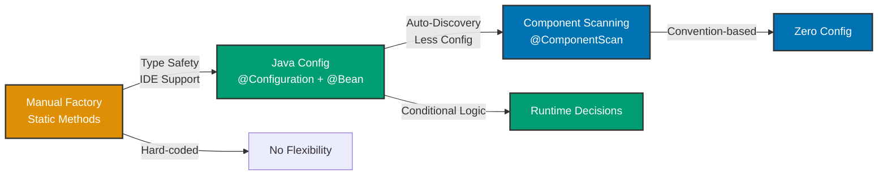

## Why Configuration Matters

Spring applications wire thousands of beans with complex dependencies. Configuration defines how these beans are created, wired, and managed. In production systems handling millions of requests, configuration must be maintainable, type-safe, and refactorable—manual XML becomes unmaintainable at scale.

## Java Standard Library Baseline

Manual configuration requires explicit factory methods everywhere:

```java
// => Factory class: centralized object creation
public class ApplicationFactory {

    // => Creates price converter instance
    public static PriceConverter createPriceConverter() {
        // => Hard-coded: GoldPriceConverter implementation
        // => No external configuration, can't change without recompile
        return new GoldPriceConverter();
    }

    // => Creates zakat calculator with dependencies
    public static ZakatCalculator createZakatCalculator() {
        // => Manual dependency resolution: calls factory method
        PriceConverter converter = createPriceConverter();
        // => Manual wiring: passes dependency to constructor
        return new ZakatCalculator(converter);
    }

    // => Creates zakat service with dependencies
    public static ZakatService createZakatService() {
        // => Dependency chain: must know entire graph
        ZakatCalculator calculator = createZakatCalculator();
        // => Manual wiring: passes dependency
        return new ZakatService(calculator);
    }
}

// => Application startup: manual factory calls
public class Application {
    public static void main(String[] args) {
        // => Must call factory in correct order
        // => No lifecycle management, no singleton guarantee
        ZakatService service = ApplicationFactory.createZakatService();
        service.processZakat(new BigDecimal("100"));
    }
}
```

**Limitations:**

- **No type safety**: Factory methods return Object, casting required
- **Manual ordering**: Must call factory methods in dependency order
- **No singleton control**: Can't guarantee single instance
- **Hard to test**: Can't replace beans for testing
- **No lifecycle**: No hooks for initialization/destruction

## Spring XML Configuration (Historical)

Spring started with XML-based configuration:

```xml
<!-- applicationContext.xml: XML bean definitions -->
<beans xmlns="http://www.springframework.org/schema/beans">

    <!-- Bean definition: id="priceConverter", class=GoldPriceConverter -->
    <bean id="priceConverter"
          class="com.ayokoding.zakat.GoldPriceConverter"/>

    <!-- Bean definition with dependency injection -->
    <bean id="zakatCalculator"
          class="com.ayokoding.zakat.ZakatCalculator">
        <!-- Constructor argument: inject priceConverter bean -->
        <constructor-arg ref="priceConverter"/>
    </bean>

    <!-- Bean definition with constructor injection -->
    <bean id="zakatService"
          class="com.ayokoding.zakat.ZakatService">
        <constructor-arg ref="zakatCalculator"/>
    </bean>

</beans>
```

```java
// => Application startup: load XML configuration
public class Application {
    public static void main(String[] args) {
        // => Creates Spring container from XML file
        // => Parses XML, creates beans, injects dependencies
        ApplicationContext context =
            new ClassPathXmlApplicationContext("applicationContext.xml");

        // => Retrieves fully-wired service from container
        ZakatService service = context.getBean("zakatService", ZakatService.class);
        service.processZakat(new BigDecimal("100"));
    }
}
```

**Limitations:**

- **No type safety**: XML not validated at compile time
- **No IDE support**: Limited refactoring, no autocomplete
- **Verbose**: Boilerplate for every bean
- **Hard to debug**: Runtime failures, stack traces point to XML parser
- **No conditional logic**: Can't use if/else in XML

## Spring Java Configuration (Modern)

Java-based configuration provides type safety and IDE support:

```java
// => Configuration class: Java-based bean definitions
@Configuration  // => Marks class as source of bean definitions
                // => Spring scans for @Bean methods during startup
public class ApplicationConfig {

    @Bean  // => Registers PriceConverter bean in Spring container
           // => Method name becomes bean name: "priceConverter"
           // => Return type: PriceConverter (type-safe)
    public PriceConverter priceConverter() {
        // => Spring calls this method once (singleton scope default)
        // => Instance stored in container, reused for all injections
        return new GoldPriceConverter();
    }

    @Bean  // => Registers ZakatCalculator bean
           // => Parameter priceConverter: Spring injects the bean automatically
           // => Type-safe: compiler validates PriceConverter exists
    public ZakatCalculator zakatCalculator(PriceConverter priceConverter) {
        // => Spring resolved dependency: finds priceConverter bean by type
        // => Constructor injection: dependency passed to constructor
        return new ZakatCalculator(priceConverter);
    }

    @Bean  // => Registers ZakatService bean
           // => Method inter-bean reference: calls zakatCalculator() directly
    public ZakatService zakatService() {
        // => Direct method call: Spring intercepts and returns singleton
        // => No new instance created, returns existing bean from container
        return new ZakatService(zakatCalculator(priceConverter()));
    }

    @Bean  // => Conditional bean creation based on property
           // => Reads property from application.properties
    public DataSource dataSource(@Value("${db.type}") String dbType) {
        // => Conditional logic: choose implementation based on config
        if ("postgres".equals(dbType)) {
            return new PostgresDataSource();
        } else if ("h2".equals(dbType)) {
            return new H2DataSource();
        }
        throw new IllegalArgumentException("Unknown database type: " + dbType);
    }
}

// => Application startup: load Java configuration
public class Application {
    public static void main(String[] args) {
        // => Creates Spring container from configuration class
        // => Scans @Bean methods, creates beans, injects dependencies
        ApplicationContext context =
            new AnnotationConfigApplicationContext(ApplicationConfig.class);

        // => Retrieves fully-wired service from container
        ZakatService service = context.getBean(ZakatService.class);
        service.processZakat(new BigDecimal("100"));
    }
}
```

**Benefits over XML:**

- **Type safety**: Compiler validates bean types
- **IDE support**: Refactoring, autocomplete, navigation
- **Conditional logic**: Use if/else, switch for dynamic beans
- **Debugging**: Stack traces point to Java code, not XML
- **Less verbose**: No XML boilerplate

## Spring Component Scanning (Least Configuration)

Component scanning auto-discovers beans via annotations:

```java
// => Configuration class: enables component scanning
@Configuration  // => Source of bean definitions
@ComponentScan(basePackages = "com.ayokoding.zakat")
// => Scans package for @Component, @Service, @Repository, @Controller
// => Registers discovered classes as beans automatically
public class ApplicationConfig {
    // => No @Bean methods needed for classes with stereotype annotations
}

// => Service class: auto-discovered by component scanning
@Service  // => Marks class as Spring-managed service bean
          // => Component scanning registers this as bean automatically
public class ZakatCalculator {
    private final PriceConverter priceConverter;

    // => Constructor injection: Spring injects priceConverter bean
    public ZakatCalculator(PriceConverter priceConverter) {
        this.priceConverter = priceConverter;
    }

    public BigDecimal calculateZakat(BigDecimal goldGrams) {
        BigDecimal value = priceConverter.convertToMoney(goldGrams);
        BigDecimal nisab = new BigDecimal("85");
        if (goldGrams.compareTo(nisab) >= 0) {
            return value.multiply(new BigDecimal("0.025"));
        }
        return BigDecimal.ZERO;
    }
}

// => Component class: auto-discovered
@Component  // => Generic stereotype: marks class as Spring bean
public class GoldPriceConverter implements PriceConverter {
    public BigDecimal convertToMoney(BigDecimal goldGrams) {
        // => Converts gold grams to money based on market rate
        return goldGrams.multiply(new BigDecimal("60"));  // $60 per gram
    }
}

// => Service class: auto-discovered
@Service  // => Marks class as service bean
public class ZakatService {
    private final ZakatCalculator zakatCalculator;

    // => Constructor injection: Spring injects zakatCalculator bean
    public ZakatService(ZakatCalculator zakatCalculator) {
        this.zakatCalculator = zakatCalculator;
    }

    public void processZakat(BigDecimal gold) {
        BigDecimal zakat = zakatCalculator.calculateZakat(gold);
        System.out.println("Zakat due: " + zakat);
    }
}

// => Application startup: component scanning auto-wires everything
public class Application {
    public static void main(String[] args) {
        // => Creates Spring container from configuration class
        // => Component scanning discovers all @Service/@Component classes
        // => Registers beans and injects dependencies automatically
        ApplicationContext context =
            new AnnotationConfigApplicationContext(ApplicationConfig.class);

        // => Retrieves fully-wired service from container
        ZakatService service = context.getBean(ZakatService.class);
        service.processZakat(new BigDecimal("100"));
    }
}
```

**Benefits over Java Config:**

- **Minimal configuration**: No @Bean methods for common beans
- **Convention over configuration**: Annotations on classes, not config
- **Auto-discovery**: New classes automatically registered

## Progression Diagram



## Production Patterns

### Modular Configuration

```java
// => Database configuration: separate concern
@Configuration  // => Modular config class
public class DatabaseConfig {

    @Bean  // => DataSource bean: database connection pool
    public DataSource dataSource() {
        // => HikariCP: production-grade connection pool
        HikariConfig config = new HikariConfig();
        config.setJdbcUrl("jdbc:postgresql://localhost:5432/zakat");
        config.setUsername("admin");
        config.setPassword("secret");
        config.setMaximumPoolSize(10);  // => Max 10 connections
        return new HikariDataSource(config);
    }
}

// => Security configuration: separate concern
@Configuration  // => Modular config class
public class SecurityConfig {

    @Bean  // => PasswordEncoder bean: bcrypt hashing
    public PasswordEncoder passwordEncoder() {
        // => BCrypt: industry-standard password hashing
        return new BCryptPasswordEncoder(12);  // => Strength 12
    }
}

// => Main configuration: imports modular configs
@Configuration  // => Root config class
@Import({DatabaseConfig.class, SecurityConfig.class})
// => Imports other configuration classes
// => Keeps main config focused, separates concerns
public class ApplicationConfig {
    // => Main config can focus on core business beans
}
```

### Environment-Specific Configuration

```java
@Configuration  // => Configuration class
public class DataSourceConfig {

    @Bean  // => Development profile: in-memory database
    @Profile("dev")  // => Only active when "dev" profile enabled
    public DataSource devDataSource() {
        // => H2: in-memory database for development
        // => Fast startup, no persistence, easy testing
        return new EmbeddedDatabaseBuilder()
            .setType(EmbeddedDatabaseType.H2)
            .build();
    }

    @Bean  // => Production profile: PostgreSQL
    @Profile("prod")  // => Only active when "prod" profile enabled
    public DataSource prodDataSource() {
        // => PostgreSQL: production database with connection pooling
        HikariConfig config = new HikariConfig();
        config.setJdbcUrl("jdbc:postgresql://prod-db:5432/zakat");
        config.setUsername("prod_user");
        config.setPassword("prod_pass");
        return new HikariDataSource(config);
    }
}

// => Activate profile via JVM property
// java -Dspring.profiles.active=dev -jar app.jar
```

### Conditional Bean Registration

```java
@Configuration  // => Configuration class
public class CachingConfig {

    @Bean  // => Cache bean: only if property enabled
    @ConditionalOnProperty(name = "caching.enabled", havingValue = "true")
    // => Only creates bean if caching.enabled=true in application.properties
    public CacheManager cacheManager() {
        // => Caffeine: high-performance caching library
        return new CaffeineCacheManager("zakatCache");
    }

    @Bean  // => No-op cache: fallback when caching disabled
    @ConditionalOnProperty(name = "caching.enabled", havingValue = "false", matchIfMissing = true)
    // => Creates bean if caching.enabled=false OR property missing
    public CacheManager noCacheManager() {
        // => NoOpCacheManager: dummy cache, no caching behavior
        return new NoOpCacheManager();
    }
}
```

### Configuration Properties

```java
// => Configuration properties class: type-safe external config
@ConfigurationProperties(prefix = "zakat")
// => Binds properties from application.properties with prefix "zakat"
// => zakat.nisab.gold → nisab.gold field
public class ZakatProperties {

    private NisabConfig nisab;  // => Nested property group

    public static class NisabConfig {
        private BigDecimal gold;  // => zakat.nisab.gold
        private BigDecimal silver;  // => zakat.nisab.silver

        // => Getters/setters for property binding
        public BigDecimal getGold() { return gold; }
        public void setGold(BigDecimal gold) { this.gold = gold; }
        public BigDecimal getSilver() { return silver; }
        public void setSilver(BigDecimal silver) { this.silver = silver; }
    }

    public NisabConfig getNisab() { return nisab; }
    public void setNisab(NisabConfig nisab) { this.nisab = nisab; }
}

// => Enable configuration properties in config class
@Configuration  // => Configuration class
@EnableConfigurationProperties(ZakatProperties.class)
// => Enables @ConfigurationProperties binding
public class ApplicationConfig {
}

// application.properties:
// zakat.nisab.gold=85
// zakat.nisab.silver=595
```

## Trade-offs and When to Use

| Approach       | Type Safety | IDE Support | Flexibility | Verbosity | Discovery |
| -------------- | ----------- | ----------- | ----------- | --------- | --------- |
| Manual Java    | Medium      | Good        | Low         | High      | Manual    |
| XML Config     | Low         | Poor        | Medium      | Very High | Manual    |
| Java Config    | High        | Excellent   | High        | Medium    | Manual    |
| Component Scan | High        | Excellent   | Medium      | Low       | Automatic |

**When to Use Manual Java:**

- Simple scripts with 1-2 objects
- Learning dependency management patterns
- Performance-critical code (minimal overhead)

**When to Use XML Config:**

- Legacy systems (pre-Spring 3.0)
- Non-code configuration requirements
- Already XML-heavy infrastructure

**When to Use Java Config:**

- Third-party library integration (no source code to annotate)
- Conditional bean creation (if/else logic)
- Complex initialization logic
- When you need full control over bean creation

**When to Use Component Scanning:**

- Your own application classes (have source code)
- Convention-over-configuration preference
- Standard beans (services, repositories, controllers)
- Minimal configuration goal

## Best Practices

**1. Mix Java Config and Component Scanning**

```java
@Configuration  // => Configuration class
@ComponentScan(basePackages = "com.ayokoding.zakat")
// => Component scanning for application classes
public class ApplicationConfig {

    @Bean  // => Java config for third-party library beans
    public DataSource dataSource() {
        // => Can't add @Component to HikariDataSource (not our code)
        return new HikariDataSource(new HikariConfig());
    }
}
```

**2. Use @Import for Modular Configuration**

```java
@Configuration
@Import({DatabaseConfig.class, SecurityConfig.class, CachingConfig.class})
// => Imports keep main config clean, separate concerns
public class ApplicationConfig {
}
```

**3. Externalize Configuration with @ConfigurationProperties**

```java
// => Type-safe properties instead of @Value everywhere
@ConfigurationProperties(prefix = "app")
public class AppProperties {
    private String name;  // => app.name from properties file
    private int maxConnections;  // => app.max-connections
    // Getters/setters
}
```

**4. Use Profiles for Environment-Specific Beans**

```java
@Bean
@Profile("dev")  // => Development only
public DataSource devDataSource() { /* ... */ }

@Bean
@Profile("prod")  // => Production only
public DataSource prodDataSource() { /* ... */ }
```

**5. Avoid Over-Configuration**

```java
// => AVOID: unnecessary @Bean for simple classes
@Bean
public String appName() {
    return "ZakatApp";  // => Just use @Value("ZakatApp") instead
}

// => PREFER: component scanning for application classes
@Service  // => Auto-discovered, no @Bean needed
public class ZakatService { }
```

## See Also

- [Dependency Injection](/en/learn/software-engineering/platform-web/tools/jvm-spring/in-the-field/dependency-injection) - IoC container patterns
- [Bean Lifecycle](/en/learn/software-engineering/platform-web/tools/jvm-spring/in-the-field/bean-lifecycle) - Initialization hooks
- [Component Scanning](/en/learn/software-engineering/platform-web/tools/jvm-spring/in-the-field/component-scanning) - Auto-discovery patterns
- [Profiles](/en/learn/software-engineering/platform-web/tools/jvm-spring/in-the-field/profiles) - Environment configuration
- [Property Sources](/en/learn/software-engineering/platform-web/tools/jvm-spring/in-the-field/property-sources) - External configuration
