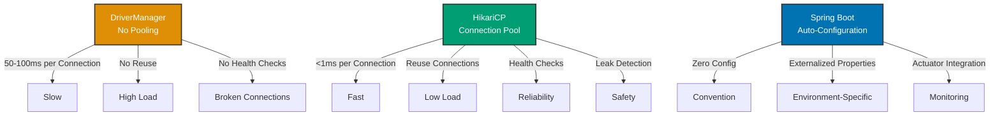

## Why Connection Pooling Matters

Database connections are expensive resources requiring TCP handshake, authentication, and session initialization. Creating connections per request kills performance—a connection takes 50-100ms to establish. In production systems handling thousands of requests per second, connection pooling reuses connections, reducing latency from 100ms to <1ms and preventing connection exhaustion.

## JDBC DriverManager Baseline

Manual connection creation without pooling:

```java
import java.sql.*;

// => Repository: no connection pooling
public class ZakatAccountRepository {

    // => Connection parameters: hardcoded configuration
    private static final String DB_URL = "jdbc:postgresql://localhost:5432/zakat";
    private static final String DB_USER = "admin";
    private static final String DB_PASSWORD = "secret";

    // => Find account: creates new connection every time
    public ZakatAccount findById(Long id) {
        // => DriverManager.getConnection(): creates new connection
        // => Expensive: TCP handshake + authentication + session init
        // => 50-100ms per connection establishment
        Connection conn = null;
        PreparedStatement stmt = null;
        ResultSet rs = null;

        try {
            // => Creates new connection: no reuse
            // => Every request establishes new TCP connection
            conn = DriverManager.getConnection(DB_URL, DB_USER, DB_PASSWORD);

            String sql = "SELECT id, account_number, balance FROM zakat_accounts WHERE id = ?";
            stmt = conn.prepareStatement(sql);
            stmt.setLong(1, id);
            rs = stmt.executeQuery();

            if (rs.next()) {
                // => Extract data: 1-2ms
                return new ZakatAccount(
                    rs.getLong("id"),
                    rs.getString("account_number"),
                    rs.getBigDecimal("balance")
                );
            }

            return null;

        } catch (SQLException e) {
            throw new RuntimeException("Database error", e);

        } finally {
            // => Close connection: destroys TCP connection
            // => Next request must create new connection (expensive)
            if (rs != null) {
                try { rs.close(); } catch (SQLException ignored) {}
            }
            if (stmt != null) {
                try { stmt.close(); } catch (SQLException ignored) {}
            }
            if (conn != null) {
                try {
                    // => conn.close(): closes TCP connection to database
                    // => Connection destroyed, can't be reused
                    conn.close();
                } catch (SQLException ignored) {}
            }
        }
    }

    // => Save account: creates another new connection
    public void save(ZakatAccount account) {
        Connection conn = null;
        PreparedStatement stmt = null;

        try {
            // => Another new connection: 50-100ms overhead again
            // => Database must handle authentication, create session
            conn = DriverManager.getConnection(DB_URL, DB_USER, DB_PASSWORD);

            String sql = "INSERT INTO zakat_accounts (account_number, balance) VALUES (?, ?)";
            stmt = conn.prepareStatement(sql);
            stmt.setString(1, account.getAccountNumber());
            stmt.setBigDecimal(2, account.getBalance());
            stmt.executeUpdate();

        } catch (SQLException e) {
            throw new RuntimeException("Database error", e);

        } finally {
            if (stmt != null) {
                try { stmt.close(); } catch (SQLException ignored) {}
            }
            if (conn != null) {
                try {
                    // => Close: destroys connection again
                    conn.close();
                } catch (SQLException ignored) {}
            }
        }
    }
}
```

**Limitations:**

- **Slow**: 50-100ms per connection creation (TCP + auth + session)
- **Resource exhaustion**: Database limits connections (e.g., PostgreSQL default: 100)
- **No reuse**: Every request creates/destroys connection
- **Performance cliff**: At high load, requests wait for available database connections
- **No health checks**: Can't detect broken connections until query fails

## HikariCP Connection Pool

HikariCP provides production-grade connection pooling:

```java
import com.zaxxer.hikari.HikariConfig;
import com.zaxxer.hikari.HikariDataSource;
import javax.sql.DataSource;

// => Configuration: HikariCP connection pool
@Configuration
public class DatabaseConfig {

    @Bean  // => DataSource: connection pool
    public DataSource dataSource() {
        // => HikariConfig: connection pool configuration
        HikariConfig config = new HikariConfig();

        // => Database connection parameters
        config.setJdbcUrl("jdbc:postgresql://localhost:5432/zakat");
        config.setUsername("admin");
        config.setPassword("secret");
        config.setDriverClassName("org.postgresql.Driver");

        // => Pool sizing: connection pool capacity
        config.setMaximumPoolSize(20);  // => Max 20 connections in pool
        // => More connections = more concurrency but more memory/database load
        // => Formula: connections = ((core_count * 2) + effective_spindle_count)
        // => Example: 8 cores + 1 disk = 17 connections (round to 20)

        config.setMinimumIdle(5);  // => Min 5 idle connections maintained
        // => Idle connections: ready for immediate use, no creation delay
        // => Pool keeps at least 5 connections open even when idle

        // => Connection timeout: max wait time for connection from pool
        config.setConnectionTimeout(30000);  // => 30 seconds
        // => If pool exhausted: request waits up to 30s for available connection
        // => Throws SQLException after timeout

        // => Idle timeout: remove idle connections after duration
        config.setIdleTimeout(600000);  // => 10 minutes
        // => Connections idle >10min removed (down to minimumIdle)
        // => Prevents holding idle connections unnecessarily

        // => Max lifetime: maximum connection lifespan
        config.setMaxLifetime(1800000);  // => 30 minutes
        // => Connections closed after 30min regardless of usage
        // => Prevents stale connections, handles firewall timeouts
        // => Should be shorter than database's wait_timeout

        // => Leak detection: warn if connection held too long
        config.setLeakDetectionThreshold(60000);  // => 60 seconds
        // => Logs warning if connection not returned to pool after 60s
        // => Helps detect connection leaks in application code

        // => Connection test query: validates connection health
        config.setConnectionTestQuery("SELECT 1");
        // => Executes before returning connection from pool
        // => Detects broken connections (network failure, database restart)

        // => Pool name: for monitoring and logging
        config.setPoolName("ZakatHikariPool");
        // => Appears in logs: helps identify pool in multi-datasource apps

        // => Connection initialization SQL
        config.setConnectionInitSql("SET TIME ZONE 'UTC'");
        // => Executed when connection created
        // => Ensures consistent session settings

        // => Auto-commit: default transaction behavior
        config.setAutoCommit(true);
        // => Connections returned with auto-commit enabled
        // => Spring @Transactional disables auto-commit automatically

        // => Creates HikariDataSource: connection pool implementation
        return new HikariDataSource(config);
    }
}

// => Repository: uses connection pool via JdbcTemplate
@Repository
public class ZakatAccountRepository {

    private final JdbcTemplate jdbcTemplate;

    // => Constructor: JdbcTemplate wraps DataSource (connection pool)
    public ZakatAccountRepository(DataSource dataSource) {
        this.jdbcTemplate = new JdbcTemplate(dataSource);
    }

    // => Find account: gets connection from pool
    public ZakatAccount findById(Long id) {
        // => jdbcTemplate.queryForObject(): internally calls dataSource.getConnection()
        // => HikariCP returns pooled connection: <1ms (vs 50-100ms for new connection)
        // => Connection already authenticated, session established
        return jdbcTemplate.queryForObject(
            "SELECT id, account_number, balance FROM zakat_accounts WHERE id = ?",
            (rs, rowNum) -> new ZakatAccount(
                rs.getLong("id"),
                rs.getString("account_number"),
                rs.getBigDecimal("balance")
            ),
            id
        );
        // => Connection automatically returned to pool after query
        // => Not closed: reused for next request
    }

    // => Save account: reuses pooled connection
    public void save(ZakatAccount account) {
        // => Gets connection from pool: <1ms
        // => Same connection may be reused from previous request
        jdbcTemplate.update(
            "INSERT INTO zakat_accounts (account_number, balance) VALUES (?, ?)",
            account.getAccountNumber(),
            account.getBalance()
        );
        // => Connection returned to pool: available for next request
    }

    // => Multiple operations: connection automatically managed
    public void transferFunds(Long fromId, Long toId, BigDecimal amount) {
        // => All operations use same pooled connection
        // => Connection checked out once, used for all statements, returned once

        ZakatAccount from = findById(fromId);
        from.debit(amount);
        jdbcTemplate.update(
            "UPDATE zakat_accounts SET balance = ? WHERE id = ?",
            from.getBalance(),
            fromId
        );

        ZakatAccount to = findById(toId);
        to.credit(amount);
        jdbcTemplate.update(
            "UPDATE zakat_accounts SET balance = ? WHERE id = ?",
            to.getBalance(),
            toId
        );

        // => Connection returned to pool after all operations
    }
}
```

**Benefits:**

- **100x faster**: <1ms to get pooled connection vs 50-100ms to create new
- **Resource efficiency**: Reuses connections, reduces database load
- **Bounded concurrency**: maxPoolSize prevents connection exhaustion
- **Health checks**: Detects and removes broken connections
- **Leak detection**: Warns about unreturned connections

## Spring Boot Auto-Configuration

Spring Boot configures HikariCP automatically:

```yaml
# application.yml: Spring Boot HikariCP configuration
spring:
  datasource:
    # => JDBC URL: database connection string
    url: jdbc:postgresql://localhost:5432/zakat
    username: admin
    password: secret
    driver-class-name: org.postgresql.Driver

    # => HikariCP configuration: Spring Boot auto-detects HikariCP on classpath
    hikari:
      # => Pool sizing
      maximum-pool-size: 20 # => Max connections in pool
      minimum-idle: 5 # => Min idle connections maintained

      # => Timeouts (milliseconds)
      connection-timeout: 30000 # => 30s to get connection from pool
      idle-timeout: 600000 # => 10min idle before removal
      max-lifetime: 1800000 # => 30min max connection lifetime

      # => Leak detection
      leak-detection-threshold: 60000 # => 60s before leak warning

      # => Health check
      connection-test-query: SELECT 1 # => Validates connection health

      # => Pool name
      pool-name: ZakatHikariPool # => For monitoring

      # => Connection properties
      connection-init-sql: SET TIME ZONE 'UTC' # => Initialization SQL
      auto-commit: true # => Default auto-commit behavior
```

```java
// => Repository: no explicit DataSource configuration needed
@Repository
public class ZakatAccountRepository {

    private final JdbcTemplate jdbcTemplate;

    // => Spring Boot auto-configures JdbcTemplate with HikariCP DataSource
    // => No manual configuration required
    public ZakatAccountRepository(JdbcTemplate jdbcTemplate) {
        this.jdbcTemplate = jdbcTemplate;
    }

    // => All database operations automatically use connection pool
    public ZakatAccount findById(Long id) {
        return jdbcTemplate.queryForObject(
            "SELECT id, account_number, balance FROM zakat_accounts WHERE id = ?",
            (rs, rowNum) -> new ZakatAccount(
                rs.getLong("id"),
                rs.getString("account_number"),
                rs.getBigDecimal("balance")
            ),
            id
        );
    }
}
```

**Benefits:**

- **Zero boilerplate**: No HikariConfig or HikariDataSource beans
- **Convention over configuration**: Sensible defaults for common use cases
- **Externalized config**: Properties file instead of Java code
- **Environment-specific**: Override properties per environment (dev/prod)

## Connection Pool Monitoring

Production applications need pool health monitoring:

```java
import com.zaxxer.hikari.HikariPoolMXBean;
import org.springframework.boot.actuate.health.Health;
import org.springframework.boot.actuate.health.HealthIndicator;

// => Health indicator: exposes connection pool metrics
@Component
public class HikariPoolHealthIndicator implements HealthIndicator {

    private final HikariDataSource dataSource;

    public HikariPoolHealthIndicator(DataSource dataSource) {
        // => Cast to HikariDataSource for pool metrics access
        this.dataSource = (HikariDataSource) dataSource;
    }

    @Override
    public Health health() {
        // => HikariPoolMXBean: JMX interface for pool metrics
        HikariPoolMXBean poolMXBean = dataSource.getHikariPoolMXBean();

        // => Pool metrics
        int totalConnections = poolMXBean.getTotalConnections();
        // => Total connections: active + idle connections in pool

        int activeConnections = poolMXBean.getActiveConnections();
        // => Active connections: currently executing queries

        int idleConnections = poolMXBean.getIdleConnections();
        // => Idle connections: available for immediate use

        int threadsAwaitingConnection = poolMXBean.getThreadsAwaitingConnection();
        // => Threads waiting: requests blocked waiting for connection
        // => If >0: pool exhausted, consider increasing maximumPoolSize

        // => Health status determination
        if (threadsAwaitingConnection > 5) {
            // => Many threads waiting: critical (pool exhausted)
            return Health.down()
                .withDetail("totalConnections", totalConnections)
                .withDetail("activeConnections", activeConnections)
                .withDetail("idleConnections", idleConnections)
                .withDetail("threadsAwaitingConnection", threadsAwaitingConnection)
                .withDetail("reason", "Connection pool exhausted")
                .build();
        }

        if (activeConnections == totalConnections && idleConnections == 0) {
            // => All connections active, none idle: warning (pool under pressure)
            return Health.up()
                .withDetail("totalConnections", totalConnections)
                .withDetail("activeConnections", activeConnections)
                .withDetail("idleConnections", idleConnections)
                .withDetail("warning", "Connection pool at capacity")
                .build();
        }

        // => Healthy: idle connections available
        return Health.up()
            .withDetail("totalConnections", totalConnections)
            .withDetail("activeConnections", activeConnections)
            .withDetail("idleConnections", idleConnections)
            .build();
    }
}

// => Metrics endpoint: Prometheus/Micrometer integration
@Component
public class HikariPoolMetrics implements MeterBinder {

    private final HikariDataSource dataSource;

    @Override
    public void bindTo(MeterRegistry registry) {
        HikariPoolMXBean poolMXBean = dataSource.getHikariPoolMXBean();

        // => Gauge: current value metrics
        Gauge.builder("hikari.connections.total", poolMXBean::getTotalConnections)
            .description("Total connections in pool")
            .register(registry);

        Gauge.builder("hikari.connections.active", poolMXBean::getActiveConnections)
            .description("Active connections (executing queries)")
            .register(registry);

        Gauge.builder("hikari.connections.idle", poolMXBean::getIdleConnections)
            .description("Idle connections (available)")
            .register(registry);

        Gauge.builder("hikari.threads.awaiting", poolMXBean::getThreadsAwaitingConnection)
            .description("Threads waiting for connection")
            .register(registry);
    }
}
```

## Progression Diagram



## Production Patterns

### Connection Pool Sizing

```java
// => Right-size pool for workload
@Bean
public DataSource dataSource() {
    HikariConfig config = new HikariConfig();

    // => Formula: connections = ((core_count * 2) + effective_spindle_count)
    // => Example: 8-core server + 1 disk = (8 * 2) + 1 = 17 connections
    int cpuCores = Runtime.getRuntime().availableProcessors();
    int effectiveSpindleCount = 1;  // 1 for SSD, higher for RAID
    int optimalPoolSize = (cpuCores * 2) + effectiveSpindleCount;

    config.setMaximumPoolSize(optimalPoolSize);
    // => Too few: requests wait for connections (high latency)
    // => Too many: database overload, memory waste

    config.setMinimumIdle(optimalPoolSize / 4);
    // => minimumIdle: 25% of maximum for typical load patterns
    // => Pool shrinks during low traffic, grows during peaks

    return new HikariDataSource(config);
}
```

### Multiple DataSources

```java
// => Primary database configuration
@Configuration
public class PrimaryDatabaseConfig {

    @Bean
    @Primary  // => Default DataSource when multiple exist
    public DataSource primaryDataSource() {
        HikariConfig config = new HikariConfig();
        config.setJdbcUrl("jdbc:postgresql://localhost:5432/zakat");
        config.setPoolName("PrimaryPool");
        config.setMaximumPoolSize(20);
        return new HikariDataSource(config);
    }
}

// => Secondary database configuration
@Configuration
public class ReportingDatabaseConfig {

    @Bean
    public DataSource reportingDataSource() {
        HikariConfig config = new HikariConfig();
        config.setJdbcUrl("jdbc:postgresql://localhost:5432/reporting");
        config.setPoolName("ReportingPool");
        config.setMaximumPoolSize(10);  // => Smaller pool for read-only queries
        config.setReadOnly(true);  // => Read-only optimization
        return new HikariDataSource(config);
    }
}
```

### Connection Initialization

```java
@Bean
public DataSource dataSource() {
    HikariConfig config = new HikariConfig();

    // => Initialization SQL: executed when connection created
    config.setConnectionInitSql("""
        SET TIME ZONE 'UTC';
        SET statement_timeout = 30000;
        SET lock_timeout = 10000;
    """);
    // => Ensures consistent session settings across all connections

    return new HikariDataSource(config);
}
```

## Trade-offs and When to Use

| Approach         | Latency  | Throughput | Resource Usage | Complexity | Monitoring |
| ---------------- | -------- | ---------- | -------------- | ---------- | ---------- |
| DriverManager    | 50-100ms | Low        | High           | Low        | None       |
| HikariCP Manual  | <1ms     | High       | Low            | Medium     | Manual     |
| Spring Boot Auto | <1ms     | High       | Low            | Very Low   | Built-in   |

**When to Use DriverManager:**

- Learning JDBC fundamentals
- Single-threaded applications with infrequent database access
- Testing/debugging connection issues

**When to Use HikariCP Manual Configuration:**

- Need programmatic pool configuration
- Multiple DataSources with different settings
- Custom connection validation logic
- Advanced tuning requirements

**When to Use Spring Boot Auto-Configuration:**

- Standard single-database applications (90% of use cases)
- Convention-over-configuration preference
- Externalized configuration via properties files
- Built-in monitoring via Spring Actuator
- Rapid development without boilerplate

## Best Practices

**1. Right-Size Connection Pool**

Use formula based on CPU cores and disk:

```yaml
spring:
  datasource:
    hikari:
      maximum-pool-size: 20 # (8 cores * 2) + 1 disk = 17, rounded to 20
      minimum-idle: 5 # 25% of maximum
```

**2. Set Appropriate Timeouts**

Prevent indefinite waiting:

```yaml
spring:
  datasource:
    hikari:
      connection-timeout: 30000 # 30s to get connection
      idle-timeout: 600000 # 10min idle before removal
      max-lifetime: 1800000 # 30min max connection lifetime
```

**3. Enable Leak Detection**

Catch connection leaks early:

```yaml
spring:
  datasource:
    hikari:
      leak-detection-threshold: 60000 # Warn if connection held >60s
```

**4. Configure Health Checks**

Detect broken connections:

```yaml
spring:
  datasource:
    hikari:
      connection-test-query: SELECT 1
```

**5. Monitor Pool Metrics**

Track pool health in production:

```java
@Component
public class HikariPoolHealthIndicator implements HealthIndicator {
    // Track totalConnections, activeConnections, threadsAwaitingConnection
}
```

**6. Externalize Configuration**

Use environment-specific properties:

```yaml
# application-dev.yml
spring:
  datasource:
    hikari:
      maximum-pool-size: 5  # Small pool for development

# application-prod.yml
spring:
  datasource:
    hikari:
      maximum-pool-size: 20  # Larger pool for production
```

## See Also

- [Spring JDBC](/en/learn/software-engineering/platform-web/tools/jvm-spring/in-the-field/spring-jdbc) - JdbcTemplate with connection pooling
- [Spring Data JPA](/en/learn/software-engineering/platform-web/tools/jvm-spring/in-the-field/spring-data-jpa) - JPA with connection pooling
- [Transaction Management](/en/learn/software-engineering/platform-web/tools/jvm-spring/in-the-field/transaction-management) - Transaction and connection interaction
- [Configuration](/en/learn/software-engineering/platform-web/tools/jvm-spring/in-the-field/configuration) - DataSource bean configuration
- Java JDBC - JDBC baseline patterns
