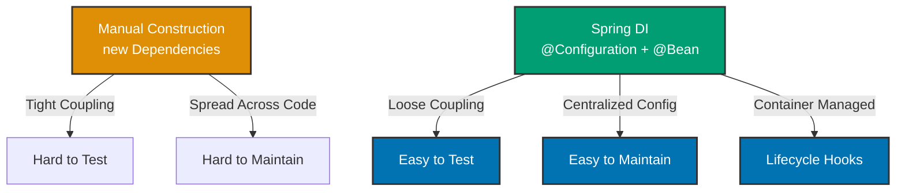

## Why Dependency Injection Matters

Dependency Injection (DI) decouples object creation from object usage, enabling testability, maintainability, and flexibility. In production systems handling millions of requests, Spring's IoC container manages thousands of beans with complex dependency graphs, lifecycle hooks, and scope management—manual wiring becomes impossible at scale.

## Java Standard Library Baseline

Manual dependency management requires explicit object construction everywhere:

```java
// => ZakatCalculator needs PriceConverter to calculate zakat values
public class ZakatCalculator {
    private final PriceConverter priceConverter;  // => Dependency

    public ZakatCalculator() {
        // => Hard-coded dependency: tightly coupled to GoldPriceConverter
        // => Can't swap implementations without changing this class
        this.priceConverter = new GoldPriceConverter();
    }

    // => Calculates zakat (Islamic charity) based on gold value
    public BigDecimal calculateZakat(BigDecimal goldGrams) {
        // => Converts gold grams to monetary value
        BigDecimal value = priceConverter.convertToMoney(goldGrams);
        // => Zakat is 2.5% of total value above threshold (nisab)
        BigDecimal nisab = new BigDecimal("85");  // => 85 grams gold threshold
        if (goldGrams.compareTo(nisab) >= 0) {
            return value.multiply(new BigDecimal("0.025"));  // => 2.5%
        }
        return BigDecimal.ZERO;  // => Below threshold: no zakat
    }
}

// => Client code must know all construction details
public class ZakatService {
    public void processZakat(BigDecimal gold) {
        // => Creates new calculator every time
        // => No reuse, no caching, can't control lifecycle
        ZakatCalculator calculator = new ZakatCalculator();
        BigDecimal zakat = calculator.calculateZakat(gold);
        System.out.println("Zakat due: " + zakat);
    }
}
```

**Limitations:**

- **Testing**: Can't replace `GoldPriceConverter` with mock for unit tests
- **Flexibility**: Changing price converter requires modifying `ZakatCalculator`
- **Lifecycle**: No control over when calculator created/destroyed
- **Reuse**: Creates new instances repeatedly instead of reusing

## Spring Core Solution

Spring's IoC container manages bean creation, injection, and lifecycle:

```java
// => Configuration class: central location for bean definitions
@Configuration  // => Marks class as source of bean definitions
                // => Spring scans for @Bean methods during startup
public class ZakatConfig {

    @Bean  // => Registers PriceConverter bean in Spring container
           // => Method name becomes bean name: "priceConverter"
    public PriceConverter priceConverter() {
        // => Spring calls this method once (singleton scope default)
        // => Instance stored in container, reused for all injections
        return new GoldPriceConverter();
    }

    @Bean  // => Registers ZakatCalculator bean
           // => Parameter priceConverter: Spring injects the bean automatically
    public ZakatCalculator zakatCalculator(PriceConverter priceConverter) {
        // => Spring resolved dependency: finds priceConverter bean by type
        // => Constructor injection: dependency passed to constructor
        return new ZakatCalculator(priceConverter);
    }
}

// => Service class: dependencies injected, no manual construction
public class ZakatCalculator {
    private final PriceConverter priceConverter;  // => Dependency injected by Spring

    // => Constructor accepts dependency: enables testing with mocks
    public ZakatCalculator(PriceConverter priceConverter) {
        this.priceConverter = priceConverter;
    }

    public BigDecimal calculateZakat(BigDecimal goldGrams) {
        BigDecimal value = priceConverter.convertToMoney(goldGrams);  // => Uses injected converter
        BigDecimal nisab = new BigDecimal("85");
        if (goldGrams.compareTo(nisab) >= 0) {
            return value.multiply(new BigDecimal("0.025"));
        }
        return BigDecimal.ZERO;
    }
}

// => Client code: Spring manages construction
@Service  // => Marks class as Spring-managed service bean
public class ZakatService {
    private final ZakatCalculator zakatCalculator;  // => Injected by Spring

    // => Constructor injection: Spring finds zakatCalculator bean and injects it
    public ZakatService(ZakatCalculator zakatCalculator) {
        this.zakatCalculator = zakatCalculator;
    }

    public void processZakat(BigDecimal gold) {
        // => Uses injected calculator: no manual construction
        // => Same instance reused across all calls (singleton)
        BigDecimal zakat = zakatCalculator.calculateZakat(gold);
        System.out.println("Zakat due: " + zakat);
    }
}

// => Application startup: Spring wires everything
public class Application {
    public static void main(String[] args) {
        // => Creates Spring container from configuration class
        // => Scans @Bean methods, creates beans, injects dependencies
        ApplicationContext context = new AnnotationConfigApplicationContext(ZakatConfig.class);

        // => Retrieves fully-wired service from container
        // => All dependencies already injected by Spring
        ZakatService service = context.getBean(ZakatService.class);
        service.processZakat(new BigDecimal("100"));
    }
}
```

**Benefits:**

- **Testability**: Replace `priceConverter` bean with mock in tests
- **Flexibility**: Change `@Bean` method to return different implementation
- **Lifecycle**: Spring manages creation (startup) and destruction (shutdown)
- **Reuse**: Singleton scope (default) ensures single instance reused

## Progression Diagram



## Production Patterns

### Constructor Injection (Recommended)

```java
@Service
public class OrderService {
    private final PaymentService paymentService;  // => final: immutable after construction
    private final NotificationService notificationService;

    // => Constructor injection: all dependencies required, explicit
    // => Spring automatically injects when only one constructor exists
    public OrderService(PaymentService paymentService,
                       NotificationService notificationService) {
        this.paymentService = paymentService;
        this.notificationService = notificationService;
    }
}
```

**Benefits:**

- Dependencies explicit in constructor signature
- `final` fields prevent accidental reassignment
- Fails at startup if dependencies missing (fail-fast)
- Easy testing: pass mocks to constructor

### Setter Injection (Rare)

```java
@Service
public class ReportGenerator {
    private EmailService emailService;  // => Optional dependency

    @Autowired(required = false)  // => Optional: doesn't fail if bean missing
    public void setEmailService(EmailService emailService) {
        this.emailService = emailService;  // => Injected if available
    }

    public void generate(Report report) {
        // => Check if optional dependency present
        if (emailService != null) {
            emailService.send(report);
        }
    }
}
```

**Use when**: Dependency truly optional (feature works without it)

### Field Injection (Avoid)

```java
@Service
public class OrderService {
    @Autowired  // => AVOID: hides dependencies, harder to test
    private PaymentService paymentService;
}
```

**Problems**: Can't create instance without Spring, dependencies hidden, can't use `final`

### Circular Dependency Detection

```java
@Service
public class ServiceA {
    private final ServiceB serviceB;

    public ServiceA(ServiceB serviceB) {  // => A depends on B
        this.serviceB = serviceB;
    }
}

@Service
public class ServiceB {
    private final ServiceA serviceA;

    public ServiceB(ServiceA serviceA) {  // => B depends on A
        this.serviceA = serviceA;  // => Circular: A → B → A
    }
}

// => Spring detects circular dependency at startup
// => BeanCurrentlyInCreationException thrown
```

**Solution**: Extract shared logic to third service or use `@Lazy` (not recommended)

### Qualifier for Multiple Implementations

```java
public interface PaymentService {
    void charge(BigDecimal amount);
}

@Service("creditCardPayment")  // => Bean name: creditCardPayment
public class CreditCardPaymentService implements PaymentService {
    public void charge(BigDecimal amount) {
        // => Charge credit card
    }
}

@Service("paypalPayment")  // => Bean name: paypalPayment
public class PayPalPaymentService implements PaymentService {
    public void charge(BigDecimal amount) {
        // => Charge PayPal
    }
}

@Service
public class OrderService {
    private final PaymentService paymentService;

    // => @Qualifier specifies which bean to inject
    public OrderService(@Qualifier("creditCardPayment") PaymentService paymentService) {
        this.paymentService = paymentService;  // => Injects CreditCardPaymentService
    }
}
```

## Trade-offs and When to Use

| Approach       | Learning Curve | Testability | Flexibility | Lifecycle Control       |
| -------------- | -------------- | ----------- | ----------- | ----------------------- |
| Manual Java    | Low            | Hard        | Limited     | Manual                  |
| Spring DI      | Medium         | Easy        | High        | Automatic               |
| Spring Boot DI | High           | Easy        | Very High   | Automatic + Auto-config |

**When to Use Manual Java:**

- Simple utilities with zero dependencies
- Performance-critical code (DI adds minimal overhead)
- Learning projects to understand dependency patterns

**When to Use Spring DI:**

- Enterprise applications with complex dependencies
- Applications requiring testability
- Systems needing lifecycle management (startup hooks, shutdown cleanup)
- When using other Spring modules (Data, Security, Web)

## Best Practices

**1. Prefer Constructor Injection**

```java
@Service
public class OrderService {
    private final PaymentService paymentService;

    public OrderService(PaymentService paymentService) {  // => Recommended
        this.paymentService = paymentService;
    }
}
```

**2. Use @Autowired Only When Necessary**

```java
// Single constructor: no @Autowired needed
public OrderService(PaymentService paymentService) {  // => Spring auto-detects
}

// Multiple constructors: mark which one Spring should use
@Autowired  // => Required when multiple constructors exist
public OrderService(PaymentService paymentService, NotificationService notificationService) {
}
```

**3. Make Dependencies Final**

```java
private final PaymentService paymentService;  // => Immutable, prevents reassignment
```

**4. Keep Bean Scopes Consistent**

```java
@Service  // => Singleton: one instance for entire app (default)
public class OrderService {
    // => No mutable state: thread-safe
}

@Component
@Scope("prototype")  // => New instance per injection
public class OrderProcessor {
    // => Can have mutable state (not shared across threads)
}
```

**5. Use Profiles for Environment-Specific Beans**

```java
@Configuration
public class DataConfig {

    @Bean
    @Profile("dev")  // => Only created in development environment
    public DataSource devDataSource() {
        return new H2DataSource();  // => In-memory database for dev
    }

    @Bean
    @Profile("prod")  // => Only created in production environment
    public DataSource prodDataSource() {
        return new PostgresDataSource();  // => Production database
    }
}
```

## See Also

- [Configuration](/en/learn/software-engineering/platform-web/tools/jvm-spring/in-the-field/configuration) - Java Config patterns
- [Bean Lifecycle](/en/learn/software-engineering/platform-web/tools/jvm-spring/in-the-field/bean-lifecycle) - Initialization and destruction
- [Component Scanning](/en/learn/software-engineering/platform-web/tools/jvm-spring/in-the-field/component-scanning) - @Component discovery
- [Spring Best Practices](/en/learn/software-engineering/platform-web/tools/jvm-spring/in-the-field/best-practices) - DI patterns
- [Java Dependency Injection](/en/learn/software-engineering/programming-languages/java/in-the-field/dependency-injection) - Java baseline patterns
