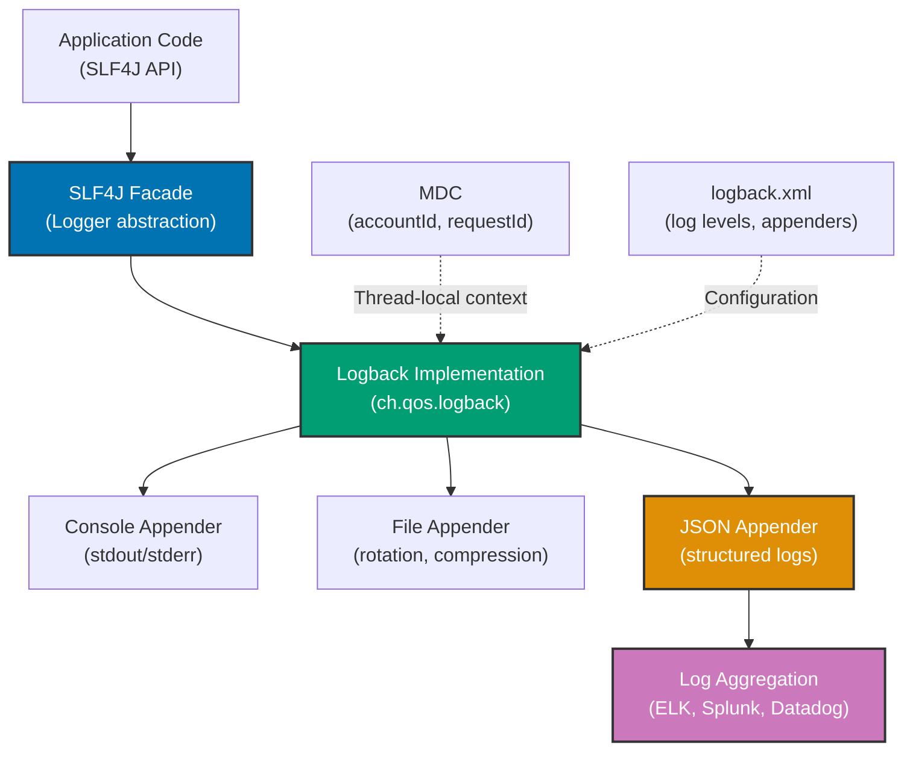

## Why Logging Integration Matters

Production applications require comprehensive logging for troubleshooting, auditing, and monitoring—tracking zakat transactions, detecting fraud, debugging failures, and analyzing performance. Manual logging with System.out.println provides no log levels, no timestamps, no structured data, and disappears in containers. In production systems processing thousands of zakat payments requiring compliance auditing, fraud detection, and performance analysis, SLF4J facade with Logback implementation provides log levels, rotation, structured logging (JSON), MDC (Mapped Diagnostic Context) for request correlation, and Spring integration—eliminating println() statements that prevent log aggregation, compliance auditing, and production troubleshooting.

## java.util.logging Baseline

Java provides java.util.logging (JUL) for basic logging without external dependencies:

```java
import java.util.logging.*;
import java.io.IOException;

// => java.util.logging: built-in logging framework
// => Included in JDK, no external dependencies
public class JulLoggingExample {

    // => Logger instance: one per class
    // => Logger.getLogger: creates logger by name (typically class name)
    // => PROBLEM: Verbose logger creation
    private static final Logger logger = Logger.getLogger(JulLoggingExample.class.getName());

    // => Configure logging manually
    // => PROBLEM: Configuration code in business logic
    static {
        try {
            // => ConsoleHandler: outputs to System.err
            // => PROBLEM: Only console output, no file rotation
            ConsoleHandler consoleHandler = new ConsoleHandler();

            // => Formatter: controls log format
            // => SimpleFormatter: human-readable format
            consoleHandler.setFormatter(new SimpleFormatter());

            // => Set log level: INFO and above
            // => Levels: SEVERE, WARNING, INFO, CONFIG, FINE, FINER, FINEST
            consoleHandler.setLevel(Level.INFO);

            // => Add handler to logger
            logger.addHandler(consoleHandler);

            // => Set logger level
            logger.setLevel(Level.INFO);

            // => Disable parent handlers: prevents duplicate logs
            logger.setUseParentHandlers(false);

        } catch (Exception e) {
            System.err.println("Failed to configure logger: " + e.getMessage());
        }
    }

    public void processZakatPayment(String accountId, double amount) {
        // => INFO level: general information
        // => PROBLEM: No structured data (accountId, amount not queryable)
        logger.info("Processing zakat payment: " + accountId + " = " + amount);

        try {
            // => Business logic
            validatePayment(accountId, amount);
            savePayment(accountId, amount);

            // => INFO: successful completion
            logger.info("Zakat payment processed: " + accountId);

        } catch (IllegalArgumentException e) {
            // => WARNING: validation failure
            // => PROBLEM: No exception context (stack trace not structured)
            logger.log(Level.WARNING, "Invalid payment: " + accountId + " - " + e.getMessage(), e);

        } catch (Exception e) {
            // => SEVERE: unexpected error
            // => PROBLEM: No correlation ID (cannot track request across logs)
            logger.log(Level.SEVERE, "Payment processing failed: " + accountId, e);
            throw e;
        }
    }

    private void validatePayment(String accountId, double amount) {
        // => FINE level: detailed tracing
        // => PROBLEM: Verbose level names (FINE vs DEBUG)
        logger.fine("Validating payment: " + accountId);

        if (amount <= 0) {
            throw new IllegalArgumentException("Amount must be positive");
        }

        // => PROBLEM: No request context (cannot filter by user session)
        logger.fine("Validation passed: " + accountId);
    }

    private void savePayment(String accountId, double amount) {
        logger.info("Saving payment to database: " + accountId);
        // => Mock database save
        System.out.println("Payment saved: " + accountId + " = " + amount);
    }

    // => File logging configuration
    // => PROBLEM: Manual file rotation, no compression
    public static void configureFileLogging() {
        try {
            // => FileHandler: writes logs to file
            // => Pattern: log file name pattern
            // => %g: generation number (for rotation)
            FileHandler fileHandler = new FileHandler("zakat-payments-%g.log", 10240, 5, true);

            // => Formatter: log format
            fileHandler.setFormatter(new SimpleFormatter());

            // => Add handler
            logger.addHandler(fileHandler);

            logger.info("File logging configured");

        } catch (IOException e) {
            System.err.println("Failed to configure file logging: " + e.getMessage());
        }
    }

    public static void main(String[] args) {
        JulLoggingExample example = new JulLoggingExample();

        // => Log at different levels
        example.processZakatPayment("ACC001", 250.0);
        example.processZakatPayment("ACC002", -50.0);  // Invalid amount
    }
}
```

**Limitations:**

- **No structured logging**: Cannot query logs by fields (accountId, amount)
- **No MDC (Mapped Diagnostic Context)**: Cannot correlate logs across requests
- **Verbose configuration**: Manual handler and formatter setup
- **Poor framework integration**: Not widely adopted, no Spring integration
- **Limited formatters**: No JSON output for log aggregation
- **Manual file rotation**: No automatic compression or archiving
- **Inconsistent adoption**: Most libraries use SLF4J, not JUL

## SLF4J + Logback Solution

SLF4J provides logging facade with Logback as production implementation:

### SLF4J Facade with Logback

```java
import org.slf4j.Logger;
import org.slf4j.LoggerFactory;
import org.slf4j.MDC;

// => SLF4J: Simple Logging Facade for Java
// => Facade pattern: decouples code from logging implementation
// => BENEFIT: Switch logging backend without code changes
public class Slf4jLoggingExample {

    // => LoggerFactory.getLogger: creates SLF4J logger
    // => Simple API: one line logger creation
    // => BENEFIT: No manual configuration in code
    private static final Logger logger = LoggerFactory.getLogger(Slf4jLoggingExample.class);

    public void processZakatPayment(String accountId, double amount) {
        // => MDC (Mapped Diagnostic Context): thread-local key-value storage
        // => Adds context to all logs in current thread
        // => BENEFIT: Correlation across logs without passing parameters
        MDC.put("accountId", accountId);
        MDC.put("amount", String.valueOf(amount));
        MDC.put("operation", "processPayment");

        try {
            // => Structured logging: parameterized messages
            // => {} placeholders: replaced with actual values
            // => BENEFIT: Performance (no string concatenation if disabled)
            // => BENEFIT: Structured data (accountId queryable in logs)
            logger.info("Processing zakat payment: accountId={}, amount={}", accountId, amount);

            // => Business logic
            validatePayment(accountId, amount);
            savePayment(accountId, amount);

            // => INFO: successful completion
            logger.info("Zakat payment processed successfully: accountId={}", accountId);

        } catch (IllegalArgumentException e) {
            // => WARN: validation failure (expected error)
            // => logger.warn with exception: logs message + stack trace
            logger.warn("Invalid zakat payment: accountId={}, error={}", accountId, e.getMessage(), e);

        } catch (Exception e) {
            // => ERROR: unexpected failure
            // => MDC values automatically included in log output
            logger.error("Payment processing failed: accountId={}", accountId, e);
            throw e;

        } finally {
            // => Clear MDC: prevent memory leaks
            // => IMPORTANT: Always clear MDC in finally block
            MDC.clear();
        }
    }

    private void validatePayment(String accountId, double amount) {
        // => DEBUG: detailed tracing (disabled in production)
        // => logger.isDebugEnabled: avoids string concatenation if disabled
        if (logger.isDebugEnabled()) {
            logger.debug("Validating payment: accountId={}, amount={}", accountId, amount);
        }

        if (amount <= 0) {
            // => WARN: validation failure with context
            logger.warn("Payment validation failed: amount must be positive, accountId={}, amount={}",
                accountId, amount);
            throw new IllegalArgumentException("Amount must be positive");
        }

        logger.debug("Validation passed: accountId={}", accountId);
    }

    private void savePayment(String accountId, double amount) {
        // => INFO: important business event
        logger.info("Saving zakat payment to database: accountId={}, amount={}", accountId, amount);

        // => Mock database save
        // => BENEFIT: No System.out.println in production code
        logger.debug("Payment saved to database: accountId={}", accountId);
    }

    // => TRACE level: very detailed tracing
    public void auditPayment(String accountId, double amount) {
        // => TRACE: entry/exit tracing (most detailed)
        logger.trace("Entering auditPayment: accountId={}, amount={}", accountId, amount);

        // => Audit logic
        logger.info("Audit entry created for payment: accountId={}", accountId);

        logger.trace("Exiting auditPayment: accountId={}", accountId);
    }

    public static void main(String[] args) {
        Slf4jLoggingExample example = new Slf4jLoggingExample();

        // => Demonstrate different log levels
        example.processZakatPayment("ACC001", 250.0);
        example.processZakatPayment("ACC002", -50.0);  // Invalid amount
        example.auditPayment("ACC001", 250.0);
    }
}
```

### Logback Configuration (logback.xml)

```xml
<?xml version="1.0" encoding="UTF-8"?>
<configuration>

    <!-- Console appender: outputs to console -->
    <!-- BENEFIT: Structured output with timestamp, level, logger, MDC -->
    <appender name="CONSOLE" class="ch.qos.logback.core.ConsoleAppender">
        <encoder>
            <!-- Pattern: log format -->
            <!-- %d: timestamp, %thread: thread name, %-5level: log level -->
            <!-- %logger{36}: logger name (max 36 chars) -->
            <!-- %X{accountId}: MDC value for accountId -->
            <!-- %msg: log message, %n: newline -->
            <pattern>%d{yyyy-MM-dd HH:mm:ss.SSS} [%thread] %-5level %logger{36} - [accountId=%X{accountId}] %msg%n</pattern>
        </encoder>
    </appender>

    <!-- File appender: writes logs to file -->
    <!-- BENEFIT: Automatic rotation, compression, archiving -->
    <appender name="FILE" class="ch.qos.logback.core.rolling.RollingFileAppender">
        <!-- Current log file -->
        <file>logs/zakat-payments.log</file>

        <!-- Rolling policy: size and time based rotation -->
        <rollingPolicy class="ch.qos.logback.core.rolling.SizeAndTimeBasedRollingPolicy">
            <!-- Archived log file pattern: includes date and index -->
            <fileNamePattern>logs/zakat-payments-%d{yyyy-MM-dd}.%i.log.gz</fileNamePattern>
            <!-- Max file size: 10MB per file -->
            <maxFileSize>10MB</maxFileSize>
            <!-- Max history: keep 30 days -->
            <maxHistory>30</maxHistory>
            <!-- Total size cap: 1GB total -->
            <totalSizeCap>1GB</totalSizeCap>
        </rollingPolicy>

        <encoder>
            <pattern>%d{yyyy-MM-dd HH:mm:ss.SSS} [%thread] %-5level %logger{36} - [accountId=%X{accountId}, amount=%X{amount}, operation=%X{operation}] %msg%n</pattern>
        </encoder>
    </appender>

    <!-- JSON appender: structured logging for log aggregation -->
    <!-- BENEFIT: Machine-readable logs for ELK, Splunk, Datadog -->
    <appender name="JSON_FILE" class="ch.qos.logback.core.rolling.RollingFileAppender">
        <file>logs/zakat-payments-json.log</file>

        <rollingPolicy class="ch.qos.logback.core.rolling.SizeAndTimeBasedRollingPolicy">
            <fileNamePattern>logs/zakat-payments-json-%d{yyyy-MM-dd}.%i.log.gz</fileNamePattern>
            <maxFileSize>10MB</maxFileSize>
            <maxHistory>30</maxHistory>
        </rollingPolicy>

        <!-- JSON encoder: logstash-logback-encoder dependency -->
        <encoder class="net.logstash.logback.encoder.LogstashEncoder">
            <!-- Include MDC fields in JSON -->
            <includeMdcKeyName>accountId</includeMdcKeyName>
            <includeMdcKeyName>amount</includeMdcKeyName>
            <includeMdcKeyName>operation</includeMdcKeyName>
        </encoder>
    </appender>

    <!-- Logger for specific package: set level -->
    <logger name="com.example.zakat" level="DEBUG" />

    <!-- Logger for SQL: trace database queries -->
    <logger name="org.hibernate.SQL" level="DEBUG" />

    <!-- Logger for third-party library: reduce noise -->
    <logger name="org.springframework" level="WARN" />

    <!-- Root logger: catches all logs -->
    <!-- BENEFIT: Centralized log level configuration -->
    <root level="INFO">
        <appender-ref ref="CONSOLE" />
        <appender-ref ref="FILE" />
        <appender-ref ref="JSON_FILE" />
    </root>

</configuration>
```

### Spring Integration with Logback

```java
import org.slf4j.Logger;
import org.slf4j.LoggerFactory;
import org.slf4j.MDC;
import org.springframework.stereotype.Service;
import org.springframework.transaction.annotation.Transactional;

// => Spring service with SLF4J logging
@Service
public class ZakatPaymentService {

    // => SLF4J logger: integrated with Spring
    // => Spring Boot: auto-configures Logback
    private static final Logger logger = LoggerFactory.getLogger(ZakatPaymentService.class);

    private final ZakatPaymentRepository repository;

    public ZakatPaymentService(ZakatPaymentRepository repository) {
        this.repository = repository;
    }

    // => @Transactional: Spring transaction management
    // => Logging integrated with transaction lifecycle
    @Transactional
    public ZakatPayment processPayment(String accountId, double amount) {
        // => MDC: correlation across method calls
        MDC.put("accountId", accountId);
        MDC.put("amount", String.valueOf(amount));

        try {
            logger.info("Starting zakat payment processing: accountId={}, amount={}", accountId, amount);

            // => Validation
            if (amount <= 0) {
                logger.warn("Payment validation failed: invalid amount, accountId={}, amount={}", accountId, amount);
                throw new IllegalArgumentException("Amount must be positive");
            }

            // => Business logic
            ZakatPayment payment = new ZakatPayment();
            payment.setAccountId(accountId);
            payment.setAmount(amount);
            payment.setTimestamp(java.time.LocalDateTime.now());

            // => Database operation
            // => Spring: logs SQL queries if configured
            ZakatPayment saved = repository.save(payment);
            logger.info("Payment saved successfully: accountId={}, paymentId={}", accountId, saved.getId());

            return saved;

        } catch (Exception e) {
            // => ERROR: log exception with MDC context
            logger.error("Payment processing failed: accountId={}, amount={}", accountId, amount, e);
            throw e;

        } finally {
            MDC.clear();
        }
    }

    // => Audit logging: compliance requirement
    public void auditPayment(ZakatPayment payment) {
        MDC.put("accountId", payment.getAccountId());
        MDC.put("paymentId", String.valueOf(payment.getId()));

        logger.info("AUDIT: Zakat payment recorded, accountId={}, amount={}, timestamp={}",
            payment.getAccountId(), payment.getAmount(), payment.getTimestamp());

        MDC.clear();
    }
}
```

**Benefits:**

- **Facade pattern**: SLF4J decouples code from logging implementation
- **Structured logging**: Parameterized messages enable field queries
- **MDC support**: Thread-local context for request correlation
- **Automatic rotation**: Logback handles file rotation and compression
- **JSON logging**: Machine-readable logs for aggregation (ELK, Splunk)
- **Spring integration**: Auto-configured Logback with Spring Boot
- **Performance**: Lazy evaluation of log messages

## Logging Architecture Diagram



## Production Patterns

### Request Correlation with MDC Filter

```java
import org.slf4j.MDC;
import org.springframework.stereotype.Component;
import org.springframework.web.filter.OncePerRequestFilter;
import javax.servlet.FilterChain;
import javax.servlet.ServletException;
import javax.servlet.http.HttpServletRequest;
import javax.servlet.http.HttpServletResponse;
import java.io.IOException;
import java.util.UUID;

// => Spring Filter: intercepts HTTP requests
// => Adds request correlation ID to MDC
@Component
public class MdcFilter extends OncePerRequestFilter {

    private static final Logger logger = LoggerFactory.getLogger(MdcFilter.class);

    @Override
    protected void doFilterInternal(
            HttpServletRequest request,
            HttpServletResponse response,
            FilterChain filterChain) throws ServletException, IOException {

        try {
            // => Generate unique request ID
            // => UUID: ensures uniqueness across requests
            String requestId = UUID.randomUUID().toString();

            // => Add to MDC: available to all logs in this request
            MDC.put("requestId", requestId);
            MDC.put("method", request.getMethod());
            MDC.put("uri", request.getRequestURI());

            // => Add to response header: client can correlate
            response.setHeader("X-Request-ID", requestId);

            logger.info("Request started: method={}, uri={}", request.getMethod(), request.getRequestURI());

            // => Process request
            filterChain.doFilter(request, response);

            logger.info("Request completed: status={}", response.getStatus());

        } finally {
            // => Clear MDC: prevent memory leaks
            MDC.clear();
        }
    }
}
```

### Structured Logging with Custom Fields

```java
import net.logstash.logback.argument.StructuredArguments;
import org.slf4j.Logger;
import org.slf4j.LoggerFactory;
import org.springframework.stereotype.Service;

// => Structured logging with custom fields
@Service
public class StructuredLoggingService {

    private static final Logger logger = LoggerFactory.getLogger(StructuredLoggingService.class);

    public void processPaymentWithStructuredLogging(String accountId, double amount) {
        // => StructuredArguments.keyValue: adds fields to JSON logs
        // => BENEFIT: Queryable fields in log aggregation
        logger.info("Processing payment",
            StructuredArguments.keyValue("accountId", accountId),
            StructuredArguments.keyValue("amount", amount),
            StructuredArguments.keyValue("currency", "USD"),
            StructuredArguments.keyValue("paymentType", "zakat")
        );

        // => Complex objects: automatically serialized to JSON
        PaymentDetails details = new PaymentDetails(accountId, amount, "USD");
        logger.info("Payment details",
            StructuredArguments.keyValue("payment", details)
        );
    }

    private static class PaymentDetails {
        private String accountId;
        private double amount;
        private String currency;

        public PaymentDetails(String accountId, double amount, String currency) {
            this.accountId = accountId;
            this.amount = amount;
            this.currency = currency;
        }

        // Getters for JSON serialization
        public String getAccountId() { return accountId; }
        public double getAmount() { return amount; }
        public String getCurrency() { return currency; }
    }
}
```

### Log Levels Best Practices

```java
import org.slf4j.Logger;
import org.slf4j.LoggerFactory;
import org.springframework.stereotype.Service;

@Service
public class LogLevelExampleService {

    private static final Logger logger = LoggerFactory.getLogger(LogLevelExampleService.class);

    public void demonstrateLogLevels(String accountId, double amount) {
        // => TRACE: entry/exit points, very detailed
        // => Use: Debugging complex flows
        logger.trace("Entering demonstrateLogLevels: accountId={}", accountId);

        // => DEBUG: detailed information for debugging
        // => Use: Development, troubleshooting
        logger.debug("Payment details: accountId={}, amount={}", accountId, amount);

        // => INFO: important business events
        // => Use: Normal operations, audit trail
        logger.info("Processing zakat payment: accountId={}, amount={}", accountId, amount);

        try {
            validateAndProcess(accountId, amount);

        } catch (IllegalArgumentException e) {
            // => WARN: expected errors, recoverable issues
            // => Use: Validation failures, deprecated API usage
            logger.warn("Payment validation failed: accountId={}, error={}", accountId, e.getMessage());

        } catch (Exception e) {
            // => ERROR: unexpected errors, requires investigation
            // => Use: Exceptions, failed operations
            logger.error("Payment processing failed: accountId={}", accountId, e);
            throw e;
        }

        logger.trace("Exiting demonstrateLogLevels: accountId={}", accountId);
    }

    private void validateAndProcess(String accountId, double amount) {
        if (amount <= 0) {
            throw new IllegalArgumentException("Amount must be positive");
        }
        // Process payment
    }
}
```

## Trade-offs and When to Use

| Approach           | Setup Complexity | Structured Logging | MDC Support | Framework Integration | Log Aggregation | Production Ready |
| ------------------ | ---------------- | ------------------ | ----------- | --------------------- | --------------- | ---------------- |
| System.out.println | None             | No                 | No          | None                  | No              | No               |
| java.util.logging  | Medium           | No                 | No          | Poor                  | No              | Limited          |
| SLF4J + Logback    | Low              | Yes                | Yes         | Excellent             | Yes             | Yes              |
| SLF4J + Log4j2     | Medium           | Yes                | Yes         | Good                  | Yes             | Yes              |

**When to Use System.out.println:**

- Quick debugging during development
- Throwaway scripts and prototypes
- Never in production code

**When to Use java.util.logging:**

- No external dependencies allowed (strict environments)
- Simple logging needs (no structured logs)
- Educational purposes only

**When to Use SLF4J + Logback:**

- **Production applications** (default choice)
- Spring/Spring Boot applications
- Structured logging and log aggregation required
- MDC for request correlation needed
- JSON logging for ELK/Splunk/Datadog

**When to Use SLF4J + Log4j2:**

- Async logging performance critical (>10K logs/sec)
- Advanced filtering and routing requirements
- Custom appenders and layouts needed

## Best Practices

**1. Use SLF4J Facade, Not Implementation**

```java
// ✅ SLF4J facade (portable)
import org.slf4j.Logger;
import org.slf4j.LoggerFactory;

// ❌ Logback implementation (couples code to Logback)
import ch.qos.logback.classic.Logger;
```

**2. Use Parameterized Logging**

```java
// ✅ Parameterized: efficient, structured
logger.info("Payment processed: accountId={}, amount={}", accountId, amount);

// ❌ String concatenation: inefficient, not structured
logger.info("Payment processed: accountId=" + accountId + ", amount=" + amount);
```

**3. Always Clear MDC in Finally Block**

```java
// ✅ Clear MDC in finally
try {
    MDC.put("accountId", accountId);
    processPayment(accountId, amount);
} finally {
    MDC.clear();
}

// ❌ MDC leak: not cleared
MDC.put("accountId", accountId);
processPayment(accountId, amount);
```

**4. Use Appropriate Log Levels**

```java
// ✅ Correct levels
logger.trace("Entry: method=processPayment");  // Entry/exit
logger.debug("Validating payment: accountId={}", accountId);  // Debugging
logger.info("Payment processed: accountId={}", accountId);  // Business events
logger.warn("Validation failed: amount={}", amount);  // Expected errors
logger.error("Database error", exception);  // Unexpected errors

// ❌ Wrong levels
logger.info("Entry: method=processPayment");  // Too noisy
logger.error("Validation failed: amount={}", amount);  // Not an error
```

**5. Configure JSON Logging for Production**

```xml
<!-- logback.xml: JSON appender -->
<appender name="JSON_FILE" class="ch.qos.logback.core.rolling.RollingFileAppender">
    <encoder class="net.logstash.logback.encoder.LogstashEncoder">
        <includeMdcKeyName>requestId</includeMdcKeyName>
        <includeMdcKeyName>accountId</includeMdcKeyName>
    </encoder>
</appender>
```

## See Also

- [Performance Tuning](/en/learn/software-engineering/platform-web/tools/jvm-spring/in-the-field/performance-tuning) - Async logging for high-throughput
- [Monitoring and Observability](/en/learn/software-engineering/platform-web/tools/jvm-spring/in-the-field/monitoring) - Metrics and tracing
- [Security Best Practices](/en/learn/software-engineering/platform-web/tools/jvm-spring/in-the-field/security) - Audit logging and compliance
- [Spring Boot Actuator](/en/learn/software-engineering/platform-web/tools/jvm-spring/in-the-field/actuator) - Log level management at runtime
- [Distributed Tracing](/en/learn/software-engineering/platform-web/tools/jvm-spring/in-the-field/distributed-tracing) - Request correlation across microservices
