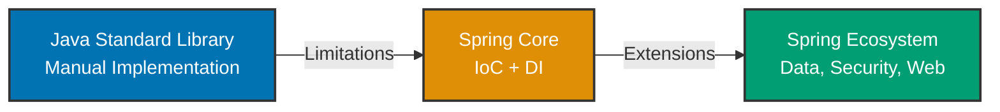

## Why This Matters

Spring Framework powers millions of enterprise applications worldwide, but production success requires understanding its foundation—not just auto-configuration magic. The Spring Core First principle ensures you master dependency injection, bean lifecycle, and configuration patterns before applying ecosystem extensions. This approach prevents common pitfalls like over-reliance on annotations, configuration chaos, and debugging nightmares when auto-configuration fails.

## Spring Core First Principle

Every guide in this series follows a three-stage progression:



### Stage 1: Java Baseline

Each guide starts with pure Java implementation showing manual dependency management, resource handling, and configuration. This establishes the problem domain and reveals why framework support matters.

**Example - Manual Dependency Injection:**

```java
// Manual wiring requires changing multiple files for new dependencies
public class OrderService {
    private final PaymentService paymentService;
    private final NotificationService notificationService;

    public OrderService() {
        // Hard-coded dependencies - changes require recompilation
        this.paymentService = new PaymentService();
        this.notificationService = new NotificationService();
    }
}

// Client code must know construction details
public class Main {
    public static void main(String[] args) {
        OrderService service = new OrderService();  // What dependencies does this need?
        service.processOrder(order);
    }
}
```

**Limitations:**

- Tight coupling makes testing difficult (can't mock dependencies)
- Constructor changes ripple through entire codebase
- No lifecycle management (when to create/destroy instances?)
- Configuration spread across multiple classes

### Stage 2: Spring Core Solution

Shows how Spring's IoC container and dependency injection solve baseline limitations using core abstractions: `ApplicationContext`, `@Configuration`, `@Bean`, `@Autowired`.

**Example - Spring Dependency Injection:**

```java
@Configuration
public class AppConfig {
    @Bean
    public PaymentService paymentService() {
        return new PaymentService();
    }

    @Bean
    public NotificationService notificationService() {
        return new NotificationService();
    }

    @Bean
    public OrderService orderService(PaymentService paymentService,
                                     NotificationService notificationService) {
        return new OrderService(paymentService, notificationService);
    }
}

// Service class - dependencies injected by Spring
public class OrderService {
    private final PaymentService paymentService;
    private final NotificationService notificationService;

    public OrderService(PaymentService paymentService,
                       NotificationService notificationService) {
        this.paymentService = paymentService;
        this.notificationService = notificationService;
    }
}

// Client code - Spring manages construction
public class Main {
    public static void main(String[] args) {
        ApplicationContext context = new AnnotationConfigApplicationContext(AppConfig.class);
        OrderService service = context.getBean(OrderService.class);  // Dependencies auto-wired
        service.processOrder(order);
    }
}
```

**Benefits:**

- Loose coupling enables testing with mock dependencies
- Configuration centralized in `AppConfig`
- Spring manages bean lifecycle (creation, destruction, scope)
- Constructor signature changes don't affect client code

### Stage 3: Spring Ecosystem Extensions

Demonstrates Spring Data, Spring Security, Spring Web, and other modules that build on Core's foundation. Each extension leverages the same IoC container and DI principles.

**Example - Spring Data JPA (builds on Spring Core):**

```java
@Configuration
@EnableJpaRepositories  // Activates Spring Data JPA repositories
public class DataConfig {
    @Bean
    public DataSource dataSource() {
        return new HikariDataSource(config);  // Still using @Bean from Core
    }

    @Bean
    public LocalContainerEntityManagerFactoryBean entityManagerFactory(DataSource dataSource) {
        // Spring Core manages JPA EntityManagerFactory lifecycle
        return new LocalContainerEntityManagerFactoryBean();
    }
}

// Repository interface - Spring Data generates implementation
public interface OrderRepository extends JpaRepository<Order, Long> {
    List<Order> findByCustomerId(Long customerId);  // Query method auto-generated
}

// Service uses repository as regular dependency
@Service
public class OrderService {
    private final OrderRepository orderRepository;  // Injected by Spring Core DI

    public OrderService(OrderRepository orderRepository) {
        this.orderRepository = orderRepository;
    }
}
```

**Key Insight**: Spring Data JPA uses Spring Core's bean management to instantiate repositories, apply transactions, and handle exceptions. Understanding Core reveals how ecosystem modules integrate.

## Production Patterns

Each guide demonstrates:

- **Error Handling**: `@ExceptionHandler`, try-with-resources, transaction rollback
- **Resource Management**: Connection pooling, bean destruction callbacks
- **Configuration**: Externalized properties, profile-specific config
- **Testing**: `@ContextConfiguration`, test slices, mock beans
- **Security**: Input validation, SQL injection prevention, authentication
- **Performance**: Caching, lazy initialization, connection pooling

## Trade-offs and When to Use

**Manual Java vs Spring Core:**

| Aspect               | Manual Java                | Spring Core                   |
| -------------------- | -------------------------- | ----------------------------- |
| Learning Curve       | Low (standard Java)        | Medium (IoC concepts)         |
| Boilerplate          | High (manual wiring)       | Low (@Bean declarations)      |
| Flexibility          | Total control              | Convention over configuration |
| Testing              | Difficult (tight coupling) | Easy (DI enables mocking)     |
| Lifecycle Management | Manual (complex)           | Automatic (container-managed) |

**When to Use Manual Java:**

- Simple utilities with no dependencies (e.g., `StringUtils`)
- Performance-critical code where Spring overhead matters
- Learning projects to understand dependency patterns

**When to Use Spring Core:**

- Enterprise applications with complex dependency graphs
- Applications requiring lifecycle management (startup/shutdown hooks)
- Projects needing testability and modularity
- When using Spring ecosystem modules (Data, Security, Web)

## Guide Structure

Each production guide follows this template:

1. **Why [Topic] Matters** - Production relevance and benefits
2. **Java Standard Library Baseline** - Manual implementation with limitations
3. **Spring Core Solution** - How Spring's IoC container solves the problem
4. **Spring Ecosystem Extensions** - Advanced modules building on Core
5. **Progression Diagram** - Visual representation of Java → Spring evolution
6. **Production Patterns** - Error handling, security, performance best practices
7. **Trade-offs and When to Use** - Decision criteria for approach selection
8. **Best Practices** - Actionable guidance with code examples
9. **See Also** - Related guides and Spring documentation

## Annotation Standards

All code examples maintain 1.0-2.25 annotation density per convention:

```java
@Configuration  // => Marks class as Spring configuration source
                // => Spring scans for @Bean methods during startup
public class AppConfig {

    @Bean  // => Registers method return value as bean in Spring container
           // => Bean name defaults to method name: "orderService"
           // => Spring manages lifecycle: creation, dependency injection, destruction
    public OrderService orderService(PaymentService paymentService) {
        // => Constructor injection: Spring injects paymentService bean automatically
        // => Ensures dependencies available before bean creation completes
        return new OrderService(paymentService);
    }
}
```

Annotations explain:

- **What Spring does**: Container behavior, lifecycle events, bean registration
- **Why it's used**: Solving specific production problems
- **When it happens**: Startup, runtime, or shutdown phases

Avoid obvious statements like `new X() // => Creates new instance`. Focus on non-obvious Spring behavior like singleton scope, proxy generation, and dependency resolution order.

## Prerequisites

**Required Knowledge:**

- **Java Fundamentals**: Interfaces, inheritance, generics, annotations
- **Java Collections**: List, Map, Set operations
- **Java I/O**: File handling, resource management, try-with-resources
- **Object-Oriented Design**: SOLID principles, design patterns

**Recommended Reading:**

- [Java In the Field](/en/learn/software-engineering/programming-languages/java/in-the-field/overview) - Java production patterns
- [Spring Framework Explanation](/en/learn/software-engineering/platform-web/tools/jvm-spring/overview) - Conceptual understanding
- [Spring By Example](/en/learn/software-engineering/platform-web/tools/jvm-spring/by-example/beginner) - Hands-on learning path

## Next Steps

Start with **Core Spring** guides to build foundation:

1. [Dependency Injection](/en/learn/software-engineering/platform-web/tools/jvm-spring/in-the-field/dependency-injection) - Master IoC container patterns
2. [Configuration](/en/learn/software-engineering/platform-web/tools/jvm-spring/in-the-field/configuration) - Java Config and @Configuration best practices
3. [Bean Lifecycle](/en/learn/software-engineering/platform-web/tools/jvm-spring/in-the-field/bean-lifecycle) - Understand initialization and destruction hooks

Then progress to **Data Access**, **Web & REST**, **Security**, and other categories based on your application needs.

## See Also

- [Spring Framework Reference](https://docs.spring.io/spring-framework/reference/) - Official documentation
- [Spring Best Practices](/en/learn/software-engineering/platform-web/tools/jvm-spring/in-the-field/best-practices) - Production patterns
- [Spring Anti-Patterns](/en/learn/software-engineering/platform-web/tools/jvm-spring/in-the-field/anti-patterns) - Common mistakes to avoid
