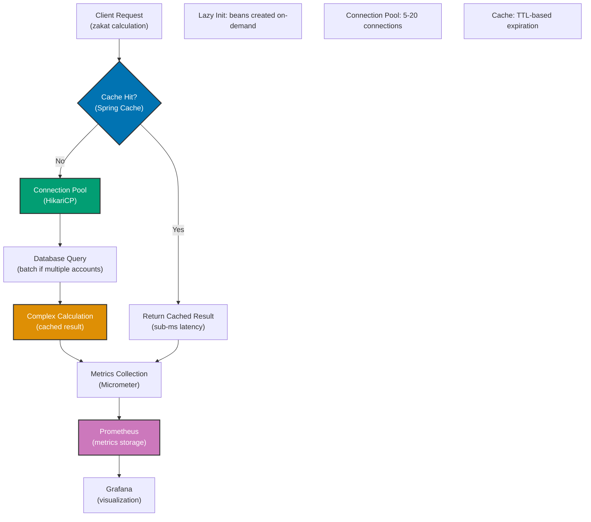

## Why Performance Tuning Matters

Production applications require optimal performance for user experience, resource efficiency, and cost control—minimizing response times, maximizing throughput, and reducing infrastructure costs. Unoptimized Spring applications exhibit slow startup times, excessive memory consumption, N+1 query problems, inefficient connection pooling, and CPU bottlenecks. In production systems processing thousands of concurrent zakat calculations requiring sub-100ms response times with minimal memory footprint, performance tuning strategies—lazy bean initialization, connection pooling optimization, caching strategies, and JVM tuning—eliminate performance bottlenecks that cause timeouts, OOM errors, and customer churn.

## Manual Profiling Baseline

Manual performance analysis requires explicit instrumentation and profiling:

```java
import java.lang.management.*;
import java.util.*;
import java.util.concurrent.ConcurrentHashMap;

// => Manual performance monitoring
public class ManualPerformanceMonitoring {

    // => Memory tracking: heap and non-heap usage
    // => PROBLEM: Manual tracking, no aggregation
    public static void logMemoryUsage() {
        MemoryMXBean memoryBean = ManagementFactory.getMemoryMXBean();

        // => Heap memory: object storage
        MemoryUsage heapUsage = memoryBean.getHeapMemoryUsage();
        long heapUsed = heapUsage.getUsed();
        long heapMax = heapUsage.getMax();
        double heapPercent = (heapUsed * 100.0) / heapMax;

        // => Non-heap memory: class metadata, thread stacks
        MemoryUsage nonHeapUsage = memoryBean.getNonHeapMemoryUsage();
        long nonHeapUsed = nonHeapUsage.getUsed();

        // => PROBLEM: No time-series data, just snapshot
        System.out.printf("Heap: %d MB / %d MB (%.1f%%)%n",
            heapUsed / 1024 / 1024, heapMax / 1024 / 1024, heapPercent);
        System.out.printf("Non-Heap: %d MB%n", nonHeapUsed / 1024 / 1024);
    }

    // => Thread monitoring: active threads, deadlocks
    // => PROBLEM: Manual inspection, no alerting
    public static void logThreadInfo() {
        ThreadMXBean threadBean = ManagementFactory.getThreadMXBean();

        // => Thread count: active threads
        int threadCount = threadBean.getThreadCount();
        int peakThreadCount = threadBean.getPeakThreadCount();

        // => Deadlock detection: blocked threads
        long[] deadlockedThreads = threadBean.findDeadlockedThreads();

        System.out.printf("Threads: %d (peak: %d)%n", threadCount, peakThreadCount);

        if (deadlockedThreads != null) {
            // => PROBLEM: Deadlock detected, but no recovery
            System.err.println("DEADLOCK DETECTED! Threads: " + Arrays.toString(deadlockedThreads));
        }
    }

    // => Execution time measurement
    // => PROBLEM: Manual timing, scattered across code
    public static long measureExecutionTime(Runnable task, String taskName) {
        long startTime = System.nanoTime();

        try {
            // => Execute task
            task.run();

        } finally {
            // => Calculate duration
            long endTime = System.nanoTime();
            long durationMs = (endTime - startTime) / 1_000_000;

            // => PROBLEM: No aggregation (min, max, avg, percentiles)
            System.out.printf("%s completed in %d ms%n", taskName, durationMs);

            return durationMs;
        }
    }
}

// => Unoptimized zakat calculation service
public class UnoptimizedZakatService {

    // => PROBLEM: Repository created for every request
    // => No connection pooling, no caching
    private ZakatRepository repository;

    // => Constructor: creates repository
    // => PROBLEM: Heavy object creation on every request
    public UnoptimizedZakatService() {
        this.repository = new ZakatRepository();
        System.out.println("Repository created: " + System.identityHashCode(repository));
    }

    // => Calculate zakat: inefficient database access
    public double calculateZakat(String accountId, double nisab) {
        // => PROBLEM: Database query for every calculation
        // => No caching, repeated queries
        double wealth = repository.getAccountWealth(accountId);

        // => PROBLEM: Complex calculation executed every time
        // => No result caching
        double zakatAmount = performComplexCalculation(wealth, nisab);

        return zakatAmount;
    }

    // => Complex calculation: CPU intensive
    // => PROBLEM: No caching, recalculated every time
    private double performComplexCalculation(double wealth, double nisab) {
        // => Simulate expensive calculation
        // => PROBLEM: O(n) complexity, no optimization
        double result = 0.0;
        for (int i = 0; i < 1000; i++) {
            result += Math.sqrt(wealth * nisab * i);
        }

        return wealth >= nisab ? wealth * 0.025 : 0.0;
    }

    // => Get multiple calculations: N+1 query problem
    // => PROBLEM: One query per account (N+1 queries)
    public List<Double> calculateZakatForAccounts(List<String> accountIds, double nisab) {
        List<Double> results = new ArrayList<>();

        for (String accountId : accountIds) {
            // => PROBLEM: Separate query for each account
            // => Database: 100 accounts = 100 queries
            double zakat = calculateZakat(accountId, nisab);
            results.add(zakat);
        }

        return results;
    }
}

// => Mock repository: simulates database access
class ZakatRepository {
    // => PROBLEM: No connection pooling
    // => Creates new connection for every query
    public double getAccountWealth(String accountId) {
        // => Simulate database query: 50ms latency
        try {
            Thread.sleep(50);
        } catch (InterruptedException e) {
            Thread.currentThread().interrupt();
        }

        // => PROBLEM: No caching, same query repeated
        return 100000.0;
    }

    // => Batch query: not used in unoptimized service
    public Map<String, Double> getAccountWealthBatch(List<String> accountIds) {
        Map<String, Double> results = new ConcurrentHashMap<>();
        for (String accountId : accountIds) {
            results.put(accountId, 100000.0);
        }
        return results;
    }
}

// => Usage: demonstrate performance issues
public class Application {

    public static void main(String[] args) {
        // => Measure memory before
        ManualPerformanceMonitoring.logMemoryUsage();
        ManualPerformanceMonitoring.logThreadInfo();

        // => Create service: PROBLEM: Heavy initialization
        long serviceCreationTime = ManualPerformanceMonitoring.measureExecutionTime(
            () -> new UnoptimizedZakatService(),
            "Service creation"
        );

        UnoptimizedZakatService service = new UnoptimizedZakatService();

        // => Single calculation: PROBLEM: No caching
        long calculationTime = ManualPerformanceMonitoring.measureExecutionTime(
            () -> service.calculateZakat("ACC001", 85.0),
            "Single calculation"
        );

        // => Batch calculation: PROBLEM: N+1 queries
        List<String> accountIds = Arrays.asList("ACC001", "ACC002", "ACC003", "ACC004", "ACC005");
        long batchTime = ManualPerformanceMonitoring.measureExecutionTime(
            () -> service.calculateZakatForAccounts(accountIds, 85.0),
            "Batch calculation (5 accounts)"
        );

        // => Measure memory after
        ManualPerformanceMonitoring.logMemoryUsage();
    }
}
```

**Limitations:**

- **No lazy initialization**: All beans created at startup (slow startup)
- **No connection pooling**: New connection per query (latency, resource exhaustion)
- **No caching**: Repeated queries and calculations (database load, CPU waste)
- **N+1 query problem**: One query per entity (network overhead, slow responses)
- **Manual profiling**: No aggregation, percentiles, or time-series data
- **No monitoring integration**: No Prometheus, Grafana, or APM tools

## Spring Boot Performance Optimization

Spring Boot provides comprehensive performance optimization strategies:

### Lazy Bean Initialization

```java
import org.springframework.boot.SpringApplication;
import org.springframework.boot.autoconfigure.SpringBootApplication;
import org.springframework.context.annotation.Bean;
import org.springframework.context.annotation.Lazy;
import org.springframework.stereotype.Service;

// => Spring Boot application
// => @SpringBootApplication: auto-configuration + component scan
@SpringBootApplication
public class ZakatApplication {

    public static void main(String[] args) {
        SpringApplication app = new SpringApplication(ZakatApplication.class);

        // => Enable lazy initialization: beans created on first use
        // => BENEFIT: Fast startup (only essential beans initialized)
        // => Trade-off: First request slower (lazy beans initialized then)
        app.setLazyInitialization(true);

        app.run(args);
    }
}

// => Service with lazy initialization
// => @Lazy: delays bean creation until first use
@Service
@Lazy
public class ExpensiveZakatCalculator {

    // => Constructor: heavy initialization
    // => BENEFIT: Not called during startup if lazy
    public ExpensiveZakatCalculator() {
        System.out.println("ExpensiveZakatCalculator initialized at: " + System.currentTimeMillis());
        // => Simulate expensive initialization (load ML model, connect to database)
        try {
            Thread.sleep(2000);
        } catch (InterruptedException e) {
            Thread.currentThread().interrupt();
        }
    }

    public double calculateZakat(double wealth, double nisab) {
        return wealth >= nisab ? wealth * 0.025 : 0.0;
    }
}

// => Service with eager initialization (default)
// => @Lazy(false): forces eager initialization
@Service
@Lazy(false)
public class EssentialZakatService {

    // => Constructor: initialized at startup
    // => Use for: critical beans, health checks, startup validation
    public EssentialZakatService() {
        System.out.println("EssentialZakatService initialized at startup");
    }

    public void validateConfiguration() {
        // => Startup validation: fail fast if misconfigured
        System.out.println("Configuration validated");
    }
}
```

### Connection Pooling with HikariCP

```java
import com.zaxxer.hikari.HikariConfig;
import com.zaxxer.hikari.HikariDataSource;
import org.springframework.context.annotation.Bean;
import org.springframework.context.annotation.Configuration;
import javax.sql.DataSource;

// => Database connection pooling configuration
@Configuration
public class DatabaseConfig {

    // => HikariCP: high-performance connection pool
    // => Spring Boot: auto-configures HikariCP by default
    @Bean
    public DataSource dataSource() {
        HikariConfig config = new HikariConfig();

        // => Database connection details
        config.setJdbcUrl("jdbc:postgresql://localhost:5432/zakatdb");
        config.setUsername("zakat_user");
        config.setPassword("zakat_password");

        // => Pool size: number of connections
        // => minimum-idle: minimum connections kept ready
        // => BENEFIT: Connections ready immediately (no creation latency)
        config.setMinimumIdle(5);

        // => maximum-pool-size: maximum connections
        // => Trade-off: Higher = more concurrency, more memory
        // => Rule of thumb: 10 connections per database server core
        config.setMaximumPoolSize(20);

        // => connection-timeout: max wait for connection
        // => BENEFIT: Fail fast if pool exhausted (no infinite wait)
        config.setConnectionTimeout(30000);  // 30 seconds

        // => idle-timeout: max idle time before connection closed
        // => BENEFIT: Release idle connections, reduce database load
        config.setIdleTimeout(600000);  // 10 minutes

        // => max-lifetime: max connection lifetime
        // => BENEFIT: Prevents stale connections, handles database restarts
        config.setMaxLifetime(1800000);  // 30 minutes

        // => leak-detection-threshold: detect connection leaks
        // => BENEFIT: Logs connections not returned to pool
        config.setLeakDetectionThreshold(60000);  // 60 seconds

        // => Connection test query: validates connection health
        config.setConnectionTestQuery("SELECT 1");

        return new HikariDataSource(config);
    }
}
```

### Caching with Spring Cache

```java
import org.springframework.cache.annotation.*;
import org.springframework.cache.CacheManager;
import org.springframework.cache.concurrent.ConcurrentMapCacheManager;
import org.springframework.context.annotation.Bean;
import org.springframework.context.annotation.Configuration;
import org.springframework.stereotype.Service;

// => Spring Cache configuration
@Configuration
@EnableCaching
public class CacheConfig {

    // => CacheManager: manages cache instances
    // => ConcurrentMapCacheManager: in-memory cache (development/testing)
    // => Production: use Redis, Caffeine, or distributed cache
    @Bean
    public CacheManager cacheManager() {
        // => Define cache names
        return new ConcurrentMapCacheManager("zakatCalculations", "accountWealth");
    }
}

// => Service with caching
@Service
public class CachedZakatService {

    private final ZakatRepository repository;

    public CachedZakatService(ZakatRepository repository) {
        this.repository = repository;
    }

    // => @Cacheable: caches method result
    // => Spring: stores result in cache, returns cached value on subsequent calls
    // => Key: accountId (cache key)
    // => BENEFIT: Database query only on cache miss
    @Cacheable(value = "accountWealth", key = "#accountId")
    public double getAccountWealth(String accountId) {
        System.out.println("Cache miss: querying database for " + accountId);

        // => Database query: expensive operation
        // => Only executed on cache miss
        return repository.getAccountWealth(accountId);
    }

    // => @Cacheable with complex key
    // => Key: combination of accountId and nisab
    @Cacheable(value = "zakatCalculations", key = "#accountId + '-' + #nisab")
    public double calculateZakat(String accountId, double nisab) {
        System.out.println("Cache miss: calculating zakat for " + accountId);

        // => Get wealth: uses cache if available
        double wealth = getAccountWealth(accountId);

        // => Expensive calculation: only on cache miss
        return performComplexCalculation(wealth, nisab);
    }

    // => @CacheEvict: removes entry from cache
    // => Used when cached data becomes stale
    @CacheEvict(value = "accountWealth", key = "#accountId")
    public void updateAccountWealth(String accountId, double newWealth) {
        System.out.println("Evicting cache for " + accountId);

        // => Update database: invalidates cached value
        repository.updateAccountWealth(accountId, newWealth);
    }

    // => @CacheEvict with allEntries: clears entire cache
    @CacheEvict(value = "zakatCalculations", allEntries = true)
    public void clearAllCalculations() {
        System.out.println("Clearing all cached calculations");
    }

    // => @CachePut: updates cache without skipping method
    // => Used when method must execute but result should be cached
    @CachePut(value = "accountWealth", key = "#accountId")
    public double refreshAccountWealth(String accountId) {
        System.out.println("Refreshing cache for " + accountId);

        // => Always executes, updates cache with new value
        return repository.getAccountWealth(accountId);
    }

    private double performComplexCalculation(double wealth, double nisab) {
        // => Expensive calculation
        double result = 0.0;
        for (int i = 0; i < 1000; i++) {
            result += Math.sqrt(wealth * nisab * i);
        }
        return wealth >= nisab ? wealth * 0.025 : 0.0;
    }
}

// => Repository with batch query optimization
@org.springframework.stereotype.Repository
public class OptimizedZakatRepository {

    // => Batch query: solves N+1 problem
    // => BENEFIT: Single query instead of N queries
    public Map<String, Double> getAccountWealthBatch(List<String> accountIds) {
        System.out.println("Batch query for " + accountIds.size() + " accounts");

        // => Single database query for all accounts
        // => BENEFIT: Reduced network round trips, database load
        Map<String, Double> results = new java.util.concurrent.ConcurrentHashMap<>();

        // => Mock batch query (production: use JPA batch fetch)
        for (String accountId : accountIds) {
            results.put(accountId, 100000.0);
        }

        return results;
    }
}
```

### Spring Boot Actuator for Monitoring

```java
import io.micrometer.core.instrument.*;
import org.springframework.stereotype.Service;

// => Service with metrics
@Service
public class MonitoredZakatService {

    private final MeterRegistry meterRegistry;
    private final Counter calculationCounter;
    private final Timer calculationTimer;
    private final Gauge wealthGauge;

    public MonitoredZakatService(MeterRegistry meterRegistry) {
        this.meterRegistry = meterRegistry;

        // => Counter: tracks total calculations
        // => BENEFIT: Prometheus scrapes metrics, Grafana visualizes
        this.calculationCounter = Counter.builder("zakat.calculations.total")
            .description("Total zakat calculations performed")
            .tag("type", "calculation")
            .register(meterRegistry);

        // => Timer: tracks calculation duration
        // => BENEFIT: Percentiles (p50, p95, p99), histogram
        this.calculationTimer = Timer.builder("zakat.calculation.duration")
            .description("Zakat calculation duration")
            .tag("operation", "calculate")
            .register(meterRegistry);

        // => Gauge: tracks current value (wealth total)
        // => BENEFIT: Real-time monitoring of business metrics
        AtomicDouble totalWealth = new AtomicDouble(0.0);
        this.wealthGauge = Gauge.builder("zakat.wealth.total", totalWealth, AtomicDouble::get)
            .description("Total wealth under management")
            .register(meterRegistry);
    }

    public double calculateZakat(String accountId, double wealth, double nisab) {
        // => Increment counter: tracks invocation count
        calculationCounter.increment();

        // => Measure duration: tracks execution time
        return calculationTimer.record(() -> {
            // => Business logic
            double zakat = wealth >= nisab ? wealth * 0.025 : 0.0;

            // => Record custom metric: distribution summary
            DistributionSummary wealthSummary = DistributionSummary.builder("zakat.wealth")
                .description("Wealth distribution")
                .baseUnit("USD")
                .register(meterRegistry);

            wealthSummary.record(wealth);

            return zakat;
        });
    }
}
```

**Benefits:**

- **Lazy initialization**: Fast startup (only essential beans loaded)
- **Connection pooling**: Reused connections (no creation latency, resource efficiency)
- **Caching**: Reduced database load (cached results, faster responses)
- **Batch queries**: Solves N+1 problem (single query for multiple entities)
- **Metrics integration**: Prometheus/Grafana monitoring (percentiles, histograms)
- **Spring Boot Actuator**: Built-in health checks, metrics, profiling

## Performance Optimization Flow Diagram



## Production Patterns

### JVM Tuning for Spring Boot

```bash
# => JVM options for production Spring Boot application
# => BENEFIT: Optimized garbage collection, memory management

# Heap size: initial and maximum
# => -Xms: initial heap (set equal to -Xmx for stable performance)
# => -Xmx: maximum heap (rule of thumb: 50-75% of container memory)
-Xms512m -Xmx512m

# Garbage collector: G1GC (default Java 11+)
# => -XX:+UseG1GC: low-latency garbage collection
# => BENEFIT: Predictable pause times (<100ms)
-XX:+UseG1GC

# G1GC tuning
# => MaxGCPauseMillis: target max GC pause time
-XX:MaxGCPauseMillis=100

# GC logging: monitor garbage collection
# => BENEFIT: Identify GC bottlenecks, tune heap size
-Xlog:gc*:file=/var/log/gc.log:time,uptime:filecount=5,filesize=10M

# String deduplication: reduce memory for duplicate strings
# => BENEFIT: Lower memory usage (common in web apps)
-XX:+UseStringDeduplication

# Metaspace: class metadata storage (Spring Boot loads many classes)
# => -XX:MetaspaceSize: initial metaspace
# => -XX:MaxMetaspaceSize: maximum metaspace
-XX:MetaspaceSize=256m -XX:MaxMetaspaceSize=512m

# JIT compiler: optimize hot methods
# => -XX:+TieredCompilation: multi-level JIT compilation
-XX:+TieredCompilation

# Performance options
# => -XX:+UseCompressedOops: compress object pointers (heap <32GB)
# => BENEFIT: Reduced memory footprint
-XX:+UseCompressedOops

# Startup optimization
# => -XX:+TieredCompilation: fast startup with C1 compiler
# => -XX:TieredStopAtLevel=1: stop at C1 (for dev/test)
-XX:TieredStopAtLevel=1

# AppCDS: application class-data sharing (faster startup)
# => BENEFIT: Reduced startup time (50-70% improvement)
# Step 1: Generate class list
java -Xshare:off -XX:DumpLoadedClassList=app-classes.lst -jar app.jar

# Step 2: Create AppCDS archive
java -Xshare:dump -XX:SharedClassListFile=app-classes.lst -XX:SharedArchiveFile=app-cds.jsa

# Step 3: Use AppCDS archive
-Xshare:on -XX:SharedArchiveFile=app-cds.jsa
```

### Async Processing for Non-Blocking Operations

```java
import org.springframework.scheduling.annotation.Async;
import org.springframework.scheduling.annotation.EnableAsync;
import org.springframework.stereotype.Service;
import java.util.concurrent.CompletableFuture;

// => Enable async processing
@org.springframework.context.annotation.Configuration
@EnableAsync
public class AsyncConfig {

    // => TaskExecutor: thread pool for async operations
    @org.springframework.context.annotation.Bean
    public org.springframework.scheduling.concurrent.ThreadPoolTaskExecutor taskExecutor() {
        org.springframework.scheduling.concurrent.ThreadPoolTaskExecutor executor =
            new org.springframework.scheduling.concurrent.ThreadPoolTaskExecutor();

        // => Core pool size: minimum threads
        executor.setCorePoolSize(10);

        // => Max pool size: maximum threads
        executor.setMaxPoolSize(50);

        // => Queue capacity: pending tasks
        executor.setQueueCapacity(100);

        executor.setThreadNamePrefix("async-zakat-");
        executor.initialize();

        return executor;
    }
}

// => Async service: non-blocking operations
@Service
public class AsyncZakatService {

    private final ZakatRepository repository;

    public AsyncZakatService(ZakatRepository repository) {
        this.repository = repository;
    }

    // => @Async: executes in separate thread
    // => BENEFIT: Non-blocking, higher throughput
    @Async
    public CompletableFuture<Double> calculateZakatAsync(String accountId, double nisab) {
        System.out.println("Calculating zakat asynchronously: " + accountId +
            " (thread: " + Thread.currentThread().getName() + ")");

        // => Expensive operation: runs in background
        double wealth = repository.getAccountWealth(accountId);
        double zakat = wealth >= nisab ? wealth * 0.025 : 0.0;

        // => Return CompletableFuture: non-blocking result
        return CompletableFuture.completedFuture(zakat);
    }

    // => Parallel processing: multiple async operations
    public CompletableFuture<Double> calculateTotalZakatAsync(
            List<String> accountIds, double nisab) {

        // => Start all calculations in parallel
        List<CompletableFuture<Double>> futures = accountIds.stream()
            .map(accountId -> calculateZakatAsync(accountId, nisab))
            .collect(java.util.stream.Collectors.toList());

        // => Combine results: wait for all futures
        return CompletableFuture.allOf(futures.toArray(new CompletableFuture[0]))
            .thenApply(v -> futures.stream()
                .map(CompletableFuture::join)
                .reduce(0.0, Double::sum)
            );
    }
}
```

### Database Query Optimization

```java
import org.springframework.data.jpa.repository.Query;
import org.springframework.data.jpa.repository.JpaRepository;
import org.springframework.stereotype.Repository;
import java.util.List;

// => JPA Repository with optimized queries
@Repository
public interface OptimizedZakatAccountRepository extends JpaRepository<ZakatAccount, Long> {

    // => Batch fetch: solves N+1 problem
    // => @Query with JOIN FETCH: loads associations in single query
    @Query("SELECT a FROM ZakatAccount a JOIN FETCH a.payments WHERE a.accountId IN :accountIds")
    List<ZakatAccount> findByAccountIdsWithPayments(List<String> accountIds);

    // => Projection: fetch only needed fields
    // => BENEFIT: Reduced network transfer, memory usage
    @Query("SELECT a.accountId, a.wealth FROM ZakatAccount a WHERE a.wealth > :minWealth")
    List<Object[]> findAccountIdsWithWealth(double minWealth);

    // => Native query: optimized SQL for specific database
    @Query(value = "SELECT * FROM zakat_account WHERE wealth >= :nisab ORDER BY wealth DESC LIMIT :limit",
        nativeQuery = true)
    List<ZakatAccount> findTopAccountsByWealth(double nisab, int limit);
}
```

## Trade-offs and When to Use

| Optimization Strategy | Performance Gain | Complexity | Memory Impact | When to Use                             |
| --------------------- | ---------------- | ---------- | ------------- | --------------------------------------- |
| Lazy Initialization   | High (startup)   | Low        | Low           | Always (except critical beans)          |
| Connection Pooling    | Very High        | Low        | Medium        | Always (production databases)           |
| Caching (in-memory)   | Very High        | Low        | High          | Read-heavy workloads (>70% reads)       |
| Caching (distributed) | High             | Medium     | Low           | Microservices, horizontal scaling       |
| Batch Queries         | Very High        | Medium     | Low           | N+1 query problems                      |
| Async Processing      | High             | Medium     | Medium        | Non-blocking operations, parallel tasks |
| JVM Tuning            | Medium           | High       | N/A           | High-throughput, low-latency systems    |
| AppCDS                | High (startup)   | Medium     | Low           | Containerized apps, rapid scaling       |

**When to Use Lazy Initialization:**

- Fast startup required (microservices, serverless)
- Not all beans needed immediately
- Development environments

**When to Use Connection Pooling:**

- **Production databases** (always)
- High concurrent load (>10 req/sec)
- Minimize connection creation overhead

**When to Use Caching:**

- Read-heavy workloads (>70% reads)
- Expensive calculations or queries
- Immutable or slowly-changing data

**When to Use Async Processing:**

- Non-blocking operations (email, notifications)
- Parallel data fetching
- High-throughput requirements (>1K req/sec)

**When to Use JVM Tuning:**

- Low-latency requirements (<100ms p99)
- High memory usage (>4GB heap)
- Garbage collection bottlenecks

## Best Practices

**1. Enable Lazy Initialization for Non-Critical Beans**

```java
// ✅ Lazy by default (Spring Boot 2.2+)
spring.main.lazy-initialization=true

// ✅ Eager for critical beans
@Service
@Lazy(false)
public class EssentialService { }
```

**2. Configure Connection Pooling**

```java
// ✅ HikariCP configuration (application.yml)
spring:
  datasource:
    hikari:
      minimum-idle: 5
      maximum-pool-size: 20
      connection-timeout: 30000
      idle-timeout: 600000
```

**3. Use Caching for Expensive Operations**

```java
// ✅ Cache expensive calculations
@Cacheable(value = "zakatCalculations", key = "#accountId")
public double calculateZakat(String accountId) { }

// ✅ Evict stale cache
@CacheEvict(value = "zakatCalculations", key = "#accountId")
public void updateAccount(String accountId) { }
```

**4. Monitor Performance Metrics**

```java
// ✅ Spring Boot Actuator endpoints
management:
  endpoints:
    web:
      exposure:
        include: health,metrics,prometheus

// Access metrics at /actuator/metrics
// Prometheus scrapes /actuator/prometheus
```

**5. Tune JVM for Production**

```bash
# ✅ Production JVM options
-Xms512m -Xmx512m
-XX:+UseG1GC
-XX:MaxGCPauseMillis=100
-Xlog:gc*:file=gc.log
```

## See Also

- Spring Boot Actuator - Monitoring and metrics
- [Caching Strategies](/en/learn/software-engineering/platform-web/tools/jvm-spring/in-the-field/caching) - Redis, Caffeine integration
- [Async Processing](/en/learn/software-engineering/platform-web/tools/jvm-spring/in-the-field/async-processing) - @Async and CompletableFuture
- [Database Connection Pooling](/en/learn/software-engineering/platform-web/tools/jvm-spring/in-the-field/connection-pooling) - HikariCP optimization
- [Spring Data JPA](/en/learn/software-engineering/platform-web/tools/jvm-spring/in-the-field/spring-data-jpa) - Query optimization
