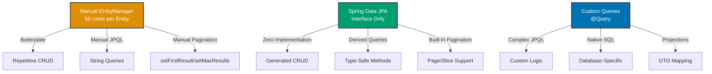

## Why Spring Data JPA Matters

JPA provides object-relational mapping for database access. Manual EntityManager usage requires repetitive CRUD code for every entity. In production systems with dozens of entities and hundreds of queries, Spring Data JPA generates repository implementations automatically—reducing boilerplate from 50 lines per entity to a single interface.

## JPA EntityManager Baseline

Manual EntityManager requires explicit JPQL for every operation:

```java
import javax.persistence.*;
import java.util.List;

// => ZakatAccount entity: JPA entity mapped to database table
@Entity  // => Marks class as JPA entity
@Table(name = "zakat_accounts")  // => Maps to zakat_accounts table
public class ZakatAccount {

    @Id  // => Primary key field
    @GeneratedValue(strategy = GenerationType.IDENTITY)  // => Auto-generated ID
    private Long id;

    @Column(name = "account_number", nullable = false, unique = true)
    // => Maps to account_number column, NOT NULL, UNIQUE constraint
    private String accountNumber;

    @Column(name = "owner_name", nullable = false)
    private String ownerName;

    @Column(name = "balance", nullable = false)
    // => BigDecimal for precise decimal calculations
    private BigDecimal balance;

    @Version  // => Optimistic locking: prevents concurrent modification
    private Long version;

    // => Constructors, getters, setters omitted for brevity
}

// => Repository: manual EntityManager operations
public class ZakatAccountRepository {

    @PersistenceContext  // => Injects EntityManager from persistence context
    private EntityManager entityManager;  // => EntityManager: JPA API for database operations

    // => Save new account: manual persist
    public ZakatAccount save(ZakatAccount account) {
        // => persist(): inserts new entity into database
        // => Entity must be in transient state (no ID)
        entityManager.persist(account);
        // => After persist: entity in managed state, ID populated
        return account;
    }

    // => Update existing account: manual merge
    public ZakatAccount update(ZakatAccount account) {
        // => merge(): updates existing entity in database
        // => Returns managed copy of entity
        // => Original entity remains detached
        return entityManager.merge(account);
    }

    // => Find account by ID: manual find
    public ZakatAccount findById(Long id) {
        // => find(): retrieves entity by primary key
        // => Returns null if not found (not Optional)
        // => Entity in managed state after retrieval
        ZakatAccount account = entityManager.find(ZakatAccount.class, id);
        if (account == null) {
            throw new EntityNotFoundException("Account not found: " + id);
        }
        return account;
    }

    // => Find all accounts: manual JPQL query
    public List<ZakatAccount> findAll() {
        // => JPQL query: object-oriented query language
        // => SELECT a FROM ZakatAccount a (not SELECT * FROM zakat_accounts)
        // => Returns List<ZakatAccount>, not ResultSet
        TypedQuery<ZakatAccount> query = entityManager.createQuery(
            "SELECT a FROM ZakatAccount a",  // => JPQL: entity-based query
            ZakatAccount.class  // => Result type
        );
        // => getResultList(): executes query, returns all results
        return query.getResultList();
    }

    // => Find accounts by owner: manual JPQL with parameter
    public List<ZakatAccount> findByOwnerName(String ownerName) {
        // => JPQL with named parameter: :ownerName
        TypedQuery<ZakatAccount> query = entityManager.createQuery(
            "SELECT a FROM ZakatAccount a WHERE a.ownerName = :ownerName",
            ZakatAccount.class
        );
        // => setParameter(): binds parameter value
        query.setParameter("ownerName", ownerName);
        return query.getResultList();
    }

    // => Find accounts with minimum balance: manual JPQL with comparison
    public List<ZakatAccount> findByMinimumBalance(BigDecimal minBalance) {
        // => JPQL comparison: >= for BigDecimal
        TypedQuery<ZakatAccount> query = entityManager.createQuery(
            "SELECT a FROM ZakatAccount a WHERE a.balance >= :minBalance ORDER BY a.balance DESC",
            ZakatAccount.class
        );
        query.setParameter("minBalance", minBalance);
        return query.getResultList();
    }

    // => Count accounts: manual JPQL count query
    public long count() {
        // => JPQL COUNT: returns Long (not int)
        TypedQuery<Long> query = entityManager.createQuery(
            "SELECT COUNT(a) FROM ZakatAccount a",
            Long.class
        );
        // => getSingleResult(): expects exactly one result
        return query.getSingleResult();
    }

    // => Delete account: manual remove
    public void delete(Long id) {
        // => Find entity first: remove() requires managed entity
        ZakatAccount account = findById(id);
        // => remove(): deletes entity from database
        // => Entity must be in managed state
        entityManager.remove(account);
    }

    // => Pagination: manual JPQL with setFirstResult/setMaxResults
    public List<ZakatAccount> findAll(int page, int size) {
        TypedQuery<ZakatAccount> query = entityManager.createQuery(
            "SELECT a FROM ZakatAccount a ORDER BY a.id",
            ZakatAccount.class
        );
        // => setFirstResult(): offset (0-indexed)
        query.setFirstResult(page * size);
        // => setMaxResults(): limit (number of results)
        query.setMaxResults(size);
        return query.getResultList();
    }
}
```

**Limitations:**

- **Boilerplate**: 50+ lines per entity for basic CRUD
- **Repetitive**: Same patterns for every entity (save, findById, findAll)
- **Manual pagination**: setFirstResult/setMaxResults every time
- **No derived queries**: Can't generate queries from method names
- **Type-unsafe strings**: JPQL as strings, no compile-time validation

## Spring Data JPA Repository

Spring Data JPA generates repository implementations automatically:

```java
import org.springframework.data.jpa.repository.JpaRepository;
import org.springframework.data.jpa.repository.Query;
import org.springframework.data.repository.query.Param;

// => Repository interface: Spring Data generates implementation
// => JpaRepository<Entity, ID>: generic repository with CRUD methods
public interface ZakatAccountRepository extends JpaRepository<ZakatAccount, Long> {
    // => No implementation needed: Spring Data generates at runtime

    // => Inherited methods from JpaRepository (automatic):
    // - save(entity): insert or update
    // - findById(id): find by primary key, returns Optional
    // - findAll(): find all entities
    // - count(): count all entities
    // - delete(entity): delete entity
    // - existsById(id): check existence

    // => Derived query methods: Spring Data generates JPQL from method name
    // => Method name pattern: findBy[Property][Operator]
    List<ZakatAccount> findByOwnerName(String ownerName);
    // => Generated JPQL: SELECT a FROM ZakatAccount a WHERE a.ownerName = ?1

    // => Comparison operators: GreaterThanEqual
    List<ZakatAccount> findByBalanceGreaterThanEqual(BigDecimal minBalance);
    // => Generated JPQL: SELECT a FROM ZakatAccount a WHERE a.balance >= ?1

    // => Multiple conditions: And operator
    List<ZakatAccount> findByOwnerNameAndBalanceGreaterThan(String owner, BigDecimal balance);
    // => Generated JPQL: SELECT a FROM ZakatAccount a WHERE a.ownerName = ?1 AND a.balance > ?2

    // => Sorting: OrderBy clause
    List<ZakatAccount> findByBalanceGreaterThanEqualOrderByBalanceDesc(BigDecimal minBalance);
    // => Generated JPQL: SELECT a FROM ZakatAccount a WHERE a.balance >= ?1 ORDER BY a.balance DESC

    // => Pattern matching: Containing operator (LIKE %value%)
    List<ZakatAccount> findByOwnerNameContaining(String namePart);
    // => Generated JPQL: SELECT a FROM ZakatAccount a WHERE a.ownerName LIKE %?1%

    // => Top N results: First/Top keyword
    List<ZakatAccount> findTop10ByBalanceGreaterThanOrderByBalanceDesc(BigDecimal minBalance);
    // => Generated JPQL with LIMIT: top 10 results ordered by balance

    // => Existence check: exists keyword
    boolean existsByAccountNumber(String accountNumber);
    // => Generated JPQL: SELECT COUNT(a) > 0 FROM ZakatAccount a WHERE a.accountNumber = ?1

    // => Count query: count keyword
    long countByBalanceGreaterThan(BigDecimal minBalance);
    // => Generated JPQL: SELECT COUNT(a) FROM ZakatAccount a WHERE a.balance > ?1

    // => Delete query: delete keyword
    void deleteByAccountNumber(String accountNumber);
    // => Generated JPQL: DELETE FROM ZakatAccount a WHERE a.accountNumber = ?1
}

// => Service: uses repository with zero implementation
@Service  // => Spring-managed service bean
@Transactional  // => All methods in transaction
public class ZakatAccountService {

    private final ZakatAccountRepository accountRepository;

    // => Constructor injection: Spring provides generated repository implementation
    public ZakatAccountService(ZakatAccountRepository accountRepository) {
        this.accountRepository = accountRepository;
    }

    // => Create account: automatic save
    public ZakatAccount createAccount(String accountNumber, String ownerName, BigDecimal initialBalance) {
        // => Creates new entity (transient state)
        ZakatAccount account = new ZakatAccount();
        account.setAccountNumber(accountNumber);
        account.setOwnerName(ownerName);
        account.setBalance(initialBalance);

        // => save(): Spring Data generates persist or merge based on ID
        // => If ID is null: persist (INSERT)
        // => If ID exists: merge (UPDATE)
        return accountRepository.save(account);
    }

    // => Find account by ID: automatic findById
    public ZakatAccount getAccount(Long id) {
        // => findById(): returns Optional<ZakatAccount>
        // => orElseThrow(): throws exception if not found
        return accountRepository.findById(id)
            .orElseThrow(() -> new EntityNotFoundException("Account not found: " + id));
    }

    // => Find accounts by owner: derived query method
    public List<ZakatAccount> getAccountsByOwner(String ownerName) {
        // => Spring Data generates query from method name
        return accountRepository.findByOwnerName(ownerName);
    }

    // => Find accounts above nisab threshold: derived query with sorting
    public List<ZakatAccount> getAccountsAboveNisab(BigDecimal nisab) {
        // => Derived query: GreaterThanEqual + OrderBy
        return accountRepository.findByBalanceGreaterThanEqualOrderByBalanceDesc(nisab);
    }

    // => Check account exists: derived query
    public boolean accountExists(String accountNumber) {
        // => Spring Data generates existence check
        return accountRepository.existsByAccountNumber(accountNumber);
    }

    // => Update balance: automatic save (merge)
    public void updateBalance(Long accountId, BigDecimal newBalance) {
        // => Find account: returns Optional
        ZakatAccount account = getAccount(accountId);
        // => Modify managed entity
        account.setBalance(newBalance);
        // => save(): Spring Data generates UPDATE
        // => ID exists, so merge() used instead of persist()
        accountRepository.save(account);
    }

    // => Delete account: automatic delete
    public void deleteAccount(Long id) {
        // => deleteById(): Spring Data generates DELETE
        // => Throws EmptyResultDataAccessException if not found
        accountRepository.deleteById(id);
    }
}
```

**Benefits:**

- **Zero boilerplate**: No implementation needed for basic CRUD
- **Derived queries**: Generate queries from method names
- **Type safety**: Method names validated at compile time (via proxying)
- **Automatic pagination**: Built-in pagination support
- **Optional support**: findById returns Optional, no null checks

## Custom Queries with @Query

Complex queries require custom JPQL or native SQL:

```java
public interface ZakatAccountRepository extends JpaRepository<ZakatAccount, Long> {

    // => Custom JPQL query: @Query annotation
    @Query("SELECT a FROM ZakatAccount a WHERE a.balance >= :nisab AND a.balance < :limit")
    // => @Param: binds method parameter to named parameter in JPQL
    List<ZakatAccount> findAccountsInRange(
        @Param("nisab") BigDecimal nisab,
        @Param("limit") BigDecimal limit
    );

    // => Aggregation query: SUM function
    @Query("SELECT SUM(a.balance) FROM ZakatAccount a WHERE a.ownerName = :owner")
    // => Returns BigDecimal: sum of balances
    BigDecimal getTotalBalanceForOwner(@Param("owner") String ownerName);

    // => Native SQL query: nativeQuery = true
    @Query(value = "SELECT * FROM zakat_accounts WHERE balance >= ?1 ORDER BY balance DESC LIMIT ?2",
           nativeQuery = true)
    // => Native SQL: database-specific syntax (PostgreSQL LIMIT)
    // => Returns List<ZakatAccount>: Spring Data maps to entity
    List<ZakatAccount> findTopAccountsNative(BigDecimal minBalance, int limit);

    // => Update query: @Modifying annotation
    @Modifying  // => Required for UPDATE/DELETE queries
    @Query("UPDATE ZakatAccount a SET a.balance = a.balance + :amount WHERE a.id = :id")
    // => Returns int: number of affected rows
    int incrementBalance(@Param("id") Long id, @Param("amount") BigDecimal amount);

    // => Delete query: @Modifying annotation
    @Modifying  // => Required for DELETE queries
    @Query("DELETE FROM ZakatAccount a WHERE a.balance < :threshold")
    // => Bulk delete: removes all accounts below threshold
    int deleteAccountsBelowThreshold(@Param("threshold") BigDecimal threshold);

    // => Join query: fetch related entities
    @Query("SELECT DISTINCT a FROM ZakatAccount a LEFT JOIN FETCH a.transactions WHERE a.id = :id")
    // => LEFT JOIN FETCH: eagerly loads transactions collection
    // => DISTINCT: prevents duplicate rows from join
    Optional<ZakatAccount> findByIdWithTransactions(@Param("id") Long id);

    // => Projection query: select specific columns
    @Query("SELECT a.accountNumber, a.balance FROM ZakatAccount a WHERE a.balance >= :nisab")
    // => Returns List<Object[]>: array per row [accountNumber, balance]
    List<Object[]> findAccountNumberAndBalanceAboveNisab(@Param("nisab") BigDecimal nisab);

    // => DTO projection: interface-based projection
    @Query("SELECT a.accountNumber as accountNumber, a.balance as balance FROM ZakatAccount a")
    // => Returns List<AccountProjection>: interface projection
    List<AccountProjection> findAllProjections();

    // Interface for projection
    interface AccountProjection {
        String getAccountNumber();  // => Maps to accountNumber
        BigDecimal getBalance();  // => Maps to balance
    }
}
```

## Pagination and Sorting

Spring Data JPA provides built-in pagination:

```java
public interface ZakatAccountRepository extends JpaRepository<ZakatAccount, Long> {

    // => Pagination: returns Page<T>
    // => Pageable: page number, page size, sorting
    Page<ZakatAccount> findByBalanceGreaterThan(BigDecimal minBalance, Pageable pageable);
    // => Returns Page: contains results + metadata (total pages, total elements)

    // => Slice pagination: less expensive than Page
    // => Slice: doesn't count total elements, only knows if next page exists
    Slice<ZakatAccount> findByOwnerNameContaining(String namePart, Pageable pageable);
}

@Service
public class ZakatAccountService {

    private final ZakatAccountRepository accountRepository;

    // => Paginate accounts above nisab
    public Page<ZakatAccount> getAccountsAboveNisab(BigDecimal nisab, int page, int size) {
        // => PageRequest.of(): creates Pageable (page, size, sort)
        // => page: 0-indexed (page 0 = first page)
        // => size: number of results per page
        // => Sort.by(): creates Sort object for ordering
        Pageable pageable = PageRequest.of(
            page,
            size,
            Sort.by("balance").descending()  // => ORDER BY balance DESC
        );

        // => findByBalanceGreaterThan(): returns Page<ZakatAccount>
        Page<ZakatAccount> accountPage = accountRepository.findByBalanceGreaterThan(nisab, pageable);

        // => Page methods:
        // - getContent(): List<ZakatAccount> for current page
        // - getTotalElements(): total number of matching accounts
        // - getTotalPages(): total number of pages
        // - getNumber(): current page number
        // - hasNext(): true if next page exists
        // - hasPrevious(): true if previous page exists

        return accountPage;
    }

    // => Sort by multiple fields
    public List<ZakatAccount> getAllAccountsSorted() {
        // => Sort.by(): multiple fields with directions
        Sort sort = Sort.by(
            Sort.Order.desc("balance"),  // => Primary sort: balance DESC
            Sort.Order.asc("ownerName")  // => Secondary sort: ownerName ASC
        );

        // => findAll(Sort): returns List<ZakatAccount> sorted
        return accountRepository.findAll(sort);
    }

    // => Slice pagination: efficient for infinite scroll
    public Slice<ZakatAccount> searchAccounts(String namePart, int page, int size) {
        Pageable pageable = PageRequest.of(page, size);

        // => Slice: doesn't execute count query (faster)
        Slice<ZakatAccount> slice = accountRepository.findByOwnerNameContaining(namePart, pageable);

        // => Slice methods:
        // - getContent(): List<ZakatAccount> for current page
        // - hasNext(): true if next page exists (cheaper than Page)
        // - No getTotalElements() or getTotalPages()

        return slice;
    }
}
```

## Progression Diagram



## Production Patterns

### Specification Pattern for Dynamic Queries

```java
import org.springframework.data.jpa.domain.Specification;

// => Specification: dynamic query building
public class ZakatAccountSpecifications {

    // => Specification for owner name filter
    public static Specification<ZakatAccount> hasOwnerName(String ownerName) {
        // => Lambda: (root, query, cb) → Predicate
        // => root: entity root (ZakatAccount)
        // => cb: CriteriaBuilder for building predicates
        return (root, query, cb) ->
            ownerName == null ? null : cb.equal(root.get("ownerName"), ownerName);
    }

    // => Specification for minimum balance filter
    public static Specification<ZakatAccount> hasMinimumBalance(BigDecimal minBalance) {
        return (root, query, cb) ->
            minBalance == null ? null : cb.greaterThanOrEqualTo(root.get("balance"), minBalance);
    }

    // => Combine specifications: dynamic AND conditions
    public static Specification<ZakatAccount> searchAccounts(String owner, BigDecimal minBalance) {
        // => Specification.where(): starts specification chain
        // => and(): combines specifications with AND
        return Specification.where(hasOwnerName(owner))
            .and(hasMinimumBalance(minBalance));
    }
}

// => Repository: extends JpaSpecificationExecutor
public interface ZakatAccountRepository extends JpaRepository<ZakatAccount, Long>,
                                                 JpaSpecificationExecutor<ZakatAccount> {
    // => JpaSpecificationExecutor adds:
    // - findAll(Specification): dynamic query
    // - findOne(Specification): single result
    // - count(Specification): count with filter
}

@Service
public class ZakatAccountService {

    // => Dynamic search with specifications
    public List<ZakatAccount> searchAccounts(String owner, BigDecimal minBalance) {
        // => Build specification from parameters
        Specification<ZakatAccount> spec = ZakatAccountSpecifications.searchAccounts(owner, minBalance);
        // => findAll(Specification): executes dynamic query
        return accountRepository.findAll(spec);
    }
}
```

### Audit Metadata with @EntityListeners

```java
import org.springframework.data.annotation.CreatedDate;
import org.springframework.data.annotation.LastModifiedDate;
import org.springframework.data.jpa.domain.support.AuditingEntityListener;

// => Entity with audit fields
@Entity
@EntityListeners(AuditingEntityListener.class)  // => Enables audit field population
public class ZakatAccount {

    @Id
    @GeneratedValue(strategy = GenerationType.IDENTITY)
    private Long id;

    // ... other fields ...

    @CreatedDate  // => Automatically set on insert
    @Column(name = "created_at", nullable = false, updatable = false)
    private LocalDateTime createdAt;

    @LastModifiedDate  // => Automatically updated on every save
    @Column(name = "updated_at", nullable = false)
    private LocalDateTime updatedAt;
}

// => Enable JPA auditing in configuration
@Configuration
@EnableJpaAuditing  // => Activates audit field population
public class JpaConfig {
}
```

### Optimistic Locking with @Version

```java
@Entity
public class ZakatAccount {

    @Id
    @GeneratedValue(strategy = GenerationType.IDENTITY)
    private Long id;

    @Version  // => Optimistic locking: incremented on every update
    private Long version;

    private BigDecimal balance;
}

@Service
public class ZakatAccountService {

    // => Concurrent update handling
    @Transactional
    public void updateBalance(Long id, BigDecimal newBalance) {
        // => Find account: loads version field
        ZakatAccount account = accountRepository.findById(id)
            .orElseThrow(() -> new EntityNotFoundException("Account not found"));

        // => Modify balance
        account.setBalance(newBalance);

        try {
            // => save(): checks version, throws exception if changed
            accountRepository.save(account);
            // => Success: version incremented automatically

        } catch (OptimisticLockException e) {
            // => OptimisticLockException: another transaction modified entity
            // => Handle conflict: retry, merge, or fail
            throw new ConcurrentModificationException("Account was modified by another user", e);
        }
    }
}
```

## Trade-offs and When to Use

| Approach                 | Boilerplate | Flexibility | Performance | Type Safety | Learning Curve |
| ------------------------ | ----------- | ----------- | ----------- | ----------- | -------------- |
| Manual EntityManager     | High        | Full        | Fast        | Low         | Medium         |
| Spring Data JPA          | Very Low    | Limited     | Good        | High        | Low            |
| Spring Data JPA + @Query | Low         | High        | Good        | High        | Medium         |
| JdbcTemplate             | Low         | Full        | Fastest     | Medium      | Low            |

**When to Use Manual EntityManager:**

- Learning JPA fundamentals
- Custom entity lifecycle management
- Debugging framework issues

**When to Use Spring Data JPA:**

- Standard CRUD operations (90% of use cases)
- Simple queries (findById, findAll, findBy...)
- Rapid development with minimal code
- JPA abstraction over SQL preferred
- Database portability required

**When to Use @Query:**

- Complex joins not expressible in method names
- Aggregation queries (SUM, AVG, COUNT)
- Native SQL for database-specific features
- Bulk updates/deletes
- Custom projections and DTOs

**When to Use JdbcTemplate Instead:**

- Performance-critical queries (no ORM overhead)
- Complex SQL with subqueries, CTEs, window functions
- Bulk operations with custom SQL
- Database-specific features (PostgreSQL arrays, JSON)

## Best Practices

**1. Extend JpaRepository for Standard CRUD**

Let Spring Data generate basic operations:

```java
public interface ZakatAccountRepository extends JpaRepository<ZakatAccount, Long> {
    // Automatic: save, findById, findAll, count, delete
}
```

**2. Use Derived Query Methods for Simple Filters**

Method names generate queries automatically:

```java
List<ZakatAccount> findByOwnerNameAndBalanceGreaterThan(String owner, BigDecimal balance);
```

**3. Use @Query for Complex Logic**

Custom JPQL for complex queries:

```java
@Query("SELECT a FROM ZakatAccount a WHERE a.balance >= :nisab ORDER BY a.balance DESC")
List<ZakatAccount> findAccountsAboveNisab(@Param("nisab") BigDecimal nisab);
```

**4. Use Pageable for Large Result Sets**

Built-in pagination support:

```java
Page<ZakatAccount> findAll(Pageable pageable);
```

**5. Use @Version for Concurrent Modification Protection**

Optimistic locking prevents data loss:

```java
@Version
private Long version;
```

**6. Use Specifications for Dynamic Queries**

Build queries programmatically:

```java
Specification<ZakatAccount> spec = Specification
    .where(hasOwnerName(owner))
    .and(hasMinimumBalance(minBalance));
```

## See Also

- [Spring JDBC](/en/learn/software-engineering/platform-web/tools/jvm-spring/in-the-field/spring-jdbc) - JDBC baseline for comparison
- [Transaction Management](/en/learn/software-engineering/platform-web/tools/jvm-spring/in-the-field/transaction-management) - @Transactional patterns
- [Caching](/en/learn/software-engineering/platform-web/tools/jvm-spring/in-the-field/caching) - Cache JPA queries
- [Configuration](/en/learn/software-engineering/platform-web/tools/jvm-spring/in-the-field/configuration) - DataSource bean setup
- Java JPA - JPA baseline patterns
