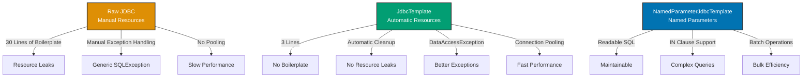

## Why Spring JDBC Matters

Database access is fundamental to enterprise applications. Raw JDBC requires verbose boilerplate for connection management, prepared statements, result set handling, and exception translation. In production systems executing thousands of database operations per second, Spring JDBC eliminates boilerplate while maintaining full SQL control—critical for performance-sensitive queries and complex database interactions.

## Java JDBC Baseline

Manual JDBC requires explicit resource management everywhere:

```java
import java.sql.*;
import java.math.BigDecimal;

// => Zakat transaction repository: manual JDBC
public class ZakatTransactionRepository {

    // => Save zakat transaction: manual resource management
    public void save(String accountId, BigDecimal amount) {
        Connection conn = null;  // => Connection: database connection
        PreparedStatement stmt = null;  // => PreparedStatement: parameterized SQL

        try {
            // => Manual connection creation: no pooling, new connection each time
            conn = DriverManager.getConnection(
                "jdbc:postgresql://localhost:5432/zakat",
                "admin",
                "secret"
            );

            // => SQL with placeholders: prevents SQL injection
            String sql = "INSERT INTO zakat_transactions (account_id, amount, created_at) VALUES (?, ?, ?)";
            // => PreparedStatement: parameterized query, type-safe
            stmt = conn.prepareStatement(sql);
            // => Set parameters: index-based (1-indexed, not 0-indexed)
            stmt.setString(1, accountId);  // => First placeholder
            stmt.setBigDecimal(2, amount);  // => Second placeholder
            stmt.setTimestamp(3, new Timestamp(System.currentTimeMillis()));  // => Third placeholder

            // => Execute update: returns number of affected rows
            int rowsAffected = stmt.executeUpdate();
            // => Verify insertion: should affect exactly 1 row
            if (rowsAffected != 1) {
                throw new RuntimeException("Failed to insert transaction");
            }

        } catch (SQLException e) {
            // => SQLException: generic JDBC exception, hard to handle
            // => No context: which operation failed? Constraint violation? Connection timeout?
            throw new RuntimeException("Database error", e);

        } finally {
            // => Manual cleanup: must close resources in reverse order
            // => Failure to close: resource leak, connection pool exhaustion
            if (stmt != null) {
                try { stmt.close(); } catch (SQLException ignored) {}
            }
            if (conn != null) {
                try { conn.close(); } catch (SQLException ignored) {}
            }
        }
    }

    // => Find zakat transactions by account: manual result set handling
    public List<ZakatTransaction> findByAccountId(String accountId) {
        Connection conn = null;
        PreparedStatement stmt = null;
        ResultSet rs = null;  // => ResultSet: query results, cursor-based

        try {
            conn = DriverManager.getConnection(
                "jdbc:postgresql://localhost:5432/zakat",
                "admin",
                "secret"
            );

            String sql = "SELECT id, account_id, amount, created_at FROM zakat_transactions WHERE account_id = ?";
            stmt = conn.prepareStatement(sql);
            stmt.setString(1, accountId);

            // => Execute query: returns ResultSet (cursor to rows)
            rs = stmt.executeQuery();

            // => Manual result set iteration: row-by-row processing
            List<ZakatTransaction> transactions = new ArrayList<>();
            while (rs.next()) {  // => next(): advances cursor, returns false when no more rows
                // => Extract columns: index-based (1-indexed) or name-based
                Long id = rs.getLong("id");  // => Column: id
                String accId = rs.getString("account_id");  // => Column: account_id
                BigDecimal amount = rs.getBigDecimal("amount");  // => Column: amount
                Timestamp createdAt = rs.getTimestamp("created_at");  // => Column: created_at

                // => Manual object construction: create domain object from row
                ZakatTransaction transaction = new ZakatTransaction(id, accId, amount, createdAt);
                transactions.add(transaction);
            }

            return transactions;

        } catch (SQLException e) {
            throw new RuntimeException("Database error", e);

        } finally {
            // => Must close in reverse order: ResultSet → Statement → Connection
            if (rs != null) {
                try { rs.close(); } catch (SQLException ignored) {}
            }
            if (stmt != null) {
                try { stmt.close(); } catch (SQLException ignored) {}
            }
            if (conn != null) {
                try { conn.close(); } catch (SQLException ignored) {}
            }
        }
    }
}
```

**Limitations:**

- **Boilerplate**: 30 lines to insert one row, 40 lines to query
- **Resource leaks**: Forgetting `finally` blocks causes connection leaks
- **Error handling**: Generic `SQLException` provides no context
- **No connection pooling**: Creates new connection each time (slow)
- **Repetitive**: Same connection/close pattern in every method

## Spring JdbcTemplate Solution

Spring JdbcTemplate eliminates boilerplate with automatic resource management:

```java
import org.springframework.jdbc.core.JdbcTemplate;
import org.springframework.jdbc.core.RowMapper;
import javax.sql.DataSource;

// => Repository: Spring JdbcTemplate for database access
@Repository  // => Marks class as Spring data access component
public class ZakatTransactionRepository {

    private final JdbcTemplate jdbcTemplate;  // => JdbcTemplate: Spring JDBC wrapper

    // => Constructor injection: DataSource provided by Spring
    public ZakatTransactionRepository(DataSource dataSource) {
        // => Creates JdbcTemplate from DataSource (connection pool)
        // => JdbcTemplate handles connection management automatically
        this.jdbcTemplate = new JdbcTemplate(dataSource);
    }

    // => Save zakat transaction: 3 lines instead of 30
    public void save(String accountId, BigDecimal amount) {
        // => update(): executes INSERT/UPDATE/DELETE, returns affected rows
        // => Parameters: SQL with placeholders, then values (varargs)
        // => Automatic: connection from pool, PreparedStatement, close resources
        jdbcTemplate.update(
            "INSERT INTO zakat_transactions (account_id, amount, created_at) VALUES (?, ?, ?)",
            accountId,  // => First placeholder
            amount,  // => Second placeholder
            new Timestamp(System.currentTimeMillis())  // => Third placeholder
        );
        // => No explicit close: JdbcTemplate handles resource cleanup
        // => Exceptions: converts SQLException to DataAccessException
    }

    // => Find transactions by account: automatic result set mapping
    public List<ZakatTransaction> findByAccountId(String accountId) {
        // => query(): executes SELECT, maps rows to objects
        // => Parameters: SQL, RowMapper, query parameters
        return jdbcTemplate.query(
            "SELECT id, account_id, amount, created_at FROM zakat_transactions WHERE account_id = ?",
            zakatTransactionRowMapper(),  // => RowMapper: converts ResultSet row to object
            accountId  // => Query parameter
        );
        // => Returns List<ZakatTransaction> automatically
    }

    // => RowMapper: converts ResultSet row to ZakatTransaction object
    private RowMapper<ZakatTransaction> zakatTransactionRowMapper() {
        // => Lambda: (rs, rowNum) → ZakatTransaction
        // => rs: ResultSet positioned at current row
        // => rowNum: current row number (0-indexed)
        return (rs, rowNum) -> new ZakatTransaction(
            rs.getLong("id"),  // => Extract id column
            rs.getString("account_id"),  // => Extract account_id column
            rs.getBigDecimal("amount"),  // => Extract amount column
            rs.getTimestamp("created_at")  // => Extract created_at column
        );
    }

    // => Find single transaction by id: automatic single row extraction
    public ZakatTransaction findById(Long id) {
        // => queryForObject(): expects exactly one row
        // => Throws EmptyResultDataAccessException if no rows
        // => Throws IncorrectResultSizeDataAccessException if multiple rows
        return jdbcTemplate.queryForObject(
            "SELECT id, account_id, amount, created_at FROM zakat_transactions WHERE id = ?",
            zakatTransactionRowMapper(),
            id
        );
    }

    // => Count transactions: automatic scalar extraction
    public int countByAccountId(String accountId) {
        // => queryForObject(): for scalar results (single column, single row)
        // => Integer.class: expected result type
        return jdbcTemplate.queryForObject(
            "SELECT COUNT(*) FROM zakat_transactions WHERE account_id = ?",
            Integer.class,  // => Result type: Spring converts to Integer
            accountId
        );
    }

    // => Delete transaction: simple update
    public void deleteById(Long id) {
        // => update(): works for DELETE statements too
        int rowsAffected = jdbcTemplate.update(
            "DELETE FROM zakat_transactions WHERE id = ?",
            id
        );
        // => Check affected rows: verify deletion occurred
        if (rowsAffected == 0) {
            throw new EmptyResultDataAccessException("No transaction found with id: " + id, 1);
        }
    }
}

// => Configuration: DataSource bean with connection pooling
@Configuration
public class DatabaseConfig {

    @Bean  // => DataSource: connection pool for database connections
    public DataSource dataSource() {
        // => HikariCP: production-grade connection pool
        HikariConfig config = new HikariConfig();
        config.setJdbcUrl("jdbc:postgresql://localhost:5432/zakat");
        config.setUsername("admin");
        config.setPassword("secret");
        config.setMaximumPoolSize(10);  // => Max 10 connections in pool
        config.setMinimumIdle(5);  // => Min 5 idle connections
        config.setConnectionTimeout(30000);  // => 30 second timeout
        return new HikariDataSource(config);
    }
}
```

**Benefits:**

- **90% less code**: 3 lines to insert vs 30 lines
- **Automatic cleanup**: No `finally` blocks, no resource leaks
- **Better exceptions**: `DataAccessException` hierarchy with context
- **Connection pooling**: Automatic from `DataSource`
- **Full SQL control**: Write any SQL, including complex joins

## Spring NamedParameterJdbcTemplate (Advanced)

Named parameters improve readability for complex queries:

```java
import org.springframework.jdbc.core.namedparam.NamedParameterJdbcTemplate;
import org.springframework.jdbc.core.namedparam.MapSqlParameterSource;
import org.springframework.jdbc.core.namedparam.SqlParameterSource;

// => Repository: named parameters for complex queries
@Repository
public class ZakatReportRepository {

    private final NamedParameterJdbcTemplate namedJdbcTemplate;  // => Named parameter support

    // => Constructor: creates NamedParameterJdbcTemplate from DataSource
    public ZakatReportRepository(DataSource dataSource) {
        this.namedJdbcTemplate = new NamedParameterJdbcTemplate(dataSource);
    }

    // => Complex query with many parameters: named parameters more readable
    public List<ZakatTransaction> findTransactions(
            String accountId,
            BigDecimal minAmount,
            BigDecimal maxAmount,
            LocalDate startDate,
            LocalDate endDate) {

        // => SQL with named parameters: :accountId instead of ?
        // => More readable: can see which parameter is which
        // => Order-independent: can rearrange parameters without breaking SQL
        String sql = """
            SELECT id, account_id, amount, created_at
            FROM zakat_transactions
            WHERE account_id = :accountId
              AND amount BETWEEN :minAmount AND :maxAmount
              AND created_at BETWEEN :startDate AND :endDate
            ORDER BY created_at DESC
            """;

        // => MapSqlParameterSource: map parameter names to values
        SqlParameterSource params = new MapSqlParameterSource()
            .addValue("accountId", accountId)  // => Named parameter: accountId
            .addValue("minAmount", minAmount)  // => Named parameter: minAmount
            .addValue("maxAmount", maxAmount)  // => Named parameter: maxAmount
            .addValue("startDate", Date.valueOf(startDate))  // => Named parameter: startDate
            .addValue("endDate", Date.valueOf(endDate));  // => Named parameter: endDate

        // => query(): same as JdbcTemplate but with named parameters
        return namedJdbcTemplate.query(sql, params, zakatTransactionRowMapper());
    }

    // => Batch insert: insert multiple rows efficiently
    public void saveBatch(List<ZakatTransaction> transactions) {
        // => SQL with named parameters
        String sql = """
            INSERT INTO zakat_transactions (account_id, amount, created_at)
            VALUES (:accountId, :amount, :createdAt)
            """;

        // => SqlParameterSource array: one per row
        SqlParameterSource[] batchParams = transactions.stream()
            .map(tx -> new MapSqlParameterSource()
                .addValue("accountId", tx.getAccountId())
                .addValue("amount", tx.getAmount())
                .addValue("createdAt", tx.getCreatedAt())
            )
            .toArray(SqlParameterSource[]::new);

        // => batchUpdate(): executes all inserts in single batch
        // => More efficient than individual inserts: fewer round trips
        int[] rowsAffected = namedJdbcTemplate.batchUpdate(sql, batchParams);
        // => Returns int[] with affected rows for each statement
    }

    // => IN clause with named parameters: variable number of values
    public List<ZakatTransaction> findByAccountIds(List<String> accountIds) {
        // => IN clause: :accountIds expands to (?, ?, ?, ...)
        String sql = """
            SELECT id, account_id, amount, created_at
            FROM zakat_transactions
            WHERE account_id IN (:accountIds)
            """;

        // => List parameter: Spring expands to correct number of placeholders
        SqlParameterSource params = new MapSqlParameterSource()
            .addValue("accountIds", accountIds);

        return namedJdbcTemplate.query(sql, params, zakatTransactionRowMapper());
    }

    private RowMapper<ZakatTransaction> zakatTransactionRowMapper() {
        return (rs, rowNum) -> new ZakatTransaction(
            rs.getLong("id"),
            rs.getString("account_id"),
            rs.getBigDecimal("amount"),
            rs.getTimestamp("created_at")
        );
    }
}
```

**Benefits over JdbcTemplate:**

- **Readability**: Named parameters clearer than `?` placeholders
- **Maintainability**: Can reorder parameters without breaking SQL
- **IN clause support**: Automatic expansion of list parameters
- **Batch operations**: Efficient bulk inserts/updates

## Progression Diagram



## Production Patterns

### Transaction Management

```java
@Service
public class ZakatService {

    private final ZakatTransactionRepository transactionRepo;
    private final ZakatAccountRepository accountRepo;

    // => @Transactional: automatic transaction management
    // => Opens transaction, commits on success, rolls back on exception
    @Transactional  // => Wraps method in database transaction
    public void transferZakat(String fromAccount, String toAccount, BigDecimal amount) {
        // => Both operations in same transaction: all-or-nothing
        // => If debit succeeds but credit fails: automatic rollback

        // => Debit from source account
        accountRepo.debit(fromAccount, amount);

        // => Credit to destination account
        accountRepo.credit(toAccount, amount);

        // => Record transaction
        transactionRepo.save(fromAccount, amount.negate());
        transactionRepo.save(toAccount, amount);

        // => Automatic commit if no exception thrown
        // => Automatic rollback if any exception occurs
    }
}
```

### Error Handling

```java
@Service
public class ZakatQueryService {

    private final ZakatTransactionRepository transactionRepo;

    // => Handle empty results gracefully
    public Optional<ZakatTransaction> findById(Long id) {
        try {
            // => queryForObject throws exception if no rows
            ZakatTransaction transaction = transactionRepo.findById(id);
            return Optional.of(transaction);

        } catch (EmptyResultDataAccessException e) {
            // => EmptyResultDataAccessException: no rows found
            // => Return empty Optional instead of throwing
            return Optional.empty();

        } catch (DataAccessException e) {
            // => DataAccessException: database error
            // => Log and rethrow as application exception
            throw new ZakatException("Failed to find transaction: " + id, e);
        }
    }
}
```

### Connection Pool Monitoring

```java
@Configuration
public class DatabaseConfig {

    @Bean
    public DataSource dataSource() {
        HikariConfig config = new HikariConfig();
        config.setJdbcUrl("jdbc:postgresql://localhost:5432/zakat");
        config.setUsername("admin");
        config.setPassword("secret");

        // => Connection pool sizing
        config.setMaximumPoolSize(20);  // => Max connections
        config.setMinimumIdle(5);  // => Min idle connections

        // => Timeouts
        config.setConnectionTimeout(30000);  // => 30s to get connection
        config.setIdleTimeout(600000);  // => 10min idle before removal
        config.setMaxLifetime(1800000);  // => 30min max connection lifetime

        // => Leak detection
        config.setLeakDetectionThreshold(60000);  // => Warn if connection held >60s

        // => Health check
        config.setConnectionTestQuery("SELECT 1");  // => Test query before use

        // => Pool name for monitoring
        config.setPoolName("ZakatHikariPool");

        return new HikariDataSource(config);
    }
}
```

## Trade-offs and When to Use

| Approach                   | Boilerplate | Resource Safety | Exception Quality | Performance | SQL Control |
| -------------------------- | ----------- | --------------- | ----------------- | ----------- | ----------- |
| Raw JDBC                   | Very High   | Manual          | Poor              | Fast        | Full        |
| JdbcTemplate               | Low         | Automatic       | Good              | Fast        | Full        |
| NamedParameterJdbcTemplate | Low         | Automatic       | Good              | Fast        | Full        |
| Spring Data JPA            | Very Low    | Automatic       | Excellent         | Variable    | Limited     |

**When to Use Raw JDBC:**

- Learning JDBC fundamentals
- Performance-critical single-query operations
- Debugging framework issues

**When to Use JdbcTemplate:**

- Production applications with complex SQL
- Performance-critical queries (joins, subqueries)
- Full control over SQL execution
- Database-specific features (PostgreSQL arrays, JSON columns)
- Batch operations with custom SQL

**When to Use NamedParameterJdbcTemplate:**

- Complex queries with many parameters
- Dynamic IN clauses with variable list size
- Readable SQL for maintenance
- Batch operations with named parameters

**When to Use Spring Data JPA:**

- CRUD operations on single entities
- Standard queries (findById, findAll, count)
- JPA abstraction preferred over SQL
- Database portability required

## Best Practices

**1. Use DataSource with Connection Pooling**

Always configure production connection pool:

```java
@Bean
public DataSource dataSource() {
    HikariConfig config = new HikariConfig();
    config.setMaximumPoolSize(20);  // => Right-size for load
    config.setConnectionTimeout(30000);
    config.setLeakDetectionThreshold(60000);  // => Detect leaks
    return new HikariDataSource(config);
}
```

**2. Extract RowMappers as Methods**

Reuse row mapping logic:

```java
private RowMapper<ZakatTransaction> zakatTransactionRowMapper() {
    return (rs, rowNum) -> new ZakatTransaction(
        rs.getLong("id"),
        rs.getString("account_id"),
        rs.getBigDecimal("amount"),
        rs.getTimestamp("created_at")
    );
}
```

**3. Use @Transactional for Multi-Statement Operations**

Ensure data consistency:

```java
@Transactional  // => All-or-nothing execution
public void transferZakat(String from, String to, BigDecimal amount) {
    accountRepo.debit(from, amount);
    accountRepo.credit(to, amount);
    transactionRepo.recordTransfer(from, to, amount);
}
```

**4. Handle EmptyResultDataAccessException**

Return `Optional` instead of throwing:

```java
public Optional<ZakatTransaction> findById(Long id) {
    try {
        return Optional.of(jdbcTemplate.queryForObject(sql, rowMapper, id));
    } catch (EmptyResultDataAccessException e) {
        return Optional.empty();
    }
}
```

**5. Use Batch Operations for Bulk Inserts**

More efficient than individual inserts:

```java
public void saveBatch(List<ZakatTransaction> transactions) {
    SqlParameterSource[] params = transactions.stream()
        .map(this::toSqlParameterSource)
        .toArray(SqlParameterSource[]::new);

    namedJdbcTemplate.batchUpdate(sql, params);
}
```

## See Also

- [Spring Data JPA](/en/learn/software-engineering/platform-web/tools/jvm-spring/in-the-field/spring-data-jpa) - JPA repository abstraction
- [Transaction Management](/en/learn/software-engineering/platform-web/tools/jvm-spring/in-the-field/transaction-management) - @Transactional patterns
- [Connection Pooling](/en/learn/software-engineering/platform-web/tools/jvm-spring/in-the-field/connection-pooling) - HikariCP configuration
- [Configuration](/en/learn/software-engineering/platform-web/tools/jvm-spring/in-the-field/configuration) - DataSource bean setup
- [Java JDBC](/en/learn/software-engineering/programming-languages/java/in-the-field/jdbc) - JDBC baseline patterns
