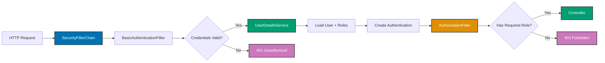

## Why Spring Security Matters

Production web applications require authentication (verifying user identity) and authorization (controlling resource access). Manual security with ServletFilter requires writing filter chains, session management, and URL pattern matching by hand. In production systems handling thousands of authenticated requests, Spring Security's SecurityFilterChain provides declarative security configuration, built-in authentication providers, and battle-tested security defaults—eliminating common vulnerabilities like CSRF, session fixation, and clickjacking that plague manual implementations.

## Manual ServletFilter Security Baseline

Manual security implementation requires custom servlet filters for authentication and authorization:

```java
import jakarta.servlet.*;
import jakarta.servlet.http.*;
import java.io.IOException;
import java.util.Base64;
import java.util.concurrent.ConcurrentHashMap;

// => Manual authentication filter: checks credentials on every request
public class AuthenticationFilter implements Filter {

    // => In-memory user store: username → password hash
    // => Production: use database, not ConcurrentHashMap
    private final ConcurrentHashMap<String, String> users = new ConcurrentHashMap<>();

    // => In-memory session store: sessionId → username
    // => Production: use Redis or distributed cache
    private final ConcurrentHashMap<String, String> sessions = new ConcurrentHashMap<>();

    @Override
    public void init(FilterConfig filterConfig) {
        // => Initialize test users (hardcoded for demo)
        // => Production: load from database with BCrypt hashing
        users.put("admin", hashPassword("admin123"));
        users.put("accountant", hashPassword("acct123"));
        users.put("viewer", hashPassword("view123"));
    }

    @Override
    public void doFilter(ServletRequest request, ServletResponse response, FilterChain chain)
            throws IOException, ServletException {

        HttpServletRequest httpRequest = (HttpServletRequest) request;
        HttpServletResponse httpResponse = (HttpServletResponse) response;

        // => Check if user already authenticated (session exists)
        HttpSession session = httpRequest.getSession(false);
        if (session != null && session.getAttribute("username") != null) {
            // => User authenticated: allow request to proceed
            chain.doFilter(request, response);
            return;
        }

        // => Extract Basic Auth credentials from Authorization header
        String authHeader = httpRequest.getHeader("Authorization");
        if (authHeader != null && authHeader.startsWith("Basic ")) {
            // => Decode Base64 credentials
            String base64Credentials = authHeader.substring("Basic ".length());
            byte[] decodedBytes = Base64.getDecoder().decode(base64Credentials);
            String credentials = new String(decodedBytes);

            // => Parse username:password format
            String[] parts = credentials.split(":", 2);
            if (parts.length == 2) {
                String username = parts[0];
                String password = parts[1];

                // => Verify credentials against user store
                String storedHash = users.get(username);
                if (storedHash != null && verifyPassword(password, storedHash)) {
                    // => Authentication success: create session
                    HttpSession newSession = httpRequest.getSession(true);
                    // => Store username in session
                    newSession.setAttribute("username", username);
                    // => Session timeout: 30 minutes
                    newSession.setMaxInactiveInterval(1800);

                    // => Allow request to proceed
                    chain.doFilter(request, response);
                    return;
                }
            }
        }

        // => Authentication failed: return 401 Unauthorized
        httpResponse.setStatus(HttpServletResponse.SC_UNAUTHORIZED);
        // => WWW-Authenticate header: tells client to use Basic Auth
        httpResponse.setHeader("WWW-Authenticate", "Basic realm=\"Zakat Management\"");
        httpResponse.getWriter().println("{\"error\": \"Authentication required\"}");
    }

    private String hashPassword(String password) {
        // => INSECURE: simple hash for demo only
        // => Production: use BCrypt with salt
        return Integer.toString(password.hashCode());
    }

    private boolean verifyPassword(String password, String storedHash) {
        // => Compare hashes
        return hashPassword(password).equals(storedHash);
    }
}

// => Manual authorization filter: checks user roles
public class AuthorizationFilter implements Filter {

    // => User roles: username → role
    private final ConcurrentHashMap<String, String> userRoles = new ConcurrentHashMap<>();

    @Override
    public void init(FilterConfig filterConfig) {
        // => Initialize user roles (hardcoded for demo)
        // => Production: load from database with many-to-many relationship
        userRoles.put("admin", "ADMIN");
        userRoles.put("accountant", "ACCOUNTANT");
        userRoles.put("viewer", "VIEWER");
    }

    @Override
    public void doFilter(ServletRequest request, ServletResponse response, FilterChain chain)
            throws IOException, ServletException {

        HttpServletRequest httpRequest = (HttpServletRequest) request;
        HttpServletResponse httpResponse = (HttpServletResponse) response;

        // => Get authenticated username from session
        HttpSession session = httpRequest.getSession(false);
        String username = (String) (session != null ? session.getAttribute("username") : null);

        // => Get request URI to determine required role
        String uri = httpRequest.getRequestURI();
        String method = httpRequest.getMethod();

        // => URL-based authorization (manual pattern matching)
        if (uri.startsWith("/api/admin/")) {
            // => Admin endpoints: require ADMIN role
            if (!hasRole(username, "ADMIN")) {
                httpResponse.setStatus(HttpServletResponse.SC_FORBIDDEN);
                httpResponse.getWriter().println("{\"error\": \"Admin access required\"}");
                return;
            }
        } else if (uri.startsWith("/api/zakat/calculations") && method.equals("POST")) {
            // => Create calculation: require ADMIN or ACCOUNTANT
            if (!hasRole(username, "ADMIN") && !hasRole(username, "ACCOUNTANT")) {
                httpResponse.setStatus(HttpServletResponse.SC_FORBIDDEN);
                httpResponse.getWriter().println("{\"error\": \"Accountant access required\"}");
                return;
            }
        } else if (uri.startsWith("/api/zakat/accounts")) {
            // => Read accounts: all authenticated users allowed
            // => Already authenticated by AuthenticationFilter
        }
        // => PROBLEM: manual URL pattern matching is error-prone
        // => Easy to forget patterns, inconsistent across application

        // => Authorization success: allow request
        chain.doFilter(request, response);
    }

    private boolean hasRole(String username, String requiredRole) {
        if (username == null) return false;
        String userRole = userRoles.get(username);
        return requiredRole.equals(userRole);
    }
}

// => Filter registration in web.xml or ServletContainerInitializer
public class SecurityFilterRegistration implements ServletContainerInitializer {

    @Override
    public void onStartup(Set<Class<?>> c, ServletContext ctx) {
        // => Register authentication filter first
        FilterRegistration.Dynamic authFilter =
            ctx.addFilter("authenticationFilter", new AuthenticationFilter());
        // => Apply to all URLs
        authFilter.addMappingForUrlPatterns(null, false, "/*");

        // => Register authorization filter second (after authentication)
        FilterRegistration.Dynamic authzFilter =
            ctx.addFilter("authorizationFilter", new AuthorizationFilter());
        authzFilter.addMappingForUrlPatterns(null, false, "/*");

        // => PROBLEM: filter order is critical but not obvious
        // => Easy to misconfigure filter chain
    }
}
```

**Limitations:**

- **Manual filter chain**: Must register filters in correct order manually
- **No security defaults**: Must implement CSRF protection, session fixation prevention, clickjacking protection manually
- **Weak password hashing**: Simple hashCode() is insecure (no salt, weak algorithm)
- **Manual session management**: ConcurrentHashMap doesn't scale, no distributed session support
- **Error-prone authorization**: URL pattern matching is fragile and inconsistent
- **No remember-me**: Must implement persistent token storage manually
- **No logout**: Must implement session invalidation manually
- **Security vulnerabilities**: Easy to forget HTTPS enforcement, XSS prevention, CORS configuration

## Spring Security Filter Chain Solution

Spring Security provides SecurityFilterChain for declarative security configuration:

```java
import org.springframework.context.annotation.*;
import org.springframework.security.config.annotation.web.builders.HttpSecurity;
import org.springframework.security.config.annotation.web.configuration.EnableWebSecurity;
import org.springframework.security.core.userdetails.*;
import org.springframework.security.crypto.bcrypt.BCryptPasswordEncoder;
import org.springframework.security.crypto.password.PasswordEncoder;
import org.springframework.security.provisioning.InMemoryUserDetailsManager;
import org.springframework.security.web.SecurityFilterChain;

// => Spring Security configuration class
@Configuration  // => Spring configuration
@EnableWebSecurity  // => Enables Spring Security filter chain
public class SecurityConfig {

    // => SecurityFilterChain bean: defines security rules
    // => Replaces manual filter registration
    @Bean
    public SecurityFilterChain securityFilterChain(HttpSecurity http) throws Exception {
        http
            // => Authorize HTTP requests: declarative URL security
            .authorizeHttpRequests(authz -> authz
                // => Public endpoints: no authentication required
                .requestMatchers("/", "/public/**", "/api/health").permitAll()

                // => Admin endpoints: require ADMIN role
                .requestMatchers("/api/admin/**").hasRole("ADMIN")

                // => Zakat calculations: require ADMIN or ACCOUNTANT role
                // => Spring Security: hasAnyRole takes varargs
                .requestMatchers("/api/zakat/calculations").hasAnyRole("ADMIN", "ACCOUNTANT")

                // => All other endpoints: require authentication
                // => No role restriction, just authenticated
                .anyRequest().authenticated()
            )

            // => HTTP Basic authentication
            // => Spring Security: handles Authorization header parsing
            .httpBasic(basic -> basic
                .realmName("Zakat Management")  // => Realm name in WWW-Authenticate header
            )

            // => Session management configuration
            .sessionManagement(session -> session
                .sessionFixation().newSession()  // => Prevent session fixation: new session on auth
                .maximumSessions(1)  // => One session per user
                .maxSessionsPreventsLogin(false)  // => New login invalidates old session
            )

            // => CSRF protection: enabled by default
            // => Spring Security: generates CSRF token, validates on POST/PUT/DELETE
            .csrf(csrf -> csrf
                .ignoringRequestMatchers("/api/**")  // => Disable for REST APIs (use token auth)
            )

            // => Security headers: enabled by default
            // => Spring Security: adds security headers automatically
            .headers(headers -> headers
                .frameOptions().deny()  // => X-Frame-Options: DENY (prevent clickjacking)
                .xssProtection().and()  // => X-XSS-Protection: 1; mode=block
                .contentSecurityPolicy(csp -> csp
                    .policyDirectives("default-src 'self'")  // => CSP header
                )
            );

        return http.build();
        // => Spring Security: automatically registers SecurityFilterChain as filter
        // => No manual filter registration needed
    }

    // => UserDetailsService bean: loads user details
    // => Spring Security: queries this service during authentication
    @Bean
    public UserDetailsService userDetailsService() {
        // => In-memory user store (development only)
        // => Production: use database with JPA/JDBC
        UserDetails admin = User.builder()
            .username("admin")
            .password(passwordEncoder().encode("admin123"))  // => BCrypt hashing
            .roles("ADMIN")  // => Role: ROLE_ADMIN (Spring adds ROLE_ prefix)
            .build();

        UserDetails accountant = User.builder()
            .username("accountant")
            .password(passwordEncoder().encode("acct123"))
            .roles("ACCOUNTANT")  // => Role: ROLE_ACCOUNTANT
            .build();

        UserDetails viewer = User.builder()
            .username("viewer")
            .password(passwordEncoder().encode("view123"))
            .roles("VIEWER")  // => Role: ROLE_VIEWER
            .build();

        // => InMemoryUserDetailsManager: stores users in memory
        // => Production: use JdbcUserDetailsManager or custom UserDetailsService
        return new InMemoryUserDetailsManager(admin, accountant, viewer);
    }

    // => PasswordEncoder bean: hashes passwords
    // => Spring Security: uses this encoder for password verification
    @Bean
    public PasswordEncoder passwordEncoder() {
        // => BCrypt: secure password hashing with salt
        // => Strength 10: 2^10 iterations (balance security/performance)
        return new BCryptPasswordEncoder(10);
    }
}

// => Usage in controller: access authenticated user
@RestController
@RequestMapping("/api/zakat")
public class ZakatController {

    // => Get current authenticated user
    // => Spring Security: injects Authentication via SecurityContextHolder
    @GetMapping("/accounts/{accountId}")
    public ZakatAccount getAccount(
            @PathVariable String accountId,
            Authentication authentication) {  // => Injected by Spring Security

        // => authentication.getName(): authenticated username
        String username = authentication.getName();

        // => authentication.getAuthorities(): user roles/permissions
        // => Type: Collection<? extends GrantedAuthority>
        boolean isAdmin = authentication.getAuthorities().stream()
            .anyMatch(auth -> auth.getAuthority().equals("ROLE_ADMIN"));

        // => Business logic: access control based on roles
        if (!isAdmin && !accountBelongsToUser(accountId, username)) {
            // => Viewer can only see own account
            throw new AccessDeniedException("Cannot access other user's account");
        }

        return zakatService.getAccount(accountId);
    }

    private boolean accountBelongsToUser(String accountId, String username) {
        // => Check if account belongs to authenticated user
        return zakatService.getAccountOwner(accountId).equals(username);
    }
}
```

**Benefits:**

- **Declarative security**: URL patterns and roles configured in one place
- **Secure defaults**: CSRF, session fixation, clickjacking protection enabled automatically
- **BCrypt password hashing**: Industry-standard secure hashing with salt
- **Filter chain managed**: Spring Security registers filters in correct order automatically
- **Security headers**: X-Frame-Options, X-XSS-Protection, CSP added automatically
- **Clean separation**: Security configuration separate from business logic

## Spring Security Architecture Diagram



## Production Patterns

### Database-Backed UserDetailsService

```java
import org.springframework.security.core.userdetails.*;
import org.springframework.stereotype.Service;
import java.util.List;
import java.util.stream.Collectors;

// => Custom UserDetailsService: loads users from database
@Service
public class DatabaseUserDetailsService implements UserDetailsService {

    private final UserRepository userRepository;  // => JPA repository

    public DatabaseUserDetailsService(UserRepository userRepository) {
        this.userRepository = userRepository;
    }

    @Override
    public UserDetails loadUserByUsername(String username) throws UsernameNotFoundException {
        // => Query database for user by username
        // => Uses JPA: SELECT * FROM users WHERE username = ?
        UserEntity userEntity = userRepository.findByUsername(username)
            .orElseThrow(() -> new UsernameNotFoundException("User not found: " + username));

        // => Convert database entity to Spring Security UserDetails
        return User.builder()
            .username(userEntity.getUsername())
            .password(userEntity.getPasswordHash())  // => BCrypt hash from database
            .authorities(convertRolesToAuthorities(userEntity.getRoles()))  // => Convert roles
            .accountExpired(userEntity.isAccountExpired())
            .accountLocked(userEntity.isAccountLocked())
            .credentialsExpired(userEntity.isCredentialsExpired())
            .disabled(userEntity.isDisabled())
            .build();
    }

    private List<GrantedAuthority> convertRolesToAuthorities(List<RoleEntity> roles) {
        // => Convert RoleEntity list to GrantedAuthority list
        return roles.stream()
            .map(role -> new SimpleGrantedAuthority("ROLE_" + role.getName()))
            .collect(Collectors.toList());
    }
}

// => JPA Entity: User
@Entity
@Table(name = "users")
public class UserEntity {
    @Id
    @GeneratedValue(strategy = GenerationType.IDENTITY)
    private Long id;

    @Column(unique = true, nullable = false)
    private String username;

    @Column(nullable = false)
    private String passwordHash;  // => BCrypt hash

    @ManyToMany(fetch = FetchType.EAGER)
    @JoinTable(
        name = "user_roles",
        joinColumns = @JoinColumn(name = "user_id"),
        inverseJoinColumns = @JoinColumn(name = "role_id")
    )
    private List<RoleEntity> roles;

    // => Account status flags
    private boolean accountExpired = false;
    private boolean accountLocked = false;
    private boolean credentialsExpired = false;
    private boolean disabled = false;

    // => Getters and setters
}

// => JPA Entity: Role
@Entity
@Table(name = "roles")
public class RoleEntity {
    @Id
    @GeneratedValue(strategy = GenerationType.IDENTITY)
    private Long id;

    @Column(unique = true, nullable = false)
    private String name;  // => ADMIN, ACCOUNTANT, VIEWER

    // => Getters and setters
}
```

### Password Reset with Secure Token

```java
import org.springframework.security.crypto.password.PasswordEncoder;
import java.security.SecureRandom;
import java.time.LocalDateTime;
import java.util.Base64;

@Service
public class PasswordResetService {

    private final UserRepository userRepository;
    private final PasswordResetTokenRepository tokenRepository;
    private final PasswordEncoder passwordEncoder;
    private final EmailService emailService;

    // => Generate secure reset token
    public String createPasswordResetToken(String email) {
        // => Find user by email
        UserEntity user = userRepository.findByEmail(email)
            .orElseThrow(() -> new UserNotFoundException("User not found"));

        // => Generate cryptographically secure random token
        SecureRandom random = new SecureRandom();
        byte[] tokenBytes = new byte[32];
        random.nextBytes(tokenBytes);
        String token = Base64.getUrlEncoder().withoutPadding().encodeToString(tokenBytes);

        // => Save token to database
        PasswordResetToken resetToken = new PasswordResetToken();
        resetToken.setToken(token);
        resetToken.setUser(user);
        resetToken.setExpiryDate(LocalDateTime.now().plusHours(24));  // => 24-hour expiry
        tokenRepository.save(resetToken);

        // => Send email with reset link
        emailService.sendPasswordResetEmail(email, token);

        return token;
    }

    // => Reset password with token
    public void resetPassword(String token, String newPassword) {
        // => Validate token exists and not expired
        PasswordResetToken resetToken = tokenRepository.findByToken(token)
            .orElseThrow(() -> new InvalidTokenException("Invalid reset token"));

        if (resetToken.getExpiryDate().isBefore(LocalDateTime.now())) {
            throw new ExpiredTokenException("Reset token expired");
        }

        // => Hash new password with BCrypt
        String hashedPassword = passwordEncoder.encode(newPassword);

        // => Update user password
        UserEntity user = resetToken.getUser();
        user.setPasswordHash(hashedPassword);
        userRepository.save(user);

        // => Delete used token (one-time use)
        tokenRepository.delete(resetToken);
    }
}
```

### HTTPS Enforcement and Secure Cookies

```java
@Configuration
@EnableWebSecurity
public class SecurityConfig {

    @Bean
    public SecurityFilterChain securityFilterChain(HttpSecurity http) throws Exception {
        http
            .authorizeHttpRequests(authz -> authz
                .anyRequest().authenticated()
            )
            .httpBasic()

            // => HTTPS enforcement: redirect HTTP to HTTPS
            .requiresChannel(channel -> channel
                .anyRequest().requiresSecure()  // => All requests must use HTTPS
            )

            // => Session configuration with secure cookies
            .sessionManagement(session -> session
                .sessionFixation().newSession()
                .sessionConcurrency(concurrency -> concurrency
                    .maximumSessions(1)
                    .expiredUrl("/login?expired=true")
                )
            );

        return http.build();
    }

    // => Configure secure session cookies in application.yml
    // server:
    //   servlet:
    //     session:
    //       cookie:
    //         secure: true      # Send cookie over HTTPS only
    //         http-only: true   # Prevent JavaScript access (XSS protection)
    //         same-site: strict # CSRF protection
    //         max-age: 1800     # 30 minutes
}
```

## Trade-offs and When to Use

| Approach             | Security Defaults | Configuration Complexity | Vulnerability Risk | Production Ready |
| -------------------- | ----------------- | ------------------------ | ------------------ | ---------------- |
| Manual ServletFilter | None              | Very High                | Very High          | No               |
| Spring Security      | Comprehensive     | Low (declarative)        | Low                | Yes              |

**When to Use Manual ServletFilter:**

- Learning servlet filter fundamentals
- Extremely simple applications (no sessions, no roles)
- Educational purposes only (not production)

**When to Use Spring Security:**

- **Production applications** (default choice)
- Authentication and authorization required
- Multiple user roles and permissions
- Security best practices needed (CSRF, session fixation, clickjacking protection)
- Industry compliance required (PCI DSS, HIPAA, SOC 2)
- Integration with OAuth2, SAML, LDAP

## Best Practices

**1. Always Use BCrypt for Password Hashing**

```java
@Bean
public PasswordEncoder passwordEncoder() {
    // BCrypt: secure, salted, configurable strength
    return new BCryptPasswordEncoder(10);  // Strength 10-12 recommended
}
```

**2. Enable HTTPS in Production**

```yaml
# application-prod.yml
server:
  ssl:
    enabled: true
    key-store: classpath:keystore.p12
    key-store-password: ${SSL_KEYSTORE_PASSWORD}
    key-store-type: PKCS12
```

**3. Use Secure Session Cookies**

```yaml
server:
  servlet:
    session:
      cookie:
        secure: true # HTTPS only
        http-only: true # No JavaScript access
        same-site: strict # CSRF protection
```

**4. Implement Account Lockout for Failed Login Attempts**

```java
@Service
public class AccountLockoutService {

    private final ConcurrentHashMap<String, Integer> failedAttempts = new ConcurrentHashMap<>();
    private static final int MAX_ATTEMPTS = 5;

    public void loginFailed(String username) {
        int attempts = failedAttempts.getOrDefault(username, 0) + 1;
        failedAttempts.put(username, attempts);

        if (attempts >= MAX_ATTEMPTS) {
            // Lock account
            userRepository.lockAccount(username);
        }
    }

    public void loginSucceeded(String username) {
        // Reset failed attempts on successful login
        failedAttempts.remove(username);
    }
}
```

**5. Log Security Events**

```java
@ControllerAdvice
public class SecurityEventLogger {

    private static final Logger logger = LoggerFactory.getLogger(SecurityEventLogger.class);

    @EventListener
    public void onAuthenticationSuccess(AuthenticationSuccessEvent event) {
        String username = event.getAuthentication().getName();
        logger.info("Login successful: username={}", username);
    }

    @EventListener
    public void onAuthenticationFailure(AbstractAuthenticationFailureEvent event) {
        String username = event.getAuthentication().getName();
        logger.warn("Login failed: username={}, reason={}",
            username, event.getException().getMessage());
    }
}
```

## See Also

- [Authentication](/en/learn/software-engineering/platform-web/tools/jvm-spring/in-the-field/authentication) - Form login, JWT, OAuth2 authentication
- [Authorization](/en/learn/software-engineering/platform-web/tools/jvm-spring/in-the-field/authorization) - Method security and SpEL expressions
- [Spring MVC](/en/learn/software-engineering/platform-web/tools/jvm-spring/in-the-field/spring-mvc) - Web security integration
- [REST APIs](/en/learn/software-engineering/platform-web/tools/jvm-spring/in-the-field/rest-apis) - API security patterns
- [Configuration](/en/learn/software-engineering/platform-web/tools/jvm-spring/in-the-field/configuration) - Security configuration management
