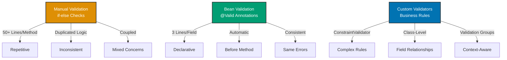

## Why Validation Matters

Input validation prevents invalid data from entering business logic and databases. Manual validation requires repetitive if-else checks across every endpoint with inconsistent error messages. In production APIs processing millions of transactions, Bean Validation (@Valid) provides declarative constraints with automatic validation while custom validators enable complex business rules—critical for data integrity and security.

## Manual Validation Logic Baseline

Manual validation requires explicit checks in every method:

```java
import jakarta.servlet.http.*;
import java.io.IOException;
import java.math.BigDecimal;

// => Zakat servlet: manual validation
public class ZakatValidationServlet extends HttpServlet {

    @Override
    protected void doPost(HttpServletRequest request, HttpServletResponse response)
            throws ServletException, IOException {

        // => Extract parameters from request
        String accountId = request.getParameter("accountId");
        String wealthParam = request.getParameter("wealth");
        String emailParam = request.getParameter("email");

        // => Manual validation: check for null/empty
        // => REPETITIVE: same pattern in every servlet method
        if (accountId == null || accountId.trim().isEmpty()) {
            // => Validation error: return 400 Bad Request
            response.setStatus(HttpServletResponse.SC_BAD_REQUEST);
            response.setContentType("application/json");
            response.getWriter().println("{\"error\": \"Account ID is required\"}");
            return;
        }

        // => Manual validation: length constraint
        if (accountId.length() < 3 || accountId.length() > 20) {
            response.setStatus(HttpServletResponse.SC_BAD_REQUEST);
            response.setContentType("application/json");
            response.getWriter().println("{\"error\": \"Account ID must be between 3 and 20 characters\"}");
            return;
        }

        // => Manual validation: pattern matching
        // => Check account ID format: alphanumeric only
        if (!accountId.matches("^[A-Z0-9]+$")) {
            response.setStatus(HttpServletResponse.SC_BAD_REQUEST);
            response.setContentType("application/json");
            response.getWriter().println("{\"error\": \"Account ID must contain only uppercase letters and numbers\"}");
            return;
        }

        // => Manual validation: wealth parameter
        if (wealthParam == null || wealthParam.trim().isEmpty()) {
            response.setStatus(HttpServletResponse.SC_BAD_REQUEST);
            response.setContentType("application/json");
            response.getWriter().println("{\"error\": \"Wealth is required\"}");
            return;
        }

        // => Manual parsing with error handling
        BigDecimal wealth;
        try {
            wealth = new BigDecimal(wealthParam);
        } catch (NumberFormatException e) {
            response.setStatus(HttpServletResponse.SC_BAD_REQUEST);
            response.setContentType("application/json");
            response.getWriter().println("{\"error\": \"Wealth must be a valid number\"}");
            return;
        }

        // => Manual validation: numeric constraint
        if (wealth.compareTo(BigDecimal.ZERO) < 0) {
            response.setStatus(HttpServletResponse.SC_BAD_REQUEST);
            response.setContentType("application/json");
            response.getWriter().println("{\"error\": \"Wealth must be non-negative\"}");
            return;
        }

        // => Manual validation: maximum value
        BigDecimal maxWealth = new BigDecimal("1000000000");  // => 1 billion
        if (wealth.compareTo(maxWealth) > 0) {
            response.setStatus(HttpServletResponse.SC_BAD_REQUEST);
            response.setContentType("application/json");
            response.getWriter().println("{\"error\": \"Wealth exceeds maximum allowed value\"}");
            return;
        }

        // => Manual validation: email (optional parameter)
        if (emailParam != null && !emailParam.trim().isEmpty()) {
            // => Email format validation with regex
            String emailRegex = "^[A-Za-z0-9+_.-]+@[A-Za-z0-9.-]+\\.[A-Za-z]{2,}$";
            if (!emailParam.matches(emailRegex)) {
                response.setStatus(HttpServletResponse.SC_BAD_REQUEST);
                response.setContentType("application/json");
                response.getWriter().println("{\"error\": \"Invalid email format\"}");
                return;
            }
        }

        // => Business logic: only executes if all validations pass
        // => By this point: 50+ lines of validation code
        try {
            BigDecimal zakatAmount = zakatService.calculateAndSave(accountId, wealth);

            // => Success response
            response.setStatus(HttpServletResponse.SC_CREATED);
            response.setContentType("application/json");
            response.getWriter().println("{\"zakatAmount\": \"" + zakatAmount + "\"}");

        } catch (Exception e) {
            response.setStatus(HttpServletResponse.SC_INTERNAL_SERVER_ERROR);
            response.setContentType("application/json");
            response.getWriter().println("{\"error\": \"Internal server error\"}");
        }
    }

    // => Another method: DUPLICATED validation logic
    @Override
    protected void doPut(HttpServletRequest request, HttpServletResponse response)
            throws ServletException, IOException {

        String accountId = request.getParameter("accountId");
        String wealthParam = request.getParameter("wealth");

        // => REPEATED: same accountId validation as doPost()
        if (accountId == null || accountId.trim().isEmpty()) {
            response.setStatus(HttpServletResponse.SC_BAD_REQUEST);
            response.setContentType("application/json");
            response.getWriter().println("{\"error\": \"Account ID is required\"}");
            return;
        }

        if (accountId.length() < 3 || accountId.length() > 20) {
            response.setStatus(HttpServletResponse.SC_BAD_REQUEST);
            response.setContentType("application/json");
            response.getWriter().println("{\"error\": \"Account ID must be between 3 and 20 characters\"}");
            return;
        }

        // => REPEATED: same wealth validation as doPost()
        // ... more duplicated validation code ...
    }
}
```

**Limitations:**

- **Repetitive**: 50+ lines of validation per method
- **Duplicated**: Same validations in multiple methods
- **Inconsistent**: Easy to forget constraints or use different messages
- **No declarative**: Validation logic mixed with business logic
- **Manual error responses**: Must construct error JSON for each failure
- **Hard to maintain**: Changing validation rules requires editing multiple methods

## Spring Bean Validation (@Valid) Solution

Bean Validation uses annotations on request objects for automatic validation:

```java
import org.springframework.web.bind.annotation.*;
import org.springframework.http.*;
import jakarta.validation.Valid;
import jakarta.validation.constraints.*;
import java.math.BigDecimal;

// => REST controller with automatic validation
@RestController
@RequestMapping("/api/zakat")
public class ZakatValidationController {

    private final ZakatService zakatService;

    public ZakatValidationController(ZakatService zakatService) {
        this.zakatService = zakatService;
    }

    // => POST with automatic validation
    @PostMapping("/calculations")
    public ResponseEntity<ZakatCalculationResponse> createCalculation(
            // => @Valid: triggers Bean Validation before method execution
            // => @RequestBody: deserializes JSON to object, then validates
            @Valid @RequestBody ZakatCalculationRequest request) {

        // => Validation happens automatically BEFORE this line executes
        // => If validation fails: MethodArgumentNotValidException thrown
        // => No manual validation: all constraints on request object

        // => Business logic: assumes request is valid
        BigDecimal zakatAmount = zakatService.calculateAndSave(
            request.getAccountId(),
            request.getWealth()
        );

        ZakatCalculationResponse response = new ZakatCalculationResponse(
            request.getAccountId(),
            request.getWealth(),
            zakatAmount
        );

        return ResponseEntity
            .created(URI.create("/api/zakat/accounts/" + request.getAccountId()))
            .body(response);
    }
}

// => Request DTO: declarative validation with annotations
// => All validation constraints in one place
public class ZakatCalculationRequest {

    // => @NotBlank: must not be null, empty, or whitespace
    // => message: custom error message
    @NotBlank(message = "Account ID is required")
    // => @Size: length constraint (min 3, max 20 characters)
    @Size(min = 3, max = 20, message = "Account ID must be between 3 and 20 characters")
    // => @Pattern: regex validation
    @Pattern(regexp = "^[A-Z0-9]+$", message = "Account ID must contain only uppercase letters and numbers")
    private String accountId;

    // => @NotNull: must not be null
    @NotNull(message = "Wealth is required")
    // => @DecimalMin: minimum value (inclusive by default)
    @DecimalMin(value = "0.0", message = "Wealth must be non-negative")
    // => @DecimalMax: maximum value
    @DecimalMax(value = "1000000000.0", message = "Wealth exceeds maximum allowed value")
    // => @Digits: numeric precision constraint
    @Digits(integer = 10, fraction = 2, message = "Wealth must have at most 10 digits and 2 decimal places")
    private BigDecimal wealth;

    // => @Email: validates email format
    // => Not @NotNull: email is optional
    @Email(message = "Invalid email format")
    private String email;

    // => Getters/setters: Spring/Jackson use for binding
    public String getAccountId() { return accountId; }
    public void setAccountId(String accountId) { this.accountId = accountId; }
    public BigDecimal getWealth() { return wealth; }
    public void setWealth(BigDecimal wealth) { this.wealth = wealth; }
    public String getEmail() { return email; }
    public void setEmail(String email) { this.email = email; }
}

// => Global exception handler: formats validation errors
@ControllerAdvice
public class ValidationExceptionHandler {

    // => Handles validation failures
    @ExceptionHandler(MethodArgumentNotValidException.class)
    public ResponseEntity<ValidationErrorResponse> handleValidationError(
            MethodArgumentNotValidException ex) {

        // => Extract field errors from BindingResult
        Map<String, String> fieldErrors = new HashMap<>();
        ex.getBindingResult().getFieldErrors().forEach(error ->
            // => field → error message mapping
            fieldErrors.put(error.getField(), error.getDefaultMessage())
        );

        // => Create structured error response
        ValidationErrorResponse response = new ValidationErrorResponse(
            "VALIDATION_FAILED",  // => Error code
            "Request validation failed",  // => Message
            fieldErrors  // => Field-specific errors
        );

        // => Return 400 Bad Request with validation errors
        return ResponseEntity
            .status(HttpStatus.BAD_REQUEST)
            .body(response);
    }
}

// => Validation error response: structured format
public class ValidationErrorResponse {
    private String code;
    private String message;
    private Map<String, String> fieldErrors;  // => field → error message

    public ValidationErrorResponse(String code, String message, Map<String, String> fieldErrors) {
        this.code = code;
        this.message = message;
        this.fieldErrors = fieldErrors;
    }

    // => Getters
    public String getCode() { return code; }
    public String getMessage() { return message; }
    public Map<String, String> getFieldErrors() { return fieldErrors; }
}
```

**Benefits:**

- **90% less code**: 3 lines per field vs 10+ lines per validation
- **Declarative**: Validation constraints on fields, not in methods
- **Reusable**: Same validation for GET/POST/PUT/DELETE
- **Consistent**: Same error messages across application
- **Automatic**: Spring validates before method executes
- **Type-safe**: Validation errors structured in ValidationErrorResponse

## Standard Bean Validation Annotations

Common constraints from jakarta.validation.constraints:

```java
import jakarta.validation.constraints.*;

public class ZakatValidationExamples {

    // => String validation
    @NotNull(message = "Must not be null")  // => Null check only
    private String name1;

    @NotEmpty(message = "Must not be null or empty")  // => Null or empty string
    private String name2;

    @NotBlank(message = "Must not be null, empty, or whitespace")  // => Null, empty, or whitespace
    private String name3;

    @Size(min = 3, max = 20, message = "Must be between 3 and 20 characters")  // => Length
    private String accountId;

    @Pattern(regexp = "^[A-Z0-9]+$", message = "Must be alphanumeric uppercase")  // => Regex
    private String code;

    @Email(message = "Must be valid email")  // => Email format
    private String email;

    // => Numeric validation
    @NotNull
    @Min(value = 0, message = "Must be at least 0")  // => Minimum (long, int)
    private Integer age;

    @Max(value = 100, message = "Must be at most 100")  // => Maximum (long, int)
    private Integer percentage;

    @DecimalMin(value = "0.0", message = "Must be at least 0.0")  // => Minimum (BigDecimal)
    private BigDecimal wealth;

    @DecimalMax(value = "1000000.0", message = "Must be at most 1000000.0")  // => Maximum (BigDecimal)
    private BigDecimal maxWealth;

    @Digits(integer = 10, fraction = 2, message = "Must have at most 10 digits, 2 decimals")
    private BigDecimal amount;

    @Positive(message = "Must be positive")  // => > 0
    private BigDecimal zakatRate;

    @PositiveOrZero(message = "Must be zero or positive")  // => >= 0
    private BigDecimal balance;

    @Negative(message = "Must be negative")  // => < 0
    private BigDecimal debt;

    @NegativeOrZero(message = "Must be zero or negative")  // => <= 0
    private BigDecimal loss;

    // => Boolean validation
    @AssertTrue(message = "Must be true")  // => Must be true
    private Boolean termsAccepted;

    @AssertFalse(message = "Must be false")  // => Must be false
    private Boolean isDeleted;

    // => Date/Time validation
    @Past(message = "Must be in the past")  // => Date before now
    private LocalDate birthDate;

    @PastOrPresent(message = "Must be in the past or present")
    private LocalDate transactionDate;

    @Future(message = "Must be in the future")  // => Date after now
    private LocalDate expiryDate;

    @FutureOrPresent(message = "Must be in the future or present")
    private LocalDate scheduledDate;

    // => Collection validation
    @NotEmpty(message = "Must not be empty")  // => Collection has at least 1 element
    private List<String> recipients;

    @Size(min = 1, max = 10, message = "Must have 1 to 10 elements")
    private List<String> tags;

    // => Nested validation
    @Valid  // => Validates nested object
    @NotNull
    private Address address;  // => Address class also has validation annotations
}

// => Nested validation: validates nested object fields
public class Address {
    @NotBlank(message = "Street is required")
    private String street;

    @NotBlank(message = "City is required")
    private String city;

    @Pattern(regexp = "^\\d{5}$", message = "ZIP code must be 5 digits")
    private String zipCode;

    // => Getters/setters
    public String getStreet() { return street; }
    public void setStreet(String street) { this.street = street; }
    public String getCity() { return city; }
    public void setCity(String city) { this.city = city; }
    public String getZipCode() { return zipCode; }
    public void setZipCode(String zipCode) { this.zipCode = zipCode; }
}
```

## Custom Validators for Business Rules

Create custom validators for complex business constraints:

```java
import jakarta.validation.Constraint;
import jakarta.validation.ConstraintValidator;
import jakarta.validation.ConstraintValidatorContext;
import jakarta.validation.Payload;
import java.lang.annotation.*;

// => Custom annotation: validates nisab threshold
@Target({ElementType.FIELD, ElementType.PARAMETER})  // => Where annotation can be used
@Retention(RetentionPolicy.RUNTIME)  // => Annotation available at runtime
@Constraint(validatedBy = NisabValidator.class)  // => Validator implementation
@Documented
public @interface ValidNisab {
    // => Error message (default)
    String message() default "Wealth does not meet nisab threshold for zakat";

    // => Validation groups (advanced usage)
    Class<?>[] groups() default {};

    // => Payload (advanced usage: metadata)
    Class<? extends Payload>[] payload() default {};

    // => Custom parameter: nisab threshold value
    String threshold() default "3000.0";
}

// => Validator implementation: validates nisab constraint
public class NisabValidator implements ConstraintValidator<ValidNisab, BigDecimal> {

    private BigDecimal nisabThreshold;

    // => initialize(): called once when validator created
    // => Extracts annotation parameters
    @Override
    public void initialize(ValidNisab constraintAnnotation) {
        // => Extract threshold from annotation parameter
        this.nisabThreshold = new BigDecimal(constraintAnnotation.threshold());
    }

    // => isValid(): validates the value
    // => value: field value to validate
    // => context: provides access to error message customization
    @Override
    public boolean isValid(BigDecimal value, ConstraintValidatorContext context) {
        // => null is valid: use @NotNull separately if null not allowed
        if (value == null) {
            return true;
        }

        // => Business rule: wealth must be >= nisab threshold
        boolean isValid = value.compareTo(nisabThreshold) >= 0;

        if (!isValid) {
            // => Customize error message with dynamic value
            context.disableDefaultConstraintViolation();
            context.buildConstraintViolationWithTemplate(
                String.format("Wealth (%s) does not meet nisab threshold (%s)", value, nisabThreshold)
            ).addConstraintViolation();
        }

        return isValid;
    }
}

// => Usage: custom annotation on field
public class ZakatCalculationRequest {

    @NotBlank(message = "Account ID is required")
    private String accountId;

    @NotNull(message = "Wealth is required")
    @DecimalMin(value = "0.0", message = "Wealth must be non-negative")
    // => Custom validator: checks nisab threshold
    @ValidNisab(threshold = "3000.0", message = "Wealth below nisab threshold")
    private BigDecimal wealth;

    // => Getters/setters
    public String getAccountId() { return accountId; }
    public void setAccountId(String accountId) { this.accountId = accountId; }
    public BigDecimal getWealth() { return wealth; }
    public void setWealth(BigDecimal wealth) { this.wealth = wealth; }
}
```

## Class-Level Validation

Validate relationships between multiple fields:

```java
import jakarta.validation.Constraint;
import jakarta.validation.ConstraintValidator;
import jakarta.validation.ConstraintValidatorContext;
import java.lang.annotation.*;

// => Custom annotation: validates entire class
@Target({ElementType.TYPE})  // => Applies to class, not field
@Retention(RetentionPolicy.RUNTIME)
@Constraint(validatedBy = ZakatTransferValidator.class)
@Documented
public @interface ValidZakatTransfer {
    String message() default "Invalid zakat transfer";
    Class<?>[] groups() default {};
    Class<? extends Payload>[] payload() default {};
}

// => Class-level validator: validates field relationships
public class ZakatTransferValidator implements ConstraintValidator<ValidZakatTransfer, ZakatTransferRequest> {

    @Override
    public boolean isValid(ZakatTransferRequest request, ConstraintValidatorContext context) {
        // => null is valid
        if (request == null) {
            return true;
        }

        // => Business rule: source and destination cannot be same
        if (request.getSourceAccount() != null &&
            request.getSourceAccount().equals(request.getDestinationAccount())) {

            // => Custom error message
            context.disableDefaultConstraintViolation();
            context.buildConstraintViolationWithTemplate(
                "Source and destination accounts must be different"
            )
            // => Associate error with specific field
            .addPropertyNode("destinationAccount")
            .addConstraintViolation();

            return false;
        }

        // => Business rule: transfer amount must not exceed balance
        if (request.getAmount() != null &&
            request.getSourceBalance() != null &&
            request.getAmount().compareTo(request.getSourceBalance()) > 0) {

            context.disableDefaultConstraintViolation();
            context.buildConstraintViolationWithTemplate(
                String.format("Transfer amount (%s) exceeds balance (%s)",
                    request.getAmount(), request.getSourceBalance())
            )
            .addPropertyNode("amount")
            .addConstraintViolation();

            return false;
        }

        return true;
    }
}

// => Request class: class-level validation annotation
@ValidZakatTransfer  // => Class-level constraint
public class ZakatTransferRequest {

    @NotBlank(message = "Source account is required")
    private String sourceAccount;

    @NotBlank(message = "Destination account is required")
    private String destinationAccount;

    @NotNull(message = "Amount is required")
    @DecimalMin(value = "0.01", message = "Amount must be positive")
    private BigDecimal amount;

    private BigDecimal sourceBalance;  // => Used by validator, not validated directly

    // => Getters/setters
    public String getSourceAccount() { return sourceAccount; }
    public void setSourceAccount(String sourceAccount) { this.sourceAccount = sourceAccount; }
    public String getDestinationAccount() { return destinationAccount; }
    public void setDestinationAccount(String destinationAccount) { this.destinationAccount = destinationAccount; }
    public BigDecimal getAmount() { return amount; }
    public void setAmount(BigDecimal amount) { this.amount = amount; }
    public BigDecimal getSourceBalance() { return sourceBalance; }
    public void setSourceBalance(BigDecimal sourceBalance) { this.sourceBalance = sourceBalance; }
}
```

## Production Patterns

### Validation Groups

Apply different validations based on operation:

```java
// => Validation groups: marker interfaces
public interface CreateValidation {}
public interface UpdateValidation {}

public class ZakatAccountRequest {

    // => Not validated on create (auto-generated)
    @NotNull(groups = UpdateValidation.class)
    private Long id;

    // => Validated on both create and update
    @NotBlank(message = "Account ID is required")
    private String accountId;

    // => Only validated on create
    @NotNull(groups = CreateValidation.class)
    @DecimalMin(value = "0.0")
    private BigDecimal initialBalance;

    // => Only validated on update
    @NotNull(groups = UpdateValidation.class)
    private BigDecimal currentBalance;

    // => Getters/setters
    public Long getId() { return id; }
    public void setId(Long id) { this.id = id; }
    public String getAccountId() { return accountId; }
    public void setAccountId(String accountId) { this.accountId = accountId; }
    public BigDecimal getInitialBalance() { return initialBalance; }
    public void setInitialBalance(BigDecimal initialBalance) { this.initialBalance = initialBalance; }
    public BigDecimal getCurrentBalance() { return currentBalance; }
    public void setCurrentBalance(BigDecimal currentBalance) { this.currentBalance = currentBalance; }
}

@RestController
@RequestMapping("/api/zakat/accounts")
public class ZakatAccountController {

    // => @Validated: specifies validation group
    @PostMapping
    public ResponseEntity<ZakatAccount> create(
            @Validated(CreateValidation.class) @RequestBody ZakatAccountRequest request) {
        // => Validates: accountId, initialBalance (not id, currentBalance)
        ZakatAccount account = zakatService.createAccount(request);
        return ResponseEntity.status(HttpStatus.CREATED).body(account);
    }

    @PutMapping("/{id}")
    public ResponseEntity<ZakatAccount> update(
            @PathVariable Long id,
            @Validated(UpdateValidation.class) @RequestBody ZakatAccountRequest request) {
        // => Validates: accountId, id, currentBalance (not initialBalance)
        ZakatAccount account = zakatService.updateAccount(id, request);
        return ResponseEntity.ok(account);
    }
}
```

### Programmatic Validation

Validate programmatically when needed:

```java
import jakarta.validation.Validator;
import jakarta.validation.ConstraintViolation;

@Service
public class ZakatValidationService {

    private final Validator validator;  // => Jakarta Validator

    public ZakatValidationService(Validator validator) {
        this.validator = validator;
    }

    // => Programmatic validation: manual trigger
    public void validateAndProcess(ZakatCalculationRequest request) {
        // => validate(): returns Set<ConstraintViolation>
        Set<ConstraintViolation<ZakatCalculationRequest>> violations =
            validator.validate(request);

        // => Check for violations
        if (!violations.isEmpty()) {
            // => Extract error messages
            String errors = violations.stream()
                .map(violation -> violation.getPropertyPath() + ": " + violation.getMessage())
                .collect(Collectors.joining(", "));

            // => Throw exception with validation errors
            throw new ValidationException("Validation failed: " + errors);
        }

        // => Process request: validation passed
        processRequest(request);
    }
}
```

## Progression Diagram



## Trade-offs and When to Use

| Approach          | Code Lines | Reusability | Flexibility | Complexity |
| ----------------- | ---------- | ----------- | ----------- | ---------- |
| Manual Validation | Very High  | None        | Full        | Low        |
| Bean Validation   | Low        | High        | Medium      | Low        |
| Custom Validators | Medium     | High        | High        | Medium     |

**When to Use Manual Validation:**

- Learning validation fundamentals
- One-off validation rules (non-reusable)
- Legacy code without Bean Validation support

**When to Use Bean Validation:**

- Production REST APIs (default choice)
- Standard constraints (required, min/max, pattern)
- Request object validation
- Consistent error messages across application

**When to Use Custom Validators:**

- Complex business rules (nisab threshold, Sharia compliance)
- Field relationships (source != destination)
- Domain-specific constraints (halal product validation)
- Reusable business validations

## Best Practices

**1. Use @Valid with @RequestBody**

Automatic validation for REST APIs:

```java
@PostMapping("/calculations")
public ResponseEntity<ZakatCalculationResponse> create(
    @Valid @RequestBody ZakatCalculationRequest request) {
    // Validation happens automatically
}
```

**2. Create Custom Validators for Business Rules**

Domain-specific constraints:

```java
@ValidNisab(threshold = "3000.0")
private BigDecimal wealth;
```

**3. Use Class-Level Validators for Field Relationships**

Validate cross-field constraints:

```java
@ValidZakatTransfer  // Validates source != destination
public class ZakatTransferRequest { }
```

**4. Provide Meaningful Error Messages**

Clear, actionable feedback:

```java
@NotBlank(message = "Account ID is required")
@Size(min = 3, max = 20, message = "Account ID must be between 3 and 20 characters")
private String accountId;
```

**5. Use Validation Groups for Context-Aware Validation**

Different rules for create vs update:

```java
@NotNull(groups = UpdateValidation.class)
private Long id;  // Only required for updates
```

## See Also

- [Spring MVC](/en/learn/software-engineering/platform-web/tools/jvm-spring/in-the-field/spring-mvc) - Form validation with @ModelAttribute
- [REST APIs](/en/learn/software-engineering/platform-web/tools/jvm-spring/in-the-field/rest-apis) - Request body validation
- [Exception Handling](/en/learn/software-engineering/platform-web/tools/jvm-spring/in-the-field/exception-handling) - Validation exception formatting
- [Configuration](/en/learn/software-engineering/platform-web/tools/jvm-spring/in-the-field/configuration) - Validator bean setup
- [Java Bean Validation](/en/learn/software-engineering/programming-languages/java/in-the-field/bean-validation) - Bean Validation fundamentals
