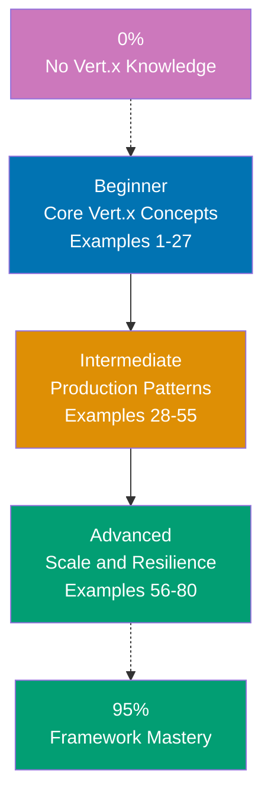

## Want to Master Vert.x Through Working Code?

This guide teaches you Eclipse Vert.x through **80 production-ready code examples** rather than lengthy explanations. If you are an experienced developer switching to Vert.x, or want to deepen your reactive JVM skills, you will build intuition through actual working patterns.

## What Is By-Example Learning?

By-example learning is a **code-first approach** where you learn concepts through annotated, working examples rather than narrative explanations. Each example shows:

1. **What the code does** - Brief explanation of the Vert.x concept
2. **How it works** - A focused, heavily commented code example
3. **Why it matters** - A pattern summary highlighting the key takeaway

This approach works best when you already understand programming fundamentals. You learn Vert.x idioms, patterns, and best practices by studying real code rather than theoretical descriptions.

## What Is Eclipse Vert.x?

Vert.x is a **polyglot toolkit for building reactive applications on the JVM**. Key distinctions:

- **Not a framework**: Vert.x is a toolkit—opinionated about reactivity, unopinionated about architecture
- **Event-loop driven**: A small number of threads handle millions of concurrent connections via non-blocking I/O
- **Polyglot**: First-class support for Java, Kotlin, Groovy, JavaScript, Ruby, and Scala
- **Composable**: Mix verticles, event bus, and web router freely—use only what you need
- **Production-grade**: Used at scale by Red Hat, Deutsche Telekom, and other enterprises

## Learning Path



## Coverage Philosophy: 95% Through 80 Examples

The **95% coverage** means you will understand Vert.x deeply enough to build production systems with confidence. It does not mean you will know every edge case or advanced API—those come with experience.

The 80 examples are organized progressively:

- **Beginner (Examples 1-27)**: Foundation concepts (verticles, HTTP server, routing, request/response, JSON, path params, query params, request body, static files, templates, error handling, event bus basics, configuration, logging)
- **Intermediate (Examples 28-55)**: Production patterns (event bus advanced, Web Router advanced, JWT auth, OAuth2, CORS, file upload, WebSocket, SQL client, reactive patterns, testing, circuit breaker, health checks, sub-routers, middleware chain)
- **Advanced (Examples 56-80)**: Scale and resilience (clustering, HA, service discovery, Micrometer metrics, distributed tracing, gRPC, GraalVM native image, streaming, backpressure, custom codec, worker verticles, shared data, SSL/TLS, Docker deployment, production configuration)

Together, these examples cover **95% of what you will use** in production Vert.x applications.

## What's Covered

### Core Vert.x Concepts

- **Verticles**: Standard, worker, and multi-threaded verticles; deployment options; lifecycle hooks
- **Event Loop**: Non-blocking programming model; golden rule (never block the event loop); thread model
- **Event Bus**: Publish/subscribe, point-to-point, request/reply; local and clustered event bus
- **Futures and Promises**: Composing async operations; `compose`, `onSuccess`, `onFailure`, `all`, `any`

### HTTP and Web

- **HTTP Server**: Creating servers; request/response; status codes; headers; chunked responses
- **Vert.x Web Router**: Route matching; path/query params; body handling; middleware handlers
- **Static Files and Templates**: Static file serving; Handlebars/Thymeleaf templates
- **WebSocket**: Upgrading connections; sending/receiving frames; broadcast patterns
- **File Upload**: Multipart form handling; file persistence; upload validation

### Data and Persistence

- **Vert.x SQL Client**: Reactive PostgreSQL client; parameterized queries; connection pools
- **JSON Handling**: `JsonObject`, `JsonArray`; serialization; codec registration; type mapping
- **Shared Data**: `SharedData`; `LocalMap`; `AsyncMap`; distributed locks

### Security

- **JWT Authentication**: Token generation; route protection; claims extraction
- **OAuth2**: Authorization code flow; token introspection; provider configuration
- **CORS**: Cross-origin policy; preflight handling; allowed origins/headers/methods
- **SSL/TLS**: HTTPS server configuration; certificate handling; mutual TLS

### Testing and Quality

- **Vert.x Unit**: `VertxExtension` for JUnit 5; async test helpers; `TestContext`
- **Integration Testing**: Deploying verticles in tests; real HTTP via WebClient
- **Circuit Breaker**: Half-open state; fallback handlers; metrics integration

### Production and Operations

- **Health Checks**: Liveness/readiness probes; custom procedures; HTTP endpoint exposure
- **Metrics**: Micrometer integration; Prometheus scraping; JVM metrics
- **Distributed Tracing**: OpenTelemetry integration; span propagation; trace sampling
- **Clustering**: Hazelcast cluster manager; distributed event bus; cluster-wide shared data
- **Docker Deployment**: Fat JAR packaging; container configuration; environment variable injection

## What's NOT Covered

We exclude topics that belong in specialized tutorials:

- **Detailed Java syntax**: Master Java fundamentals first through language tutorials
- **Advanced DevOps**: Kubernetes operators, infrastructure-as-code, complex CI/CD pipelines
- **Database internals**: Deep PostgreSQL query planning, advanced replication setups
- **BEAM vs JVM comparison**: Language runtime internals belong in platform comparison guides
- **Framework internals**: How Vert.x schedules event loop threads, Netty internals

For these topics, see dedicated tutorials and framework documentation.

## How to Use This Guide

### 1. Choose Your Starting Point

- **New to Vert.x?** Start with Beginner (Example 1)
- **Framework experience** (Spring Boot, Node.js, Netty)? Start with Intermediate (Example 28)
- **Building a specific feature?** Search for the relevant example topic

### 2. Read the Example

Each example has five parts:

- **Explanation** (2-3 sentences): What Vert.x concept, why it exists, when to use it
- **Diagram** (optional): Visual flow for complex concepts
- **Code** (with heavy comments): Working Java code showing the pattern
- **Key Takeaway** (1-2 sentences): Distilled essence of the pattern
- **Why It Matters** (50-100 words): Production relevance and design rationale

### 3. Run the Code

Create a Vert.x project and run each example:

```bash
# Maven starter
mvn archetype:generate \
  -DarchetypeGroupId=io.vertx \
  -DarchetypeArtifactId=vertx-maven-archetype \
  -DarchetypeVersion=RELEASE

cd my-vertx-project
mvn compile exec:java
```

### 4. Modify and Experiment

Change handler logic, add routes, break things on purpose. Experimentation builds intuition faster than reading.

### 5. Reference as Needed

Use this guide as a reference when building features. Search for relevant examples and adapt patterns to your code.

## Relationship to Other Tutorial Types

| Tutorial Type               | Approach                       | Coverage                   | Best For                       | Why Different                       |
| --------------------------- | ------------------------------ | -------------------------- | ------------------------------ | ----------------------------------- |
| **By Example** (this guide) | Code-first, 80 examples        | 95% breadth                | Learning framework idioms      | Emphasizes patterns through code    |
| **Quick Start**             | Project-based, hands-on        | 5-30% touchpoints          | Getting something working fast | Linear project flow, minimal theory |
| **Beginner Tutorial**       | Narrative, explanation-first   | 0-60% comprehensive        | Understanding concepts deeply  | Detailed explanations, slower pace  |
| **Intermediate Tutorial**   | Problem-solving, practical     | 60-85% production patterns | Building real features         | Focus on common problems            |
| **Advanced Tutorial**       | Specialized topics, deep dives | 85-95% expert mastery      | Optimizing, scaling, internals | Advanced edge cases                 |
| **Cookbook**                | Recipe-based, problem-solution | Problem-specific           | Solving specific problems      | Quick solutions, minimal context    |

## Prerequisites

### Required

- **Java fundamentals**: Classes, interfaces, generics, lambdas, streams
- **Web development**: HTTP basics, REST concepts, JSON
- **Programming experience**: You have built applications before in another language

### Recommended

- **Maven or Gradle**: Build tool familiarity for dependency management
- **Relational databases**: SQL basics, schema design, JDBC concepts
- **Async programming**: Basic understanding of callbacks, futures, or promises

### Not Required

- **Vert.x experience**: This guide assumes you are new to the framework
- **Netty knowledge**: Vert.x wraps Netty; you do not need to know Netty internals
- **Reactive Streams**: Helpful context but not required to start

## Learning Strategies

Different developer backgrounds benefit from customized learning paths. Choose the strategy matching your experience:

### For Spring Boot Developers Switching to Vert.x

You know the JVM and HTTP concepts. Focus on the reactive mental model shift:

- **Understand the event loop first** (Examples 1-3) - The single biggest conceptual shift from Spring's thread-per-request model
- **Learn Futures** (Examples 4-5) - Replaces Spring's `@Async` and `CompletableFuture` with composable reactive chains
- **Map annotations to handlers** - Spring `@GetMapping` maps to `router.get("/path", handler)`; no reflection at runtime
- **Recommended path**: Examples 1-10 (core concepts) → Examples 28-35 (advanced routing and auth) → Examples 56-65 (clustering and metrics)

### For Node.js Developers Switching to Vert.x

The event-loop model is familiar. Focus on JVM patterns and type safety:

- **Map callbacks to handlers** - Vert.x handlers are similar to Node.js callbacks but type-safe
- **Learn verticles** (Examples 1-2) - Similar to Node.js modules/services but with isolation and messaging
- **Understand the event bus** (Examples 13-15) - Powerful alternative to Node.js EventEmitter
- **Recommended path**: Examples 1-15 (Vert.x fundamentals) → Examples 28-40 (production patterns) → Examples 56-70 (clustering and native)

### For Java EE/Jakarta EE Developers Switching to Vert.x

You know Java deeply. Focus on non-blocking I/O and reactive composition:

- **Abandon blocking I/O** - No JDBC, no synchronized blocks, no Thread.sleep in event-loop context
- **Learn Vert.x SQL client** (Examples 43-46) - Replaces JDBC with fully async database access
- **Understand deployment** (Examples 1-2) - Verticles replace EJBs/CDI beans; lighter and more explicit
- **Recommended path**: Examples 1-8 (core) → Examples 43-55 (data and testing) → Examples 56-80 (advanced)

### For Complete Framework Beginners

You know Java but have never built a web service. Take a methodical approach:

- **Follow sequential order** - Examples 1-80 in order; each builds on previous concepts
- **Run every example** - Paste code into a project; watch it work before moving on
- **Build small projects** - After Beginner examples, build a simple REST API to consolidate learning
- **Recommended path**: Examples 1-27 (Beginner) → Build simple REST API → Examples 28-55 (Intermediate) → Build authenticated WebSocket service → Examples 56-80 (Advanced)

## Structure of Each Example

All examples follow a consistent 5-part format:

````
### Example N: Descriptive Title

2-3 sentence explanation of the concept.

[Optional Mermaid diagram for complex flows]

```java
// Heavily annotated code example
// showing the Vert.x pattern in action
````

**Key Takeaway**: 1-2 sentence summary.

**Why It Matters**: 50-100 words explaining production relevance.

```

**Code annotations**:

- `// =>` shows expected output or result
- Inline comments explain what each line does
- Variable names are self-documenting

**Mermaid diagrams** appear when visualizing flow or architecture improves understanding. We use a color-blind friendly palette:

- Blue #0173B2 - Primary
- Orange #DE8F05 - Secondary
- Teal #029E73 - Accent
- Purple #CC78BC - Alternative
- Brown #CA9161 - Neutral

## Ready to Start?

Choose your learning path:

- **[Beginner](/en/learn/software-engineering/platform-web/tools/jvm-vertx/by-example/beginner)** - Start here if new to Vert.x. Build foundation understanding through 27 core examples.
- **[Intermediate](/en/learn/software-engineering/platform-web/tools/jvm-vertx/by-example/intermediate)** - Jump here if you know Vert.x basics. Master production patterns through 28 examples.
- **[Advanced](/en/learn/software-engineering/platform-web/tools/jvm-vertx/by-example/advanced)** - Expert mastery through 25 advanced examples covering clustering, metrics, and deployment.

Or jump to specific topics by searching for relevant example keywords (routing, JWT, WebSocket, SQL, clustering, GraalVM, etc.).
```

## Examples by Level

### Beginner (Examples 1–27)

- [Example 1: Creating and Deploying a Verticle](/en/learn/software-engineering/platform-web/tools/jvm-vertx/by-example/beginner#example-1-creating-and-deploying-a-verticle)
- [Example 2: The Event Loop Golden Rule](/en/learn/software-engineering/platform-web/tools/jvm-vertx/by-example/beginner#example-2-the-event-loop-golden-rule)
- [Example 3: Deploying Multiple Verticle Instances](/en/learn/software-engineering/platform-web/tools/jvm-vertx/by-example/beginner#example-3-deploying-multiple-verticle-instances)
- [Example 4: Futures and Async Composition](/en/learn/software-engineering/platform-web/tools/jvm-vertx/by-example/beginner#example-4-futures-and-async-composition)
- [Example 5: Creating an HTTP Server](/en/learn/software-engineering/platform-web/tools/jvm-vertx/by-example/beginner#example-5-creating-an-http-server)
- [Example 6: Using Vert.x Web Router](/en/learn/software-engineering/platform-web/tools/jvm-vertx/by-example/beginner#example-6-using-vertx-web-router)
- [Example 7: Path Parameters and Query Parameters](/en/learn/software-engineering/platform-web/tools/jvm-vertx/by-example/beginner#example-7-path-parameters-and-query-parameters)
- [Example 8: Reading the Request Body](/en/learn/software-engineering/platform-web/tools/jvm-vertx/by-example/beginner#example-8-reading-the-request-body)
- [Example 9: Sending JSON Responses](/en/learn/software-engineering/platform-web/tools/jvm-vertx/by-example/beginner#example-9-sending-json-responses)
- [Example 10: HTTP Status Codes and Response Headers](/en/learn/software-engineering/platform-web/tools/jvm-vertx/by-example/beginner#example-10-http-status-codes-and-response-headers)
- [Example 11: JsonObject Deep Dive](/en/learn/software-engineering/platform-web/tools/jvm-vertx/by-example/beginner#example-11-jsonobject-deep-dive)
- [Example 12: Serving Static Files](/en/learn/software-engineering/platform-web/tools/jvm-vertx/by-example/beginner#example-12-serving-static-files)
- [Example 13: Route-Level and Global Error Handlers](/en/learn/software-engineering/platform-web/tools/jvm-vertx/by-example/beginner#example-13-route-level-and-global-error-handlers)
- [Example 14: Custom Exception Types and Error Codes](/en/learn/software-engineering/platform-web/tools/jvm-vertx/by-example/beginner#example-14-custom-exception-types-and-error-codes)
- [Example 15: Event Bus Point-to-Point Messaging](/en/learn/software-engineering/platform-web/tools/jvm-vertx/by-example/beginner#example-15-event-bus-point-to-point-messaging)
- [Example 16: Event Bus Publish/Subscribe](/en/learn/software-engineering/platform-web/tools/jvm-vertx/by-example/beginner#example-16-event-bus-publishsubscribe)
- [Example 17: Application Configuration](/en/learn/software-engineering/platform-web/tools/jvm-vertx/by-example/beginner#example-17-application-configuration)
- [Example 18: Structured Logging with SLF4J](/en/learn/software-engineering/platform-web/tools/jvm-vertx/by-example/beginner#example-18-structured-logging-with-slf4j)
- [Example 19: Handlebars Templates](/en/learn/software-engineering/platform-web/tools/jvm-vertx/by-example/beginner#example-19-handlebars-templates)
- [Example 20: HTML Form Handling](/en/learn/software-engineering/platform-web/tools/jvm-vertx/by-example/beginner#example-20-html-form-handling)
- [Example 21: Request Timeout Handling](/en/learn/software-engineering/platform-web/tools/jvm-vertx/by-example/beginner#example-21-request-timeout-handling)
- [Example 22: Content Negotiation](/en/learn/software-engineering/platform-web/tools/jvm-vertx/by-example/beginner#example-22-content-negotiation)
- [Example 23: Response Compression](/en/learn/software-engineering/platform-web/tools/jvm-vertx/by-example/beginner#example-23-response-compression)
- [Example 24: Basic Health Check Endpoint](/en/learn/software-engineering/platform-web/tools/jvm-vertx/by-example/beginner#example-24-basic-health-check-endpoint)
- [Example 25: Worker Verticles for Blocking Operations](/en/learn/software-engineering/platform-web/tools/jvm-vertx/by-example/beginner#example-25-worker-verticles-for-blocking-operations)
- [Example 26: Verticle-to-Verticle Coordination with Future.join](/en/learn/software-engineering/platform-web/tools/jvm-vertx/by-example/beginner#example-26-verticle-to-verticle-coordination-with-futurejoin)
- [Example 27: Graceful Shutdown](/en/learn/software-engineering/platform-web/tools/jvm-vertx/by-example/beginner#example-27-graceful-shutdown)

### Intermediate (Examples 28–55)

- [Example 28: Event Bus with Codecs](/en/learn/software-engineering/platform-web/tools/jvm-vertx/by-example/intermediate#example-28-event-bus-with-codecs)
- [Example 29: Event Bus Headers and Message Interceptors](/en/learn/software-engineering/platform-web/tools/jvm-vertx/by-example/intermediate#example-29-event-bus-headers-and-message-interceptors)
- [Example 30: Sub-Routers and Modular Route Organization](/en/learn/software-engineering/platform-web/tools/jvm-vertx/by-example/intermediate#example-30-sub-routers-and-modular-route-organization)
- [Example 31: Handler Chains and Middleware](/en/learn/software-engineering/platform-web/tools/jvm-vertx/by-example/intermediate#example-31-handler-chains-and-middleware)
- [Example 32: JWT Authentication](/en/learn/software-engineering/platform-web/tools/jvm-vertx/by-example/intermediate#example-32-jwt-authentication)
- [Example 33: Role-Based Authorization](/en/learn/software-engineering/platform-web/tools/jvm-vertx/by-example/intermediate#example-33-role-based-authorization)
- [Example 34: CORS Configuration](/en/learn/software-engineering/platform-web/tools/jvm-vertx/by-example/intermediate#example-34-cors-configuration)
- [Example 35: File Upload Handling](/en/learn/software-engineering/platform-web/tools/jvm-vertx/by-example/intermediate#example-35-file-upload-handling)
- [Example 36: WebSocket Server](/en/learn/software-engineering/platform-web/tools/jvm-vertx/by-example/intermediate#example-36-websocket-server)
- [Example 37: Reactive PostgreSQL Client - Connection Pool](/en/learn/software-engineering/platform-web/tools/jvm-vertx/by-example/intermediate#example-37-reactive-postgresql-client---connection-pool)
- [Example 38: Parameterized Queries and Row Mapping](/en/learn/software-engineering/platform-web/tools/jvm-vertx/by-example/intermediate#example-38-parameterized-queries-and-row-mapping)
- [Example 39: Database Transactions](/en/learn/software-engineering/platform-web/tools/jvm-vertx/by-example/intermediate#example-39-database-transactions)
- [Example 40: JUnit 5 with VertxExtension](/en/learn/software-engineering/platform-web/tools/jvm-vertx/by-example/intermediate#example-40-junit-5-with-vertxextension)
- [Example 41: Testing with WebClient and Mocking the Event Bus](/en/learn/software-engineering/platform-web/tools/jvm-vertx/by-example/intermediate#example-41-testing-with-webclient-and-mocking-the-event-bus)
- [Example 42: Circuit Breaker](/en/learn/software-engineering/platform-web/tools/jvm-vertx/by-example/intermediate#example-42-circuit-breaker)
- [Example 43: Rate Limiting with Vert.x Web](/en/learn/software-engineering/platform-web/tools/jvm-vertx/by-example/intermediate#example-43-rate-limiting-with-vertx-web)
- [Example 44: Request Validation with Vert.x Web Validator](/en/learn/software-engineering/platform-web/tools/jvm-vertx/by-example/intermediate#example-44-request-validation-with-vertx-web-validator)
- [Example 45: Serving Compressed and Cached Static Assets](/en/learn/software-engineering/platform-web/tools/jvm-vertx/by-example/intermediate#example-45-serving-compressed-and-cached-static-assets)
- [Example 46: executeBlocking and Thread Pool Management](/en/learn/software-engineering/platform-web/tools/jvm-vertx/by-example/intermediate#example-46-executeblocking-and-thread-pool-management)
- [Example 47: Periodic Tasks and Scheduled Jobs](/en/learn/software-engineering/platform-web/tools/jvm-vertx/by-example/intermediate#example-47-periodic-tasks-and-scheduled-jobs)
- [Example 48: Service Proxy Code Generation](/en/learn/software-engineering/platform-web/tools/jvm-vertx/by-example/intermediate#example-48-service-proxy-code-generation)
- [Example 49: Session Management with Vert.x Web](/en/learn/software-engineering/platform-web/tools/jvm-vertx/by-example/intermediate#example-49-session-management-with-vertx-web)
- [Example 50: Response Caching with Cache Headers](/en/learn/software-engineering/platform-web/tools/jvm-vertx/by-example/intermediate#example-50-response-caching-with-cache-headers)
- [Example 51: Micrometer Metrics Integration](/en/learn/software-engineering/platform-web/tools/jvm-vertx/by-example/intermediate#example-51-micrometer-metrics-integration)
- [Example 52: Distributed Tracing with OpenTelemetry](/en/learn/software-engineering/platform-web/tools/jvm-vertx/by-example/intermediate#example-52-distributed-tracing-with-opentelemetry)
- [Example 53: Health Checks with Vert.x Health](/en/learn/software-engineering/platform-web/tools/jvm-vertx/by-example/intermediate#example-53-health-checks-with-vertx-health)
- [Example 54: WebClient for HTTP Service Calls](/en/learn/software-engineering/platform-web/tools/jvm-vertx/by-example/intermediate#example-54-webclient-for-http-service-calls)
- [Example 55: Reactive Streams with Vert.x Streams API](/en/learn/software-engineering/platform-web/tools/jvm-vertx/by-example/intermediate#example-55-reactive-streams-with-vertx-streams-api)

### Advanced (Examples 56–80)

- [Example 56: Clustered Vert.x with Hazelcast](/en/learn/software-engineering/platform-web/tools/jvm-vertx/by-example/advanced#example-56-clustered-vertx-with-hazelcast)
- [Example 57: High Availability and Failover](/en/learn/software-engineering/platform-web/tools/jvm-vertx/by-example/advanced#example-57-high-availability-and-failover)
- [Example 58: Cluster-Wide Shared Data](/en/learn/software-engineering/platform-web/tools/jvm-vertx/by-example/advanced#example-58-cluster-wide-shared-data)
- [Example 59: Vert.x Service Discovery](/en/learn/software-engineering/platform-web/tools/jvm-vertx/by-example/advanced#example-59-vertx-service-discovery)
- [Example 60: gRPC Server with Vert.x](/en/learn/software-engineering/platform-web/tools/jvm-vertx/by-example/advanced#example-60-grpc-server-with-vertx)
- [Example 61: Preparing Vert.x for GraalVM Native Image](/en/learn/software-engineering/platform-web/tools/jvm-vertx/by-example/advanced#example-61-preparing-vertx-for-graalvm-native-image)
- [Example 62: HTTPS Server with TLS Configuration](/en/learn/software-engineering/platform-web/tools/jvm-vertx/by-example/advanced#example-62-https-server-with-tls-configuration)
- [Example 63: Mutual TLS (mTLS) for Service-to-Service Authentication](/en/learn/software-engineering/platform-web/tools/jvm-vertx/by-example/advanced#example-63-mutual-tls-mtls-for-service-to-service-authentication)
- [Example 64: Environment-Based Configuration for Docker](/en/learn/software-engineering/platform-web/tools/jvm-vertx/by-example/advanced#example-64-environment-based-configuration-for-docker)
- [Example 65: Fat JAR and Docker Deployment](/en/learn/software-engineering/platform-web/tools/jvm-vertx/by-example/advanced#example-65-fat-jar-and-docker-deployment)
- [Example 66: Vert.x SQL Client with Connection Leasing](/en/learn/software-engineering/platform-web/tools/jvm-vertx/by-example/advanced#example-66-vertx-sql-client-with-connection-leasing)
- [Example 67: Backpressure-Aware Message Processing](/en/learn/software-engineering/platform-web/tools/jvm-vertx/by-example/advanced#example-67-backpressure-aware-message-processing)
- [Example 68: Multi-Threaded Worker Verticles](/en/learn/software-engineering/platform-web/tools/jvm-vertx/by-example/advanced#example-68-multi-threaded-worker-verticles)
- [Example 69: Vert.x with Kotlin Coroutines](/en/learn/software-engineering/platform-web/tools/jvm-vertx/by-example/advanced#example-69-vertx-with-kotlin-coroutines)
- [Example 70: Request ID Propagation and Correlation](/en/learn/software-engineering/platform-web/tools/jvm-vertx/by-example/advanced#example-70-request-id-propagation-and-correlation)
- [Example 71: Graceful Degradation and Fallback Strategies](/en/learn/software-engineering/platform-web/tools/jvm-vertx/by-example/advanced#example-71-graceful-degradation-and-fallback-strategies)
- [Example 72: Connection Pool Tuning and Monitoring](/en/learn/software-engineering/platform-web/tools/jvm-vertx/by-example/advanced#example-72-connection-pool-tuning-and-monitoring)
- [Example 73: SSL Certificate Hot Reload](/en/learn/software-engineering/platform-web/tools/jvm-vertx/by-example/advanced#example-73-ssl-certificate-hot-reload)
- [Example 74: Observability Stack Integration](/en/learn/software-engineering/platform-web/tools/jvm-vertx/by-example/advanced#example-74-observability-stack-integration)
- [Example 75: Zero-Downtime Deployment with Canary Releases](/en/learn/software-engineering/platform-web/tools/jvm-vertx/by-example/advanced#example-75-zero-downtime-deployment-with-canary-releases)
- [Example 76: Custom Serialization with Jackson](/en/learn/software-engineering/platform-web/tools/jvm-vertx/by-example/advanced#example-76-custom-serialization-with-jackson)
- [Example 77: Async Retry with Exponential Backoff](/en/learn/software-engineering/platform-web/tools/jvm-vertx/by-example/advanced#example-77-async-retry-with-exponential-backoff)
- [Example 78: API Versioning Strategy](/en/learn/software-engineering/platform-web/tools/jvm-vertx/by-example/advanced#example-78-api-versioning-strategy)
- [Example 79: Long Polling as Real-Time Alternative](/en/learn/software-engineering/platform-web/tools/jvm-vertx/by-example/advanced#example-79-long-polling-as-real-time-alternative)
- [Example 80: Production Readiness Checklist Verticle](/en/learn/software-engineering/platform-web/tools/jvm-vertx/by-example/advanced#example-80-production-readiness-checklist-verticle)
