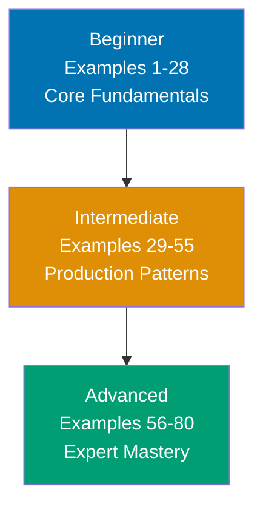

**Want to quickly master OpenAPI 3.x through working examples?** This by-example guide teaches 95% of the OpenAPI Specification through 80 annotated YAML examples organized by complexity level.

## What Is By-Example Learning?

By-example learning is an **example-first approach** where you learn through annotated, self-contained YAML snippets rather than narrative explanations. Each example is a valid OpenAPI fragment, heavily commented to show:

- **What each field does** - Inline comments explain the purpose and semantics
- **Expected behaviors** - Using `# =>` notation to show how tools interpret the spec
- **Structural relationships** - How fields reference and compose with each other
- **Key takeaways** - 1-2 sentence summaries of core concepts

This approach is **ideal for experienced developers** (backend engineers, API designers, DevOps engineers, or frontend developers consuming APIs) who understand HTTP and REST concepts and want to quickly understand OpenAPI's structure, features, and patterns through working specification fragments.

Unlike narrative tutorials that build understanding through explanation and storytelling, by-example learning lets you **see the spec first, validate it second, and understand it through direct experimentation**. You learn by writing specs, not by reading about writing specs.

## Learning Path



Progress from specification fundamentals through production API patterns to advanced tooling and workflow integration. Each level builds on the previous, increasing in sophistication and introducing more specification features.

## Coverage Philosophy

This by-example guide provides **95% coverage of OpenAPI 3.x** (both 3.0 and 3.1) through practical, annotated examples. The 95% figure represents the depth and breadth of concepts covered, not a time estimate -- focus is on **outcomes and understanding**, not duration.

### What's Covered

- **Specification structure** - openapi version, info object, servers, paths, components
- **Path items and operations** - GET, POST, PUT, DELETE, PATCH with parameters and bodies
- **Parameters** - Path, query, header, cookie parameters with serialization styles
- **Request bodies and responses** - Media types, content negotiation, status codes
- **Schema definitions** - All JSON Schema types, constraints, formats, nullable
- **Schema composition** - allOf, oneOf, anyOf, not, discriminator, polymorphism
- **Reusable components** - Schemas, parameters, request bodies, responses, headers, examples, links, callbacks
- **Security schemes** - API key, HTTP bearer, OAuth2, OpenID Connect, scoped security
- **Webhooks** - Server-to-client callback definitions (3.1 feature)
- **Specification extensions** - Custom x- properties for tooling integration
- **Tooling integration** - Code generation, documentation, linting, mock servers, SDK generation
- **API design patterns** - Versioning, pagination, error handling, HATEOAS, contract-first workflows

### What's NOT Covered

This guide focuses on **learning the specification**, not problem-solving recipes or production deployment. For additional topics:

- **Specific framework integrations** - Spring Boot OpenAPI, FastAPI auto-generation internals
- **Legacy Swagger 2.0** - This guide covers OpenAPI 3.0 and 3.1 only
- **GraphQL or gRPC** - OpenAPI is REST/HTTP focused

The 95% coverage goal maintains humility -- no tutorial can cover everything. This guide teaches the **core concepts that unlock the remaining 5%** through your own exploration and project work.

## How to Use This Guide

1. **Sequential or selective** - Read examples in order for progressive learning, or jump to specific topics when you need to define a particular API pattern
2. **Validate everything** - Paste examples into the [Swagger Editor](https://editor.swagger.io/) or run them through a linter to see validation results yourself
3. **Modify and explore** - Change schemas, add endpoints, break validation intentionally. Learn through experimentation.
4. **Use as reference** - Bookmark examples for quick lookups when you forget syntax or patterns
5. **Complement with narrative tutorials** - By-example learning is spec-first; pair with comprehensive tutorials for deeper explanations of API design philosophy

**Best workflow**: Open your editor in one window, this guide in another, and a validator (Swagger Editor or Spectral CLI) in a third. Validate each example as you read it. When you encounter something unfamiliar, modify the example and observe how validators respond.

## Relationship to Other Tutorials

Understanding where by-example fits in the tutorial ecosystem helps you choose the right learning path:

| Tutorial Type   | Coverage                | Approach                       | Target Audience               | When to Use                                        |
| --------------- | ----------------------- | ------------------------------ | ----------------------------- | -------------------------------------------------- |
| **By Example**  | 95% through 80 examples | Code-first, annotated examples | Experienced developers        | Quick spec pickup, reference, API design switching |
| **Quick Start** | 5-30% touchpoints       | Hands-on first spec            | Newcomers to OpenAPI          | First taste, decide if worth learning              |
| **Beginner**    | 0-60% comprehensive     | Narrative, explanatory         | Complete API design beginners | Deep understanding, first API specification        |
| **Cookbook**    | Problem-specific        | Recipe-based                   | All levels                    | Solve specific API design problems                 |

**By Example vs. Quick Start**: By Example provides 95% coverage through examples vs. Quick Start's 5-30% through your first spec. By Example is spec-first reference; Quick Start is hands-on introduction.

**By Example vs. Beginner Tutorial**: By Example is spec-first for experienced developers; Beginner Tutorial is narrative-first for complete API design beginners. By Example shows patterns; Beginner Tutorial explains concepts.

**By Example vs. Cookbook**: By Example is learning-oriented (understand the spec); Cookbook is problem-solving oriented (design specific API patterns). By Example teaches spec features; Cookbook provides solutions.

## Prerequisites

**Required**:

- Experience with REST APIs (making HTTP requests, understanding status codes)
- Familiarity with YAML syntax (indentation, key-value pairs, lists)
- Basic understanding of JSON Schema concepts (types, properties, required)

**Recommended (helpful but not required)**:

- Experience designing or documenting APIs
- Familiarity with Swagger 2.0 or earlier OpenAPI versions
- Understanding of HTTP methods, headers, and content types

**No prior OpenAPI experience required** - This guide assumes you are new to the OpenAPI Specification but experienced with HTTP APIs and web development in general. You should be comfortable reading YAML, understanding REST conventions (resources, methods, status codes), and learning through hands-on experimentation.

## Structure of Each Example

Every example follows a **mandatory five-part format**:

````markdown
### Example N: Concept Name

**Part 1: Brief Explanation** (2-3 sentences)
Explains what the concept is, why it matters in API design, and when to use it.

**Part 2: Mermaid Diagram** (when appropriate)
Visual representation of concept relationships - spec structure, schema
composition, or security flows. Not every example needs a diagram; they are used
strategically to enhance understanding.

**Part 3: Heavily Annotated Code**

```yaml
# => This is a valid OpenAPI fragment
openapi: "3.1.0"
# => Specifies the OpenAPI version
# => Tells tooling how to interpret this document

info:
  # => Metadata about the API
  title: Example API
  # => Human-readable API name
  version: "1.0.0"
  # => API version (not OpenAPI version)
```

**Part 4: Key Takeaway** (1-2 sentences)
Distills the core insight: the most important pattern, when to apply it in
production, or common pitfalls to avoid.

**Part 5: Why It Matters** (2-3 sentences, 50-100 words)
Connects the concept to production relevance - why professionals care, how it
compares to alternatives, and consequences for API quality.
````

Each example follows this structure consistently, maintaining annotation density of 1.0-2.25 comment lines per code line. The **brief explanation** provides context, the **code** is heavily annotated with inline comments and `# =>` output notation, the **key takeaway** distills the concept, and **why it matters** shows production relevance.

## Learning Strategies

### For Backend Developers

You build APIs daily and want to formalize your designs. OpenAPI makes implicit contracts explicit:

- **Schema precision**: Define exact request/response shapes with validation constraints
- **Code generation**: Generate server stubs, client SDKs, and documentation from one source
- **Contract-first development**: Design the API before writing implementation code

Focus on Examples 1-15 (spec fundamentals) and Examples 29-40 (schema composition and reusable components) to formalize your existing API knowledge.

### For Frontend Developers

You consume APIs and need reliable, typed client code. OpenAPI provides the contract:

- **Type safety**: Generated client code matches the API contract exactly
- **Mock servers**: Generate mock responses for development before the backend is ready
- **Documentation**: Interactive docs (Swagger UI, Redoc) let you explore APIs visually

Focus on Examples 16-28 (parameters, request bodies, responses) and Examples 56-65 (code generation and tooling) to improve your API consumption workflow.

### For API Designers

You design APIs as a primary responsibility. OpenAPI is your specification language:

- **Completeness**: Every HTTP detail (headers, query params, auth, errors) in one document
- **Standardization**: Industry-standard format understood by all tooling
- **Governance**: Lint rules enforce design consistency across teams

Focus on Examples 40-55 (security, patterns, webhooks) and Examples 66-80 (linting, versioning, contract-first workflows) to elevate your design practice.

### For DevOps Engineers

You manage API gateways, documentation portals, and CI pipelines. OpenAPI integrates with your tooling:

- **Gateway configuration**: Generate API gateway routes from the spec
- **CI validation**: Lint specs in pull requests to catch breaking changes
- **Documentation deployment**: Auto-generate and deploy API docs from spec changes

Focus on Examples 56-80 (tooling, linting, CI/CD integration, multi-file specs) to integrate OpenAPI into your infrastructure.

## Code-First Philosophy

This tutorial prioritizes working specification fragments over theoretical discussion:

- **No lengthy prose**: Concepts are demonstrated, not explained at length
- **Valid fragments**: Every example is a valid OpenAPI YAML snippet or complete document
- **Learn by validating**: Understanding comes from validating and modifying specs
- **Pattern recognition**: See the same patterns in different contexts across 80 examples

If you prefer narrative explanations, complement this guide with comprehensive tutorials. By-example learning works best when you learn through experimentation.

## Ready to Start?

Jump into the beginner examples to start learning OpenAPI through spec fragments:

- [Beginner Examples (1-28)](/en/learn/software-engineering/platform-web/tools/openapi/by-example/beginner) - Core fundamentals, paths, operations, parameters, schemas
- [Intermediate Examples (29-55)](/en/learn/software-engineering/platform-web/tools/openapi/by-example/intermediate) - Schema composition, reusable components, security, webhooks
- [Advanced Examples (56-80)](/en/learn/software-engineering/platform-web/tools/openapi/by-example/advanced) - Tooling, code generation, linting, contract-first workflows

Each example is self-contained and valid. Start with Example 1, or jump to topics that interest you most.

## Examples by Level

### Beginner (Examples 1–28)

- [Example 1: Minimal Valid OpenAPI Document](/en/learn/software-engineering/platform-web/tools/openapi/by-example/beginner#example-1-minimal-valid-openapi-document)
- [Example 2: Rich Info Object with Contact and License](/en/learn/software-engineering/platform-web/tools/openapi/by-example/beginner#example-2-rich-info-object-with-contact-and-license)
- [Example 3: Server Definitions](/en/learn/software-engineering/platform-web/tools/openapi/by-example/beginner#example-3-server-definitions)
- [Example 4: Server Variables for Dynamic URLs](/en/learn/software-engineering/platform-web/tools/openapi/by-example/beginner#example-4-server-variables-for-dynamic-urls)
- [Example 5: Tags for Grouping Operations](/en/learn/software-engineering/platform-web/tools/openapi/by-example/beginner#example-5-tags-for-grouping-operations)
- [Example 6: Basic GET Operation](/en/learn/software-engineering/platform-web/tools/openapi/by-example/beginner#example-6-basic-get-operation)
- [Example 7: POST Operation with Request Body](/en/learn/software-engineering/platform-web/tools/openapi/by-example/beginner#example-7-post-operation-with-request-body)
- [Example 8: PUT Operation for Full Resource Update](/en/learn/software-engineering/platform-web/tools/openapi/by-example/beginner#example-8-put-operation-for-full-resource-update)
- [Example 9: PATCH Operation for Partial Update](/en/learn/software-engineering/platform-web/tools/openapi/by-example/beginner#example-9-patch-operation-for-partial-update)
- [Example 10: DELETE Operation](/en/learn/software-engineering/platform-web/tools/openapi/by-example/beginner#example-10-delete-operation)
- [Example 11: Multiple Operations on One Path](/en/learn/software-engineering/platform-web/tools/openapi/by-example/beginner#example-11-multiple-operations-on-one-path)
- [Example 12: Summary vs Description in Operations](/en/learn/software-engineering/platform-web/tools/openapi/by-example/beginner#example-12-summary-vs-description-in-operations)
- [Example 13: Path Parameters](/en/learn/software-engineering/platform-web/tools/openapi/by-example/beginner#example-13-path-parameters)
- [Example 14: Query Parameters](/en/learn/software-engineering/platform-web/tools/openapi/by-example/beginner#example-14-query-parameters)
- [Example 15: Header Parameters](/en/learn/software-engineering/platform-web/tools/openapi/by-example/beginner#example-15-header-parameters)
- [Example 16: Cookie Parameters](/en/learn/software-engineering/platform-web/tools/openapi/by-example/beginner#example-16-cookie-parameters)
- [Example 17: Required vs Optional Parameters](/en/learn/software-engineering/platform-web/tools/openapi/by-example/beginner#example-17-required-vs-optional-parameters)
- [Example 18: Parameter Schema with Constraints](/en/learn/software-engineering/platform-web/tools/openapi/by-example/beginner#example-18-parameter-schema-with-constraints)
- [Example 19: Request Body with Multiple Media Types](/en/learn/software-engineering/platform-web/tools/openapi/by-example/beginner#example-19-request-body-with-multiple-media-types)
- [Example 20: Response with Headers](/en/learn/software-engineering/platform-web/tools/openapi/by-example/beginner#example-20-response-with-headers)
- [Example 21: Multiple Response Status Codes](/en/learn/software-engineering/platform-web/tools/openapi/by-example/beginner#example-21-multiple-response-status-codes)
- [Example 22: Default Response for Unexpected Errors](/en/learn/software-engineering/platform-web/tools/openapi/by-example/beginner#example-22-default-response-for-unexpected-errors)
- [Example 23: Primitive Schema Types](/en/learn/software-engineering/platform-web/tools/openapi/by-example/beginner#example-23-primitive-schema-types)
- [Example 24: Object Schema with Nested Properties](/en/learn/software-engineering/platform-web/tools/openapi/by-example/beginner#example-24-object-schema-with-nested-properties)
- [Example 25: Array Schema with Item Constraints](/en/learn/software-engineering/platform-web/tools/openapi/by-example/beginner#example-25-array-schema-with-item-constraints)
- [Example 26: Enum Values and Constant Fields](/en/learn/software-engineering/platform-web/tools/openapi/by-example/beginner#example-26-enum-values-and-constant-fields)
- [Example 27: Basic $ref for Schema Reuse](/en/learn/software-engineering/platform-web/tools/openapi/by-example/beginner#example-27-basic-ref-for-schema-reuse)
- [Example 28: Nullable and Optional Fields](/en/learn/software-engineering/platform-web/tools/openapi/by-example/beginner#example-28-nullable-and-optional-fields)

### Intermediate (Examples 29–55)

- [Example 29: allOf for Schema Inheritance](/en/learn/software-engineering/platform-web/tools/openapi/by-example/intermediate#example-29-allof-for-schema-inheritance)
- [Example 30: oneOf for Polymorphic Responses](/en/learn/software-engineering/platform-web/tools/openapi/by-example/intermediate#example-30-oneof-for-polymorphic-responses)
- [Example 31: anyOf for Flexible Matching](/en/learn/software-engineering/platform-web/tools/openapi/by-example/intermediate#example-31-anyof-for-flexible-matching)
- [Example 32: not for Schema Exclusion](/en/learn/software-engineering/platform-web/tools/openapi/by-example/intermediate#example-32-not-for-schema-exclusion)
- [Example 33: Discriminator for Polymorphic Deserialization](/en/learn/software-engineering/platform-web/tools/openapi/by-example/intermediate#example-33-discriminator-for-polymorphic-deserialization)
- [Example 34: allOf with Additional Properties](/en/learn/software-engineering/platform-web/tools/openapi/by-example/intermediate#example-34-allof-with-additional-properties)
- [Example 35: Nested oneOf for Complex Polymorphism](/en/learn/software-engineering/platform-web/tools/openapi/by-example/intermediate#example-35-nested-oneof-for-complex-polymorphism)
- [Example 36: Combining allOf and oneOf](/en/learn/software-engineering/platform-web/tools/openapi/by-example/intermediate#example-36-combining-allof-and-oneof)
- [Example 37: Reusable Parameters](/en/learn/software-engineering/platform-web/tools/openapi/by-example/intermediate#example-37-reusable-parameters)
- [Example 38: Reusable Request Bodies](/en/learn/software-engineering/platform-web/tools/openapi/by-example/intermediate#example-38-reusable-request-bodies)
- [Example 39: Reusable Responses](/en/learn/software-engineering/platform-web/tools/openapi/by-example/intermediate#example-39-reusable-responses)
- [Example 40: Reusable Headers](/en/learn/software-engineering/platform-web/tools/openapi/by-example/intermediate#example-40-reusable-headers)
- [Example 41: Reusable Examples](/en/learn/software-engineering/platform-web/tools/openapi/by-example/intermediate#example-41-reusable-examples)
- [Example 42: Links Between Operations](/en/learn/software-engineering/platform-web/tools/openapi/by-example/intermediate#example-42-links-between-operations)
- [Example 43: API Key Authentication](/en/learn/software-engineering/platform-web/tools/openapi/by-example/intermediate#example-43-api-key-authentication)
- [Example 44: HTTP Bearer Token Authentication](/en/learn/software-engineering/platform-web/tools/openapi/by-example/intermediate#example-44-http-bearer-token-authentication)
- [Example 45: OAuth2 Security Flows](/en/learn/software-engineering/platform-web/tools/openapi/by-example/intermediate#example-45-oauth2-security-flows)
- [Example 46: OpenID Connect Discovery](/en/learn/software-engineering/platform-web/tools/openapi/by-example/intermediate#example-46-openid-connect-discovery)
- [Example 47: Multiple Security Schemes (AND/OR)](/en/learn/software-engineering/platform-web/tools/openapi/by-example/intermediate#example-47-multiple-security-schemes-andor)
- [Example 48: File Upload with Multipart Form](/en/learn/software-engineering/platform-web/tools/openapi/by-example/intermediate#example-48-file-upload-with-multipart-form)
- [Example 49: Content Negotiation](/en/learn/software-engineering/platform-web/tools/openapi/by-example/intermediate#example-49-content-negotiation)
- [Example 50: Pagination Response Pattern](/en/learn/software-engineering/platform-web/tools/openapi/by-example/intermediate#example-50-pagination-response-pattern)
- [Example 51: Error Response Pattern](/en/learn/software-engineering/platform-web/tools/openapi/by-example/intermediate#example-51-error-response-pattern)
- [Example 52: Callbacks for Asynchronous Operations](/en/learn/software-engineering/platform-web/tools/openapi/by-example/intermediate#example-52-callbacks-for-asynchronous-operations)
- [Example 53: Webhooks (OpenAPI 3.1)](/en/learn/software-engineering/platform-web/tools/openapi/by-example/intermediate#example-53-webhooks-openapi-31)
- [Example 54: Path Templating with Special Characters](/en/learn/software-engineering/platform-web/tools/openapi/by-example/intermediate#example-54-path-templating-with-special-characters)
- [Example 55: Deprecated Operations and Fields](/en/learn/software-engineering/platform-web/tools/openapi/by-example/intermediate#example-55-deprecated-operations-and-fields)

### Advanced (Examples 56–80)

- [Example 56: JSON Schema 2020-12 Alignment](/en/learn/software-engineering/platform-web/tools/openapi/by-example/advanced#example-56-json-schema-2020-12-alignment)
- [Example 57: Specification Extensions (x- Properties)](/en/learn/software-engineering/platform-web/tools/openapi/by-example/advanced#example-57-specification-extensions-x--properties)
- [Example 58: External $ref for Cross-File References](/en/learn/software-engineering/platform-web/tools/openapi/by-example/advanced#example-58-external-ref-for-cross-file-references)
- [Example 59: JSON Schema $id and $defs](/en/learn/software-engineering/platform-web/tools/openapi/by-example/advanced#example-59-json-schema-id-and-defs)
- [Example 60: Overlays for Environment-Specific Customization](/en/learn/software-engineering/platform-web/tools/openapi/by-example/advanced#example-60-overlays-for-environment-specific-customization)
- [Example 61: Code Generation Metadata](/en/learn/software-engineering/platform-web/tools/openapi/by-example/advanced#example-61-code-generation-metadata)
- [Example 62: Documentation Generation (Swagger UI and Redoc)](/en/learn/software-engineering/platform-web/tools/openapi/by-example/advanced#example-62-documentation-generation-swagger-ui-and-redoc)
- [Example 63: Linting with Spectral Rules](/en/learn/software-engineering/platform-web/tools/openapi/by-example/advanced#example-63-linting-with-spectral-rules)
- [Example 64: Contract-First Development Workflow](/en/learn/software-engineering/platform-web/tools/openapi/by-example/advanced#example-64-contract-first-development-workflow)
- [Example 65: Mock Server Generation](/en/learn/software-engineering/platform-web/tools/openapi/by-example/advanced#example-65-mock-server-generation)
- [Example 66: SDK Generation Patterns](/en/learn/software-engineering/platform-web/tools/openapi/by-example/advanced#example-66-sdk-generation-patterns)
- [Example 67: Testing Against the Spec](/en/learn/software-engineering/platform-web/tools/openapi/by-example/advanced#example-67-testing-against-the-spec)
- [Example 68: API Versioning via URL Path](/en/learn/software-engineering/platform-web/tools/openapi/by-example/advanced#example-68-api-versioning-via-url-path)
- [Example 69: API Versioning via Headers](/en/learn/software-engineering/platform-web/tools/openapi/by-example/advanced#example-69-api-versioning-via-headers)
- [Example 70: HATEOAS Links Pattern](/en/learn/software-engineering/platform-web/tools/openapi/by-example/advanced#example-70-hateoas-links-pattern)
- [Example 71: Bulk Operations Pattern](/en/learn/software-engineering/platform-web/tools/openapi/by-example/advanced#example-71-bulk-operations-pattern)
- [Example 72: Cursor-Based Pagination](/en/learn/software-engineering/platform-web/tools/openapi/by-example/advanced#example-72-cursor-based-pagination)
- [Example 73: Idempotency Key Pattern](/en/learn/software-engineering/platform-web/tools/openapi/by-example/advanced#example-73-idempotency-key-pattern)
- [Example 74: API Gateway Configuration Extensions](/en/learn/software-engineering/platform-web/tools/openapi/by-example/advanced#example-74-api-gateway-configuration-extensions)
- [Example 75: Multi-File Spec Organization](/en/learn/software-engineering/platform-web/tools/openapi/by-example/advanced#example-75-multi-file-spec-organization)
- [Example 76: Redoc Documentation Configuration](/en/learn/software-engineering/platform-web/tools/openapi/by-example/advanced#example-76-redoc-documentation-configuration)
- [Example 77: Security Scopes with Granular Permissions](/en/learn/software-engineering/platform-web/tools/openapi/by-example/advanced#example-77-security-scopes-with-granular-permissions)
- [Example 78: Streaming and Server-Sent Events](/en/learn/software-engineering/platform-web/tools/openapi/by-example/advanced#example-78-streaming-and-server-sent-events)
- [Example 79: Deprecation Strategy with Sunset Headers](/en/learn/software-engineering/platform-web/tools/openapi/by-example/advanced#example-79-deprecation-strategy-with-sunset-headers)
- [Example 80: Complete Production API Spec](/en/learn/software-engineering/platform-web/tools/openapi/by-example/advanced#example-80-complete-production-api-spec)
