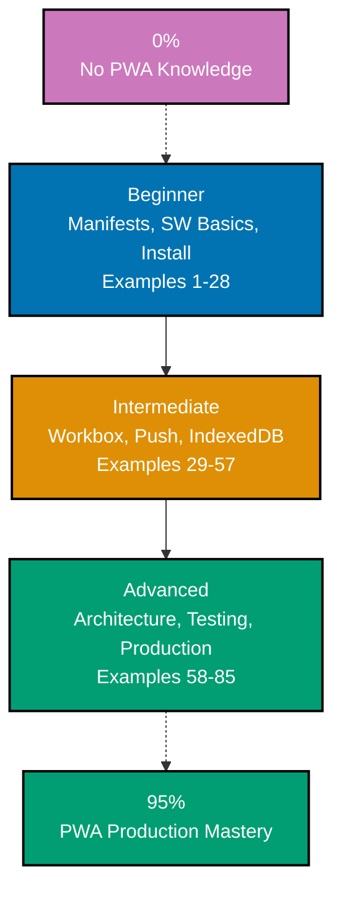

**Want to build installable, offline-capable web apps?** This by-example tutorial provides 85 heavily annotated examples covering 95% of Progressive Web App concepts. Master manifests, service workers, Workbox strategies, push notifications, and production patterns through working code rather than lengthy explanations.

## What Is By-Example Learning?

By-example learning is a **code-first approach** where you learn concepts through annotated, working examples rather than narrative explanations. Each example shows:

1. **What the code does** - Brief explanation of the PWA concept
2. **How it works** - A focused, heavily commented code example
3. **Key Takeaway** - A summary of the essential lesson
4. **Why It Matters** - Production context, when to use it, and deeper significance

This approach works best when you already understand JavaScript fundamentals and basic web development. You learn PWA mechanics by studying real code patterns rather than theoretical descriptions.

## What Is a Progressive Web App?

A Progressive Web App is a **web application that uses modern browser APIs** to deliver native-like experiences. Key characteristics:

- **Installable**: Users can add the app to their home screen or desktop via a web app manifest
- **Offline-capable**: A service worker caches assets and data so the app works without a network connection
- **Reliable**: Fast loading regardless of network quality because cached assets are served immediately
- **Engaging**: Push notifications and background sync keep users informed and data fresh
- **Secure**: PWAs require HTTPS to protect service worker registration and sensitive APIs

PWAs are not a framework — they are a set of browser standards layered on any existing web app. A vanilla HTML site, a React app, and a Next.js application can all become PWAs by adding a manifest and a service worker.

## Learning Path



## Coverage Philosophy: 95% Through 85 Examples

The 85 examples are organized progressively:

- **Beginner (Examples 1-28)**: Web app manifests, service worker lifecycle, caching strategies, install prompts, offline detection
- **Intermediate (Examples 29-57)**: Workbox 7.4.0, @serwist/next for Next.js, Background Sync (Chromium-only), push notifications, IndexedDB, Wake Lock, File System Access, advanced manifest fields
- **Advanced (Examples 58-85)**: Window Controls Overlay, offline-first architecture, cross-tab communication, streaming, navigation preload, update UX, performance, testing, security, and production checklists

Together, these examples cover **95% of what you'll encounter** in real-world PWA development.

## Annotation Density: 1-2.25 Comments Per Code Line

All examples maintain **1-2.25 comment lines per code line per example** to ensure deep understanding.

- Simple lines get 1 annotation explaining purpose or result
- Complex lines get 2 annotations explaining behavior, side effects, and caveats
- Use `// =>` notation to show expected values, API returns, or browser behavior

**Example**:

```javascript
// Register the service worker when the browser supports it
if ("serviceWorker" in navigator) {
  // => Feature detect: older browsers lack SW support
  const reg = await navigator.serviceWorker.register("/sw.js"); // => Sends fetch for /sw.js, parses + installs SW
  // => Returns ServiceWorkerRegistration object
  console.log("SW registered, scope:", reg.scope); // => Output: SW registered, scope: https://example.com/
}
```

## Structure of Each Example

All examples follow a consistent five-part format:

```
## Example N: Descriptive Title

2-3 sentence explanation of the PWA concept.

[Optional Mermaid diagram for complex relationships]

**Code**:

\`\`\`javascript
// Heavily annotated code example
\`\`\`

**Key Takeaway**: 1-2 sentence summary.

**Why It Matters**: 50-100 words explaining production significance.
```

## What's Covered

### Manifests and Installability

- **Web App Manifest**: Required fields, display modes, icons, screenshots, shortcuts
- **Maskable icons**: Safe zone rules, purpose field
- **iOS integration**: Meta tags, apple-touch-icon, status-bar-style
- **Install prompts**: `beforeinstallprompt`, custom install buttons, `appinstalled` event

### Service Workers

- **Registration**: `navigator.serviceWorker.register()`, scope, module type
- **Lifecycle**: install, activate, fetch events; skipWaiting, clients.claim
- **Caching strategies**: Cache First, Network First, Stale While Revalidate, Cache Only, Network Only
- **Offline fallback**: Caching /offline.html, serving when network fails
- **Cache versioning**: Naming, cleanup, busting

### Workbox 7.4.0

- **Setup**: `workbox-webpack-plugin`, `workbox-build`, `@serwist/next` for Next.js
- **Precaching**: `precacheAndRoute` for build assets
- **Routing**: `registerRoute` with URL pattern matching
- **Strategies**: ExpirationPlugin, BroadcastUpdatePlugin, BackgroundSyncPlugin
- **@serwist/next**: Replaces deprecated `@ducanh2912/next-pwa` and `next-pwa`

### Push and Notifications

- **Web Push**: VAPID keys, `pushManager.subscribe`, `web-push` npm package
- **Push events**: Receiving payloads, `showNotification`, action buttons
- **Notification click**: Focusing windows, opening URLs

### Background and Sync

- **Background Sync**: `registration.sync.register` (Chromium-only — not Firefox/Safari)
- **Periodic Background Sync**: `periodicSync.register` (Chromium-only)
- **IndexedDB**: `idb` v8 library, transactions, offline-first data patterns

### Modern APIs

- **Screen Wake Lock**: `navigator.wakeLock.request('screen')` — Baseline 2025, all browsers
- **File System Access**: `showOpenFilePicker`, `showSaveFilePicker`
- **Web Share**: `navigator.share`, `canShare`, files sharing
- **Badging**: `navigator.setAppBadge` (Chrome/Edge)
- **Storage**: `navigator.storage.estimate()`, `persist()`

### Advanced Patterns

- **Window Controls Overlay**: Desktop PWA title bar, CSS env vars
- **Offline-first architecture**: IndexedDB as primary store, sync queue
- **Cross-tab communication**: `BroadcastChannel`, service worker `postMessage`
- **Navigation preload**: Reducing service worker boot latency
- **Update flow**: Detecting new SW versions, prompting users to reload

### Production

- **Testing**: Playwright for service workers, Vitest with `workbox-testing`
- **Security**: Content Security Policy, HTTPS, mkcert for local development
- **Performance**: Web Vitals, render-blocking elimination, critical CSS
- **App stores**: PWABuilder (Microsoft Store), Bubblewrap (Play Store)
- **Production checklist**: Comprehensive pre-launch verification

## What's NOT Covered

- **Framework internals**: React, Vue, Angular architecture details
- **Backend development**: Server-side rendering, API design
- **Advanced TypeScript**: TypeScript features unrelated to PWA patterns
- **Mobile native development**: React Native, Capacitor, Cordova

## Prerequisites

### Required

- **JavaScript fundamentals**: ES6+ syntax, Promises, async/await, arrow functions
- **HTML/CSS**: Basic web fundamentals, link elements, meta tags
- **HTTP basics**: Understanding requests, responses, headers, caching
- **Programming experience**: You have built web pages or web apps before

### Recommended

- **TypeScript basics**: Helpful for Workbox and @serwist/next examples
- **Node.js**: For Workbox build tools and web-push server examples
- **npm/yarn**: Package management for Workbox installation
- **Fetch API**: Understanding fetch requests improves service worker comprehension

### Not Required

- **React/Next.js experience**: Examples cover Next.js integration but teach PWA concepts independently
- **Service worker prior experience**: This guide assumes you are new to service workers
- **Native app development**: PWA concepts are explained from the web perspective

## Browser Support Notes

Some PWA APIs have limited browser support. Accurate browser support information per feature:

- **Service Workers**: All modern browsers (Chrome, Firefox, Safari, Edge)
- **Web App Manifest**: All modern browsers
- **Background Sync**: Chromium-only (Chrome 61+, Edge) — NOT available in Firefox or Safari
- **Periodic Background Sync**: Chromium-only — NOT available in Firefox or Safari
- **beforeinstallprompt**: Chrome and Edge only — NOT available in Firefox or Safari
- **Badging API**: Chrome and Edge — limited support
- **Screen Wake Lock**: Baseline 2025 — all major browsers (Chrome, Firefox, Safari, Edge)
- **File System Access**: Chrome/Edge; Firefox experimental; Safari limited
- **Web Share API**: Widely supported across modern browsers

Examples document browser support clearly so you can make informed decisions about progressive enhancement.

## How to Use This Guide

### 1. Choose Your Starting Point

- **New to PWAs?** Start with Beginner (Example 1)
- **Know manifests and SW basics?** Jump to Intermediate (Example 29)
- **Building production features?** Browse Advanced (Example 58+)

### 2. Read the Example

Each example has five parts: brief explanation, optional diagram, annotated code, key takeaway, and why it matters.

### 3. Try the Code

Most examples are self-contained and can be added directly to any web project. For service worker examples, serve via localhost (file:// does not support service workers).

```bash
# Quick local server for trying examples
npx serve .
# Or with Node.js
npx http-server . -p 3000
```

### 4. Modify and Experiment

Change cache names, swap strategies, break things intentionally. Experimentation builds intuition faster than reading alone.

## Ready to Start?

Choose your learning path:

- **Beginner** - Start here if you are new to PWAs. Build foundation understanding through 28 core examples covering manifests, service worker lifecycle, and install prompts.
- **Intermediate** - Jump here if you know basic service workers. Master Workbox, push notifications, and advanced browser APIs through 29 examples.
- **Advanced** - Expert mastery through 28 advanced examples covering offline-first architecture, testing, performance, and production deployment.

## Examples by Level

### Beginner (Examples 1–28)

- [Example 1: Creating a Web App Manifest — Required Fields for Installability](/en/learn/software-engineering/platform-web/tools/progressive-web-apps/by-example/beginner#example-1-creating-a-web-app-manifest--required-fields-for-installability)
- [Example 2: Adding Theme Color, Background Color, Description, and Language to the Manifest](/en/learn/software-engineering/platform-web/tools/progressive-web-apps/by-example/beginner#example-2-adding-theme-color-background-color-description-and-language-to-the-manifest)
- [Example 3: Generating Maskable Icons — Safe Zone Rule](/en/learn/software-engineering/platform-web/tools/progressive-web-apps/by-example/beginner#example-3-generating-maskable-icons--safe-zone-rule)
- [Example 4: Linking the Manifest in HTML](/en/learn/software-engineering/platform-web/tools/progressive-web-apps/by-example/beginner#example-4-linking-the-manifest-in-html)
- [Example 5: Adding iOS Meta Tags for Safari PWA Support](/en/learn/software-engineering/platform-web/tools/progressive-web-apps/by-example/beginner#example-5-adding-ios-meta-tags-for-safari-pwa-support)
- [Example 6: Registering a Service Worker](/en/learn/software-engineering/platform-web/tools/progressive-web-apps/by-example/beginner#example-6-registering-a-service-worker)
- [Example 7: Service Worker Lifecycle — Install, Waiting, Activate, Controlling](/en/learn/software-engineering/platform-web/tools/progressive-web-apps/by-example/beginner#example-7-service-worker-lifecycle--install-waiting-activate-controlling)
- [Example 8: The Install Event — Caching the App Shell](/en/learn/software-engineering/platform-web/tools/progressive-web-apps/by-example/beginner#example-8-the-install-event--caching-the-app-shell)
- [Example 9: The Activate Event — Deleting Old Caches and Claiming Clients](/en/learn/software-engineering/platform-web/tools/progressive-web-apps/by-example/beginner#example-9-the-activate-event--deleting-old-caches-and-claiming-clients)
- [Example 10: The Fetch Event — Basic Request Interception](/en/learn/software-engineering/platform-web/tools/progressive-web-apps/by-example/beginner#example-10-the-fetch-event--basic-request-interception)
- [Example 11: Cache First Strategy — Serve from Cache, Fall Back to Network](/en/learn/software-engineering/platform-web/tools/progressive-web-apps/by-example/beginner#example-11-cache-first-strategy--serve-from-cache-fall-back-to-network)
- [Example 12: Network First Strategy — Try Network, Fall Back to Cache](/en/learn/software-engineering/platform-web/tools/progressive-web-apps/by-example/beginner#example-12-network-first-strategy--try-network-fall-back-to-cache)
- [Example 13: Stale While Revalidate — Serve Cache Immediately, Update in Background](/en/learn/software-engineering/platform-web/tools/progressive-web-apps/by-example/beginner#example-13-stale-while-revalidate--serve-cache-immediately-update-in-background)
- [Example 14: Cache Only Strategy — Serve Only from Cache](/en/learn/software-engineering/platform-web/tools/progressive-web-apps/by-example/beginner#example-14-cache-only-strategy--serve-only-from-cache)
- [Example 15: Network Only Strategy — Bypass Cache Entirely](/en/learn/software-engineering/platform-web/tools/progressive-web-apps/by-example/beginner#example-15-network-only-strategy--bypass-cache-entirely)
- [Example 16: Offline Fallback Page](/en/learn/software-engineering/platform-web/tools/progressive-web-apps/by-example/beginner#example-16-offline-fallback-page)
- [Example 17: skipWaiting and clients.claim for Immediate Activation](/en/learn/software-engineering/platform-web/tools/progressive-web-apps/by-example/beginner#example-17-skipwaiting-and-clientsclaim-for-immediate-activation)
- [Example 18: Versioned Cache Names for Cache Busting](/en/learn/software-engineering/platform-web/tools/progressive-web-apps/by-example/beginner#example-18-versioned-cache-names-for-cache-busting)
- [Example 19: Detecting Online and Offline Status](/en/learn/software-engineering/platform-web/tools/progressive-web-apps/by-example/beginner#example-19-detecting-online-and-offline-status)
- [Example 20: Display Mode Detection — Detecting Standalone Mode](/en/learn/software-engineering/platform-web/tools/progressive-web-apps/by-example/beginner#example-20-display-mode-detection--detecting-standalone-mode)
- [Example 21: Intercepting beforeinstallprompt for a Custom Install Button](/en/learn/software-engineering/platform-web/tools/progressive-web-apps/by-example/beginner#example-21-intercepting-beforeinstallprompt-for-a-custom-install-button)
- [Example 22: Showing the Native Install Dialog](/en/learn/software-engineering/platform-web/tools/progressive-web-apps/by-example/beginner#example-22-showing-the-native-install-dialog)
- [Example 23: The appinstalled Event — Tracking Successful Installation](/en/learn/software-engineering/platform-web/tools/progressive-web-apps/by-example/beginner#example-23-the-appinstalled-event--tracking-successful-installation)
- [Example 24: Web Share API — Sharing Content with Native Dialogs](/en/learn/software-engineering/platform-web/tools/progressive-web-apps/by-example/beginner#example-24-web-share-api--sharing-content-with-native-dialogs)
- [Example 25: Storage Estimation — Checking Quota and Usage](/en/learn/software-engineering/platform-web/tools/progressive-web-apps/by-example/beginner#example-25-storage-estimation--checking-quota-and-usage)
- [Example 26: Persistent Storage — Requesting Protection from Eviction](/en/learn/software-engineering/platform-web/tools/progressive-web-apps/by-example/beginner#example-26-persistent-storage--requesting-protection-from-eviction)
- [Example 27: Linking Favicon, apple-touch-icon, and theme-color for Full Browser UI Integration](/en/learn/software-engineering/platform-web/tools/progressive-web-apps/by-example/beginner#example-27-linking-favicon-apple-touch-icon-and-theme-color-for-full-browser-ui-integration)
- [Example 28: Auditing a PWA with Lighthouse](/en/learn/software-engineering/platform-web/tools/progressive-web-apps/by-example/beginner#example-28-auditing-a-pwa-with-lighthouse)

### Intermediate (Examples 29–57)

- [Example 29: Workbox 7.4.0 Setup — workbox-webpack-plugin and workbox-build](/en/learn/software-engineering/platform-web/tools/progressive-web-apps/by-example/intermediate#example-29-workbox-740-setup--workbox-webpack-plugin-and-workbox-build)
- [Example 30: Workbox precacheAndRoute — Precaching Build Assets Automatically](/en/learn/software-engineering/platform-web/tools/progressive-web-apps/by-example/intermediate#example-30-workbox-precacheandroute--precaching-build-assets-automatically)
- [Example 31: Workbox Route Registration — registerRoute with URL Patterns](/en/learn/software-engineering/platform-web/tools/progressive-web-apps/by-example/intermediate#example-31-workbox-route-registration--registerroute-with-url-patterns)
- [Example 32: Workbox CacheFirst with ExpirationPlugin — TTL and Max Entries](/en/learn/software-engineering/platform-web/tools/progressive-web-apps/by-example/intermediate#example-32-workbox-cachefirst-with-expirationplugin--ttl-and-max-entries)
- [Example 33: Workbox NetworkFirst with Timeout — Serve Stale if Network Too Slow](/en/learn/software-engineering/platform-web/tools/progressive-web-apps/by-example/intermediate#example-33-workbox-networkfirst-with-timeout--serve-stale-if-network-too-slow)
- [Example 34: Workbox StaleWhileRevalidate for API Responses with NetworkOnly Fallback](/en/learn/software-engineering/platform-web/tools/progressive-web-apps/by-example/intermediate#example-34-workbox-stalewhilerevalidate-for-api-responses-with-networkonly-fallback)
- [Example 35: Workbox BroadcastUpdatePlugin — Notify Clients When Cache Updates](/en/learn/software-engineering/platform-web/tools/progressive-web-apps/by-example/intermediate#example-35-workbox-broadcastupdateplugin--notify-clients-when-cache-updates)
- [Example 36: @serwist/next Setup — Modern Next.js PWA Integration](/en/learn/software-engineering/platform-web/tools/progressive-web-apps/by-example/intermediate#example-36-serwistnext-setup--modern-nextjs-pwa-integration)
- [Example 37: @serwist/next — swSrc/swDest Config and TypeScript Service Worker](/en/learn/software-engineering/platform-web/tools/progressive-web-apps/by-example/intermediate#example-37-serwistnext--swsrcswdest-config-and-typescript-service-worker)
- [Example 38: Workbox BackgroundSyncPlugin for Failed POST Requests](/en/learn/software-engineering/platform-web/tools/progressive-web-apps/by-example/intermediate#example-38-workbox-backgroundsyncplugin-for-failed-post-requests)
- [Example 39: Manual Background Sync — registration.sync.register and the sync Event](/en/learn/software-engineering/platform-web/tools/progressive-web-apps/by-example/intermediate#example-39-manual-background-sync--registrationsyncregister-and-the-sync-event)
- [Example 40: Push Notifications — VAPID Key Generation and pushManager.subscribe](/en/learn/software-engineering/platform-web/tools/progressive-web-apps/by-example/intermediate#example-40-push-notifications--vapid-key-generation-and-pushmanagersubscribe)
- [Example 41: Receiving Push Events — Displaying Notifications in the Service Worker](/en/learn/software-engineering/platform-web/tools/progressive-web-apps/by-example/intermediate#example-41-receiving-push-events--displaying-notifications-in-the-service-worker)
- [Example 42: Push Notification Actions — Action Buttons in Notifications](/en/learn/software-engineering/platform-web/tools/progressive-web-apps/by-example/intermediate#example-42-push-notification-actions--action-buttons-in-notifications)
- [Example 43: notificationclick Handler — Focus Existing Window or Open New One](/en/learn/software-engineering/platform-web/tools/progressive-web-apps/by-example/intermediate#example-43-notificationclick-handler--focus-existing-window-or-open-new-one)
- [Example 44: Web Push Server with the web-push npm Package](/en/learn/software-engineering/platform-web/tools/progressive-web-apps/by-example/intermediate#example-44-web-push-server-with-the-web-push-npm-package)
- [Example 45: IndexedDB with idb v8 — openDB, Store Definitions, Transactions](/en/learn/software-engineering/platform-web/tools/progressive-web-apps/by-example/intermediate#example-45-indexeddb-with-idb-v8--opendb-store-definitions-transactions)
- [Example 46: Syncing IndexedDB Data to the Server in a Background Sync Handler](/en/learn/software-engineering/platform-web/tools/progressive-web-apps/by-example/intermediate#example-46-syncing-indexeddb-data-to-the-server-in-a-background-sync-handler)
- [Example 47: Screen Wake Lock API — Prevent Screen Sleep During Active Tasks](/en/learn/software-engineering/platform-web/tools/progressive-web-apps/by-example/intermediate#example-47-screen-wake-lock-api--prevent-screen-sleep-during-active-tasks)
- [Example 48: Wake Lock Management — Release on visibilitychange, Re-acquire When Visible](/en/learn/software-engineering/platform-web/tools/progressive-web-apps/by-example/intermediate#example-48-wake-lock-management--release-on-visibilitychange-re-acquire-when-visible)
- [Example 49: File System Access API — showOpenFilePicker and Reading Files](/en/learn/software-engineering/platform-web/tools/progressive-web-apps/by-example/intermediate#example-49-file-system-access-api--showopenfilepicker-and-reading-files)
- [Example 50: Writing Files with File System Access API — showSaveFilePicker and createWritable](/en/learn/software-engineering/platform-web/tools/progressive-web-apps/by-example/intermediate#example-50-writing-files-with-file-system-access-api--showsavefilepicker-and-createwritable)
- [Example 51: App Shortcuts in the Manifest](/en/learn/software-engineering/platform-web/tools/progressive-web-apps/by-example/intermediate#example-51-app-shortcuts-in-the-manifest)
- [Example 52: Protocol Handlers in the Manifest](/en/learn/software-engineering/platform-web/tools/progressive-web-apps/by-example/intermediate#example-52-protocol-handlers-in-the-manifest)
- [Example 53: File Handlers in the Manifest](/en/learn/software-engineering/platform-web/tools/progressive-web-apps/by-example/intermediate#example-53-file-handlers-in-the-manifest)
- [Example 54: Share Target API — Receiving Shared Content in a PWA](/en/learn/software-engineering/platform-web/tools/progressive-web-apps/by-example/intermediate#example-54-share-target-api--receiving-shared-content-in-a-pwa)
- [Example 55: Badging API — setAppBadge and clearAppBadge](/en/learn/software-engineering/platform-web/tools/progressive-web-apps/by-example/intermediate#example-55-badging-api--setappbadge-and-clearappbadge)
- [Example 56: Periodic Background Sync — Registering Scheduled Background Updates](/en/learn/software-engineering/platform-web/tools/progressive-web-apps/by-example/intermediate#example-56-periodic-background-sync--registering-scheduled-background-updates)
- [Example 57: Screenshots in the Manifest — App Store Quality Listings](/en/learn/software-engineering/platform-web/tools/progressive-web-apps/by-example/intermediate#example-57-screenshots-in-the-manifest--app-store-quality-listings)

### Advanced (Examples 58–85)

- [Example 58: Window Controls Overlay — Custom Title Bar for Desktop PWAs](/en/learn/software-engineering/platform-web/tools/progressive-web-apps/by-example/advanced#example-58-window-controls-overlay--custom-title-bar-for-desktop-pwas)
- [Example 59: Drag-and-Drop File Handling with dragover/drop Events](/en/learn/software-engineering/platform-web/tools/progressive-web-apps/by-example/advanced#example-59-drag-and-drop-file-handling-with-dragoverdrop-events)
- [Example 60: Offline-First Architecture — IndexedDB as Primary Data Store](/en/learn/software-engineering/platform-web/tools/progressive-web-apps/by-example/advanced#example-60-offline-first-architecture--indexeddb-as-primary-data-store)
- [Example 61: Conflict Resolution Strategies for Offline-First Apps](/en/learn/software-engineering/platform-web/tools/progressive-web-apps/by-example/advanced#example-61-conflict-resolution-strategies-for-offline-first-apps)
- [Example 62: Service Worker Message Passing — postMessage Between SW and Clients](/en/learn/software-engineering/platform-web/tools/progressive-web-apps/by-example/advanced#example-62-service-worker-message-passing--postmessage-between-sw-and-clients)
- [Example 63: Cross-Tab Communication — BroadcastChannel Between Service Worker and Clients](/en/learn/software-engineering/platform-web/tools/progressive-web-apps/by-example/advanced#example-63-cross-tab-communication--broadcastchannel-between-service-worker-and-clients)
- [Example 64: Cache Versioning Strategy — Manifest Hash in Cache Name](/en/learn/software-engineering/platform-web/tools/progressive-web-apps/by-example/advanced#example-64-cache-versioning-strategy--manifest-hash-in-cache-name)
- [Example 65: Dynamic Caching with URL Pattern Matching — RegExp Routes in Workbox](/en/learn/software-engineering/platform-web/tools/progressive-web-apps/by-example/advanced#example-65-dynamic-caching-with-url-pattern-matching--regexp-routes-in-workbox)
- [Example 66: Streaming Responses in Service Workers — ReadableStream for Large Content](/en/learn/software-engineering/platform-web/tools/progressive-web-apps/by-example/advanced#example-66-streaming-responses-in-service-workers--readablestream-for-large-content)
- [Example 67: Navigation Preload — Reducing Service Worker Boot Latency](/en/learn/software-engineering/platform-web/tools/progressive-web-apps/by-example/advanced#example-67-navigation-preload--reducing-service-worker-boot-latency)
- [Example 68: Service Worker Update Flow — Detecting a New Version](/en/learn/software-engineering/platform-web/tools/progressive-web-apps/by-example/advanced#example-68-service-worker-update-flow--detecting-a-new-version)
- [Example 69: App Update Notification UX — "Update Available" Banner with Reload Button](/en/learn/software-engineering/platform-web/tools/progressive-web-apps/by-example/advanced#example-69-app-update-notification-ux--update-available-banner-with-reload-button)
- [Example 70: PWA Performance — Render-Blocking Resource Elimination and Critical CSS](/en/learn/software-engineering/platform-web/tools/progressive-web-apps/by-example/advanced#example-70-pwa-performance--render-blocking-resource-elimination-and-critical-css)
- [Example 71: Web Vitals Monitoring in PWAs — LCP, INP, and CLS Tracking](/en/learn/software-engineering/platform-web/tools/progressive-web-apps/by-example/advanced#example-71-web-vitals-monitoring-in-pwas--lcp-inp-and-cls-tracking)
- [Example 72: PWA Analytics — Tracking Install Events, Offline Usage, and Push Engagement](/en/learn/software-engineering/platform-web/tools/progressive-web-apps/by-example/advanced#example-72-pwa-analytics--tracking-install-events-offline-usage-and-push-engagement)
- [Example 73: Push Payload Encryption — web-push Payload Structure](/en/learn/software-engineering/platform-web/tools/progressive-web-apps/by-example/advanced#example-73-push-payload-encryption--web-push-payload-structure)
- [Example 74: Push Subscription Management — Server-Side Storage and pushsubscriptionchange](/en/learn/software-engineering/platform-web/tools/progressive-web-apps/by-example/advanced#example-74-push-subscription-management--server-side-storage-and-pushsubscriptionchange)
- [Example 75: Testing Service Workers with Playwright — Intercepting Fetch in E2E Tests](/en/learn/software-engineering/platform-web/tools/progressive-web-apps/by-example/advanced#example-75-testing-service-workers-with-playwright--intercepting-fetch-in-e2e-tests)
- [Example 76: Service Worker Unit Testing with Vitest and workbox-testing](/en/learn/software-engineering/platform-web/tools/progressive-web-apps/by-example/advanced#example-76-service-worker-unit-testing-with-vitest-and-workbox-testing)
- [Example 77: PWA in Next.js App Router — Metadata API for Manifest and Viewport Config](/en/learn/software-engineering/platform-web/tools/progressive-web-apps/by-example/advanced#example-77-pwa-in-nextjs-app-router--metadata-api-for-manifest-and-viewport-config)
- [Example 78: PWA with Vite — vite-plugin-pwa Configuration](/en/learn/software-engineering/platform-web/tools/progressive-web-apps/by-example/advanced#example-78-pwa-with-vite--vite-plugin-pwa-configuration)
- [Example 79: Desktop PWA Features — launch_handler in Manifest](/en/learn/software-engineering/platform-web/tools/progressive-web-apps/by-example/advanced#example-79-desktop-pwa-features--launch_handler-in-manifest)
- [Example 80: Multi-Page PWA Architecture — Separate Service Workers Per Section](/en/learn/software-engineering/platform-web/tools/progressive-web-apps/by-example/advanced#example-80-multi-page-pwa-architecture--separate-service-workers-per-section)
- [Example 81: A/B Testing in PWAs — Feature Flags via Service Worker as Proxy](/en/learn/software-engineering/platform-web/tools/progressive-web-apps/by-example/advanced#example-81-ab-testing-in-pwas--feature-flags-via-service-worker-as-proxy)
- [Example 82: Content Security Policy for PWAs — Allowing Service Worker Scripts](/en/learn/software-engineering/platform-web/tools/progressive-web-apps/by-example/advanced#example-82-content-security-policy-for-pwas--allowing-service-worker-scripts)
- [Example 83: HTTPS Requirements for PWAs — mkcert for Local Development](/en/learn/software-engineering/platform-web/tools/progressive-web-apps/by-example/advanced#example-83-https-requirements-for-pwas--mkcert-for-local-development)
- [Example 84: App Store Submission — PWABuilder for Microsoft Store and Bubblewrap for Play Store](/en/learn/software-engineering/platform-web/tools/progressive-web-apps/by-example/advanced#example-84-app-store-submission--pwabuilder-for-microsoft-store-and-bubblewrap-for-play-store)
- [Example 85: PWA Production Checklist — Manifest, Icons, HTTPS, Service Worker, Offline, Performance](/en/learn/software-engineering/platform-web/tools/progressive-web-apps/by-example/advanced#example-85-pwa-production-checklist--manifest-icons-https-service-worker-offline-performance)
