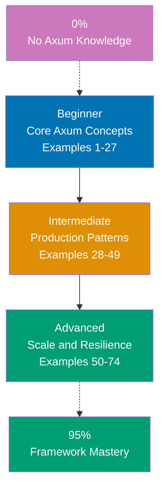

## Want to Master Axum Through Working Code?

This guide teaches you Rust Axum through **74 production-ready code examples** rather than lengthy explanations. If you are an experienced developer switching to Rust web development, or want to deepen your framework mastery, you will build intuition through actual working patterns.

## What Is By-Example Learning?

By-example learning is a **code-first approach** where you learn concepts through annotated, working examples rather than narrative explanations. Each example shows:

1. **What the code does** - Brief explanation of the Axum concept
2. **How it works** - A focused, heavily commented code example
3. **Why it matters** - A pattern summary highlighting the key takeaway

This approach works best when you already understand programming fundamentals. You learn Axum's idioms, patterns, and best practices by studying real code rather than theoretical descriptions.

## What Is Rust Axum?

Axum is a **web application framework for Rust** built on top of Tokio, Tower, and Hyper. Key distinctions:

- **Not Express/Actix-web**: Axum is more compositional than Express and safer than raw Actix-web, leveraging the Tower ecosystem for middleware
- **Async-first**: Built entirely on Tokio's async runtime; every handler is an async function
- **Type-safe extractors**: Request data extraction is compile-time safe through the `FromRequest` and `FromRequestParts` traits
- **Tower middleware**: Middleware integrates seamlessly via the Tower `Service` trait, enabling deep composition
- **Zero-cost abstractions**: Rust's ownership model ensures memory safety without garbage collection

## Learning Path



## Coverage Philosophy: 95% Through 74 Examples

The **95% coverage** means you will understand Axum deeply enough to build production systems with confidence. It does not mean you will know every edge case or advanced feature—those come with experience.

The 74 examples are organized progressively:

- **Beginner (Examples 1-27)**: Foundation concepts (routing, handlers, extractors, state, responses, templates, error handling, middleware basics)
- **Intermediate (Examples 28-49)**: Production patterns (shared state, SQLx, JWT authentication, CORS, rate limiting, WebSockets, SSE, testing, graceful shutdown, tracing)
- **Advanced (Examples 50-74)**: Scale and resilience (custom extractors, tower middleware, connection pooling, streaming, metrics, distributed tracing, circuit breakers, API versioning, Docker deployment)

Together, these examples cover **95% of what you will use** in production Axum applications.

## What Is Covered

### Core Web Framework Concepts

- **Routing**: `Router`, nested routes, path parameters, query parameters, method routing
- **Handlers**: Async handler functions, response types, `IntoResponse` trait
- **Extractors**: `Path`, `Query`, `Json`, `State`, `Form`, `Headers`, `Extension`, `TypedHeader`
- **Responses**: `Response`, `Json`, `Html`, status codes, headers, streaming

### Middleware and Tower

- **tower-http**: `TraceLayer`, `CorsLayer`, `CompressionLayer`, `TimeoutLayer`, `RequestBodyLimitLayer`
- **Custom middleware**: Implementing `Layer` and `Service` traits, `axum::middleware::from_fn`
- **Authentication middleware**: JWT validation, session checks, role-based access
- **Rate limiting**: `tower_governor` integration, per-IP limits

### Data and Persistence

- **SQLx**: Async database queries, connection pooling, migrations, typed queries
- **Connection pools**: `PgPool`, `SqlitePool`, pool configuration, health checks
- **Transactions**: Multi-step queries with rollback safety

### Security and Authentication

- **JWT**: Token generation and validation with `jsonwebtoken` crate
- **Password hashing**: `bcrypt` / `argon2` integration
- **Session management**: Cookie-based sessions with `tower-sessions`
- **CORS**: Fine-grained origin and method control

### Real-Time Features

- **WebSockets**: Upgrade path, message framing, broadcast patterns
- **Server-Sent Events**: SSE streams with `axum::response::sse`

### Testing and Quality

- **Integration testing**: `axum-test` / `tower::ServiceExt` for handler tests
- **Mocking**: Fake state injection, in-memory stores

### Production and Operations

- **Graceful shutdown**: Signal handling, drain connections, health endpoints
- **Tracing**: `tracing` + `tracing-subscriber` structured logging
- **Metrics**: Prometheus metrics via `axum-prometheus`
- **OpenTelemetry**: Distributed tracing with `opentelemetry` crate
- **Docker**: Multi-stage builds for minimal production images

## What Is NOT Covered

We exclude topics that belong in specialized tutorials:

- **Detailed Rust syntax**: Master Rust first through language tutorials
- **Advanced Tokio internals**: Runtime configuration, task scheduling details
- **Database-specific SQL optimization**: Deep PostgreSQL internals, query plans
- **Infrastructure as code**: Kubernetes, Terraform, advanced deployment pipelines
- **Hyper internals**: Low-level HTTP/2 and TLS configuration below Axum's abstraction

For these topics, see dedicated tutorials and framework documentation.

## How to Use This Guide

### 1. Choose Your Starting Point

- **New to Axum?** Start with Beginner (Example 1)
- **Rust web experience** (Actix-web, Warp)? Start with Intermediate (Example 28)
- **Building a specific feature?** Search for relevant example topic

### 2. Read the Example

Each example has five parts:

- **Explanation** (2-3 sentences): What Axum concept, why it exists, when to use it
- **Optional diagram**: Mermaid diagram when visualizing flow improves understanding
- **Code** (with heavy comments): Working Rust code showing the pattern
- **Key Takeaway** (1-2 sentences): Distilled essence of the pattern
- **Why It Matters** (50-100 words): Production context and real-world relevance

### 3. Run the Code

Create a test project and run each example:

```bash
cargo new my_axum_app
cd my_axum_app
# Add dependencies to Cargo.toml
# Paste example code into src/main.rs
cargo run
```

### 4. Modify and Experiment

Change variable names, add features, break things on purpose. Experiment builds intuition faster than reading.

### 5. Reference as Needed

Use this guide as a reference when building features. Search for relevant examples and adapt patterns to your code.

## Relationship to Other Tutorial Types

| Tutorial Type               | Approach                       | Coverage            | Best For                       |
| --------------------------- | ------------------------------ | ------------------- | ------------------------------ |
| **By Example** (this guide) | Code-first, 74 examples        | 95% breadth         | Learning framework idioms      |
| **Quick Start**             | Project-based, hands-on        | 5-30% touchpoints   | Getting something working fast |
| **Beginner Tutorial**       | Narrative, explanation-first   | 0-60% comprehensive | Understanding concepts deeply  |
| **Cookbook**                | Recipe-based, problem-solution | Problem-specific    | Solving specific problems      |

## Prerequisites

### Required

- **Rust fundamentals**: Ownership, borrowing, lifetimes, traits, generics, async/await
- **Web development**: HTTP basics, REST APIs, JSON
- **Programming experience**: Built applications in another language

### Recommended

- **Tokio basics**: Understanding async runtimes, `tokio::spawn`, `tokio::select`
- **Serde**: JSON serialization and deserialization patterns
- **Cargo**: Dependency management, feature flags, workspace setup

### Not Required

- **Axum experience**: This guide assumes you are new to the framework
- **Advanced Rust**: Macros, unsafe code, custom allocators are not needed
- **Previous web framework experience**: Helpful but not required

## Learning Strategies

### For Actix-web Developers Switching to Axum

You know Rust web development but want Axum's compositional Tower ecosystem:

- **Map Actix handlers to Axum handlers** - Axum handlers use extractors instead of `web::Data`, `web::Path` annotations; see Examples 1-10
- **Understand Tower vs Actix middleware** - Tower `Service` trait replaces Actix middleware; see Examples 15-17 for `from_fn` middleware
- **Learn extractor composition** - Axum composes extractors at compile time; tuple extractors work differently from Actix's parameter injection
- **Recommended path**: Examples 1-14 (Axum fundamentals) → Examples 15-21 (middleware + Extension) → Examples 50-74 (advanced Tower patterns)

### For Node.js/Express Developers Switching to Rust

You know Express patterns but are new to Rust's ownership model:

- **Map Express middleware to Tower** - Express middleware `(req, res, next)` maps to Tower `Service`; see Examples 15-17 and Example 46
- **Understand async/await differences** - Rust's async is poll-based, not event loop; ownership rules apply to async too; see Examples 1-5
- **Learn typed extractors** - No `req.body`, `req.params`; everything is compile-time typed via extractors; see Examples 3-10
- **Recommended path**: Examples 1-10 (basics) → Examples 6-7, 20-21 (state + extractors) → Examples 28-30 (DB integration)

### For Python/Django/FastAPI Developers Switching to Rust

Axum's architecture offers static types and no garbage collector, replacing runtime validation with compile-time safety:

- **Map FastAPI dependencies to Axum State** - FastAPI's `Depends()` maps to Axum's `State` extractor; see Examples 6-7
- **Understand compile-time error handling** - No exceptions; `Result<T, E>` forces explicit error handling; see Examples 9, 47-48
- **Learn ownership before async** - Rust's ownership rules interact with async in non-obvious ways; study Examples 1-5 carefully
- **Recommended path**: Examples 1-14 (Axum basics) → Examples 28-30 (state and DB) → Examples 26-27, 49 (testing)

## Structure of Each Example

All examples follow a consistent 5-part format:

````
### Example N: Descriptive Title

2-3 sentence explanation of the concept.

[Optional Mermaid diagram]

```rust
// Heavily annotated code example
// showing the Axum pattern in action
````

**Key Takeaway**: 1-2 sentence summary.

**Why It Matters**: 50-100 words of production context.

```

**Code annotations**:

- `// =>` shows expected output, types, or values
- Inline comments explain what each line does and why
- Variable names are self-documenting

**Mermaid diagrams** appear when visualizing flow or architecture improves understanding. We use a color-blind friendly palette:

- Blue #0173B2 - Primary
- Orange #DE8F05 - Secondary
- Teal #029E73 - Accent
- Purple #CC78BC - Alternative
- Brown #CA9161 - Neutral

## Ready to Start?

Choose your learning path:

- **[Beginner](/en/learn/software-engineering/platform-web/tools/rust-axum/by-example/beginner)** - Start here if new to Axum. Build foundation understanding through 27 core examples covering routing, handlers, extractors, and basic middleware.
- **[Intermediate](/en/learn/software-engineering/platform-web/tools/rust-axum/by-example/intermediate)** - Jump here if you know Axum basics. Master production patterns through 22 examples covering databases, authentication, WebSockets, and testing.
- **[Advanced](/en/learn/software-engineering/platform-web/tools/rust-axum/by-example/advanced)** - Expert mastery through 25 advanced examples covering custom extractors, Tower internals, metrics, distributed tracing, and production deployment.

Or jump to specific topics by searching for relevant example keywords (routing, extractors, JWT, SQLx, WebSockets, tracing, Docker, etc.).
```

## Examples by Level

### Beginner (Examples 1–27)

- [Example 1: Minimal Axum Server](/en/learn/software-engineering/platform-web/tools/rust-axum/by-example/beginner#example-1-minimal-axum-server)
- [Example 2: Route Registration Patterns](/en/learn/software-engineering/platform-web/tools/rust-axum/by-example/beginner#example-2-route-registration-patterns)
- [Example 3: Path Parameters](/en/learn/software-engineering/platform-web/tools/rust-axum/by-example/beginner#example-3-path-parameters)
- [Example 4: Query Parameters](/en/learn/software-engineering/platform-web/tools/rust-axum/by-example/beginner#example-4-query-parameters)
- [Example 5: JSON Request Body](/en/learn/software-engineering/platform-web/tools/rust-axum/by-example/beginner#example-5-json-request-body)
- [Example 6: Shared State with `State` Extractor](/en/learn/software-engineering/platform-web/tools/rust-axum/by-example/beginner#example-6-shared-state-with-state-extractor)
- [Example 7: Mutable State with `Arc<RwLock<T>>`](/en/learn/software-engineering/platform-web/tools/rust-axum/by-example/beginner#example-7-mutable-state-with-arcrwlockt)
- [Example 8: `IntoResponse` and Custom Responses](/en/learn/software-engineering/platform-web/tools/rust-axum/by-example/beginner#example-8-intoresponse-and-custom-responses)
- [Example 9: Error Handling with Custom Error Types](/en/learn/software-engineering/platform-web/tools/rust-axum/by-example/beginner#example-9-error-handling-with-custom-error-types)
- [Example 10: Reading Request Headers](/en/learn/software-engineering/platform-web/tools/rust-axum/by-example/beginner#example-10-reading-request-headers)
- [Example 11: Setting Response Headers and Cookies](/en/learn/software-engineering/platform-web/tools/rust-axum/by-example/beginner#example-11-setting-response-headers-and-cookies)
- [Example 12: HTML Form Submission](/en/learn/software-engineering/platform-web/tools/rust-axum/by-example/beginner#example-12-html-form-submission)
- [Example 13: Serving Static Files with `tower-http`](/en/learn/software-engineering/platform-web/tools/rust-axum/by-example/beginner#example-13-serving-static-files-with-tower-http)
- [Example 14: HTML Templates with Askama](/en/learn/software-engineering/platform-web/tools/rust-axum/by-example/beginner#example-14-html-templates-with-askama)
- [Example 15: Request Logging with `TraceLayer`](/en/learn/software-engineering/platform-web/tools/rust-axum/by-example/beginner#example-15-request-logging-with-tracelayer)
- [Example 16: Custom Function Middleware](/en/learn/software-engineering/platform-web/tools/rust-axum/by-example/beginner#example-16-custom-function-middleware)
- [Example 17: Timeout and Request Size Limits](/en/learn/software-engineering/platform-web/tools/rust-axum/by-example/beginner#example-17-timeout-and-request-size-limits)
- [Example 18: Nested Routers](/en/learn/software-engineering/platform-web/tools/rust-axum/by-example/beginner#example-18-nested-routers)
- [Example 19: Router with Fallback Handler](/en/learn/software-engineering/platform-web/tools/rust-axum/by-example/beginner#example-19-router-with-fallback-handler)
- [Example 20: Multiple Extractors in One Handler](/en/learn/software-engineering/platform-web/tools/rust-axum/by-example/beginner#example-20-multiple-extractors-in-one-handler)
- [Example 21: `Extension` Extractor](/en/learn/software-engineering/platform-web/tools/rust-axum/by-example/beginner#example-21-extension-extractor)
- [Example 22: Redirect Responses](/en/learn/software-engineering/platform-web/tools/rust-axum/by-example/beginner#example-22-redirect-responses)
- [Example 23: Streaming Responses](/en/learn/software-engineering/platform-web/tools/rust-axum/by-example/beginner#example-23-streaming-responses)
- [Example 24: Request Body as Bytes](/en/learn/software-engineering/platform-web/tools/rust-axum/by-example/beginner#example-24-request-body-as-bytes)
- [Example 25: Content-Type Negotiation](/en/learn/software-engineering/platform-web/tools/rust-axum/by-example/beginner#example-25-content-type-negotiation)
- [Example 26: Unit Testing Handlers with `tower`](/en/learn/software-engineering/platform-web/tools/rust-axum/by-example/beginner#example-26-unit-testing-handlers-with-tower)
- [Example 27: Testing with JSON Body and State](/en/learn/software-engineering/platform-web/tools/rust-axum/by-example/beginner#example-27-testing-with-json-body-and-state)

### Intermediate (Examples 28–49)

- [Example 28: SQLx Connection Pool Setup](/en/learn/software-engineering/platform-web/tools/rust-axum/by-example/intermediate#example-28-sqlx-connection-pool-setup)
- [Example 29: SQLx CRUD Operations](/en/learn/software-engineering/platform-web/tools/rust-axum/by-example/intermediate#example-29-sqlx-crud-operations)
- [Example 30: SQLx Database Transactions](/en/learn/software-engineering/platform-web/tools/rust-axum/by-example/intermediate#example-30-sqlx-database-transactions)
- [Example 31: Password Hashing with Argon2](/en/learn/software-engineering/platform-web/tools/rust-axum/by-example/intermediate#example-31-password-hashing-with-argon2)
- [Example 32: JWT Authentication](/en/learn/software-engineering/platform-web/tools/rust-axum/by-example/intermediate#example-32-jwt-authentication)
- [Example 33: JWT Middleware Integration](/en/learn/software-engineering/platform-web/tools/rust-axum/by-example/intermediate#example-33-jwt-middleware-integration)
- [Example 34: CORS Configuration](/en/learn/software-engineering/platform-web/tools/rust-axum/by-example/intermediate#example-34-cors-configuration)
- [Example 35: Rate Limiting with `tower_governor`](/en/learn/software-engineering/platform-web/tools/rust-axum/by-example/intermediate#example-35-rate-limiting-with-tower_governor)
- [Example 36: Multipart File Upload](/en/learn/software-engineering/platform-web/tools/rust-axum/by-example/intermediate#example-36-multipart-file-upload)
- [Example 37: Basic WebSocket Handler](/en/learn/software-engineering/platform-web/tools/rust-axum/by-example/intermediate#example-37-basic-websocket-handler)
- [Example 38: WebSocket Broadcast to Multiple Clients](/en/learn/software-engineering/platform-web/tools/rust-axum/by-example/intermediate#example-38-websocket-broadcast-to-multiple-clients)
- [Example 39: Server-Sent Events (SSE)](/en/learn/software-engineering/platform-web/tools/rust-axum/by-example/intermediate#example-39-server-sent-events-sse)
- [Example 40: Graceful Shutdown on SIGTERM/SIGINT](/en/learn/software-engineering/platform-web/tools/rust-axum/by-example/intermediate#example-40-graceful-shutdown-on-sigtermsigint)
- [Example 41: Structured Logging with `tracing`](/en/learn/software-engineering/platform-web/tools/rust-axum/by-example/intermediate#example-41-structured-logging-with-tracing)
- [Example 42: Environment-Based Configuration](/en/learn/software-engineering/platform-web/tools/rust-axum/by-example/intermediate#example-42-environment-based-configuration)
- [Example 43: Route Groups with Shared Middleware](/en/learn/software-engineering/platform-web/tools/rust-axum/by-example/intermediate#example-43-route-groups-with-shared-middleware)
- [Example 44: Input Validation with `validator`](/en/learn/software-engineering/platform-web/tools/rust-axum/by-example/intermediate#example-44-input-validation-with-validator)
- [Example 45: Health Check and Readiness Endpoints](/en/learn/software-engineering/platform-web/tools/rust-axum/by-example/intermediate#example-45-health-check-and-readiness-endpoints)
- [Example 46: Middleware with Application State](/en/learn/software-engineering/platform-web/tools/rust-axum/by-example/intermediate#example-46-middleware-with-application-state)
- [Example 47: Centralized Error Handling with `thiserror`](/en/learn/software-engineering/platform-web/tools/rust-axum/by-example/intermediate#example-47-centralized-error-handling-with-thiserror)
- [Example 48: Handling `Option` and `Result` in Handlers](/en/learn/software-engineering/platform-web/tools/rust-axum/by-example/intermediate#example-48-handling-option-and-result-in-handlers)
- [Example 49: Full Integration Test Setup](/en/learn/software-engineering/platform-web/tools/rust-axum/by-example/intermediate#example-49-full-integration-test-setup)

### Advanced (Examples 50–74)

- [Example 50: Implementing `FromRequestParts`](/en/learn/software-engineering/platform-web/tools/rust-axum/by-example/advanced#example-50-implementing-fromrequestparts)
- [Example 51: Implementing `FromRequest` for Body Extractors](/en/learn/software-engineering/platform-web/tools/rust-axum/by-example/advanced#example-51-implementing-fromrequest-for-body-extractors)
- [Example 52: Building a Tower `Layer` and `Service`](/en/learn/software-engineering/platform-web/tools/rust-axum/by-example/advanced#example-52-building-a-tower-layer-and-service)
- [Example 53: `tower-http` Compression Middleware](/en/learn/software-engineering/platform-web/tools/rust-axum/by-example/advanced#example-53-tower-http-compression-middleware)
- [Example 54: Multi-Database Connection Pool Configuration](/en/learn/software-engineering/platform-web/tools/rust-axum/by-example/advanced#example-54-multi-database-connection-pool-configuration)
- [Example 55: Large File Streaming](/en/learn/software-engineering/platform-web/tools/rust-axum/by-example/advanced#example-55-large-file-streaming)
- [Example 56: Prometheus Metrics with `axum-prometheus`](/en/learn/software-engineering/platform-web/tools/rust-axum/by-example/advanced#example-56-prometheus-metrics-with-axum-prometheus)
- [Example 57: Custom Application Metrics](/en/learn/software-engineering/platform-web/tools/rust-axum/by-example/advanced#example-57-custom-application-metrics)
- [Example 58: OpenTelemetry Tracing](/en/learn/software-engineering/platform-web/tools/rust-axum/by-example/advanced#example-58-opentelemetry-tracing)
- [Example 59: In-Memory Caching with `moka`](/en/learn/software-engineering/platform-web/tools/rust-axum/by-example/advanced#example-59-in-memory-caching-with-moka)
- [Example 60: URL-Based API Versioning](/en/learn/software-engineering/platform-web/tools/rust-axum/by-example/advanced#example-60-url-based-api-versioning)
- [Example 61: Circuit Breaker for External Services](/en/learn/software-engineering/platform-web/tools/rust-axum/by-example/advanced#example-61-circuit-breaker-for-external-services)
- [Example 62: Docker Multi-Stage Build](/en/learn/software-engineering/platform-web/tools/rust-axum/by-example/advanced#example-62-docker-multi-stage-build)
- [Example 63: Kubernetes-Ready Health Configuration](/en/learn/software-engineering/platform-web/tools/rust-axum/by-example/advanced#example-63-kubernetes-ready-health-configuration)
- [Example 64: Environment-Specific Cargo Features](/en/learn/software-engineering/platform-web/tools/rust-axum/by-example/advanced#example-64-environment-specific-cargo-features)
- [Example 65: Request ID Propagation](/en/learn/software-engineering/platform-web/tools/rust-axum/by-example/advanced#example-65-request-id-propagation)
- [Example 66: Conditional Request Handling with ETag](/en/learn/software-engineering/platform-web/tools/rust-axum/by-example/advanced#example-66-conditional-request-handling-with-etag)
- [Example 67: Pagination with Cursor-Based Navigation](/en/learn/software-engineering/platform-web/tools/rust-axum/by-example/advanced#example-67-pagination-with-cursor-based-navigation)
- [Example 68: Background Task Management with `tokio::spawn`](/en/learn/software-engineering/platform-web/tools/rust-axum/by-example/advanced#example-68-background-task-management-with-tokiospawn)
- [Example 69: API Rate Limiting by User](/en/learn/software-engineering/platform-web/tools/rust-axum/by-example/advanced#example-69-api-rate-limiting-by-user)
- [Example 70: Webhook Delivery with Retry Logic](/en/learn/software-engineering/platform-web/tools/rust-axum/by-example/advanced#example-70-webhook-delivery-with-retry-logic)
- [Example 71: Axum with tokio-console for Async Debugging](/en/learn/software-engineering/platform-web/tools/rust-axum/by-example/advanced#example-71-axum-with-tokio-console-for-async-debugging)
- [Example 72: Request Deduplication](/en/learn/software-engineering/platform-web/tools/rust-axum/by-example/advanced#example-72-request-deduplication)
- [Example 73: WebSocket Ping/Pong Keep-Alive](/en/learn/software-engineering/platform-web/tools/rust-axum/by-example/advanced#example-73-websocket-pingpong-keep-alive)
- [Example 74: Full Production Setup Checklist](/en/learn/software-engineering/platform-web/tools/rust-axum/by-example/advanced#example-74-full-production-setup-checklist)
