## Want to Master XState Through Working Code?

This guide teaches XState v5 through 80 self-contained, heavily annotated code examples. Each example runs as-is and includes enough commentary to explain not just what the code does, but why it is structured that way. If you already know TypeScript and want to understand state machines without wading through pages of theory before touching code, this is your path.

The examples progress from a single two-state toggle machine all the way to actor-based concurrent systems, React integration, snapshot-based testing, and production patterns used in real applications. You read code, you run code, you modify code — that is the entire method.

## What Is By-Example Learning?

By-example learning is a code-first approach. Each entry in this series is a self-contained, runnable program that demonstrates exactly one concept. Every example follows a consistent five-part structure:

1. **Brief explanation** — one to three sentences describing what the example demonstrates
2. **Optional diagram** — a Mermaid diagram when concept relationships benefit from visualization
3. **Heavily annotated code** — the working program with `// =>` comments documenting values, states, and side effects at each step
4. **Key takeaway** — one or two sentences summarizing the lesson
5. **Why it matters** — fifty to one hundred words connecting the pattern to real-world usage

This structure means you can skim the annotation layer for fast review or read every comment for deep understanding. Both modes work.

## What Is XState v5?

XState is a TypeScript-first library for building stateful logic using **state machines** and the **Actor Model**. A state machine makes every valid state your application can be in explicit, and defines exactly which events cause transitions between states. The Actor Model extends this to concurrent systems where independent actors communicate by passing messages.

Several distinctions matter before you write a single line:

- XState is **not a UI library**. It has no opinion on how you render. The `@xstate/react` package provides hooks, but the machine itself is framework-agnostic.
- XState is **not just a store**. Stores hold data and let you update it. XState holds data _and_ enforces which updates are legal given the current state — that constraint is the core value.
- XState v5 **removed the `interpret` function** in favour of `createActor`. You create an actor from a machine, start it, and send events to it.
- XState v5 **replaced `Machine()`** with `createMachine()`. The new function has a cleaner TypeScript-first API.
- XState v5 **replaced inline `invoke` strings** with typed creator functions: `fromPromise`, `fromCallback`, and `fromObservable`. Each clearly expresses the async shape of the invocation.
- XState v5 **introduced `setup()`** for defining types, actors, actions, and guards once, then referencing them by string key inside `createMachine`. This is the recommended pattern for full TypeScript inference.

## Learning Path

```mermaid
graph TD
  A["Beginner&#10;Core State Machines&#10;Examples 1-27"] --> B["Intermediate&#10;Actors, React, Testing&#10;Examples 28-54"]
  B --> C["Advanced&#10;Complex Patterns&#10;Examples 55-80"]
  D["0%&#10;No XState Knowledge"] -.-> A
  C -.-> E["95%&#10;XState Mastery"]

  style A fill:#0173B2,stroke:#000,color:#fff
  style B fill:#DE8F05,stroke:#000,color:#fff
  style C fill:#029E73,stroke:#000,color:#fff
  style D fill:#CC78BC,stroke:#000,color:#fff
  style E fill:#029E73,stroke:#000,color:#fff
```



_Accessible color palette: Blue #0173B2, Orange #DE8F05, Teal #029E73, Purple #CC78BC. All colors meet WCAG AA contrast standards and are color-blind friendly._

## Coverage Philosophy: 95% Through 80 Examples

The eighty examples are grouped into three tiers that each build on the previous:

**Beginner (Examples 1–27)** covers the vocabulary every XState program relies on: creating machines, defining states and transitions, guards, actions, context, events, delayed transitions, hierarchical states, parallel states, final states, and history states. By example 27 you can build complete standalone state machines for any synchronous workflow.

**Intermediate (Examples 28–54)** covers the async and reactive layer: invoking promises with `fromPromise`, invoking callbacks with `fromCallback`, invoking observables with `fromObservable`, spawning child machines as actors, sending messages between actors with `sendTo`, reading the actor system, React integration with `useMachine` and `useSelector`, and snapshot-based testing.

**Advanced (Examples 55–80)** covers patterns that appear in production codebases: actor registration and lookup, deep actor hierarchies, event forwarding, model-based testing, persisting and restoring state, input actors, custom actor logic, performance patterns, and orchestrating multi-machine systems.

## What's Covered

### Core Machine Concepts

How `createMachine` and `setup` define the complete shape of a machine, including its context type, event union, and actor types.

### States and Transitions

Atomic states, compound (hierarchical) states, parallel states, final states, and history states. How events trigger transitions and how default transitions work.

### Guards and Actions

Inline guards vs named guards defined in `setup`. Entry actions, exit actions, transition actions, and `assign` for updating context. Pure actions vs side-effect actions.

### Context and Events

Typed context with initial values, strongly typed event unions, and how `assign` merges partial context updates. Dynamic context from machine input.

### Invocations

- `fromPromise` — invoke an async function, handle resolution and rejection
- `fromCallback` — invoke a callback-based subscription, handle teardown
- `fromObservable` — invoke an observable stream, handle completion
- Child machines — invoke another machine as a service, communicate via events

### Actor Model

Spawning actors with `spawn`, referencing actors by `ActorRef`, sending targeted messages with `sendTo`, reading the actor system registry, and building actor hierarchies.

### React Integration

`useMachine` for local component state, `useSelector` for subscribing to specific slices of actor state, lifting actor logic out of components for testability, and sharing actors across component trees.

### Testing

Creating actors with `createActor` in tests, sending events programmatically, asserting on `getSnapshot()`, testing guard and action side effects, and snapshot-based regression testing.

### Production Patterns

Actor registration by ID, persisting snapshots to storage and rehydrating machines, passing input to machines via `createActor({ input })`, composing machines for feature-level encapsulation, and error boundary patterns.

## What's NOT Covered

- **XState Visualizer internals** — the Stately editor and its serialization format are outside the scope of this series
- **Non-TypeScript usage** — all examples use TypeScript; plain JavaScript adaptation is left to the reader
- **XState server package** — `@xstate/store` and server-side actor execution are not covered
- **XState Inspector setup** — browser DevTools integration is a separate tooling concern

## Setup

```bash
mkdir xstate-tutorial && cd xstate-tutorial
npm init -y
npm install xstate
npm install -D typescript tsx @types/node
npx tsc --init --strict true --target ES2022 --module NodeNext --moduleResolution NodeNext
# For React examples (intermediate+):
npm install react react-dom @xstate/react
npm install -D @types/react @types/react-dom
```

All beginner examples run with `tsx`:

```bash
npx tsx example-01.ts
```

React examples require a bundler such as Vite. The intermediate section includes a minimal Vite + React setup example before the first React integration example.

## How to Use This Guide

Run each example with `tsx <filename>`. Read the `// =>` annotations alongside the code — they show variable values, actor snapshots, and output at each step so you do not need to mentally trace execution.

Each example is self-contained. You do not need to read them in order, though the progression is intentional. The beginner tier assumes no prior XState knowledge. The intermediate tier assumes the beginner tier. The advanced tier assumes both.

Modify every example you read. Change an event name. Add a guard. Remove a state. Breaking things and fixing them is faster than reading the same example twice.

## Prerequisites

- TypeScript generics at the level of `<T>` type parameters and conditional types
- `async`/`await` and `Promise` chains for the invocation examples
- React hooks (`useState`, `useEffect`, `useRef`) for the React integration examples in the intermediate tier

If you are comfortable with those three areas, you have everything needed to work through all eighty examples.

## Ready to Start?

- [Beginner — Examples 1–27](/en/learn/software-engineering/platform-web/tools/ts-xstate/by-example/beginner) — Core state machines, states, transitions, guards, actions, context
- [Intermediate — Examples 28–54](/en/learn/software-engineering/platform-web/tools/ts-xstate/by-example/intermediate) — Actors, React, async invocations, testing
- [Advanced — Examples 55–80](/en/learn/software-engineering/platform-web/tools/ts-xstate/by-example/advanced) — Production patterns, persistence, orchestration

## Examples by Level

### Beginner (Examples 1–27)

- [Example 1: createMachine — Blueprint for a State Machine](/en/learn/software-engineering/platform-web/tools/ts-xstate/by-example/beginner#example-1-createmachine--blueprint-for-a-state-machine)
- [Example 2: createActor — Bringing a Machine to Life](/en/learn/software-engineering/platform-web/tools/ts-xstate/by-example/beginner#example-2-createactor--bringing-a-machine-to-life)
- [Example 3: States — Exhaustive Named Nodes](/en/learn/software-engineering/platform-web/tools/ts-xstate/by-example/beginner#example-3-states--exhaustive-named-nodes)
- [Example 4: Transitions — Per-State Event Routing](/en/learn/software-engineering/platform-web/tools/ts-xstate/by-example/beginner#example-4-transitions--per-state-event-routing)
- [Example 5: Snapshots — Reading the Full Machine State](/en/learn/software-engineering/platform-web/tools/ts-xstate/by-example/beginner#example-5-snapshots--reading-the-full-machine-state)
- [Example 6: Guards — Gating Transitions with Predicates](/en/learn/software-engineering/platform-web/tools/ts-xstate/by-example/beginner#example-6-guards--gating-transitions-with-predicates)
- [Example 7: Context — Extended State in the Machine](/en/learn/software-engineering/platform-web/tools/ts-xstate/by-example/beginner#example-7-context--extended-state-in-the-machine)
- [Example 8: assign — The Only Way to Update Context](/en/learn/software-engineering/platform-web/tools/ts-xstate/by-example/beginner#example-8-assign--the-only-way-to-update-context)
- [Example 9: Typed Events with setup()](/en/learn/software-engineering/platform-web/tools/ts-xstate/by-example/beginner#example-9-typed-events-with-setup)
- [Example 10: Guarded Transition Priority Lists](/en/learn/software-engineering/platform-web/tools/ts-xstate/by-example/beginner#example-10-guarded-transition-priority-lists)
- [Example 11: Entry and Exit Actions](/en/learn/software-engineering/platform-web/tools/ts-xstate/by-example/beginner#example-11-entry-and-exit-actions)
- [Example 12: Transition Actions](/en/learn/software-engineering/platform-web/tools/ts-xstate/by-example/beginner#example-12-transition-actions)
- [Example 13: raise — Internal Event Chaining](/en/learn/software-engineering/platform-web/tools/ts-xstate/by-example/beginner#example-13-raise--internal-event-chaining)
- [Example 14: log — Built-in Logging Action](/en/learn/software-engineering/platform-web/tools/ts-xstate/by-example/beginner#example-14-log--built-in-logging-action)
- [Example 15: Multiple Actions — Strict Left-to-Right Order](/en/learn/software-engineering/platform-web/tools/ts-xstate/by-example/beginner#example-15-multiple-actions--strict-left-to-right-order)
- [Example 16: invoke with fromPromise — Async Operations](/en/learn/software-engineering/platform-web/tools/ts-xstate/by-example/beginner#example-16-invoke-with-frompromise--async-operations)
- [Example 17: invoke with fromCallback — Push-Based Sources](/en/learn/software-engineering/platform-web/tools/ts-xstate/by-example/beginner#example-17-invoke-with-fromcallback--push-based-sources)
- [Example 18: invoke — Parameterizing with input](/en/learn/software-engineering/platform-web/tools/ts-xstate/by-example/beginner#example-18-invoke--parameterizing-with-input)
- [Example 19: onDone and onError — Handling Invocation Results](/en/learn/software-engineering/platform-web/tools/ts-xstate/by-example/beginner#example-19-ondone-and-onerror--handling-invocation-results)
- [Example 20: invoke — Child Machines and Machine Output](/en/learn/software-engineering/platform-web/tools/ts-xstate/by-example/beginner#example-20-invoke--child-machines-and-machine-output)
- [Example 21: Compound States — Nested State Hierarchy](/en/learn/software-engineering/platform-web/tools/ts-xstate/by-example/beginner#example-21-compound-states--nested-state-hierarchy)
- [Example 22: Parallel States — Independent Concurrent Regions](/en/learn/software-engineering/platform-web/tools/ts-xstate/by-example/beginner#example-22-parallel-states--independent-concurrent-regions)
- [Example 23: History States — Restoring the Last Active Sub-State](/en/learn/software-engineering/platform-web/tools/ts-xstate/by-example/beginner#example-23-history-states--restoring-the-last-active-sub-state)
- [Example 24: Final States — Machine Completion and Output](/en/learn/software-engineering/platform-web/tools/ts-xstate/by-example/beginner#example-24-final-states--machine-completion-and-output)
- [Example 25: after — Managed Delayed Transitions](/en/learn/software-engineering/platform-web/tools/ts-xstate/by-example/beginner#example-25-after--managed-delayed-transitions)
- [Example 26: always — Automatic Eventless Routing](/en/learn/software-engineering/platform-web/tools/ts-xstate/by-example/beginner#example-26-always--automatic-eventless-routing)
- [Example 27: Self-Transitions — Internal vs External](/en/learn/software-engineering/platform-web/tools/ts-xstate/by-example/beginner#example-27-self-transitions--internal-vs-external)

### Intermediate (Examples 28–54)

- [Example 28: Actors vs Machines — The Actor Model](/en/learn/software-engineering/platform-web/tools/ts-xstate/by-example/intermediate#example-28-actors-vs-machines--the-actor-model)
- [Example 29: fromPromise — Promise Actors](/en/learn/software-engineering/platform-web/tools/ts-xstate/by-example/intermediate#example-29-frompromise--promise-actors)
- [Example 30: fromCallback — Callback Actors](/en/learn/software-engineering/platform-web/tools/ts-xstate/by-example/intermediate#example-30-fromcallback--callback-actors)
- [Example 31: fromObservable — Observable Actors](/en/learn/software-engineering/platform-web/tools/ts-xstate/by-example/intermediate#example-31-fromobservable--observable-actors)
- [Example 32: fromTransition — Reducer Actors](/en/learn/software-engineering/platform-web/tools/ts-xstate/by-example/intermediate#example-32-fromtransition--reducer-actors)
- [Example 33: spawn — Creating Child Actors](/en/learn/software-engineering/platform-web/tools/ts-xstate/by-example/intermediate#example-33-spawn--creating-child-actors)
- [Example 34: sendTo — Messaging Between Actors](/en/learn/software-engineering/platform-web/tools/ts-xstate/by-example/intermediate#example-34-sendto--messaging-between-actors)
- [Example 35: Actor System — system.get()](/en/learn/software-engineering/platform-web/tools/ts-xstate/by-example/intermediate#example-35-actor-system--systemget)
- [Example 36: Machine Input — Parameterizing Machines](/en/learn/software-engineering/platform-web/tools/ts-xstate/by-example/intermediate#example-36-machine-input--parameterizing-machines)
- [Example 37: Machine Output — Final State Results](/en/learn/software-engineering/platform-web/tools/ts-xstate/by-example/intermediate#example-37-machine-output--final-state-results)
- [Example 38: setup() — Full TypeScript Type Safety](/en/learn/software-engineering/platform-web/tools/ts-xstate/by-example/intermediate#example-38-setup--full-typescript-type-safety)
- [Example 39: Tags — Categorizing States](/en/learn/software-engineering/platform-web/tools/ts-xstate/by-example/intermediate#example-39-tags--categorizing-states)
- [Example 40: useMachine — React Hook Basics](/en/learn/software-engineering/platform-web/tools/ts-xstate/by-example/intermediate#example-40-usemachine--react-hook-basics)
- [Example 41: useSelector — Optimized Re-renders](/en/learn/software-engineering/platform-web/tools/ts-xstate/by-example/intermediate#example-41-useselector--optimized-re-renders)
- [Example 42: useActorRef — Accessing Actor Reference](/en/learn/software-engineering/platform-web/tools/ts-xstate/by-example/intermediate#example-42-useactorref--accessing-actor-reference)
- [Example 43: Providing Actors via Context](/en/learn/software-engineering/platform-web/tools/ts-xstate/by-example/intermediate#example-43-providing-actors-via-context)
- [Example 44: useMachine with Input](/en/learn/software-engineering/platform-web/tools/ts-xstate/by-example/intermediate#example-44-usemachine-with-input)
- [Example 45: Subscribing to Actor Outside React](/en/learn/software-engineering/platform-web/tools/ts-xstate/by-example/intermediate#example-45-subscribing-to-actor-outside-react)
- [Example 46: Testing Machines with createActor](/en/learn/software-engineering/platform-web/tools/ts-xstate/by-example/intermediate#example-46-testing-machines-with-createactor)
- [Example 47: Asserting State with snapshot.matches](/en/learn/software-engineering/platform-web/tools/ts-xstate/by-example/intermediate#example-47-asserting-state-with-snapshotmatches)
- [Example 48: Testing Invocations — Mocking Services](/en/learn/software-engineering/platform-web/tools/ts-xstate/by-example/intermediate#example-48-testing-invocations--mocking-services)
- [Example 49: simulate — Step-by-Step Machine Simulation](/en/learn/software-engineering/platform-web/tools/ts-xstate/by-example/intermediate#example-49-simulate--step-by-step-machine-simulation)
- [Example 50: snapshot.status — Testing Final States](/en/learn/software-engineering/platform-web/tools/ts-xstate/by-example/intermediate#example-50-snapshotstatus--testing-final-states)
- [Example 51: getPersistedSnapshot — Saving State](/en/learn/software-engineering/platform-web/tools/ts-xstate/by-example/intermediate#example-51-getpersistedsnapshot--saving-state)
- [Example 52: fromSnapshot — Restoring State](/en/learn/software-engineering/platform-web/tools/ts-xstate/by-example/intermediate#example-52-fromsnapshot--restoring-state)
- [Example 53: pure and choose — Conditional Actions](/en/learn/software-engineering/platform-web/tools/ts-xstate/by-example/intermediate#example-53-pure-and-choose--conditional-actions)
- [Example 54: enqueueActions — Imperative Action Batching](/en/learn/software-engineering/platform-web/tools/ts-xstate/by-example/intermediate#example-54-enqueueactions--imperative-action-batching)

### Advanced (Examples 55–80)

- [Example 55: Actor Tree — Spawning a Two-Child Hierarchy](/en/learn/software-engineering/platform-web/tools/ts-xstate/by-example/advanced#example-55-actor-tree--spawning-a-two-child-hierarchy)
- [Example 56: Mediator Pattern — Parent Routes Child Events](/en/learn/software-engineering/platform-web/tools/ts-xstate/by-example/advanced#example-56-mediator-pattern--parent-routes-child-events)
- [Example 57: Actor Pools — Round-Robin Worker Dispatch](/en/learn/software-engineering/platform-web/tools/ts-xstate/by-example/advanced#example-57-actor-pools--round-robin-worker-dispatch)
- [Example 58: system.get() — Retrieving Actors by System ID](/en/learn/software-engineering/platform-web/tools/ts-xstate/by-example/advanced#example-58-systemget--retrieving-actors-by-system-id)
- [Example 59: Authentication Flow](/en/learn/software-engineering/platform-web/tools/ts-xstate/by-example/advanced#example-59-authentication-flow)
- [Example 60: Multi-Step Wizard](/en/learn/software-engineering/platform-web/tools/ts-xstate/by-example/advanced#example-60-multi-step-wizard)
- [Example 61: WebSocket Connection Machine](/en/learn/software-engineering/platform-web/tools/ts-xstate/by-example/advanced#example-61-websocket-connection-machine)
- [Example 62: Data Fetching with Exponential Backoff Retry](/en/learn/software-engineering/platform-web/tools/ts-xstate/by-example/advanced#example-62-data-fetching-with-exponential-backoff-retry)
- [Example 63: Optimistic Update](/en/learn/software-engineering/platform-web/tools/ts-xstate/by-example/advanced#example-63-optimistic-update)
- [Example 64: XState + React Query](/en/learn/software-engineering/platform-web/tools/ts-xstate/by-example/advanced#example-64-xstate--react-query)
- [Example 65: XState + Effect.ts](/en/learn/software-engineering/platform-web/tools/ts-xstate/by-example/advanced#example-65-xstate--effectts)
- [Example 66: XState + Zustand](/en/learn/software-engineering/platform-web/tools/ts-xstate/by-example/advanced#example-66-xstate--zustand)
- [Example 67: XState + React Hook Form](/en/learn/software-engineering/platform-web/tools/ts-xstate/by-example/advanced#example-67-xstate--react-hook-form)
- [Example 68: Model-Based Testing with @xstate/graph](/en/learn/software-engineering/platform-web/tools/ts-xstate/by-example/advanced#example-68-model-based-testing-with-xstategraph)
- [Example 69: Testing Actor Systems with Subscriptions](/en/learn/software-engineering/platform-web/tools/ts-xstate/by-example/advanced#example-69-testing-actor-systems-with-subscriptions)
- [Example 70: Simulated Clock for Delayed Transitions](/en/learn/software-engineering/platform-web/tools/ts-xstate/by-example/advanced#example-70-simulated-clock-for-delayed-transitions)
- [Example 71: Pure Transitions with machine.transition()](/en/learn/software-engineering/platform-web/tools/ts-xstate/by-example/advanced#example-71-pure-transitions-with-machinetransition)
- [Example 72: Deep History States](/en/learn/software-engineering/platform-web/tools/ts-xstate/by-example/advanced#example-72-deep-history-states)
- [Example 73: Snapshot Serialization and Restoration](/en/learn/software-engineering/platform-web/tools/ts-xstate/by-example/advanced#example-73-snapshot-serialization-and-restoration)
- [Example 74: XState Inspector and DevTools](/en/learn/software-engineering/platform-web/tools/ts-xstate/by-example/advanced#example-74-xstate-inspector-and-devtools)
- [Example 75: XState v4 → v5 Migration Reference](/en/learn/software-engineering/platform-web/tools/ts-xstate/by-example/advanced#example-75-xstate-v4--v5-migration-reference)
- [Example 76: Statechart vs Reducer — When XState Adds Value](/en/learn/software-engineering/platform-web/tools/ts-xstate/by-example/advanced#example-76-statechart-vs-reducer--when-xstate-adds-value)
- [Example 77: Preventing Impossible States with setup() Types](/en/learn/software-engineering/platform-web/tools/ts-xstate/by-example/advanced#example-77-preventing-impossible-states-with-setup-types)
- [Example 78: Server-Side Rendering and Client Hydration](/en/learn/software-engineering/platform-web/tools/ts-xstate/by-example/advanced#example-78-server-side-rendering-and-client-hydration)
- [Example 79: Deferred Events with raise and Cancellation](/en/learn/software-engineering/platform-web/tools/ts-xstate/by-example/advanced#example-79-deferred-events-with-raise-and-cancellation)
- [Example 80: Production Actor System — Full Mini-Service](/en/learn/software-engineering/platform-web/tools/ts-xstate/by-example/advanced#example-80-production-actor-system--full-mini-service)
