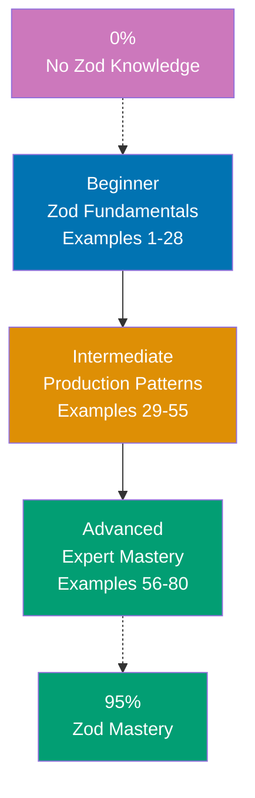

**Want to master Zod schema validation through code?** This by-example tutorial provides 80 heavily annotated examples covering 95% of Zod's API. Learn runtime validation, type inference, transforms, refinements, and production integration patterns through working code rather than lengthy explanations.

## What Is By-Example Learning?

By-example learning is a **code-first approach** where you learn concepts through annotated, working examples rather than narrative explanations. Each example shows:

1. **What the code does** - Brief explanation of the Zod concept
2. **How it works** - A focused, heavily commented code example
3. **Key Takeaway** - A pattern summary highlighting the key takeaway
4. **Why It Matters** - Production context, when to use, deeper significance

This approach works best when you already understand TypeScript fundamentals and have experience building applications. You learn Zod's schema model, validation patterns, and type inference by studying real code rather than theoretical descriptions.

## What Is Zod?

Zod is a **TypeScript-first schema declaration and validation library** that bridges the gap between TypeScript's compile-time type safety and runtime data validation. Key distinctions:

- **TypeScript-first**: Schemas automatically infer TypeScript types — no duplicate type definitions
- **Runtime validation**: Validates data that TypeScript cannot see at compile time (API responses, user input, environment variables)
- **Zero dependencies**: Ships with no external dependencies; minimal bundle impact
- **Composable**: Schemas compose into complex validators through chaining, merging, and nesting
- **Ecosystem integration**: First-class support for tRPC, React Hook Form, Next.js, and most TypeScript frameworks

## Learning Path



## Coverage Philosophy: 95% Through 80 Examples

The **95% coverage** means you'll understand Zod deeply enough to validate any production data with confidence. It doesn't mean you'll know every edge case or internal API — those come with experience.

The 80 examples are organized progressively:

- **Beginner (Examples 1-28)**: Foundation schemas (primitives, objects, arrays, enums, unions, optionals, nullables, defaults, tuples, records, maps, sets, dates, type inference, parse vs safeParse)
- **Intermediate (Examples 29-55)**: Production patterns (refinements, transforms, preprocessors, pipes, discriminated unions, recursive schemas, lazy schemas, custom errors, schema composition, form validation, API validation, coercion)
- **Advanced (Examples 56-80)**: Expert mastery (branded types, custom ZodType, OpenAPI integration, tRPC integration, React Hook Form integration, performance optimization, conditional schemas, generic schemas, custom error maps, z.function(), effect schemas, migration patterns)

Together, these examples cover **95% of what you'll use** in production TypeScript applications.

## Annotation Density: 1-2.25 Comments Per Code Line

**CRITICAL**: All examples maintain **1-2.25 comment lines per code line PER EXAMPLE** to ensure deep understanding.

**What this means**:

- Simple lines get 1 annotation explaining purpose or result
- Complex lines get 2+ annotations explaining behavior, types, and side effects
- Use `// =>` notation to show expected values, outputs, or inferred types

**Example**:

```typescript
import { z } from "zod";

const UserSchema = z.object({
  // => Creates ZodObject schema
  name: z.string(), // => name field: string, required
  age: z.number().min(0), // => age field: number, must be >= 0
  // => min(0) adds runtime constraint
});

type User = z.infer<typeof UserSchema>; // => Extracts TypeScript type from schema
// => User = { name: string; age: number }

const result = UserSchema.safeParse({ name: "Aisha", age: 28 });
// => safeParse: returns { success: true, data: ... } or { success: false, error: ... }
// => Does NOT throw — safe for handling invalid data

if (result.success) {
  console.log(result.data.name); // => Output: "Aisha"
  // => TypeScript narrows result.data to User
}
```

This density ensures each example is self-contained and fully comprehensible without external documentation.

## Structure of Each Example

All examples follow a consistent five-part format:

````
### Example N: Descriptive Title

2-3 sentence explanation of the concept.

```typescript
// Heavily annotated code example
// showing the Zod pattern in action
````

**Key Takeaway**: 1-2 sentence summary.

**Why It Matters**: 50-100 words explaining significance in production applications.

````

**Code annotations**:

- `// =>` shows inferred types, expected output, validation results
- Inline comments explain what each schema method does
- Variable names are self-documenting
- Type annotations make data flow explicit

## What's Covered

### Primitive Schemas

- **Strings**: `z.string()`, string methods (min, max, email, url, uuid, regex)
- **Numbers**: `z.number()`, number methods (min, max, int, positive, negative)
- **Booleans**: `z.boolean()`, boolean coercion
- **Dates**: `z.date()`, date range validation
- **Literals**: `z.literal()`, exact value matching
- **Enums**: `z.enum()`, `z.nativeEnum()`, enum access

### Composite Schemas

- **Objects**: `z.object()`, strict/strip/passthrough modes
- **Arrays**: `z.array()`, length constraints, non-empty arrays
- **Tuples**: `z.tuple()`, fixed-length typed arrays
- **Records**: `z.record()`, typed key-value pairs
- **Maps**: `z.map()`, typed Map structures
- **Sets**: `z.set()`, typed Set structures

### Schema Modifiers

- **Optional/Nullable**: `.optional()`, `.nullable()`, `.nullish()`
- **Defaults**: `.default()`, `.catch()`
- **Union Types**: `z.union()`, discriminated unions
- **Intersections**: `z.intersection()`, schema merging

### Validation and Parsing

- **Parse Methods**: `.parse()`, `.safeParse()`, `.parseAsync()`, `.safeParseAsync()`
- **Type Inference**: `z.infer<>`, `z.input<>`, `z.output<>`
- **Error Handling**: `ZodError`, error formatting, custom error messages
- **Refinements**: `.refine()`, `.superRefine()`, cross-field validation

### Transforms and Preprocessing

- **Transforms**: `.transform()`, data reshaping and mapping
- **Preprocessing**: `z.preprocess()`, input coercion
- **Pipes**: `.pipe()`, schema chaining
- **Coercion**: `z.coerce.*`, automatic type conversion

### Schema Composition

- **Object Methods**: `.merge()`, `.extend()`, `.pick()`, `.omit()`, `.partial()`, `.required()`
- **Recursive Schemas**: `z.lazy()`, recursive data structures
- **Schema Utilities**: `.and()`, `.or()`, `.brand()`, `.readonly()`

### Production Integration

- **Form Validation**: React Hook Form + Zod integration
- **API Validation**: Request/response schema validation
- **tRPC Integration**: Schema-first API definition
- **OpenAPI**: Schema to OpenAPI spec generation

### Advanced Patterns

- **Branded Types**: Type-safe nominal typing
- **Custom ZodType**: Extending Zod with custom validators
- **Generic Schemas**: Reusable parameterized schemas
- **z.function()**: Function schema validation
- **Custom Error Maps**: Global error customization
- **Effect Schemas**: `.transform()` with effects pattern

## What's NOT Covered

We exclude topics that belong in specialized tutorials:

- **Zod Internals**: Parser implementation details, AST traversal
- **Alternative Libraries**: Yup, io-ts, Valibot comparisons (brief migration examples only)
- **Build Configuration**: TypeScript strict mode setup (assumed)
- **Framework Internals**: Next.js, tRPC source code
- **Advanced TypeScript**: Conditional types, mapped types unrelated to Zod

For these topics, see dedicated tutorials and the official Zod documentation.

## Prerequisites

### Required

- **TypeScript fundamentals**: Types, interfaces, generics, type inference
- **ES6+ JavaScript**: Destructuring, spread operators, async/await
- **npm/module system**: Package installation and imports
- **Programming experience**: You've built TypeScript applications before

### Recommended

- **React basics**: Helpful for form validation examples
- **REST API concepts**: Helpful for API validation examples
- **tRPC awareness**: Helpful for advanced integration examples

### Not Required

- **Zod experience**: This guide assumes you're new to Zod
- **Advanced TypeScript**: We explain TypeScript patterns as needed
- **Functional programming**: Helpful but not required

## Getting Started

Before starting the examples, ensure Zod is installed:

```bash
npm install zod
````

All examples use `import { z } from "zod"` and are runnable in a TypeScript environment (Node.js with `tsx` or `ts-node`, or browser with bundler).

```bash
# Run examples directly with tsx
npx tsx example.ts
```

## How to Use This Guide

### 1. Choose Your Starting Point

- **New to Zod?** Start with Beginner (Example 1)
- **Know basic schemas?** Start with Intermediate (Example 29)
- **Building production integration?** Jump to Advanced (Example 56)

### 2. Read the Example

Each example has five parts:

- **Explanation** (2-3 sentences): What Zod concept, why it exists, when to use it
- **Code** (heavily commented): Working TypeScript code showing the pattern
- **Key Takeaway** (1-2 sentences): Distilled essence of the pattern
- **Why It Matters** (50-100 words): Production context and deeper significance

### 3. Run the Code

Create a test file and run each example:

```bash
mkdir zod-examples && cd zod-examples
npm init -y
npm install zod tsx typescript
# Paste example code into example.ts
npx tsx example.ts
```

### 4. Modify and Experiment

Change schemas, add invalid data, break validations on purpose. Experimentation builds intuition faster than reading.

### 5. Reference as Needed

Use this guide as a reference when building features. Search for relevant examples and adapt patterns to your code.

## Ready to Start?

Choose your learning path:

- **Beginner** - Start here if new to Zod. Build foundation understanding through 28 core examples.
- **Intermediate** - Jump here if you know basic schemas. Master production patterns through 27 examples.
- **Advanced** - Expert mastery through 25 advanced examples covering integrations, branded types, and optimization.

Or jump to specific topics by searching for relevant example keywords (parse, refine, transform, form, API, branded, tRPC, etc.).

## Examples by Level

### Beginner (Examples 1–28)

- [Example 1: String Schema](/en/learn/software-engineering/platform-web/tools/ts-zod/by-example/beginner#example-1-string-schema)
- [Example 2: Number Schema](/en/learn/software-engineering/platform-web/tools/ts-zod/by-example/beginner#example-2-number-schema)
- [Example 3: Boolean Schema](/en/learn/software-engineering/platform-web/tools/ts-zod/by-example/beginner#example-3-boolean-schema)
- [Example 4: String Validations](/en/learn/software-engineering/platform-web/tools/ts-zod/by-example/beginner#example-4-string-validations)
- [Example 5: Number Validations](/en/learn/software-engineering/platform-web/tools/ts-zod/by-example/beginner#example-5-number-validations)
- [Example 6: Literal Schema](/en/learn/software-engineering/platform-web/tools/ts-zod/by-example/beginner#example-6-literal-schema)
- [Example 7: Date Schema](/en/learn/software-engineering/platform-web/tools/ts-zod/by-example/beginner#example-7-date-schema)
- [Example 8: Object Schema](/en/learn/software-engineering/platform-web/tools/ts-zod/by-example/beginner#example-8-object-schema)
- [Example 9: Nested Object Schema](/en/learn/software-engineering/platform-web/tools/ts-zod/by-example/beginner#example-9-nested-object-schema)
- [Example 10: Array Schema](/en/learn/software-engineering/platform-web/tools/ts-zod/by-example/beginner#example-10-array-schema)
- [Example 11: Tuple Schema](/en/learn/software-engineering/platform-web/tools/ts-zod/by-example/beginner#example-11-tuple-schema)
- [Example 12: Optional Schema](/en/learn/software-engineering/platform-web/tools/ts-zod/by-example/beginner#example-12-optional-schema)
- [Example 13: Nullable Schema](/en/learn/software-engineering/platform-web/tools/ts-zod/by-example/beginner#example-13-nullable-schema)
- [Example 14: Default Values](/en/learn/software-engineering/platform-web/tools/ts-zod/by-example/beginner#example-14-default-values)
- [Example 15: Catch (Fallback on Error)](/en/learn/software-engineering/platform-web/tools/ts-zod/by-example/beginner#example-15-catch-fallback-on-error)
- [Example 16: Enum Schema](/en/learn/software-engineering/platform-web/tools/ts-zod/by-example/beginner#example-16-enum-schema)
- [Example 17: Union Schema](/en/learn/software-engineering/platform-web/tools/ts-zod/by-example/beginner#example-17-union-schema)
- [Example 18: Optional and Nullable Combined](/en/learn/software-engineering/platform-web/tools/ts-zod/by-example/beginner#example-18-optional-and-nullable-combined)
- [Example 19: Record Schema](/en/learn/software-engineering/platform-web/tools/ts-zod/by-example/beginner#example-19-record-schema)
- [Example 20: Map Schema](/en/learn/software-engineering/platform-web/tools/ts-zod/by-example/beginner#example-20-map-schema)
- [Example 21: Set Schema](/en/learn/software-engineering/platform-web/tools/ts-zod/by-example/beginner#example-21-set-schema)
- [Example 22: parse vs safeParse](/en/learn/software-engineering/platform-web/tools/ts-zod/by-example/beginner#example-22-parse-vs-safeparse)
- [Example 23: Type Inference with z.infer](/en/learn/software-engineering/platform-web/tools/ts-zod/by-example/beginner#example-23-type-inference-with-zinfer)
- [Example 24: ZodError Structure](/en/learn/software-engineering/platform-web/tools/ts-zod/by-example/beginner#example-24-zoderror-structure)
- [Example 25: Async Validation](/en/learn/software-engineering/platform-web/tools/ts-zod/by-example/beginner#example-25-async-validation)
- [Example 26: Schema Intersection](/en/learn/software-engineering/platform-web/tools/ts-zod/by-example/beginner#example-26-schema-intersection)
- [Example 27: Schema Branching with .or()](/en/learn/software-engineering/platform-web/tools/ts-zod/by-example/beginner#example-27-schema-branching-with-or)
- [Example 28: Schema Reuse and Composition](/en/learn/software-engineering/platform-web/tools/ts-zod/by-example/beginner#example-28-schema-reuse-and-composition)

### Intermediate (Examples 29–55)

- [Example 29: Basic Refinement with .refine()](/en/learn/software-engineering/platform-web/tools/ts-zod/by-example/intermediate#example-29-basic-refinement-with-refine)
- [Example 30: superRefine for Multiple Errors](/en/learn/software-engineering/platform-web/tools/ts-zod/by-example/intermediate#example-30-superrefine-for-multiple-errors)
- [Example 31: Transform Values](/en/learn/software-engineering/platform-web/tools/ts-zod/by-example/intermediate#example-31-transform-values)
- [Example 32: Preprocess](/en/learn/software-engineering/platform-web/tools/ts-zod/by-example/intermediate#example-32-preprocess)
- [Example 33: Pipeline with .pipe()](/en/learn/software-engineering/platform-web/tools/ts-zod/by-example/intermediate#example-33-pipeline-with-pipe)
- [Example 34: Discriminated Union](/en/learn/software-engineering/platform-web/tools/ts-zod/by-example/intermediate#example-34-discriminated-union)
- [Example 35: Coercion with z.coerce](/en/learn/software-engineering/platform-web/tools/ts-zod/by-example/intermediate#example-35-coercion-with-zcoerce)
- [Example 36: Recursive Schemas with z.lazy()](/en/learn/software-engineering/platform-web/tools/ts-zod/by-example/intermediate#example-36-recursive-schemas-with-zlazy)
- [Example 37: Custom Error Messages](/en/learn/software-engineering/platform-web/tools/ts-zod/by-example/intermediate#example-37-custom-error-messages)
- [Example 38: Error Formatting](/en/learn/software-engineering/platform-web/tools/ts-zod/by-example/intermediate#example-38-error-formatting)
- [Example 39: Object Schema Methods — merge and extend](/en/learn/software-engineering/platform-web/tools/ts-zod/by-example/intermediate#example-39-object-schema-methods--merge-and-extend)
- [Example 40: Object Schema Methods — pick and omit](/en/learn/software-engineering/platform-web/tools/ts-zod/by-example/intermediate#example-40-object-schema-methods--pick-and-omit)
- [Example 41: Partial and Required](/en/learn/software-engineering/platform-web/tools/ts-zod/by-example/intermediate#example-41-partial-and-required)
- [Example 42: Schema Validation Methods — keyof and shape](/en/learn/software-engineering/platform-web/tools/ts-zod/by-example/intermediate#example-42-schema-validation-methods--keyof-and-shape)
- [Example 43: Form Validation Pattern](/en/learn/software-engineering/platform-web/tools/ts-zod/by-example/intermediate#example-43-form-validation-pattern)
- [Example 44: API Request Validation](/en/learn/software-engineering/platform-web/tools/ts-zod/by-example/intermediate#example-44-api-request-validation)
- [Example 45: API Response Validation](/en/learn/software-engineering/platform-web/tools/ts-zod/by-example/intermediate#example-45-api-response-validation)
- [Example 46: Environment Variable Validation](/en/learn/software-engineering/platform-web/tools/ts-zod/by-example/intermediate#example-46-environment-variable-validation)
- [Example 47: Branded Types](/en/learn/software-engineering/platform-web/tools/ts-zod/by-example/intermediate#example-47-branded-types)
- [Example 48: Discriminated Union Advanced Pattern](/en/learn/software-engineering/platform-web/tools/ts-zod/by-example/intermediate#example-48-discriminated-union-advanced-pattern)
- [Example 49: Schema Composition with .and()](/en/learn/software-engineering/platform-web/tools/ts-zod/by-example/intermediate#example-49-schema-composition-with-and)
- [Example 50: Conditional Validation with superRefine](/en/learn/software-engineering/platform-web/tools/ts-zod/by-example/intermediate#example-50-conditional-validation-with-superrefine)
- [Example 51: Custom Error Map](/en/learn/software-engineering/platform-web/tools/ts-zod/by-example/intermediate#example-51-custom-error-map)
- [Example 52: z.function() Schema](/en/learn/software-engineering/platform-web/tools/ts-zod/by-example/intermediate#example-52-zfunction-schema)
- [Example 53: Readonly Schema](/en/learn/software-engineering/platform-web/tools/ts-zod/by-example/intermediate#example-53-readonly-schema)
- [Example 54: Schema from Unknown Data](/en/learn/software-engineering/platform-web/tools/ts-zod/by-example/intermediate#example-54-schema-from-unknown-data)
- [Example 55: Schema Introspection](/en/learn/software-engineering/platform-web/tools/ts-zod/by-example/intermediate#example-55-schema-introspection)

### Advanced (Examples 56–80)

- [Example 56: Custom ZodType](/en/learn/software-engineering/platform-web/tools/ts-zod/by-example/advanced#example-56-custom-zodtype)
- [Example 57: Generic Schema Factory](/en/learn/software-engineering/platform-web/tools/ts-zod/by-example/advanced#example-57-generic-schema-factory)
- [Example 58: Schema-to-OpenAPI with zod-to-json-schema](/en/learn/software-engineering/platform-web/tools/ts-zod/by-example/advanced#example-58-schema-to-openapi-with-zod-to-json-schema)
- [Example 59: tRPC Integration](/en/learn/software-engineering/platform-web/tools/ts-zod/by-example/advanced#example-59-trpc-integration)
- [Example 60: React Hook Form Integration](/en/learn/software-engineering/platform-web/tools/ts-zod/by-example/advanced#example-60-react-hook-form-integration)
- [Example 61: Next.js Server Action Validation](/en/learn/software-engineering/platform-web/tools/ts-zod/by-example/advanced#example-61-nextjs-server-action-validation)
- [Example 62: Schema Caching and Reuse](/en/learn/software-engineering/platform-web/tools/ts-zod/by-example/advanced#example-62-schema-caching-and-reuse)
- [Example 63: Lazy Validation with safeParse](/en/learn/software-engineering/platform-web/tools/ts-zod/by-example/advanced#example-63-lazy-validation-with-safeparse)
- [Example 64: Batch Validation](/en/learn/software-engineering/platform-web/tools/ts-zod/by-example/advanced#example-64-batch-validation)
- [Example 65: Runtime Type Guards with Zod](/en/learn/software-engineering/platform-web/tools/ts-zod/by-example/advanced#example-65-runtime-type-guards-with-zod)
- [Example 66: Composable Validation Middleware](/en/learn/software-engineering/platform-web/tools/ts-zod/by-example/advanced#example-66-composable-validation-middleware)
- [Example 67: Versioned Schema Migration](/en/learn/software-engineering/platform-web/tools/ts-zod/by-example/advanced#example-67-versioned-schema-migration)
- [Example 68: Dynamic Schema Generation](/en/learn/software-engineering/platform-web/tools/ts-zod/by-example/advanced#example-68-dynamic-schema-generation)
- [Example 69: Memoized Validation Results](/en/learn/software-engineering/platform-web/tools/ts-zod/by-example/advanced#example-69-memoized-validation-results)
- [Example 70: Schema from TypeScript Types (Reverse Inference)](/en/learn/software-engineering/platform-web/tools/ts-zod/by-example/advanced#example-70-schema-from-typescript-types-reverse-inference)
- [Example 71: Migrating from Yup](/en/learn/software-engineering/platform-web/tools/ts-zod/by-example/advanced#example-71-migrating-from-yup)
- [Example 72: Migrating from io-ts](/en/learn/software-engineering/platform-web/tools/ts-zod/by-example/advanced#example-72-migrating-from-io-ts)
- [Example 73: Effect Schemas (Advanced Transform Pattern)](/en/learn/software-engineering/platform-web/tools/ts-zod/by-example/advanced#example-73-effect-schemas-advanced-transform-pattern)
- [Example 74: Schema Registry Pattern](/en/learn/software-engineering/platform-web/tools/ts-zod/by-example/advanced#example-74-schema-registry-pattern)
- [Example 75: Complete Production Schema Architecture](/en/learn/software-engineering/platform-web/tools/ts-zod/by-example/advanced#example-75-complete-production-schema-architecture)
- [Example 76: Testing Schemas](/en/learn/software-engineering/platform-web/tools/ts-zod/by-example/advanced#example-76-testing-schemas)
- [Example 77: Advanced Error Path Navigation](/en/learn/software-engineering/platform-web/tools/ts-zod/by-example/advanced#example-77-advanced-error-path-navigation)
- [Example 78: Schema Cloning and Modification](/en/learn/software-engineering/platform-web/tools/ts-zod/by-example/advanced#example-78-schema-cloning-and-modification)
- [Example 79: Zod with Drizzle ORM Integration](/en/learn/software-engineering/platform-web/tools/ts-zod/by-example/advanced#example-79-zod-with-drizzle-orm-integration)
- [Example 80: Building a Schema-First API Layer](/en/learn/software-engineering/platform-web/tools/ts-zod/by-example/advanced#example-80-building-a-schema-first-api-layer)
