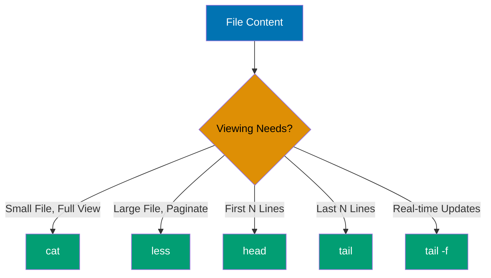
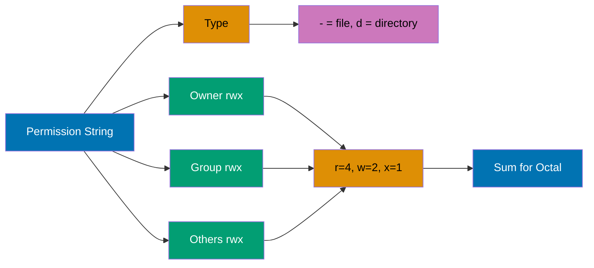
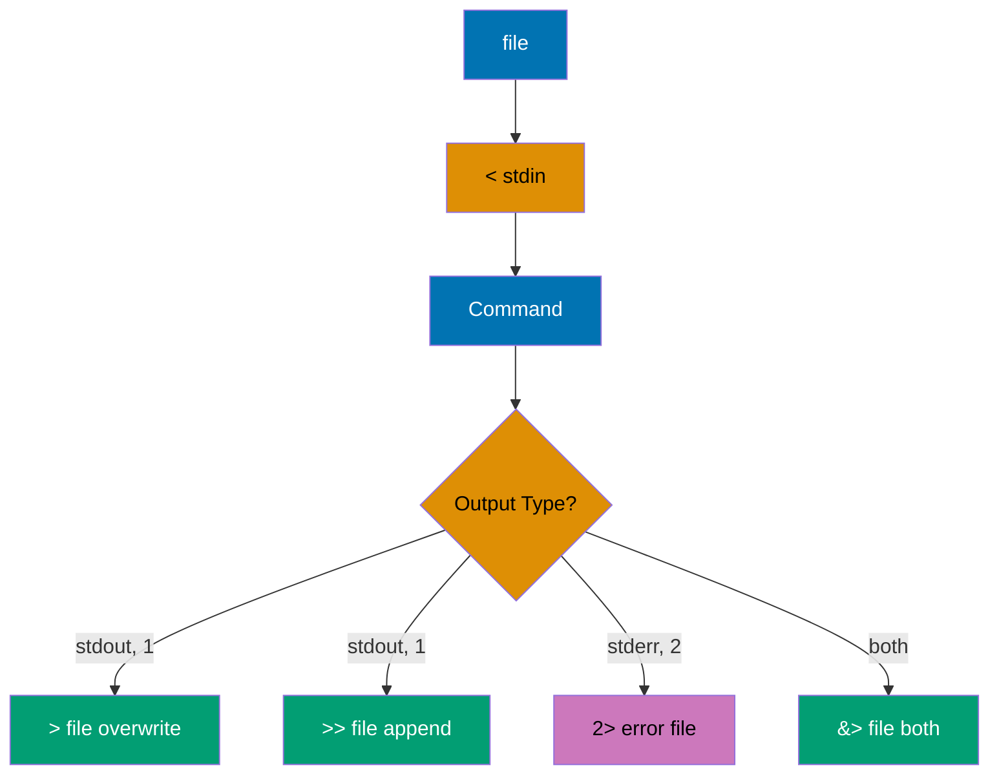
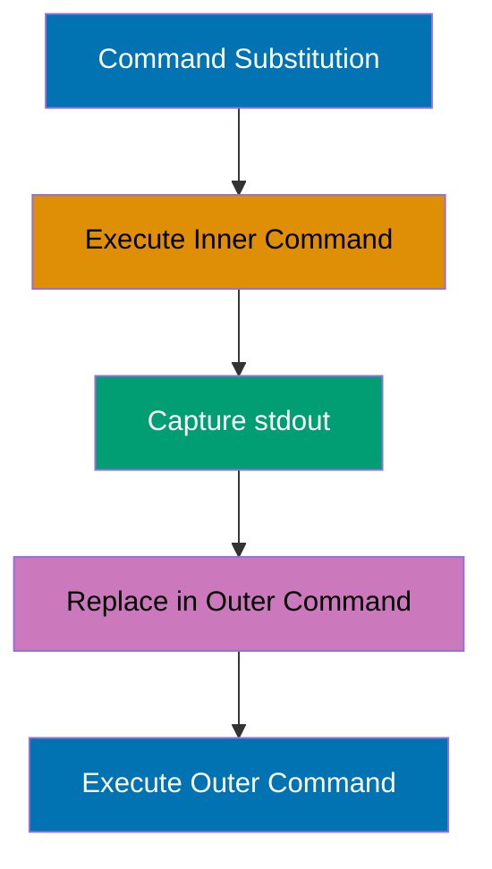
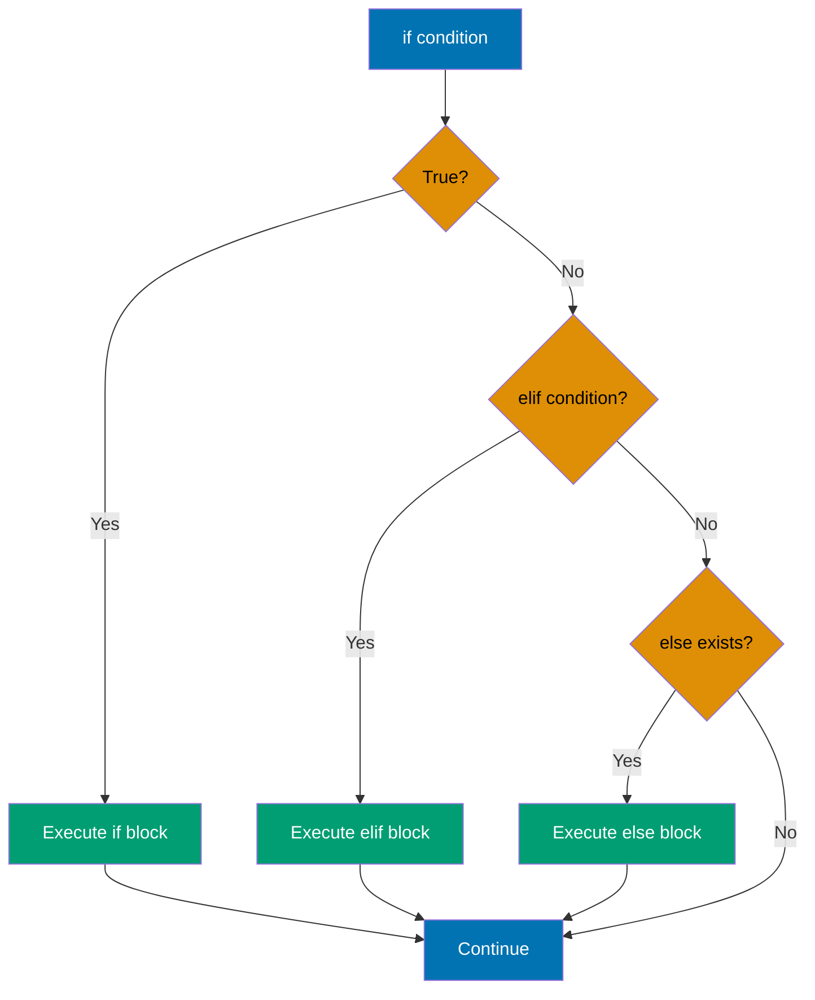
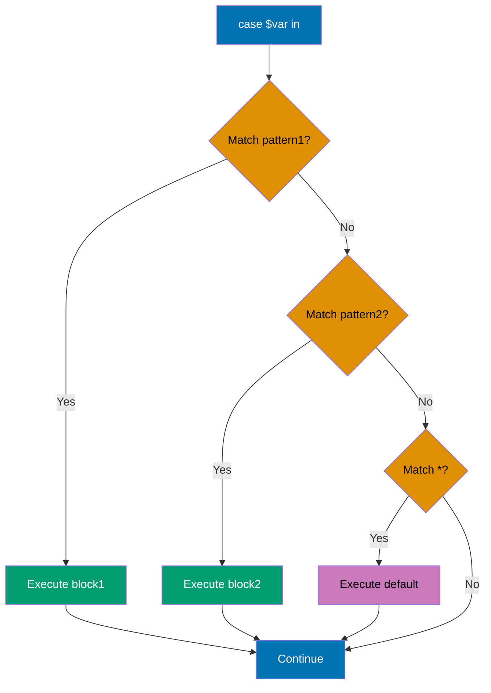
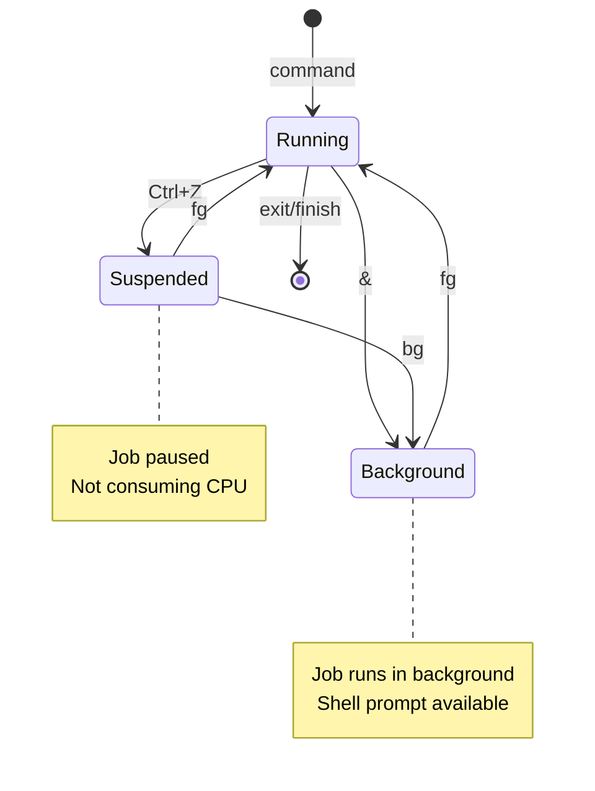

## Beginner Level (0-40% Coverage)

This level covers Linux shell fundamentals through 30 self-contained examples. Each example is copy-paste-runnable and demonstrates core command-line features needed for basic shell usage.

---

### Example 1: Echo and Basic Output

The `echo` command outputs text to stdout, supporting variable expansion, escape sequences, and redirection. It's the most basic way to produce output and debug shell scripts.

```bash
# Basic echo
echo "Hello, World!"           # => Output: Hello, World!

# Echo without newline
echo -n "No newline"            # => Output: No newline (cursor stays on same line)

# Echo with escape sequences (requires -e flag)
echo -e "Line 1\nLine 2"        # => Output: Line 1
                                # => Line 2 (newline interpreted)

# Echo variables
USER_NAME="Alice"               # => USER_NAME is "Alice"
echo "Hello, $USER_NAME"        # => Output: Hello, Alice (variable expanded)

# Echo with command substitution
echo "Current directory: $(pwd)" # => Output: Current directory: /home/user (pwd output)
```

**Key Takeaway**: Use `echo` for simple output and debugging - it automatically expands variables in double quotes and supports escape sequences with `-e` flag.

---

### Example 2: Variables and Assignment

Shell variables store strings by default, with no type declarations. Variable names are case-sensitive and conventionally use UPPERCASE for environment variables and lowercase for local variables.

```bash
# Variable assignment (no spaces around =)
name="Bob"                      # => name is "Bob"
age=30                          # => age is "30" (stored as string)
echo "$name is $age years old"  # => Output: Bob is 30 years old

# Variable expansion in double quotes
greeting="Hello, $name"         # => greeting is "Hello, Bob" (expanded)
echo "$greeting"                # => Output: Hello, Bob

# Single quotes prevent expansion
literal='$name'                 # => literal is literally "$name" (not expanded)
echo "$literal"                 # => Output: $name

# Command substitution
current_date=$(date +%Y-%m-%d)  # => current_date is "2025-12-30" (date command output)
echo "Today: $current_date"     # => Output: Today: 2025-12-30

# Arithmetic with $(( ))
x=10                            # => x is "10"
y=20                            # => y is "20"
sum=$((x + y))                  # => sum is "30" (arithmetic evaluation)
echo "Sum: $sum"                # => Output: Sum: 30
```

**Key Takeaway**: Use double quotes for variable expansion and single quotes for literal strings - assign variables without spaces around `=` and use `$(command)` for command substitution or `$((expression))` for arithmetic.

---

### Example 3: Command Structure and Options

Shell commands follow the pattern `command [options] [arguments]` where options modify behavior and arguments specify targets. Options typically use `-` for short form and `--` for long form.


```bash
# Basic command
ls                              # => Output: Lists files in current directory

# Command with short option
ls -l                           # => Output: Long format listing (detailed info)

# Multiple short options (combined)
ls -la                          # => Output: Long format including hidden files (-l and -a)

# Command with long option
ls --all                        # => Output: Shows hidden files (same as -a)

# Command with option argument
ls -w 80                        # => Output: Limits output width to 80 characters

# Command with multiple arguments
ls /etc /var /tmp               # => Output: Lists contents of three directories

# Mixing options and arguments
ls -lh /var/log                 # => Output: Long format, human-readable sizes, /var/log contents
                                # => -l: long format, -h: human-readable (1K, 234M, 2G)

# Getting help
ls --help                       # => Output: Displays ls command help
man ls                          # => Output: Opens manual page for ls (press 'q' to quit)
```

**Key Takeaway**: Most commands follow the pattern `command [options] [arguments]` - use short options (`-a`) for quick typing, long options (`--all`) for script readability, and `man command` to learn about any command's options.

---

### Example 4: Navigating Directories (pwd, cd, ls)

Directory navigation uses `pwd` to show current location, `cd` to change directories, and `ls` to list contents. Understanding absolute vs relative paths is crucial for effective navigation.

```bash
# Show current directory
pwd                             # => Output: /home/user (absolute path)

# List current directory contents
ls                              # => Output: file1.txt  file2.txt  directory1

# List with details
ls -l                           # => Output: Shows permissions, owner, size, date
                                # => -rw-r--r-- 1 user group 1234 Dec 30 08:00 file1.txt

# List hidden files (start with .)
ls -a                           # => Output: .  ..  .bashrc  .profile  file1.txt

# Change to home directory
cd ~                            # => Current directory is now /home/user
cd                              # => Same as cd ~ (defaults to home)

# Change to absolute path
cd /var/log                     # => Current directory is now /var/log

# Change to relative path
cd ../..                        # => Moves up two directories
                                # => If was in /var/log, now in /

# Change to subdirectory
cd documents/work               # => Moves to documents/work under current dir

# Return to previous directory
cd -                            # => Switches to previous directory
                                # => Output: /var/log (prints previous directory)

# List specific directory without changing to it
ls /etc                         # => Output: Lists /etc contents (current dir unchanged)
```

**Key Takeaway**: Use `pwd` to check your location, `cd` with absolute paths (`/path/to/dir`) for certainty or relative paths (`../dir`) for convenience, and `cd -` to toggle between two directories.

---

### Example 5: Creating and Removing Directories (mkdir, rmdir, rm)

Directory creation uses `mkdir` with optional `-p` for parent creation, while removal uses `rmdir` for empty directories or `rm -r` for non-empty ones.

```bash
# Create single directory
mkdir projects                  # => Creates directory 'projects' in current location

# Create nested directories (requires -p)
mkdir -p work/code/python       # => Creates work/, work/code/, and work/code/python
                                # => -p creates parent directories if needed

# Create multiple directories at once
mkdir dir1 dir2 dir3            # => Creates three directories: dir1, dir2, dir3

# Create directory with specific permissions
mkdir -m 755 public_html        # => Creates directory with rwxr-xr-x permissions
                                # => 7=rwx (owner), 5=r-x (group), 5=r-x (others)

# Remove empty directory
rmdir dir1                      # => Removes dir1 (only if empty!)
                                # => Error if directory contains files

# Remove directory with contents (DANGEROUS - use carefully!)
rm -r dir2                      # => Recursively removes dir2 and all contents
                                # => -r: recursive (deletes files and subdirectories)

# Remove directory with confirmation
rm -ri dir3                     # => Interactive removal (asks before each deletion)
                                # => -i: interactive (prompts for confirmation)

# Force remove without prompts (VERY DANGEROUS!)
rm -rf temp_data                # => Force removes temp_data and contents
                                # => -f: force (no warnings, no confirmations)
                                # => NEVER use rm -rf / or rm -rf /* !!!

# Remove multiple directories
rm -r old_*                     # => Removes all directories starting with "old_"
```

**Key Takeaway**: Use `mkdir -p` to create nested directories safely, `rmdir` for empty directories, and `rm -r` for directories with contents - always double-check before using `rm -rf` as it's irreversible and dangerous.

---

### Example 6: File Viewing (cat, less, head, tail)

File viewing commands let you examine file contents without editing: `cat` for entire files, `less` for paging, `head` for beginning, and `tail` for ending.



```bash
# View entire file
cat file.txt                    # => Output: Entire file contents (scrolls if long)

# View multiple files (concatenate)
cat file1.txt file2.txt         # => Output: file1 contents, then file2 contents

# Number lines
cat -n file.txt                 # => Output: Each line prefixed with line number
                                # => 1  First line
                                # => 2  Second line

# View with paging (large files)
less file.txt                   # => Opens file in pager
                                # => Space: next page, b: previous page, q: quit
                                # => /pattern: search forward, ?pattern: search backward

# View first 10 lines
head file.txt                   # => Output: First 10 lines of file

# View first N lines
head -n 5 file.txt              # => Output: First 5 lines
head -5 file.txt                # => Same as head -n 5 (shorthand)

# View last 10 lines
tail file.txt                   # => Output: Last 10 lines of file

# View last N lines
tail -n 20 file.txt             # => Output: Last 20 lines
tail -20 file.txt               # => Same as tail -n 20 (shorthand)

# Follow file updates (real-time monitoring)
tail -f /var/log/syslog         # => Output: Shows last lines and updates as file grows
                                # => Ctrl+C to exit
                                # => Perfect for monitoring log files

# Follow with line count
tail -f -n 50 app.log           # => Shows last 50 lines and follows updates
```

**Key Takeaway**: Use `cat` for small files, `less` for browsing large files interactively, `head` for beginnings, `tail` for endings, and `tail -f` for real-time log monitoring.

---

### Example 7: File Operations (cp, mv, rm)

File manipulation commands copy files (`cp`), move/rename files (`mv`), and delete files (`rm`). These operations are fundamental to file management.

```bash
# Copy file
cp source.txt backup.txt        # => Creates backup.txt as copy of source.txt
                                # => source.txt remains unchanged

# Copy with directory structure
cp /path/to/file.txt .          # => Copies file.txt to current directory (. means here)

# Copy directory recursively
cp -r old_project new_project   # => Copies entire directory and contents
                                # => -r: recursive (required for directories)

# Copy preserving attributes
cp -a original copy             # => Preserves permissions, timestamps, ownership
                                # => -a: archive mode (same as -dR --preserve=all)

# Copy interactively (confirm overwrites)
cp -i file.txt existing.txt     # => Prompts before overwriting existing.txt
                                # => -i: interactive

# Move/rename file
mv old_name.txt new_name.txt    # => Renames old_name.txt to new_name.txt
                                # => old_name.txt no longer exists

# Move to directory
mv file.txt documents/          # => Moves file.txt into documents/ directory
                                # => File keeps same name in new location

# Move multiple files
mv *.txt documents/             # => Moves all .txt files to documents/
                                # => * is glob pattern (wildcard)

# Move with overwrite protection
mv -n file.txt backup/          # => Moves only if destination doesn't exist
                                # => -n: no clobber (don't overwrite)

# Remove file
rm file.txt                     # => Deletes file.txt (PERMANENT - no trash!)

# Remove with confirmation
rm -i *.log                     # => Asks confirmation before deleting each .log file
                                # => -i: interactive

# Remove multiple files
rm file1.txt file2.txt file3.txt # => Deletes three files

# Force remove (DANGEROUS - use with extreme caution!)
rm -f locked_file.txt           # => Removes file without asking, even if write-protected
                                # => -f: force
```

**Key Takeaway**: Use `cp` for copying, `mv` for moving/renaming, and `rm` for deletion - always use `-i` flag for interactive confirmation with destructive operations, and remember that `rm` is permanent (no undo).

---

### Example 8: File Permissions (ls -l, chmod)

Linux file permissions control read, write, and execute access for owner, group, and others. Permissions are displayed in `ls -l` output and modified with `chmod`.



```bash
# View permissions
ls -l file.txt                  # => Output: -rw-r--r-- 1 user group 1234 Dec 30 file.txt
                                # => -rw-r--r-- breaks down:
                                # => -: file type (- = regular file, d = directory)
                                # => rw-: owner permissions (read, write, no execute)
                                # => r--: group permissions (read only)
                                # => r--: others permissions (read only)

# Permission meanings
# r (read) = 4: View file contents or list directory
# w (write) = 2: Modify file or create/delete files in directory
# x (execute) = 1: Run file as program or enter directory

# Make file executable
chmod +x script.sh              # => Adds execute permission for all (owner, group, others)
                                # => Now can run: ./script.sh

# Remove write permission from group and others
chmod go-w file.txt             # => g=group, o=others, -w removes write
                                # => Owner keeps all permissions

# Set specific permissions with octal
chmod 644 file.txt              # => 6=rw- (owner), 4=r-- (group), 4=r-- (others)
                                # => 644 = owner read/write, others read-only
                                # => Common for regular files

chmod 755 script.sh             # => 7=rwx (owner), 5=r-x (group), 5=r-x (others)
                                # => 755 = owner full access, others read/execute
                                # => Common for executable scripts

chmod 700 private.txt           # => 7=rwx (owner), 0=--- (group), 0=--- (others)
                                # => Only owner can access
                                # => Common for private files

# Set permissions recursively
chmod -R 755 public_html/       # => Sets 755 on directory and all contents
                                # => -R: recursive

# Symbolic permissions
chmod u+x file.sh               # => u=user/owner, +x adds execute for owner only
chmod g+w,o-r file.txt          # => g+w: add write for group, o-r: remove read for others
chmod a=r file.txt              # => a=all (user, group, others), =r: set to read-only for all
```

**Key Takeaway**: Use `ls -l` to view permissions, `chmod` with octal notation (644, 755, 700) for absolute permission sets, or symbolic notation (u+x, go-w) for relative changes - remember that 644 is standard for files and 755 for directories/executables.

---

### Example 9: Output Redirection (>, >>, <, 2>)

Redirection operators control where command input comes from and where output goes. `>` redirects stdout, `>>` appends, `<` redirects stdin, and `2>` redirects stderr.



```bash
# Redirect stdout to file (overwrite)
echo "Hello, World" > output.txt # => Creates/overwrites output.txt with "Hello, World"
                                # => File now contains: Hello, World

# Redirect stdout to file (append)
echo "Second line" >> output.txt # => Appends "Second line" to output.txt
                                # => File now contains:
                                # => Hello, World
                                # => Second line

# Redirect stderr to file
ls /nonexistent 2> error.log    # => Redirects error message to error.log
                                # => 2>: file descriptor 2 (stderr)
                                # => error.log contains: ls: cannot access '/nonexistent': No such file or directory

# Redirect both stdout and stderr
command &> all_output.txt       # => Redirects both stdout and stderr to all_output.txt
                                # => &>: shorthand for >all_output.txt 2>&1

# Redirect stdout and stderr separately
command >output.log 2>error.log # => stdout to output.log, stderr to error.log
                                # => Separates normal output from errors

# Discard output (send to /dev/null)
command > /dev/null             # => Discards stdout (silent execution)
command 2> /dev/null            # => Discards stderr (hide errors)
command &> /dev/null            # => Discards both stdout and stderr

# Redirect stdin from file
wc -l < input.txt               # => wc reads from input.txt instead of waiting for keyboard
                                # => Counts lines in input.txt
                                # => Output: 42 (just the number, no filename)

# Here document (multi-line input)
cat > config.txt << EOF         # => Writes everything until EOF to config.txt
line 1
line 2
line 3
EOF                             # => config.txt now contains 3 lines

# Combine redirection
sort < unsorted.txt > sorted.txt # => Reads from unsorted.txt, writes sorted output to sorted.txt
                                # => unsorted.txt remains unchanged
```

**Key Takeaway**: Use `>` to redirect output to files (overwrites), `>>` to append, `2>` for error messages, and `< ` for input - remember that `> /dev/null` discards output, useful for silent execution.

---

### Example 10: Pipes (|)

Pipes connect commands by sending stdout of one command to stdin of the next, enabling powerful command composition for data processing workflows.

```bash
# Basic pipe
ls -l | wc -l                   # => Counts lines from ls output
                                # => ls -l produces file listing
                                # => wc -l counts lines
                                # => Output: 42 (number of files/dirs)

# Chain multiple commands
cat file.txt | grep "error" | wc -l
                                # => cat reads file
                                # => grep filters lines containing "error"
                                # => wc -l counts filtered lines
                                # => Output: 5 (number of error lines)

# Sort and unique
cat names.txt | sort | uniq     # => Removes duplicate lines
                                # => sort: alphabetically sorts lines
                                # => uniq: removes consecutive duplicates (requires sorted input)

# Head and tail through pipe
ls -lt | head -10               # => Shows 10 most recently modified files
                                # => ls -lt: list sorted by modification time
                                # => head -10: take first 10 lines

# Complex processing pipeline
cat access.log | grep "404" | awk '{print $7}' | sort | uniq -c | sort -nr
                                # => Analyzes 404 errors in web log
                                # => grep "404": filter 404 status lines
                                # => awk '{print $7}': extract URL (7th field)
                                # => sort: alphabetically sort URLs
                                # => uniq -c: count occurrences
                                # => sort -nr: numeric reverse sort (most common first)

# Tee - write to file AND continue pipe
ls -l | tee listing.txt | wc -l # => Saves ls output to file AND counts lines
                                # => tee: writes to file and passes to next command
                                # => listing.txt contains full listing
                                # => Output: 42 (line count)

# Multiple pipes for data transformation
echo "  HELLO WORLD  " | tr '[:upper:]' '[:lower:]' | sed 's/^  *//' | sed 's/  *$//'
                                # => Transforms text through pipeline
                                # => tr: converts uppercase to lowercase
                                # => sed 1: removes leading spaces
                                # => sed 2: removes trailing spaces
                                # => Output: hello world

# Pipe with xargs (convert stdin to arguments)
find . -name "*.tmp" | xargs rm # => Deletes all .tmp files
                                # => find: produces list of .tmp files
                                # => xargs rm: converts list to rm arguments
                                # => Equivalent to: rm file1.tmp file2.tmp ...
```

**Key Takeaway**: Pipes enable command composition by connecting stdout to stdin - use them to build powerful data processing workflows from simple commands, and remember that pipe order matters (process left to right).

---

### Example 11: Searching Files (find)

The `find` command locates files and directories based on name, type, size, time, permissions, and other criteria, with optional execution of commands on results.

```bash
# Find by name
find . -name "*.txt"            # => Finds all .txt files in current directory and subdirectories
                                # => . means start from current directory
                                # => Output: ./file1.txt, ./subdir/file2.txt

# Find case-insensitive
find . -iname "*.TXT"           # => Finds *.txt, *.TXT, *.Txt (case-insensitive)
                                # => -iname: ignore case

# Find by type
find /var/log -type f           # => Finds only regular files (not directories)
                                # => -type f: files
find /var/log -type d           # => Finds only directories
                                # => -type d: directories
find /tmp -type l               # => Finds symbolic links
                                # => -type l: links

# Find by size
find . -size +10M               # => Files larger than 10 megabytes
                                # => +10M: greater than 10MB
find . -size -1k                # => Files smaller than 1 kilobyte
                                # => -1k: less than 1KB

# Find by modification time
find . -mtime -7                # => Files modified in last 7 days
                                # => -mtime -7: modified within 7 days
find . -mtime +30               # => Files modified more than 30 days ago
                                # => +30: older than 30 days

# Find by permissions
find . -perm 644                # => Files with exactly 644 permissions
find . -perm -644               # => Files with at least 644 permissions (may have more)

# Combine conditions with AND
find . -name "*.log" -size +1M  # => Finds .log files larger than 1MB
                                # => Both conditions must match (implicit AND)

# Combine with OR
find . -name "*.txt" -o -name "*.md"
                                # => Finds .txt OR .md files
                                # => -o: OR operator

# Execute command on results
find . -name "*.tmp" -delete    # => Deletes all .tmp files
                                # => -delete: built-in delete action

find . -type f -exec chmod 644 {} \;
                                # => Sets 644 permissions on all files
                                # => -exec: execute command
                                # => {}: replaced with found filename
                                # => \;: terminates -exec command

# Limit depth
find . -maxdepth 2 -name "*.txt" # => Searches only 2 levels deep
                                # => -maxdepth 2: current dir and one level down

# Find and list with details
find /var/log -type f -mtime -1 -exec ls -lh {} \;
                                # => Lists files modified in last 24 hours with details
                                # => Combines find with ls -lh
```

**Key Takeaway**: Use `find` with conditions like `-name` (files), `-type` (file/dir/link), `-size` (file size), and `-mtime` (modification time) - combine with `-exec` to perform actions on found files, and use `-maxdepth` to limit search depth.

---

### Example 12: Searching Text (grep)

The `grep` command searches for patterns in text files using regular expressions, with options for case-insensitivity, line numbers, context, and recursive directory search.

```bash
# Basic search
grep "error" logfile.txt        # => Finds lines containing "error"
                                # => Output: Lines with "error" (case-sensitive)

# Case-insensitive search
grep -i "error" logfile.txt     # => Finds "error", "Error", "ERROR"
                                # => -i: ignore case

# Show line numbers
grep -n "error" logfile.txt     # => Output: 42:error occurred at startup
                                # => -n: prefix with line number

# Invert match (lines NOT containing pattern)
grep -v "debug" logfile.txt     # => Shows all lines WITHOUT "debug"
                                # => -v: invert match

# Count matching lines
grep -c "warning" logfile.txt   # => Output: 15 (number of matching lines)
                                # => -c: count

# Show only matching part
grep -o "error" logfile.txt     # => Output: error (one per line, just the match)
                                # => -o: only matching

# Multiple files
grep "error" *.log              # => Searches all .log files
                                # => Output: filename:matching line

# Recursive search
grep -r "TODO" /home/user/code  # => Searches all files recursively
                                # => -r: recursive

# Show context lines
grep -A 3 "error" logfile.txt   # => Shows match + 3 lines after
                                # => -A 3: after context
grep -B 2 "error" logfile.txt   # => Shows match + 2 lines before
                                # => -B 2: before context
grep -C 2 "error" logfile.txt   # => Shows match + 2 lines before and after
                                # => -C 2: context (both directions)

# Regular expressions
grep "^error" logfile.txt       # => Lines starting with "error"
                                # => ^: beginning of line
grep "error$" logfile.txt       # => Lines ending with "error"
                                # => $: end of line
grep "err.*msg" logfile.txt     # => Lines with "err" followed by "msg"
                                # => .*: any characters (zero or more)

# Extended regex (more operators)
grep -E "error|warning" logfile.txt # => Lines with "error" OR "warning"
                                # => -E: extended regex
                                # => |: OR operator
grep -E "[0-9]{3}" logfile.txt  # => Lines containing 3-digit numbers
                                # => {3}: exactly 3 occurrences

# List only filenames
grep -l "error" *.txt           # => Output: file1.txt file3.txt (files with matches)
                                # => -l: list filenames only

# Quiet mode (exit code only)
if grep -q "success" result.log; then
    echo "Success found"        # => Checks without output
fi                              # => -q: quiet (no output, only exit code)
```

**Key Takeaway**: Use `grep` for text pattern matching with `-i` for case-insensitive, `-r` for recursive search, `-n` for line numbers, and `-C` for context - leverage regular expressions for complex patterns and combine with pipes for powerful text filtering.

---

### Example 13: Text Processing (cut, sort, uniq)

Text processing tools slice (`cut`), reorder (`sort`), and deduplicate (`uniq`) data, essential for log analysis and data transformation pipelines.

```bash
# Cut by delimiter (CSV/TSV processing)
echo "Alice,30,Engineer" | cut -d',' -f1
                                # => Output: Alice
                                # => -d',': delimiter is comma
                                # => -f1: field 1 (first column)

echo "Alice,30,Engineer" | cut -d',' -f2,3
                                # => Output: 30,Engineer
                                # => -f2,3: fields 2 and 3

# Cut by character position
echo "Hello World" | cut -c1-5  # => Output: Hello
                                # => -c1-5: characters 1 through 5

# Process file with cut
cut -d':' -f1,7 /etc/passwd     # => Extracts username and shell from /etc/passwd
                                # => Output: root:/bin/bash

# Sort lines alphabetically
cat names.txt | sort            # => Sorts lines A-Z
                                # => Input: Charlie, Alice, Bob
                                # => Output: Alice, Bob, Charlie

# Sort numerically
cat numbers.txt | sort -n       # => Sorts numbers correctly
                                # => -n: numeric sort
                                # => Without -n: 10 comes before 2 (lexical)

# Sort in reverse
cat numbers.txt | sort -nr      # => Numeric sort, largest first
                                # => -r: reverse order

# Sort by field
cat data.csv | sort -t',' -k2   # => Sorts CSV by 2nd column
                                # => -t',': delimiter is comma
                                # => -k2: key is field 2

# Unique lines (removes consecutive duplicates)
cat list.txt | sort | uniq      # => Removes duplicates (must sort first!)
                                # => sort ensures duplicates are consecutive
                                # => uniq removes consecutive duplicates

# Count occurrences
cat list.txt | sort | uniq -c   # => Output: count followed by line
                                # => -c: count occurrences
                                # => Output: 3 apple, 2 banana, 1 cherry

# Show only duplicates
cat list.txt | sort | uniq -d   # => Shows only lines that appear multiple times
                                # => -d: duplicates only

# Show only unique lines (no duplicates)
cat list.txt | sort | uniq -u   # => Shows only lines that appear once
                                # => -u: unique only

# Complex pipeline: Top 10 most common words
cat text.txt | tr ' ' '\n' | sort | uniq -c | sort -nr | head -10
                                # => Word frequency analysis
                                # => tr ' ' '\n': split words to lines
                                # => sort: alphabetically
                                # => uniq -c: count occurrences
                                # => sort -nr: numeric reverse (most common first)
                                # => head -10: top 10
```

**Key Takeaway**: Use `cut` to extract columns from delimited data, `sort` to order lines (with `-n` for numbers, `-k` for specific fields), and `uniq` to deduplicate (always sort first) - combine them in pipelines for powerful text analysis.

---

### Example 14: Command Substitution and Subshells

Command substitution `$(command)` captures command output as a string, while subshells `(command)` run commands in isolated environments without affecting the parent shell.



```bash
# Command substitution - capture output
current_date=$(date +%Y-%m-%d) # => Executes date, captures "2025-12-30"
echo "Today is $current_date"  # => Output: Today is 2025-12-30

# Old syntax (backticks, deprecated)
files=`ls *.txt`                # => Works but harder to nest
echo "Files: $files"            # => Use $() instead

# Nested substitution
backup_name="backup_$(date +%Y%m%d)_$(hostname).tar.gz"
                                # => backup_20251230_server1.tar.gz
echo "$backup_name"             # => Multiple substitutions in one expression

# Use in command arguments
echo "User count: $(wc -l < /etc/passwd)"
                                # => Output: User count: 42

# Arithmetic with substitution
total_size=$(du -sb /var/log | cut -f1)
                                # => Captures total size in bytes
echo "Log size: $total_size bytes"

# Subshell (isolated environment)
(cd /tmp && ls)                 # => Changes to /tmp, lists, returns to original
pwd                             # => Still in original directory!
                                # => Subshell doesn't affect parent

# Subshell preserves parent variables
x=10                            # => x is 10 in parent shell
(x=20; echo "Inside: $x")       # => Output: Inside: 20 (changed in subshell)
echo "Outside: $x"              # => Output: Outside: 10 (parent unchanged!)

# Subshell for grouped commands
(echo "Starting backup"; tar -czf backup.tar.gz /data; echo "Backup done")
                                # => Groups related commands
                                # => Can redirect entire group

# Redirect subshell output
(echo "Line 1"; echo "Line 2") > output.txt
                                # => Both echoes go to output.txt

# Background subshell
(sleep 10; echo "Done") &       # => Runs in background
                                # => & runs subshell asynchronously
                                # => Parent shell continues immediately

# Conditional with substitution
if [ $(whoami) = "root" ]; then
    echo "Running as root"      # => Checks current user
fi

# Loop with substitution
for file in $(ls *.txt); do     # => Note: ls *.txt better than $(ls *.txt)
    echo "Processing $file"     # => Loop over command output
done
```

**Key Takeaway**: Use `$(command)` to capture command output in variables or expressions, and `(command)` for subshells to isolate environment changes - remember that subshells don't affect parent shell variables or directory.

---

### Example 15: Environment Variables (export, env, PATH)

Environment variables store configuration and system information, passed to child processes. `export` makes variables available to subprocesses, and `PATH` determines command lookup.

```bash
# Set local variable (not in environment)
MY_VAR="hello"                  # => MY_VAR is "hello" in current shell only
echo "$MY_VAR"                  # => Output: hello

# Local variables NOT passed to subshells
bash -c 'echo "Subshell: $MY_VAR"'
                                # => Output: Subshell: (empty!)

# Export variable to environment
export MY_VAR="hello"           # => Now MY_VAR is in environment
bash -c 'echo "Subshell: $MY_VAR"'
                                # => Output: Subshell: hello (available!)

# Export in one line
export DB_HOST="localhost"      # => Define and export simultaneously

# View all environment variables
env                             # => Lists all environment variables
                                # => Output: HOME=/home/user, PATH=/usr/bin:..., etc.

# View specific variable
echo "$HOME"                    # => Output: /home/user (home directory)
echo "$USER"                    # => Output: alice (current username)
echo "$SHELL"                   # => Output: /bin/bash (current shell)

# PATH - command search directories
echo "$PATH"                    # => Output: /usr/local/bin:/usr/bin:/bin
                                # => Colon-separated directory list
                                # => Shell searches left-to-right

# Add to PATH temporarily
export PATH="$HOME/bin:$PATH"   # => Prepends $HOME/bin to PATH
                                # => Now commands in ~/bin are found first

# Run command with modified environment
DB_HOST=localhost DB_PORT=5432 ./app
                                # => Sets variables only for this command
                                # => Variables not exported to shell

# Unset variable
unset MY_VAR                    # => Removes MY_VAR from environment
echo "$MY_VAR"                  # => Output: (empty)

# Common environment variables
echo "$PWD"                     # => Current directory
echo "$OLDPWD"                  # => Previous directory (from cd -)
echo "$HOSTNAME"                # => System hostname
echo "$LANG"                    # => Locale setting (en_US.UTF-8)

# Persistent environment (add to ~/.bashrc or ~/.profile)
# echo 'export MY_VAR="value"' >> ~/.bashrc
# source ~/.bashrc              # => Reloads configuration

# Check if variable is set
if [ -z "$MY_VAR" ]; then       # => -z tests if empty/unset
    echo "MY_VAR is not set"
else
    echo "MY_VAR is $MY_VAR"
fi
```

**Key Takeaway**: Use `export` to make variables available to child processes, modify `PATH` to add custom command directories, and set variables inline (`VAR=value command`) for one-time overrides - persist changes in `~/.bashrc` for permanent configuration.

---

### Example 16: Conditional Execution (&&, ||, ;)

Logical operators control command execution flow: `&&` runs next command only if previous succeeds, `||` runs on failure, and `;` runs unconditionally.

```bash
# AND operator (&&) - run next if previous succeeds
mkdir testdir && cd testdir     # => cd only if mkdir succeeds
                                # => Creates directory, then changes into it
                                # => If mkdir fails, cd doesn't run

# Chain multiple commands with AND
cd /var/log && grep "error" syslog && echo "Errors found"
                                # => Each command runs only if previous succeeds
                                # => Stops at first failure

# OR operator (||) - run next if previous fails
cd /nonexistent || echo "Failed to change directory"
                                # => cd fails, so echo runs
                                # => Output: Failed to change directory

# Default value pattern
[ -f config.txt ] || echo "Config not found"
                                # => If config.txt doesn't exist, print message

# Semicolon (;) - unconditional execution
cd /tmp; ls; pwd                # => All three commands run regardless of success
                                # => ; separates independent commands

# Combine AND and OR
command && echo "Success" || echo "Failed"
                                # => If command succeeds: prints "Success"
                                # => If command fails: prints "Failed"

# Create directory with fallback
mkdir /var/myapp 2>/dev/null || mkdir ~/myapp
                                # => Tries /var/myapp first
                                # => Falls back to ~/myapp if first fails

# Backup with validation
tar -czf backup.tar.gz /data && echo "Backup complete" || echo "Backup failed"
                                # => Success message if tar succeeds
                                # => Error message if tar fails

# Multiple conditions
[ -f file.txt ] && [ -r file.txt ] && cat file.txt
                                # => cat only if file exists AND is readable
                                # => Both conditions must be true

# Short-circuit evaluation
false && echo "This won't print" # => false returns non-zero, echo skipped
true || echo "This won't print"  # => true returns zero, echo skipped

# Practical example: safe deployment
git pull && npm install && npm test && npm run deploy
                                # => Each step runs only if previous succeeds
                                # => Deployment aborted if any step fails
```

**Key Takeaway**: Use `&&` to chain commands that depend on success (fail-fast), `||` for fallback actions on failure, and `;` for independent commands - combine them for robust scripts that handle errors gracefully.

---

### Example 17: Test Conditions ([[]], test, [)

Conditional testing evaluates expressions for file existence, string comparison, numeric comparison, and logical combinations, used primarily in `if` statements and conditional execution.

```bash
# File tests
if [ -f file.txt ]; then        # => -f tests if regular file exists
    echo "File exists"
fi

if [ -d /var/log ]; then        # => -d tests if directory exists
    echo "Directory exists"
fi

if [ -r file.txt ]; then        # => -r tests if readable
    echo "File is readable"
fi

if [ -w file.txt ]; then        # => -w tests if writable
    echo "File is writable"
fi

if [ -x script.sh ]; then       # => -x tests if executable
    echo "File is executable"
fi

# String tests
name="Alice"
if [ "$name" = "Alice" ]; then  # => = tests string equality (single =)
    echo "Name is Alice"        # => Note: quote variables!
fi

if [ "$name" != "Bob" ]; then   # => != tests string inequality
    echo "Name is not Bob"
fi

if [ -z "$empty" ]; then        # => -z tests if string is empty
    echo "Variable is empty"
fi

if [ -n "$name" ]; then         # => -n tests if string is non-empty
    echo "Variable is not empty"
fi

# Numeric tests
age=25
if [ "$age" -eq 25 ]; then      # => -eq tests numeric equality
    echo "Age is 25"
fi

if [ "$age" -ne 30 ]; then      # => -ne: not equal
    echo "Age is not 30"
fi

if [ "$age" -lt 30 ]; then      # => -lt: less than
    echo "Age less than 30"
fi

if [ "$age" -le 25 ]; then      # => -le: less than or equal
    echo "Age at most 25"
fi

if [ "$age" -gt 20 ]; then      # => -gt: greater than
    echo "Age greater than 20"
fi

if [ "$age" -ge 25 ]; then      # => -ge: greater than or equal
    echo "Age at least 25"
fi

# Logical operators
if [ -f file.txt ] && [ -r file.txt ]; then
    echo "File exists and is readable"
fi                              # => && for AND (both conditions true)

if [ "$age" -lt 18 ] || [ "$age" -gt 65 ]; then
    echo "Not working age"      # => || for OR (either condition true)
fi

if [ ! -f missing.txt ]; then   # => ! negates condition
    echo "File does not exist"
fi

# Modern [[ ]] syntax (bash-specific, more features)
if [[ "$name" == "Alice" ]]; then # => == works (= also works)
    echo "Name is Alice"        # => [[ ]] supports more operators
fi

if [[ "$name" =~ ^A.*e$ ]]; then # => =~ for regex matching
    echo "Name matches pattern" # => Only in [[ ]]
fi

if [[ -f file.txt && -r file.txt ]]; then
    echo "File exists and is readable"
fi                              # => && inside [[ ]] (not between [ ] [ ])

# Numeric comparison in [[ ]]
if [[ $age > 20 ]]; then        # => > works for numeric comparison
    echo "Age greater than 20"  # => No quotes needed for variables in [[ ]]
fi
```

**Key Takeaway**: Use `[ ]` or `test` for POSIX compatibility, `[[ ]]` for bash-specific features like regex and improved syntax - remember that `-eq` is for numbers, `=` is for strings, and always quote variables in `[ ]` to avoid errors with empty values.

---

### Example 18: If Statements

The `if` statement executes code blocks conditionally based on test results, with optional `elif` (else-if) and `else` branches for multi-way decisions.



```bash
# Basic if
if [ -f config.txt ]; then
    echo "Config file exists"   # => Executes if config.txt exists
fi

# if-else
if [ "$USER" = "root" ]; then
    echo "Running as root"
else
    echo "Not running as root"  # => Executes if USER is not "root"
fi

# if-elif-else chain
age=25
if [ "$age" -lt 18 ]; then
    status="minor"
elif [ "$age" -lt 65 ]; then
    status="adult"              # => Executes for age 18-64
else
    status="senior"
fi
echo "Status: $status"          # => Output: Status: adult

# Multiple conditions
if [ -f file.txt ] && [ -r file.txt ]; then
    echo "File exists and is readable"
    cat file.txt
elif [ -f file.txt ]; then
    echo "File exists but is not readable"
else
    echo "File does not exist"
fi

# Nested if statements
if [ -d /var/log ]; then
    if [ -w /var/log ]; then
        echo "Can write to /var/log"
    else
        echo "Cannot write to /var/log"
    fi
else
    echo "/var/log doesn't exist"
fi

# Command as condition (test exit code)
if grep -q "error" logfile.txt; then
    echo "Errors found in log" # => Executes if grep finds match
fi                              # => grep -q: quiet mode (exit code only)

# Exit code testing
if [ $? -eq 0 ]; then           # => $? is exit code of last command
    echo "Previous command succeeded"
else
    echo "Previous command failed"
fi

# Negation
if [ ! -f important.txt ]; then # => ! negates condition
    echo "Warning: important.txt missing"
    touch important.txt         # => Create if missing
fi

# Practical example: script argument validation
if [ $# -eq 0 ]; then           # => $# is argument count
    echo "Usage: $0 <filename>" # => $0 is script name
    exit 1                      # => Exit with error code
fi

filename="$1"                   # => $1 is first argument
if [ ! -f "$filename" ]; then
    echo "Error: $filename not found"
    exit 1
fi

echo "Processing $filename..."
```

**Key Takeaway**: Use `if-elif-else` for multi-way decisions, test exit codes with `$?`, and validate script arguments with `$#` - remember that the condition is any command (exit 0 = true, non-zero = false).

---

### Example 19: For Loops

The `for` loop iterates over lists, ranges, files, or command output, executing a block for each item with the loop variable holding the current value.

```bash
# Loop over list
for fruit in apple banana cherry; do
    echo "Fruit: $fruit"        # => Executes 3 times
done                            # => Output: Fruit: apple, Fruit: banana, Fruit: cherry

# Loop over files (glob pattern)
for file in *.txt; do
    echo "Processing $file"     # => Loops over all .txt files in current directory
    wc -l "$file"               # => Counts lines in each file
done

# Loop over command output
for user in $(cut -d: -f1 /etc/passwd); do
    echo "User: $user"          # => Loops over all usernames
done

# C-style for loop (numeric range)
for ((i=1; i<=5; i++)); do
    echo "Number: $i"           # => Output: Number: 1, Number: 2, ..., Number: 5
done                            # => Note: double parentheses for C-style

# Loop with break
for i in {1..10}; do
    if [ $i -eq 5 ]; then
        break                   # => Exit loop when i is 5
    fi
    echo "i: $i"                # => Output: i: 1, i: 2, i: 3, i: 4
done

# Loop with continue
for i in {1..5}; do
    if [ $i -eq 3 ]; then
        continue                # => Skip iteration when i is 3
    fi
    echo "i: $i"                # => Output: i: 1, i: 2, i: 4, i: 5 (skips 3)
done

# Nested loops
for outer in A B C; do
    for inner in 1 2; do
        echo "$outer$inner"     # => Output: A1, A2, B1, B2, C1, C2
    done
done

# Loop over array
files=(file1.txt file2.txt file3.txt)
for file in "${files[@]}"; do   # => "${files[@]}" expands to all array elements
    echo "File: $file"
done

# Loop with array index
for i in "${!files[@]}"; do     # => "${!files[@]}" expands to array indices
    echo "Index $i: ${files[$i]}"
done                            # => Output: Index 0: file1.txt, etc.

# Practical example: batch rename
for file in *.jpg; do
    mv "$file" "backup_$file"   # => Renames image.jpg to backup_image.jpg
done

# Practical example: process CSV
for line in $(cat data.csv); do
    name=$(echo "$line" | cut -d',' -f1)
    age=$(echo "$line" | cut -d',' -f2)
    echo "Name: $name, Age: $age"
done
```

**Key Takeaway**: Use `for item in list` for iterating over values, `for file in *.ext` for file globs, and `for ((i=0; i<n; i++))` for numeric ranges - remember to quote variables (`"$file"`) to handle filenames with spaces.

---

### Example 20: While and Until Loops

The `while` loop repeats while a condition is true, and `until` repeats while false. Both support `break` for early exit and `continue` for skipping iterations.

```bash
# Basic while loop
count=1
while [ $count -le 5 ]; do
    echo "Count: $count"        # => Output: Count: 1, Count: 2, ..., Count: 5
    count=$((count + 1))        # => Increment counter
done

# Until loop (opposite of while)
count=1
until [ $count -gt 5 ]; do      # => Runs until condition becomes true
    echo "Count: $count"        # => Output: Count: 1, Count: 2, ..., Count: 5
    count=$((count + 1))
done

# Infinite loop with break
while true; do
    echo "Enter 'quit' to exit"
    read input                  # => Read user input
    if [ "$input" = "quit" ]; then
        break                   # => Exit loop
    fi
    echo "You entered: $input"
done

# Read file line by line
while IFS= read -r line; do     # => IFS= preserves whitespace, -r preserves backslashes
    echo "Line: $line"
done < input.txt                # => Redirect file to loop stdin

# Process command output line by line
ps aux | while read user pid cpu mem vsz rss tty stat start time command; do
    if [ "$cpu" != "CPU" ]; then # => Skip header line
        echo "Process $pid uses $cpu% CPU"
    fi
done

# While with counter and timeout
timeout=10
count=0
while [ $count -lt $timeout ]; do
    if ping -c 1 google.com > /dev/null 2>&1; then
        echo "Network is up"
        break
    fi
    echo "Waiting for network... ($count/$timeout)"
    sleep 1
    count=$((count + 1))
done

if [ $count -eq $timeout ]; then
    echo "Timeout: network not available"
fi

# Continue example
num=0
while [ $num -lt 10 ]; do
    num=$((num + 1))
    if [ $((num % 2)) -eq 0 ]; then
        continue                # => Skip even numbers
    fi
    echo "Odd: $num"            # => Output: Odd: 1, Odd: 3, Odd: 5, ..., Odd: 9
done

# Practical example: wait for file
while [ ! -f /tmp/ready.flag ]; do
    echo "Waiting for ready flag..."
    sleep 2
done
echo "Ready flag found, proceeding..."

# Practical example: monitor log
tail -f /var/log/syslog | while read line; do
    if echo "$line" | grep -q "error"; then
        echo "ERROR DETECTED: $line"
        # Could send alert here
    fi
done
```

**Key Takeaway**: Use `while` for loops with unknown iteration count, `until` for clarity when waiting for a condition to become true, and read files line-by-line with `while read` - remember that pipes create subshells, so variables modified inside piped `while` loops don't persist.

---

### Example 21: Case Statements

The `case` statement performs pattern matching against a value, executing the first matching branch. It's cleaner than multiple `if-elif` chains for multi-way string matching.



```bash
# Basic case statement
fruit="apple"
case "$fruit" in
    apple)
        echo "It's an apple"    # => Executes this branch
        ;;                      # => ;; terminates branch
    banana)
        echo "It's a banana"
        ;;
    *)
        echo "Unknown fruit"    # => * is default/catch-all
        ;;
esac                            # => esac closes case statement (case backwards)

# Multiple patterns (OR)
animal="dog"
case "$animal" in
    cat|dog|hamster)            # => | means OR
        echo "Common pet"       # => Matches cat, dog, or hamster
        ;;
    lion|tiger|bear)
        echo "Wild animal"
        ;;
    *)
        echo "Unknown animal"
        ;;
esac

# Wildcards in patterns
filename="report.pdf"
case "$filename" in
    *.txt)
        echo "Text file"
        ;;
    *.pdf)
        echo "PDF file"         # => Matches this pattern
        ;;
    *.jpg|*.png)
        echo "Image file"
        ;;
    *)
        echo "Unknown file type"
        ;;
esac

# Command-line option parsing
action="$1"
case "$action" in
    start)
        echo "Starting service..."
        # Start commands here
        ;;
    stop)
        echo "Stopping service..."
        # Stop commands here
        ;;
    restart)
        echo "Restarting service..."
        # Restart commands here
        ;;
    status)
        echo "Checking status..."
        # Status commands here
        ;;
    *)
        echo "Usage: $0 {start|stop|restart|status}"
        exit 1
        ;;
esac

# Multiple commands per branch
mode="production"
case "$mode" in
    development)
        echo "Development mode"
        export DEBUG=true
        export LOG_LEVEL=debug
        ;;
    production)
        echo "Production mode"  # => Executes multiple commands
        export DEBUG=false
        export LOG_LEVEL=error
        ;;
esac

# Fall-through with ;&
# Note: ;& continues to next branch (uncommon)
value=1
case "$value" in
    1)
        echo "One"
        ;&                      # => Falls through to next pattern
    2)
        echo "Low number"       # => Also executes for value=1
        ;;
    *)
        echo "Other"
        ;;
esac                            # => Output: One, Low number

# Practical example: file processor
for file in *; do
    case "$file" in
        *.sh)
            chmod +x "$file"
            echo "Made $file executable"
            ;;
        *.txt)
            dos2unix "$file" 2>/dev/null
            echo "Converted $file to Unix format"
            ;;
        *.log)
            gzip "$file"
            echo "Compressed $file"
            ;;
    esac
done
```

**Key Takeaway**: Use `case` for pattern matching on strings, especially for command-line option parsing and file extension handling - it's more readable than multiple `if-elif` statements and supports wildcards and multiple patterns per branch.

---

### Example 22: Functions

Functions encapsulate reusable code blocks, accept arguments via `$1, $2, ...`, return values via `return` (exit code) or `echo` (stdout), and use `local` for function-scoped variables.

```bash
# Basic function
greet() {
    echo "Hello, World!"
}
greet                           # => Output: Hello, World!

# Function with arguments
greet_person() {
    echo "Hello, $1!"           # => $1 is first argument
}
greet_person "Alice"            # => Output: Hello, Alice!

# Multiple arguments
add() {
    sum=$(($1 + $2))            # => $1 and $2 are first and second arguments
    echo "$sum"
}
result=$(add 10 20)             # => Capture output with command substitution
echo "Sum: $result"             # => Output: Sum: 30

# Local variables (function scope)
my_function() {
    local x=10                  # => x is local to function
    echo "Inside: x=$x"
}
x=5                             # => x in outer scope
my_function                     # => Output: Inside: x=10
echo "Outside: x=$x"            # => Output: Outside: x=5 (unchanged)

# Return exit code
is_even() {
    if [ $(($1 % 2)) -eq 0 ]; then
        return 0                # => Success (true)
    else
        return 1                # => Failure (false)
    fi
}

if is_even 4; then
    echo "4 is even"            # => Output: 4 is even
fi

# Return value via echo
get_username() {
    echo "alice"                # => Output becomes return value
}
user=$(get_username)            # => Capture with command substitution
echo "User: $user"              # => Output: User: alice

# Argument count and array
print_args() {
    echo "Argument count: $#"   # => $# is argument count
    echo "All arguments: $@"    # => $@ expands to all arguments
    for arg in "$@"; do         # => "$@" preserves word boundaries
        echo "  - $arg"
    done
}
print_args one two three        # => Output: count 3, then lists arguments

# Default argument values
greet_with_default() {
    local name="${1:-Guest}"    # => ${1:-Guest} means use $1, or "Guest" if unset
    echo "Hello, $name!"
}
greet_with_default              # => Output: Hello, Guest!
greet_with_default "Bob"        # => Output: Hello, Bob!

# Practical example: backup function
backup_file() {
    local file="$1"
    if [ ! -f "$file" ]; then
        echo "Error: $file not found"
        return 1
    fi

    local backup_name="${file}.backup.$(date +%Y%m%d-%H%M%S)"
    cp "$file" "$backup_name"

    if [ $? -eq 0 ]; then
        echo "Backed up to: $backup_name"
        return 0
    else
        echo "Backup failed"
        return 1
    fi
}

backup_file "important.txt"     # => Creates backup with timestamp
```

**Key Takeaway**: Use functions to organize reusable code with `local` variables to avoid polluting global scope - return exit codes (0-255) for success/failure and use `echo` for string return values, accessing arguments via `$1, $2, ...` and `$@` for all arguments.

---

### Example 23: Command Line Arguments (`$1`, `$2`, `$#`, `$@`)

Scripts receive arguments via positional parameters `$1, $2, ...`, with `$#` counting arguments, `$@` expanding to all arguments, and `$0` containing the script name.

```bash
#!/bin/bash
# Save as: script.sh

# Script name
echo "Script name: $0"          # => $0 is script path/name

# Individual arguments
echo "First argument: $1"       # => $1 is first argument
echo "Second argument: $2"      # => $2 is second argument
echo "Third argument: $3"       # => $3 is third argument

# Argument count
echo "Argument count: $#"       # => $# counts arguments (not including $0)

# All arguments as string
echo "All arguments: $*"        # => $* expands to all arguments as single string

# All arguments as array
echo "All arguments (array): $@" # => $@ expands to all arguments as separate words

# Loop over arguments
for arg in "$@"; do             # => "$@" preserves word boundaries
    echo "Argument: $arg"
done

# Shift arguments (move $2 to $1, $3 to $2, etc.)
echo "Before shift: $1 $2 $3"
shift                           # => Removes $1, shifts remaining left
echo "After shift: $1 $2"       # => Former $2 is now $1

# Shift multiple
shift 2                         # => Removes first two arguments

# Practical example: argument validation
if [ $# -eq 0 ]; then
    echo "Usage: $0 <filename> [options]"
    exit 1
fi

filename="$1"
if [ ! -f "$filename" ]; then
    echo "Error: $filename not found"
    exit 1
fi

echo "Processing $filename..."

# Practical example: option parsing
while [ $# -gt 0 ]; do
    case "$1" in
        -v|--verbose)
            VERBOSE=true
            ;;
        -o|--output)
            OUTPUT_FILE="$2"    # => Next argument is value for -o
            shift               # => Consume value argument
            ;;
        *)
            echo "Unknown option: $1"
            exit 1
            ;;
    esac
    shift                       # => Move to next argument
done

# Access last argument
echo "Last argument: ${!#}"     # => ${!#} expands to last argument
```

**Key Takeaway**: Use `$1, $2, ...` for individual arguments, `$#` to check argument count, `$@` to iterate over all arguments, and `shift` to process arguments sequentially - always validate argument count and values before use.

---

### Example 24: Exit Codes and `$?`

Every command returns an exit code (0-255) where 0 indicates success and non-zero indicates failure. The special variable `$?` holds the exit code of the last command.

```bash
# Check exit code
ls /etc > /dev/null
echo "Exit code: $?"            # => Output: Exit code: 0 (success)

ls /nonexistent 2> /dev/null
echo "Exit code: $?"            # => Output: Exit code: 2 (failure)

# Use in conditional
if grep -q "error" logfile.txt; then
    echo "Found errors"         # => grep returns 0 if found
else
    echo "No errors"            # => grep returns 1 if not found
fi

# Explicit exit in script
#!/bin/bash
if [ ! -f "$1" ]; then
    echo "File not found"
    exit 1                      # => Exit with error code 1
fi

echo "Processing file..."
exit 0                          # => Exit with success code 0

# Common exit codes
# 0 = success
# 1 = general error
# 2 = misuse of shell command
# 126 = command cannot execute
# 127 = command not found
# 130 = script terminated by Ctrl+C
# 255 = exit code out of range

# Test exit code value
command_result=$?
if [ $command_result -eq 0 ]; then
    echo "Success"
elif [ $command_result -eq 1 ]; then
    echo "General error"
else
    echo "Other error: $command_result"
fi

# Chain commands with exit code checking
if command1 && command2 && command3; then
    echo "All succeeded"
else
    echo "At least one failed"
fi

# Practical example: deployment script
#!/bin/bash
set -e                          # => Exit immediately if any command fails

git pull
if [ $? -ne 0 ]; then
    echo "Git pull failed"
    exit 1
fi

npm install
if [ $? -ne 0 ]; then
    echo "npm install failed"
    exit 1
fi

npm test
if [ $? -ne 0 ]; then
    echo "Tests failed"
    exit 1
fi

echo "Deployment successful"
exit 0
```

**Key Takeaway**: Check `$?` immediately after command execution to capture exit code, use `exit 0` for success and non-zero for errors in scripts, and leverage `set -e` to automatically exit on any command failure for robust scripts.

---

### Example 25: Quoting and Escaping

Quoting controls word splitting, glob expansion, and variable expansion. Double quotes preserve variables and allow escape sequences, single quotes preserve everything literally, and backslash escapes individual characters.

```bash
# Word splitting without quotes
files=one two three
echo $files                     # => Output: one two three (three words)
echo "$files"                   # => Output: one two three (single string)

# Glob expansion
echo *.txt                      # => Output: file1.txt file2.txt (expanded)
echo "*.txt"                    # => Output: *.txt (literal, not expanded)

# Variable expansion
name="Alice"
echo $name                      # => Output: Alice (expanded)
echo '$name'                    # => Output: $name (single quotes prevent expansion)
echo "$name"                    # => Output: Alice (double quotes allow expansion)

# Escape sequences in double quotes
echo "Line 1\nLine 2"           # => Output: Line 1\nLine 2 (backslash literal)
echo -e "Line 1\nLine 2"        # => Output: Line 1
                                # => Line 2 (with -e, \n is interpreted)

# Command substitution in quotes
echo "Today is $(date)"         # => Output: Today is Mon Dec 30 ... (expanded)
echo 'Today is $(date)'         # => Output: Today is $(date) (literal)

# Backslash escaping
echo "Price: \$10"              # => Output: Price: $10 ($ escaped)
echo "Quote: \"Hello\""         # => Output: Quote: "Hello" (" escaped)

# Space in filenames
touch "my file.txt"             # => Creates file with space in name
ls my file.txt                  # => Error: looks for two files: "my" and "file.txt"
ls "my file.txt"                # => Correct: treats as single filename

# Variable with spaces
greeting="Hello World"
echo $greeting                  # => Output: Hello World (works but risky)
file=$greeting
echo $file                      # => Output: Hello World (two words, could cause issues)
echo "$file"                    # => Output: Hello World (safe, preserves spacing)

# Empty variables
empty=""
[ $empty = "" ]                 # => Error if empty is unset or empty!
[ "$empty" = "" ]               # => Correct: quotes prevent error

# Preserve newlines
text=$(cat multiline.txt)       # => Newlines converted to spaces
text="$(cat multiline.txt)"     # => Newlines preserved

# Array elements
files=(one two three)
echo ${files[@]}                # => Output: one two three (works)
echo "${files[@]}"              # => Output: one two three (preserves individual elements)

# Special characters
echo "Special: * ? [ ] { } ( ) $ \ \" ' < > | & ; # ~"
                                # => In double quotes, most are literal
                                # => Except: $ ` \ " (still interpreted)

# Raw string (everything literal)
echo 'Everything literal: $var $(cmd) \n * ? " even "quotes"'
                                # => Single quotes: everything is literal
                                # => Output: Everything literal: $var $(cmd) \n * ? " even "quotes"
```

**Key Takeaway**: Use double quotes `"..."` for variable expansion while protecting from word splitting and glob expansion, single quotes `'...'` for complete literal strings, and always quote variables (`"$var"`) to handle spaces and empty values safely.

---

### Example 26: Here Documents and Here Strings

Here documents (`<<`) allow multi-line input to commands, while here strings (`<<<`) provide single-line string input. Both avoid temporary files for inline data.

```bash
# Basic here document
cat << EOF
This is line 1
This is line 2
This is line 3
EOF
# => Output: Three lines exactly as written

# Here document with variable expansion
name="Alice"
cat << EOF
Hello, $name!
Your current directory is: $(pwd)
EOF
# => Output: Hello, Alice!
# => Your current directory is: /home/user

# Here document without expansion (quote delimiter)
cat << 'EOF'
Variables like $name are not expanded
Command substitution like $(pwd) is literal
EOF
# => Output: Variables like $name are not expanded
# => Command substitution like $(pwd) is literal

# Here document with indentation (use <<-)
if true; then
    cat <<- EOF
	This line is indented with tab
	Tabs are removed from beginning
	EOF
fi
# => Output: Lines without leading tabs
# => Note: Only tabs are removed, not spaces!

# Here document to file
cat > config.txt << EOF
server.host=localhost
server.port=8080
database.url=postgres://localhost/mydb
EOF
# => Creates config.txt with three lines

# Here document to variable
config=$(cat << EOF
line 1
line 2
line 3
EOF
)
echo "$config"                  # => Output: All three lines

# Here string (single line)
grep "pattern" <<< "This is a test pattern"
                                # => Passes string as stdin to grep
                                # => Equivalent to: echo "..." | grep "pattern"

# Here string with variable
text="Search this text"
grep "this" <<< "$text"         # => Output: Search this text

# Multi-line command with here document
mysql -u user -p password << SQL
USE database;
CREATE TABLE users (
    id INT PRIMARY KEY,
    name VARCHAR(100)
);
INSERT INTO users VALUES (1, 'Alice');
SQL
# => Executes SQL commands from here document

# SSH with here document
ssh user@server << 'ENDSSH'
cd /var/www
git pull
npm install
pm2 restart app
ENDSSH
# => Executes remote commands
# => Quoted delimiter prevents local expansion

# Python script from shell
python3 << END
import sys
print(f"Python version: {sys.version}")
for i in range(5):
    print(f"Number: {i}")
END
# => Runs Python code inline

# Here document in function
send_email() {
    mail -s "Subject" user@example.com << BODY
Dear User,

This is the email body.
It can span multiple lines.

Regards,
System
BODY
}
```

**Key Takeaway**: Use here documents `<< EOF` for multi-line input to commands, avoiding temporary files - quote the delimiter (`<< 'EOF'`) to disable variable expansion, and use here strings `<<< "text"` for single-line string input as a cleaner alternative to echo piping.

---

### Example 27: Brace Expansion

Brace expansion generates sequences or combinations of strings, useful for creating multiple files, iterating ranges, and generating systematic names.

```bash
# Basic brace expansion (list)
echo {apple,banana,cherry}      # => Output: apple banana cherry
                                # => Expands to three separate words

# Use in commands
touch file{1,2,3}.txt           # => Creates: file1.txt, file2.txt, file3.txt

# Numeric range
echo {1..5}                     # => Output: 1 2 3 4 5
echo {10..15}                   # => Output: 10 11 12 13 14 15

# Descending range
echo {5..1}                     # => Output: 5 4 3 2 1

# Range with step (bash 4+)
echo {0..10..2}                 # => Output: 0 2 4 6 8 10
                                # => {start..end..step}

# Character range
echo {a..e}                     # => Output: a b c d e
echo {A..F}                     # => Output: A B C D E

# Nested braces
echo {A,B}{1,2}                 # => Output: A1 A2 B1 B2
                                # => Cartesian product

# Multiple levels
echo {a,b}{1,2}{x,y}            # => Output: a1x a1y a2x a2y b1x b1y b2x b2y

# Create directory structure
mkdir -p project/{src,test,docs}/{java,python}
                                # => Creates:
                                # => project/src/java
                                # => project/src/python
                                # => project/test/java
                                # => project/test/python
                                # => project/docs/java
                                # => project/docs/python

# Backup files with dates
for month in {01..12}; do
    echo "backup_2025-${month}.tar.gz"
done
# => Output: backup_2025-01.tar.gz, backup_2025-02.tar.gz, ...

# Zero-padded numbers
echo {01..05}                   # => Output: 01 02 03 04 05
echo {001..010}                 # => Output: 001 002 ... 010

# String prefix/suffix
echo log_{error,warning,info}.txt
                                # => Output: log_error.txt log_warning.txt log_info.txt

# Copy to multiple destinations
cp file.txt /backup/{daily,weekly,monthly}/
                                # => Copies to three directories

# Practical: create dated backups
date_range=$(date +%Y-%m-{01..31})
echo $date_range                # => Generates dates for current month

# Practical: batch rename
for file in img{1..5}.jpg; do
    mv "$file" "photo_${file}"
done
# => Renames img1.jpg to photo_img1.jpg, etc.
```

**Key Takeaway**: Use brace expansion for generating sequences (`{1..10}`), combinations (`{A,B}{1,2}`), and systematic filenames - it expands before command execution, making it efficient for creating multiple files or directories with one command.

---

### Example 28: Globbing and Wildcards

Glob patterns use wildcards to match filenames: `*` matches any characters, `?` matches single character, and `[...]` matches character sets. Globbing occurs before command execution.

```bash
# Asterisk (*) - matches zero or more characters
ls *.txt                        # => Lists all .txt files
                                # => Matches: file.txt, document.txt, a.txt

echo file*                      # => Output: file1.txt file2.txt file_backup.txt
                                # => Matches anything starting with "file"

# Question mark (?) - matches exactly one character
ls file?.txt                    # => Matches: file1.txt, fileA.txt
                                # => Does NOT match: file.txt, file10.txt

ls ???.txt                      # => Matches files with exactly 3 characters + .txt
                                # => Matches: abc.txt, 123.txt
                                # => Does NOT match: ab.txt, abcd.txt

# Character sets [...]
ls file[123].txt                # => Matches: file1.txt, file2.txt, file3.txt
                                # => Does NOT match: file4.txt

ls file[a-z].txt                # => Matches: filea.txt, fileb.txt, ..., filez.txt
                                # => Range of characters

ls file[0-9].txt                # => Matches: file0.txt, file1.txt, ..., file9.txt

# Negation [!...]
ls file[!0-9].txt               # => Matches files where character is NOT 0-9
                                # => Matches: filea.txt, fileX.txt
                                # => Does NOT match: file1.txt

# Combine patterns
ls *.[ch]                       # => Matches .c and .h files
                                # => Matches: main.c, header.h

ls [Dd]ocument*.txt             # => Matches Document*.txt and document*.txt
                                # => Case variations with same pattern

# Extended globbing (enable with shopt -s extglob)
shopt -s extglob

ls !(*.txt)                     # => Matches everything EXCEPT .txt files
                                # => !(pattern): negation

ls ?(pattern)                   # => Matches zero or one occurrence
ls *(pattern)                   # => Matches zero or more occurrences
ls +(pattern)                   # => Matches one or more occurrences
ls @(pattern1|pattern2)         # => Matches exactly one of the patterns

# Recursive globbing (bash 4+)
shopt -s globstar
ls **/*.txt                     # => Lists all .txt files recursively
                                # => Searches current directory and all subdirectories

# Disable glob expansion (when you want literal *)
echo "Literal asterisk: \*"     # => Output: Literal asterisk: *
echo 'Literal asterisk: *'      # => Output: Literal asterisk: *

# No matches behavior
shopt -s nullglob               # => Pattern expands to nothing if no matches
echo *.nonexistent              # => Output: (nothing, empty)

shopt -u nullglob
shopt -s failglob               # => Pattern causes error if no matches
echo *.nonexistent              # => Error: no match

# Practical: backup all logs
cp /var/log/*.log /backup/

# Practical: delete old files
rm *_old_*.txt

# Practical: process specific file types
for file in *.{jpg,png,gif}; do
    convert "$file" "thumbnail_$file"
done
```

**Key Takeaway**: Use `*` for any-length wildcards, `?` for single-character matching, and `[...]` for character sets - globbing happens before command execution and matches filenames (not file contents), and remember to quote glob patterns when you want them literal.

---

### Example 29: Process Substitution

Process substitution `<(command)` or `>(command)` treats command output as a file, allowing commands that require file arguments to read from or write to command pipelines.

```bash
# Compare outputs of two commands
diff <(ls /etc) <(ls /var)      # => Compares directory listings
                                # => <(ls /etc) acts as temporary file containing ls output
                                # => diff can read from both "files"

# Compare sorted lists
diff <(sort file1.txt) <(sort file2.txt)
                                # => Compares sorted versions without temp files

# Multiple input sources to command
paste <(cut -d: -f1 /etc/passwd) <(cut -d: -f7 /etc/passwd)
                                # => Combines username and shell columns
                                # => paste expects files, gets command outputs

# Process substitution as output
sort file.txt > >(gzip > sorted.txt.gz)
                                # => Sorts and compresses in one pipeline
                                # => >(command) acts as file for writing

# Tee to multiple processes
echo "data" | tee >(process1) >(process2) > /dev/null
                                # => Sends data to process1 and process2 simultaneously
                                # => Each >() receives copy of data

# Join with process substitution
join <(sort file1.txt) <(sort file2.txt)
                                # => join requires sorted files
                                # => Sorts on-the-fly without temp files

# Log analysis example
diff <(grep "ERROR" today.log | wc -l) \
     <(grep "ERROR" yesterday.log | wc -l)
                                # => Compares error counts between days

# Practical: compare database dumps
diff <(mysql -e "SELECT * FROM users") \
     <(mysql -e "SELECT * FROM users_backup")
                                # => Compares live and backup data

# Practical: merge and deduplicate
sort -m <(sort list1.txt) <(sort list2.txt) | uniq
                                # => Merges two pre-sorted lists efficiently

# With while loop
while read line; do
    echo "Processing: $line"
done < <(find . -name "*.txt")  # => Note: space between < and <(...)
                                # => Reads from find output
```

**Key Takeaway**: Use process substitution `<(command)` when commands require file arguments but you want to use command output - it creates temporary file descriptors, avoiding manual temp file management and enabling powerful one-liner data processing.

---

### Example 30: Job Control (bg, fg, jobs, &)

Job control manages processes: `&` runs commands in background, `Ctrl+Z` suspends, `bg` resumes in background, `fg` brings to foreground, and `jobs` lists all jobs.



```bash
# Run in background (with &)
sleep 60 &                      # => Runs sleep in background
                                # => Output: [1] 12345 (job number and PID)
                                # => Shell prompt returns immediately

# List jobs
jobs                            # => Output: [1]+ Running sleep 60 &
                                # => Lists all background/suspended jobs

# Bring job to foreground
fg                              # => Brings most recent job to foreground
                                # => Job blocks shell until complete

fg %1                           # => Brings job 1 to foreground
                                # => %1 is job identifier

# Suspend foreground job (Ctrl+Z)
# Run: sleep 60
# Press: Ctrl+Z                 # => Output: [1]+ Stopped sleep 60
                                # => Job is suspended (paused)

# Resume in background
bg                              # => Resumes most recent suspended job in background
                                # => Output: [1]+ sleep 60 &

bg %1                           # => Resumes job 1 in background

# Multiple background jobs
sleep 30 &                      # => [1] 12345
sleep 60 &                      # => [2] 12346
sleep 90 &                      # => [3] 12347

jobs                            # => Lists all three jobs
                                # => [1]  Running  sleep 30 &
                                # => [2]- Running  sleep 60 &
                                # => [3]+ Running  sleep 90 &
                                # => + = most recent, - = second most recent

# Kill background job
kill %1                         # => Kills job 1
                                # => Can also use PID: kill 12345

# Kill all jobs
kill $(jobs -p)                 # => jobs -p lists PIDs
                                # => Kills all background jobs

# Wait for background job
sleep 30 &
wait                            # => Waits for all background jobs to complete
                                # => Shell blocks until sleep finishes

wait %1                         # => Waits for specific job

# Disown job (remove from job list)
sleep 60 &
disown                          # => Job continues but not in jobs list
                                # => Job survives shell exit

# Nohup - run immune to hangup signal
nohup long_process.sh &         # => Continues even if terminal closes
                                # => Output goes to nohup.out

# Practical: long-running compilation
make all > build.log 2>&1 &     # => Compile in background
                                # => Redirect output to log
                                # => Shell available for other work

# Practical: multiple parallel tasks
./task1.sh &
./task2.sh &
./task3.sh &
wait                            # => Wait for all tasks to complete
echo "All tasks finished"

# Check job status
jobs -l                         # => Lists with PIDs
                                # => [1] 12345 Running sleep 60 &

# Foreground with job spec
fg %?sleep                      # => Brings job matching "sleep" to foreground
                                # => %?pattern matches command substring
```

**Key Takeaway**: Use `&` to run commands in background for long-running tasks, `Ctrl+Z` and `bg` to move blocking commands to background, `fg` to interact with background jobs, and `jobs` to track all jobs - remember that background jobs continue after shell exits only with `nohup` or `disown`.

---

## Next Steps

Continue to [Intermediate](/en/learn/software-engineering/platforms/linux/shell/tutorials/by-example/intermediate) examples for advanced text processing, scripting patterns, process management, and automation techniques (40-75% coverage).
