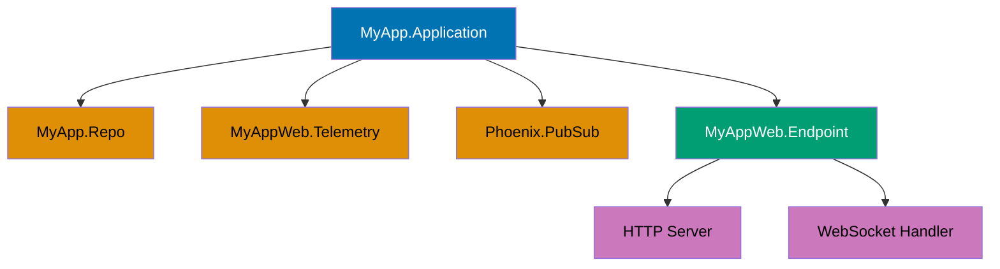
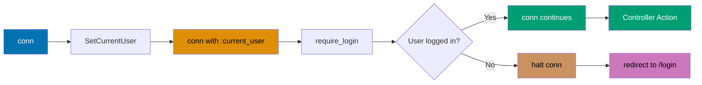
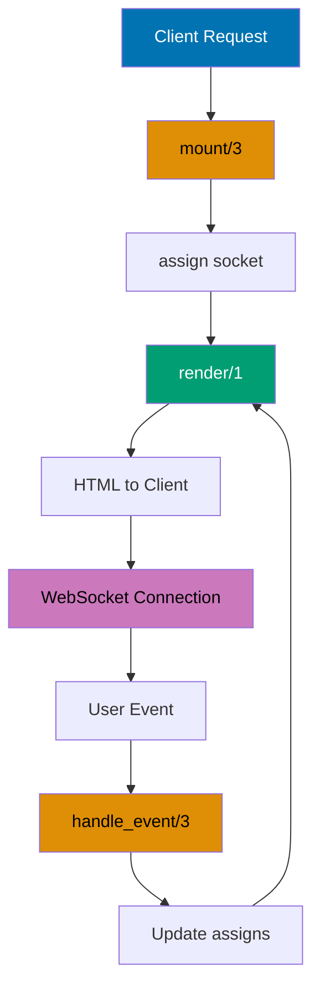
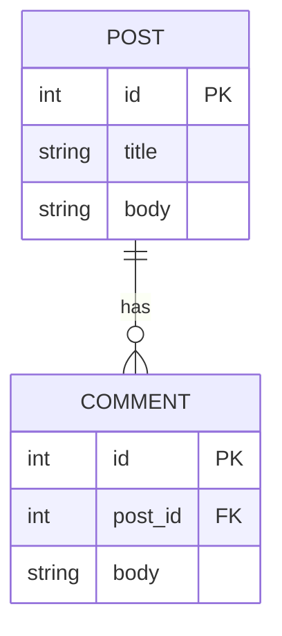

## Group 1: Phoenix Fundamentals

### Example 1: Phoenix Application Starter

A Phoenix application starts with a Mix project that sets up your supervision tree, configuration, and application endpoint. This example shows the basic structure you get from `mix phx.new`.



```elixir
# mix.exs - Defines your Phoenix application
defmodule MyApp.MixProject do
  use Mix.Project

  def project do
    [
      app: :my_app,
      version: "0.1.0",
      elixir: "~> 1.14",
      start_permanent: Mix.env() == :prod,
      deps: deps()
    ]
  end

  # Application callback - starts the supervision tree
  def application do
    [
      mod: {MyApp.Application, []},
      extra_applications: [:logger]
    ]
  end

  defp deps do
    [
      {:phoenix, "~> 1.7.0"},
      {:phoenix_html, "~> 3.1"},
      {:phoenix_live_view, "~> 1.0.0"}
    ]
  end
end

# lib/my_app/application.ex - Your application supervisor
defmodule MyApp.Application do
  use Application

  @impl true
  def start(_type, _args) do
    children = [
      MyApp.Repo,                    # => Database connection pool
      MyAppWeb.Telemetry,            # => Metrics collection
      {Phoenix.PubSub, name: MyApp.PubSub},  # => Pub/Sub system
      MyAppWeb.Endpoint              # => HTTP endpoint
    ]

    opts = [strategy: :one_for_one, name: MyApp.Supervisor]
    Supervisor.start_link(children, opts)  # => Starts all child processes
  end

  @impl true
  def config_change(changed, _new, removed) do
    MyAppWeb.Endpoint.config_change(changed, removed)
  end
end
```

**Key Takeaway**: Phoenix applications use an OTP supervision tree to manage processes. Your application supervisor starts child processes (database, endpoint, PubSub) that run for the lifetime of your app.

### Example 2: Routing Basics

The router defines URL patterns and maps them to controller actions. Phoenix 1.7 uses verified routes (~p sigil) for compile-time safety.


```elixir
# lib/my_app_web/router.ex
defmodule MyAppWeb.Router do
  use MyAppWeb, :router

  pipeline :browser do
    plug :accepts, ["html"]            # => Accept HTML requests
    plug :fetch_session                # => Load session data
    plug :protect_from_forgery         # => CSRF protection
    plug :put_secure_browser_headers   # => Security headers
  end

  pipeline :api do
    plug :accepts, ["json"]            # => Accept JSON requests
  end

  scope "/", MyAppWeb do
    pipe_through :browser

    # Simple route to a controller action
    get "/", PageController, :home     # => GET / → PageController.home/2

    # Verified route - compile-time checked
    get "/posts/:id", PostController, :show  # => ~p"/posts/#{post.id}"
  end

  # API routes
  scope "/api", MyAppWeb do
    pipe_through :api
    resources "/posts", PostController  # => CRUD routes
  end
end

# lib/my_app_web/controllers/page_controller.ex
defmodule MyAppWeb.PageController do
  use MyAppWeb, :controller

  def home(conn, _params) do
    render(conn, "home.html")           # => Renders template
  end
end
```

**Key Takeaway**: Routes define URL patterns and connect them to controllers. Pipelines specify middleware (plugs) that run for matching routes. Verified routes (~p) catch routing errors at compile time.

### Example 3: Controllers and Actions

Controllers handle HTTP requests and return responses. Actions receive the connection (conn) and parameters.

```elixir
defmodule MyAppWeb.PostController do
  use MyAppWeb, :controller

  # Action handling GET /posts/:id
  def show(conn, %{"id" => id}) do
    post = MyApp.Blog.get_post!(id)  # => Fetch from database
    render(conn, "show.html", post: post)  # => Render HTML template
  end

  # Action handling POST /posts
  def create(conn, %{"post" => post_params}) do
    case MyApp.Blog.create_post(post_params) do
      {:ok, post} ->
        conn
        |> put_flash(:info, "Post created!")  # => Set flash message
        |> redirect(to: ~p"/posts/#{post}")   # => Redirect to show

      {:error, changeset} ->
        render(conn, "new.html", changeset: changeset)  # => Re-render with errors
    end
  end

  # JSON response
  def index(conn, _params) do
    posts = MyApp.Blog.list_posts()
    json(conn, posts)  # => Render JSON response
  end
end
```

**Key Takeaway**: Controllers are modules containing actions (functions). Each action receives conn (request/response) and params (URL/form data). Return values determine the response (render, redirect, json).

### Example 4: Plugs - Request Transformation

Plugs are middleware that transform the connection. They're composable building blocks for request handling.



```elixir
# Custom plug - Set current user in assigns
defmodule MyAppWeb.Plugs.SetCurrentUser do
  def init(opts) do
    opts  # => Options passed from pipeline
  end

  def call(conn, _opts) do
    user_id = get_session(conn, :user_id)
    user = if user_id, do: MyApp.Accounts.get_user!(user_id)

    assign(conn, :current_user, user)  # => Adds to conn.assigns
  end
end

# In your router
defmodule MyAppWeb.Router do
  pipeline :require_auth do
    plug MyAppWeb.Plugs.SetCurrentUser  # => Sets current_user

    plug :require_login  # => Halts if not logged in
  end

  def require_login(conn, _opts) do
    if conn.assigns.current_user do
      conn  # => Continue to action
    else
      conn
      |> put_flash(:error, "Must be logged in")
      |> redirect(to: ~p"/login")
      |> halt()  # => Stop processing - no action called
    end
  end

  scope "/", MyAppWeb do
    pipe_through :browser
    pipe_through :require_auth  # => Runs before these routes

    resources "/dashboard", DashboardController
  end
end
```

**Key Takeaway**: Plugs are functions that take conn and return conn. Pipelines compose plugs. Use assign/3 to pass data to templates. Use halt/1 to stop processing.

### Example 5: Templates and Layouts

Phoenix uses HEEx (HTML with Embedded Elixir) templates. Function components provide reusable UI building blocks.

```elixir
# lib/my_app_web/layouts/app.html.heex - Main layout
<header>
  <h1><%= @page_title %></h1>
</header>

<main>
  <%= @inner_content %>  # => Renders page content
</main>

# lib/my_app_web/pages/post/show.html.heex - Page template
<h2><%= @post.title %></h2>
<p><%= @post.body %></p>

# lib/my_app_web/components/core_components.ex - Reusable component
defmodule MyAppWeb.CoreComponents do
  use Phoenix.Component

  attr :id, :string, required: true
  attr :label, :string, required: true

  def text_field(assigns) do
    ~H"""
    <div class="field">
      <label><%= @label %></label>
      <input type="text" id={@id} name={@id} />  # => Renders input
    </div>
    """
  end
end

# Using component in template
<.text_field id="name" label="Full Name" />  # => Renders the component
```

**Key Takeaway**: HEEx templates use <%= %> for expressions, @assigns for data. Function components (with ~H/1) are pure functions that generate HTML. Components accept attributes and render content.

### Example 6: Static Assets Pipeline

Phoenix assets (CSS, JS) are processed and bundled. Tailwind CSS is included by default in Phoenix 1.7+.

```elixir
# assets/css/app.css
@tailwind base;
@tailwind components;
@tailwind utilities;

.custom-button {
  @apply px-4 py-2 bg-blue-500 text-white rounded;
}

# assets/js/app.js
import "../css/app.css"

// Run when page loads
import { createRoot } from "react"
import App from "./App"

const container = document.getElementById("app")
const root = createRoot(container)
root.render(<App />)

# config/config.exs - Configure asset building
config :my_app_web, MyAppWeb.Endpoint,
  url: [host: "localhost"],
  render_errors: [view: MyAppWeb.ErrorView],
  pubsub_server: MyApp.PubSub,
  live_view: [signing_salt: "..."]

# esbuild config
config :esbuild,
  version: "0.17.0",
  default: [
    args: ~w(js/app.js --bundle --target=es2017 --outdir=../priv/static/assets),
    cd: Path.expand("../assets", __DIR__),
    env: %{"NODE_PATH" => Path.expand("../deps", __DIR__)}
  ]
```

**Key Takeaway**: Assets are processed by esbuild and output to priv/static. Tailwind CSS processes CSS. Use `mix phx.digest` to fingerprint files for cache busting in production.

## Group 2: LiveView Basics

### Example 7: First LiveView Component

LiveView components render HTML and respond to events in real-time using WebSockets. This is a stateless function component.



```elixir
# lib/my_app_web/live/posts_live/list.ex
defmodule MyAppWeb.PostsLive.List do
  use Phoenix.LiveView

  def mount(_params, _session, socket) do
    posts = MyApp.Blog.list_posts()
    {:ok, assign(socket, :posts, posts)}  # => Assign data to socket
  end

  def render(assigns) do
    ~H"""
    <h1>Posts</h1>
    <ul>
      <%= for post <- @posts do %>
        <li><%= post.title %></li>
      <% end %>
    </ul>
    """
  end
end

# In your router
defmodule MyAppWeb.Router do
  scope "/", MyAppWeb do
    pipe_through :browser
    live "/posts", PostsLive.List, :list  # => Live route
  end
end
```

**Key Takeaway**: LiveView modules use mount/3 to initialize state and render/1 to output HTML. assign/2 stores data in socket.assigns. WebSockets keep the connection alive for real-time updates.

### Example 8: LiveView Events

Events are user interactions (clicks, form submissions) that trigger callbacks. handle_event/3 processes events.

```elixir
defmodule MyAppWeb.CounterLive do
  use Phoenix.LiveView

  def mount(_params, _session, socket) do
    {:ok, assign(socket, :count, 0)}
  end

  def render(assigns) do
    ~H"""
    <h1>Count: <%= @count %></h1>

    <!-- phx-click sends event to handle_event -->
    <button phx-click="increment">+</button>
    <button phx-click="decrement">-</button>
    """
  end

  # Handle "increment" event
  def handle_event("increment", _params, socket) do
    {:noreply, update(socket, :count, &(&1 + 1))}  # => Updates count
  end

  # Handle "decrement" event
  def handle_event("decrement", _params, socket) do
    {:noreply, update(socket, :count, &(&1 - 1))}
  end
end
```

**Key Takeaway**: phx-click binds events to buttons. phx-submit binds to forms. handle_event/3 processes events and returns {:noreply, socket} to update state without re-rendering the page.

### Example 9: LiveView Navigation

LiveView provides two navigation types: live_redirect (full page reload) and live_patch (updates URL and params without full reload).

```elixir
defmodule MyAppWeb.PostsLive do
  use Phoenix.LiveView

  def mount(params, _session, socket) do
    {:ok, assign(socket, :selected_id, params["id"])}
  end

  def handle_params(%{"id" => id}, _uri, socket) do
    {:noreply, assign(socket, :selected_id, id)}  # => Handle URL changes
  end

  def render(assigns) do
    ~H"""
    <h1>Posts</h1>
    <%= for post <- @posts do %>
      <!-- live_patch updates URL without full reload -->
      <.link patch={~p"/posts?id=#{post.id}"}>
        <%= post.title %>
      </.link>
    <% end %>

    <%= if @selected_id do %>
      <div>Selected: <%= @selected_id %></div>
    <% end %>
    """
  end
end
```

**Key Takeaway**: live_patch updates URL and calls handle_params/3. Use live_redirect to force full page reload. handle_params/3 processes URL changes and updates state accordingly.

### Example 10: LiveView Components

Components are stateless or stateful sub-views. Stateless components are pure functions. Stateful components maintain their own state.

```elixir
# Stateless function component
defmodule MyAppWeb.CoreComponents do
  use Phoenix.Component

  attr :label, :string, required: true

  def button_group(assigns) do
    ~H"""
    <div class="buttons">
      <%= render_slot(@inner_block) %>  # => Render content inside component
    </div>
    """
  end
end

# Stateful live component with its own state
defmodule MyAppWeb.PostFormComponent do
  use Phoenix.LiveComponent

  def mount(socket) do
    {:ok, assign(socket, :errors, [])}
  end

  def handle_event("validate", %{"post" => params}, socket) do
    changeset = MyApp.Blog.change_post(%MyApp.Blog.Post{}, params)
    {:noreply, assign(socket, changeset: changeset)}
  end

  def render(assigns) do
    ~H"""
    <form phx-submit="save" phx-target={@myself}>
      <!-- Form fields -->
    </form>
    """
  end
end

# Using components
def parent_render(assigns) do
  ~H"""
  <%= live_component(MyAppWeb.PostFormComponent, id: "post-form") %>

  <.button_group>
    <button>Save</button>
    <button>Cancel</button>
  </.button_group>
  """
end
```

**Key Takeaway**: Stateless components are functions that render HTML. Stateful components (use Phoenix.LiveComponent) maintain state and handle their own events. Use live_component/3 to render stateful components.

## Group 3: Ecto Fundamentals

### Example 11: Schema and Migrations

Ecto schemas define your database structure. Migrations create and modify database tables.

```elixir
# lib/my_app/blog/post.ex - Define schema
defmodule MyApp.Blog.Post do
  use Ecto.Schema
  import Ecto.Changeset

  schema "posts" do
    field :title, :string              # => String column
    field :body, :string               # => Text column
    field :published, :boolean, default: false
    field :view_count, :integer, default: 0
    timestamps()                       # => Adds inserted_at, updated_at
  end

  @doc false
  def changeset(post, attrs) do
    post
    |> cast(attrs, [:title, :body, :published])  # => Allow these fields
    |> validate_required([:title, :body])
  end
end

# priv/repo/migrations/20231201120000_create_posts.exs - Create table
defmodule MyApp.Repo.Migrations.CreatePosts do
  use Ecto.Migration

  def change do
    create table(:posts) do
      add :title, :string, null: false        # => NOT NULL
      add :body, :text                        # => Text field
      add :published, :boolean, default: false
      add :view_count, :integer, default: 0
      timestamps()                            # => Adds timestamps columns
    end
  end
end

# Run migrations
# mix ecto.migrate
```

**Key Takeaway**: Schemas define field types (:string, :text, :integer, :boolean). Migrations create database tables. Use timestamps() to add inserted_at/updated_at automatically.

### Example 12: Ecto Queries

Ecto uses a pipe-based query API. Build queries incrementally, then execute with Repo.

```elixir
import Ecto.Query

# Simple query
query = from p in Post, select: p
posts = MyApp.Repo.all(query)  # => Fetch all posts

# Query with conditions
query = from p in Post, where: p.published == true, select: p.title
titles = MyApp.Repo.all(query)  # => All published post titles

# Pipe-based query (more readable)
posts = Post
  |> where([p], p.published == true)      # => Filter published
  |> order_by([p], desc: p.inserted_at)   # => Sort by date
  |> limit(10)                            # => Limit 10 results
  |> MyApp.Repo.all()

# Query with joins
query = from p in Post,
  join: a in Author, on: a.id == p.author_id,
  where: a.name == "John",
  select: p

posts = MyApp.Repo.all(query)  # => Posts by John
```

**Key Takeaway**: Use from/2 to start queries. Pipe where/2, order_by/2, limit/2 to build complex queries. Use select/2 to choose columns. MyApp.Repo.all/1 executes the query.

### Example 13: Changesets and Validation

Changesets track data changes and validate them before saving. They're Ecto's way of handling data integrity.

```elixir
defmodule MyApp.Blog.Post do
  schema "posts" do
    field :title, :string
    field :body, :string
    field :email, :string
  end

  def changeset(post, attrs) do
    post
    |> cast(attrs, [:title, :body, :email])
    |> validate_required([:title, :body])           # => Must have title/body
    |> validate_length(:title, min: 5, max: 100)    # => Length validation
    |> validate_format(:email, ~r/@/)               # => Regex validation
    |> unique_constraint(:email)                    # => Database unique constraint
  end
end

# Using changeset
def create_post(attrs) do
  changeset = Post.changeset(%Post{}, attrs)

  if changeset.valid? do          # => Check if valid
    MyApp.Repo.insert(changeset)  # => {:ok, post} or {:error, changeset}
  else
    {:error, changeset}
  end
end

# In your form/LiveView
def handle_event("validate", %{"post" => params}, socket) do
  changeset = Post.changeset(%Post{}, params)
  {:noreply, assign(socket, changeset: changeset)}
end

def handle_event("save", %{"post" => params}, socket) do
  case MyApp.Blog.create_post(params) do
    {:ok, post} -> {:noreply, put_flash(socket, :info, "Created!")}
    {:error, changeset} -> {:noreply, assign(socket, changeset: changeset)}
  end
end
```

**Key Takeaway**: Changesets validate data before saving. cast/3 specifies allowed fields. validate\__/_ functions add validation rules. Changesets track errors for form display.

### Example 14: Associations - One-to-Many

Database associations relate tables. A post has many comments, a comment belongs to a post.



```elixir
# lib/my_app/blog/post.ex
defmodule MyApp.Blog.Post do
  schema "posts" do
    field :title, :string
    has_many :comments, MyApp.Blog.Comment  # => Posts have comments
  end
end

# lib/my_app/blog/comment.ex
defmodule MyApp.Blog.Comment do
  schema "comments" do
    field :body, :string
    belongs_to :post, MyApp.Blog.Post       # => Comment belongs to post
  end
end

# Migration to create comments table
def change do
  create table(:comments) do
    add :body, :text
    add :post_id, references(:posts)        # => Foreign key
    timestamps()
  end
end

# Using associations
post = MyApp.Repo.preload(post, :comments) # => Load post with comments
IO.inspect(post.comments)                  # => [comment1, comment2, ...]

# Or in a query
posts = Post
  |> preload([:comments])                  # => Eager load comments
  |> MyApp.Repo.all()
```

**Key Takeaway**: has_many/2 and belongs_to/2 declare associations. Migrations add foreign keys. Use preload/1 to load related data. Without preload, accessing post.comments loads from database separately.

### Example 15: CRUD Operations

Ecto provides Repo functions for database operations: insert, get, update, delete.

```elixir
# Create (INSERT)
changeset = Post.changeset(%Post{}, %{"title" => "Hello"})
{:ok, post} = MyApp.Repo.insert(changeset)  # => {:ok, post}
post.id  # => Generated ID

# Read (SELECT)
post = MyApp.Repo.get(Post, 1)              # => Get by primary key
post = MyApp.Repo.get_by(Post, slug: "hello")  # => Get by other field

# Update (UPDATE)
changeset = Post.changeset(post, %{"title" => "Goodbye"})
{:ok, updated_post} = MyApp.Repo.update(changeset)

# Delete (DELETE)
{:ok, deleted_post} = MyApp.Repo.delete(post)

# Batch operations
posts = MyApp.Repo.all(Post)
Enum.map(posts, &MyApp.Repo.delete/1)  # => Delete all posts
```

**Key Takeaway**: Repo.insert/1 creates records. Repo.get/2 retrieves by ID. Repo.update/1 modifies records. Repo.delete/1 removes records. All return {:ok, record} or {:error, changeset}.

## Group 4: Forms and Validation

### Example 16: LiveView Forms

Phoenix forms in LiveView automatically handle validation, phx-change updates, and phx-submit saves.

```elixir
defmodule MyAppWeb.PostLive.Form do
  use Phoenix.LiveView

  def mount(%{"id" => id}, _session, socket) do
    post = MyApp.Blog.get_post!(id)
    changeset = MyApp.Blog.change_post(post)
    {:ok, assign(socket, post: post, changeset: changeset)}
  end

  def render(assigns) do
    ~H"""
    <.form
      for={@changeset}
      phx-submit="save"
      phx-change="validate">

      <.input field={@changeset[:title]} label="Title" />
      <.input field={@changeset[:body]} type="textarea" label="Body" />

      <button type="submit">Save</button>
    </.form>
    """
  end

  def handle_event("validate", %{"post" => params}, socket) do
    changeset = MyApp.Blog.change_post(socket.assigns.post, params)
    {:noreply, assign(socket, changeset: changeset)}
  end

  def handle_event("save", %{"post" => params}, socket) do
    case MyApp.Blog.update_post(socket.assigns.post, params) do
      {:ok, post} ->
        {:noreply,
         socket
         |> put_flash(:info, "Post updated!")
         |> redirect(to: ~p"/posts/#{post}")}

      {:error, changeset} ->
        {:noreply, assign(socket, changeset: changeset)}
    end
  end
end
```

**Key Takeaway**: `<.form>` component binds to changeset. phx-change fires on field changes. phx-submit fires on form submission. Form automatically submits CSRF token and field values.

### Example 17: Form Validation Feedback

LiveView validates on every keystroke with phx-change. Display errors from the changeset in real-time.

```elixir
def form_template(assigns) do
  ~H"""
  <.form for={@changeset} phx-change="validate" phx-submit="save">
    <div class="field">
      <.input field={@changeset[:email]} label="Email" />

      <!-- Display errors -->
      <%= if @changeset.errors[:email] do %>
        <span class="error">
          <%= elem(@changeset.errors[:email], 0) %>
        </span>
      <% end %>
    </div>
  </.form>
  """
end

# With phx-debounce to reduce validation calls
def form_with_debounce(assigns) do
  ~H"""
  <.form for={@changeset} phx-change="validate" phx-debounce="500">
    <!-- Only validate after 500ms of no typing -->
    <.input field={@changeset[:email]} label="Email" />
  </.form>
  """
end
```

**Key Takeaway**: Access changeset errors with @changeset.errors[:field]. Use phx-debounce to reduce validation calls. Display errors immediately under fields for real-time feedback.

### Example 18: File Uploads in LiveView

LiveView supports file uploads with progress tracking and client-side validation.

```elixir
defmodule MyAppWeb.ProfileLive do
  use Phoenix.LiveView

  def mount(_params, _session, socket) do
    {:ok,
     socket
     |> assign(:uploaded_files, [])
     |> allow_upload(:avatar, accept: ~w(.jpg .jpeg .png), max_entries: 1)}
  end

  def render(assigns) do
    ~H"""
    <form id="upload-form" phx-change="validate" phx-submit="save">
      <.live_file_input upload={@uploads.avatar} />

      <!-- Show uploaded files -->
      <%= for entry <- @uploads.avatar.entries do %>
        <article class="upload-entry">
          <figure>
            <.live_img_preview entry={entry} />
            <figcaption><%= entry.client_name %></figcaption>
          </figure>
          <progress value={entry.progress} max="100" />
        </article>
      <% end %>

      <button type="submit">Save Profile</button>
    </form>
    """
  end

  def handle_event("validate", _params, socket) do
    {:noreply, socket}
  end

  def handle_event("save", _params, socket) do
    uploaded_files =
      consume_uploaded_entries(socket, :avatar, fn %{path: path}, _entry ->
        dest = Path.join([:code.priv_dir(:my_app), "static", "uploads", Path.basename(path)])
        File.cp!(path, dest)
        {:ok, dest}
      end)

    {:noreply, assign(socket, uploaded_files: uploaded_files)}
  end
end
```

**Key Takeaway**: allow_upload/2 registers an upload. <.live_file_input> renders input. consume_uploaded_entries/3 processes files after submission. Uploads show progress and validate file types.

### Example 19: Multi-Step Forms

Create wizard-style forms by tracking current step and validating/saving at each stage.

```elixir
defmodule MyAppWeb.SignupLive do
  use Phoenix.LiveView

  def mount(_params, _session, socket) do
    {:ok,
     assign(socket,
       step: 1,
       step1_data: %{},
       step2_data: %{},
       changeset: nil
     )}
  end

  def render(assigns) do
    ~H"""
    <div class="wizard">
      <h1>Step <%= @step %> of 2</h1>

      <%= if @step == 1 do %>
        <.step1_form changeset={@changeset} />
      <% else %>
        <.step2_form changeset={@changeset} />
      <% end %>
    </div>
    """
  end

  def handle_event("next", %{"step1" => params}, socket) when socket.assigns.step == 1 do
    changeset = validate_step1(params)

    if changeset.valid? do
      {:noreply, assign(socket, step: 2, step1_data: params, changeset: nil)}
    else
      {:noreply, assign(socket, changeset: changeset)}
    end
  end

  def handle_event("save", %{"step2" => params}, socket) when socket.assigns.step == 2 do
    all_data = Map.merge(socket.assigns.step1_data, params)

    case MyApp.Accounts.create_user(all_data) do
      {:ok, user} ->
        {:noreply,
         socket
         |> put_flash(:info, "Account created!")
         |> redirect(to: ~p"/dashboard")}

      {:error, changeset} ->
        {:noreply, assign(socket, changeset: changeset)}
    end
  end
end
```

**Key Takeaway**: Track current step in socket assigns. Render different forms based on step. Validate before advancing. Save all data together on final submission.

### Example 20: JSON API Endpoints

Create REST API endpoints that return JSON instead of HTML templates.

```elixir
defmodule MyAppWeb.API.PostController do
  use MyAppWeb, :controller

  # GET /api/posts - List all posts
  def index(conn, _params) do
    posts = MyApp.Blog.list_posts()
    json(conn, posts)  # => Renders JSON
  end

  # GET /api/posts/:id - Get single post
  def show(conn, %{"id" => id}) do
    post = MyApp.Blog.get_post!(id)
    json(conn, post)
  end

  # POST /api/posts - Create post
  def create(conn, %{"post" => post_params}) do
    case MyApp.Blog.create_post(post_params) do
      {:ok, post} ->
        conn
        |> put_status(:created)           # => 201
        |> json(post)

      {:error, changeset} ->
        conn
        |> put_status(:unprocessable_entity)  # => 422
        |> json(%{errors: changeset_to_map(changeset)})
    end
  end

  # PUT /api/posts/:id - Update post
  def update(conn, %{"id" => id, "post" => post_params}) do
    post = MyApp.Blog.get_post!(id)

    case MyApp.Blog.update_post(post, post_params) do
      {:ok, post} ->
        json(conn, post)

      {:error, changeset} ->
        conn
        |> put_status(:unprocessable_entity)
        |> json(%{errors: changeset_to_map(changeset)})
    end
  end

  # DELETE /api/posts/:id - Delete post
  def delete(conn, %{"id" => id}) do
    post = MyApp.Blog.get_post!(id)
    MyApp.Repo.delete(post)
    send_resp(conn, :no_content, "")  # => 204 No Content
  end

  defp changeset_to_map(changeset) do
    Ecto.Changeset.traverse_errors(changeset, fn {msg, opts} ->
      Enum.reduce(opts, msg, fn {key, value}, acc ->
        String.replace(acc, "%{#{key}}", to_string(value))
      end)
    end)
  end
end

# Router
scope "/api", MyAppWeb.API do
  pipe_through :api
  resources "/posts", PostController
end
```

**Key Takeaway**: Use json/2 to return JSON responses. Use put_status/2 for HTTP status codes (201, 204, 422). Convert changesets to error maps for API responses.

### Example 21: Nested Resources and Scoped Routes

Organize related resources hierarchically. Nest routes under parent resources for cleaner URLs and better organization.

```mermaid
%% Nested routes structure
graph TD
    A[/posts/:post_id] --> B[/posts/:post_id/comments]
    B --> C[GET index - list comments]
    B --> D[POST create - new comment]
    B --> E[GET :id/show - view comment]
    B --> F[PUT :id/update - edit comment]
    B --> G[DELETE :id/delete - remove comment]

    style A fill:#0173B2,color:#fff
    style B fill:#DE8F05,color:#000
    style C fill:#029E73,color:#fff
    style D fill:#029E73,color:#fff
    style E fill:#029E73,color:#fff
    style F fill:#029E73,color:#fff
    style G fill:#029E73,color:#fff
```

```elixir
# Router with nested resources
defmodule MyAppWeb.Router do
  use MyAppWeb, :router

  scope "/", MyAppWeb do
    pipe_through :browser

    # Nested resources - comments belong to posts
    resources "/posts", PostController do
      resources "/comments", CommentController  # => /posts/:post_id/comments
    end
  end
end

# Controller accesses parent resource via params
defmodule MyAppWeb.CommentController do
  use MyAppWeb, :controller

  def index(conn, %{"post_id" => post_id}) do
    post = MyApp.Blog.get_post!(post_id)                # => Load parent
    comments = MyApp.Blog.list_comments_for_post(post)  # => Filter by parent
    render(conn, "index.html", post: post, comments: comments)
  end

  def create(conn, %{"post_id" => post_id, "comment" => comment_params}) do
    post = MyApp.Blog.get_post!(post_id)

    # Associate comment with post
    comment_params = Map.put(comment_params, "post_id", post_id)

    case MyApp.Blog.create_comment(comment_params) do
      {:ok, comment} ->
        conn
        |> put_flash(:info, "Comment added!")                    # => Success message
        |> redirect(to: ~p"/posts/#{post_id}/comments")          # => Back to list

      {:error, changeset} ->
        render(conn, "new.html", changeset: changeset, post: post)  # => Re-render
    end
  end
end

# Query comments filtered by post
defmodule MyApp.Blog do
  def list_comments_for_post(post) do
    from(c in Comment, where: c.post_id == ^post.id, order_by: [desc: c.inserted_at])
    |> Repo.all()  # => SELECT * FROM comments WHERE post_id = ? ORDER BY inserted_at DESC
  end
end
```

**Key Takeaway**: Nest resources to express parent-child relationships. Access parent via params["post_id"]. Use scoped queries to filter by parent. Maintains clean URL structure like /posts/123/comments.

### Example 22: Error Handling and Custom Error Pages

Handle errors gracefully with custom error views. Display friendly messages for 404, 500, and other HTTP errors.

```elixir
# lib/my_app_web/views/error_view.ex
defmodule MyAppWeb.ErrorView do
  use MyAppWeb, :view

  # Render specific error templates
  def render("404.html", _assigns) do
    ~H"""
    <div class="error-page">
      <h1>404 - Page Not Found</h1>               # => Custom 404 page
      <p>The page you're looking for doesn't exist.</p>
      <a href={~p"/"}>Go back home</a>
    </div>
    """
  end

  def render("500.html", _assigns) do
    ~H"""
    <div class="error-page">
      <h1>500 - Server Error</h1>                  # => Custom 500 page
      <p>Something went wrong on our end.</p>
    </div>
    """
  end

  # Fallback for any other status code
  def template_not_found(template, _assigns) do
    Phoenix.Controller.status_message_from_template(template)
  end
end

# In controller - raise specific errors
defmodule MyAppWeb.PostController do
  def show(conn, %{"id" => id}) do
    case MyApp.Blog.get_post(id) do
      nil ->
        conn
        |> put_status(:not_found)                  # => Set 404 status
        |> put_view(MyAppWeb.ErrorView)
        |> render("404.html")

      post ->
        render(conn, "show.html", post: post)      # => Normal render
    end
  end
end

# Or use Plug.Exception for custom errors
defmodule MyApp.ResourceNotFound do
  defexception message: "Resource not found", plug_status: 404
end

def show(conn, %{"id" => id}) do
  post = MyApp.Blog.get_post!(id) || raise MyApp.ResourceNotFound
  render(conn, "show.html", post: post)
end
```

**Key Takeaway**: ErrorView renders custom error pages. Template name matches HTTP status (404.html, 500.html). Raise exceptions or set status manually. Phoenix catches errors and renders appropriate template.

### Example 23: Flash Messages for User Feedback

Display temporary messages to users after actions. Flash messages persist across redirects but disappear after being shown.

```elixir
defmodule MyAppWeb.SessionController do
  use MyAppWeb, :controller

  def create(conn, %{"session" => %{"email" => email, "password" => password}}) do
    case MyApp.Accounts.authenticate(email, password) do
      {:ok, user} ->
        conn
        |> put_flash(:info, "Welcome back, #{user.name}!")     # => Success flash
        |> put_session(:user_id, user.id)                      # => Store session
        |> redirect(to: ~p"/dashboard")

      {:error, :invalid_credentials} ->
        conn
        |> put_flash(:error, "Invalid email or password")      # => Error flash
        |> render("new.html")

      {:error, :account_locked} ->
        conn
        |> put_flash(:warning, "Account locked. Contact support")  # => Warning flash
        |> render("new.html")
    end
  end
end

# Display flash in layout
# lib/my_app_web/layouts/app.html.heex
<header>
  <!-- Display all flash messages -->
  <%= if info = Phoenix.Flash.get(@flash, :info) do %>
    <div class="alert alert-info">
      <%= info %>                                              # => Show info message
    </div>
  <% end %>

  <%= if error = Phoenix.Flash.get(@flash, :error) do %>
    <div class="alert alert-error">
      <%= error %>                                             # => Show error message
    </div>
  <% end %>

  <%= if warning = Phoenix.Flash.get(@flash, :warning) do %>
    <div class="alert alert-warning">
      <%= warning %>                                           # => Show warning message
    </div>
  <% end %>
</header>

# In LiveView
def handle_event("delete", %{"id" => id}, socket) do
  case MyApp.Blog.delete_post(id) do
    {:ok, _post} ->
      {:noreply, put_flash(socket, :info, "Post deleted")}    # => Flash in LiveView

    {:error, _changeset} ->
      {:noreply, put_flash(socket, :error, "Could not delete post")}
  end
end
```

**Key Takeaway**: put_flash/3 sets temporary messages (:info, :error, :warning). Phoenix.Flash.get/2 retrieves messages in templates. Flash survives redirects but clears after display. Works in both controllers and LiveView.

### Example 24: Query Parameters and Filtering

Handle query parameters for filtering, sorting, and pagination. Build dynamic queries based on user input.

```elixir
defmodule MyAppWeb.PostController do
  use MyAppWeb, :controller

  def index(conn, params) do
    posts = MyApp.Blog.list_posts(params)  # => Pass all params to context
    render(conn, "index.html", posts: posts)
  end
end

# Context builds query dynamically
defmodule MyApp.Blog do
  import Ecto.Query

  def list_posts(params) do
    Post
    |> filter_by_status(params["status"])           # => Filter if status param present
    |> filter_by_category(params["category"])       # => Filter if category param present
    |> sort_by(params["sort"])                      # => Sort if sort param present
    |> paginate(params["page"], params["per_page"]) # => Paginate
    |> Repo.all()
  end

  defp filter_by_status(query, nil), do: query
  defp filter_by_status(query, status) do
    where(query, [p], p.status == ^status)          # => WHERE status = ?
  end

  defp filter_by_category(query, nil), do: query
  defp filter_by_category(query, category) do
    where(query, [p], p.category == ^category)      # => WHERE category = ?
  end

  defp sort_by(query, "newest") do
    order_by(query, [p], desc: p.inserted_at)       # => ORDER BY inserted_at DESC
  end
  defp sort_by(query, "oldest") do
    order_by(query, [p], asc: p.inserted_at)        # => ORDER BY inserted_at ASC
  end
  defp sort_by(query, _), do: query

  defp paginate(query, page, per_page) do
    page = String.to_integer(page || "1")           # => Default to page 1
    per_page = String.to_integer(per_page || "20")  # => Default 20 per page

    query
    |> limit(^per_page)                             # => LIMIT 20
    |> offset(^((page - 1) * per_page))             # => OFFSET (page-1)*20
  end
end

# URL examples:
# /posts?status=published
# /posts?category=elixir&sort=newest
# /posts?page=2&per_page=10
```

**Key Takeaway**: Build queries dynamically using pattern matching. Check for nil params before applying filters. Use limit/offset for pagination. Query functions compose cleanly with pipes.

### Example 25: Content Negotiation - HTML vs JSON

Serve different response formats based on Accept header. Same controller action can return HTML or JSON.

```elixir
defmodule MyAppWeb.PostController do
  use MyAppWeb, :controller

  def show(conn, %{"id" => id}) do
    post = MyApp.Blog.get_post!(id)

    # Phoenix automatically negotiates based on Accept header
    render(conn, "show.html", post: post)           # => Default to HTML
  end

  # Explicit format handling
  def index(conn, params) do
    posts = MyApp.Blog.list_posts()

    case get_format(conn) do
      "html" ->
        render(conn, "index.html", posts: posts)    # => HTML response

      "json" ->
        json(conn, %{posts: posts})                 # => JSON response

      _ ->
        send_resp(conn, 406, "Not Acceptable")      # => Unsupported format
    end
  end
end

# Using with responds_to style pattern
defmodule MyAppWeb.API.PostController do
  use MyAppWeb, :controller
  action_fallback MyAppWeb.FallbackController

  def show(conn, %{"id" => id}) do
    with {:ok, post} <- MyApp.Blog.fetch_post(id) do
      render(conn, "show.#{get_format(conn)}", post: post)  # => Render matching format
    end
  end
end

# In router - specify accepted formats
scope "/api", MyAppWeb.API do
  pipe_through :api

  resources "/posts", PostController, only: [:index, :show]
end

# JSON view
defmodule MyAppWeb.PostView do
  use MyAppWeb, :view

  # Render JSON format
  def render("show.json", %{post: post}) do
    %{
      id: post.id,                                  # => JSON response shape
      title: post.title,
      body: post.body,
      inserted_at: post.inserted_at
    }
  end

  def render("index.json", %{posts: posts}) do
    %{data: Enum.map(posts, &show_json/1)}          # => Array of posts
  end

  defp show_json(post) do
    %{id: post.id, title: post.title}
  end
end

# Client requests:
# GET /posts/1 with Accept: text/html => HTML response
# GET /posts/1 with Accept: application/json => JSON response
# GET /posts/1.json => JSON (format in URL)
```

**Key Takeaway**: Phoenix negotiates format based on Accept header or file extension. Define view functions for each format (show.json, show.html). Use get_format/1 to check requested format. Return 406 for unsupported formats.
