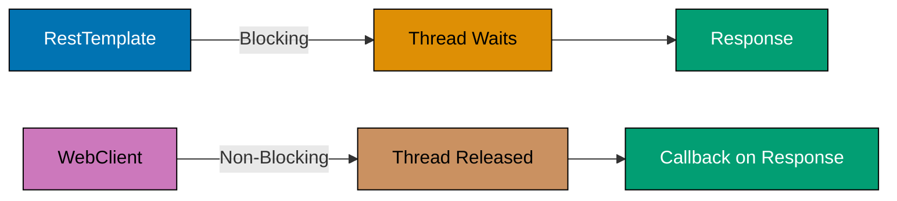
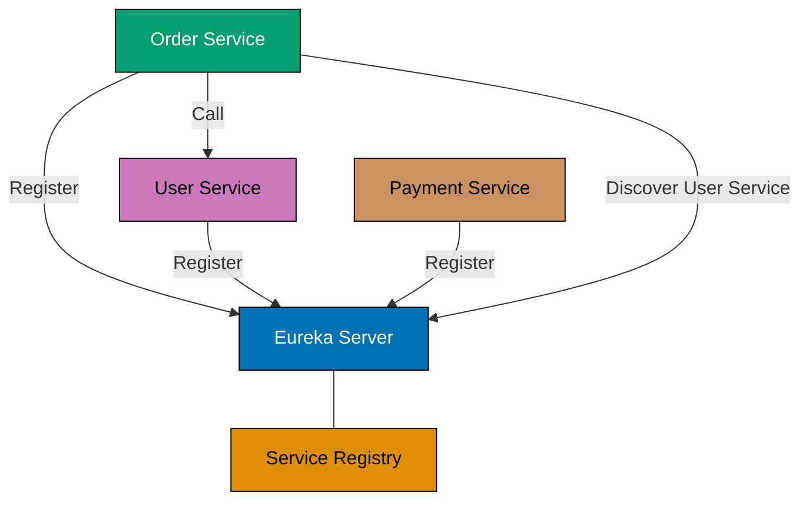
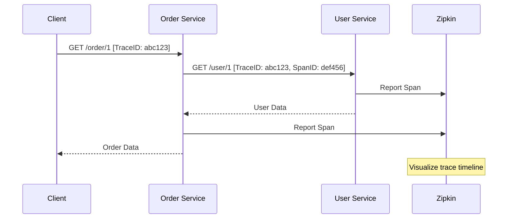
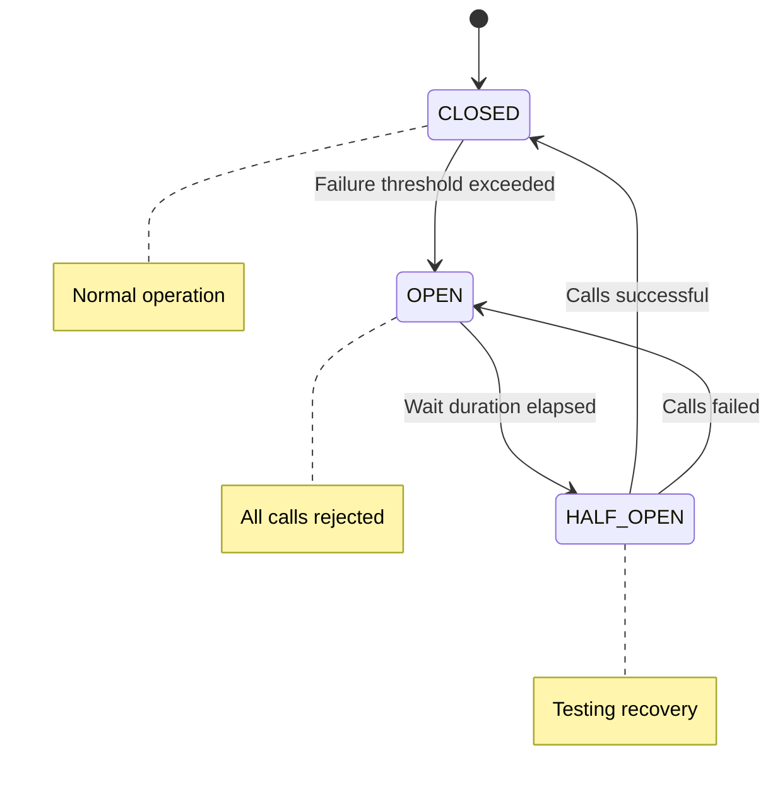
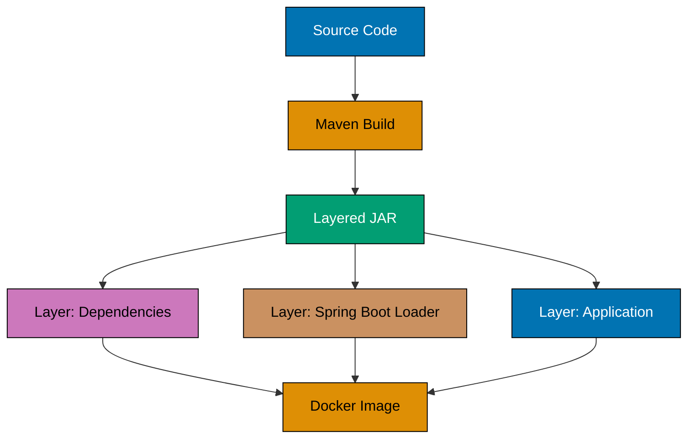

Master advanced Spring Boot patterns through 20 examples covering microservices, observability, resilience, custom auto-configuration, and production deployment.

## Example 41: RestTemplate - Synchronous HTTP Client

RestTemplate provides synchronous REST client capabilities with automatic JSON/XML conversion and error handling.

```java
@Configuration
public class RestTemplateConfig {
    @Bean
    public RestTemplate restTemplate(RestTemplateBuilder builder) {
        return builder
            .setConnectTimeout(Duration.ofSeconds(5))  // => Connection timeout
            .setReadTimeout(Duration.ofSeconds(10))    // => Read timeout
            .defaultHeader("User-Agent", "SpringBootApp/1.0")
            .errorHandler(new DefaultResponseErrorHandler() {
                @Override
                public void handleError(ClientHttpResponse response) throws IOException {
                    // => Custom error handling
                    if (response.getStatusCode().is5xxServerError()) {
                        throw new ServiceUnavailableException("Backend service down");
                    }
                    super.handleError(response);
                }
            })
            .build();
    }
}

@Service
@RequiredArgsConstructor
public class UserApiClient {
    private final RestTemplate restTemplate;
    private static final String BASE_URL = "https://jsonplaceholder.typicode.com";

    public User getUser(Long id) {
        return restTemplate.getForObject(BASE_URL + "/users/{id}", User.class, id);
    }

    public User createUser(User user) {
        return restTemplate.postForObject(BASE_URL + "/users", user, User.class);
    }

    public void updateUser(Long id, User user) {
        restTemplate.put(BASE_URL + "/users/{id}", user, id);
    }

    public void deleteUser(Long id) {
        restTemplate.delete(BASE_URL + "/users/{id}", id);
    }

    public List<User> getAllUsers() {
        User[] users = restTemplate.getForObject(BASE_URL + "/users", User[].class);
        return users != null ? Arrays.asList(users) : Collections.emptyList();
    }
}

record User(Long id, String name, String email, String phone) {}
```

## Example 42: WebClient - Reactive Non-Blocking Client

WebClient provides reactive, non-blocking HTTP communication with backpressure support and functional API.

```java
@Configuration
public class WebClientConfig {
    @Bean
    public WebClient webClient(WebClient.Builder builder) {
        return builder
            .baseUrl("https://jsonplaceholder.typicode.com")
            .defaultHeader(HttpHeaders.USER_AGENT, "SpringBoot-WebClient/1.0")
            .defaultHeader(HttpHeaders.CONTENT_TYPE, MediaType.APPLICATION_JSON_VALUE)
            .build();
    }
}

@Service
@RequiredArgsConstructor
public class ReactiveUserClient {
    private final WebClient webClient;

    public Mono<User> getUser(Long id) {
        return webClient.get()
            .uri("/users/{id}", id)
            .retrieve()
            .bodyToMono(User.class)
            .timeout(Duration.ofSeconds(5));  // => Request timeout
    }

    public Flux<User> getAllUsers() {
        return webClient.get()
            .uri("/users")
            .retrieve()
            .bodyToFlux(User.class)
            .onErrorResume(e -> {
                // => Fallback on error
                return Flux.empty();
            });
    }

    public Mono<User> createUser(User user) {
        return webClient.post()
            .uri("/users")
            .bodyValue(user)
            .retrieve()
            .bodyToMono(User.class);
    }
}
```



## Example 43: Feign Clients - Declarative REST Clients

Feign provides declarative REST client interfaces with automatic request/response mapping and load balancing integration.

```java
// pom.xml: spring-cloud-starter-openfeign

@SpringBootApplication
@EnableFeignClients
public class Application {
    public static void main(String[] args) {
        SpringApplication.run(Application.class, args);
    }
}

@FeignClient(name = "user-service", url = "https://jsonplaceholder.typicode.com")
public interface UserFeignClient {
    @GetMapping("/users/{id}")
    User getUser(@PathVariable Long id);

    @GetMapping("/users")
    List<User> getAllUsers();

    @PostMapping("/users")
    User createUser(@RequestBody User user);

    @DeleteMapping("/users/{id}")
    void deleteUser(@PathVariable Long id);
}

@Service
@RequiredArgsConstructor
public class UserService {
    private final UserFeignClient userClient;

    public User fetchUser(Long id) {
        return userClient.getUser(id);  // => Declarative call
    }
}

// application.yml
// feign:
//   client:
//     config:
//       default:
//         connectTimeout: 5000
//         readTimeout: 10000
```

## Example 44: Service Discovery - Eureka Client

Service discovery allows microservices to find and communicate with each other without hard-coded URLs.

```java
// pom.xml: spring-cloud-starter-netflix-eureka-client

@SpringBootApplication
@EnableDiscoveryClient
public class Application {
    public static void main(String[] args) {
        SpringApplication.run(Application.class, args);
    }
}

@RestController
@RequestMapping("/api")
public class OrderController {
    private final DiscoveryClient discoveryClient;
    private final RestTemplate restTemplate;

    public OrderController(DiscoveryClient discoveryClient,
                          @LoadBalanced RestTemplate restTemplate) {
        this.discoveryClient = discoveryClient;
        this.restTemplate = restTemplate;
    }

    @GetMapping("/services")
    public List<String> getServices() {
        return discoveryClient.getServices();  // => List all registered services
    }

    @GetMapping("/order/{id}")
    public Order getOrder(@PathVariable Long id) {
        // => Call user-service by service name (no URL needed)
        User user = restTemplate.getForObject(
            "http://user-service/api/users/{id}", User.class, id);
        return new Order(id, user);
    }
}

// application.yml
// spring:
//   application:
//     name: order-service
// eureka:
//   client:
//     serviceUrl:
//       defaultZone: http://localhost:8761/eureka/
//   instance:
//     preferIpAddress: true
```



## Example 45: Spring Boot Actuator - Health & Metrics

Actuator provides production-ready endpoints for monitoring, health checks, and application metrics.

```java
// pom.xml: spring-boot-starter-actuator

@Component
public class CustomHealthIndicator implements HealthIndicator {
    @Override
    public Health health() {
        boolean databaseUp = checkDatabaseConnection();
        if (databaseUp) {
            return Health.up()
                .withDetail("database", "PostgreSQL")
                .withDetail("version", "15.0")
                .build();
        }
        return Health.down()
            .withDetail("error", "Database connection failed")
            .build();
    }

    private boolean checkDatabaseConnection() {
        return true;  // => Actual DB health check
    }
}

@RestController
@RequestMapping("/api")
public class MetricsController {
    @GetMapping("/process")
    public String processRequest() {
        return "Processed";
    }
}

// application.yml
// management:
//   endpoints:
//     web:
//       exposure:
//         include: health,metrics,info,prometheus
//   endpoint:
//     health:
//       show-details: always
//   metrics:
//     tags:
//       application: ${spring.application.name}

// Available endpoints:
// GET /actuator/health => {"status":"UP","components":{"custom":{"status":"UP"}}}
// GET /actuator/metrics => List of available metrics
// GET /actuator/metrics/jvm.memory.used => Memory usage
// GET /actuator/info => Application info
```

## Example 46: Custom Metrics - Micrometer

Micrometer provides vendor-neutral metrics instrumentation for monitoring application performance.

```java
@Service
public class OrderMetricsService {
    private final Counter orderCounter;
    private final Gauge activeOrders;
    private final Timer orderProcessingTimer;
    private final AtomicInteger activeOrderCount = new AtomicInteger(0);

    public OrderMetricsService(MeterRegistry registry) {
        this.orderCounter = Counter.builder("orders.created")
            .description("Total orders created")
            .tag("type", "online")
            .register(registry);

        this.activeOrders = Gauge.builder("orders.active", activeOrderCount, AtomicInteger::get)
            .description("Active orders count")
            .register(registry);

        this.orderProcessingTimer = Timer.builder("orders.processing.time")
            .description("Order processing duration")
            .register(registry);
    }

    public void createOrder(Order order) {
        orderCounter.increment();  // => Increment counter
        activeOrderCount.incrementAndGet();

        orderProcessingTimer.record(() -> {
            // => Timed execution
            processOrder(order);
        });

        activeOrderCount.decrementAndGet();
    }

    private void processOrder(Order order) {
        // Processing logic
    }
}

// Access metrics:
// GET /actuator/metrics/orders.created
// GET /actuator/metrics/orders.active
// GET /actuator/metrics/orders.processing.time
// GET /actuator/prometheus => Prometheus exposition format
```

## Example 47: Distributed Tracing - Micrometer Tracing

Distributed tracing tracks requests across microservices using trace and span IDs for debugging and performance analysis.

```java
// pom.xml: micrometer-tracing-bridge-brave, zipkin-reporter-brave

@Configuration
public class TracingConfig {
    @Bean
    public Sampler defaultSampler() {
        return Sampler.ALWAYS_SAMPLE;  // => Sample all requests (production: use probability)
    }
}

@RestController
@RequestMapping("/api")
@RequiredArgsConstructor
public class OrderTracingController {
    private final Tracer tracer;
    private final RestTemplate restTemplate;

    @GetMapping("/order/{id}")
    public Order getOrder(@PathVariable Long id) {
        Span span = tracer.nextSpan().name("get-order").start();
        try (Tracer.SpanInScope ws = tracer.withSpan(span)) {
            span.tag("order.id", id.toString());

            // => Trace ID automatically propagated to downstream services
            User user = restTemplate.getForObject(
                "http://user-service/api/users/{id}", User.class, id);

            span.event("user-fetched");
            return new Order(id, user);
        } finally {
            span.end();
        }
    }
}

// application.yml
// management:
//   tracing:
//     sampling:
//       probability: 1.0
//   zipkin:
//     tracing:
//       endpoint: http://localhost:9411/api/v2/spans

// Trace ID in logs: [appName,traceId,spanId]
```



## Example 48: Structured Logging - JSON with MDC

Structured logging outputs JSON format with Mapped Diagnostic Context (MDC) for trace correlation.

```java
// pom.xml: logstash-logback-encoder

@Component
public class LoggingFilter implements Filter {
    @Override
    public void doFilter(ServletRequest request, ServletResponse response, FilterChain chain)
            throws IOException, ServletException {
        HttpServletRequest httpRequest = (HttpServletRequest) request;

        MDC.put("requestId", UUID.randomUUID().toString());
        MDC.put("path", httpRequest.getRequestURI());
        MDC.put("method", httpRequest.getMethod());

        try {
            chain.doFilter(request, response);
        } finally {
            MDC.clear();  // => Cleanup MDC
        }
    }
}

@RestController
@Slf4j
public class OrderLoggingController {
    @PostMapping("/orders")
    public Order createOrder(@RequestBody Order order) {
        log.info("Creating order",
            kv("orderId", order.id()),
            kv("userId", order.user().id()));  // => Structured key-value pairs

        try {
            // Process order
            log.info("Order created successfully");
            return order;
        } catch (Exception e) {
            log.error("Order creation failed", e);
            throw e;
        }
    }
}

// logback-spring.xml
// <encoder class="net.logstash.logback.encoder.LogstashEncoder">
//   <includeContext>true</includeContext>
//   <includeMdc>true</includeMdc>
// </encoder>

// JSON output:
// {"@timestamp":"2024-12-24T10:00:00.000+07:00","level":"INFO","message":"Creating order",
//  "requestId":"uuid","path":"/orders","orderId":"1","userId":"123"}
```

## Example 49: Circuit Breaker - Resilience4j

Circuit breaker prevents cascading failures by stopping calls to failing services and providing fallback responses.

```java
// pom.xml: spring-cloud-starter-circuitbreaker-resilience4j

@Service
@RequiredArgsConstructor
public class UserServiceClient {
    private final CircuitBreakerFactory circuitBreakerFactory;
    private final RestTemplate restTemplate;

    public User getUser(Long id) {
        CircuitBreaker circuitBreaker = circuitBreakerFactory.create("user-service");

        return circuitBreaker.run(
            () -> restTemplate.getForObject("http://user-service/users/{id}", User.class, id),
            throwable -> getFallbackUser(id)  // => Fallback on failure
        );
    }

    private User getFallbackUser(Long id) {
        return new User(id, "Fallback User", "fallback@example.com", null);
    }
}

// application.yml
// resilience4j:
//   circuitbreaker:
//     instances:
//       user-service:
//         slidingWindowSize: 10
//         minimumNumberOfCalls: 5
//         failureRateThreshold: 50
//         waitDurationInOpenState: 10s
//         permittedNumberOfCallsInHalfOpenState: 3

// Circuit Breaker States: CLOSED (normal) -> OPEN (failing) -> HALF_OPEN (testing) -> CLOSED
```



## Example 50: Retry Pattern - Exponential Backoff

Retry pattern automatically retries failed operations with exponential backoff to handle transient failures.

```java
@Service
@RequiredArgsConstructor
public class PaymentServiceClient {
    private final RestTemplate restTemplate;

    @Retry(name = "payment-service", fallbackMethod = "paymentFallback")
    public Payment processPayment(PaymentRequest request) {
        return restTemplate.postForObject(
            "http://payment-service/payments", request, Payment.class);
    }

    private Payment paymentFallback(PaymentRequest request, Exception e) {
        // => Fallback after all retries exhausted
        return new Payment(null, "FAILED", "Service unavailable");
    }
}

// application.yml
// resilience4j:
//   retry:
//     instances:
//       payment-service:
//         maxAttempts: 3
//         waitDuration: 1s
//         exponentialBackoffMultiplier: 2
//         retryExceptions:
//           - org.springframework.web.client.ResourceAccessException
//         ignoreExceptions:
//           - java.lang.IllegalArgumentException

// Retry sequence: 1s -> 2s -> 4s (exponential backoff)

record PaymentRequest(Long orderId, BigDecimal amount) {}
record Payment(Long id, String status, String message) {}
```

## Example 51: Rate Limiting - API Throttling

Rate limiting controls the number of requests a client can make within a time window to prevent abuse.

```java
@Service
public class ApiRateLimitService {
    @RateLimiter(name = "api-limiter", fallbackMethod = "rateLimitFallback")
    public ApiResponse callExternalApi(String endpoint) {
        // => Rate limited call
        return new ApiResponse("success", "Data from " + endpoint);
    }

    private ApiResponse rateLimitFallback(String endpoint, Exception e) {
        return new ApiResponse("error", "Rate limit exceeded. Try again later.");
    }
}

@RestController
@RequiredArgsConstructor
public class ApiController {
    private final ApiRateLimitService apiService;

    @GetMapping("/api/data")
    public ApiResponse getData() {
        return apiService.callExternalApi("/external/endpoint");
    }
}

// application.yml
// resilience4j:
//   ratelimiter:
//     instances:
//       api-limiter:
//         limitForPeriod: 10
//         limitRefreshPeriod: 1s
//         timeoutDuration: 0s

// Allows 10 requests per second. Additional requests are rejected.

record ApiResponse(String status, String message) {}
```

## Example 52: Bulkhead Pattern - Thread Pool Isolation

Bulkhead pattern isolates resources using separate thread pools to prevent one failing service from consuming all threads.

```java
@Service
public class ReportService {
    @Bulkhead(name = "report-generation", type = Bulkhead.Type.THREADPOOL,
              fallbackMethod = "reportFallback")
    public CompletableFuture<Report> generateReport(Long userId) {
        // => Executes in isolated thread pool
        return CompletableFuture.supplyAsync(() -> {
            // Heavy computation
            return new Report(userId, "Monthly Report", LocalDateTime.now());
        });
    }

    private CompletableFuture<Report> reportFallback(Long userId, Exception e) {
        return CompletableFuture.completedFuture(
            new Report(userId, "Cached Report", LocalDateTime.now().minusDays(1)));
    }
}

// application.yml
// resilience4j:
//   bulkhead:
//     instances:
//       report-generation:
//         maxConcurrentCalls: 5
//         maxWaitDuration: 0ms
//   thread-pool-bulkhead:
//     instances:
//       report-generation:
//         coreThreadPoolSize: 5
//         maxThreadPoolSize: 10
//         queueCapacity: 20
//         keepAliveDuration: 20s

record Report(Long userId, String title, LocalDateTime generatedAt) {}
```

## Example 53: Custom Starter - Creating Reusable Auto-Configuration

Custom starters provide reusable auto-configuration modules that can be shared across multiple projects.

```java
// Module: my-custom-starter

// CustomProperties.java
@ConfigurationProperties(prefix = "custom.feature")
@Validated
public class CustomProperties {
    @NotBlank
    private String apiKey;
    private boolean enabled = true;
    private Duration timeout = Duration.ofSeconds(30);

    // Getters/setters
}

// CustomService.java
public class CustomService {
    private final CustomProperties properties;

    public CustomService(CustomProperties properties) {
        this.properties = properties;
    }

    public String performAction() {
        return "Action performed with API key: " + properties.getApiKey();
    }
}

// CustomAutoConfiguration.java
@Configuration
@EnableConfigurationProperties(CustomProperties.class)
@ConditionalOnProperty(prefix = "custom.feature", name = "enabled", havingValue = "true")
public class CustomAutoConfiguration {
    @Bean
    @ConditionalOnMissingBean
    public CustomService customService(CustomProperties properties) {
        return new CustomService(properties);
    }
}

// META-INF/spring/org.springframework.boot.autoconfigure.AutoConfiguration.imports
// com.example.starter.CustomAutoConfiguration

// Usage in another project:
// pom.xml: <dependency><artifactId>my-custom-starter</artifactId></dependency>
// application.yml:
// custom:
//   feature:
//     enabled: true
//     apiKey: secret-key
```

## Example 54: Conditional Beans - Context-Aware Configuration

Conditional beans allow selective bean creation based on classpath, properties, or existing beans.

```java
@Configuration
public class ConditionalBeansConfig {
    @Bean
    @ConditionalOnClass(name = "com.redis.RedisClient")
    public CacheService redisCacheService() {
        return new RedisCacheService();  // => Only if Redis client on classpath
    }

    @Bean
    @ConditionalOnMissingClass("com.redis.RedisClient")
    public CacheService memoryCacheService() {
        return new MemoryCacheService();  // => Fallback if Redis not available
    }

    @Bean
    @ConditionalOnProperty(name = "feature.advanced", havingValue = "true")
    public AdvancedFeature advancedFeature() {
        return new AdvancedFeature();  // => Only if property enabled
    }

    @Bean
    @ConditionalOnMissingBean(DataSource.class)
    public DataSource defaultDataSource() {
        return new EmbeddedDatabaseBuilder()
            .setType(EmbeddedDatabaseType.H2)
            .build();  // => Only if no DataSource already defined
    }

    @Bean
    @ConditionalOnBean(EntityManagerFactory.class)
    public JpaTransactionManager transactionManager(EntityManagerFactory emf) {
        return new JpaTransactionManager(emf);  // => Only if JPA configured
    }
}

interface CacheService {
    void put(String key, Object value);
    Object get(String key);
}
```

## Example 55: Configuration Properties - Type-Safe Configuration

Configuration properties provide type-safe, validated, and IDE-friendly application configuration.

```java
@ConfigurationProperties(prefix = "app.mail")
@Validated
public class MailProperties {
    @NotBlank
    private String host;

    @Min(1)
    @Max(65535)
    private int port = 587;

    @Email
    private String from;

    @Valid
    private Smtp smtp = new Smtp();

    private Map<String, String> templates = new HashMap<>();

    public static class Smtp {
        private boolean auth = true;
        private boolean starttls = true;

        @NotBlank
        private String username;

        @NotBlank
        private String password;

        // Getters/setters
    }

    // Getters/setters
}

@Configuration
@EnableConfigurationProperties(MailProperties.class)
public class MailConfig {
    @Bean
    public JavaMailSender mailSender(MailProperties props) {
        JavaMailSenderImpl sender = new JavaMailSenderImpl();
        sender.setHost(props.getHost());
        sender.setPort(props.getPort());
        sender.setUsername(props.getSmtp().getUsername());
        sender.setPassword(props.getSmtp().getPassword());
        return sender;
    }
}

// application.yml
// app:
//   mail:
//     host: smtp.gmail.com
//     port: 587
//     from: noreply@example.com
//     smtp:
//       auth: true
//       starttls: true
//       username: user@gmail.com
//       password: secret
//     templates:
//       welcome: welcome.html
//       reset: password-reset.html
```

## Example 56: Custom Actuator Endpoints - Operational Insights

Custom actuator endpoints expose application-specific operational data through the management interface.

```java
@Endpoint(id = "application-info")
@Component
public class ApplicationInfoEndpoint {
    private final ApplicationContext context;
    private final Environment environment;

    public ApplicationInfoEndpoint(ApplicationContext context, Environment environment) {
        this.context = context;
        this.environment = environment;
    }

    @ReadOperation
    public ApplicationInfo info() {
        return new ApplicationInfo(
            context.getApplicationName(),
            environment.getActiveProfiles(),
            context.getBeanDefinitionCount(),
            System.getProperty("java.version")
        );
    }

    @WriteOperation
    public void updateSetting(@Selector String key, String value) {
        // => Custom write operation
        System.setProperty("app." + key, value);
    }

    @DeleteOperation
    public void clearCache(@Selector String cacheName) {
        // => Custom delete operation
        System.out.println("Clearing cache: " + cacheName);
    }
}

record ApplicationInfo(String name, String[] profiles, int beanCount, String javaVersion) {}

// application.yml
// management:
//   endpoints:
//     web:
//       exposure:
//         include: application-info

// GET /actuator/application-info
// POST /actuator/application-info/{key}
// DELETE /actuator/application-info/{cacheName}
```

## Example 57: Docker Containerization - Layered JARs

Docker multi-stage builds with layered JARs optimize image size and build caching for faster deployments.

```dockerfile
FROM eclipse-temurin:17-jre as builder
WORKDIR /app
ARG JAR_FILE=target/*.jar
COPY ${JAR_FILE} application.jar
RUN java -Djarmode=layertools -jar application.jar extract

FROM eclipse-temurin:17-jre
WORKDIR /app
COPY --from=builder /app/dependencies/ ./
COPY --from=builder /app/spring-boot-loader/ ./
COPY --from=builder /app/snapshot-dependencies/ ./
COPY --from=builder /app/application/ ./

EXPOSE 8080
ENTRYPOINT ["java", "org.springframework.boot.loader.launch.JarLauncher"]
```

```xml
<!-- pom.xml: Enable layered JARs -->
<plugin>
    <groupId>org.springframework.boot</groupId>
    <artifactId>spring-boot-maven-plugin</artifactId>
    <configuration>
        <layers>
            <enabled>true</enabled>
        </layers>
    </configuration>
</plugin>
```

```bash
mvn clean package
docker build -t myapp:latest .
docker run -p 8080:8080 myapp:latest

java -Djarmode=layertools -jar target/myapp.jar list
```



## Example 58: Health Checks - Liveness vs Readiness

Kubernetes health probes distinguish between liveness (restart if unhealthy) and readiness (stop traffic if not ready).

```java
@Component
public class DatabaseHealthIndicator implements HealthIndicator {
    private final DataSource dataSource;

    public DatabaseHealthIndicator(DataSource dataSource) {
        this.dataSource = dataSource;
    }

    @Override
    public Health health() {
        try (Connection conn = dataSource.getConnection()) {
            if (conn.isValid(1)) {
                return Health.up()
                    .withDetail("database", "PostgreSQL")
                    .build();
            }
        } catch (Exception e) {
            return Health.down(e).build();
        }
        return Health.down().build();
    }
}

@Component
public class ExternalApiHealthIndicator implements HealthIndicator {
    private final WebClient webClient;

    public ExternalApiHealthIndicator(WebClient webClient) {
        this.webClient = webClient;
    }

    @Override
    public Health health() {
        try {
            webClient.get()
                .uri("https://api.external.com/health")
                .retrieve()
                .bodyToMono(String.class)
                .block(Duration.ofSeconds(2));
            return Health.up().build();
        } catch (Exception e) {
            return Health.down(e).build();
        }
    }
}

// application.yml
// management:
//   endpoint:
//     health:
//       probes:
//         enabled: true
//       group:
//         liveness:
//           include: livenessState
//         readiness:
//           include: readinessState,db,externalApi

// Kubernetes probes:
// livenessProbe:
//   httpGet:
//     path: /actuator/health/liveness
//     port: 8080
// readinessProbe:
//   httpGet:
//     path: /actuator/health/readiness
//     port: 8080
```

## Example 59: Graceful Shutdown - In-Flight Request Handling

Graceful shutdown ensures in-flight requests complete before application termination, preventing data loss.

```java
@Configuration
public class GracefulShutdownConfig {
    @Bean
    public TomcatServletWebServerFactory tomcatFactory() {
        TomcatServletWebServerFactory factory = new TomcatServletWebServerFactory();
        factory.addConnectorCustomizers(connector -> {
            connector.setProperty("connectionTimeout", "20000");
        });
        return factory;
    }

    @PreDestroy
    public void onShutdown() {
        System.out.println("Application shutting down gracefully...");
    }
}

@RestController
@Slf4j
public class LongRunningController {
    @PostMapping("/process")
    public ResponseEntity<String> processLongRunning() {
        log.info("Started long-running request");

        try {
            Thread.sleep(5000);  // => Simulate long operation
            log.info("Completed long-running request");
            return ResponseEntity.ok("Processing complete");
        } catch (InterruptedException e) {
            log.warn("Request interrupted during shutdown");
            Thread.currentThread().interrupt();
            return ResponseEntity.status(503).body("Service shutting down");
        }
    }
}

// application.yml
// server:
//   shutdown: graceful
// spring:
//   lifecycle:
//     timeout-per-shutdown-phase: 30s

// Shutdown behavior:
// 1. Server stops accepting new requests
// 2. Waits up to 30s for active requests to complete
// 3. Executes @PreDestroy methods
// 4. Shuts down
```

## Example 60: Externalized Configuration - Spring Cloud Config

Spring Cloud Config Server provides centralized configuration management for distributed systems with environment-specific profiles.

```java
// Config Server Application
@SpringBootApplication
@EnableConfigServer
public class ConfigServerApplication {
    public static void main(String[] args) {
        SpringApplication.run(ConfigServerApplication.class, args);
    }
}

// application.yml (Config Server)
// server:
//   port: 8888
// spring:
//   cloud:
//     config:
//       server:
//         git:
//           uri: https://github.com/myorg/config-repo
//           default-label: main
//           search-paths: '{application}'

// Config Client Application
// pom.xml: spring-cloud-starter-config

@RestController
@RefreshScope  // => Reload properties without restart
public class ConfigClientController {
    @Value("${app.message:default}")
    private String message;

    @Value("${app.feature.enabled:false}")
    private boolean featureEnabled;

    @GetMapping("/config")
    public Map<String, Object> getConfig() {
        return Map.of(
            "message", message,
            "featureEnabled", featureEnabled
        );
    }
}

// application.yml (Client)
// spring:
//   application:
//     name: myapp
//   config:
//     import: optional:configserver:http://localhost:8888
//   cloud:
//     config:
//       fail-fast: true
//       retry:
//         max-attempts: 6

// Config repo structure:
// config-repo/
//   myapp/
//     application.yml         # Default properties
//     application-dev.yml     # Dev environment
//     application-prod.yml    # Production environment

// Refresh config: POST /actuator/refresh
```

## Summary

These 20 advanced examples cover production-grade Spring Boot patterns:

**Microservices Communication (41-44)**: RestTemplate synchronous calls, WebClient reactive non-blocking, Feign declarative clients, Eureka service discovery

**Observability & Monitoring (45-48)**: Actuator endpoints, Micrometer custom metrics, distributed tracing with trace/span IDs, structured JSON logging with MDC

**Resilience Patterns (49-52)**: Circuit breaker preventing cascading failures, retry with exponential backoff, rate limiting for API throttling, bulkhead thread pool isolation

**Custom Auto-Configuration (53-56)**: Custom starter modules, conditional beans based on classpath/properties, type-safe configuration properties, custom actuator endpoints

**Production Deployment (57-60)**: Docker multi-stage builds with layered JARs, liveness/readiness health probes, graceful shutdown handling in-flight requests, Spring Cloud Config centralized configuration

Master these patterns to build resilient, observable, and production-ready Spring Boot microservices.
