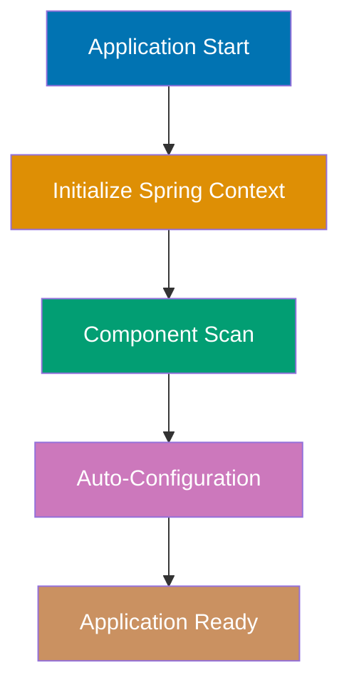
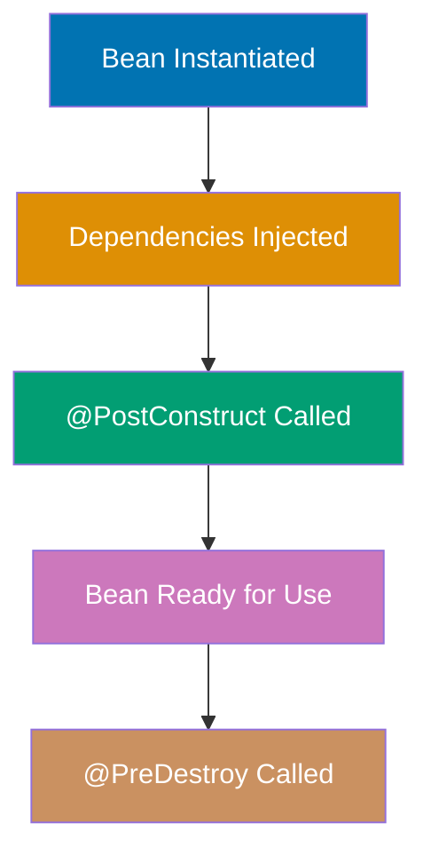
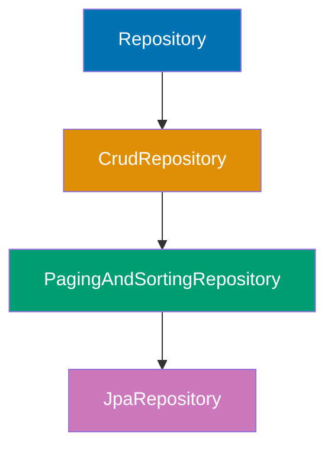
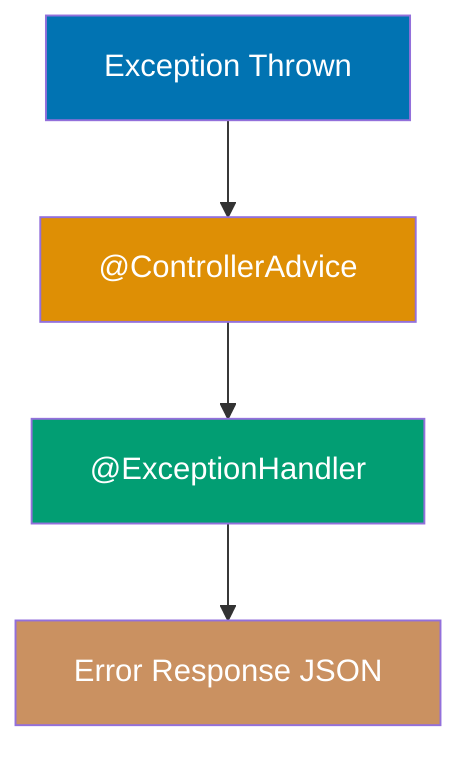

Learn Spring Boot fundamentals through 20 annotated code examples. Each example is self-contained, runnable, and heavily commented to show what each line does, expected outputs, and key takeaways.

## Group 1: Core Spring Concepts

### Example 1: Spring Boot Application Starter

Spring Boot applications start with a single annotation that combines three essential configurations: `@Configuration` (bean definitions), `@EnableAutoConfiguration` (auto-wiring magic), and `@ComponentScan` (finding your components).



**Code**:

```java
package com.example.demo;

import org.springframework.boot.SpringApplication;
import org.springframework.boot.autoconfigure.SpringBootApplication;

// @SpringBootApplication = @Configuration + @EnableAutoConfiguration + @ComponentScan
@SpringBootApplication
public class DemoApplication {
    // Main method is the entry point
    public static void main(String[] args) {
        // Starts embedded Tomcat server and Spring context
        SpringApplication.run(DemoApplication.class, args); // => Server started on port 8080
    }
}
```

**Key Takeaway**: `@SpringBootApplication` combines three annotations for convention-over-configuration, eliminating XML and boilerplate setup code.

---

### Example 2: Dependency Injection Fundamentals

Dependency Injection is Spring's core feature where the framework creates and injects dependencies instead of you calling `new`. Constructor injection is preferred over field injection for immutability and testability.

**Code**:

```java
package com.example.demo.service;

import org.springframework.stereotype.Component;
import org.springframework.stereotype.Service;

// @Component marks this as a Spring-managed bean
@Component
class UserRepository {
    public String findUser(Long id) {
        return "User" + id; // => "User123"
    }
}

// @Service is a specialized @Component for service layer
@Service
public class UserService {
    private final UserRepository userRepository;

    // Constructor injection - Spring automatically injects UserRepository
    // @Autowired is optional on single constructor (since Spring 4.3)
    public UserService(UserRepository userRepository) {
        this.userRepository = userRepository; // => Injected by Spring
    }

    public String getUser(Long id) {
        return userRepository.findUser(id); // => Delegates to repository
    }
}

// WRONG: Field injection (harder to test, allows null state)
// @Autowired
// private UserRepository userRepository; // DON'T DO THIS
```

**Key Takeaway**: Prefer constructor injection for immutability and testability. Field injection hides dependencies and allows null state.

---

### Example 3: Bean Lifecycle & Scopes

Beans are objects managed by Spring's IoC container. Understanding lifecycle hooks and scopes prevents initialization bugs and memory leaks.



**Code**:

```java
package com.example.demo.config;

import jakarta.annotation.PostConstruct;
import jakarta.annotation.PreDestroy;
import org.springframework.context.annotation.Bean;
import org.springframework.context.annotation.Configuration;
import org.springframework.context.annotation.Scope;
import org.springframework.stereotype.Component;

@Component
// Default scope is singleton (one instance per Spring context)
public class DatabaseConnection {
    @PostConstruct
    public void init() {
        System.out.println("Connecting to database..."); // => Called after construction
    }

    @PreDestroy
    public void cleanup() {
        System.out.println("Closing database connection..."); // => Called before shutdown
    }
}

@Configuration
class AppConfig {
    @Bean
    @Scope("prototype") // New instance every time bean is requested
    public RequestProcessor processor() {
        return new RequestProcessor(); // => New instance per request
    }

    @Bean
    // Default singleton scope - one instance for entire application
    public CacheManager cacheManager() {
        return new CacheManager(); // => Single instance shared
    }
}

// Placeholder classes
class RequestProcessor {}
class CacheManager {}
```

**Key Takeaway**: Singleton beans (default) live for the entire application lifetime. Prototype beans create new instances per request. Use `@PostConstruct`/`@PreDestroy` for initialization and cleanup.

---

### Example 4: Component Scanning & Stereotypes

Spring stereotypes (`@Component`, `@Service`, `@Repository`, `@Controller`) are semantically identical but indicate architectural layers. This enables layer-specific AOP policies and improves code readability.

**Code**:

```java
package com.example.demo;

import org.springframework.stereotype.Component;
import org.springframework.stereotype.Repository;
import org.springframework.stereotype.Service;
import org.springframework.web.bind.annotation.RestController;

// @Component - generic Spring-managed bean
@Component
class EmailValidator {
    public boolean isValid(String email) {
        return email.contains("@"); // => Simple validation
    }
}

// @Repository - data access layer (enables exception translation)
@Repository
class UserRepository {
    // Spring translates database exceptions to DataAccessException
}

// @Service - business logic layer
@Service
class UserService {
    // Contains business rules and orchestration
}

// @RestController - web layer (combines @Controller + @ResponseBody)
@RestController
class UserController {
    // Handles HTTP requests and returns JSON responses
}
```

**Key Takeaway**: Use stereotypes for semantic clarity. `@Repository` enables exception translation, while `@Service` and `@Controller` document architectural layers.

---

## Group 2: REST API Fundamentals

### Example 5: First REST Controller

`@RestController` combines `@Controller` (handles web requests) and `@ResponseBody` (returns data, not views). Spring Boot auto-configures Jackson for JSON serialization.


**Code**:

```java
package com.example.demo.controller;

import org.springframework.web.bind.annotation.GetMapping;
import org.springframework.web.bind.annotation.PostMapping;
import org.springframework.web.bind.annotation.RequestBody;
import org.springframework.web.bind.annotation.RestController;

// @RestController = @Controller + @ResponseBody
@RestController
public class HelloController {

    // GET http://localhost:8080/hello
    @GetMapping("/hello")
    public String hello() {
        return "Hello, Spring Boot!"; // => Returns plain text
    }

    // GET http://localhost:8080/user
    @GetMapping("/user")
    public User getUser() {
        return new User("Alice", 30); // => {"name":"Alice","age":30}
    }

    // POST http://localhost:8080/user with JSON body
    @PostMapping("/user")
    public User createUser(@RequestBody User user) {
        // Jackson automatically deserializes JSON to User object
        return user; // => Echoes back the received user
    }
}

record User(String name, int age) {} // Java 17+ record as DTO
```

**Key Takeaway**: Spring Boot auto-configures Jackson for JSON conversion. `@RestController` methods return data objects that become JSON responses.

---

### Example 6: Path Variables & Query Parameters

Path variables (`/users/{id}`) identify resources. Query parameters (`?page=1&size=10`) filter or paginate results. Use `@PathVariable` and `@RequestParam` to extract them.

**Code**:

```java
package com.example.demo.controller;

import org.springframework.web.bind.annotation.*;

@RestController
@RequestMapping("/api/users")
public class UserController {

    // Path variable: GET /api/users/123
    @GetMapping("/{id}")
    public String getUserById(@PathVariable Long id) {
        return "User ID: " + id; // => "User ID: 123"
    }

    // Multiple path variables: GET /api/users/123/posts/456
    @GetMapping("/{userId}/posts/{postId}")
    public String getUserPost(@PathVariable Long userId, @PathVariable Long postId) {
        return "User " + userId + ", Post " + postId; // => "User 123, Post 456"
    }

    // Query parameters: GET /api/users?page=0&size=20
    @GetMapping
    public String getUsers(
        @RequestParam(defaultValue = "0") int page,
        @RequestParam(defaultValue = "10") int size
    ) {
        return "Page " + page + ", Size " + size; // => "Page 0, Size 20"
    }

    // Optional query parameter
    @GetMapping("/search")
    public String search(@RequestParam(required = false) String name) {
        if (name == null) {
            return "No filter applied"; // => When no name parameter
        }
        return "Searching for: " + name; // => "Searching for: Alice"
    }
}
```

**Key Takeaway**: Path variables identify resources (`/users/123`). Query parameters filter or paginate (`?page=0&size=10`). Use `defaultValue` and `required=false` for optional parameters.

---

### Example 7: Request & Response Bodies

DTOs (Data Transfer Objects) decouple your API contract from domain models. Use Java records for immutable DTOs. `ResponseEntity` provides control over status codes and headers.

**Code**:

```java
package com.example.demo.controller;

import org.springframework.http.HttpStatus;
import org.springframework.http.ResponseEntity;
import org.springframework.web.bind.annotation.*;

// DTO using Java 17 record
record CreateUserRequest(String username, String email) {}
record UserResponse(Long id, String username, String email) {}

@RestController
@RequestMapping("/api/users")
public class UserApiController {

    // POST /api/users with JSON body
    @PostMapping
    public ResponseEntity<UserResponse> createUser(@RequestBody CreateUserRequest request) {
        // Simulate saving to database
        UserResponse user = new UserResponse(1L, request.username(), request.email());

        // Return 201 Created with Location header
        return ResponseEntity
            .status(HttpStatus.CREATED)
            .header("Location", "/api/users/1")
            .body(user); // => 201 Created with {"id":1,"username":"alice","email":"alice@example.com"}
    }

    // GET /api/users/1
    @GetMapping("/{id}")
    public ResponseEntity<UserResponse> getUser(@PathVariable Long id) {
        UserResponse user = new UserResponse(id, "alice", "alice@example.com");
        return ResponseEntity.ok(user); // => 200 OK
    }

    // DELETE /api/users/1
    @DeleteMapping("/{id}")
    public ResponseEntity<Void> deleteUser(@PathVariable Long id) {
        // Simulate deletion
        return ResponseEntity.noContent().build(); // => 204 No Content
    }
}
```

**Key Takeaway**: Use records for immutable DTOs. `ResponseEntity` controls HTTP status codes and headers. Return 201 Created for POST, 200 OK for GET, 204 No Content for DELETE.

---

### Example 8: HTTP Methods & Status Codes

REST uses HTTP methods semantically: POST creates, GET retrieves, PUT updates, DELETE removes. Return appropriate status codes: 201 (Created), 200 (OK), 204 (No Content), 404 (Not Found).

**Code**:

```java
package com.example.demo.controller;

import org.springframework.http.ResponseEntity;
import org.springframework.web.bind.annotation.*;
import java.net.URI;
import java.util.*;

record Product(Long id, String name, double price) {}

@RestController
@RequestMapping("/api/products")
public class ProductController {
    private final Map<Long, Product> products = new HashMap<>();
    private Long nextId = 1L;

    // POST - Create new resource (201 Created)
    @PostMapping
    public ResponseEntity<Product> create(@RequestBody Product product) {
        Product created = new Product(nextId++, product.name(), product.price());
        products.put(created.id(), created);

        return ResponseEntity
            .created(URI.create("/api/products/" + created.id()))
            .body(created); // => 201 Created
    }

    // GET - Retrieve resource (200 OK or 404 Not Found)
    @GetMapping("/{id}")
    public ResponseEntity<Product> get(@PathVariable Long id) {
        Product product = products.get(id);
        if (product == null) {
            return ResponseEntity.notFound().build(); // => 404 Not Found
        }
        return ResponseEntity.ok(product); // => 200 OK
    }

    // PUT - Update resource (200 OK)
    @PutMapping("/{id}")
    public ResponseEntity<Product> update(@PathVariable Long id, @RequestBody Product product) {
        Product updated = new Product(id, product.name(), product.price());
        products.put(id, updated);
        return ResponseEntity.ok(updated); // => 200 OK
    }

    // DELETE - Remove resource (204 No Content)
    @DeleteMapping("/{id}")
    public ResponseEntity<Void> delete(@PathVariable Long id) {
        products.remove(id);
        return ResponseEntity.noContent().build(); // => 204 No Content
    }
}
```

**Key Takeaway**: Follow REST conventions: POST (201 Created), GET (200 OK / 404 Not Found), PUT (200 OK), DELETE (204 No Content). Include Location header on resource creation.

---

### Example 9: Content Negotiation

Spring Boot supports content negotiation via the `Accept` header. Clients can request JSON (`application/json`) or XML (`application/xml`). Use `produces` to specify supported formats.

**Code**:

```java
package com.example.demo.controller;

import org.springframework.web.bind.annotation.GetMapping;
import org.springframework.web.bind.annotation.RequestMapping;
import org.springframework.web.bind.annotation.RestController;

record Book(String title, String author) {}

@RestController
@RequestMapping("/api/books")
public class BookController {

    // Produces JSON by default
    @GetMapping
    public Book getBook() {
        return new Book("Spring Boot in Action", "Craig Walls");
        // => {"title":"Spring Boot in Action","author":"Craig Walls"}
    }

    // Explicit JSON production
    @GetMapping(value = "/json", produces = "application/json")
    public Book getBookJson() {
        return new Book("Spring Boot in Action", "Craig Walls");
        // => Content-Type: application/json
    }

    // Multiple content types (requires XML dependency)
    // Add: <dependency><groupId>com.fasterxml.jackson.dataformat</groupId><artifactId>jackson-dataformat-xml</artifactId></dependency>
    @GetMapping(value = "/multi", produces = {"application/json", "application/xml"})
    public Book getBookMulti() {
        return new Book("Spring Boot in Action", "Craig Walls");
        // => JSON if Accept: application/json
        // => XML if Accept: application/xml
    }
}
```

**Key Takeaway**: Content negotiation allows clients to request different formats via `Accept` header. Use `produces` to specify supported media types.

---

## Group 3: Data Access Basics

### Example 10: Spring Data JPA Introduction

Spring Data JPA eliminates boilerplate CRUD code. Define an interface extending `JpaRepository<Entity, ID>`, and Spring generates implementations automatically.



**Code**:

```java
package com.example.demo.model;

import jakarta.persistence.*;

@Entity
@Table(name = "users")
public class User {
    @Id
    @GeneratedValue(strategy = GenerationType.IDENTITY)
    private Long id;

    @Column(nullable = false, unique = true)
    private String email;

    private String name;

    // Constructors, getters, setters omitted for brevity
}
```

```java
package com.example.demo.repository;

import com.example.demo.model.User;
import org.springframework.data.jpa.repository.JpaRepository;

// JpaRepository<Entity, ID>
public interface UserRepository extends JpaRepository<User, Long> {
    // No implementation needed - Spring generates it
    // Inherited methods:
    // save(user)           => Inserts or updates
    // findById(id)         => Optional<User>
    // findAll()            => List<User>
    // deleteById(id)       => Removes user
    // count()              => Total records
}
```

**Key Takeaway**: `JpaRepository` provides CRUD methods out-of-the-box. No implementation code needed—Spring generates it at runtime.

---

### Example 11: Custom Queries

Spring Data JPA supports custom queries via `@Query` with JPQL (Java Persistence Query Language) or native SQL. Use JPQL for database portability, native SQL for database-specific features.

**Code**:

```java
package com.example.demo.repository;

import com.example.demo.model.User;
import org.springframework.data.jpa.repository.JpaRepository;
import org.springframework.data.jpa.repository.Query;
import org.springframework.data.repository.query.Param;
import java.util.List;

public interface UserRepository extends JpaRepository<User, Long> {

    // Derived query method - Spring parses method name
    List<User> findByEmailContaining(String email); // => SELECT * WHERE email LIKE '%email%'

    // JPQL query with named parameter
    @Query("SELECT u FROM User u WHERE u.name = :name")
    List<User> findByName(@Param("name") String name);

    // JPQL with multiple parameters
    @Query("SELECT u FROM User u WHERE u.name = :name AND u.email LIKE %:domain")
    List<User> findByNameAndEmailDomain(@Param("name") String name, @Param("domain") String domain);

    // Native SQL query
    @Query(value = "SELECT * FROM users WHERE email = ?1", nativeQuery = true)
    User findByEmailNative(String email);

    // Native SQL with named parameters
    @Query(value = "SELECT * FROM users WHERE name = :name ORDER BY id DESC LIMIT 1", nativeQuery = true)
    User findLatestByName(@Param("name") String name);
}
```

**Key Takeaway**: Use derived query methods for simple queries. Use `@Query` with JPQL for portability or native SQL for database-specific optimizations.

---

### Example 12: Entity Relationships

JPA supports four relationship types: `@OneToOne`, `@OneToMany`, `@ManyToOne`, `@ManyToMany`. Use `mappedBy` for bidirectional relationships. Be careful with LAZY vs EAGER fetching to avoid N+1 queries.


**Code**:

```java
package com.example.demo.model;

import jakarta.persistence.*;
import java.util.List;

@Entity
@Table(name = "users")
public class User {
    @Id
    @GeneratedValue(strategy = GenerationType.IDENTITY)
    private Long id;

    private String name;

    // One user has many orders
    @OneToMany(mappedBy = "user", fetch = FetchType.LAZY)
    private List<Order> orders; // => Fetched only when accessed

    // Getters/setters omitted
}

@Entity
@Table(name = "orders")
public class Order {
    @Id
    @GeneratedValue(strategy = GenerationType.IDENTITY)
    private Long id;

    private String product;

    // Many orders belong to one user
    @ManyToOne(fetch = FetchType.LAZY)
    @JoinColumn(name = "user_id")
    private User user; // => Foreign key column: user_id

    // Getters/setters omitted
}

// WRONG: EAGER fetching loads all orders immediately
// @OneToMany(mappedBy = "user", fetch = FetchType.EAGER) // DON'T DO THIS
```

**Key Takeaway**: Use `@OneToMany` and `@ManyToOne` for relationships. Default to LAZY fetching to prevent N+1 queries. Use `mappedBy` on the non-owning side of bidirectional relationships.

---

### Example 13: Pagination & Sorting

Always paginate large datasets to control memory usage. Spring Data JPA provides `Pageable` for pagination and `Sort` for ordering. Return `Page<T>` to include total count and page metadata.

**Code**:

```java
package com.example.demo.repository;

import com.example.demo.model.User;
import org.springframework.data.domain.Page;
import org.springframework.data.domain.Pageable;
import org.springframework.data.jpa.repository.JpaRepository;

public interface UserRepository extends JpaRepository<User, Long> {
    // Pageable parameter enables pagination
    Page<User> findByNameContaining(String name, Pageable pageable);
}
```

```java
package com.example.demo.controller;

import com.example.demo.model.User;
import com.example.demo.repository.UserRepository;
import org.springframework.data.domain.*;
import org.springframework.web.bind.annotation.*;

@RestController
@RequestMapping("/api/users")
public class UserPageController {
    private final UserRepository userRepository;

    public UserPageController(UserRepository userRepository) {
        this.userRepository = userRepository;
    }

    // GET /api/users?page=0&size=20&sort=name,asc
    @GetMapping
    public Page<User> getUsers(
        @RequestParam(defaultValue = "0") int page,
        @RequestParam(defaultValue = "10") int size,
        @RequestParam(defaultValue = "id") String sortBy
    ) {
        Pageable pageable = PageRequest.of(page, size, Sort.by(sortBy).ascending());
        return userRepository.findAll(pageable);
        // => {
        //   "content": [...],
        //   "totalElements": 100,
        //   "totalPages": 10,
        //   "size": 10,
        //   "number": 0
        // }
    }
}
```

**Key Takeaway**: Always paginate large datasets using `Pageable`. `Page<T>` includes metadata (total count, total pages, current page) for client-side pagination controls.

---

### Example 14: Database Initialization

Use `schema.sql` and `data.sql` for simple initialization. For production, use Flyway or Liquibase for versioned migrations that prevent schema drift across environments.

**Code**:

```sql
-- src/main/resources/schema.sql
CREATE TABLE IF NOT EXISTS users (
    id BIGINT AUTO_INCREMENT PRIMARY KEY,
    email VARCHAR(255) NOT NULL UNIQUE,
    name VARCHAR(255)
);
```

```sql
-- src/main/resources/data.sql
INSERT INTO users (email, name) VALUES ('alice@example.com', 'Alice');
INSERT INTO users (email, name) VALUES ('bob@example.com', 'Bob');
```

**Flyway Migration**:

```xml
<!-- pom.xml -->
<dependency>
    <groupId>org.flywaydb</groupId>
    <artifactId>flyway-core</artifactId>
</dependency>
```

```sql
-- src/main/resources/db/migration/V1__Create_users_table.sql
CREATE TABLE users (
    id BIGINT AUTO_INCREMENT PRIMARY KEY,
    email VARCHAR(255) NOT NULL UNIQUE,
    name VARCHAR(255)
);
```

```properties
spring.flyway.enabled=true
```

**Key Takeaway**: Use `schema.sql`/`data.sql` for development. Use Flyway (versioned migrations like `V1__Description.sql`) for production to track schema changes across environments.

---

## Group 4: Configuration & Properties

### Example 15: Application Properties

Externalize configuration to avoid hardcoding values. Use `application.properties` or `application.yml` for environment-specific settings. Inject values with `@Value`.

**Code**:

```properties
app.name=My Spring Boot App
app.version=1.0.0
app.max-users=100

spring.datasource.url=jdbc:h2:mem:testdb
spring.datasource.username=sa
spring.datasource.password=
```

```java
package com.example.demo.config;

import org.springframework.beans.factory.annotation.Value;
import org.springframework.stereotype.Component;

@Component
public class AppProperties {

    @Value("${app.name}")
    private String appName; // => "My Spring Boot App"

    @Value("${app.version}")
    private String version; // => "1.0.0"

    @Value("${app.max-users:50}") // Default value if not set
    private int maxUsers; // => 100 (or 50 if property missing)

    public String getInfo() {
        return appName + " v" + version + " (max users: " + maxUsers + ")";
    }
}
```

**Key Takeaway**: Externalize configuration to `application.properties`. Use `@Value("${property:default}")` for injection with defaults. Never hardcode environment-specific values.

---

### Example 16: Configuration Classes

Use `@Configuration` classes to define beans for third-party libraries or complex object initialization. Beans defined with `@Bean` methods are managed by Spring.

**Code**:

```java
package com.example.demo.config;

import org.springframework.context.annotation.Bean;
import org.springframework.context.annotation.Configuration;
import org.springframework.web.client.RestTemplate;
import com.fasterxml.jackson.databind.ObjectMapper;
import com.fasterxml.jackson.databind.SerializationFeature;

@Configuration
public class AppConfig {

    // Bean for HTTP client
    @Bean
    public RestTemplate restTemplate() {
        return new RestTemplate(); // => Spring-managed RestTemplate
    }

    // Custom ObjectMapper configuration
    @Bean
    public ObjectMapper objectMapper() {
        ObjectMapper mapper = new ObjectMapper();
        mapper.enable(SerializationFeature.INDENT_OUTPUT); // Pretty-print JSON
        return mapper; // => Replaces default Jackson ObjectMapper
    }

    // Bean that depends on another bean
    @Bean
    public ApiClient apiClient(RestTemplate restTemplate) {
        return new ApiClient(restTemplate); // => Injected by Spring
    }
}

class ApiClient {
    private final RestTemplate restTemplate;
    public ApiClient(RestTemplate restTemplate) {
        this.restTemplate = restTemplate;
    }
}
```

**Key Takeaway**: Use `@Configuration` classes to centralize bean definitions. `@Bean` methods create Spring-managed objects for third-party libraries.

---

### Example 17: Profiles for Environments

Profiles enable environment-specific configurations without code changes. Define `application-{profile}.properties` files and activate with `spring.profiles.active`.

**Code**:

```properties
spring.datasource.url=jdbc:h2:mem:devdb
app.feature.debug=true
logging.level.root=DEBUG
```

```properties
spring.datasource.url=jdbc:postgresql://prod-server:5432/myapp
app.feature.debug=false
logging.level.root=WARN
```

```java
package com.example.demo.config;

import org.springframework.context.annotation.Bean;
import org.springframework.context.annotation.Configuration;
import org.springframework.context.annotation.Profile;

@Configuration
public class DataSourceConfig {

    @Bean
    @Profile("dev")
    public DataSource devDataSource() {
        return new H2DataSource(); // => Used when profile=dev
    }

    @Bean
    @Profile("prod")
    public DataSource prodDataSource() {
        return new PostgresDataSource(); // => Used when profile=prod
    }
}

// Placeholder classes
class H2DataSource {}
class PostgresDataSource {}
class DataSource {}
```

```properties
spring.profiles.active=dev
```

```bash
java -jar app.jar --spring.profiles.active=prod
```

**Key Takeaway**: Profiles enable environment-specific configurations. Use `application-{profile}.properties` and `@Profile` annotation. Activate with `spring.profiles.active`.

---

## Group 5: Exception Handling & Validation

### Example 18: Global Exception Handling

Centralize error handling with `@ControllerAdvice` instead of scattered try-catch blocks. Return consistent error responses with proper HTTP status codes.



**Code**:

```java
package com.example.demo.exception;

public class ResourceNotFoundException extends RuntimeException {
    public ResourceNotFoundException(String message) {
        super(message);
    }
}
```

```java
package com.example.demo.exception;

import org.springframework.http.HttpStatus;
import org.springframework.http.ResponseEntity;
import org.springframework.web.bind.annotation.*;
import java.time.LocalDateTime;

// Error response DTO
record ErrorResponse(
    String message,
    int status,
    LocalDateTime timestamp
) {}

// Global exception handler
@ControllerAdvice
public class GlobalExceptionHandler {

    @ExceptionHandler(ResourceNotFoundException.class)
    public ResponseEntity<ErrorResponse> handleNotFound(ResourceNotFoundException ex) {
        ErrorResponse error = new ErrorResponse(
            ex.getMessage(),
            HttpStatus.NOT_FOUND.value(),
            LocalDateTime.now()
        );
        return ResponseEntity.status(HttpStatus.NOT_FOUND).body(error);
        // => 404 {"message":"User not found","status":404,"timestamp":"2024-12-24T..."}
    }

    @ExceptionHandler(IllegalArgumentException.class)
    public ResponseEntity<ErrorResponse> handleBadRequest(IllegalArgumentException ex) {
        ErrorResponse error = new ErrorResponse(
            ex.getMessage(),
            HttpStatus.BAD_REQUEST.value(),
            LocalDateTime.now()
        );
        return ResponseEntity.status(HttpStatus.BAD_REQUEST).body(error);
        // => 400 Bad Request
    }

    @ExceptionHandler(Exception.class)
    public ResponseEntity<ErrorResponse> handleGeneral(Exception ex) {
        ErrorResponse error = new ErrorResponse(
            "Internal server error",
            HttpStatus.INTERNAL_SERVER_ERROR.value(),
            LocalDateTime.now()
        );
        return ResponseEntity.status(HttpStatus.INTERNAL_SERVER_ERROR).body(error);
        // => 500 Internal Server Error
    }
}
```

**Key Takeaway**: Use `@ControllerAdvice` for global exception handling. Define `@ExceptionHandler` methods for specific exceptions. Return consistent error response DTOs with proper HTTP status codes.

---

### Example 19: Bean Validation

Use JSR-380 Bean Validation annotations (`@NotNull`, `@Size`, `@Email`, etc.) for declarative validation. Combine with `@Valid` on `@RequestBody` to automatically validate requests.

**Code**:

```xml
<!-- pom.xml -->
<dependency>
    <groupId>org.springframework.boot</groupId>
    <artifactId>spring-boot-starter-validation</artifactId>
</dependency>
```

```java
package com.example.demo.dto;

import jakarta.validation.constraints.*;

record CreateUserRequest(
    @NotBlank(message = "Username is required")
    @Size(min = 3, max = 50, message = "Username must be between 3 and 50 characters")
    String username,

    @NotBlank(message = "Email is required")
    @Email(message = "Email must be valid")
    String email,

    @Min(value = 18, message = "Age must be at least 18")
    @Max(value = 120, message = "Age must be at most 120")
    int age
) {}
```

```java
package com.example.demo.controller;

import com.example.demo.dto.CreateUserRequest;
import jakarta.validation.Valid;
import org.springframework.http.ResponseEntity;
import org.springframework.validation.BindingResult;
import org.springframework.web.bind.annotation.*;

@RestController
@RequestMapping("/api/users")
public class UserValidationController {

    // @Valid triggers validation
    @PostMapping
    public ResponseEntity<?> create(@Valid @RequestBody CreateUserRequest request) {
        // If validation fails, Spring returns 400 Bad Request automatically
        // with error details like:
        // {
        //   "timestamp": "2024-12-24T...",
        //   "status": 400,
        //   "error": "Bad Request",
        //   "errors": [{
        //     "field": "username",
        //     "message": "Username is required"
        //   }]
        // }

        return ResponseEntity.ok(request); // => Only if validation passes
    }

    // Manual validation handling with BindingResult
    @PostMapping("/manual")
    public ResponseEntity<?> createManual(
        @Valid @RequestBody CreateUserRequest request,
        BindingResult bindingResult
    ) {
        if (bindingResult.hasErrors()) {
            // Custom error handling
            var errors = bindingResult.getFieldErrors().stream()
                .map(e -> e.getField() + ": " + e.getDefaultMessage())
                .toList();
            return ResponseEntity.badRequest().body(errors);
        }

        return ResponseEntity.ok(request);
    }
}
```

**Key Takeaway**: Use `@Valid` with JSR-380 annotations for declarative validation. Spring automatically returns 400 Bad Request with validation error details.

---

### Example 20: Custom Validators

Create custom validation annotations for complex business rules that can't be expressed with standard JSR-380 annotations. Implement `ConstraintValidator` interface.

**Code**:

```java
package com.example.demo.validation;

import jakarta.validation.Constraint;
import jakarta.validation.Payload;
import java.lang.annotation.*;

@Target({ElementType.FIELD, ElementType.PARAMETER})
@Retention(RetentionPolicy.RUNTIME)
@Constraint(validatedBy = PasswordValidator.class)
public @interface ValidPassword {
    String message() default "Password must contain at least one uppercase, one lowercase, and one digit";
    Class<?>[] groups() default {};
    Class<? extends Payload>[] payload() default {};
}
```

```java
package com.example.demo.validation;

import jakarta.validation.ConstraintValidator;
import jakarta.validation.ConstraintValidatorContext;

public class PasswordValidator implements ConstraintValidator<ValidPassword, String> {

    @Override
    public void initialize(ValidPassword constraintAnnotation) {
        // Initialization logic if needed
    }

    @Override
    public boolean isValid(String password, ConstraintValidatorContext context) {
        if (password == null) {
            return false;
        }

        // Check for at least one uppercase, one lowercase, one digit
        boolean hasUppercase = password.chars().anyMatch(Character::isUpperCase);
        boolean hasLowercase = password.chars().anyMatch(Character::isLowerCase);
        boolean hasDigit = password.chars().anyMatch(Character::isDigit);

        return hasUppercase && hasLowercase && hasDigit; // => true if all conditions met
    }
}
```

```java
package com.example.demo.dto;

import com.example.demo.validation.ValidPassword;
import jakarta.validation.constraints.NotBlank;

record ChangePasswordRequest(
    @NotBlank
    String oldPassword,

    @NotBlank
    @ValidPassword // Custom validator
    String newPassword
) {}
```

**Key Takeaway**: Create custom `@interface` annotations with `@Constraint` and implement `ConstraintValidator<AnnotationType, FieldType>` for reusable complex validation logic.
