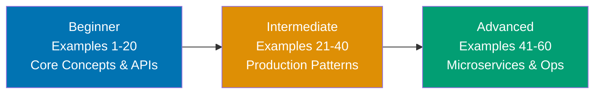

**Want to master Spring Boot through working examples?** This by-example guide teaches 90% of Spring Boot through 60+ annotated code examples organized by complexity level.

## What Is By-Example Learning?

By-example learning is an **example-first approach** where you learn through annotated, runnable code rather than narrative explanations. Each example is self-contained, immediately executable as a Spring Boot application or test class, and heavily commented to show:

- **What each line does** - Inline comments explain annotations, configuration, and framework behavior
- **Expected outputs** - Using `// =>` notation for API responses, log messages, and test assertions
- **Framework mechanics** - How Spring Boot's auto-configuration, dependency injection, and lifecycle work
- **Key takeaways** - 1-2 sentence summaries of patterns and best practices

This approach is **ideal for experienced Java developers** who already understand Java syntax and OOP concepts, and want to quickly master Spring Boot's conventions, annotations, and architectural patterns through working code.

Unlike narrative tutorials that build understanding through explanation and storytelling, by-example learning lets you **see the code first, run it second, and understand it through direct interaction**. You learn Spring Boot patterns by running actual Spring Boot applications.

## What Is Spring Boot?

**Spring Boot** is an opinionated framework built on top of the Spring Framework that simplifies building production-ready applications. While the **Spring Framework** provides core features like dependency injection, transaction management, and data access, **Spring Boot adds**:

- **Auto-configuration** - Automatically configures Spring and third-party libraries based on classpath dependencies
- **Embedded servers** - Tomcat, Jetty, or Undertow embedded in the application JAR
- **Starter dependencies** - Pre-configured dependency sets (spring-boot-starter-web, spring-boot-starter-data-jpa)
- **Production features** - Health checks, metrics, externalized configuration out of the box
- **Convention over configuration** - Sensible defaults that reduce boilerplate XML and Java configuration

**Spring Boot vs. Spring Framework**: Spring Framework requires extensive XML or Java configuration. Spring Boot eliminates this through auto-configuration and starters, letting you build applications with minimal setup. Think of Spring Boot as Spring Framework + sensible defaults + embedded server + production readiness.

## Learning Path



Progress from Spring Boot fundamentals (dependency injection, REST APIs, data access) through production patterns (security, testing, caching) to microservices architecture and observability. Each level builds on the previous, introducing more sophisticated Spring Boot features and real-world patterns.

## Coverage Philosophy

This by-example guide provides **90% coverage of Spring Boot** through practical, annotated examples. The 90% figure represents the depth and breadth of concepts covered, not a time estimate—focus is on **outcomes and understanding**, not duration.

### What's Covered

- **Dependency injection and IoC container** - `@Component`, `@Autowired`, `@Bean`, application context, scopes
- **REST API development** - `@RestController`, `@RequestMapping`, request/response handling, validation
- **Data access with Spring Data JPA** - Entities, repositories, queries, relationships, transactions
- **Spring Security** - Authentication, authorization, JWT tokens, OAuth2, method security
- **Testing** - `@SpringBootTest`, MockMvc, TestContainers, integration testing, mocking
- **Caching and async processing** - `@Cacheable`, `@Async`, task scheduling, event handling
- **Microservices communication** - RestTemplate, WebClient, service discovery, load balancing
- **Observability** - Actuator metrics, distributed tracing, structured logging, health checks
- **Resilience patterns** - Circuit breaker (Resilience4j), retries, rate limiting, bulkheads
- **Production deployment** - Docker containerization, health checks, graceful shutdown, externalized config

### What's NOT Covered

This guide focuses on **Spring Boot essentials and production patterns**, not specialized frameworks or advanced customization. For additional topics:

- **Spring Batch** - Batch processing framework for large-scale data pipelines
- **Spring Integration** - Enterprise integration patterns and messaging
- **Advanced Reactive Programming** - Deep WebFlux, reactive streams, backpressure strategies
- **Spring Cloud exhaustive coverage** - Config Server, Sleuth, Gateway covered at introductory level only
- **Framework internals customization** - Custom auto-configuration, bean post-processors, advanced AOP

The 90% coverage goal maintains humility—no tutorial can cover everything. This guide teaches the **core patterns that unlock the remaining 10%** through your own exploration and Spring documentation.

## How to Use This Guide

1. **Sequential or selective** - Read examples in order for progressive learning, or jump to specific topics when you need to solve a particular problem
2. **Run everything** - Copy examples into your IDE, execute the Spring Boot applications, observe console output and HTTP responses. Experimentation solidifies understanding.
3. **Modify and experiment** - Change annotations, add endpoints, break configurations intentionally. Learn by seeing what happens.
4. **Use as reference** - Bookmark examples for quick lookups when you forget annotation syntax or configuration patterns
5. **Complement with Spring documentation** - By-example learning is code-first; refer to official Spring Boot documentation for deeper architectural explanations and framework internals

**Best workflow**: Open your IDE in one window, this guide in another. Copy each example to a Spring Boot project, run it, inspect the logs and responses. When you encounter unfamiliar annotations, modify the example and observe behavior changes.

## Relationship to Other Tutorials

Understanding where by-example fits in the tutorial ecosystem helps you choose the right learning path:

| Tutorial Type    | Coverage                 | Approach                       | Target Audience             | When to Use                                                 |
| ---------------- | ------------------------ | ------------------------------ | --------------------------- | ----------------------------------------------------------- |
| **By Example**   | 90% through 60+ examples | Code-first, annotated examples | Experienced Java developers | Quick framework pickup, reference, switching to Spring Boot |
| **Quick Start**  | 5-30% touchpoints        | Hands-on project               | Spring Boot newcomers       | First taste, decide if worth learning                       |
| **Beginner**     | 0-60% comprehensive      | Narrative, explanatory         | New to frameworks           | Deep understanding, first web framework                     |
| **Intermediate** | 60-85%                   | Production applications        | Past basics                 | Production patterns, microservices architecture             |
| **Advanced**     | 85-95%                   | Complex systems                | Experienced Spring devs     | Framework internals, advanced customization                 |
| **Cookbook**     | Problem-oriented         | Recipe, solution-focused       | All levels                  | Specific problems, common tasks                             |

**By Example vs. Quick Start**: By Example provides 90% coverage through isolated examples vs. Quick Start's 5-30% through a single REST API project. By Example is code-first reference; Quick Start is hands-on introduction.

**By Example vs. Beginner Tutorial**: By Example is code-first for experienced Java developers; Beginner Tutorial is narrative-first for framework newcomers. By Example shows patterns; Beginner Tutorial explains Spring Boot architecture.

**By Example vs. Cookbook**: By Example is learning-oriented with progressive examples building framework knowledge. Cookbook is problem-solving oriented with standalone recipes for specific tasks. By Example teaches Spring Boot concepts; Cookbook solves implementation problems.

## Prerequisites

**Required**:

- **Java 17+ installed** - Spring Boot 3.x requires Java 17 minimum
- **Maven or Gradle basics** - Understanding of dependency management and build commands
- **Java programming experience** - Comfortable with OOP, collections, streams, annotations
- **HTTP and REST concepts** - Understanding of HTTP methods, status codes, JSON

**Recommended (helpful but not required)**:

- **Understanding of dependency injection concepts** - Helps grasp Spring's IoC container quickly
- **Basic SQL knowledge** - For Spring Data JPA examples
- **Web application architecture** - MVC pattern, stateless APIs, client-server model

**No prior Spring experience required** - This guide assumes Java competency but teaches Spring Boot from scratch. You don't need to know the Spring Framework's XML configuration or traditional Spring setup. We start with Spring Boot's modern annotation-based approach.

## Structure of Each Example

Every example follows this consistent format:

````markdown
### Example N: Concept Name

Brief explanation of the Spring Boot concept in 2-3 sentences. Explains **what** the feature is, **why** Spring Boot provides it, and **when** to use it.

[OPTIONAL: Mermaid diagram when request flow, bean relationships, or architecture needs visualization]

**Code**:

```java
// Comment explaining what this Spring Boot component does
@RestController
@RequestMapping("/api")
public class ExampleController {

    // Inline comment explaining annotation and dependency injection
    @Autowired
    private ExampleService service;

    @GetMapping("/resource")
    public ResponseEntity<Resource> getResource() {
        Resource resource = service.fetch(); // => Resource{id=1, name="example"}
        return ResponseEntity.ok(resource); // => HTTP 200, JSON response body
    }
}
```

**Expected Output**:

```
GET /api/resource => 200 OK
{
  "id": 1,
  "name": "example"
}
```

**Key Takeaway**: 1-2 sentence summary highlighting the Spring Boot pattern, best practice, or architectural insight from this example.
````

The **brief explanation** provides Spring Boot context and motivation. The **code** is heavily annotated with inline comments explaining annotations, auto-configuration behavior, and framework mechanics. The **expected output** shows HTTP responses, console logs, or test assertions. The **key takeaway** distills the pattern to its essence.

Mermaid diagrams appear when **visual representation clarifies request flows, bean lifecycles, or architectural patterns** - showing HTTP request handling, dependency injection graphs, or microservices communication. Not every example needs a diagram; they're used strategically to enhance understanding of Spring Boot's runtime behavior.

## Ready to Start?

Jump into the beginner examples to start learning Spring Boot through code:

- [Beginner Examples (1-20)](/en/learn/software-engineering/platforms/web/java-spring-boot/by-example/beginner) - Dependency injection, REST controllers, Spring Data JPA, configuration
- [Intermediate Examples (21-40)](/en/learn/software-engineering/platforms/web/java-spring-boot/by-example/intermediate) - Security, testing, caching, async processing, resilience patterns
- [Advanced Examples (41-60)](/en/learn/software-engineering/platforms/web/java-spring-boot/by-example/advanced) - Microservices, observability, production deployment, custom auto-configuration

Each example is self-contained and runnable as a Spring Boot application or test class. Start with Example 1, or jump to topics that interest you most.
