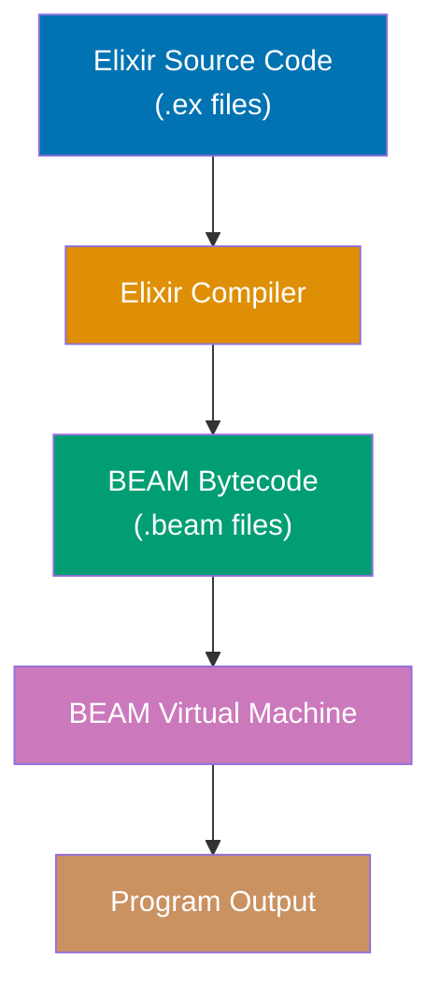
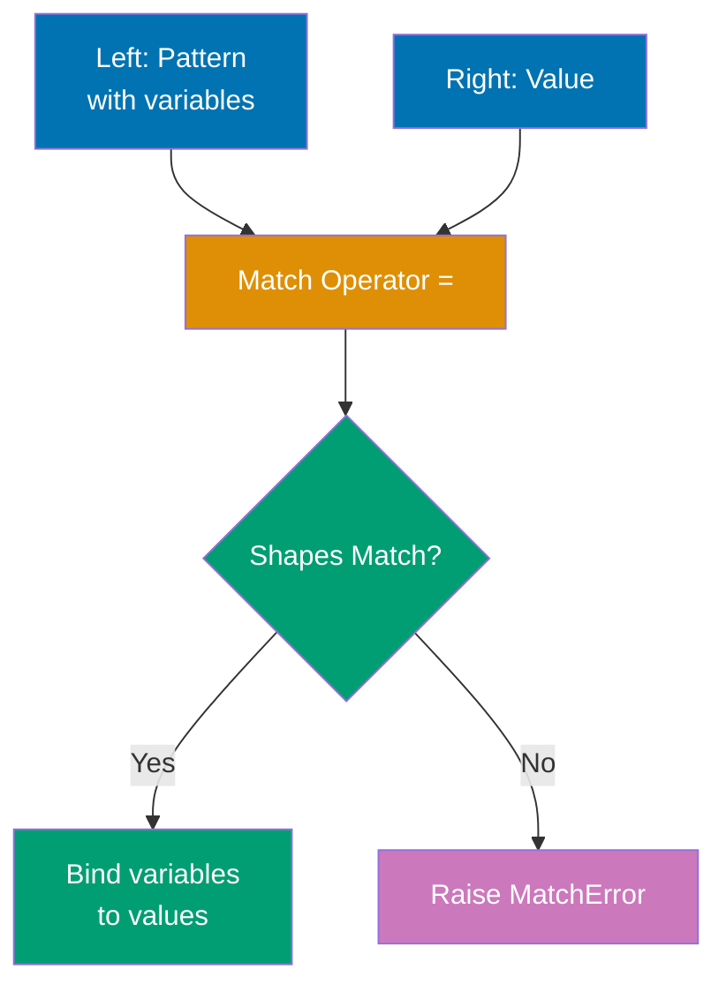
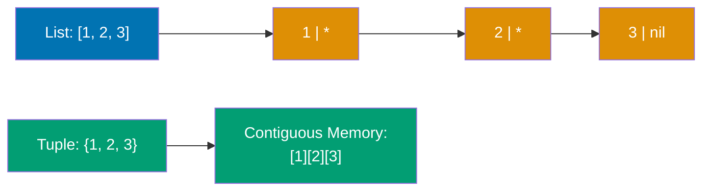
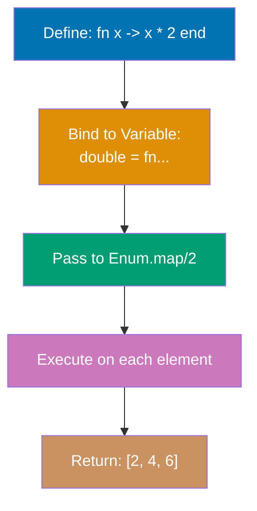
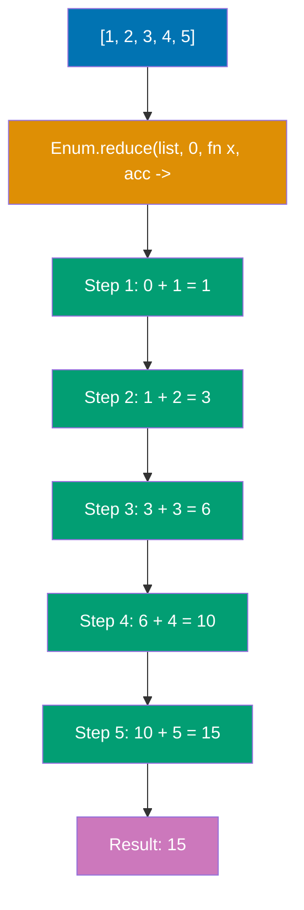

Learn Elixir fundamentals through 15 annotated code examples. Each example is self-contained, runnable in IEx, and heavily commented to show what each line does, expected outputs, and intermediate values.

## Group 1: First Steps

### Example 1: Hello World and Basic Syntax

Elixir programs run on the BEAM virtual machine (Erlang's runtime). Code can be executed interactively in IEx or compiled from `.ex` files. This example shows the simplest Elixir program and how the compilation pipeline works.



**Code**:

```elixir
defmodule Hello do
  # Define a public function using `def`
  def world do
    # IO.puts writes to standard output and returns :ok
    IO.puts("Hello, World!") # => :ok (printed output: "Hello, World!")
  end
end

Hello.world() # => :ok


```

**Key Takeaway**: Elixir code is organized into modules and functions. `IO.puts/1` returns `:ok` after printing, demonstrating Elixir's consistent return value pattern.

---

### Example 2: Variables and Immutability

Elixir variables don't hold values—they **bind** to values. The `=` operator is the **match operator**, not assignment. Once data is created, it cannot be changed (immutability), but variables can be rebound to new values.

**Code**:

```elixir
x = 1 # => 1
x # => 1

x = 2 # => 2
x # => 2

y = 1 # => 1
x = 2 # => 2

user_name = "Alice" # => "Alice"
user_age = 30 # => 30

a = b = c = 5 # => 5
a # => 5
b # => 5
c # => 5

list = [1, 2, 3] # => [1, 2, 3]
new_list = [0 | list] # => [0, 1, 2, 3]
list # => [1, 2, 3] (unchanged!)
new_list # => [0, 1, 2, 3]
```

**Key Takeaway**: Variables bind to values (they don't contain values), and data is immutable. You create new data structures instead of modifying existing ones, which enables safe concurrency.

**Why This Matters**: Immutability is foundational to the BEAM's memory model and concurrency guarantees. When data cannot be mutated, multiple processes can safely access the same data without locks or coordination—each process operates on its own copy through structural sharing. The BEAM uses reference counting for binaries and generational garbage collection per process, meaning GC pauses never stop the entire system. This architecture enables Elixir applications to handle millions of concurrent operations without the synchronization overhead that plagues mutable-state languages.

---

### Example 3: Basic Data Types

Elixir has several basic types: integers, floats, booleans, atoms, and strings. Atoms are constants where their name is their value. Strings are UTF-8 encoded binaries.

**Code**:

```elixir
integer = 42 # => 42
large_integer = 1_000_000_000_000 # => 1000000000000 (underscores for readability)
hex = 0x1F # => 31 (hexadecimal)
binary = 0b1010 # => 10 (binary)

float = 3.14 # => 3.14
scientific = 1.0e-10 # => 1.0e-10

bool_true = true # => true
bool_false = false # => false

atom = :hello # => :hello
atom_with_spaces = :"hello world" # => :"hello world"

string = "Hello, 世界!" # => "Hello, 世界!"
multiline = """
This is a
multiline string
""" # => "This is a\nmultiline string\n"

name = "Alice" # => "Alice"
greeting = "Hello, #{name}!" # => "Hello, Alice!"

is_integer(42) # => true
is_float(3.14) # => true
is_boolean(true) # => true
is_atom(:hello) # => true
is_binary("hello") # => true (strings are binaries)

i 42 # In IEx, shows: Term: 42, Data type: Integer

x = 42 # => 42 (x holds an integer)
x = "hello" # => "hello" (x now holds a string, no error!)
x = :atom # => :atom (x now holds an atom)


defmodule TypeChecker do
  def process_number(value) when is_number(value) do
    value * 2
  end

  # Guards provide runtime type checking in function clauses
  def format_value(val) when is_binary(val) do
    "String: #{val}"
  end

  def format_value(val) when is_integer(val) do
    "Number: #{val}"
  end
end

TypeChecker.process_number(21) # => 42 (works - is_number(21) is true)
TypeChecker.format_value("hello") # => "String: hello"
TypeChecker.format_value(42) # => "Number: 42"
```

**Dynamic Typing Explained**: Elixir checks types at runtime, not compile time. This gives flexibility—the same variable can hold any type. However, functions expect specific types, so runtime errors occur if you pass the wrong type. Use **guards** (the `when` keyword in function clauses) to enforce type safety and pattern match on multiple type signatures. For complex scenarios, optional type specs with `@spec` (covered in advanced sections) document expected types.

**Key Takeaway**: Elixir is dynamically typed—types are checked at runtime, giving flexibility to work with different types. The basic types are simple and consistent: atoms (`:name`) are efficient constants, strings support UTF-8 and interpolation, and integers have arbitrary precision. Use type checking functions and guards for runtime type safety.

---

## Group 2: Pattern Matching Foundation

### Example 4: Pattern Matching Basics

The `=` operator is the **match operator**, not assignment. The left side (pattern) is matched against the right side (value). If they match, variables in the pattern are bound to corresponding values. If not, a `MatchError` is raised.



**Code**:

```elixir
x = 1 # => 1

1 = x # => 1 (works! 1 equals 1)


{a, b, c} = {1, 2, 3} # => {1, 2, 3}
a # => 1
b # => 2
c # => 3

[first, second, third] = [1, 2, 3] # => [1, 2, 3]
first # => 1
second # => 2
third # => 3

{:ok, result} = {:ok, 42} # => {:ok, 42}
result # => 42


{:ok, _} = {:ok, 42} # => {:ok, 42} (42 is ignored)

{_, _, third} = {1, 2, 3} # => {1, 2, 3}
third # => 3
```

**Key Takeaway**: Pattern matching is Elixir's core feature. The `=` operator matches structures and binds variables, enabling powerful data extraction and validation in one operation.

**Why This Matters**: Pattern matching powers Elixir's "let it crash" philosophy and supervisor trees by enabling early error detection through explicit structure validation. When a pattern doesn't match, the BEAM raises a `MatchError` that supervisor processes can catch and handle through restart strategies—this fail-fast approach prevents corrupted state from propagating. In production systems, pattern matching in function heads creates self-documenting contracts that make invalid states unrepresentable, while supervisors use pattern matching on exit signals to implement sophisticated fault tolerance strategies across process boundaries.

---

### Example 5: Pin Operator (^)

By default, variables in patterns rebind to new values. The **pin operator** `^` prevents rebinding and instead matches against the variable's existing value.

**Code**:

```elixir
x = 1 # => 1
x = 2 # => 2 (x is now 2)
x # => 2

x = 1 # => 1
^x = 1 # => 1 (works! 1 matches 1)

status = :ok # => :ok

{^status, result} = {:ok, 42} # => {:ok, 42} (works!)
result # => 42


expected_status = :ok # => :ok

defmodule Matcher do
  def match_value(^expected_status, result) do
    # ^ pins expected_status from outer scope - only matches if first arg is :ok
    result
  end
end

Matcher.match_value(:ok, 42) # => 42 (works - first arg matches pinned :ok)

list = [1, 2, 3] # => [1, 2, 3]
[first | _] = list # => [1, 2, 3]
first # => 1

[^first | _] = list # => [1, 2, 3] (works - first element matches pinned value)
```

**Key Takeaway**: Use `^` when you want to match against a variable's current value instead of rebinding it. Essential for validating expected values in pattern matching.

---

### Example 6: Destructuring Collections

Pattern matching shines when destructuring complex nested data structures. You can extract deeply nested values in a single match operation.

**Code**:

```elixir
[head | tail] = [1, 2, 3, 4, 5] # => [1, 2, 3, 4, 5]
head # => 1
tail # => [2, 3, 4, 5]

[first, second | rest] = [1, 2, 3, 4, 5] # => [1, 2, 3, 4, 5]
first # => 1
second # => 2
rest # => [3, 4, 5]

[head | tail] = [1] # => [1]
head # => 1
tail # => [] (empty list)

user = {"Alice", 30, {:address, "123 Main St", "NYC"}} # => {...}
{name, age, {:address, street, city}} = user # => {...}
name # => "Alice"
age # => 30
street # => "123 Main St"
city # => "NYC"

user_map = %{name: "Bob", age: 25, city: "SF"} # => %{...}
%{name: user_name, city: user_city} = user_map # => %{...}
user_name # => "Bob"
user_city # => "SF"

nested = [[1, 2], [3, 4], [5, 6]] # => [[1, 2], [3, 4], [5, 6]]
[[a, b], [c, d], [e, f]] = nested # => [[1, 2], [3, 4], [5, 6]]
a # => 1
c # => 3
e # => 5

response = {:ok, %{status: 200, body: "Success"}} # => {...}
{:ok, %{status: status_code, body: body}} = response # => {...}
status_code # => 200
body # => "Success"
```

**Key Takeaway**: Pattern matching destructures nested data elegantly. Extract exactly what you need from complex structures in one operation, making code concise and readable.

**Why This Matters**: Elixir lists are implemented as singly-linked lists in the BEAM, making head access O(1) but indexed access O(n)—this design choice optimizes for the functional programming pattern of recursive head/tail processing. The `[head | tail]` destructuring syntax aligns perfectly with this structure, enabling efficient iteration without mutation or index tracking. In production, this means you write recursive algorithms that leverage the BEAM's tail-call optimization naturally, processing millions of elements with constant stack space while maintaining referential transparency for easier reasoning about concurrent systems.

---

## Group 3: Core Data Structures

### Example 7: Lists and Tuples

Lists are linked lists (efficient for prepending, linear access). Tuples are contiguous memory arrays (efficient for random access, fixed size). Choose based on access patterns.



**Code**:

```elixir
list = [1, 2, 3] # => [1, 2, 3]

new_list = [0 | list] # => [0, 1, 2, 3]
list # => [1, 2, 3] (unchanged, immutability!)

[1, 2] ++ [3, 4] # => [1, 2, 3, 4]

[1, 2, 3, 2, 1] -- [2] # => [1, 3, 2, 1] (removes first 2)
[1, 2, 3] -- [3, 2] # => [1]

Enum.at([1, 2, 3], 0) # => 1
Enum.at([1, 2, 3], 2) # => 3

length([1, 2, 3, 4, 5]) # => 5

tuple = {1, 2, 3} # => {1, 2, 3}

elem(tuple, 0) # => 1
elem(tuple, 2) # => 3

new_tuple = put_elem(tuple, 1, 999) # => {1, 999, 3}
tuple # => {1, 2, 3} (unchanged!)

tuple_size(tuple) # => 3


{:ok, result} = {:ok, 42} # => {:ok, 42}
{:error, reason} = {:error, "not found"} # => {:error, "not found"}
```

**Key Takeaway**: Lists are for sequential access and variable length (prepend is fast). Tuples are for fixed-size data and random access (indexing is fast). Different performance characteristics guide your choice.

---

### Example 8: Maps

Maps are key-value data structures (like hash maps or dictionaries in other languages). They're efficient for lookups and updates. Keys can be any type, but atoms are most common.

**Code**:

```elixir
map = %{"name" => "Alice", "age" => 30} # => %{"age" => 30, "name" => "Alice"}

map["name"] # => "Alice"
map["age"] # => 30
map["missing"] # => nil

user = %{name: "Bob", age: 25, city: "NYC"} # => %{age: 25, city: "NYC", name: "Bob"}

%{name: "Bob"} === %{:name => "Bob"} # => true

user.name # => "Bob"
user.age # => 25

Map.get(user, :name) # => "Bob"
Map.get(user, :missing) # => nil
Map.get(user, :missing, "N/A") # => "N/A" (default)

updated_user = %{user | age: 26} # => %{age: 26, city: "NYC", name: "Bob"}
user # => %{age: 25, city: "NYC", name: "Bob"} (unchanged!)


with_country = Map.put(user, :country, "USA")

without_age = Map.delete(user, :age) # => %{city: "NYC", name: "Bob"}

%{name: person_name} = user # => %{age: 25, city: "NYC", name: "Bob"}
person_name # => "Bob"

%{name: n, age: a} = user # => %{...}

nested = %{user: %{profile: %{bio: "Hello"}}} # => %{...}
updated_nested = put_in(nested, [:user, :profile, :bio], "Hi there!")
```

**Key Takeaway**: Maps are the go-to data structure for key-value pairs. Use atom keys for performance and dot notation convenience. Updates create new maps (immutability).

---

### Example 9: Keyword Lists

Keyword lists are lists of tuples where the first element is an atom. They look like maps but maintain order and allow duplicate keys. Commonly used for function options.

**Code**:

```elixir
keyword = [name: "Alice", age: 30] # => [name: "Alice", age: 30]

keyword === [{:name, "Alice"}, {:age, 30}] # => true

options = [timeout: 1000, timeout: 2000] # => [timeout: 1000, timeout: 2000]

Keyword.get(keyword, :name) # => "Alice"
Keyword.get(keyword, :missing) # => nil
Keyword.get(keyword, :missing, "default") # => "default"

Keyword.get(options, :timeout) # => 1000

Keyword.get_values(options, :timeout) # => [1000, 2000]

defmodule Server do
  def start(name, opts \\ []) do
    # Extract options with defaults
    port = Keyword.get(opts, :port, 8080) # => 8080 if not provided
    timeout = Keyword.get(opts, :timeout, 5000) # => 5000 if not provided
    {name, port, timeout}
  end
end

Server.start("MyServer") # => {"MyServer", 8080, 5000}
Server.start("MyServer", port: 3000) # => {"MyServer", 3000, 5000}
Server.start("MyServer", port: 3000, timeout: 10000) # => {"MyServer", 3000, 10000}

[name: n, age: a] = [name: "Bob", age: 25] # => [name: "Bob", age: 25]
n # => "Bob"
a # => 25


```

**Key Takeaway**: Keyword lists are ordered lists of `{atom, value}` tuples. Use them for function options where order matters or duplicates are needed. For everything else, use maps.

---

## Group 4: Functions

### Example 10: Anonymous Functions

Functions are first-class values in Elixir—you can assign them to variables, pass them as arguments, and return them from other functions. Anonymous functions use the `fn` syntax or capture operator `&`.



**Code**:

```elixir
add = fn a, b -> a + b end # => #Function<...>

add.(5, 3) # => 8

fizzbuzz = fn
  0, 0, _ -> "FizzBuzz"
  0, _, _ -> "Fizz"
  _, 0, _ -> "Buzz"
  _, _, x -> x
end

fizzbuzz.(0, 0, 1) # => "FizzBuzz"
fizzbuzz.(0, 1, 2) # => "Fizz"
fizzbuzz.(1, 0, 3) # => "Buzz"
fizzbuzz.(1, 1, 4) # => 4

multiply = &(&1 * &2) # => #Function<...>
multiply.(4, 5) # => 20

int_to_string = &Integer.to_string/1 # => &Integer.to_string/1
int_to_string.(42) # => "42"

apply_twice = fn f, x -> f.(f.(x)) end # => #Function<...>
increment = fn x -> x + 1 end # => #Function<...>
apply_twice.(increment, 5) # => 7 (5 + 1 + 1)

multiplier = fn factor ->
  fn x -> x * factor end
end
double = multiplier.(2) # => #Function<...>
triple = multiplier.(3) # => #Function<...>
double.(5) # => 10
triple.(5) # => 15

numbers = [1, 2, 3, 4, 5] # => [1, 2, 3, 4, 5]

Enum.map(numbers, fn x -> x * 2 end) # => [2, 4, 6, 8, 10]
Enum.filter(numbers, fn x -> rem(x, 2) == 0 end) # => [2, 4]
Enum.reduce(numbers, 0, fn x, acc -> x + acc end) # => 15

Enum.map(numbers, &(&1 * 2)) # => [2, 4, 6, 8, 10]
Enum.filter(numbers, &(rem(&1, 2) == 0)) # => [2, 4]
```

**Key Takeaway**: Functions are values that can be passed around, stored, and returned. The capture operator `&` provides concise syntax. Anonymous functions enable functional programming patterns.

---

### Example 11: Named Functions in Modules

Named functions are defined in modules using `def` (public) or `defp` (private). They support pattern matching, guards, and default arguments. Multiple clauses enable elegant branching logic.

**Code**:

```elixir
defmodule Math do
  # Public function with def
  def add(a, b) do
    a + b
  end

  # Single-line syntax for simple functions
  def subtract(a, b), do: a - b

  # Private function with defp (only callable within module)
  defp internal_multiply(a, b), do: a * b

  # Multi-clause functions (pattern matching)
  def describe(0), do: "zero"
  def describe(n) when n > 0, do: "positive"
  def describe(n) when n < 0, do: "negative"

  # Default arguments with \\
  def greet(name, greeting \\ "Hello") do
    "#{greeting}, #{name}!"
  end

  # Recursive functions
  def factorial(0), do: 1
  def factorial(n) when n > 0, do: n * factorial(n - 1)

  # Pattern matching in function heads
  def sum_list([]), do: 0
  def sum_list([head | tail]), do: head + sum_list(tail)

  # Guards for validation
  def divide(_, 0), do: {:error, "division by zero"}
  def divide(a, b) when is_number(a) and is_number(b) do
    {:ok, a / b}
  end
end

Math.add(5, 3) # => 8
Math.subtract(10, 4) # => 6

Math.describe(0) # => "zero"
Math.describe(5) # => "positive"
Math.describe(-3) # => "negative"

Math.greet("Alice") # => "Hello, Alice!" (default greeting)
Math.greet("Bob", "Hi") # => "Hi, Bob!" (custom greeting)

Math.factorial(5) # => 120
Math.sum_list([1, 2, 3, 4]) # => 10

Math.divide(10, 2) # => {:ok, 5.0}
Math.divide(10, 0) # => {:error, "division by zero"}

defmodule Example do
  def func(a), do: a
  def func(a, b), do: a + b
end

Example.func(5) # => 5
Example.func(3, 4) # => 7
```

**Key Takeaway**: Named functions use pattern matching in function heads, enabling elegant multi-clause logic. Use `def` for public, `defp` for private. Arity (number of arguments) differentiates functions.

**Why This Matters**: The BEAM's hot code reloading mechanism operates at the module level, allowing you to update running production systems without stopping them—a critical feature for high-availability services. When you deploy a new module version, the BEAM keeps both old and new versions in memory simultaneously, automatically migrating processes to the new code on their next function call. This capability requires clear module boundaries and explicit function exports (`def` vs `defp`), enabling zero-downtime deployments and A/B testing in production while maintaining process isolation guarantees across concurrent systems.

---

### Example 12: Pipe Operator (|>)

The pipe operator `|>` takes the result of an expression and passes it as the first argument to the next function. This enables readable left-to-right data transformations instead of nested function calls.

**Code**:

```elixir
result = String.upcase(String.trim("  hello  ")) # => "HELLO"

result = "  hello  "
         |> String.trim()      # => "hello"
         |> String.upcase()    # => "HELLO"

numbers = [1, 2, 3, 4, 5, 6, 7, 8, 9, 10]

sum = Enum.reduce(
  Enum.filter(
    Enum.map(numbers, fn x -> x * x end),
    fn x -> rem(x, 2) == 0 end
  ),
  0,
  fn x, acc -> x + acc end
) # => 220 (4 + 16 + 36 + 64 + 100)

sum = numbers
      |> Enum.map(fn x -> x * x end)           # => [1, 4, 9, 16, 25, 36, 49, 64, 81, 100]
      |> Enum.filter(fn x -> rem(x, 2) == 0 end) # => [4, 16, 36, 64, 100]
      |> Enum.reduce(0, fn x, acc -> x + acc end) # => 220

"hello" |> String.upcase() # => "HELLO"

5 |> (&(&1 * 2)).() # => 10
"world" |> String.duplicate(3) # => "worldworldworld"

user_names = [
  "  Alice  ",
  "  bob  ",
  " CHARLIE ",
  "  dave  "
]

formatted_names = user_names
                  |> Enum.map(&String.trim/1)           # => ["Alice", "bob", "CHARLIE", "dave"]
                  |> Enum.map(&String.capitalize/1)     # => ["Alice", "Bob", "Charlie", "Dave"]
                  |> Enum.sort()                        # => ["Alice", "Bob", "Charlie", "Dave"]
                  |> Enum.join(", ")                    # => "Alice, Bob, Charlie, Dave"

{:ok, value} = {:ok, 42}
result = value
         |> (&(&1 * 2)).() # => 84
         |> Integer.to_string() # => "84"
```

**Key Takeaway**: The pipe operator `|>` transforms nested function calls into readable left-to-right data flows. It passes the left side as the first argument to the right side function.

---

## Group 5: Control Flow and Basics

### Example 13: Case and Cond

`case` enables pattern matching on values with multiple clauses. `cond` evaluates multiple conditions and returns the result of the first truthy clause. Both provide structured branching logic.

**Code**:

```elixir
user_status = {:ok, "Alice"}

result = case user_status do
  {:ok, name} -> "Welcome, #{name}!"           # => "Welcome, Alice!"
  {:error, reason} -> "Error: #{reason}"
  _ -> "Unknown status"
end
result # => "Welcome, Alice!"

number = 15

classification = case number do
  n when n < 0 -> "negative"
  0 -> "zero"
  n when n > 0 and n <= 10 -> "small positive"
  n when n > 10 and n <= 100 -> "medium positive"
  n when n > 100 -> "large positive"
end
classification # => "medium positive"


age = 25

description = cond do
  age < 13 -> "child"
  age < 20 -> "teenager"
  age < 60 -> "adult"
  age >= 60 -> "senior"
  true -> "unknown" # Default case (always true)
end
description # => "adult"

score = 85

grade = cond do
  score >= 90 -> "A"
  score >= 80 -> "B"
  score >= 70 -> "C"
  score >= 60 -> "D"
  true -> "F"
end
grade # => "B"


http_response = {:ok, 200, "Success"}

message = case http_response do
  {:ok, 200, body} -> "OK: #{body}"
  {:ok, 404, _} -> "Not Found"
  {:ok, 500, _} -> "Server Error"
  {:error, reason} -> "Failed: #{reason}"
  _ -> "Unknown response"
end
message # => "OK: Success"

income = 50000
has_debt = false

loan_status = cond do
  income < 20000 -> "Not eligible - income too low"
  has_debt -> "Not eligible - existing debt"
  income >= 20000 and income < 50000 -> "Eligible for $10k loan"
  income >= 50000 -> "Eligible for $50k loan"
  true -> "Unknown status"
end
loan_status # => "Eligible for $50k loan"
```

**Key Takeaway**: Use `case` for pattern matching on values, `cond` for evaluating multiple conditions. Both require at least one clause to match, providing exhaustiveness checking.

---

### Example 14: Recursion Basics

Recursion is the primary looping mechanism in Elixir (no while/for loops). A recursive function calls itself with different arguments until reaching a base case. Tail-call optimization prevents stack overflow.

**Code**:

```elixir
defmodule Recursion do
  # Basic recursion - factorial
  def factorial(0), do: 1  # Base case
  def factorial(n) when n > 0 do
    n * factorial(n - 1)   # Recursive case
  end

  # Tail-recursive factorial (optimized)
  def factorial_tail(n), do: factorial_tail(n, 1)

  defp factorial_tail(0, acc), do: acc  # Base case with accumulator
  defp factorial_tail(n, acc) when n > 0 do
    factorial_tail(n - 1, n * acc)  # Tail call - last operation is recursive call
  end

  # Sum list recursively
  def sum([]), do: 0  # Base case - empty list
  def sum([head | tail]) do
    head + sum(tail)  # Recursive case - process head, recurse on tail
  end

  # Length of list
  def length([]), do: 0
  def length([_ | tail]), do: 1 + length(tail)

  # Reverse list (not tail-recursive)
  def reverse([]), do: []
  def reverse([head | tail]) do
    reverse(tail) ++ [head]  # Inefficient - appends to end each time
  end

  # Reverse list (tail-recursive, efficient)
  def reverse_tail(list), do: reverse_tail(list, [])

  defp reverse_tail([], acc), do: acc
  defp reverse_tail([head | tail], acc) do
    reverse_tail(tail, [head | acc])  # Prepend to accumulator (O(1))
  end

  # Map function - transform each element
  def map([], _func), do: []
  def map([head | tail], func) do
    [func.(head) | map(tail, func)]
  end

  # Filter function - keep elements matching predicate
  def filter([], _func), do: []
  def filter([head | tail], func) do
    if func.(head) do
      [head | filter(tail, func)]
    else
      filter(tail, func)
    end
  end
end

Recursion.factorial(5) # => 120 (5 * 4 * 3 * 2 * 1)

Recursion.factorial_tail(5) # => 120
Recursion.factorial_tail(10000) # => huge number (works without stack overflow!)

Recursion.sum([1, 2, 3, 4, 5]) # => 15

Recursion.length([1, 2, 3]) # => 3

Recursion.reverse([1, 2, 3]) # => [3, 2, 1]
Recursion.reverse_tail([1, 2, 3]) # => [3, 2, 1] (faster for large lists)

Recursion.map([1, 2, 3], fn x -> x * 2 end) # => [2, 4, 6]

Recursion.filter([1, 2, 3, 4, 5], fn x -> rem(x, 2) == 0 end) # => [2, 4]
```

**Key Takeaway**: Recursion replaces loops in Elixir. Always provide a base case to stop recursion. Tail-recursive functions (where recursive call is the last operation) are optimized to avoid stack overflow.

**Why This Matters**: The BEAM implements tail-call optimization at the VM level, meaning tail-recursive functions run in constant stack space regardless of iteration count—you can process billions of items without stack overflow. This optimization is critical in concurrent systems where each of millions of processes might perform recursive operations: non-tail-recursive functions consume stack memory proportional to recursion depth, but tail-recursive functions reuse the same stack frame. In production, this enables building reliable data pipelines that handle unbounded streams efficiently, while the BEAM's per-process heaps ensure that even if one recursive process fails, it's isolated from others through supervisor boundaries.

---

### Example 15: Enum Module Essentials

The `Enum` module provides functions for working with enumerable collections (lists, maps, ranges). Core operations include `map`, `filter`, `reduce`, `each`, and many more. Essential for functional data processing.



**Code**:

```elixir
numbers = [1, 2, 3, 4, 5]

doubled = Enum.map(numbers, fn x -> x * 2 end) # => [2, 4, 6, 8, 10]

evens = Enum.filter(numbers, fn x -> rem(x, 2) == 0 end) # => [2, 4]
odds = Enum.filter(numbers, fn x -> rem(x, 2) != 0 end) # => [1, 3, 5]

sum = Enum.reduce(numbers, 0, fn x, acc -> x + acc end) # => 15
product = Enum.reduce(numbers, 1, fn x, acc -> x * acc end) # => 120

Enum.each(numbers, fn x -> IO.puts(x) end) # Prints 1\n2\n3\n4\n5\n, returns :ok

first_even = Enum.find(numbers, fn x -> rem(x, 2) == 0 end) # => 2
missing = Enum.find(numbers, fn x -> x > 10 end) # => nil

count = Enum.count(numbers) # => 5
count_evens = Enum.count(numbers, fn x -> rem(x, 2) == 0 end) # => 2

sum = Enum.sum(numbers) # => 15
product = Enum.product(numbers) # => 120

sorted = Enum.sort([3, 1, 4, 1, 5, 9]) # => [1, 1, 3, 4, 5, 9]
sorted_desc = Enum.sort([3, 1, 4], fn a, b -> a > b end) # => [4, 3, 1]

first_three = Enum.take(numbers, 3) # => [1, 2, 3]
last_two = Enum.drop(numbers, 3) # => [4, 5]

names = ["Alice", "Bob", "Charlie"]
ages = [30, 25, 35]
zipped = Enum.zip(names, ages) # => [{"Alice", 30}, {"Bob", 25}, {"Charlie", 35}]

nested = [[1, 2], [3, 4], [5, 6]]
flattened = Enum.flat_map(nested, fn x -> x end) # => [1, 2, 3, 4, 5, 6]

words = ["apple", "ant", "banana", "bear", "cherry"]
grouped = Enum.group_by(words, fn word -> String.first(word) end)

result = [1, 2, 3, 4, 5, 6, 7, 8, 9, 10]
         |> Enum.filter(fn x -> rem(x, 2) == 0 end)  # => [2, 4, 6, 8, 10]
         |> Enum.map(fn x -> x * x end)              # => [4, 16, 36, 64, 100]
         |> Enum.sum()                               # => 220

Enum.to_list(1..10) # => [1, 2, 3, 4, 5, 6, 7, 8, 9, 10]
Enum.map(1..5, fn x -> x * x end) # => [1, 4, 9, 16, 25]

user_map = %{name: "Alice", age: 30, city: "NYC"}
Enum.map(user_map, fn {k, v} -> {k, v} end) # => [age: 30, city: "NYC", name: "Alice"]
Enum.filter(user_map, fn {_k, v} -> is_number(v) end) # => [age: 30]
```

**Key Takeaway**: `Enum` module is the Swiss Army knife for collections. `map` transforms, `filter` selects, `reduce` accumulates. Chain operations with pipe operator for readable data transformations.

---

## What's Next?

You've completed the beginner examples covering Elixir's fundamental syntax and core concepts. You now understand:

- Basic types, variables, and immutability
- Pattern matching and destructuring
- Lists, tuples, maps, and keyword lists
- Anonymous and named functions
- Control flow with case and cond
- Recursion and the Enum module

**Continue your learning**:

- [Intermediate Examples (16-35)](/en/learn/software-engineering/programming-language/elixir/tutorials/by-example/intermediate) - Advanced pattern matching, processes, error handling, testing
- [Advanced Examples (36-60)](/en/learn/software-engineering/programming-language/elixir/tutorials/by-example/advanced) - GenServer, Supervisor, metaprogramming, OTP

**Deepen your understanding**:

- [Beginner Tutorial](/en/learn/software-engineering/programming-language/elixir/tutorials/beginner) - Narrative explanations of concepts
- [Explanation: Best Practices](/en/learn/software-engineering/programming-language/elixir/explanation/best-practices) - Idiomatic Elixir patterns
- [Reference: Cheat Sheet](/en/learn/software-engineering/programming-language/elixir/reference/cheat-sheet) - Quick syntax reference
