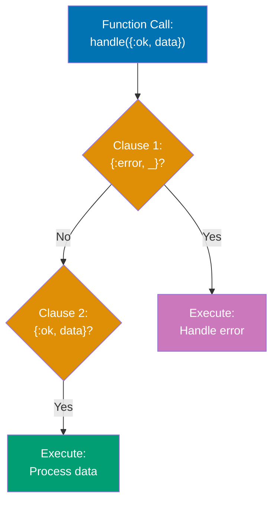
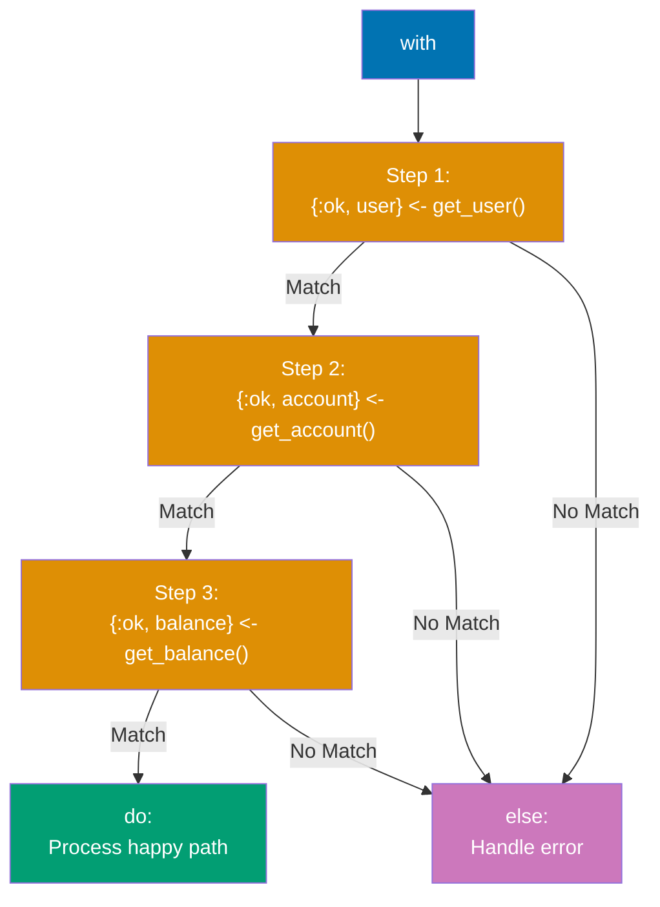
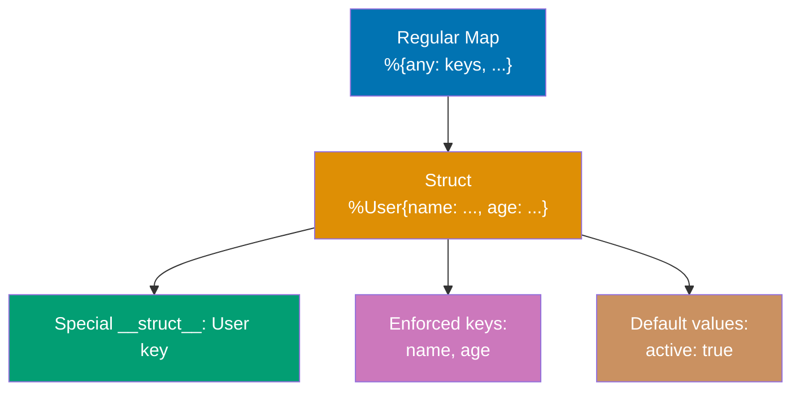
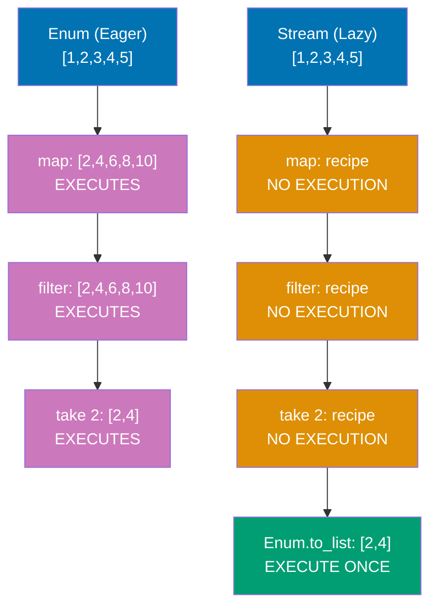
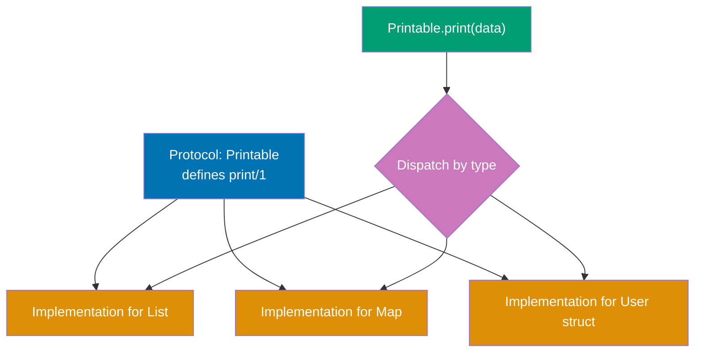
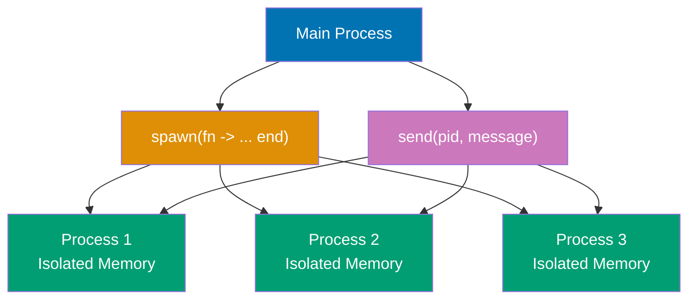
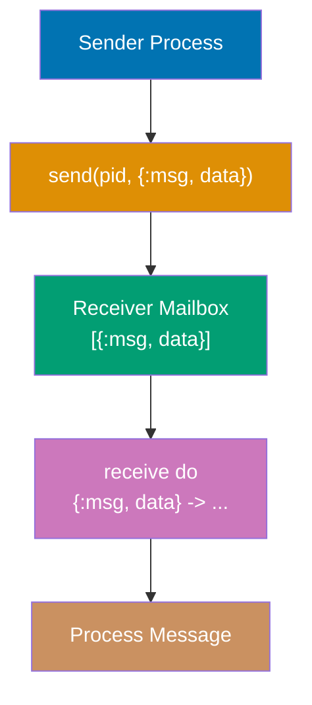
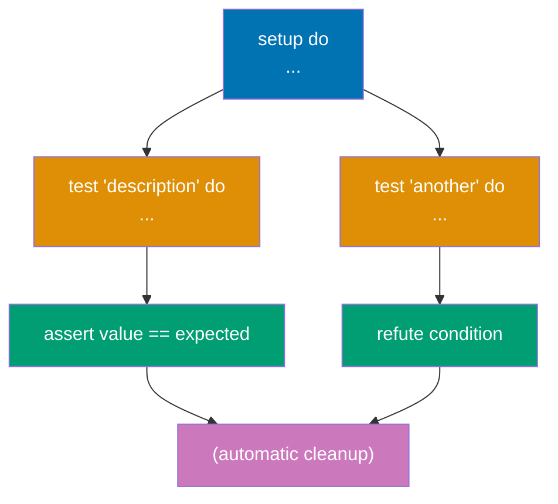
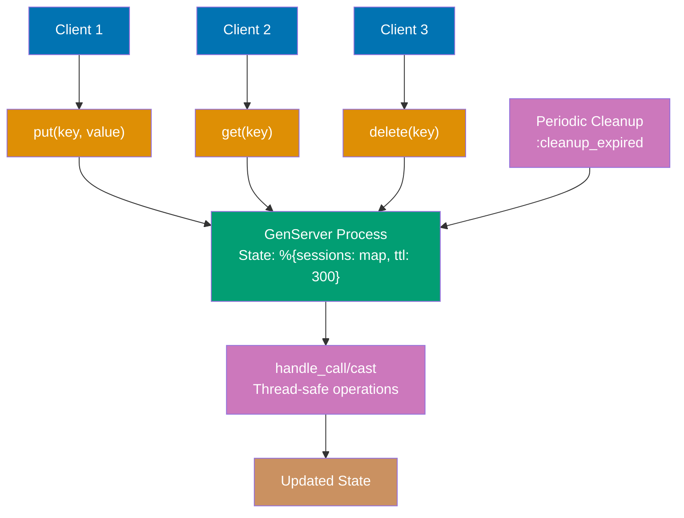

Build on your Elixir foundations with 20 intermediate examples covering advanced patterns, practical OTP usage, error handling, and testing strategies. Each example is self-contained and heavily annotated.

## Group 1: Advanced Pattern Matching

### Example 16: Guards in Depth

Guards are boolean expressions that add additional constraints to pattern matches in function heads, case clauses, and other contexts. They enable more precise pattern matching based on types and values.

**Code**:

```elixir
defmodule Guards do
  # Type guards
  def type_check(value) when is_integer(value), do: "integer: #{value}"
  def type_check(value) when is_float(value), do: "float: #{value}"
  def type_check(value) when is_binary(value), do: "string: #{value}"
  def type_check(value) when is_atom(value), do: "atom: #{inspect(value)}"
  def type_check(_value), do: "unknown type"

  # Value guards
  def category(age) when age < 13, do: "child"
  def category(age) when age >= 13 and age < 20, do: "teen"
  def category(age) when age >= 20 and age < 65, do: "adult"
  def category(age) when age >= 65, do: "senior"

  # Multiple guards with `or`
  def weekday(day) when day == :saturday or day == :sunday, do: "weekend"
  def weekday(_day), do: "weekday"

  # Guard functions (limited set allowed)
  def valid_user(name, age) when is_binary(name) and byte_size(name) > 0 and age >= 18 do
    {:ok, %{name: name, age: age}}
  end
  def valid_user(_name, _age), do: {:error, "invalid user"}

  # Pattern matching with guards
  def process_response({:ok, status, body}) when status >= 200 and status < 300 do
    {:success, body}
  end
  def process_response({:ok, status, _body}) when status >= 400 do
    {:error, "client error: #{status}"}
  end
  def process_response({:error, reason}) do
    {:error, "request failed: #{reason}"}
  end

  # Allowed guard functions:
  # Type checks: is_atom, is_binary, is_boolean, is_float, is_integer, is_list, is_map, is_tuple
  # Comparisons: ==, !=, ===, !==, <, >, <=, >=
  # Boolean: and, or, not
  # Arithmetic: +, -, *, /
  # Others: abs, div, rem, length, byte_size, tuple_size, elem, hd, tl

  # Custom guard-safe functions (rare, using macros)
  defguard is_adult(age) when is_integer(age) and age >= 18

  def can_vote(age) when is_adult(age), do: true
  def can_vote(_age), do: false
end

Guards.type_check(42) # => "integer: 42"
Guards.type_check(3.14) # => "float: 3.14"
Guards.type_check("hello") # => "string: hello"
Guards.type_check(:atom) # => "atom: :atom"

Guards.category(10) # => "child"
Guards.category(15) # => "teen"
Guards.category(30) # => "adult"
Guards.category(70) # => "senior"

Guards.weekday(:saturday) # => "weekend"
Guards.weekday(:monday) # => "weekday"

Guards.valid_user("Alice", 25) # => {:ok, %{age: 25, name: "Alice"}}
Guards.valid_user("", 25) # => {:error, "invalid user"}
Guards.valid_user("Bob", 15) # => {:error, "invalid user"}

Guards.process_response({:ok, 200, "Success"}) # => {:success, "Success"}
Guards.process_response({:ok, 404, "Not Found"}) # => {:error, "client error: 404"}
Guards.process_response({:error, :timeout}) # => {:error, "request failed: timeout"}

Guards.can_vote(25) # => true
Guards.can_vote(16) # => false
```

**Key Takeaway**: Guards add type and value constraints to pattern matching. Only a limited set of functions is allowed in guards to ensure they remain side-effect free and fast.

---

### Example 17: Pattern Matching in Function Heads

Multi-clause functions use pattern matching in function heads to elegantly handle different input shapes. Clauses are tried in order from top to bottom until one matches.



**Code**:

```elixir
defmodule FunctionMatching do
  # Order matters! Specific cases before general cases
  def handle_result({:ok, value}), do: "Success: #{value}"
  def handle_result({:error, reason}), do: "Error: #{reason}"
  def handle_result(_), do: "Unknown result"

  # Pattern matching with destructuring
  def greet({:user, name}), do: "Hello, #{name}!"
  def greet({:admin, name}), do: "Welcome back, Admin #{name}!"
  def greet({:guest}), do: "Welcome, guest!"

  # List pattern matching
  def sum([]), do: 0
  def sum([head | tail]), do: head + sum(tail)

  # Map pattern matching
  def user_summary(%{name: name, age: age}) when age >= 18 do
    "#{name} is an adult (#{age} years old)"
  end
  def user_summary(%{name: name, age: age}) do
    "#{name} is a minor (#{age} years old)"
  end

  # Multiple pattern matches with guards
  def classify_number(n) when n < 0, do: :negative
  def classify_number(0), do: :zero
  def classify_number(n) when n > 0 and n < 100, do: :small_positive
  def classify_number(n) when n >= 100, do: :large_positive

  # Complex nested patterns
  def process_response({:ok, %{status: 200, body: body}}) do
    {:success, body}
  end
  def process_response({:ok, %{status: status, body: _}}) when status >= 400 do
    {:client_error, status}
  end
  def process_response({:error, %{reason: reason}}) do
    {:failed, reason}
  end

  # Default arguments with pattern matching
  def send_message(user, message, opts \\ [])
  def send_message(%{email: email}, message, priority: :high) do
    "Urgent email to #{email}: #{message}"
  end
  def send_message(%{email: email}, message, _opts) do
    "Email to #{email}: #{message}"
  end
end

FunctionMatching.handle_result({:ok, 42}) # => "Success: 42"
FunctionMatching.handle_result({:error, "not found"}) # => "Error: not found"
FunctionMatching.handle_result(:unknown) # => "Unknown result"

FunctionMatching.greet({:user, "Alice"}) # => "Hello, Alice!"
FunctionMatching.greet({:admin, "Bob"}) # => "Welcome back, Admin Bob!"
FunctionMatching.greet({:guest}) # => "Welcome, guest!"

FunctionMatching.sum([1, 2, 3, 4]) # => 10
FunctionMatching.sum([]) # => 0

FunctionMatching.user_summary(%{name: "Alice", age: 25}) # => "Alice is an adult (25 years old)"
FunctionMatching.user_summary(%{name: "Bob", age: 16}) # => "Bob is a minor (16 years old)"

FunctionMatching.classify_number(-5) # => :negative
FunctionMatching.classify_number(0) # => :zero
FunctionMatching.classify_number(50) # => :small_positive
FunctionMatching.classify_number(200) # => :large_positive

FunctionMatching.process_response({:ok, %{status: 200, body: "OK"}}) # => {:success, "OK"}
FunctionMatching.process_response({:ok, %{status: 404, body: "Not Found"}}) # => {:client_error, 404}
FunctionMatching.process_response({:error, %{reason: :timeout}}) # => {:failed, :timeout}

FunctionMatching.send_message(%{email: "a@example.com"}, "Hello", priority: :high)
# => "Urgent email to a@example.com: Hello"
FunctionMatching.send_message(%{email: "b@example.com"}, "Hi", [])
# => "Email to b@example.com: Hi"
```

**Key Takeaway**: Pattern matching in function heads enables elegant multi-clause logic. Place specific patterns before general ones, and combine with guards for precise control flow.

---

### Example 18: With Expression (Happy Path)

The `with` expression chains pattern matches, short-circuiting on the first mismatch. It's ideal for "happy path" coding where you expect success and want to handle errors at the end.



**Code**:

```elixir
defmodule WithExamples do
  # Simulate API functions
  def fetch_user(id) do
    case id do
      1 -> {:ok, %{id: 1, name: "Alice", account_id: 101}}
      2 -> {:ok, %{id: 2, name: "Bob", account_id: 102}}
      _ -> {:error, :user_not_found}
    end
  end

  def fetch_account(account_id) do
    case account_id do
      101 -> {:ok, %{id: 101, balance: 1000}}
      102 -> {:ok, %{id: 102, balance: 500}}
      _ -> {:error, :account_not_found}
    end
  end

  def fetch_transactions(account_id) do
    case account_id do
      101 -> {:ok, [%{amount: 100}, %{amount: -50}]}
      102 -> {:ok, [%{amount: 200}]}
      _ -> {:error, :transactions_not_found}
    end
  end

  # Without `with` - nested case statements (messy)
  def get_user_summary_nested(user_id) do
    case fetch_user(user_id) do
      {:ok, user} ->
        case fetch_account(user.account_id) do
          {:ok, account} ->
            case fetch_transactions(account.id) do
              {:ok, transactions} ->
                {:ok, %{user: user, account: account, transactions: transactions}}
              {:error, reason} ->
                {:error, reason}
            end
          {:error, reason} ->
            {:error, reason}
        end
      {:error, reason} ->
        {:error, reason}
    end
  end

  # With `with` - clean happy path (readable)
  def get_user_summary(user_id) do
    with {:ok, user} <- fetch_user(user_id),             # Step 1
         {:ok, account} <- fetch_account(user.account_id), # Step 2
         {:ok, transactions} <- fetch_transactions(account.id) do # Step 3
      # Happy path - all matches succeeded
      {:ok, %{
        user: user.name,
        balance: account.balance,
        transaction_count: length(transactions)
      }}
    else
      # First mismatch goes here
      {:error, :user_not_found} -> {:error, "User not found"}
      {:error, :account_not_found} -> {:error, "Account not found"}
      {:error, :transactions_not_found} -> {:error, "Transactions not found"}
    end
  end

  # `with` can also match non-error values
  def complex_calculation(x) do
    with {:ok, doubled} <- {:ok, x * 2},        # => {:ok, 10} when x = 5
         {:ok, incremented} <- {:ok, doubled + 1}, # => {:ok, 11}
         {:ok, squared} <- {:ok, incremented * incremented} do # => {:ok, 121}
      {:ok, squared}
    else
      _ -> {:error, "calculation failed"}
    end
  end

  # Guards in `with` (Elixir 1.3+)
  def process_number(x) when is_integer(x) do
    with true <- x > 0,
         true <- x < 100 do
      {:ok, "Valid number: #{x}"}
    else
      false -> {:error, "Number out of range"}
    end
  end
end

WithExamples.get_user_summary(1) # => {:ok, %{balance: 1000, transaction_count: 2, user: "Alice"}}
WithExamples.get_user_summary(2) # => {:ok, %{balance: 500, transaction_count: 1, user: "Bob"}}
WithExamples.get_user_summary(999) # => {:error, "User not found"}

WithExamples.complex_calculation(5) # => {:ok, 121}

WithExamples.process_number(50) # => {:ok, "Valid number: 50"}
WithExamples.process_number(150) # => {:error, "Number out of range"}
WithExamples.process_number(-10) # => {:error, "Number out of range"}
```

**Key Takeaway**: `with` chains pattern matches and short-circuits on the first mismatch. Use it for happy path coding where you expect success, with error handling consolidated in the `else` block.

---

## Group 2: Data Structures Advanced

### Example 19: Structs

Structs are extensions of maps with compile-time guarantees and default values. They enforce a predefined set of keys, enabling clearer data modeling and better error messages.



**Code**:

```elixir
defmodule User do
  # Define struct with default values
  defstruct name: nil, age: nil, email: nil, active: true

  # Struct with enforced keys (must be provided)
  # defstruct [:name, :age, email: nil, active: true]
  # @enforce_keys [:name, :age]
end

defmodule Account do
  @enforce_keys [:id, :balance]
  defstruct [:id, :balance, status: :active, transactions: []]
end

# Create struct
user = %User{name: "Alice", age: 30, email: "alice@example.com"}
# => %User{active: true, age: 30, email: "alice@example.com", name: "Alice"}

# Default values are used
user_partial = %User{name: "Bob", age: 25}
# => %User{active: true, age: 25, email: nil, name: "Bob"}

# Access like maps
user.name # => "Alice"
user.age # => 30
user.active # => true

# Update struct (creates new struct)
updated_user = %{user | age: 31, email: "alice.new@example.com"}
# => %User{active: true, age: 31, email: "alice.new@example.com", name: "Alice"}
user.age # => 30 (unchanged!)

# Update syntax requires existing keys
# %{user | country: "USA"} # => ** (KeyError) key :country not found

# Structs are maps with __struct__ key
user.__struct__ # => User
is_map(user) # => true
Map.keys(user) # => [:__struct__, :active, :age, :email, :name]

# Pattern matching on structs
%User{name: name, age: age} = user
name # => "Alice"
age # => 30

# Struct tag in pattern
def greet_user(%User{name: name}), do: "Hello, #{name}!"
greet_user(user) # => "Hello, Alice!"

# Enforced keys example
account = %Account{id: 1, balance: 1000}
# => %Account{balance: 1000, id: 1, status: :active, transactions: []}

# Missing enforced key causes error
# %Account{id: 1} # => ** (ArgumentError) the following keys must also be given when building struct Account: [:balance]

# Structs vs maps: when to use each
# Structs: domain data with fixed schema (User, Account, Product)
# Maps: dynamic data, API responses, configuration
```

**Key Takeaway**: Structs are tagged maps with enforced keys and default values. They provide compile-time guarantees and clearer domain modeling compared to plain maps.

---

### Example 20: Streams (Lazy Enumeration)

Streams are lazy enumerables that build a recipe for computation without executing it immediately. They enable efficient processing of large or infinite datasets by composing transformations.



**Code**:

```elixir
# Eager evaluation with Enum (processes entire list each time)
numbers = [1, 2, 3, 4, 5, 6, 7, 8, 9, 10]

eager_result = numbers
               |> Enum.map(fn x -> x * 2 end)       # => [2, 4, 6, ..., 20] (processes all)
               |> Enum.filter(fn x -> rem(x, 4) == 0 end) # => [4, 8, 12, 16, 20] (processes all)
               |> Enum.take(2)                      # => [4, 8] (already computed all)

# Lazy evaluation with Stream (builds recipe, executes once at the end)
lazy_result = numbers
              |> Stream.map(fn x -> x * 2 end)       # => #Stream<...> (no execution)
              |> Stream.filter(fn x -> rem(x, 4) == 0 end) # => #Stream<...> (no execution)
              |> Enum.take(2)                        # => [4, 8] (executes pipeline once)

# Infinite streams
infinite_numbers = Stream.iterate(1, fn x -> x + 1 end) # => 1, 2, 3, 4, ...

# Take first 10 even numbers from infinite stream
first_evens = infinite_numbers
              |> Stream.filter(fn x -> rem(x, 2) == 0 end)
              |> Enum.take(10)
# => [2, 4, 6, 8, 10, 12, 14, 16, 18, 20]

# Stream.cycle - repeats list infinitely
Stream.cycle([1, 2, 3]) |> Enum.take(7) # => [1, 2, 3, 1, 2, 3, 1]

# Stream.unfold - generate stream from function
fibonacci = Stream.unfold({0, 1}, fn {a, b} -> {a, {b, a + b}} end)
Enum.take(fibonacci, 10) # => [0, 1, 1, 2, 3, 5, 8, 13, 21, 34]

# File streaming (lazy, memory efficient)
# Stream.map(File.stream!("large_file.txt"), &String.upcase/1)
# |> Enum.into(File.stream!("output.txt"))
# Processes line by line without loading entire file into memory

# Performance comparison for large datasets
defmodule Performance do
  def eager_pipeline(n) do
    1..n
    |> Enum.map(fn x -> x * 2 end)
    |> Enum.filter(fn x -> rem(x, 3) == 0 end)
    |> Enum.take(100)
  end

  def lazy_pipeline(n) do
    1..n
    |> Stream.map(fn x -> x * 2 end)
    |> Stream.filter(fn x -> rem(x, 3) == 0 end)
    |> Enum.take(100)
  end
end

# Eager processes all 1_000_000 numbers at each step
# Performance.eager_pipeline(1_000_000)

# Lazy only processes until 100 results found (much faster!)
# Performance.lazy_pipeline(1_000_000)

# Stream.resource for resource management (files, sockets)
stream_resource = Stream.resource(
  fn -> {:ok, "initial state"} end,        # Start function
  fn state -> {[state], "next state"} end, # Next function
  fn _state -> :ok end                     # After function (cleanup)
)
Enum.take(stream_resource, 3) # => ["initial state", "next state", "next state"]
```

**Key Takeaway**: Streams enable lazy evaluation—building a recipe without executing it. Use streams for large datasets, infinite sequences, or when you want to compose transformations efficiently.

---

### Example 21: MapSet for Uniqueness

MapSets are unordered collections of unique values. They provide efficient membership testing and set operations (union, intersection, difference). Use them when uniqueness matters and order doesn't.

**Code**:

```elixir
# Create MapSet
set1 = MapSet.new([1, 2, 3, 3, 4, 4, 5]) # => #MapSet<[1, 2, 3, 4, 5]> (duplicates removed)

# From range
set_range = MapSet.new(1..10) # => #MapSet<[1, 2, 3, 4, 5, 6, 7, 8, 9, 10]>

# Add element
set2 = MapSet.put(set1, 6) # => #MapSet<[1, 2, 3, 4, 5, 6]>
set1 # => #MapSet<[1, 2, 3, 4, 5]> (unchanged!)

# Adding duplicate has no effect
set3 = MapSet.put(set1, 3) # => #MapSet<[1, 2, 3, 4, 5]> (3 already exists)

# Delete element
set4 = MapSet.delete(set1, 3) # => #MapSet<[1, 2, 4, 5]>

# Membership test - O(log n) fast!
MapSet.member?(set1, 3) # => true
MapSet.member?(set1, 10) # => false

# Size
MapSet.size(set1) # => 5

# Union (all elements from both sets)
setA = MapSet.new([1, 2, 3])
setB = MapSet.new([3, 4, 5])
MapSet.union(setA, setB) # => #MapSet<[1, 2, 3, 4, 5]>

# Intersection (common elements)
MapSet.intersection(setA, setB) # => #MapSet<[3]>

# Difference (elements in A but not in B)
MapSet.difference(setA, setB) # => #MapSet<[1, 2]>
MapSet.difference(setB, setA) # => #MapSet<[4, 5]>

# Subset and superset checks
setX = MapSet.new([1, 2])
setY = MapSet.new([1, 2, 3, 4])
MapSet.subset?(setX, setY) # => true (X is subset of Y)
MapSet.subset?(setY, setX) # => false
MapSet.disjoint?(setA, MapSet.new([6, 7])) # => true (no common elements)

# Convert to list
MapSet.to_list(set1) # => [1, 2, 3, 4, 5] (order not guaranteed)

# Practical example: unique tags
posts = [
  %{id: 1, tags: ["elixir", "functional", "programming"]},
  %{id: 2, tags: ["elixir", "otp", "concurrency"]},
  %{id: 3, tags: ["functional", "fp", "programming"]}
]

# Get all unique tags
all_tags = posts
           |> Enum.flat_map(fn post -> post.tags end)
           |> MapSet.new()
# => #MapSet<["concurrency", "elixir", "fp", "functional", "otp", "programming"]>

# Find posts with common tags
post1_tags = MapSet.new(["elixir", "functional"])
post2_tags = MapSet.new(["elixir", "otp"])
MapSet.intersection(post1_tags, post2_tags) # => #MapSet<["elixir"]>
```

**Key Takeaway**: MapSets provide O(log n) membership testing and automatic deduplication. Use them for unique collections where order doesn't matter and set operations (union, intersection, difference) are needed.

---

## Group 3: Module Organization

### Example 22: Module Attributes

Module attributes are compile-time constants defined with `@`. They're commonly used for documentation (`@moduledoc`, `@doc`), compile-time configuration, and storing values computed during compilation.

**Code**:

```elixir
defmodule MyModule do
  # Module documentation
  @moduledoc """
  This module demonstrates module attributes.
  Module attributes are compile-time constants.
  """

  # Compile-time constant
  @default_timeout 5000
  @version "1.0.0"
  @max_retries 3

  # Function documentation
  @doc """
  Waits for a specified timeout or default.
  Returns :ok after waiting.
  """
  def wait(timeout \\ @default_timeout) do
    :timer.sleep(timeout)
    :ok
  end

  @doc """
  Gets the module version.
  """
  def version, do: @version

  # Computed at compile time
  @languages ["Elixir", "Erlang", "LFE"]
  @language_count length(@languages) # Computed once during compilation

  def supported_languages, do: @languages
  def language_count, do: @language_count

  # Module registration (common in OTP)
  @behaviour :gen_server  # Implements gen_server behaviour (covered in advanced)

  # Accumulating values
  @colors [:red, :blue]
  @colors [:green | @colors]  # Prepend to list
  @colors [:yellow | @colors]

  def colors, do: @colors # => [:yellow, :green, :red, :blue]

  # Attributes reset per function
  @important true
  def func1, do: @important # => true

  @important false
  def func2, do: @important # => false

  # Custom attributes for metadata
  @deprecated_message "Use new_function/1 instead"

  @doc @deprecated_message
  def old_function, do: :deprecated

  # Reserved attributes (special meaning):
  # @moduledoc - module documentation
  # @doc - function documentation
  # @behaviour - implements behaviour
  # @impl - marks function as callback implementation
  # @deprecated - marks function as deprecated
  # @spec - type specification
  # @type - defines type
  # @opaque - defines opaque type
end

MyModule.wait(1000) # Waits 1 second, returns :ok
MyModule.version() # => "1.0.0"
MyModule.supported_languages() # => ["Elixir", "Erlang", "LFE"]
MyModule.language_count() # => 3
MyModule.colors() # => [:yellow, :green, :red, :blue]

# Access module documentation in IEx
# h MyModule  # Shows @moduledoc
# h MyModule.wait  # Shows @doc for wait/1
```

**Key Takeaway**: Module attributes (`@name`) are compile-time constants useful for documentation, configuration, and computed values. They're evaluated during compilation, not runtime.

---

### Example 23: Import, Alias, Require

`import`, `alias`, and `require` control how modules are referenced in your code. They reduce verbosity and manage namespaces cleanly.

**Code**:

```elixir
defmodule ImportAliasRequire do
  # alias - shortens module names
  alias MyApp.Accounts.User        # Now use User instead of MyApp.Accounts.User
  alias MyApp.Accounts.Admin, as: A # Custom name: A instead of Admin

  def create_user(name) do
    %User{name: name}  # Instead of %MyApp.Accounts.User{...}
  end

  def create_admin(name) do
    %A{name: name}  # Custom alias
  end

  # import - brings functions into scope (no module prefix needed)
  import Enum, only: [map: 2, filter: 2]  # Only import specific functions

  def process_numbers(list) do
    list
    |> map(fn x -> x * 2 end)     # Instead of Enum.map
    |> filter(fn x -> x > 10 end)  # Instead of Enum.filter
  end

  # import with except
  import String, except: [split: 1]  # Import all String functions except split/1

  def upcase_string(str) do
    upcase(str)  # Instead of String.upcase(str)
  end

  # require - needed for macros
  require Logger

  def log_something do
    Logger.info("This is a log message")  # Logger.info is a macro, not a function
  end

  # Multiple aliases at once (Elixir 1.2+)
  alias MyApp.{Accounts, Billing, Reports}

  def get_account_report do
    account = Accounts.get()
    billing = Billing.get()
    Reports.generate(account, billing)
  end
end

# Example module structure
defmodule MyApp.Accounts.User do
  defstruct name: nil, email: nil
end

defmodule MyApp.Accounts.Admin do
  defstruct name: nil, role: :admin
end

# Scope of import/alias/require
defmodule ScopingExample do
  def func1 do
    import Enum  # Only available in func1
    map([1, 2, 3], fn x -> x * 2 end)
  end

  def func2 do
    # map([1, 2, 3], fn x -> x * 2 end)  # Error! import not in scope
    Enum.map([1, 2, 3], fn x -> x * 2 end)  # Must use full name
  end

  # Module-level import (available in all functions)
  import String

  def func3, do: upcase("hello")
  def func4, do: downcase("WORLD")
end

# Best practices:
# - alias for shortening module names
# - import sparingly (only commonly used functions) to avoid namespace pollution
# - require for macros (Logger, ExUnit, custom macros)
# - Use `only:` or `except:` with import to be explicit
```

**Key Takeaway**: Use `alias` to shorten module names, `import` to bring functions into scope (sparingly!), and `require` for macros. These directives manage namespaces and reduce verbosity.

---

### Example 24: Protocols (Polymorphism)

Protocols enable polymorphism—defining a function that works differently for different data types. They're Elixir's mechanism for ad-hoc polymorphism, similar to interfaces in other languages.



**Code**:

```elixir
# Define protocol
defprotocol Printable do
  @doc "Converts data to a printable string"
  def print(data)
end

# Implement for different types
defimpl Printable, for: Integer do
  def print(int), do: "Number: #{int}"
end

defimpl Printable, for: List do
  def print(list), do: "List with #{length(list)} items: #{inspect(list)}"
end

defimpl Printable, for: Map do
  def print(map), do: "Map with #{map_size(map)} keys"
end

# Use protocol
Printable.print(42) # => "Number: 42"
Printable.print([1, 2, 3]) # => "List with 3 items: [1, 2, 3]"
Printable.print(%{a: 1, b: 2}) # => "Map with 2 keys"

# Protocol for custom struct
defmodule User do
  defstruct name: nil, age: nil
end

defimpl Printable, for: User do
  def print(user), do: "User: #{user.name}, age #{user.age}"
end

user = %User{name: "Alice", age: 30}
Printable.print(user) # => "User: Alice, age 30"

# Built-in protocols
# String.Chars - implements to_string/1
defimpl String.Chars, for: User do
  def to_string(user), do: user.name
end

to_string(user) # => "Alice"
"Hello, #{user}" # => "Hello, Alice" (uses String.Chars protocol)

# Enumerable - enables Enum functions
defmodule Range do
  defstruct first: nil, last: nil
end

defimpl Enumerable, for: Range do
  def count(range), do: {:ok, range.last - range.first + 1}
  def member?(range, value), do: {:ok, value >= range.first and value <= range.last}
  def reduce(range, acc, fun) do
    Enum.reduce(range.first..range.last, acc, fun)
  end
  def slice(_range), do: {:error, __MODULE__}
end

my_range = %Range{first: 1, last: 5}
Enum.count(my_range) # => 5
Enum.member?(my_range, 3) # => true
Enum.map(my_range, fn x -> x * 2 end) # => [2, 4, 6, 8, 10]

# Protocol fallback (for types without implementation)
defprotocol Describable do
  @fallback_to_any true
  def describe(data)
end

defimpl Describable, for: Any do
  def describe(_data), do: "No description available"
end

defimpl Describable, for: Integer do
  def describe(int), do: "The number #{int}"
end

Describable.describe(42) # => "The number 42"
Describable.describe("hello") # => "No description available" (fallback)
Describable.describe([1, 2, 3]) # => "No description available" (fallback)
```

**Key Takeaway**: Protocols enable polymorphic functions that dispatch based on data type. Implement protocols for your custom types to integrate with Elixir's built-in functions (`to_string`, `Enum.*`, etc.).

---

## Group 4: Error Handling

### Example 25: Result Tuples (:ok/:error)

Elixir idiomatically uses tagged tuples `{:ok, value}` or `{:error, reason}` to represent success and failure. This explicit error handling is preferred over exceptions for expected error cases.

**Code**:

```elixir
defmodule ResultTuples do
  # Function that can succeed or fail
  def divide(a, b) when b != 0, do: {:ok, a / b}
  def divide(_a, 0), do: {:error, :division_by_zero}

  # Parse integer from string
  def parse_int(string) do
    case Integer.parse(string) do
      {int, ""} -> {:ok, int}
      {_int, _rest} -> {:error, :partial_parse}
      :error -> {:error, :invalid_integer}
    end
  end

  # Fetch user from database (simulated)
  def fetch_user(id) when id > 0 and id < 100 do
    {:ok, %{id: id, name: "User #{id}"}}
  end
  def fetch_user(_id), do: {:error, :user_not_found}

  # Chain operations with pattern matching
  def get_user_name(id) do
    case fetch_user(id) do
      {:ok, user} -> {:ok, user.name}
      {:error, reason} -> {:error, reason}
    end
  end

  # Chain with `with`
  def calculate(a_str, b_str) do
    with {:ok, a} <- parse_int(a_str),
         {:ok, b} <- parse_int(b_str),
         {:ok, result} <- divide(a, b) do
      {:ok, result}
    else
      {:error, reason} -> {:error, reason}
    end
  end
end

# Success cases
ResultTuples.divide(10, 2) # => {:ok, 5.0}
ResultTuples.parse_int("42") # => {:ok, 42}
ResultTuples.fetch_user(1) # => {:ok, %{id: 1, name: "User 1"}}

# Error cases
ResultTuples.divide(10, 0) # => {:error, :division_by_zero}
ResultTuples.parse_int("abc") # => {:error, :invalid_integer}
ResultTuples.fetch_user(999) # => {:error, :user_not_found}

# Chained operations
ResultTuples.get_user_name(1) # => {:ok, "User 1"}
ResultTuples.get_user_name(999) # => {:error, :user_not_found}

ResultTuples.calculate("10", "2") # => {:ok, 5.0}
ResultTuples.calculate("10", "0") # => {:error, :division_by_zero}
ResultTuples.calculate("abc", "2") # => {:error, :invalid_integer}

# Pattern matching to handle results
case ResultTuples.divide(10, 2) do
  {:ok, result} -> IO.puts("Result: #{result}")
  {:error, :division_by_zero} -> IO.puts("Cannot divide by zero")
end

# Unwrap with confidence (when you know it will succeed)
{:ok, value} = ResultTuples.divide(10, 2)
value # => 5.0

# Common pattern: functions ending with !
defmodule Bang do
  def divide!(a, b) do
    case ResultTuples.divide(a, b) do
      {:ok, result} -> result
      {:error, reason} -> raise "Division failed: #{reason}"
    end
  end
end

Bang.divide!(10, 2) # => 5.0
# Bang.divide!(10, 0) # => ** (RuntimeError) Division failed: division_by_zero
```

**Key Takeaway**: Use tagged tuples `{:ok, value}` and `{:error, reason}` for expected error cases. Functions ending with `!` unwrap results or raise exceptions. Pattern match to handle both success and failure cases.

---

### Example 26: Try/Rescue/After

`try/rescue/after` handles exceptions. Use `rescue` to catch exceptions, `after` for cleanup code that always runs (like `finally` in other languages). Prefer result tuples for expected errors.

**Code**:

```elixir
defmodule TryRescue do
  # Basic try/rescue
  def safe_divide(a, b) do
    try do
      a / b
    rescue
      ArithmeticError -> {:error, :division_by_zero}
    end
  end

  # Multiple rescue clauses
  def parse_and_double(str) do
    try do
      str
      |> String.to_integer()
      |> Kernel.*(2)
    rescue
      ArgumentError -> {:error, :invalid_integer}
      err in RuntimeError -> {:error, {:runtime_error, err.message}}
    end
  end

  # try/after for cleanup
  def read_file(path) do
    {:ok, file} = File.open(path, [:read])
    try do
      IO.read(file, :all)
    after
      File.close(file)  # Always runs, even if error occurs
    end
  end

  # try/rescue/after all together
  def complex_operation do
    try do
      # Risky operation
      result = 10 / 0
      {:ok, result}
    rescue
      ArithmeticError -> {:error, :arithmetic_error}
      _ -> {:error, :unknown_error}
    after
      IO.puts("Cleanup happens here")  # Always runs
    end
  end

  # Catch specific exception type
  def handle_specific_error do
    try do
      raise ArgumentError, message: "Invalid argument"
    rescue
      e in ArgumentError -> "Caught: #{e.message}"
    end
  end

  # Re-raise exception
  def logged_operation do
    try do
      raise "Something went wrong"
    rescue
      e ->
        Logger.error("Error occurred: #{inspect(e)}")
        reraise e, __STACKTRACE__  # Re-raise the exception
    end
  end
end

TryRescue.safe_divide(10, 2) # => 5.0
TryRescue.safe_divide(10, 0) # => {:error, :division_by_zero}

TryRescue.parse_and_double("5") # => 10
TryRescue.parse_and_double("abc") # => {:error, :invalid_integer}

TryRescue.complex_operation()  # Prints "Cleanup happens here", returns {:error, :arithmetic_error}

TryRescue.handle_specific_error() # => "Caught: Invalid argument"

# When to use try/rescue:
# 1. Interacting with code that raises (libraries, Erlang functions)
# 2. Cleanup with `after` (files, connections, locks)
# 3. Converting exceptions to result tuples

# When NOT to use:
# 1. Expected error cases (use result tuples instead)
# 2. Control flow (don't use exceptions for normal logic)

# Example: wrapping library that raises
defmodule HTTPClient do
  def get(url) do
    try do
      # Imagine this is a library call that raises on failure
      {:ok, "Response from #{url}"}
    rescue
      HTTPError -> {:error, :http_error}
      TimeoutError -> {:error, :timeout}
    end
  end
end
```

**Key Takeaway**: Use `try/rescue/after` to handle exceptions from external libraries or for cleanup. Prefer result tuples for expected errors. The `after` block always runs, making it ideal for resource cleanup.

---

### Example 27: Raise and Custom Exceptions

Use `raise` to throw exceptions. Define custom exception modules for domain-specific errors. Exceptions should be for unexpected situations, not control flow.

**Code**:

```elixir
# Raise with message
# raise "Something went wrong"  # => ** (RuntimeError) Something went wrong

# Raise specific exception type
# raise ArgumentError, message: "Invalid input"  # => ** (ArgumentError) Invalid input

# Define custom exception
defmodule MyApp.ValidationError do
  defexception message: "Validation failed", field: nil

  @impl true
  def message(exception) do
    "Validation failed for field: #{exception.field}"
  end
end

defmodule MyApp.NotFoundError do
  defexception [:resource, :id]

  @impl true
  def message(exception) do
    "#{exception.resource} with id #{exception.id} not found"
  end
end

# Raise custom exception
# raise MyApp.ValidationError, field: :email
# => ** (MyApp.ValidationError) Validation failed for field: email

# raise MyApp.NotFoundError, resource: "User", id: 123
# => ** (MyApp.NotFoundError) User with id 123 not found

defmodule UserValidator do
  def validate_age!(age) when is_integer(age) and age >= 0 and age < 150, do: :ok
  def validate_age!(age) when is_integer(age) do
    raise MyApp.ValidationError, field: :age, message: "Age must be between 0 and 150, got: #{age}"
  end
  def validate_age!(_age) do
    raise MyApp.ValidationError, field: :age, message: "Age must be an integer"
  end

  def validate_email!(email) when is_binary(email) do
    if String.contains?(email, "@") do
      :ok
    else
      raise MyApp.ValidationError, field: :email, message: "Email must contain @"
    end
  end
  def validate_email!(_email) do
    raise MyApp.ValidationError, field: :email, message: "Email must be a string"
  end
end

UserValidator.validate_age!(30) # => :ok
# UserValidator.validate_age!(200) # => ** (MyApp.ValidationError) Age must be between 0 and 150, got: 200
# UserValidator.validate_age!("thirty") # => ** (MyApp.ValidationError) Age must be an integer

UserValidator.validate_email!("alice@example.com") # => :ok
# UserValidator.validate_email!("invalid") # => ** (MyApp.ValidationError) Email must contain @

# Pattern: bang (!) functions raise, non-bang return tuples
defmodule UserRepo do
  def fetch(id) when id > 0 and id < 100 do
    {:ok, %{id: id, name: "User #{id}"}}
  end
  def fetch(_id), do: {:error, :not_found}

  def fetch!(id) do
    case fetch(id) do
      {:ok, user} -> user
      {:error, :not_found} -> raise MyApp.NotFoundError, resource: "User", id: id
    end
  end
end

UserRepo.fetch(1) # => {:ok, %{id: 1, name: "User 1"}}
UserRepo.fetch(999) # => {:error, :not_found}

UserRepo.fetch!(1) # => %{id: 1, name: "User 1"}
# UserRepo.fetch!(999) # => ** (MyApp.NotFoundError) User with id 999 not found

# When to raise exceptions:
# 1. Programmer errors (wrong function usage)
# 2. Assertion failures in tests
# 3. Unrecoverable errors (configuration missing)

# When NOT to raise:
# 1. Expected error cases (use result tuples)
# 2. Control flow
# 3. Validation errors in user input (return {:error, reason})
```

**Key Takeaway**: Raise exceptions for unexpected, unrecoverable errors. Define custom exceptions for domain-specific errors. Use the `!` convention: functions ending with `!` raise exceptions, non-bang versions return result tuples.

---

## Group 5: Processes and Concurrency

### Example 28: Spawning Processes

Processes are Elixir's lightweight concurrency primitive. Each process has its own memory and communicates via message passing. Use `spawn/1` or `spawn_link/1` to create processes.



**Code**:

```elixir
# Spawn a process
pid = spawn(fn -> IO.puts("Hello from spawned process!") end)
# Prints: Hello from spawned process!
# => #PID<0.123.0>

# Process executes and terminates immediately
Process.alive?(pid) # => false (usually, it runs so fast)

# Spawn process that runs longer
long_process = spawn(fn ->
  :timer.sleep(1000)
  IO.puts("Finished after 1 second")
end)
Process.alive?(long_process) # => true (for about 1 second)
:timer.sleep(1500)
Process.alive?(long_process) # => false

# Get current process PID
self() # => #PID<0.100.0> (varies)

# Spawn multiple processes
pids = Enum.map(1..5, fn i ->
  spawn(fn -> IO.puts("Process #{i}") end)
end)
# Prints (order not guaranteed):
# Process 1
# Process 3
# Process 2
# Process 5
# Process 4

# spawn/3 with module, function, arguments
defmodule Worker do
  def work(n) do
    IO.puts("Working on task #{n}")
    :timer.sleep(100)
    IO.puts("Task #{n} done!")
  end
end

spawn(Worker, :work, [1])  # Same as spawn(fn -> Worker.work(1) end)

# spawn_link - linked processes (if one crashes, parent is notified)
parent_pid = self()
child = spawn_link(fn ->
  :timer.sleep(500)
  raise "Child process crashed!"
end)
# After 500ms, parent receives exit signal
# (without trapping exits, parent would crash too)

# Process info
pid = spawn(fn -> :timer.sleep(5000) end)
Process.info(pid) # => [{:registered_name, []}, {:current_function, ...}, ...]
Process.info(pid, :status) # => {:status, :waiting}

# Lightweight processes - millions possible!
Enum.each(1..10_000, fn _ ->
  spawn(fn -> :timer.sleep(10_000) end)
end)
# Creates 10,000 processes, minimal memory usage!

# Process isolation - no shared memory
defmodule Isolation do
  def demonstrate do
    list = [1, 2, 3]
    spawn(fn ->
      # Each process has its own copy
      modified_list = [0 | list]
      IO.inspect(modified_list, label: "Child process")
    end)
    :timer.sleep(100)
    IO.inspect(list, label: "Parent process")
  end
end

Isolation.demonstrate()
# Child process: [0, 1, 2, 3]
# Parent process: [1, 2, 3]
```

**Key Takeaway**: Processes are lightweight, isolated, and communicate via messages. Use `spawn/1` for independent processes, `spawn_link/1` for linked processes. Elixir can run millions of processes concurrently.

---

### Example 29: Send and Receive

Processes communicate by sending and receiving messages. Messages go into a process mailbox and are processed with `receive`. This is asynchronous message passing—the sender doesn't block.



**Code**:

```elixir
# Basic send and receive
receiver = spawn(fn ->
  receive do
    {:hello, sender} -> send(sender, {:hi, self()})
    {:goodbye, sender} -> send(sender, {:bye, self()})
  end
end)

send(receiver, {:hello, self()})  # Send message to receiver

receive do
  {:hi, pid} -> IO.puts("Received hi from #{inspect(pid)}")
end
# Prints: Received hi from #PID<...>

# Receive with timeout
spawn(fn ->
  receive do
    :message -> IO.puts("Got message")
  after
    1000 -> IO.puts("No message received after 1 second")
  end
end)
# After 1 second, prints: No message received after 1 second

# Selective receive - pattern matching on messages
receiver = spawn(fn ->
  receive do
    {:add, a, b} -> IO.puts("Sum: #{a + b}")
    {:multiply, a, b} -> IO.puts("Product: #{a * b}")
    unknown -> IO.puts("Unknown message: #{inspect(unknown)}")
  end
end)

send(receiver, {:add, 5, 3})  # Prints: Sum: 8

# Receive loop - process multiple messages
defmodule Echo do
  def loop do
    receive do
      {:echo, msg, sender} ->
        send(sender, {:reply, msg})
        loop()  # Recursive call to continue receiving
      :stop -> :ok  # Stop receiving
    end
  end
end

echo_pid = spawn(&Echo.loop/0)
send(echo_pid, {:echo, "Hello", self()})

receive do
  {:reply, msg} -> IO.puts("Echo replied: #{msg}")
end
# Prints: Echo replied: Hello

send(echo_pid, {:echo, "World", self()})
receive do
  {:reply, msg} -> IO.puts("Echo replied: #{msg}")
end
# Prints: Echo replied: World

send(echo_pid, :stop)  # Stop the echo process

# Process mailbox ordering - FIFO (first in, first out)
pid = self()
send(pid, :first)
send(pid, :second)
send(pid, :third)

receive do: (:first -> IO.puts("1"))  # Prints: 1
receive do: (:second -> IO.puts("2"))  # Prints: 2
receive do: (:third -> IO.puts("3"))  # Prints: 3

# Flush mailbox (useful in IEx)
send(self(), :msg1)
send(self(), :msg2)
flush()  # Prints all messages and removes them from mailbox

# Message passing is asynchronous
pid = spawn(fn ->
  :timer.sleep(2000)  # Simulate slow processing
  receive do
    msg -> IO.puts("Received: #{inspect(msg)}")
  end
end)

send(pid, :hello)  # Returns immediately, doesn't wait for processing
IO.puts("Sent message, continuing...")
# Prints: Sent message, continuing...
# (2 seconds later) Prints: Received: :hello

# Messages can be any Elixir term
send(self(), {:tuple, 1, 2})
send(self(), [1, 2, 3])
send(self(), %{key: "value"})
send(self(), "string")
send(self(), 42)
flush()  # Prints all messages
```

**Key Takeaway**: Processes communicate via asynchronous message passing. `send/2` puts messages in the mailbox, `receive` pattern matches and processes them. Messages are queued in FIFO order.

---

### Example 30: Process Monitoring

Process monitoring allows you to detect when other processes crash or exit. Use `Process.monitor/1` to watch a process and receive a message when it exits.

**Code**:

```elixir
# Spawn a process that will crash
pid = spawn(fn ->
  :timer.sleep(1000)
  raise "Process crashed!"
end)

# Monitor the process
ref = Process.monitor(pid)
# => #Reference<0.1234.5678.9>

# Receive the DOWN message when process exits
receive do
  {:DOWN, ^ref, :process, ^pid, reason} ->
    IO.puts("Process #{inspect(pid)} exited with reason: #{inspect(reason)}")
after
  2000 -> IO.puts("No exit message received")
end
# Prints: Process #PID<...> exited with reason: {%RuntimeError{message: "Process crashed!"}, [...]}

# Monitor normal exit
pid = spawn(fn ->
  :timer.sleep(500)
  :ok  # Normal exit
end)

ref = Process.monitor(pid)

receive do
  {:DOWN, ^ref, :process, ^pid, reason} ->
    IO.puts("Process exited normally with reason: #{inspect(reason)}")
after
  1000 -> IO.puts("No exit")
end
# Prints: Process exited normally with reason: :normal

# Demonitor - stop monitoring
pid = spawn(fn -> :timer.sleep(10_000) end)
ref = Process.monitor(pid)
Process.demonitor(ref)  # Stop monitoring
Process.exit(pid, :kill)  # Kill the process
# No DOWN message received because we demonitored

# Monitor multiple processes
pids = Enum.map(1..5, fn i ->
  spawn(fn ->
    :timer.sleep(i * 100)
    IO.puts("Process #{i} done")
  end)
end)

refs = Enum.map(pids, &Process.monitor/1)

# Wait for all to exit
Enum.each(refs, fn ref ->
  receive do
    {:DOWN, ^ref, :process, _pid, :normal} -> :ok
  end
end)
IO.puts("All processes finished")

# Monitor vs. link
# Link: bidirectional, crashes propagate (use for supervision)
# Monitor: unidirectional, sends message on exit (use for notification)

# Example: timeout pattern with monitor
defmodule TimeoutHelper do
  def call_with_timeout(fun, timeout) do
    parent = self()
    pid = spawn(fn ->
      result = fun.()
      send(parent, {:result, self(), result})
    end)
    ref = Process.monitor(pid)

    receive do
      {:result, ^pid, result} ->
        Process.demonitor(ref, [:flush])
        {:ok, result}
      {:DOWN, ^ref, :process, ^pid, reason} ->
        {:error, {:process_died, reason}}
    after
      timeout ->
        Process.exit(pid, :kill)
        Process.demonitor(ref, [:flush])
        {:error, :timeout}
    end
  end
end

TimeoutHelper.call_with_timeout(fn -> :timer.sleep(500); 42 end, 1000)  # => {:ok, 42}
TimeoutHelper.call_with_timeout(fn -> :timer.sleep(2000); 42 end, 1000)  # => {:error, :timeout}
```

**Key Takeaway**: Use `Process.monitor/1` to watch processes and receive `:DOWN` messages when they exit. Monitoring is unidirectional (unlike linking) and ideal for detecting process failures without crashing.

---

### Example 31: Task Module (Async/Await)

The `Task` module provides a simple abstraction for spawning processes and awaiting results. It's built on processes but handles boilerplate for async/await patterns.

**Code**:

```elixir
# Async/await pattern
task = Task.async(fn ->
  :timer.sleep(1000)
  42
end)

# Do other work while task runs
IO.puts("Task started, doing other work...")

# Wait for task to complete (default timeout: 5000ms)
result = Task.await(task)  # => 42
IO.puts("Task result: #{result}")

# Multiple async tasks in parallel
tasks = Enum.map(1..5, fn i ->
  Task.async(fn ->
    :timer.sleep(i * 200)
    i * i
  end)
end)

# Await all tasks
results = Enum.map(tasks, &Task.await/1)  # => [1, 4, 9, 16, 25]
IO.inspect(results)

# Timeout handling
task = Task.async(fn ->
  :timer.sleep(10_000)
  :done
end)

try do
  Task.await(task, 1000)  # Timeout after 1 second
rescue
  e in Task.TimeoutError ->
    IO.puts("Task timed out: #{inspect(e)}")
end

# Task.yield - check without blocking
task = Task.async(fn ->
  :timer.sleep(2000)
  :result
end)

case Task.yield(task, 500) do
  {:ok, result} -> IO.puts("Got result: #{result}")
  nil -> IO.puts("Task still running after 500ms")
end
# Prints: Task still running after 500ms

# Wait another 2 seconds
case Task.yield(task, 2000) do
  {:ok, result} -> IO.puts("Got result: #{result}")
  nil -> IO.puts("Still running")
end
# Prints: Got result: :result

# Task.start - fire and forget (no await)
Task.start(fn ->
  :timer.sleep(1000)
  IO.puts("Background task completed")
end)
IO.puts("Main process continues immediately")
# Prints: Main process continues immediately
# (1 second later) Prints: Background task completed

# Task.async_stream - process enumerable in parallel
results = 1..10
          |> Task.async_stream(fn i ->
            :timer.sleep(100)
            i * i
          end, max_concurrency: 4)
          |> Enum.to_list()
# => [ok: 1, ok: 4, ok: 9, ok: 16, ok: 25, ok: 36, ok: 49, ok: 64, ok: 81, ok: 100]
# Processes 4 items at a time in parallel

# Error handling with tasks
task = Task.async(fn ->
  raise "Task error!"
end)

try do
  Task.await(task)
rescue
  e -> IO.puts("Caught error: #{inspect(e)}")
end
# Prints: Caught error: %RuntimeError{message: "Task error!"}

# Supervised tasks (covered more in Advanced)
{:ok, result} = Task.Supervisor.start_link()
# Start tasks under supervision for fault tolerance
```

**Key Takeaway**: `Task` provides async/await abstraction over processes. Use `Task.async/1` and `Task.await/1` for parallel work with results. Use `Task.async_stream/3` for processing collections in parallel.

---

## Group 6: Testing and Tools

### Example 32: ExUnit Basics

ExUnit is Elixir's built-in testing framework. Tests are organized into test modules, and assertions verify expected behavior. Running `mix test` executes all tests in your project.



**Code**:

```elixir
# Test module (usually in test/ directory)
defmodule MathTest do
  use ExUnit.Case  # Makes this a test module

  # Simple test
  test "addition works" do
    assert 1 + 1 == 2
  end

  # Test with description
  test "subtraction works" do
    assert 5 - 3 == 2
  end

  # Multiple assertions in one test
  test "multiplication and division" do
    assert 2 * 3 == 6
    assert 10 / 2 == 5.0
    assert rem(10, 3) == 1
  end

  # assert and refute
  test "boolean assertions" do
    assert true
    refute false
    assert 1 < 2
    refute 1 > 2
  end

  # Pattern matching in assertions
  test "pattern matching" do
    assert {:ok, value} = {:ok, 42}
    assert value == 42
  end

  # assert_raise for exceptions
  test "raises exception" do
    assert_raise ArithmeticError, fn ->
      1 / 0
    end
  end

  # assert_raise with message matching
  test "raises with message" do
    assert_raise ArgumentError, "Invalid", fn ->
      raise ArgumentError, "Invalid"
    end
  end

  # setup - runs before each test
  setup do
    # Setup code here
    {:ok, user: %{name: "Alice", age: 30}}
  end

  test "uses setup data", %{user: user} do
    assert user.name == "Alice"
    assert user.age == 30
  end

  # setup_all - runs once before all tests
  # on_exit - cleanup after test
end

# Testing modules
defmodule Calculator do
  def add(a, b), do: a + b
  def subtract(a, b), do: a - b
  def multiply(a, b), do: a * b
  def divide(_a, 0), do: {:error, :division_by_zero}
  def divide(a, b), do: {:ok, a / b}
end

defmodule CalculatorTest do
  use ExUnit.Case

  test "add/2 adds two numbers" do
    assert Calculator.add(2, 3) == 5
    assert Calculator.add(-1, 1) == 0
  end

  test "divide/2 returns ok tuple" do
    assert Calculator.divide(10, 2) == {:ok, 5.0}
  end

  test "divide/2 handles division by zero" do
    assert Calculator.divide(10, 0) == {:error, :division_by_zero}
  end

  # Test tags
  @tag :slow
  test "slow test" do
    :timer.sleep(2000)
    assert true
  end

  # Skip test
  @tag :skip
  test "skipped test" do
    assert false
  end
end

# Run tests with: mix test
# Run specific test file: mix test test/calculator_test.exs
# Run tests with tag: mix test --only slow
# Exclude tests with tag: mix test --exclude slow

# Useful assertions:
# assert value
# assert value == expected
# assert value === expected  # Strict equality
# refute value
# assert_in_delta 1.0, 1.1, 0.2  # Float comparison
# assert_raise ExceptionType, fn -> ... end
# assert_receive message  # For async message testing
# assert_received message  # For already received messages
# refute_receive message
```

**Key Takeaway**: ExUnit provides testing with `assert`, `refute`, and `assert_raise`. Tests are organized in modules with `use ExUnit.Case`. Use `setup` for per-test initialization and tags to organize tests.

---

### Example 33: Mix Project Structure

Mix is Elixir's build tool. It manages dependencies, compiles code, runs tests, and provides project scaffolding. Understanding the standard project structure is essential for Elixir development.

**Code**:

```bash
# Create new project
# mix new my_app
# Creates directory structure:
# my_app/
# ├── lib/
# │   └── my_app.ex         # Main application code
# ├── test/
# │   ├── my_app_test.exs   # Tests
# │   └── test_helper.exs   # Test configuration
# ├── mix.exs               # Project configuration
# ├── README.md
# └── .gitignore

# mix.exs - project configuration
defmodule MyApp.MixProject do
  use Mix.Project

  def project do
    [
      app: :my_app,
      version: "0.1.0",
      elixir: "~> 1.15",
      start_permanent: Mix.env() == :prod,
      deps: deps()
    ]
  end

  def application do
    [
      extra_applications: [:logger]
    ]
  end

  defp deps do
    [
      {:httpoison, "~> 2.0"},     # HTTP client
      {:jason, "~> 1.4"},         # JSON parser
      {:ex_doc, "~> 0.30", only: :dev}  # Documentation generator
    ]
  end
end

# Common mix commands:
# mix compile          # Compile the project
# mix test             # Run tests
# mix test.watch       # Run tests on file changes (requires mix_test_watch)
# mix run              # Run the project
# mix deps.get         # Fetch dependencies
# mix deps.update      # Update dependencies
# mix format           # Format code
# mix docs             # Generate documentation
# mix escript.build    # Build executable

# lib/my_app.ex - application entry point
defmodule MyApp do
  @moduledoc """
  Documentation for `MyApp`.
  """

  @doc """
  Hello world function.
  """
  def hello do
    :world
  end
end

# test/my_app_test.exs - tests
defmodule MyAppTest do
  use ExUnit.Case
  doctest MyApp  # Runs doctests from @doc

  test "greets the world" do
    assert MyApp.hello() == :world
  end
end

# Directory structure for larger projects:
# my_app/
# ├── lib/
# │   ├── my_app/
# │   │   ├── accounts/       # Domain: user accounts
# │   │   │   ├── user.ex
# │   │   │   └── session.ex
# │   │   ├── billing/        # Domain: billing
# │   │   │   └── invoice.ex
# │   │   └── repo.ex         # Database repository
# │   ├── my_app.ex           # Application entry
# │   └── my_app_web/         # Phoenix web (if using Phoenix)
# │       ├── controllers/
# │       ├── views/
# │       └── router.ex
# ├── test/
# │   ├── my_app/
# │   │   ├── accounts/
# │   │   └── billing/
# │   └── test_helper.exs
# ├── config/
# │   ├── config.exs          # General configuration
# │   ├── dev.exs             # Development environment
# │   ├── test.exs            # Test environment
# │   └── prod.exs            # Production environment
# └── mix.exs

# Configuration (config/config.exs)
import Config

config :my_app,
  api_key: "development_key",
  timeout: 5000

import_config "#{Mix.env()}.exs"  # Environment-specific config

# Access configuration
api_key = Application.get_env(:my_app, :api_key)
timeout = Application.get_env(:my_app, :timeout, 3000)  # Default 3000
```

**Key Takeaway**: Mix provides project scaffolding, dependency management, and build tools. Standard structure: `lib/` for code, `test/` for tests, `mix.exs` for configuration. Use `mix` commands to compile, test, and manage projects.

---

### Example 34: Doctests

Doctests embed tests in documentation using `@doc` comments. They verify that code examples in documentation actually work, keeping docs accurate and tested.

**Code**:

```elixir
defmodule StringHelper do
  @moduledoc """
  Helper functions for string manipulation.
  """

  @doc """
  Reverses a string.

  ## Examples

      iex> StringHelper.reverse("hello")
      "olleh"

      iex> StringHelper.reverse("Elixir")
      "rixilE"

      iex> StringHelper.reverse("")
      ""
  """
  def reverse(string) do
    String.reverse(string)
  end

  @doc """
  Counts words in a string.

  ## Examples

      iex> StringHelper.word_count("hello world")
      2

      iex> StringHelper.word_count("one")
      1

      iex> StringHelper.word_count("")
      0
  """
  def word_count(string) do
    string
    |> String.split()
    |> length()
  end

  @doc """
  Capitalizes each word.

  ## Examples

      iex> StringHelper.capitalize_words("hello world")
      "Hello World"

      iex> StringHelper.capitalize_words("ELIXIR programming")
      "Elixir Programming"
  """
  def capitalize_words(string) do
    string
    |> String.split()
    |> Enum.map(&String.capitalize/1)
    |> Enum.join(" ")
  end

  @doc """
  Checks if string is palindrome.

  ## Examples

      iex> StringHelper.palindrome?("racecar")
      true

      iex> StringHelper.palindrome?("hello")
      false

      iex> StringHelper.palindrome?("A man a plan a canal Panama" |> String.downcase() |> String.replace(" ", ""))
      true
  """
  def palindrome?(string) do
    string == String.reverse(string)
  end
end

# Test file - test/string_helper_test.exs
defmodule StringHelperTest do
  use ExUnit.Case
  doctest StringHelper  # Runs all doctests from @doc comments

  # Additional regular tests
  test "reverse handles unicode" do
    assert StringHelper.reverse("Hello 世界") == "界世 olleH"
  end
end

# Run with: mix test
# Doctests are extracted from @doc and run as normal tests

# Doctest with multiple lines
defmodule Calculator do
  @doc """
  Performs calculation based on operator.

  ## Examples

      iex> Calculator.calculate(5, :add, 3)
      8

      iex> Calculator.calculate(10, :subtract, 4)
      6

      iex> Calculator.calculate(3, :multiply, 4)
      12

      iex> result = Calculator.calculate(10, :divide, 2)
      iex> result
      5.0

      iex> Calculator.calculate(10, :divide, 0)
      {:error, :division_by_zero}
  """
  def calculate(a, :add, b), do: a + b
  def calculate(a, :subtract, b), do: a - b
  def calculate(a, :multiply, b), do: a * b
  def calculate(_a, :divide, 0), do: {:error, :division_by_zero}
  def calculate(a, :divide, b), do: a / b
end

# Benefits of doctests:
# 1. Documentation stays accurate (tests break if docs are wrong)
# 2. Examples are always valid code
# 3. Serves as both documentation and tests
# 4. Encourages writing clear examples

# Limitations:
# 1. Not suitable for complex test scenarios
# 2. No setup/teardown
# 3. Limited assertions (just equality)

# Best practice: Use doctests for simple examples, regular tests for complex logic
```

**Key Takeaway**: Doctests embed executable examples in `@doc` comments using `iex>` prompts. Enable with `doctest ModuleName` in tests. They keep documentation accurate and provide basic test coverage.

---

### Example 35: String Manipulation Advanced

Elixir strings are UTF-8 binaries. The `String` module provides extensive manipulation functions. Understanding binaries, charlists, and Unicode handling is essential for text processing.

**Code**:

```elixir
# Strings are UTF-8 binaries
string = "Hello, 世界!"  # => "Hello, 世界!"
is_binary(string)  # => true

# String length (grapheme count, NOT byte size)
String.length("Hello")  # => 5
String.length("世界")  # => 2
byte_size("世界")  # => 6 (3 bytes per character)

# Charlists (lists of codepoints) - use single quotes
charlist = 'hello'  # => 'hello'
is_list(charlist)  # => true
charlist === [104, 101, 108, 108, 111]  # => true

# Convert between strings and charlists
String.to_charlist("hello")  # => 'hello'
List.to_string('hello')  # => "hello"

# String slicing (grapheme-aware)
String.slice("Hello", 0, 3)  # => "Hel"
String.slice("Hello", 1..-1)  # => "ello"
String.slice("Hello", -3, 3)  # => "llo"

# String at position
String.at("Hello", 1)  # => "e"
String.at("Hello", -1)  # => "o"

# Contains and starts/ends with
String.contains?("Hello World", "World")  # => true
String.contains?("Hello World", ["Hi", "Hello"])  # => true
String.starts_with?("Hello", "He")  # => true
String.ends_with?("Hello", "lo")  # => true

# Case transformation
String.upcase("hello")  # => "HELLO"
String.downcase("HELLO")  # => "hello"
String.capitalize("hello world")  # => "Hello world"

# Trim whitespace
String.trim("  hello  ")  # => "hello"
String.trim_leading("  hello  ")  # => "hello  "
String.trim_trailing("  hello  ")  # => "  hello"

# Split and join
String.split("one,two,three", ",")  # => ["one", "two", "three"]
String.split("hello world")  # => ["hello", "world"] (splits on whitespace)
Enum.join(["a", "b", "c"], "-")  # => "a-b-c"

# Replace
String.replace("hello world", "world", "Elixir")  # => "hello Elixir"
String.replace("aaa", "a", "b")  # => "bbb" (replaces all)
String.replace("aaa", "a", "b", global: false)  # => "baa" (first only)

# Pad strings
String.pad_leading("42", 5, "0")  # => "00042"
String.pad_trailing("42", 5, "0")  # => "42000"

# Regex (Elixir uses PCRE - Perl Compatible Regular Expressions)
Regex.match?(~r/hello/, "hello world")  # => true
Regex.match?(~r/\d+/, "abc123")  # => true

# Regex scan (extract all matches)
Regex.scan(~r/\d+/, "abc 123 def 456")  # => [["123"], ["456"]]

# Regex replace
Regex.replace(~r/\d/, "Room 123", "X")  # => "Room XXX"

# Named captures
~r/(?<year>\d{4})-(?<month>\d{2})-(?<day>\d{2})/
|> Regex.named_captures("Date: 2024-12-23")
# => %{"day" => "23", "month" => "12", "year" => "2024"}

# String to integer/float
String.to_integer("42")  # => 42
String.to_integer("2A", 16)  # => 42 (hexadecimal)
String.to_float("3.14")  # => 3.14
Integer.parse("42 units")  # => {42, " units"}
Float.parse("3.14 pi")  # => {3.14, " pi"}

# Graphemes (Unicode awareness)
String.graphemes("Hello")  # => ["H", "e", "l", "l", "o"]
String.graphemes("👨‍👩‍👧‍👦")  # => ["👨‍👩‍👧‍👦"] (family emoji as single grapheme!)

# Codepoints (individual Unicode codepoints)
String.codepoints("Hello")  # => ["H", "e", "l", "l", "o"]
String.codepoints("👨‍👩‍👧‍👦")  # => ["👨", "‍", "👩", "‍", "👧", "‍", "👦"] (multiple codepoints)

# Interpolation and sigils
name = "Alice"
"Hello, #{name}!"  # => "Hello, Alice!"

~s(String with "quotes")  # => "String with \"quotes\""
~S(No interpolation #{name})  # => "No interpolation \#{name}"
~r/regex/  # Regex sigil
~w(one two three)  # => ["one", "two", "three"] (word list)
```

**Key Takeaway**: Strings are UTF-8 binaries with grapheme-aware functions. Use the `String` module for manipulation, regex for pattern matching, and understand the difference between graphemes (visual characters) and codepoints (Unicode units).

---

### Example 36: GenServer Session Manager (Production Pattern)

GenServer is OTP's generic server behavior - a process that maintains state and handles synchronous/asynchronous requests. Production systems use GenServer for session storage, caches, connection pools, and stateful services. This example demonstrates a thread-safe session manager with TTL cleanup.



**Code**:

```elixir
defmodule SessionManager do
  @moduledoc """
  GenServer-based session manager with TTL-based cleanup.
  Provides thread-safe concurrent access to session data.
  """

  use GenServer  # => Use GenServer behavior (implements init, handle_call, handle_cast, etc.)

  # Client API - public interface

  @doc "Starts the session manager with optional TTL (default: 300 seconds)"
  def start_link(opts \\ []) do
    ttl = Keyword.get(opts, :ttl, 300)  # => Default 5 minutes
    GenServer.start_link(__MODULE__, ttl, name: __MODULE__)
    # => __MODULE__ = SessionManager, name registers process globally
  end

  @doc "Stores a session with given key and value"
  def put(key, value) do
    GenServer.call(__MODULE__, {:put, key, value})  # => Synchronous call
    # => Blocks until server responds
  end

  @doc "Retrieves session by key, returns {:ok, value} or {:error, :not_found}"
  def get(key) do
    GenServer.call(__MODULE__, {:get, key})  # => Synchronous call
  end

  @doc "Deletes session by key"
  def delete(key) do
    GenServer.cast(__MODULE__, {:delete, key})  # => Asynchronous cast
    # => Returns immediately without waiting for completion
  end

  @doc "Returns all active sessions (for debugging)"
  def list_all do
    GenServer.call(__MODULE__, :list_all)  # => Synchronous call
  end

  @doc "Returns session count"
  def count do
    GenServer.call(__MODULE__, :count)  # => Synchronous call
  end

  # Server Callbacks - GenServer implementation

  @impl true
  def init(ttl) do
    # => Called when GenServer starts
    # Initialize state with empty sessions map and TTL
    state = %{
      sessions: %{},  # => key -> {value, inserted_at}
      ttl: ttl        # => Time-to-live in seconds
    }

    # Schedule periodic cleanup every 60 seconds
    schedule_cleanup()  # => Sends message to self after delay

    {:ok, state}  # => Return {:ok, initial_state}
  end

  @impl true
  def handle_call({:put, key, value}, _from, state) do
    # => Synchronous request handler
    # _from = {pid, ref} of caller (unused here)

    # Store session with current timestamp
    session_data = {value, System.system_time(:second)}
    updated_sessions = Map.put(state.sessions, key, session_data)

    new_state = %{state | sessions: updated_sessions}  # => Update state

    {:reply, :ok, new_state}  # => Reply to caller with :ok, update state
  end

  @impl true
  def handle_call({:get, key}, _from, state) do
    # => Synchronous request handler for get

    case Map.get(state.sessions, key) do
      nil ->
        {:reply, {:error, :not_found}, state}  # => Session doesn't exist

      {value, inserted_at} ->
        # Check if session expired
        current_time = System.system_time(:second)
        age = current_time - inserted_at

        if age > state.ttl do
          # Session expired - remove it
          updated_sessions = Map.delete(state.sessions, key)
          new_state = %{state | sessions: updated_sessions}
          {:reply, {:error, :expired}, new_state}
        else
          # Session valid - return value
          {:reply, {:ok, value}, state}  # => State unchanged
        end
    end
  end

  @impl true
  def handle_call(:list_all, _from, state) do
    # => Return all sessions (for debugging)
    sessions = state.sessions
               |> Enum.map(fn {key, {value, _ts}} -> {key, value} end)
               |> Enum.into(%{})

    {:reply, sessions, state}  # => Return map without timestamps
  end

  @impl true
  def handle_call(:count, _from, state) do
    # => Return session count
    count = map_size(state.sessions)
    {:reply, count, state}
  end

  @impl true
  def handle_cast({:delete, key}, state) do
    # => Asynchronous request handler (no reply sent)
    updated_sessions = Map.delete(state.sessions, key)
    new_state = %{state | sessions: updated_sessions}

    {:noreply, new_state}  # => No reply for cast, just update state
  end

  @impl true
  def handle_info(:cleanup_expired, state) do
    # => Handle messages sent to process (not call/cast)
    # Cleanup expired sessions

    current_time = System.system_time(:second)

    # Filter out expired sessions
    active_sessions = state.sessions
                      |> Enum.filter(fn {_key, {_value, inserted_at}} ->
                        age = current_time - inserted_at
                        age <= state.ttl  # => Keep only non-expired
                      end)
                      |> Enum.into(%{})

    removed_count = map_size(state.sessions) - map_size(active_sessions)
    if removed_count > 0 do
      IO.puts("Cleaned up #{removed_count} expired sessions")
    end

    new_state = %{state | sessions: active_sessions}

    # Schedule next cleanup
    schedule_cleanup()

    {:noreply, new_state}  # => Update state, no reply
  end

  # Private helpers

  defp schedule_cleanup do
    # Send :cleanup_expired message to self after 60 seconds
    Process.send_after(self(), :cleanup_expired, 60_000)  # => 60 seconds
  end
end

# Usage example
{:ok, _pid} = SessionManager.start_link(ttl: 10)  # => 10 second TTL for demo

# Store sessions
SessionManager.put("user_123", %{name: "Alice", role: :admin})
SessionManager.put("user_456", %{name: "Bob", role: :user})
SessionManager.put("user_789", %{name: "Charlie", role: :guest})

# Retrieve sessions
SessionManager.get("user_123")  # => {:ok, %{name: "Alice", role: :admin}}
SessionManager.get("user_999")  # => {:error, :not_found}

# Delete session
SessionManager.delete("user_456")
SessionManager.get("user_456")  # => {:error, :not_found}

# List all sessions
SessionManager.list_all()  # => %{"user_123" => %{...}, "user_789" => %{...}}
SessionManager.count()  # => 2

# Wait for TTL expiration
:timer.sleep(11_000)  # => 11 seconds
SessionManager.get("user_123")  # => {:error, :expired}

# Automatic cleanup runs every 60 seconds (or immediately on get if expired)

# Production considerations:
# 1. Supervision: Add to supervision tree for fault tolerance
# 2. Persistence: Optionally persist to database or ETS
# 3. Distributed: Use :global name or distributed registry
# 4. Metrics: Add telemetry for session creation/deletion/expiration
# 5. Limits: Add max session count to prevent memory exhaustion
```

**Key Takeaway**: GenServer provides thread-safe stateful processes via callbacks. Use `GenServer.call/2` for synchronous requests that need replies, `GenServer.cast/2` for asynchronous fire-and-forget operations. State is immutable - callbacks return new state. `handle_info/2` handles arbitrary messages like timers. GenServer processes run concurrently and isolate state, enabling millions of concurrent sessions.

**Why This Matters**: GenServer is the foundation of OTP applications. It handles concurrency, state management, and fault tolerance automatically. Production Elixir systems use GenServer for caches, connection pools, rate limiters, session stores, and background workers. Understanding the GenServer pattern (client API calling server callbacks that update state) is essential for building scalable, concurrent systems. Add GenServers to supervision trees for automatic restart on crashes.

---

## What's Next?

You've completed the intermediate examples covering advanced pattern matching, data structures, module organization, error handling, processes, and testing. You now understand:

- Advanced pattern matching with guards and `with`
- Structs, streams, and MapSets
- Module attributes, import/alias, and protocols
- Error handling with result tuples and try/rescue
- Process spawning, message passing, and monitoring
- Task abstraction and testing with ExUnit

**Continue your learning**:

- [Advanced Examples (36-60)](/en/learn/software-engineering/programming-language/elixir/tutorials/by-example/advanced) - GenServer, Supervisor, metaprogramming, OTP mastery
- [Beginner Examples (1-15)](/en/learn/software-engineering/programming-language/elixir/tutorials/by-example/beginner) - Review fundamentals if needed

**Deepen your understanding**:

- [Intermediate Tutorial](/en/learn/software-engineering/programming-language/elixir/tutorials/intermediate) - Narrative explanations of intermediate concepts
