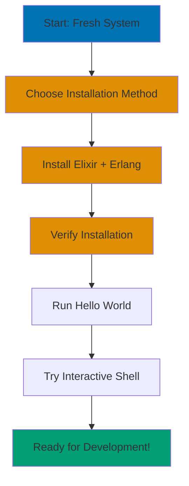

**Want to start learning Elixir but not sure how to set up your development environment?** This initial setup tutorial walks you through installing Elixir, verifying your installation, and running your first "Hello, World!" program.

## Prerequisites

**Required:**

- Basic command line familiarity (opening terminal, running commands)
- Text editor installed (VS Code, Sublime Text, Atom, or any editor you prefer)
- Internet connection for downloading installation packages

**Recommended:**

- Focused time to complete setup steps
- Note-taking app to track installation steps

**No prior programming experience required** - this tutorial assumes you're starting fresh.

## What You'll Learn

By the end of this tutorial, you will:

- Install Elixir on your operating system (macOS, Linux, or Windows)
- Verify your installation with version checks
- Understand the Elixir ecosystem components (Elixir, Erlang/OTP, Mix)
- Run your first Elixir program
- Use Interactive Elixir (IEx) shell for experimentation
- Set up a basic development environment

## Learning Path



## Coverage

This tutorial covers **0-5%** of Elixir knowledge - the essential first steps to get you started. After completing this tutorial, you'll have a working Elixir environment and understand basic development workflow.

**What's Covered:**

- Installation methods (asdf, official installer, package managers)
- Version verification
- Interactive shell (IEx)
- First program execution
- Editor setup basics

**What's NOT Covered:**

- Elixir syntax (covered in Quick Start and Beginner tutorials)
- Programming concepts (covered in Beginner tutorial)
- Advanced tooling (covered in Intermediate tutorial)

## Understanding Elixir and Erlang

Before installing, let's understand what you're installing:

**Elixir** is the programming language you'll be learning. It's designed for building scalable, maintainable applications.

**Erlang/OTP** is the platform Elixir runs on. Think of it as the foundation - Elixir code compiles to run on the Erlang Virtual Machine (BEAM). When you install Elixir, you also install Erlang.

**Why both?**

- Elixir provides modern syntax and developer-friendly tools
- Erlang/OTP provides rock-solid runtime and concurrency capabilities
- Together, they give you a powerful platform for building reliable systems

**Version Compatibility:**

This tutorial uses:

- **Elixir 1.14+** (compatible with versions 1.14 through current 1.19)
- **Erlang/OTP** compatibility depends on Elixir version:
  - Elixir 1.14: Erlang/OTP 23-26 (OTP 26 from v1.14.5)
  - Elixir 1.15-1.16: Erlang/OTP 24-26
  - Elixir 1.17-1.18: Erlang/OTP 25-27
  - Elixir 1.19: Erlang/OTP 26-28 (minimum 26.0)

Newer versions work great - these are minimum requirements.

## Installation Methods

You have three main installation approaches:

1. **asdf version manager** (Recommended for developers)
2. **Official installer** (Simplest for beginners)
3. **Package managers** (macOS: Homebrew, Linux: apt/yum, Windows: Chocolatey)

Choose based on your needs:

- **New to programming?** Use official installer
- **Managing multiple language versions?** Use asdf
- **Already use Homebrew/apt?** Use package manager

## Method 1: Official Installer (Easiest)

### macOS

1. Open Terminal
2. Run the official installation script:

```bash
curl -fsSO https://elixir-lang.org/install.sh
sh install.sh elixir@1.19.4 otp@28.1
```

3. Verify installation (see Verification section)

**Note:** This script installs both Elixir and Erlang/OTP. You can specify different versions if needed.

### Windows

1. Open PowerShell
2. Run the official installation script:

```powershell
.\install.bat elixir@1.19.4 otp@28.1
```

3. Verify installation (see Verification section)

**Note:** Download `install.bat` from [elixir-lang.org/install.html](https://elixir-lang.org/install.html) first.

### Linux

Use your distribution's package manager (see Method 3 below)

## Method 2: asdf Version Manager (Recommended)

**Why asdf?**

- Manage multiple Elixir versions side-by-side
- Switch versions per project
- Consistent across team members

### Step 1: Install asdf

**macOS/Linux:**

```bash
git clone https://github.com/asdf-vm/asdf.git ~/.asdf --branch v0.18.0

echo '. "$HOME/.asdf/asdf.sh"' >> ~/.bashrc  # For bash
echo '. "$HOME/.asdf/asdf.sh"' >> ~/.zshrc   # For zsh

source ~/.bashrc  # or source ~/.zshrc
```

**Windows:**

Use WSL (Windows Subsystem for Linux) and follow macOS/Linux instructions.

### Step 2: Install Erlang

```bash
asdf plugin add erlang

asdf install erlang 28.1

asdf global erlang 28.1
```

Erlang compiles from source (compilation may take some time depending on your system).

### Step 3: Install Elixir

```bash
asdf plugin add elixir

asdf install elixir 1.19.4

asdf global elixir 1.19.4
```

### Step 4: Verify Installation

```bash
elixir --version
```

You should see output like:

```
Erlang/OTP 28 [erts-15.0] [source] [64-bit] [smp:8:8] [ds:8:8:10] [async-threads:1]

Elixir 1.19.4 (compiled with Erlang/OTP 28)
```

## Method 3: Package Managers

### macOS (Homebrew)

```bash
/bin/bash -c "$(curl -fsSL https://raw.githubusercontent.com/Homebrew/install/HEAD/install.sh)"

brew install elixir

elixir --version
```

### Ubuntu/Debian (apt)

```bash
wget https://packages.erlang-solutions.com/erlang-solutions_2.0_all.deb
sudo dpkg -i erlang-solutions_2.0_all.deb
sudo apt-get update

sudo apt-get install esl-erlang
sudo apt-get install elixir

elixir --version
```

### Fedora/CentOS (yum)

```bash
sudo yum install erlang elixir

elixir --version
```

### Windows (Chocolatey)

```powershell
Set-ExecutionPolicy Bypass -Scope Process -Force; [System.Net.ServicePointManager]::SecurityProtocol = [System.Net.ServicePointManager]::SecurityProtocol -bor 3072; iex ((New-Object System.Net.WebClient).DownloadString('https://community.chocolatey.org/install.ps1'))

choco install elixir

elixir --version
```

## Verifying Your Installation

After installation, verify everything works:

### Check Elixir Version

```bash
elixir --version
```

**Expected output:**

```
Erlang/OTP 28 [erts-15.0] [source] [64-bit] [smp:8:8] [ds:8:8:10] [async-threads:1]

Elixir 1.19.4 (compiled with Erlang/OTP 28)
```

**What this tells you:**

- Erlang/OTP version (28 in this example)
- Elixir version (1.19.4 in this example)
- Both are installed and working

### Check Mix (Build Tool)

```bash
mix --version
```

**Expected output:**

```
Mix 1.19.4 (compiled with Erlang/OTP 28)
```

Mix is Elixir's build tool - it comes bundled with Elixir.

### Try Interactive Elixir (IEx)

```bash
iex
```

**Expected output:**

```
Erlang/OTP 28 [erts-15.0] [source] [64-bit] [smp:8:8] [ds:8:8:10] [async-threads:1]

Interactive Elixir (1.19.4) - press Ctrl+C to exit (or Ctrl+\ to quit)
iex(1)>
```

You're now in the Interactive Elixir shell! Try typing:

```elixir
iex(1)> IO.puts("Hello, Elixir!")
```

**Output:**

```
Hello, Elixir!
:ok
```

Exit IEx by pressing `Ctrl+C` twice.

## Your First Elixir Program

Let's create your first Elixir program!

### Step 1: Create a File

Open your text editor and create a file named `hello.exs`:

```elixir
IO.puts("Hello, World!")
IO.puts("Welcome to Elixir!")
```

**Note:** `.exs` extension means "Elixir script" - files meant to be run directly.

### Step 2: Run the Program

```bash
elixir hello.exs
```

**Output:**

```
Hello, World!
Welcome to Elixir!
```

**Congratulations!** You just ran your first Elixir program!

### Understanding the Code

```elixir
IO.puts("Hello, World!")
```

- `IO` - Input/Output module (handles printing to screen)
- `puts` - Function that prints text and adds a newline
- `"Hello, World!"` - String (text) to print

## Using Interactive Elixir (IEx)

IEx is your experimentation playground. It's perfect for:

- Testing code snippets
- Learning syntax
- Exploring library functions
- Debugging

### Basic IEx Commands

**Start IEx:**

```bash
iex
```

**Try some expressions:**

```elixir
iex(1)> 1 + 1
2

iex(2)> "Hello" <> " " <> "World"
"Hello World"

iex(3)> String.upcase("elixir")
"ELIXIR"
```

**Get help:**

```elixir
iex(4)> h String.upcase
```

This shows documentation for the `String.upcase` function.

**Clear screen:**

```elixir
iex(5)> clear()
```

**Exit IEx:**

- Press `Ctrl+C` twice
- Or type `System.halt()`

### IEx Tips

**Autocomplete:** Press `Tab` to autocomplete module and function names:

```elixir
iex(1)> Str[TAB]
Stream    String
```

**Previous commands:** Use Up/Down arrow keys to navigate command history.

**Multiline expressions:** IEx automatically detects incomplete expressions:

```elixir
iex(1)> [1, 2,
...(1)>  3, 4]
[1, 2, 3, 4]
```

The `...(1)>` prompt means IEx is waiting for you to complete the expression.

## Setting Up Your Editor

A good editor makes development easier. Here are popular options:

### VS Code (Recommended for Beginners)

**Why VS Code?**

- Free and open source
- Excellent Elixir support via ElixirLS extension
- Cross-platform (macOS, Windows, Linux)
- Large community and resources

**Setup:**

1. Download and install [VS Code](https://code.visualstudio.com/)
2. Install ElixirLS extension:
   - Open VS Code
   - Go to Extensions (Ctrl+Shift+X / Cmd+Shift+X)
   - Search "ElixirLS"
   - Click Install

**Features you get:**

- Syntax highlighting
- Code completion
- Inline documentation
- Error detection
- Debugging support

### Other Editors

**Emacs:**

- Install [Alchemist](https://github.com/tonini/alchemist.el)
- Powerful but steeper learning curve

**Vim:**

- Install [vim-elixir](https://github.com/elixir-editors/vim-elixir)
- Lightweight and fast

**Sublime Text:**

- Install Elixir package via Package Control
- Simple and elegant

**IntelliJ IDEA:**

- Install Elixir plugin
- Great for developers coming from Java/Kotlin

Choose based on what you're comfortable with - all work well with Elixir.

## Understanding Mix (Build Tool)

Mix is Elixir's build tool. You'll use it to:

- Create new projects
- Compile code
- Run tests
- Manage dependencies

Let's create a sample Mix project to verify everything works:

```bash
mix new hello_world
```

**Output:**

```
* creating README.md
* creating .formatter.exs
* creating .gitignore
* creating mix.exs
* creating lib
* creating lib/hello_world.ex
* creating test
* creating test/test_helper.exs
* creating test/hello_world_test.exs

Your Mix project was created successfully.
You can use "mix" to compile it, test it, and more:

    cd hello_world
    mix test

Run "mix help" for more commands.
```

**Explore the project:**

```bash
cd hello_world
ls
```

You'll see:

- `mix.exs` - Project configuration
- `lib/` - Your code goes here
- `test/` - Tests go here
- `.formatter.exs` - Code formatting rules

**Run tests:**

```bash
mix test
```

**Output:**

```
Compiling 1 file (.ex)
Generated hello_world app
..

Finished in 0.03 seconds (0.03s async, 0.00s sync)
1 doctest, 1 test, 0 failures
```

**All tests pass!** Your environment is working perfectly.

## Common Installation Issues

### Issue 1: "elixir: command not found"

**Cause:** Elixir not in system PATH.

**Solution:**

- If using asdf: Run `asdf global elixir 1.19.4` and restart terminal
- If using package manager: Restart terminal to load new PATH
- If using installer: Check installation completed successfully

### Issue 2: "Erlang/OTP version mismatch"

**Cause:** Elixir compiled for different Erlang version than installed.

**Solution:**

- Install matching Erlang version
- Or reinstall Elixir to match current Erlang

### Issue 3: "mix: command not found"

**Cause:** Mix should come with Elixir but might not be in PATH.

**Solution:**

- Verify Elixir installed correctly (`elixir --version`)
- Restart terminal
- Reinstall Elixir if issue persists

### Issue 4: IEx crashes on startup

**Cause:** Often terminal encoding issues.

**Solution:**

- macOS/Linux: Ensure UTF-8 encoding (`locale` command should show UTF-8)
- Windows: Use UTF-8 code page (`chcp 65001` before running IEx)

### Getting Help

If you encounter other issues:

1. Check [Elixir Installation Guide](https://elixir-lang.org/install.html)
2. Search [Elixir Forum](https://elixirforum.com/)
3. Ask on [Elixir Discord](https://discord.gg/elixir)
4. Review [Stack Overflow](https://stackoverflow.com/questions/tagged/elixir) Elixir tag

## What You've Accomplished

By completing this tutorial, you:

- ✅ Installed Elixir and Erlang/OTP
- ✅ Verified installation with version checks
- ✅ Ran your first Elixir program
- ✅ Used Interactive Elixir (IEx)
- ✅ Created a Mix project
- ✅ Set up a code editor for Elixir development

You now have a fully functional Elixir development environment!

## Next Steps

Now that your environment is set up, continue your learning journey:

1. **Quick Start Tutorial** - Learn 8-12 core Elixir concepts with hands-on examples
2. **Beginner Tutorial** - Master Elixir syntax and fundamental programming concepts
3. **Interactive Elixir Practice** - Use IEx to experiment with what you learn

**Recommendation:** When ready, proceed to the Quick Start tutorial. You're ready to start learning Elixir!

## Related Content

**Next Steps:**

- [Quick Start Tutorial](/en/learn/software-engineering/programming-language/elixir/tutorials/quick-start) - Learn core Elixir concepts
- [Beginner Tutorial](/en/learn/software-engineering/programming-language/elixir/tutorials/beginner) - Master Elixir fundamentals

**How-To Guides:**

- [Elixir Cookbook](/en/learn/software-engineering/programming-language/elixir/how-to/cookbook) - Practical code recipes
- [How to Debug Elixir Code](/en/learn/software-engineering/programming-language/elixir/how-to/debug-elixir-code) - Debugging techniques
- [How to Set Up Mix Project](/en/learn/software-engineering/programming-language/elixir/how-to/setup-mix-project) - Project structure
- [How to Use IEx Effectively](/en/learn/software-engineering/programming-language/elixir/how-to/use-iex-effectively) - Interactive shell tips
- [How to Manage Dependencies](/en/learn/software-engineering/programming-language/elixir/how-to/manage-dependencies) - Mix dependencies

**Explanations:**

- [Best Practices](/en/learn/software-engineering/programming-language/elixir/explanation/best-practices) - Elixir coding standards
- [Anti-Patterns](/en/learn/software-engineering/programming-language/elixir/explanation/anti-patterns) - Common mistakes

**Reference:**

- [Elixir Cheat Sheet](/en/learn/software-engineering/programming-language/elixir/reference/cheat-sheet) - Quick syntax reference
- [Elixir Glossary](/en/learn/software-engineering/programming-language/elixir/reference/glossary) - Terminology guide

---

## Additional Resources

**Official Documentation:**

- [Elixir Getting Started Guide](https://elixir-lang.org/getting-started/introduction.html)
- [Elixir Installation](https://elixir-lang.org/install.html)
- [Mix Documentation](https://hexdocs.pm/mix/)

**Tools:**

- [asdf Version Manager](https://asdf-vm.com/)
- [VS Code](https://code.visualstudio.com/)
- [ElixirLS Extension](https://marketplace.visualstudio.com/items?itemName=JakeBecker.elixir-ls)

**Community:**

- [Elixir Forum](https://elixirforum.com/)
- [Elixir Discord](https://discord.gg/elixir)

**Practice Platforms:**

- [Exercism Elixir Track](https://exercism.org/tracks/elixir) - Free coding exercises
- [Elixir School](https://elixirschool.com/) - Community-driven lessons
