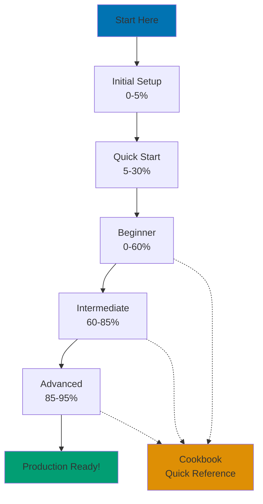

Master Elixir through progressive tutorials covering 95% of the language. From installation to advanced distributed systems.

## Tutorial Levels

We provide 5 tutorial levels with clear coverage percentages:

### Initial Setup (0-5% Coverage)

Get Elixir running on your machine and write your first program.

**What you'll learn:**

- Install Elixir and OTP
- Verify installation with version checks
- Write and run "Hello, World!"
- Use basic Mix commands and IEx

**Who it's for:** Complete beginners to Elixir

**Time investment:** Foundation for all future learning

[Start with Initial Setup →](/en/learn/software-engineering/programming-language/elixir/tutorials/initial-setup)

### Quick Start (5-30% Coverage)

Grasp core concepts quickly to become productive fast.

**What you'll learn:**

- 8-12 essential Elixir touchpoints
- Pattern matching, immutability, functions
- Basic data structures and modules
- Mix project basics

**Who it's for:** Developers who want rapid productivity

**Prerequisites:** Initial Setup completed

[Jump to Quick Start →](/en/learn/software-engineering/programming-language/elixir/tutorials/quick-start)

### Beginner Tutorial (0-60% Coverage)

Complete foundation in Elixir fundamentals.

**What you'll learn:**

- Full syntax coverage
- Data structures (lists, tuples, maps, structs)
- Pattern matching and guards
- Recursion and comprehensions
- Modules, protocols, and behaviours
- Testing with ExUnit

**Who it's for:** Building strong fundamentals

**Prerequisites:** None (comprehensive from basics)

[Study Beginner Tutorial →](/en/learn/software-engineering/programming-language/elixir/tutorials/beginner)

### Intermediate Tutorial (60-85% Coverage)

Production-ready skills with OTP and Phoenix.

**What you'll learn:**

- Processes and message passing
- GenServer for state management
- Supervisors and fault tolerance
- Phoenix framework and LiveView
- Ecto for database access
- Configuration and testing strategies

**Who it's for:** Building production applications

**Prerequisites:** Beginner tutorial or equivalent experience

[Advance to Intermediate →](/en/learn/software-engineering/programming-language/elixir/tutorials/intermediate)

### Advanced Tutorial (85-95% Coverage)

Expert-level optimization and distributed systems.

**What you'll learn:**

- BEAM VM internals (scheduler, processes, GC)
- Distributed Elixir and multi-node systems
- Metaprogramming and macros
- Performance profiling and optimization
- Umbrella projects
- Deployment strategies with Mix releases

**Who it's for:** Optimizing critical systems

**Prerequisites:** Intermediate tutorial mastery

[Master Advanced Topics →](/en/learn/software-engineering/programming-language/elixir/tutorials/advanced)

## Learning Path Visualization

## How to Use These Tutorials

**For Complete Beginners:**

1. Start with Initial Setup
2. Follow to Quick Start
3. Complete Beginner tutorial with exercises
4. Practice with Cookbook recipes
5. Advance to Intermediate when ready

**For Experienced Programmers:**

1. Skim Initial Setup for installation
2. Work through Quick Start (focus on Elixir idioms)
3. Jump to Intermediate for Phoenix/OTP
4. Reference Beginner for syntax questions

**For OOP Developers Transitioning:**

- Pay attention to "OOP vs FP" comparisons in tutorials
- Study pattern matching (replaces many OOP patterns)
- Understand processes vs objects
- Read Anti-Patterns guide alongside tutorials

## Coverage Percentages Explained

Coverage percentages represent depth of knowledge, not time:

- **0-5%**: Minimal setup, "Hello, World!"
- **5-30%**: Productive quickly with common patterns
- **0-60%**: Solid foundation for most applications
- **60-85%**: Production-ready web and OTP systems
- **85-95%**: Optimization and advanced architecture

The remaining 5% includes specialized topics (e.g., Nerves for embedded, Broadway for data pipelines) covered in future dedicated guides.

## Next Steps After Tutorials

1. **Apply Knowledge**: Build a project (Phoenix web app, CLI tool)
2. **Deepen Understanding**: Read Explanation documents
3. **Solve Problems**: Use How-To Guides and Cookbook
4. **Stay Current**: Follow Elixir Forum, ElixirConf talks

Ready to begin? [Start with Initial Setup →](/en/learn/software-engineering/programming-language/elixir/tutorials/initial-setup)
