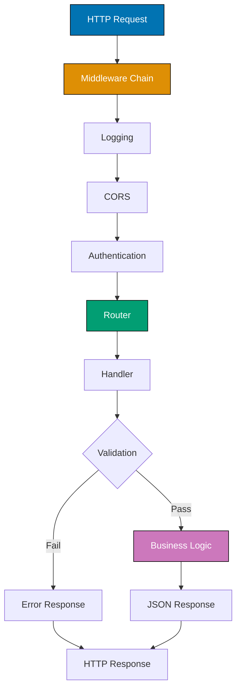

## Problem

Building RESTful APIs requires handling HTTP requests, routing, JSON serialization, validation, and error handling consistently. The standard library is low-level, requiring significant boilerplate.

```go
// Problematic approach - no structure
http.HandleFunc("/users", func(w http.ResponseWriter, r *http.Request) {
    // All HTTP methods in one handler
    // No validation, poor error handling
    fmt.Fprintf(w, "Users endpoint")
})
```

This guide shows practical techniques for building production-ready REST APIs in Go.

## Solution

### 1. Basic REST API Structure

**Simple REST API with net/http**:

```go
package main

import (
    "encoding/json"
    "log"
    "net/http"
    "strconv"
    "sync"
)

type User struct {
    ID       int    `json:"id"`
    Username string `json:"username"`
    Email    string `json:"email"`
}

type UserStore struct {
    mu    sync.RWMutex
    users map[int]User
    nextID int
}

func NewUserStore() *UserStore {
    return &UserStore{
        users: make(map[int]User),
        nextID: 1,
    }
}

func (s *UserStore) Create(user User) User {
    s.mu.Lock()
    defer s.mu.Unlock()

    user.ID = s.nextID
    s.users[user.ID] = user
    s.nextID++
    return user
}

func (s *UserStore) GetAll() []User {
    s.mu.RLock()
    defer s.mu.RUnlock()

    users := make([]User, 0, len(s.users))
    for _, user := range s.users {
        users = append(users, user)
    }
    return users
}

func (s *UserStore) Get(id int) (User, bool) {
    s.mu.RLock()
    defer s.mu.RUnlock()

    user, exists := s.users[id]
    return user, exists
}

type Server struct {
    store *UserStore
}

func (s *Server) handleUsers(w http.ResponseWriter, r *http.Request) {
    switch r.Method {
    case http.MethodGet:
        s.getUsers(w, r)
    case http.MethodPost:
        s.createUser(w, r)
    default:
        respondError(w, http.StatusMethodNotAllowed, "method not allowed")
    }
}

func (s *Server) getUsers(w http.ResponseWriter, r *http.Request) {
    users := s.store.GetAll()
    respondJSON(w, http.StatusOK, users)
}

func (s *Server) createUser(w http.ResponseWriter, r *http.Request) {
    var user User
    if err := json.NewDecoder(r.Body).Decode(&user); err != nil {
        respondError(w, http.StatusBadRequest, "invalid request body")
        return
    }

    if user.Username == "" || user.Email == "" {
        respondError(w, http.StatusBadRequest, "username and email required")
        return
    }

    created := s.store.Create(user)
    respondJSON(w, http.StatusCreated, created)
}

func (s *Server) handleUser(w http.ResponseWriter, r *http.Request) {
    // Extract ID from path (simple parsing)
    idStr := r.URL.Path[len("/users/"):]
    id, err := strconv.Atoi(idStr)
    if err != nil {
        respondError(w, http.StatusBadRequest, "invalid user id")
        return
    }

    switch r.Method {
    case http.MethodGet:
        s.getUser(w, r, id)
    case http.MethodDelete:
        s.deleteUser(w, r, id)
    default:
        respondError(w, http.StatusMethodNotAllowed, "method not allowed")
    }
}

func (s *Server) getUser(w http.ResponseWriter, r *http.Request, id int) {
    user, exists := s.store.Get(id)
    if !exists {
        respondError(w, http.StatusNotFound, "user not found")
        return
    }
    respondJSON(w, http.StatusOK, user)
}

func respondJSON(w http.ResponseWriter, status int, data interface{}) {
    w.Header().Set("Content-Type", "application/json")
    w.WriteHeader(status)
    json.NewEncoder(w).Encode(data)
}

func respondError(w http.ResponseWriter, status int, message string) {
    respondJSON(w, status, map[string]string{"error": message})
}

func main() {
    server := &Server{store: NewUserStore()}

    http.HandleFunc("/users", server.handleUsers)
    http.HandleFunc("/users/", server.handleUser)

    log.Println("Server starting on :8080")
    log.Fatal(http.ListenAndServe(":8080", nil))
}
```

### 2. Router with gorilla/mux

**Advanced routing**:

```go
import "github.com/gorilla/mux"

func setupRouter() *mux.Router {
    r := mux.NewRouter()

    // Route with path variables
    r.HandleFunc("/users/{id:[0-9]+}", getUser).Methods("GET")
    r.HandleFunc("/users/{id:[0-9]+}", updateUser).Methods("PUT")
    r.HandleFunc("/users/{id:[0-9]+}", deleteUser).Methods("DELETE")
    r.HandleFunc("/users", createUser).Methods("POST")
    r.HandleFunc("/users", listUsers).Methods("GET")

    // Query parameters
    r.HandleFunc("/search", searchUsers).Methods("GET")

    // Subrouters
    api := r.PathPrefix("/api/v1").Subrouter()
    api.HandleFunc("/users", listUsers).Methods("GET")

    return r
}

func getUser(w http.ResponseWriter, r *http.Request) {
    vars := mux.Vars(r)
    id := vars["id"]

    // Use id
    respondJSON(w, http.StatusOK, map[string]string{"id": id})
}

func searchUsers(w http.ResponseWriter, r *http.Request) {
    query := r.URL.Query()
    email := query.Get("email")
    name := query.Get("name")

    // Search with parameters
    respondJSON(w, http.StatusOK, map[string]string{
        "email": email,
        "name": name,
    })
}
```

### 3. Middleware Pattern

**HTTP middleware**:

```go
type Middleware func(http.Handler) http.Handler

func loggingMiddleware(next http.Handler) http.Handler {
    return http.HandlerFunc(func(w http.ResponseWriter, r *http.Request) {
        log.Printf("%s %s %s", r.RemoteAddr, r.Method, r.URL.Path)
        next.ServeHTTP(w, r)
    })
}

func authMiddleware(next http.Handler) http.Handler {
    return http.HandlerFunc(func(w http.ResponseWriter, r *http.Request) {
        token := r.Header.Get("Authorization")
        if token != "Bearer secret-token" {
            respondError(w, http.StatusUnauthorized, "unauthorized")
            return
        }
        next.ServeHTTP(w, r)
    })
}

func corsMiddleware(next http.Handler) http.Handler {
    return http.HandlerFunc(func(w http.ResponseWriter, r *http.Request) {
        w.Header().Set("Access-Control-Allow-Origin", "*")
        w.Header().Set("Access-Control-Allow-Methods", "GET, POST, PUT, DELETE")
        w.Header().Set("Access-Control-Allow-Headers", "Content-Type, Authorization")

        if r.Method == "OPTIONS" {
            w.WriteHeader(http.StatusOK)
            return
        }

        next.ServeHTTP(w, r)
    })
}

func chainMiddleware(h http.Handler, middlewares ...Middleware) http.Handler {
    for i := len(middlewares) - 1; i >= 0; i-- {
        h = middlewares[i](h)
    }
    return h
}

func main() {
    r := setupRouter()

    handler := chainMiddleware(r,
        loggingMiddleware,
        corsMiddleware,
        authMiddleware,
    )

    log.Fatal(http.ListenAndServe(":8080", handler))
}
```

### 4. Request Validation

**Input validation**:

```go
import "github.com/go-playground/validator/v10"

type CreateUserRequest struct {
    Username string `json:"username" validate:"required,min=3,max=50"`
    Email    string `json:"email" validate:"required,email"`
    Age      int    `json:"age" validate:"gte=18,lte=120"`
}

var validate = validator.New()

func createUserHandler(w http.ResponseWriter, r *http.Request) {
    var req CreateUserRequest
    if err := json.NewDecoder(r.Body).Decode(&req); err != nil {
        respondError(w, http.StatusBadRequest, "invalid JSON")
        return
    }

    if err := validate.Struct(req); err != nil {
        errors := make(map[string]string)
        for _, err := range err.(validator.ValidationErrors) {
            errors[err.Field()] = err.Tag()
        }
        respondJSON(w, http.StatusBadRequest, map[string]interface{}{
            "error": "validation failed",
            "fields": errors,
        })
        return
    }

    // Create user
    respondJSON(w, http.StatusCreated, req)
}
```

## How It Works

### HTTP Request Flow



## Variations

### Chi Router

```go
import "github.com/go-chi/chi/v5"

r := chi.NewRouter()
r.Use(middleware.Logger)
r.Use(middleware.Recoverer)

r.Route("/users", func(r chi.Router) {
    r.Get("/", listUsers)
    r.Post("/", createUser)

    r.Route("/{userID}", func(r chi.Router) {
        r.Get("/", getUser)
        r.Put("/", updateUser)
        r.Delete("/", deleteUser)
    })
})
```

### Gin Framework

```go
import "github.com/gin-gonic/gin"

r := gin.Default()

r.GET("/users/:id", func(c *gin.Context) {
    id := c.Param("id")
    c.JSON(200, gin.H{"id": id})
})

r.POST("/users", func(c *gin.Context) {
    var user User
    if err := c.ShouldBindJSON(&user); err != nil {
        c.JSON(400, gin.H{"error": err.Error()})
        return
    }
    c.JSON(201, user)
})
```

## Common Pitfalls

**Pitfall 1: Not Handling Errors**

```go
// Bad
json.NewDecoder(r.Body).Decode(&user)

// Good
if err := json.NewDecoder(r.Body).Decode(&user); err != nil {
    respondError(w, http.StatusBadRequest, "invalid JSON")
    return
}
```

**Pitfall 2: Missing Content-Type**

```go
// Bad
json.NewEncoder(w).Encode(data)

// Good
w.Header().Set("Content-Type", "application/json")
w.WriteHeader(http.StatusOK)
json.NewEncoder(w).Encode(data)
```

**Pitfall 3: Not Closing Request Body**

```go
// Good practice
defer r.Body.Close()
```

## Related Patterns

**Related Tutorial**: See [Intermediate Tutorial - Web Development](/en/learn/software-engineering/programming-language/golang/tutorials/intermediate#web) and [Beginner Tutorial - HTTP Basics](/en/learn/software-engineering/programming-language/golang/tutorials/beginner#http).

**Related How-To**: See [Implement Middleware](/en/learn/software-engineering/programming-language/golang/how-to/implement-middleware) and [Work with JSON](/en/learn/software-engineering/programming-language/golang/how-to/work-with-json-effectively).

**Related Cookbook**: See Cookbook recipes "REST API Patterns", "Request Validation", "Error Handling".

## Further Reading

- [net/http Documentation](https://pkg.go.dev/net/http)
- [gorilla/mux](https://github.com/gorilla/mux)
- [Go REST API Tutorial](https://go.dev/doc/tutorial/web-service-gin)
